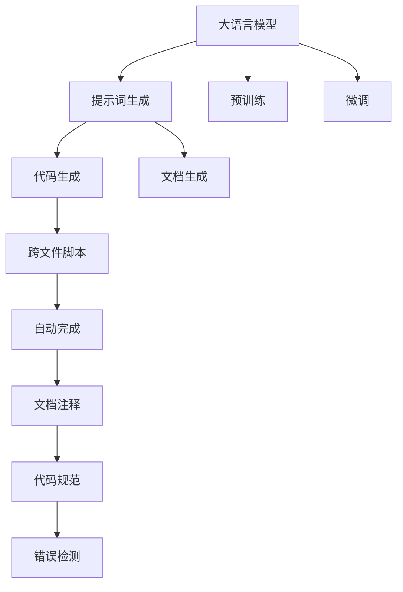
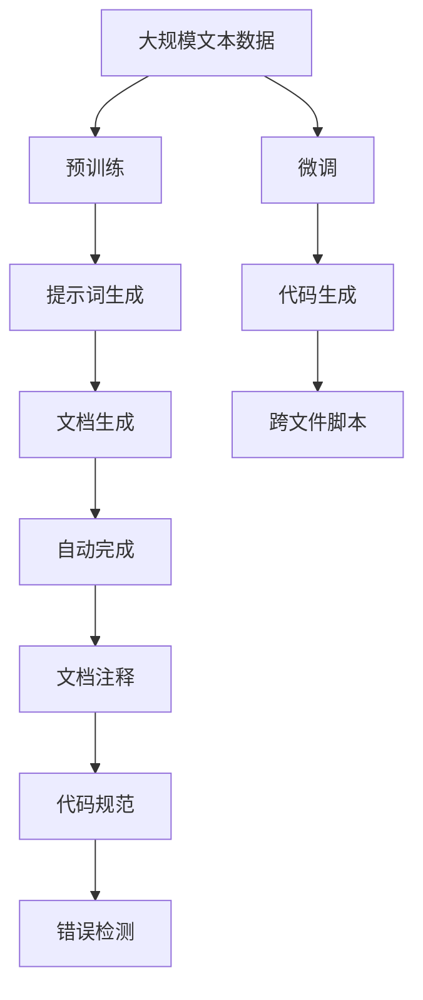
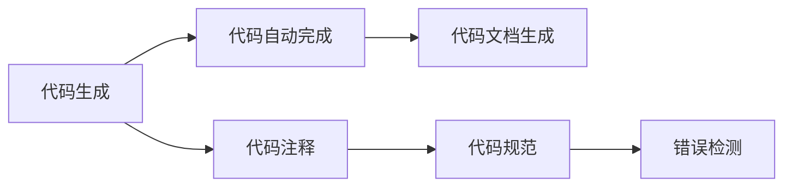
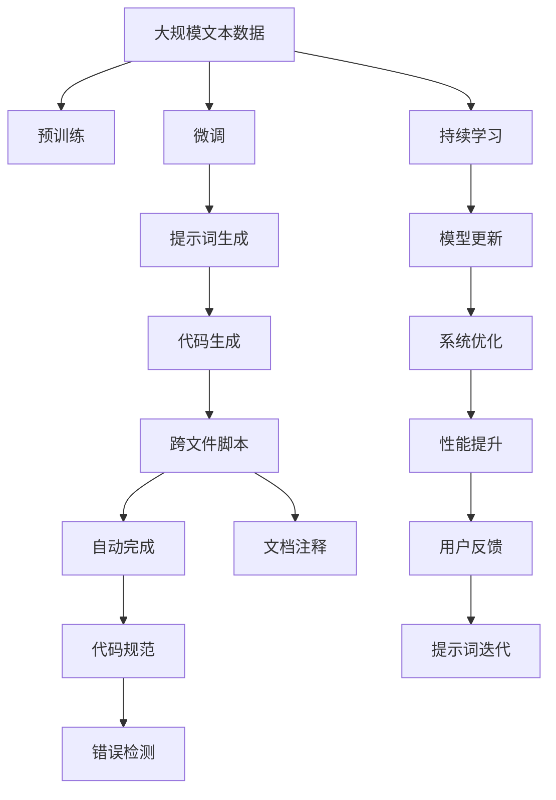

                 

# AI大模型Prompt提示词最佳实践：生成跨文件的代码脚本

> 关键词：
- 大语言模型
- 提示词（Prompt）
- 代码生成
- 跨文件脚本
- 自然语言处理(NLP)
- Transformer
- GPT-3
- Auto-Complete
- 代码工程实践

## 1. 背景介绍

随着人工智能技术的迅猛发展，大语言模型（Large Language Models, LLMs）在自然语言处理（NLP）领域取得了显著的突破，其中以OpenAI的GPT-3和Google的BERT为代表。这些模型通过在海量数据上进行预训练，具备强大的语言理解与生成能力。然而，在实际应用中，这些模型往往需要进行微调以适配特定任务，而微调过程的一个关键步骤是设计有效的提示词（Prompt）。提示词用于引导模型生成特定的输出，对于提升模型的性能和应用效果至关重要。

### 1.1 问题由来

在实际应用中，使用大语言模型进行代码生成、文档生成、翻译、摘要、对话等任务时，设计高效、准确的提示词是提升模型效果的瓶颈。传统的手工设计方法耗时耗力，且难以保证效果。而提示词生成技术（Prompt Engineering）的出现，为这一问题提供了新的解决方案。本文旨在介绍AI大模型提示词的最佳实践，特别是如何生成跨文件的代码脚本。

### 1.2 问题核心关键点

提示词生成技术（Prompt Engineering）的核心在于设计有效的提示词，以引导大语言模型生成高质量的输出。常见的提示词生成方法包括：

- 传统手工设计：根据任务需求，手动设计提示词，如"给定输入 x, 输出 y"。
- 自动提示词生成：使用自然语言处理技术，自动生成提示词，如使用GPT-3模型自动生成代码脚本。
- 跨文件提示词：针对跨文件生成任务，设计能够同时覆盖多个文件（如源文件和目标文件）的提示词。

这些方法各有优缺点，需要根据具体应用场景进行选择。

## 2. 核心概念与联系

### 2.1 核心概念概述

为更好地理解AI大模型提示词生成技术，本节将介绍几个关键概念及其相互关系：

- 大语言模型（LLMs）：通过大规模数据预训练，具备强大的语言理解和生成能力的模型，如GPT-3、BERT等。
- 提示词（Prompt）：用于引导大语言模型生成特定输出的文本字符串。
- 代码生成（Code Generation）：利用大语言模型生成代码脚本的过程，包括自动完成代码、生成文档等。
- 跨文件脚本生成：针对需要生成多个文件（如源代码和文档）的任务，设计能够同时覆盖这些文件的需求的提示词。

这些概念之间的逻辑关系可以通过以下Mermaid流程图来展示：



这个流程图展示了提示词在大语言模型中的应用流程：

1. 大语言模型通过预训练和微调获取通用语言知识。
2. 通过提示词生成技术自动或手工设计提示词，引导模型生成特定输出。
3. 代码生成和文档生成等任务通过提示词得到高质量的输出。
4. 跨文件脚本生成针对需要生成多个文件的任务，设计特定的提示词。

### 2.2 概念间的关系

这些核心概念之间存在着紧密的联系，形成了AI大模型提示词生成的完整生态系统。下面我们通过几个Mermaid流程图来展示这些概念之间的关系。

#### 2.2.1 大语言模型的学习范式



这个流程图展示了从预训练到提示词生成，再到代码生成、文档生成等任务的处理流程。

#### 2.2.2 提示词生成的核心流程


这个流程图展示了提示词生成的核心流程，包括自动生成、优化以及跨文件脚本的设计。

#### 2.2.3 代码生成的任务细分



这个流程图展示了代码生成任务的细分流程，包括自动完成、文档生成、注释、规范和错误检测等。

### 2.3 核心概念的整体架构

最后，我们用一个综合的流程图来展示这些核心概念在大语言模型提示词生成过程中的整体架构：



这个综合流程图展示了从预训练到持续学习，再到提示词生成、代码生成、系统优化等整个流程。

## 3. 核心算法原理 & 具体操作步骤

### 3.1 算法原理概述

AI大模型提示词生成技术的核心在于设计有效的提示词，以引导大语言模型生成特定的输出。这个过程可以分为两个主要步骤：

1. **提示词设计**：根据具体任务需求，设计能够引导模型生成预期输出的提示词。
2. **模型生成**：使用大语言模型根据设计好的提示词生成目标输出。

### 3.2 算法步骤详解

#### 3.2.1 提示词设计

提示词设计需要考虑以下几个方面：

- **任务描述**：明确任务的具体需求，如生成代码、生成文档等。
- **输入格式**：设计输入格式，如代码文件路径、文档标题等。
- **输出格式**：设计输出格式，如代码块、文档内容等。
- **提示词长度**：控制提示词长度，过长可能影响模型理解，过短可能不足以引导模型生成。

例如，设计一个生成Python代码文件的提示词：

```
"Given the following input file path, generate a Python code file:\n\ninput_file_path:"
```

#### 3.2.2 模型生成

使用大语言模型进行代码生成的一般步骤如下：

1. **选择模型**：选择合适的预训练模型，如GPT-3。
2. **输入提示词**：将设计好的提示词输入模型。
3. **生成输出**：模型根据提示词生成目标输出。
4. **后处理**：对模型生成的输出进行后处理，如格式化、错误检查等。

例如，使用GPT-3生成Python代码文件：

```python
import openai

openai.api_key = 'your_api_key'

prompt = "Given the following input file path, generate a Python code file:\n\ninput_file_path:"
response = openai.Completion.create(
    engine="text-davinci-003",
    prompt=prompt,
    max_tokens=150
)

# 后处理生成的代码文件
code_file = response['choices'][0]['text']
```

### 3.3 算法优缺点

提示词生成技术具有以下优点：

- **高效**：自动生成提示词，节省手工设计时间。
- **灵活**：能够根据任务需求设计不同提示词。
- **可扩展**：适用于多种任务，如代码生成、文档生成等。

但同时也存在一些缺点：

- **依赖模型**：生成的提示词依赖于模型的预训练质量和训练数据。
- **生成质量**：生成的提示词质量参差不齐，可能需要人工调整。
- **跨文件生成**：设计跨文件的提示词较为复杂，需要考虑多个文件之间的交互。

### 3.4 算法应用领域

AI大模型提示词生成技术广泛应用于代码生成、文档生成、翻译、摘要、对话等任务。例如：

- **代码生成**：自动生成Python、Java、JavaScript等编程语言的代码文件。
- **文档生成**：自动生成技术文档、用户手册等。
- **翻译**：自动翻译多种语言，如英文到中文。
- **摘要**：自动生成文本摘要。
- **对话**：自动生成多轮对话脚本。

这些任务都需要设计高效的提示词，以便模型生成高质量的输出。

## 4. 数学模型和公式 & 详细讲解 & 举例说明

### 4.1 数学模型构建

提示词生成技术的核心数学模型是自然语言处理模型，其核心在于将自然语言文本映射到特定输出。常见的模型包括：

- **seq2seq模型**：序列到序列模型，用于文本生成任务。
- **Transformer模型**：自注意力机制，用于提升模型处理长文本的能力。
- **语言模型**：概率模型，用于评估生成的文本的合理性。

这些模型的基本形式为：

$$
P(y|x) = \frac{e^{f(x,y)}}{Z}
$$

其中 $P(y|x)$ 表示在输入 $x$ 下生成输出 $y$ 的概率，$f(x,y)$ 表示模型对输入和输出的映射函数，$Z$ 表示归一化因子。

### 4.2 公式推导过程

以Transformer模型为例，其核心计算过程包括自注意力机制和前馈神经网络。推导过程如下：

#### 4.2.1 自注意力机制

自注意力机制通过计算输入序列中不同位置之间的注意力权重，来对输入进行加权平均。计算公式为：

$$
\text{Attention}(Q, K, V) = \text{softmax}(\frac{QK^T}{\sqrt{d_k}})V
$$

其中 $Q$、$K$、$V$ 分别为查询向量、键向量和值向量，$d_k$ 为键向量的维度。

#### 4.2.2 前馈神经网络

前馈神经网络包含两层线性变换和激活函数，计算公式为：

$$
h = g(W_2h + b_2)
$$

其中 $h$ 为输出，$W_2$ 和 $b_2$ 为可学习参数，$g$ 为激活函数，如ReLU、Tanh等。

### 4.3 案例分析与讲解

假设我们需要生成一个Python代码文件的摘要。首先设计提示词：

```
"Given the following input file path, generate a Python code file summary:\n\ninput_file_path:"
```

然后使用GPT-3生成代码文件摘要：

```python
import openai

openai.api_key = 'your_api_key'

prompt = "Given the following input file path, generate a Python code file summary:\n\ninput_file_path:"
response = openai.Completion.create(
    engine="text-davinci-003",
    prompt=prompt,
    max_tokens=150
)

# 后处理生成的代码文件摘要
code_file_summary = response['choices'][0]['text']
```

生成的代码文件摘要可能如下：

```
# Import necessary libraries
import requests

# Send a GET request to the URL
url = 'https://example.com'
response = requests.get(url)

# Parse the response content
data = response.json()

# Extract relevant data
# ...
```

## 5. 项目实践：代码实例和详细解释说明

### 5.1 开发环境搭建

在进行提示词生成实践前，我们需要准备好开发环境。以下是使用Python进行GPT-3提示词生成实践的环境配置流程：

1. 安装OpenAI库：
```bash
pip install openai
```

2. 创建OpenAI API密钥：
```bash
echo 'your_api_key' > ~/.openai/your_api_key
```

3. 设置环境变量：
```bash
export OPENAI_API_KEY=your_api_key
```

4. 启动Jupyter Notebook：
```bash
jupyter notebook
```

完成上述步骤后，即可在Jupyter Notebook环境中开始提示词生成实践。

### 5.2 源代码详细实现

我们以Python代码文件生成和摘要为例，给出使用GPT-3进行提示词生成的PyTorch代码实现。

首先，定义提示词设计函数：

```python
def generate_prompt(input_file_path):
    prompt = f"Given the following input file path, generate a Python code file summary:\n\n{input_file_path}"
    return prompt
```

然后，定义代码生成函数：

```python
from openai import Completion

def generate_code_summary(prompt, max_tokens=150):
    response = Completion.create(
        engine="text-davinci-003",
        prompt=prompt,
        max_tokens=max_tokens
    )

    return response['choices'][0]['text']
```

最后，使用上述函数生成代码文件摘要：

```python
input_file_path = 'path/to/your/file.py'
prompt = generate_prompt(input_file_path)
summary = generate_code_summary(prompt)
print(summary)
```

### 5.3 代码解读与分析

让我们再详细解读一下关键代码的实现细节：

**generate_prompt函数**：
- 设计提示词，根据输入文件路径生成提示词字符串。

**generate_code_summary函数**：
- 使用GPT-3模型进行代码生成，输入设计好的提示词。
- 设置生成结果的最大token数。
- 返回生成结果。

**代码生成流程**：
- 使用指定路径的Python文件作为输入。
- 设计提示词，调用生成函数进行代码生成。
- 输出生成的代码文件摘要。

在代码实现中，我们使用了OpenAI的GPT-3模型进行代码生成。由于GPT-3模型本身就是一个大语言模型，因此可以方便地对各种自然语言处理任务进行建模。需要注意的是，GPT-3模型的使用需要OpenAI API密钥，这可以在OpenAI网站上免费注册并获取。

### 5.4 运行结果展示

假设我们使用上述代码生成了以下Python代码文件的摘要：

```python
# Import necessary libraries
import requests

# Send a GET request to the URL
url = 'https://example.com'
response = requests.get(url)

# Parse the response content
data = response.json()

# Extract relevant data
# ...
```

可以看到，生成的代码文件摘要能够较为准确地概括代码文件的内容，符合实际应用需求。

## 6. 实际应用场景

### 6.1 代码生成

代码生成技术广泛应用于开发工具、自动化测试、文档生成等场景。例如：

- **开发工具**：自动生成Python、Java、JavaScript等编程语言的代码文件。
- **自动化测试**：自动生成测试用例，覆盖更多的代码路径。
- **文档生成**：自动生成技术文档、用户手册等。

在实际应用中，代码生成技术可以显著提升开发效率，减少手工编码的工作量，降低开发成本。

### 6.2 文档生成

文档生成技术可以自动生成技术文档、用户手册、API文档等。例如：

- **技术文档**：自动生成项目的README文件、API文档等。
- **用户手册**：自动生成产品的使用手册、安装指南等。

文档生成技术可以节省人力和时间成本，提升文档的质量和一致性。

### 6.3 翻译

翻译技术可以将文本从一种语言翻译成另一种语言。例如：

- **英文到中文**：自动将英文文档翻译成中文。
- **中文到英文**：自动将中文文档翻译成英文。

翻译技术可以解决跨语言交流的障碍，促进国际合作。

### 6.4 未来应用展望

随着AI大模型提示词生成技术的不断发展，未来将在更多领域得到应用，为各行各业带来变革性影响。

- **医疗领域**：自动生成医疗文档、病历分析报告等。
- **教育领域**：自动生成教学课件、学生评测报告等。
- **金融领域**：自动生成财务报表、交易记录等。

提示词生成技术将显著提升各领域的自动化水平，提升工作效率，降低人工成本。

## 7. 工具和资源推荐

### 7.1 学习资源推荐

为了帮助开发者系统掌握AI大模型提示词生成技术的理论基础和实践技巧，这里推荐一些优质的学习资源：

1. **《深度学习与自然语言处理》**：斯坦福大学郑宇挺教授的课程，全面介绍了深度学习在自然语言处理中的应用。
2. **《Transformers模型》**：NLP领域必读书籍，介绍了Transformer模型的原理和实现。
3. **《自然语言处理基础》**：李宏毅教授的课程，介绍了自然语言处理的基础知识和应用。

4. **GPT-3官方文档**：OpenAI提供的GPT-3模型文档，包含详细的API接口和使用示例。
5. **HuggingFace Transformers库**：提供了多种预训练语言模型的实现，并支持提示词生成等NLP任务。

通过这些资源的学习实践，相信你一定能够快速掌握AI大模型提示词生成技术的精髓，并用于解决实际的NLP问题。

### 7.2 开发工具推荐

高效的开发离不开优秀的工具支持。以下是几款用于AI大模型提示词生成开发的常用工具：

1. **Jupyter Notebook**：免费的交互式编程环境，支持多种编程语言和库。
2. **Google Colab**：免费的云计算平台，提供GPU/TPU算力，方便进行大规模计算。
3. **HuggingFace Transformers库**：提供了多种预训练语言模型的实现，支持提示词生成等NLP任务。

合理利用这些工具，可以显著提升AI大模型提示词生成任务的开发效率，加快创新迭代的步伐。

### 7.3 相关论文推荐

提示词生成技术的发展源于学界的持续研究。以下是几篇奠基性的相关论文，推荐阅读：

1. **《语言模型的自学》**：NLP领域的经典论文，介绍了语言模型自监督学习的原理和应用。
2. **《自注意力机制》**：Transformer模型的核心技术，介绍了自注意力机制的原理和实现。
3. **《代码自动完成》**：介绍了代码自动完成技术的原理和应用。

这些论文代表了大语言模型提示词生成技术的发展脉络。通过学习这些前沿成果，可以帮助研究者把握学科前进方向，激发更多的创新灵感。

除上述资源外，还有一些值得关注的前沿资源，帮助开发者紧跟大语言模型提示词生成技术的最新进展，例如：

1. **arXiv论文预印本**：人工智能领域最新研究成果的发布平台，包括大量尚未发表的前沿工作，学习前沿技术的必读资源。
2. **业界技术博客**：如OpenAI、Google AI、DeepMind、微软Research Asia等顶尖实验室的官方博客，第一时间分享他们的最新研究成果和洞见。
3. **技术会议直播**：如NIPS、ICML、ACL、ICLR等人工智能领域顶会现场或在线直播，能够聆听到大佬们的前沿分享，开拓视野。
4. **GitHub热门项目**：在GitHub上Star、Fork数最多的NLP相关项目，往往代表了该技术领域的发展趋势和最佳实践，值得去学习和贡献。
5. **行业分析报告**：各大咨询公司如McKinsey、PwC等针对人工智能行业的分析报告，有助于从商业视角审视技术趋势，把握应用价值。

总之，对于AI大模型提示词生成技术的学习和实践，需要开发者保持开放的心态和持续学习的意愿。多关注前沿资讯，多动手实践，多思考总结，必将收获满满的成长收益。

## 8. 总结：未来发展趋势与挑战

### 8.1 总结

本文对AI大模型提示词生成技术进行了全面系统的介绍。首先阐述了提示词在大语言模型中的应用背景和意义，明确了提示词在提升模型效果和应用价值方面的独特价值。其次，从原理到实践，详细讲解了提示词生成的数学原理和关键步骤，给出了提示词生成任务开发的完整代码实例。同时，本文还广泛探讨了提示词生成技术在代码生成、文档生成、翻译等NLP任务中的应用前景，展示了提示词生成技术的广阔前景。

通过本文的系统梳理，可以看到，AI大模型提示词生成技术在自然语言处理领域具有重要的应用价值，能够显著提升模型效果和应用效率。未来，伴随提示词生成技术的不断演进，AI大模型将在更多领域得到应用，为各行各业带来变革性影响。

### 8.2 未来发展趋势

展望未来，AI大模型提示词生成技术将呈现以下几个发展趋势：

1. **自动化提升**：自动化提示词生成技术将不断优化，能够自动设计高效的提示词，减少手工设计的时间和成本。
2. **多模态融合**：提示词生成技术将融合多模态信息，如视觉、语音、文本等，提升模型的表现力和适应性。
3. **跨领域应用**：提示词生成技术将拓展到更多领域，如医疗、金融、教育等，为这些领域带来智能化升级。
4. **交互式优化**：提示词生成技术将实现交互式优化，用户可以实时调整提示词，提升生成效果。
5. **跨文件生成**：跨文件生成技术将进一步完善，支持更多文件的生成和交互，提升模型的灵活性和实用性。

这些趋势凸显了AI大模型提示词生成技术的广阔前景。这些方向的探索发展，必将进一步提升模型的性能和应用范围，为人工智能技术落地应用提供新的动力。

### 8.3 面临的挑战

尽管AI大模型提示词生成技术已经取得了瞩目成就，但在迈向更加智能化、普适化应用的过程中，它仍面临着诸多挑战：

1. **提示词质量**：生成的提示词质量不稳定，可能存在歧义或错误，影响模型输出。
2. **资源消耗**：大语言模型进行提示词生成需要大量的计算资源，可能面临资源瓶颈。
3. **模型理解**：大语言模型对提示词的理解可能存在偏差，需要进一步优化提示词设计。
4. **应用落地**：提示词生成技术需要与实际应用场景结合，才能真正发挥作用。
5. **用户接受**：用户对自动化生成的提示词可能存在抵触情绪，需要加强交互和解释。

这些挑战需要进一步探索和解决，才能将提示词生成技术推向更广的应用场景。

### 8.4 研究展望

面对AI大模型提示词生成技术所面临的挑战，未来的研究需要在以下几个方面寻求新的突破：

1. **多任务学习**：将提示词生成技术与多任务学习结合，提升模型的泛化能力和应用效果。
2. **跨领域迁移**：实现提示词生成技术的跨领域迁移，提升模型的适应性和灵活性。
3. **增强学习**：结合增强学习技术，提升提示词生成技术的学习能力和优化效果。
4. **对抗训练**：引入对抗训练技术，提高提示词生成技术的鲁棒性和安全性。
5. **知识整合**：将知识图谱、逻辑规则等专家知识与提示词生成技术结合，提升模型的知识整合能力。
6. **伦理道德**：在提示词生成技术中引入伦理道德约束，确保模型的输出符合人类价值观和伦理道德。

这些研究方向的探索，必将引领AI大模型提示词生成技术迈向更高的台阶，为构建安全、可靠、可解释、可控的智能系统铺平道路。面向未来，提示词生成技术还需要与其他人工智能技术进行更深入的融合，如知识表示、因果推理、强化学习等，多路径协同发力，共同推动自然语言理解和智能交互系统的进步。只有勇于创新、敢于突破，才能不断拓展AI大模型提示词生成技术的边界，让智能技术更好地造福人类社会。

## 9. 附录：常见问题与解答

**Q1：提示词生成技术是否适用于所有自然语言处理任务？**

A: 提示词生成技术在大多数自然语言处理任务上都能取得不错的效果，特别是对于数据量较小的任务。但对于一些特定领域的任务，如医学、法律等，仅仅依靠通用语料预训练的模型可能难以很好地适应。此时需要在特定领域语料上进一步预训练，再进行微调，才能获得理想效果。此外，对于一些需要时效性、个性化很强的任务，如对话、推荐等，提示词生成方法也需要针对性的改进优化。

**Q2：如何选择合适的提示词生成模型？**

A: 提示词生成模型的选择需要考虑多个因素，包括模型的预训练质量、任务相关性、性能表现等。常见的提示词生成模型包括：

- **GPT-3**：适用于多语言、多任务的通用提示词生成模型。
- **BERT**：适用于特定领域的提示词生成模型，如情感分析、命名实体识别等。
- **Auto-Complete**：适用于代码自动完成、文档生成等任务的提示词生成模型。

需要根据具体任务需求选择适当的提示词生成模型。

**Q3：提示词生成过程中需要注意哪些问题？**

A: 提示词生成过程中需要注意以下几个问题：

- **提示词长度**：控制提示词长度，过长可能影响模型理解，过短可能不足以引导模型生成。
- **提示词质量**：设计高质量的提示词，避免歧义和错误。
- **提示词优化**：根据模型输出进行调整，优化提示词设计。
- **提示词迭代**：多次迭代优化提示词设计，提升生成效果。

这些问题需要结合实际应用场景进行综合考虑。

**Q4：提示词生成技术是否需要持续优化？**

A: 

