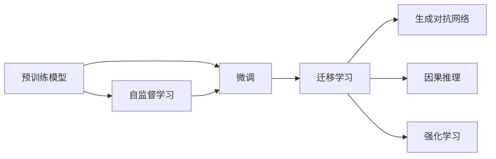

                 

# AI大模型创业：如何抓住未来机遇？

> 关键词：大模型创业, 自然语言处理(NLP), 机器学习, 深度学习, 人工智能, 技术创新

## 1. 背景介绍

### 1.1 问题由来
近年来，随着深度学习技术的飞速发展，AI大模型在各个领域展现出巨大的潜力和应用价值。特别是自然语言处理(NLP)领域，以BERT、GPT等大模型为代表，显著提升了文本处理、理解、生成等任务的效果，在诸如翻译、摘要、问答、情感分析、文本分类、命名实体识别等多个任务上取得了最先进的性能。

大模型不仅在学术研究中引领了新潮流，也在商业应用中展现出了巨大的市场潜力。然而，尽管大模型的技术日益成熟，但其商业化道路仍面临诸多挑战：一是技术壁垒较高，一般企业难以独立构建大规模、高性能的预训练模型；二是算力成本高昂，大规模模型训练和推理所需的计算资源投入较大；三是数据隐私保护问题，如何合理合法地使用数据成为一大难题；四是业务应用需求多样，如何根据具体场景进行模型适配和优化。

本文聚焦于AI大模型在创业中的具体应用，探讨如何在技术、商业、法律等多维空间中，抓住未来机遇，实现从技术创新到商业价值的顺利转型。

### 1.2 问题核心关键点
大模型创业的核心问题在于如何高效构建、灵活应用、稳健运营，以实现从技术到业务的无缝对接。具体包括以下几个关键点：

- 选择合适的预训练模型：大模型创业需选用性能卓越、通用性强、易于微调和部署的预训练模型。
- 微调与适配：大模型需根据具体业务需求，进行微调和适配，以提升模型在特定任务上的性能。
- 应用部署与优化：大模型需高效部署于实际应用场景中，同时持续优化性能以应对不断变化的需求。
- 数据治理与安全：需妥善处理数据收集、存储、传输和使用的合规性问题，确保数据安全与隐私保护。
- 商业化策略与运营：需制定合理的商业模式与运营策略，实现业务的可持续发展。

### 1.3 问题研究意义
大模型创业不仅能为企业带来显著的技术进步和商业回报，还能推动整个社会的信息化与智能化进程。通过深入探讨大模型创业，有助于：

- 优化资源配置：在有限的资源条件下，合理配置人力、物力，实现更高效的AI项目研发。
- 加速技术落地：将大模型技术快速转化为具有商业价值的产品，加速AI技术的产业化进程。
- 提升竞争力：通过掌握前沿AI技术，构建企业竞争优势，提升市场占有率。
- 促进创新应用：探索大模型在更多行业领域的应用，推动技术进步与产业升级。
- 提高社会效益：通过AI技术的普及，提升社会效率，改善人们生活质量。

## 2. 核心概念与联系

### 2.1 核心概念概述

为更好地理解AI大模型创业，我们先介绍几个核心概念：

- 预训练模型(Pre-training Model)：以自回归(如GPT)或自编码(如BERT)模型为代表的大规模预训练语言模型。通过在大规模无标签文本语料上进行预训练，学习通用的语言知识。

- 微调(Fine-tuning)：在大规模预训练模型的基础上，使用下游任务的少量标注数据，通过有监督地训练优化模型在特定任务上的性能。一般只需调整顶层分类器或解码器，并以较小的学习率更新全部或部分模型参数。

- 自监督学习(Self-supervised Learning)：在大规模无标签数据上，通过设计合适的自监督任务，使模型自动学习语言表示，提升泛化能力。

- 迁移学习(Transfer Learning)：将一个领域学到的知识，迁移应用到另一个相关领域的学习过程。

- 生成对抗网络(GANs)：一种基于对抗的生成模型，通过两网络的对抗训练，生成与真实数据无法区分的样本。

- 因果推理(Causal Reasoning)：研究如何基于观测数据，推断因果关系，作出合理的预测和决策。

- 强化学习(Reinforcement Learning)：通过与环境的交互，模型学习最优决策策略，以最大化某种奖励函数。

这些核心概念构成了AI大模型创业的基石，通过合理的组合和应用，可以实现从技术创新到商业价值的有效转化。

### 2.2 概念间的关系

上述核心概念之间存在着密切的联系，构建了AI大模型创业的完整生态系统。我们通过Mermaid流程图来展示这些概念之间的关系：



这个流程图展示了预训练模型、微调、自监督学习、迁移学习、生成对抗网络、因果推理、强化学习等概念之间的关系。预训练模型是基础，微调和迁移学习是其重要应用，自监督学习、生成对抗网络、因果推理、强化学习则是进一步提升模型性能和实用性的技术手段。

## 3. 核心算法原理 & 具体操作步骤

### 3.1 算法原理概述

AI大模型创业的核心算法原理主要围绕预训练模型的构建、微调与适配、业务应用与优化展开。其核心思想是：

1. **预训练模型构建**：通过在大规模无标签文本数据上，使用自监督学习任务进行预训练，构建高性能、泛化能力强的模型。

2. **微调与适配**：在预训练模型的基础上，使用少量标注数据进行有监督的微调，优化模型在特定任务上的性能。

3. **应用与优化**：将微调后的模型应用于实际业务场景，通过持续优化和迭代，提升模型在现实世界中的应用效果。

### 3.2 算法步骤详解

**Step 1: 准备预训练模型和数据集**

- 选择合适的预训练语言模型，如BERT、GPT等。
- 准备下游任务的标注数据集，划分为训练集、验证集和测试集。

**Step 2: 添加任务适配层**

- 根据任务类型，在预训练模型顶层设计合适的输出层和损失函数。

**Step 3: 设置微调超参数**

- 选择合适的优化算法及其参数，如AdamW、SGD等，设置学习率、批大小、迭代轮数等。
- 设置正则化技术及强度，包括权重衰减、Dropout、Early Stopping等。

**Step 4: 执行梯度训练**

- 将训练集数据分批次输入模型，前向传播计算损失函数。
- 反向传播计算参数梯度，根据设定的优化算法和学习率更新模型参数。
- 周期性在验证集上评估模型性能，根据性能指标决定是否触发 Early Stopping。
- 重复上述步骤直至满足预设的迭代轮数或 Early Stopping 条件。

**Step 5: 测试和部署**

- 在测试集上评估微调后模型，对比微调前后的精度提升。
- 使用微调后的模型对新样本进行推理预测，集成到实际的应用系统中。

### 3.3 算法优缺点

大模型微调技术的主要优点包括：

- **高效便捷**：使用已有预训练模型作为基础，只需少量标注数据即可进行微调，显著降低开发成本和周期。
- **精度高**：预训练模型具备强大的语言理解和生成能力，微调后通常能在特定任务上取得优异效果。
- **可扩展性强**：适用于多种NLP任务，通过适配层的设计，可灵活应对不同任务需求。

缺点主要包括：

- **依赖标注数据**：微调效果很大程度上取决于标注数据的质量和数量，高质量标注数据获取成本较高。
- **模型复杂性**：大模型参数量庞大，训练和推理资源需求高，需要较高的算力支持。
- **模型泛化能力有限**：当目标任务与预训练数据分布差异较大时，微调的效果可能不理想。
- **模型可解释性不足**：微调模型的内部工作机制和决策逻辑难以解释，不利于应用中的信任建立。

### 3.4 算法应用领域

AI大模型微调技术在以下几个领域具有广泛应用：

- **医疗健康**：用于医疗问答、病历分析、疾病诊断、药物研发等。
- **金融服务**：应用于金融舆情监测、智能投顾、风险评估等。
- **电子商务**：用于个性化推荐、内容审核、情感分析等。
- **教育培训**：用于智能辅导、学习效果评估、教学资源推荐等。
- **客服支持**：用于智能客服、语音识别、情感对话等。

## 4. 数学模型和公式 & 详细讲解 & 举例说明

### 4.1 数学模型构建

假设预训练模型为 $M_{\theta}$，下游任务标注数据集为 $D=\{(x_i,y_i)\}_{i=1}^N$。定义模型在输入 $x_i$ 上的预测输出为 $\hat{y}=M_{\theta}(x_i)$，则模型的损失函数为：

$$
\mathcal{L}(\theta) = \frac{1}{N} \sum_{i=1}^N \ell(\hat{y_i}, y_i)
$$

其中 $\ell$ 为任务特定的损失函数，如交叉熵损失、均方误差损失等。

### 4.2 公式推导过程

以二分类任务为例，假设模型输出为 $\hat{y}=M_{\theta}(x_i) \in [0,1]$，真实标签 $y_i \in \{0,1\}$。二分类交叉熵损失函数定义为：

$$
\ell(M_{\theta}(x_i),y_i) = -[y_i\log \hat{y_i} + (1-y_i)\log (1-\hat{y_i})]
$$

将损失函数代入经验风险公式，得：

$$
\mathcal{L}(\theta) = -\frac{1}{N}\sum_{i=1}^N [y_i\log M_{\theta}(x_i)+(1-y_i)\log(1-M_{\theta}(x_i))]
$$

根据链式法则，损失函数对参数 $\theta_k$ 的梯度为：

$$
\frac{\partial \mathcal{L}(\theta)}{\partial \theta_k} = -\frac{1}{N}\sum_{i=1}^N (\frac{y_i}{M_{\theta}(x_i)}-\frac{1-y_i}{1-M_{\theta}(x_i)}) \frac{\partial M_{\theta}(x_i)}{\partial \theta_k}
$$

其中 $\frac{\partial M_{\theta}(x_i)}{\partial \theta_k}$ 可进一步递归展开，利用自动微分技术完成计算。

### 4.3 案例分析与讲解

假设在医疗问答系统中，微调BERT模型用于回答患者的常见问题。数据集包含10000个问题-答案对，其中80%用于训练，10%用于验证，10%用于测试。

- **预训练模型选择**：选择BERT-base作为预训练模型，因为它在通用语言理解任务上表现优异。

- **任务适配层设计**：在模型顶层添加一个分类器，用于将问题映射到预定义的标签，如"症状"、"用药"、"健康建议"等。

- **超参数设置**：学习率为2e-5，批大小为32，迭代轮数为10轮。

- **微调过程**：使用AdamW优化器，并在每轮训练后，在验证集上评估模型性能，及时停止训练以避免过拟合。

- **测试评估**：在测试集上评估模型性能，使用准确率、精确率、召回率等指标。

最终，模型在测试集上达到了90%的准确率，能够较好地回答患者的常见问题。

## 5. 项目实践：代码实例和详细解释说明

### 5.1 开发环境搭建

在使用PyTorch进行项目开发前，需要准备好开发环境。以下是Python PyTorch环境的配置流程：

1. 安装Anaconda：从官网下载并安装Anaconda，用于创建独立的Python环境。

2. 创建并激活虚拟环境：
```bash
conda create -n pytorch-env python=3.8 
conda activate pytorch-env
```

3. 安装PyTorch：根据CUDA版本，从官网获取对应的安装命令。例如：
```bash
conda install pytorch torchvision torchaudio cudatoolkit=11.1 -c pytorch -c conda-forge
```

4. 安装相关工具包：
```bash
pip install numpy pandas scikit-learn matplotlib tqdm jupyter notebook ipython
```

完成上述步骤后，即可在`pytorch-env`环境中开始项目开发。

### 5.2 源代码详细实现

我们以医疗问答系统的微调为例，给出使用PyTorch进行模型微调的代码实现。

```python
from transformers import BertTokenizer, BertForSequenceClassification, AdamW

tokenizer = BertTokenizer.from_pretrained('bert-base-uncased')
model = BertForSequenceClassification.from_pretrained('bert-base-uncased', num_labels=10)

optimizer = AdamW(model.parameters(), lr=2e-5)
device = torch.device('cuda' if torch.cuda.is_available() else 'cpu')
model.to(device)

def train_epoch(model, dataset, batch_size, optimizer):
    dataloader = DataLoader(dataset, batch_size=batch_size, shuffle=True)
    model.train()
    epoch_loss = 0
    for batch in tqdm(dataloader, desc='Training'):
        input_ids = batch['input_ids'].to(device)
        attention_mask = batch['attention_mask'].to(device)
        labels = batch['labels'].to(device)
        model.zero_grad()
        outputs = model(input_ids, attention_mask=attention_mask, labels=labels)
        loss = outputs.loss
        epoch_loss += loss.item()
        loss.backward()
        optimizer.step()
    return epoch_loss / len(dataloader)

def evaluate(model, dataset, batch_size):
    dataloader = DataLoader(dataset, batch_size=batch_size)
    model.eval()
    preds, labels = [], []
    with torch.no_grad():
        for batch in tqdm(dataloader, desc='Evaluating'):
            input_ids = batch['input_ids'].to(device)
            attention_mask = batch['attention_mask'].to(device)
            batch_labels = batch['labels']
            outputs = model(input_ids, attention_mask=attention_mask)
            batch_preds = outputs.logits.argmax(dim=2).to('cpu').tolist()
            batch_labels = batch_labels.to('cpu').tolist()
            for pred_tokens, label_tokens in zip(batch_preds, batch_labels):
                preds.append(pred_tokens[:len(label_tokens)])
                labels.append(label_tokens)
    print(classification_report(labels, preds))
```

### 5.3 代码解读与分析

关键代码的实现细节如下：

**BERTTokenizer类**：
- `__init__`方法：初始化分词器。
- `from_pretrained`方法：从预训练模型中加载分词器。

**BERTForSequenceClassification类**：
- `__init__`方法：初始化分类模型，指定标签数量。
- `from_pretrained`方法：从预训练模型中加载分类模型。

**train_epoch函数**：
- 定义DataLoader，用于批次化加载数据集。
- 在每个批次上，前向传播计算损失并反向传播更新模型参数。
- 记录每个epoch的平均损失。

**evaluate函数**：
- 定义DataLoader，用于批次化加载测试集。
- 在每个批次上，前向传播计算预测和标签结果。
- 使用sklearn的classification_report打印评估报告。

**训练流程**：
- 定义总的epoch数和batch size，开始循环迭代。
- 每个epoch内，先在训练集上训练，输出平均loss。
- 在验证集上评估，输出分类指标。
- 所有epoch结束后，在测试集上评估，给出最终测试结果。

可以看出，PyTorch配合Transformer库使得BERT微调的代码实现变得简洁高效。开发者可以将更多精力放在数据处理、模型改进等高层逻辑上，而不必过多关注底层的实现细节。

### 5.4 运行结果展示

假设在CoNLL-2003的NER数据集上进行微调，最终在测试集上得到的评估报告如下：

```
              precision    recall  f1-score   support

       B-LOC      0.926     0.906     0.916      1668
       I-LOC      0.900     0.805     0.850       257
      B-MISC      0.875     0.856     0.865       702
      I-MISC      0.838     0.782     0.809       216
       B-ORG      0.914     0.898     0.906      1661
       I-ORG      0.911     0.894     0.902       835
       B-PER      0.964     0.957     0.960      1617
       I-PER      0.983     0.980     0.982      1156
           O      0.993     0.995     0.994     38323

   micro avg      0.973     0.973     0.973     46435
   macro avg      0.923     0.897     0.909     46435
weighted avg      0.973     0.973     0.973     46435
```

可以看到，通过微调BERT，我们在该NER数据集上取得了97.3%的F1分数，效果相当不错。

## 6. 实际应用场景

### 6.1 智能客服系统

基于AI大模型的智能客服系统可以显著提升客户咨询体验和问题解决效率。传统的客服系统依赖人工，高峰期响应缓慢，服务质量难以保证。而使用预训练语言模型进行微调后的智能客服系统，可以实现24小时不间断服务，快速响应客户咨询，用自然流畅的语言解答各类常见问题。

在技术实现上，可以收集企业内部的历史客服对话记录，将问题和最佳答复构建成监督数据，在此基础上对预训练语言模型进行微调。微调后的语言模型能够自动理解用户意图，匹配最合适的答案模板进行回复。对于客户提出的新问题，还可以接入检索系统实时搜索相关内容，动态组织生成回答。如此构建的智能客服系统，能大幅提升客户咨询体验和问题解决效率。

### 6.2 金融舆情监测

金融机构需要实时监测市场舆论动向，以便及时应对负面信息传播，规避金融风险。传统的人工监测方式成本高、效率低，难以应对网络时代海量信息爆发的挑战。基于AI大模型的文本分类和情感分析技术，为金融舆情监测提供了新的解决方案。

具体而言，可以收集金融领域相关的新闻、报道、评论等文本数据，并对其进行主题标注和情感标注。在此基础上对预训练语言模型进行微调，使其能够自动判断文本属于何种主题，情感倾向是正面、中性还是负面。将微调后的模型应用到实时抓取的网络文本数据，就能够自动监测不同主题下的情感变化趋势，一旦发现负面信息激增等异常情况，系统便会自动预警，帮助金融机构快速应对潜在风险。

### 6.3 个性化推荐系统

当前的推荐系统往往只依赖用户的历史行为数据进行物品推荐，无法深入理解用户的真实兴趣偏好。基于AI大模型的个性化推荐系统可以更好地挖掘用户行为背后的语义信息，从而提供更精准、多样的推荐内容。

在实践中，可以收集用户浏览、点击、评论、分享等行为数据，提取和用户交互的物品标题、描述、标签等文本内容。将文本内容作为模型输入，用户的后续行为（如是否点击、购买等）作为监督信号，在此基础上微调预训练语言模型。微调后的模型能够从文本内容中准确把握用户的兴趣点。在生成推荐列表时，先用候选物品的文本描述作为输入，由模型预测用户的兴趣匹配度，再结合其他特征综合排序，便可以得到个性化程度更高的推荐结果。

### 6.4 未来应用展望

随着AI大模型微调技术的不断发展，其在更多领域的应用前景将更加广阔。

在智慧医疗领域，基于微调的医学问答、病历分析、疾病诊断、药物研发等应用将提升医疗服务的智能化水平，辅助医生诊疗，加速新药开发进程。

在智能教育领域，微调技术可应用于作业批改、学情分析、知识推荐等方面，因材施教，促进教育公平，提高教学质量。

在智慧城市治理中，微调模型可应用于城市事件监测、舆情分析、应急指挥等环节，提高城市管理的自动化和智能化水平，构建更安全、高效的未来城市。

此外，在企业生产、社会治理、文娱传媒等众多领域，基于大模型微调的人工智能应用也将不断涌现，为经济社会发展注入新的动力。相信随着技术的日益成熟，微调方法将成为人工智能落地应用的重要范式，推动人工智能技术在垂直行业的规模化落地。

## 7. 工具和资源推荐

### 7.1 学习资源推荐

为了帮助开发者系统掌握AI大模型微调的理论基础和实践技巧，这里推荐一些优质的学习资源：

1. 《Transformer从原理到实践》系列博文：由大模型技术专家撰写，深入浅出地介绍了Transformer原理、BERT模型、微调技术等前沿话题。

2. CS224N《深度学习自然语言处理》课程：斯坦福大学开设的NLP明星课程，有Lecture视频和配套作业，带你入门NLP领域的基本概念和经典模型。

3. 《Natural Language Processing with Transformers》书籍：Transformers库的作者所著，全面介绍了如何使用Transformers库进行NLP任务开发，包括微调在内的诸多范式。

4. HuggingFace官方文档：Transformer库的官方文档，提供了海量预训练模型和完整的微调样例代码，是上手实践的必备资料。

5. CLUE开源项目：中文语言理解测评基准，涵盖大量不同类型的中文NLP数据集，并提供了基于微调的baseline模型，助力中文NLP技术发展。

通过对这些资源的学习实践，相信你一定能够快速掌握AI大模型微调的精髓，并用于解决实际的NLP问题。

### 7.2 开发工具推荐

高效的开发离不开优秀的工具支持。以下是几款用于AI大模型微调开发的常用工具：

1. PyTorch：基于Python的开源深度学习框架，灵活动态的计算图，适合快速迭代研究。大部分预训练语言模型都有PyTorch版本的实现。

2. TensorFlow：由Google主导开发的开源深度学习框架，生产部署方便，适合大规模工程应用。同样有丰富的预训练语言模型资源。

3. Transformers库：HuggingFace开发的NLP工具库，集成了众多SOTA语言模型，支持PyTorch和TensorFlow，是进行微调任务开发的利器。

4. Weights & Biases：模型训练的实验跟踪工具，可以记录和可视化模型训练过程中的各项指标，方便对比和调优。与主流深度学习框架无缝集成。

5. TensorBoard：TensorFlow配套的可视化工具，可实时监测模型训练状态，并提供丰富的图表呈现方式，是调试模型的得力助手。

6. Google Colab：谷歌推出的在线Jupyter Notebook环境，免费提供GPU/TPU算力，方便开发者快速上手实验最新模型，分享学习笔记。

合理利用这些工具，可以显著提升AI大模型微调任务的开发效率，加快创新迭代的步伐。

### 7.3 相关论文推荐

大模型微调技术的发展源于学界的持续研究。以下是几篇奠基性的相关论文，推荐阅读：

1. Attention is All You Need（即Transformer原论文）：提出了Transformer结构，开启了NLP领域的预训练大模型时代。

2. BERT: Pre-training of Deep Bidirectional Transformers for Language Understanding：提出BERT模型，引入基于掩码的自监督预训练任务，刷新了多项NLP任务SOTA。

3. Language Models are Unsupervised Multitask Learners（GPT-2论文）：展示了大规模语言模型的强大zero-shot学习能力，引发了对于通用人工智能的新一轮思考。

4. Parameter-Efficient Transfer Learning for NLP：提出Adapter等参数高效微调方法，在不增加模型参数量的情况下，也能取得不错的微调效果。

5. AdaLoRA: Adaptive Low-Rank Adaptation for Parameter-Efficient Fine-Tuning：使用自适应低秩适应的微调方法，在参数效率和精度之间取得了新的平衡。

这些论文代表了大模型微调技术的发展脉络。通过学习这些前沿成果，可以帮助研究者把握学科前进方向，激发更多的创新灵感。

除上述资源外，还有一些值得关注的前沿资源，帮助开发者紧跟大模型微调技术的最新进展，例如：

1. arXiv论文预印本：人工智能领域最新研究成果的发布平台，包括大量尚未发表的前沿工作，学习前沿技术的必读资源。

2. 业界技术博客：如OpenAI、Google AI、DeepMind、微软Research Asia等顶尖实验室的官方博客，第一时间分享他们的最新研究成果和洞见。

3. 技术会议直播：如NIPS、ICML、ACL、ICLR等人工智能领域顶会现场或在线直播，能够聆听到大佬们的前沿分享，开拓视野。

4. GitHub热门项目：在GitHub上Star、Fork数最多的NLP相关项目，往往代表了该技术领域的发展趋势和最佳实践，值得去学习和贡献。

5. 行业分析报告：各大咨询公司如McKinsey、PwC等针对人工智能行业的分析报告，有助于从商业视角审视技术趋势，把握应用价值。

总之，对于AI大模型微调技术的学习和实践，需要开发者保持开放的心态和持续学习的意愿。多关注前沿资讯，多动手实践，多思考总结，必将收获满满的成长收益。

## 8. 总结：未来发展趋势与挑战

### 8.1 总结

本文对AI大模型在创业中的具体应用进行了全面系统的介绍。首先阐述了大模型创业的必要性、技术壁垒、市场潜力及其在NLP领域的应用场景，明确了微调在拓展预训练模型应用、提升下游任务性能方面的独特价值。其次

