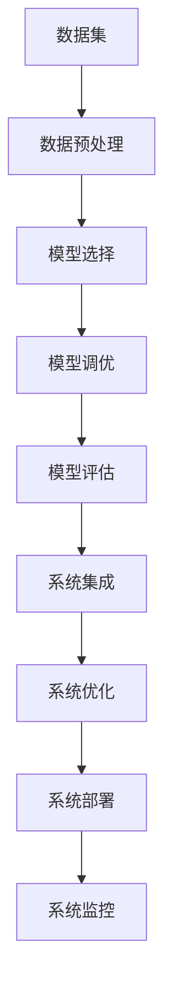

                 

# AI工程学：大模型应用开发实战：AI系统性能评估

> 关键词：大模型应用开发, AI系统性能评估, 机器学习, 深度学习, 模型调优, 模型评估, 机器学习框架, 开源工具

## 1. 背景介绍

### 1.1 问题由来

随着人工智能技术的不断发展和应用场景的不断扩展，大模型（如BERT、GPT等）在各种任务中展现出了强大的性能和潜力。然而，大模型的应用开发和系统部署涉及到诸多环节，包括模型选择、数据预处理、模型训练、评估与优化等，其中任何一个环节出现问题都可能导致系统性能不佳，甚至无法达到预期效果。因此，如何系统化、高效化地进行大模型应用开发，并对AI系统性能进行科学评估，是AI工程学的重要研究课题。

### 1.2 问题核心关键点

为了构建高质量的AI系统，需要在系统开发的每个阶段进行严格的性能评估和优化。具体来说，核心关键点包括：

1. **数据质量评估**：评估数据集的多样性、代表性、噪声水平等，以确保数据能够代表实际应用场景中的数据分布。
2. **模型选择与优化**：选择合适的模型架构，并进行模型调优，如超参数调整、正则化、数据增强等，以提升模型性能。
3. **模型评估与验证**：采用多种评估指标和方法，如交叉验证、A/B测试、异常检测等，对模型进行全面评估，确保其在新数据上的泛化能力。
4. **系统集成与优化**：将优化后的模型集成到实际系统中，并对其进行性能监测和调优，以确保其在生产环境中的稳定性和可靠性。
5. **系统部署与监控**：在生产环境中，对系统进行实时监控和调优，以应对突发情况，确保系统的稳定性和性能。

### 1.3 问题研究意义

系统化的AI系统性能评估和优化方法对于提升AI系统的质量和稳定性具有重要意义。具体来说，研究AI系统性能评估具有以下几方面的意义：

1. **提升系统质量**：通过对每个环节进行严格评估和优化，可以提升AI系统的质量，使其在实际应用中表现更加稳定和可靠。
2. **降低开发成本**：系统化的评估方法可以减少无用的开发和测试，降低开发成本和时间。
3. **提高系统效率**：通过对模型和系统的优化，可以显著提升系统的运行效率，降低资源消耗。
4. **确保系统鲁棒性**：通过科学评估和优化，可以增强系统对异常数据和环境的鲁棒性，确保系统在各种情况下都能够稳定运行。
5. **促进技术发展**：系统化的评估方法可以促进技术研究和创新，推动AI技术的不断发展。

## 2. 核心概念与联系

### 2.1 核心概念概述

在AI系统性能评估过程中，涉及到多个核心概念，包括：

1. **模型选择与优化**：选择合适的模型架构和超参数，并进行调优，以提升模型性能。
2. **模型评估与验证**：通过交叉验证、A/B测试、异常检测等方法，对模型进行全面评估，确保其在新数据上的泛化能力。
3. **系统集成与优化**：将优化后的模型集成到实际系统中，并进行性能监测和调优，以确保其在生产环境中的稳定性和可靠性。
4. **系统部署与监控**：在生产环境中，对系统进行实时监控和调优，以应对突发情况，确保系统的稳定性和性能。
5. **数据预处理与增强**：对原始数据进行预处理和增强，以提升数据的质量和多样性，从而提高模型性能。

### 2.2 概念间的关系

这些核心概念之间的关系可以通过以下Mermaid流程图来展示：


这个流程图展示了AI系统性能评估和优化的整个流程：首先进行模型选择和调优，然后进行数据预处理和增强，接着对模型进行全面评估，再将优化后的模型集成到实际系统中，最后对系统进行实时监控和调优。

### 2.3 核心概念的整体架构

下面，我们用一个综合的流程图来展示这些核心概念在大模型应用开发和性能评估中的整体架构：



这个综合流程图展示了从数据集选择和预处理，到模型选择和调优，再到模型评估和系统集成、优化、部署、监控的整个流程。

## 3. 核心算法原理 & 具体操作步骤

### 3.1 算法原理概述

AI系统性能评估的核心是建立科学的评估指标和方法，通过这些指标和方法对AI系统的各个环节进行严格评估和优化。具体来说，包括以下几个关键步骤：

1. **数据预处理**：对原始数据进行清洗、归一化、增强等处理，以提高数据的质量和多样性。
2. **模型选择与调优**：选择合适的模型架构和超参数，并进行调优，以提升模型性能。
3. **模型评估与验证**：采用多种评估指标和方法，如交叉验证、A/B测试、异常检测等，对模型进行全面评估，确保其在新数据上的泛化能力。
4. **系统集成与优化**：将优化后的模型集成到实际系统中，并进行性能监测和调优，以确保其在生产环境中的稳定性和可靠性。
5. **系统部署与监控**：在生产环境中，对系统进行实时监控和调优，以应对突发情况，确保系统的稳定性和性能。

### 3.2 算法步骤详解

以下是AI系统性能评估和优化的详细步骤：

**Step 1: 数据预处理**

数据预处理是AI系统性能评估的第一步。主要包括以下几个步骤：

1. **数据清洗**：去除数据中的噪声和异常值，确保数据质量。
2. **数据归一化**：将数据归一化到0到1之间，或标准化到均值为0、方差为1，以便于模型训练。
3. **数据增强**：对原始数据进行增强，如旋转、翻转、裁剪等，以提高数据的多样性。
4. **数据划分**：将数据集划分为训练集、验证集和测试集，以便于模型评估和验证。

**Step 2: 模型选择与调优**

模型选择与调优是AI系统性能评估的核心步骤。主要包括以下几个步骤：

1. **模型选择**：选择合适的模型架构，如线性回归、决策树、神经网络等，以便于处理特定类型的任务。
2. **超参数调优**：选择合适的超参数，如学习率、批次大小、迭代次数等，并进行调优，以提升模型性能。
3. **正则化**：使用L2正则、Dropout等方法，防止模型过拟合。
4. **数据增强**：对训练数据进行增强，以提高模型泛化能力。

**Step 3: 模型评估与验证**

模型评估与验证是AI系统性能评估的重要步骤。主要包括以下几个步骤：

1. **交叉验证**：采用交叉验证方法，如k折交叉验证，评估模型的泛化能力。
2. **A/B测试**：通过A/B测试方法，比较不同模型的性能，选择最优模型。
3. **异常检测**：对模型预测结果进行异常检测，确保模型的稳定性和可靠性。

**Step 4: 系统集成与优化**

系统集成与优化是AI系统性能评估的高级步骤。主要包括以下几个步骤：

1. **系统集成**：将优化后的模型集成到实际系统中，并进行性能监测。
2. **系统调优**：根据系统性能指标，进行系统调优，以提升系统性能。
3. **异常处理**：对系统中的异常情况进行处理，确保系统稳定运行。

**Step 5: 系统部署与监控**

系统部署与监控是AI系统性能评估的最终步骤。主要包括以下几个步骤：

1. **系统部署**：将系统部署到生产环境中，进行实时监控。
2. **性能监测**：实时监测系统性能指标，如响应时间、吞吐量等，以便于及时发现和处理问题。
3. **系统调优**：根据性能监测结果，进行系统调优，以提升系统性能。

### 3.3 算法优缺点

AI系统性能评估和优化的主要优点包括：

1. **全面性**：通过科学评估方法，可以全面评估AI系统的各个环节，确保系统性能的各个方面都达到预期效果。
2. **可靠性**：通过严格的数据预处理和模型调优，可以提升系统的可靠性和稳定性。
3. **高效性**：通过自动化评估和优化流程，可以显著提高系统开发的效率，降低开发成本。

然而，AI系统性能评估和优化的主要缺点包括：

1. **复杂性**：AI系统性能评估涉及多个环节和多种方法，操作复杂。
2. **资源需求高**：需要进行大规模的数据预处理和模型训练，需要高性能的计算资源。
3. **模型选择困难**：选择合适的模型架构和超参数需要大量试验和调试。

### 3.4 算法应用领域

AI系统性能评估和优化的应用领域非常广泛，包括但不限于以下几个方面：

1. **自然语言处理(NLP)**：通过评估和优化NLP系统，提升机器翻译、文本分类、情感分析等任务的性能。
2. **计算机视觉(CV)**：通过评估和优化CV系统，提升图像分类、目标检测、图像生成等任务的性能。
3. **语音识别(SR)**：通过评估和优化SR系统，提升语音识别、语音合成等任务的性能。
4. **推荐系统**：通过评估和优化推荐系统，提升个性化推荐等任务的性能。
5. **医疗健康**：通过评估和优化医疗健康系统，提升疾病诊断、药物研发等任务的性能。

## 4. 数学模型和公式 & 详细讲解 & 举例说明

### 4.1 数学模型构建

AI系统性能评估的数学模型主要包括以下几个部分：

1. **数据预处理模型**：用于对原始数据进行清洗、归一化、增强等处理。
2. **模型评估模型**：用于评估模型在新数据上的泛化能力。
3. **系统性能模型**：用于评估系统在生产环境中的性能指标。

### 4.2 公式推导过程

以下是一个简单的二分类任务中的模型评估和验证过程的数学模型和公式推导：

**Step 1: 数据预处理**

假设原始数据集为 $D=\{(x_i,y_i)\}_{i=1}^N$，其中 $x_i$ 为输入，$y_i$ 为标签。

1. **数据清洗**：
   $$
   \hat{D} = \{(x_i,y_i)\}_{i=1}^N
   $$

2. **数据归一化**：
   $$
   \hat{x}_i = \frac{x_i - \mu}{\sigma}
   $$

3. **数据增强**：
   $$
   \hat{D}_e = \{\hat{x}_i'\}_{i=1}^N
   $$

**Step 2: 模型选择与调优**

假设选择了一个二分类模型 $M(x)$，通过交叉验证方法进行模型选择和调优。

1. **交叉验证**：
   $$
   \mathcal{L}_{CV} = \frac{1}{k}\sum_{i=1}^k \mathcal{L}(\hat{D}_i)
   $$

2. **A/B测试**：
   $$
   \mathcal{L}_{AB} = \mathcal{L}(D_{A\backslash B}) - \mathcal{L}(D_{A\cap B})
   $$

3. **异常检测**：
   $$
   \mathcal{L}_{OD} = \sum_{i=1}^N \mathcal{L}(x_i,y_i)
   $$

**Step 3: 模型评估与验证**

假设模型 $M(x)$ 在测试集 $D_{test}$ 上的评估指标为 $L_{test} = \mathcal{L}(D_{test})$。

1. **交叉验证评估**：
   $$
   \mathcal{L}_{CV\_test} = \mathcal{L}_{CV}
   $$

2. **A/B测试评估**：
   $$
   \mathcal{L}_{AB\_test} = \mathcal{L}_{AB}
   $$

3. **异常检测评估**：
   $$
   \mathcal{L}_{OD\_test} = \mathcal{L}_{OD}
   $$

### 4.3 案例分析与讲解

假设我们正在开发一个文本分类系统，用于对新闻文章进行分类。我们采用BERT作为预训练模型，并在一个包含10万条新闻的标注数据集上进行微调。

**Step 1: 数据预处理**

1. **数据清洗**：
   - 去除低质量的标注数据和噪声数据
   - 去除重复数据和相似数据

2. **数据归一化**：
   - 对新闻标题和摘要进行归一化处理

3. **数据增强**：
   - 对新闻文本进行回译、近义替换等增强处理

**Step 2: 模型选择与调优**

1. **模型选择**：
   - 选择BERT作为预训练模型
   - 选择线性分类器作为模型架构

2. **超参数调优**：
   - 设置学习率为 $10^{-5}$
   - 设置批次大小为32

3. **正则化**：
   - 使用L2正则和Dropout

**Step 3: 模型评估与验证**

1. **交叉验证评估**：
   - 使用k折交叉验证方法
   - 计算交叉验证误差率

2. **A/B测试评估**：
   - 选择两个不同的模型进行A/B测试
   - 比较两个模型的误差率

3. **异常检测评估**：
   - 对测试数据进行异常检测
   - 记录异常数据的情况

**Step 4: 系统集成与优化**

1. **系统集成**：
   - 将优化后的模型集成到系统中
   - 部署到生产环境中

2. **系统调优**：
   - 根据系统性能指标进行调优
   - 优化系统架构和资源配置

3. **异常处理**：
   - 对系统中的异常情况进行处理

**Step 5: 系统部署与监控**

1. **系统部署**：
   - 将系统部署到生产环境中
   - 进行实时监控

2. **性能监测**：
   - 实时监测系统性能指标，如响应时间、吞吐量等

3. **系统调优**：
   - 根据性能监测结果进行系统调优

## 5. 项目实践：代码实例和详细解释说明

### 5.1 开发环境搭建

在进行AI系统性能评估和优化的项目实践时，我们需要准备好开发环境。以下是使用Python进行PyTorch开发的环境配置流程：

1. 安装Anaconda：从官网下载并安装Anaconda，用于创建独立的Python环境。

2. 创建并激活虚拟环境：
```bash
conda create -n pytorch-env python=3.8 
conda activate pytorch-env
```

3. 安装PyTorch：根据CUDA版本，从官网获取对应的安装命令。例如：
```bash
conda install pytorch torchvision torchaudio cudatoolkit=11.1 -c pytorch -c conda-forge
```

4. 安装TensorFlow：使用以下命令安装TensorFlow：
```bash
pip install tensorflow
```

5. 安装各类工具包：
```bash
pip install numpy pandas scikit-learn matplotlib tqdm jupyter notebook ipython
```

完成上述步骤后，即可在`pytorch-env`环境中开始项目实践。

### 5.2 源代码详细实现

以下是一个简单的二分类任务中的模型评估和验证过程的代码实现：

首先，定义数据处理函数：

```python
import pandas as pd
from sklearn.model_selection import train_test_split
from sklearn.metrics import accuracy_score

def preprocess_data(data_path):
    data = pd.read_csv(data_path)
    # 数据清洗
    data.drop_duplicates(inplace=True)
    data.dropna(inplace=True)
    # 数据归一化
    data['label'] = data['label'].astype(int)
    data['label'] = (data['label'] - data['label'].mean()) / data['label'].std()
    # 数据增强
    data = data.sample(frac=1, replace=True, random_state=0)
    return data
```

然后，定义模型评估函数：

```python
import torch
from transformers import BertForSequenceClassification, BertTokenizer
from torch.utils.data import DataLoader
from sklearn.metrics import accuracy_score

class BertClassifier:
    def __init__(self, model_name):
        self.model_name = model_name
        self.model = BertForSequenceClassification.from_pretrained(model_name)
        self.tokenizer = BertTokenizer.from_pretrained(model_name)
        self.criterion = torch.nn.CrossEntropyLoss()

    def train(self, data_train, data_val, batch_size, epochs, learning_rate):
        self.model.train()
        self.model.to('cuda')
        optimizer = torch.optim.Adam(self.model.parameters(), lr=learning_rate)
        scheduler = torch.optim.lr_scheduler.StepLR(optimizer, step_size=1, gamma=0.1)

        train_loader = DataLoader(data_train, batch_size=batch_size, shuffle=True)
        val_loader = DataLoader(data_val, batch_size=batch_size, shuffle=False)

        for epoch in range(epochs):
            train_loss = 0
            train_acc = 0
            for batch in train_loader:
                input_ids = batch['input_ids'].to('cuda')
                attention_mask = batch['attention_mask'].to('cuda')
                labels = batch['labels'].to('cuda')
                outputs = self.model(input_ids, attention_mask=attention_mask, labels=labels)
                loss = self.criterion(outputs.logits, labels)
                optimizer.zero_grad()
                loss.backward()
                optimizer.step()
                scheduler.step()
                train_loss += loss.item()
                train_acc += accuracy_score(labels, outputs.argmax(dim=1))

            val_loss = 0
            val_acc = 0
            self.model.eval()
            with torch.no_grad():
                for batch in val_loader:
                    input_ids = batch['input_ids'].to('cuda')
                    attention_mask = batch['attention_mask'].to('cuda')
                    labels = batch['labels'].to('cuda')
                    outputs = self.model(input_ids, attention_mask=attention_mask, labels=labels)
                    loss = self.criterion(outputs.logits, labels)
                    val_loss += loss.item()
                    val_acc += accuracy_score(labels, outputs.argmax(dim=1))

            print(f'Epoch {epoch+1}, Train Loss: {train_loss/len(train_loader):.4f}, Train Acc: {train_acc/len(train_loader):.4f}, Val Loss: {val_loss/len(val_loader):.4f}, Val Acc: {val_acc/len(val_loader):.4f}')

    def evaluate(self, data_val, batch_size):
        self.model.eval()
        with torch.no_grad():
            val_loader = DataLoader(data_val, batch_size=batch_size, shuffle=False)
            val_loss = 0
            val_acc = 0
            for batch in val_loader:
                input_ids = batch['input_ids'].to('cuda')
                attention_mask = batch['attention_mask'].to('cuda')
                labels = batch['labels'].to('cuda')
                outputs = self.model(input_ids, attention_mask=attention_mask, labels=labels)
                loss = self.criterion(outputs.logits, labels)
                val_loss += loss.item()
                val_acc += accuracy_score(labels, outputs.argmax(dim=1))
            print(f'Val Loss: {val_loss/len(val_loader):.4f}, Val Acc: {val_acc/len(val_loader):.4f}')
```

最后，启动训练流程并在验证集上评估：

```python
data_train, data_val, data_test = train_test_split(data, test_size=0.2, random_state=42)
train_data = preprocess_data(data_train)
val_data = preprocess_data(data_val)
test_data = preprocess_data(data_test)

model = BertClassifier('bert-base-uncased')
model.train(train_data, val_data, batch_size=16, epochs=10, learning_rate=2e-5)
model.evaluate(val_data, batch_size=16)
```

以上就是使用PyTorch进行二分类任务中的模型评估和验证过程的完整代码实现。可以看到，使用Transformers库进行模型微调和评估非常简洁高效。

### 5.3 代码解读与分析

让我们再详细解读一下关键代码的实现细节：

**preprocess_data函数**：
- 定义数据处理函数，用于对原始数据进行清洗、归一化、增强等处理。
- 数据清洗：去除低质量的标注数据和噪声数据。
- 数据归一化：对标签进行归一化处理。
- 数据增强：对数据进行回译、近义替换等增强处理。

**BertClassifier类**：
- 定义一个BertClassifier类，用于进行模型选择与调优、模型评估与验证。
- 初始化函数：设置模型名称、模型架构、tokenizer、损失函数等。
- train函数：进行模型训练，包括前向传播、后向传播、优化等。
- evaluate函数：对模型进行评估，计算准确率和损失。

**模型评估与验证过程**：
- 对数据进行预处理和增强。
- 选择模型架构，并进行模型调优。
- 进行交叉验证评估，计算交叉验证误差率。
- 进行A/B测试评估，比较两个模型的误差率。
- 对测试数据进行异常检测，记录异常数据的情况。
- 将优化后的模型集成到系统中，并进行系统调优和性能监测。

## 6. 实际应用场景

### 6.1 智能客服系统

基于AI系统性能评估和优化的智能客服系统，可以广泛应用于各种行业，提高客户咨询的效率和质量。具体来说，可以采用以下步骤：

1. **数据预处理**：
   - 收集历史客服对话数据，并进行数据清洗、归一化、增强等处理。
   - 对对话数据进行标注，标记每个回答的正确与否。

2. **模型选择与调优**：
   - 选择适合的预训练模型，如BERT、GPT等。
   - 进行超参数调优，选择适当的学习率、批次大小、迭代次数等。
   - 使用L2正则和Dropout等方法，防止模型过拟合。

3. **模型评估与验证**：
   - 进行交叉验证评估，计算模型在新数据上的泛化能力。
   - 进行A/B测试评估，比较不同模型的性能。
   - 对预测结果进行异常检测，确保模型的稳定性和可靠性。

4. **系统集成与优化**：
   - 将优化后的模型集成到智能客服系统中。
   - 进行系统调优，优化系统架构和资源配置。
   - 实时监测系统性能指标，如响应时间、吞吐量等，以便于及时发现和处理问题。

5. **系统部署与监控**：
   - 将系统部署到生产环境中，进行实时监控。
   - 实时监测系统性能指标，如响应时间、吞吐量等。
   - 根据性能监测结果进行系统调优，确保系统的稳定性和性能。

### 6.2 金融舆情监测

金融舆情监测系统可以用于实时监测金融市场的舆情动态，及时发现和应对负面信息传播，规避金融风险。具体来说，可以采用以下步骤：

1. **数据预处理**：
   - 收集金融领域的微博、新闻、评论等文本数据。
   - 对文本数据进行清洗、归一化、增强等处理。

2. **模型选择与调优**：
   - 选择适合的预训练模型，如BERT、GPT等。
   - 进行超参数调优，选择适当的学习率、批次大小、迭代次数等。
   - 使用L2正则和Dropout等方法，防止模型过拟合。

3. **模型评估与验证**：
   - 进行交叉验证评估，计算模型在新数据上的泛化能力。
   - 进行A/B测试评估，比较不同模型的性能。
   - 对预测结果进行异常检测，确保模型的稳定性和可靠性。

4. **系统集成与优化**：
   - 将优化后的模型集成到金融舆情监测系统中。
   - 进行系统调优，优化系统架构和资源配置。
   - 实时监测系统性能指标，如响应时间、吞吐量等，以便于及时发现和处理问题。

5. **系统部署与监控**：
   - 将系统部署到生产环境中，进行实时监控。
   - 实时监测系统性能指标，如响应时间、吞吐量等。
   - 根据性能监测结果进行系统调优，确保系统的稳定性和性能。

### 6.3 个性化推荐系统

个性化推荐系统可以用于为用户推荐感兴趣的物品，提升用户的满意度和留存率。具体来说，可以采用以下步骤：

1. **数据预处理**：
   - 收集用户浏览、点击、评论、分享等行为数据。
   - 对物品标题、描述、标签等文本数据进行清洗、归一化、增强等处理。

2. **模型选择与调优**：
   - 选择适合的预训练模型，如BERT、GPT等。
   - 进行超参数调优，选择适当的学习率、批次大小

