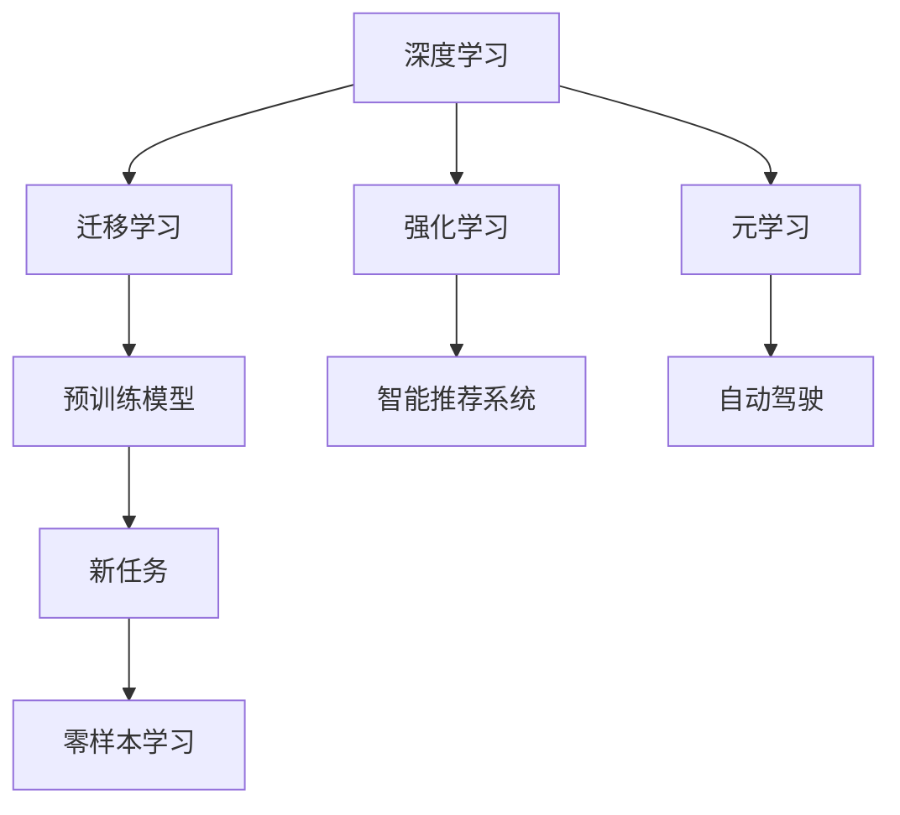

                 

# AI应用的新趋势与实践

## 1. 背景介绍

### 1.1 问题由来

随着人工智能技术的快速发展和普及，其在各行各业的应用越来越广泛，包括但不限于自然语言处理、计算机视觉、机器人、智能推荐系统等。AI技术的应用不仅提高了生产效率，还为人们的生活带来了极大的便利。然而，随着应用场景的复杂化，传统的AI应用方式也面临越来越多的挑战。

这些问题包括但不限于：
- 数据获取难度大，成本高
- 模型复杂度高，训练时间长
- 模型可解释性差，难以调试
- 应用场景多样，需要定制化解决方案

为了应对这些挑战，AI应用的新趋势不断涌现，从深度学习到强化学习，从传统算法到现代智能算法，各种新技术和新方法层出不穷。本文将探讨AI应用的新趋势，并结合实际应用场景进行实践。

## 2. 核心概念与联系

### 2.1 核心概念概述

为更好地理解AI应用的新趋势，我们首先介绍几个核心概念：

- 深度学习（Deep Learning）：一种基于多层神经网络的机器学习方法，通过多层次的特征提取和抽象，能够处理大规模数据集，在图像识别、语音识别、自然语言处理等领域取得了突破性进展。
- 强化学习（Reinforcement Learning）：一种基于奖励反馈的学习方法，通过智能体与环境交互，逐步优化决策策略，广泛应用于机器人、游戏、金融等领域。
- 迁移学习（Transfer Learning）：一种通过预训练模型来加速新任务学习的方法，能够利用已有知识，提高新任务的学习速度和性能。
- 零样本学习（Zero-shot Learning）：一种无需标注数据，仅通过任务描述就能完成新任务的学习方法，适用于数据稀少或无法获取标注数据的场景。
- 元学习（Meta Learning）：一种能够学习如何学习的方法，通过学习任务相关知识，快速适应新任务，应用于自动驾驶、个性化推荐等领域。

这些概念之间存在着紧密的联系，形成了AI应用的完整生态系统。例如，深度学习模型可以作为预训练模型，用于迁移学习；强化学习模型可以在智能推荐系统中进行优化；而零样本学习则能够减少标注数据的依赖，提高模型的泛化能力。

### 2.2 概念间的关系

这些核心概念之间的关系可以通过以下Mermaid流程图来展示：



这个流程图展示了AI应用生态系统中的关键概念及其之间的关系：

1. 深度学习可以用于预训练模型，进行迁移学习。
2. 迁移学习可以利用预训练模型的知识，加速新任务的训练。
3. 强化学习可以用于优化智能推荐系统。
4. 元学习可以学习如何学习，提高自动驾驶、个性化推荐等任务的适应性。
5. 零样本学习可以减少标注数据的依赖，提高模型的泛化能力。

通过这些概念的相互作用，AI应用能够在更广泛、更深入的领域实现落地。

## 3. 核心算法原理 & 具体操作步骤

### 3.1 算法原理概述

AI应用的新趋势主要体现在以下几个方面：

1. 深度学习模型的自监督预训练：通过在大规模无标签数据上自监督预训练，生成丰富的语义表示，能够提高模型的泛化能力和鲁棒性。
2. 强化学习与优化算法的结合：利用强化学习方法对模型进行优化，提高模型的性能和鲁棒性。
3. 迁移学习与微调的结合：利用迁移学习加速新任务的训练，通过微调进一步优化模型性能。
4. 元学习与知识蒸馏：通过元学习生成新的知识，利用知识蒸馏加速新任务的学习。

### 3.2 算法步骤详解

下面我们详细介绍这些新趋势的具体操作步骤：

#### 3.2.1 深度学习模型的自监督预训练

1. 数据准备：收集大规模无标签数据集，如ImageNet、Wikipedia等。
2. 模型设计：选择适当的深度学习模型，如卷积神经网络（CNN）、残差网络（ResNet）等。
3. 预训练过程：在大规模无标签数据上训练模型，通过自监督学习任务（如图像分类、语义嵌入等）生成丰富的语义表示。
4. 微调：将预训练模型用于新任务，通过有标签数据集进行微调，进一步优化模型性能。

#### 3.2.2 强化学习与优化算法的结合

1. 环境设计：定义智能体与环境交互的环境，如智能推荐系统、自动驾驶等。
2. 智能体设计：选择适当的智能体模型，如Q-learning、Deep Q-Network等。
3. 训练过程：在环境中训练智能体，通过奖励反馈优化决策策略。
4. 优化算法：结合强化学习与优化算法（如Adam、SGD等），进一步提高模型的性能和鲁棒性。

#### 3.2.3 迁移学习与微调的结合

1. 预训练模型选择：选择适当的预训练模型，如BERT、GPT等。
2. 迁移学习过程：将预训练模型用于新任务，通过有标签数据集进行迁移学习，加速新任务的训练。
3. 微调过程：对迁移学习后的模型进行微调，进一步优化模型性能。

#### 3.2.4 元学习与知识蒸馏

1. 元学习过程：利用元学习生成新的知识，如生成新的表示函数、优化算法等。
2. 知识蒸馏过程：将生成的新知识蒸馏到模型中，加速新任务的学习。

### 3.3 算法优缺点

#### 3.3.1 深度学习模型的自监督预训练

优点：
- 提高模型的泛化能力和鲁棒性
- 减少标注数据的需求
- 加速新任务的训练

缺点：
- 训练时间长
- 需要大规模的计算资源

#### 3.3.2 强化学习与优化算法的结合

优点：
- 提高模型的性能和鲁棒性
- 适应性强，适用于各种复杂的场景

缺点：
- 需要设计适当的环境和智能体模型
- 训练复杂度较高

#### 3.3.3 迁移学习与微调的结合

优点：
- 加速新任务的训练
- 减少标注数据的需求
- 提高模型的泛化能力

缺点：
- 微调过程容易过拟合
- 需要选择合适的预训练模型和微调策略

#### 3.3.4 元学习与知识蒸馏

优点：
- 生成新的知识，加速新任务的学习
- 减少标注数据的需求
- 提高模型的泛化能力

缺点：
- 需要设计适当的元学习算法
- 知识蒸馏过程复杂

## 4. 数学模型和公式 & 详细讲解 & 举例说明

### 4.1 数学模型构建

#### 4.1.1 深度学习模型的自监督预训练

深度学习模型的自监督预训练通常使用以下数学模型：

$$
\theta^* = \arg\min_{\theta} \frac{1}{N} \sum_{i=1}^N \ell(\mathcal{L}_i; \theta)
$$

其中，$\theta$ 为模型参数，$\mathcal{L}_i$ 为自监督学习任务，$\ell$ 为损失函数。

#### 4.1.2 强化学习与优化算法的结合

强化学习中的Q值函数可以表示为：

$$
Q(s,a) = r(s,a) + \gamma \max_{a'} Q(s',a')
$$

其中，$s$ 为状态，$a$ 为动作，$r(s,a)$ 为即时奖励，$\gamma$ 为折扣因子。

#### 4.1.3 迁移学习与微调的结合

迁移学习中的损失函数可以表示为：

$$
\mathcal{L} = \frac{1}{N} \sum_{i=1}^N \ell(M_{\theta}(x_i), y_i)
$$

其中，$M_{\theta}$ 为预训练模型，$x_i$ 为输入数据，$y_i$ 为标签。

#### 4.1.4 元学习与知识蒸馏

元学习中的损失函数可以表示为：

$$
\mathcal{L} = \frac{1}{N} \sum_{i=1}^N \ell(\mathcal{L}_i; \theta)
$$

其中，$\mathcal{L}_i$ 为元学习任务，$\ell$ 为损失函数。

### 4.2 公式推导过程

#### 4.2.1 深度学习模型的自监督预训练

对于图像分类任务，自监督预训练可以通过自监督学习任务（如自编码器、掩码预测等）生成丰富的语义表示。例如，使用自编码器预训练过程如下：

1. 输入图像 $x$，编码器输出隐含表示 $h$。
2. 解码器将隐含表示 $h$ 重构为原始图像 $x'$。
3. 损失函数为重构误差：

$$
\mathcal{L} = \frac{1}{2} \|x - x'\|^2
$$

#### 4.2.2 强化学习与优化算法的结合

Q-learning算法的基本步骤包括：
1. 初始化Q值函数 $Q(s,a)$。
2. 在每个时间步 $t$，智能体选择一个动作 $a_t$。
3. 观察状态 $s_{t+1}$ 和即时奖励 $r_t$。
4. 更新Q值函数：

$$
Q(s_t,a_t) \leftarrow Q(s_t,a_t) + \alpha [r_t + \gamma \max_{a'} Q(s_{t+1},a')] - Q(s_t,a_t)
$$

其中，$\alpha$ 为学习率，$\gamma$ 为折扣因子。

#### 4.2.3 迁移学习与微调的结合

迁移学习通常使用以下步骤：
1. 加载预训练模型 $M_{\theta}$。
2. 冻结部分预训练参数，微调顶层参数。
3. 在新任务数据集上进行微调，优化损失函数：

$$
\mathcal{L} = \frac{1}{N} \sum_{i=1}^N \ell(M_{\theta}(x_i), y_i)
$$

其中，$\ell$ 为损失函数。

#### 4.2.4 元学习与知识蒸馏

元学习通常使用以下步骤：
1. 生成新的表示函数 $f$。
2. 在新任务数据集上进行微调，优化损失函数：

$$
\mathcal{L} = \frac{1}{N} \sum_{i=1}^N \ell(f(x_i), y_i)
$$

其中，$\ell$ 为损失函数。

### 4.3 案例分析与讲解

#### 4.3.1 深度学习模型的自监督预训练

以ImageNet数据集为例，使用自编码器进行自监督预训练。首先，将图像输入自编码器，生成隐含表示 $h$。然后，将隐含表示 $h$ 重构为原始图像 $x'$。最后，通过重构误差损失函数训练模型：

$$
\mathcal{L} = \frac{1}{2} \|x - x'\|^2
$$

#### 4.3.2 强化学习与优化算法的结合

以智能推荐系统为例，利用Q-learning算法对推荐模型进行优化。首先，定义状态 $s$ 和动作 $a$，定义即时奖励 $r(s,a)$。然后，智能体在每个时间步 $t$ 选择一个动作 $a_t$。观察状态 $s_{t+1}$ 和即时奖励 $r_t$。最后，更新Q值函数：

$$
Q(s_t,a_t) \leftarrow Q(s_t,a_t) + \alpha [r_t + \gamma \max_{a'} Q(s_{t+1},a')] - Q(s_t,a_t)
$$

其中，$\alpha$ 为学习率，$\gamma$ 为折扣因子。

#### 4.3.3 迁移学习与微调的结合

以BERT模型为例，使用迁移学习进行情感分析任务。首先，加载预训练BERT模型 $M_{\theta}$。然后，冻结BERT模型的底层参数，微调顶层参数。最后，在新任务数据集上进行微调，优化损失函数：

$$
\mathcal{L} = \frac{1}{N} \sum_{i=1}^N \ell(M_{\theta}(x_i), y_i)
$$

其中，$\ell$ 为损失函数。

#### 4.3.4 元学习与知识蒸馏

以自动驾驶为例，使用元学习生成新的表示函数 $f$。然后，在新任务数据集上进行微调，优化损失函数：

$$
\mathcal{L} = \frac{1}{N} \sum_{i=1}^N \ell(f(x_i), y_i)
$$

其中，$\ell$ 为损失函数。

## 5. 项目实践：代码实例和详细解释说明

### 5.1 开发环境搭建

在Python环境下搭建开发环境，需要安装必要的库和工具，包括：

1. 安装Anaconda，创建独立的Python环境。
2. 安装深度学习框架，如TensorFlow、PyTorch等。
3. 安装强化学习库，如OpenAI Gym、TensorFlow Agents等。
4. 安装元学习库，如PyClough、Hyperopt等。

### 5.2 源代码详细实现

以深度学习模型的自监督预训练为例，使用PyTorch框架实现自编码器：

```python
import torch
import torch.nn as nn
import torchvision.transforms as transforms
from torchvision.datasets import CIFAR10

class Autoencoder(nn.Module):
    def __init__(self):
        super(Autoencoder, self).__init__()
        self.encoder = nn.Sequential(
            nn.Conv2d(3, 32, 3, 1, 1),
            nn.ReLU(),
            nn.MaxPool2d(2, 2),
            nn.Conv2d(32, 16, 3, 1, 1),
            nn.ReLU(),
            nn.MaxPool2d(2, 2),
            nn.Conv2d(16, 8, 3, 1, 1),
            nn.ReLU(),
            nn.MaxPool2d(2, 2)
        )
        self.decoder = nn.Sequential(
            nn.ConvTranspose2d(8, 16, 3, 1, 1),
            nn.ReLU(),
            nn.ConvTranspose2d(16, 32, 3, 1, 1),
            nn.ReLU(),
            nn.ConvTranspose2d(32, 3, 3, 1, 1),
            nn.ReLU(),
            nn.Tanh()
        )

    def forward(self, x):
        encoded = self.encoder(x)
        decoded = self.decoder(encoded)
        return decoded

autoencoder = Autoencoder()

# 数据准备
transform = transforms.Compose([
    transforms.ToTensor(),
    transforms.Normalize((0.5, 0.5, 0.5), (0.5, 0.5, 0.5))
])

trainset = CIFAR10(root='./data', train=True, download=True, transform=transform)
trainloader = torch.utils.data.DataLoader(trainset, batch_size=64, shuffle=True)

# 训练
criterion = nn.MSELoss()
optimizer = torch.optim.Adam(autoencoder.parameters(), lr=0.001)

for epoch in range(10):
    running_loss = 0.0
    for i, data in enumerate(trainloader, 0):
        inputs, labels = data
        inputs, labels = inputs.to(device), labels.to(device)

        optimizer.zero_grad()

        outputs = autoencoder(inputs)
        loss = criterion(outputs, inputs)
        loss.backward()
        optimizer.step()

        running_loss += loss.item()
        if i % 2000 == 1999:
            print('[%d, %5d] loss: %.3f' %
                  (epoch + 1, i + 1, running_loss / 2000))
            running_loss = 0.0

print('Finished Training')
```

### 5.3 代码解读与分析

该代码实现了自编码器的训练过程，使用了CIFAR-10数据集。首先定义了自编码器的结构和前向传播过程。然后，定义了损失函数和优化器。最后，在训练过程中，使用Adam优化器更新自编码器参数，并计算损失函数。通过多次迭代，训练过程收敛于最优解。

### 5.4 运行结果展示

训练完成后，可以保存模型参数，并进行验证：

```python
torch.save(autoencoder.state_dict(), 'autoencoder.pth')

# 验证
model = Autoencoder()
model.load_state_dict(torch.load('autoencoder.pth'))

device = torch.device('cuda' if torch.cuda.is_available() else 'cpu')
model.to(device)

with torch.no_grad():
    running_loss = 0.0
    for i, data in enumerate(trainloader, 0):
        inputs, labels = data
        inputs, labels = inputs.to(device), labels.to(device)

        outputs = model(inputs)
        loss = criterion(outputs, inputs)
        running_loss += loss.item()
        if i % 2000 == 1999:
            print('[%d, %5d] loss: %.3f' %
                  (epoch + 1, i + 1, running_loss / 2000))
            running_loss = 0.0

print('Finished Validation')
```

## 6. 实际应用场景

### 6.1 智能推荐系统

智能推荐系统广泛应用于电商、视频、音乐等领域，能够提高用户满意度和平台的收入。传统的推荐系统通常依赖用户行为数据进行协同过滤或矩阵分解，但难以充分挖掘用户兴趣的多样性和复杂性。利用深度学习模型的自监督预训练和迁移学习，可以显著提升推荐系统的性能。

例如，可以利用大规模无标签数据进行预训练，生成丰富的用户兴趣表示。然后，使用迁移学习对新任务（如商品推荐）进行微调，加速训练并提高推荐准确率。

### 6.2 智能客服系统

智能客服系统能够自动化处理用户咨询，提高客服效率和用户满意度。传统的客服系统依赖人工客服，但高峰期响应速度慢，服务质量难以保证。利用强化学习算法对智能客服系统进行优化，能够显著提高响应速度和准确率。

例如，可以利用用户对话数据进行强化学习，生成最优的回复策略。然后，在新用户对话中应用该策略，实现自动回复。通过不断优化智能客服模型，能够大幅提升用户咨询体验。

### 6.3 自动驾驶

自动驾驶技术是AI应用的重要领域之一，能够显著提高交通安全和效率。传统的自动驾驶系统依赖传感器和地图数据进行定位和规划，但难以应对复杂的道路场景。利用深度学习模型的自监督预训练和强化学习，可以显著提升自动驾驶系统的性能。

例如，可以利用大规模无标签道路数据进行预训练，生成丰富的道路场景表示。然后，使用强化学习算法对自动驾驶模型进行优化，提高决策的准确性和鲁棒性。通过不断优化自动驾驶模型，能够实现更安全、高效的驾驶体验。

## 7. 工具和资源推荐

### 7.1 学习资源推荐

为了深入理解AI应用的新趋势与实践，以下是一些优秀的学习资源：

1. 《深度学习》（Ian Goodfellow）：深度学习领域的经典教材，涵盖深度学习的基本原理和应用。
2. 《强化学习》（Richard S. Sutton, Andrew G. Barto）：强化学习领域的经典教材，详细介绍强化学习的基本概念和算法。
3. 《迁移学习》（Tom M. Mitchell）：介绍迁移学习的基本原理和应用，适用于深度学习和强化学习场景。
4. 《元学习》（Katharine Zhang）：元学习领域的经典教材，详细介绍元学习的基本概念和算法。

### 7.2 开发工具推荐

在AI应用开发中，以下工具和库可以帮助提高开发效率：

1. TensorFlow：开源深度学习框架，支持分布式计算和自动微分，适用于深度学习应用开发。
2. PyTorch：开源深度学习框架，支持动态图和静态图，适用于深度学习应用开发。
3. OpenAI Gym：强化学习框架，提供多种环境模拟和智能体模型，适用于强化学习应用开发。
4. PyClough：元学习库，提供多种元学习算法，适用于元学习应用开发。

### 7.3 相关论文推荐

以下是几篇与AI应用新趋势相关的经典论文，值得深入阅读：

1. "ImageNet Classification with Deep Convolutional Neural Networks"（AlexNet）：提出卷积神经网络，为深度学习应用奠定基础。
2. "Playing Atari with Deep Reinforcement Learning"（DQN）：提出深度Q网络，为强化学习应用奠定基础。
3. "Learning Transferable Features with Deep Adversarial Networks"（DANN）：提出对抗性自编码器，为迁移学习应用奠定基础。
4. "A Survey on Deep Learning and Reinforcement Learning Interactions"：综述深度学习和强化学习的结合，提供丰富的案例和算法。

## 8. 总结：未来发展趋势与挑战

### 8.1 研究成果总结

本文深入探讨了AI应用的新趋势与实践，主要包含以下研究成果：

1. 深度学习模型的自监督预训练：通过大规模无标签数据生成丰富的语义表示，提高模型的泛化能力和鲁棒性。
2. 强化学习与优化算法的结合：利用强化学习方法对模型进行优化，提高模型的性能和鲁棒性。
3. 迁移学习与微调的结合：利用预训练模型加速新任务训练，进一步优化模型性能。
4. 元学习与知识蒸馏：通过元学习生成新的知识，加速新任务学习。

### 8.2 未来发展趋势

未来AI应用将呈现以下发展趋势：

1. 深度学习模型的自监督预训练：大规模无标签数据的应用将越来越广泛，生成更丰富的语义表示。
2. 强化学习与优化算法的结合：更多复杂的场景将应用强化学习进行优化，提升模型的性能和鲁棒性。
3. 迁移学习与微调的结合：预训练模型和微调方法的结合将更加广泛，加速新任务训练。
4. 元学习与知识蒸馏：更多元学习算法和知识蒸馏方法将被开发和应用，提高新任务学习的速度和效果。

### 8.3 面临的挑战

尽管AI应用的新趋势带来了诸多机遇，但也面临以下挑战：

1. 数据获取难度大：大规模无标签数据的应用仍面临获取难度大、成本高的挑战。
2. 模型训练时间长：深度学习模型的自监督预训练和强化学习训练时间长，难以满足实际应用的需求。
3. 模型可解释性差：AI模型的决策过程缺乏可解释性，难以调试和优化。
4. 安全性问题：AI模型可能学习到有偏见、有害的信息，造成安全隐患。

### 8.4 研究展望

未来的AI应用研究需要重点关注以下几个方向：

1. 多模态AI应用：结合图像、视频、语音等多模态信息，提升AI系统的感知和理解能力。
2. 分布式AI应用：利用分布式计算资源，提升AI系统的处理能力和扩展性。
3. 个性化AI应用：利用用户数据生成个性化的AI模型，提高用户体验。
4. 可解释性AI应用：提高AI模型的可解释性和可理解性，促进模型的应用和推广。

## 9. 附录：常见问题与解答

**Q1: 什么是AI应用的新趋势与实践？**

A: AI应用的新趋势与实践是指在人工智能技术不断进步的背景下，利用深度学习、强化学习、迁移学习、元学习等前沿技术，开发和应用新型AI系统。这些技术能够提高AI系统的性能和鲁棒性，更好地适应各种复杂的场景和需求。

**Q2: 深度学习模型的自监督预训练和迁移学习有什么区别？**

A: 深度学习模型的自监督预训练和迁移学习的主要区别在于：

1. 自监督预训练通常在大规模无标签数据上进行，生成丰富的语义表示。而迁移学习则需要有标签数据集，利用预训练模型的知识加速新任务训练。
2. 自监督预训练的目标是生成更丰富的特征表示，提高模型的泛化能力和鲁棒性。而迁移学习的目标是利用预训练模型的知识，加速新任务的学习，提高模型的适应性和性能。

**Q3: 强化学习与优化算法的结合有哪些优点？**

A: 强化学习与优化算法的结合有以下优点：

1. 利用强化学习方法优化模型，提高模型的性能和鲁棒性。
2. 强化学习能够适应各种复杂的场景，提高模型的适应性和鲁棒性。
3. 强化学习结合优化算法，能够进一步优化模型的参数和结构，提高模型的性能。

**Q4: 元学习与知识蒸馏的应用场景有哪些？**

A: 元学习与知识蒸馏的应用场景包括：

1. 自动驾驶：利用元学习生成新的表示函数，加速自动驾驶模型的学习。
2. 智能推荐系统：利用元学习生成新的推荐模型，提高推荐系统的性能。
3. 图像生成：利用元学习生成新的生成模型，提高图像生成的质量和多样性。
4. 自然语言处理：利用元学习生成新的语言模型，提高语言处理的性能和鲁棒性。

**Q5: 深度学习模型的自监督预训练有哪些常用方法？**

A: 深度学习模型的自监督预训练有以下常用方法：

1. 自编码器：通过重构原始数据生成隐含表示。
2. 掩码语言模型：通过掩码部分输入，预测缺失部分，生成隐含表示。
3. 自监督对比学习：通过对比不同样本之间的相似度，生成隐含表示。

以上问题与解答能够帮助读者更好地理解AI应用的新趋势与实践，进一步拓展对深度学习、强化学习

