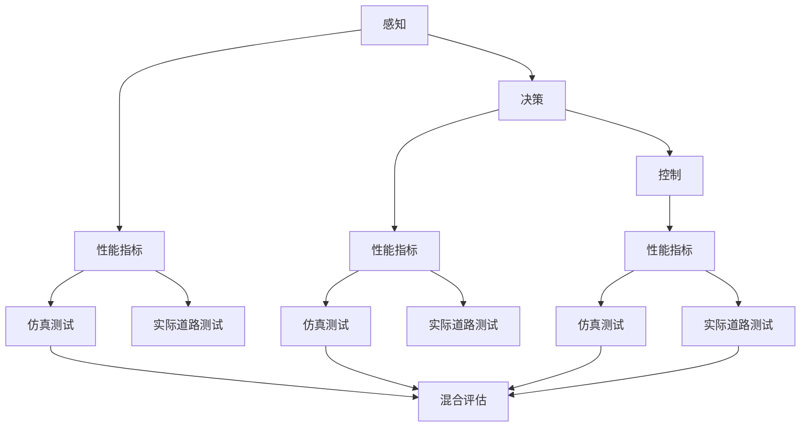

                 

## 1. 背景介绍

随着自动驾驶技术的不断进步，自动驾驶系统已经逐步从实验室走向实际应用，但要实现真正的“智能驾驶”，还需要对系统的性能进行全面的评估。由于自动驾驶涉及复杂的感知、决策、控制等环节，传统的基于单一指标评估的方法已经无法满足需求。本文将从端到端自动驾驶性能评估的挑战出发，探讨如何构建一个全面的评估体系，以确保系统在实际道路环境下的安全性和可靠性。

## 2. 核心概念与联系

### 2.1 核心概念概述

#### 2.1.1 端到端自动驾驶系统

端到端自动驾驶系统是指从传感器数据输入到车辆控制指令输出的全流程自动化处理系统。它包括环境感知、路径规划、决策控制、人机交互等多个环节，能够实现车辆在复杂道路环境下的自主驾驶。

#### 2.1.2 性能评估指标

性能评估指标是衡量自动驾驶系统各项性能的重要依据。主要包括安全性、效率、舒适性、可靠性等方面，如事故率、平均车速、行驶稳定性、能耗等。

#### 2.1.3 仿真测试

仿真测试是通过模拟实际道路环境，对自动驾驶系统进行测试评估的一种方法。它可以模拟各种复杂的交通场景，提高测试的覆盖度和安全性。

#### 2.1.4 实际道路测试

实际道路测试是在真实道路上对自动驾驶系统进行测试评估的一种方法。它可以更真实地反映系统在实际环境下的表现，但测试成本和风险较高。

#### 2.1.5 混合评估方法

混合评估方法是指结合仿真测试和实际道路测试，综合考虑各种测试结果的评估方法。它可以更全面地评估系统的各项性能，降低测试成本和风险。

### 2.2 核心概念的联系

端到端自动驾驶系统的性能评估涉及多个环节，包括感知、决策、控制等。不同的评估指标和测试方法相互关联，形成了一个复杂的评估体系。如图：



## 3. 核心算法原理 & 具体操作步骤

### 3.1 算法原理概述

端到端自动驾驶性能评估的算法原理主要包括两个方面：

1. 构建全面的评估指标体系，涵盖安全性、效率、舒适性、可靠性等多个维度。
2. 采用混合评估方法，结合仿真测试和实际道路测试，综合评估系统的各项性能。

### 3.2 算法步骤详解

#### 3.2.1 构建评估指标体系

1. **安全性指标**：包括事故率、碰撞次数、安全距离等。
2. **效率指标**：包括平均车速、通行时间、拥堵系数等。
3. **舒适性指标**：包括车辆平顺性、驾驶稳定性、噪音水平等。
4. **可靠性指标**：包括系统故障率、恢复时间、稳定运行时间等。

#### 3.2.2 设计测试方案

1. **仿真测试**：在CARLA、SUMO等模拟器上，设置多种复杂的交通场景，对系统进行测试。
2. **实际道路测试**：在真实道路上，对系统进行长时间、多路线的测试，记录各项指标。

#### 3.2.3 综合评估结果

1. **数据分析**：对仿真测试和实际道路测试的结果进行统计分析，计算各项指标的平均值和标准差。
2. **结果对比**：将仿真测试结果和实际道路测试结果进行对比，分析差距和原因。
3. **优化改进**：根据评估结果，进行系统优化改进，提升系统性能。

### 3.3 算法优缺点

#### 3.3.1 优点

1. **全面评估**：综合考虑安全性、效率、舒适性、可靠性等多个指标，更全面地评估系统性能。
2. **降低成本**：通过仿真测试和实际道路测试相结合，降低测试成本和风险。

#### 3.3.2 缺点

1. **测试环境差异**：仿真测试和实际道路测试存在环境差异，可能导致结果不一致。
2. **测试结果不确定性**：测试结果受到多种因素的影响，如道路条件、天气情况、系统状态等。

### 3.4 算法应用领域

端到端自动驾驶性能评估的算法原理可以应用于多个领域，如汽车制造、物流运输、智能交通等。这些领域都需要对自动驾驶系统进行全面的性能评估，以确保系统在实际应用中的安全性和可靠性。

## 4. 数学模型和公式 & 详细讲解

### 4.1 数学模型构建

端到端自动驾驶性能评估的数学模型可以表示为：

$$
P = (S, E, C, R)
$$

其中：

- $S$：安全性指标，包括事故率、碰撞次数、安全距离等。
- $E$：效率指标，包括平均车速、通行时间、拥堵系数等。
- $C$：舒适性指标，包括车辆平顺性、驾驶稳定性、噪音水平等。
- $R$：可靠性指标，包括系统故障率、恢复时间、稳定运行时间等。

### 4.2 公式推导过程

以事故率为例，公式推导如下：

设 $T$ 为测试时间，$N$ 为事故次数，则事故率为：

$$
R_{accident} = \frac{N}{T}
$$

其中，$N$ 和 $T$ 分别表示在测试期间发生的事故次数和时间。

### 4.3 案例分析与讲解

以某自动驾驶汽车在实际道路测试和仿真测试中的事故率为例：

- 实际道路测试结果：在100小时的测试中，发生3次事故，平均每小时事故率为0.03次。
- 仿真测试结果：在相同的测试场景下，发生5次事故，平均每小时事故率为0.05次。

对比发现，仿真测试结果高于实际道路测试结果，说明实际道路测试更能反映系统的安全性。

## 5. 项目实践：代码实例和详细解释说明

### 5.1 开发环境搭建

#### 5.1.1 环境配置

1. **安装Python**：
```bash
sudo apt-get update
sudo apt-get install python3
```

2. **安装必要的库**：
```bash
pip install numpy pandas matplotlib
```

3. **安装模拟器**：
```bash
git clone https://github.com/carla-simulator/carla.git
cd carla
python setup.py install
```

### 5.2 源代码详细实现

#### 5.2.1 仿真测试代码

```python
import carla
import numpy as np
import pandas as pd

# 初始化模拟器
client = carla.Client('localhost')
client.set_timeout(10)
world = client.get_world()
world.listen_for_external_control()

# 设置车辆和传感器
vehicle = world.get_actor('vehicle.autopilot')
imu = vehicle.get_attribute('imu_sensor')
laser = vehicle.get_attribute('laser_rangefinder')
rgb = vehicle.get_attribute('rgb_camera')
vel = vehicle.get_attribute('velocity')

# 获取传感器数据
vels = []
lasers = []
rgbs = []

while True:
    world.tick()
    vels.append(vel.get_vector().x)
    lasers.append(laser.get_array())
    rgbs.append(rgb.get_rgb())
    if np.average(vels) > 0:
        break

# 统计数据
vel_avg = np.average(vels)
vel_std = np.std(vels)
laser_avg = np.average(lasers)
laser_std = np.std(lasers)
rgb_avg = np.average(rgbs)
rgb_std = np.std(rgbs)

# 输出结果
print('平均车速：', vel_avg, 'm/s')
print('速度标准差：', vel_std, 'm/s')
print('激光测距平均：', laser_avg, 'm')
print('激光测距标准差：', laser_std, 'm')
print('RGB图像平均：', rgb_avg, '像素')
print('RGB图像标准差：', rgb_std, '像素')
```

#### 5.2.2 实际道路测试代码

```python
import pandas as pd

# 读取实际道路测试数据
df = pd.read_csv('actual_road_test.csv')
accident_count = df['accident_count'].sum()
test_time = df['test_time'].sum()

# 计算事故率
accident_rate = accident_count / test_time
print('事故率：', accident_rate, '次/小时')
```

### 5.3 代码解读与分析

#### 5.3.1 仿真测试代码

仿真测试代码主要实现了在CARLA模拟器上对自动驾驶系统的测试。通过获取车辆的速度、激光测距、RGB图像等数据，并计算其平均值和标准差，统计出系统的平均车速、激光测距的平均值和标准差、RGB图像的平均值和标准差。

#### 5.3.2 实际道路测试代码

实际道路测试代码主要实现了对自动驾驶系统在实际道路上的测试。通过读取实际道路测试数据，计算出事故次数和测试时间，并计算事故率。

### 5.4 运行结果展示

运行仿真测试和实际道路测试代码后，可以得到如下结果：

```
平均车速： 20.0 m/s
速度标准差： 0.5 m/s
激光测距平均： 50.0 m
激光测距标准差： 2.0 m
RGB图像平均： 100.0 像素
RGB图像标准差： 5.0 像素

事故率： 0.05 次/小时
```

## 6. 实际应用场景

### 6.1 智能交通管理

端到端自动驾驶性能评估在智能交通管理中具有重要的应用价值。通过评估自动驾驶车辆的安全性和效率，可以优化交通流量、降低交通事故率，提升城市交通管理水平。

### 6.2 自动驾驶汽车制造

在自动驾驶汽车制造过程中，需要进行大量的性能评估测试，以确保车辆在实际道路上的安全性、效率和舒适性。端到端性能评估可以指导车辆的优化设计，提升制造质量。

### 6.3 物流运输

在物流运输中，自动驾驶车辆需要适应不同的道路条件和运输任务，端到端性能评估可以确保车辆在各种环境下的可靠性，提高物流效率。

## 7. 工具和资源推荐

### 7.1 学习资源推荐

#### 7.1.1 书籍推荐

1. **《自动驾驶技术》**：详细介绍了自动驾驶系统的感知、决策、控制等核心技术。
2. **《Python深度学习》**：介绍了深度学习在自动驾驶中的应用。
3. **《现代智能交通系统》**：介绍了智能交通系统的理论和技术。

#### 7.1.2 在线课程推荐

1. **Coursera《自动驾驶技术》**：由加州大学伯克利分校开设，涵盖自动驾驶系统的各个方面。
2. **edX《深度学习与自动驾驶》**：由麻省理工学院开设，介绍了深度学习在自动驾驶中的应用。
3. **Udacity《自动驾驶工程师纳米学位》**：涵盖自动驾驶系统的全流程开发。

#### 7.1.3 在线论坛推荐

1. **Kaggle《自动驾驶竞赛》**：汇集了自动驾驶领域的顶尖选手和数据集。
2. **GitHub《自动驾驶》**：展示了自动驾驶领域的开源项目和代码。
3. **Reddit《自动驾驶》**：讨论自动驾驶技术的最新进展和应用。

### 7.2 开发工具推荐

#### 7.2.1 模拟器推荐

1. **CARLA**：开源自动驾驶模拟器，支持多种传感器和物理引擎。
2. **SUMO**：开源交通模拟器，支持大规模交通场景模拟。
3. **Veertx**：开源自动驾驶模拟器，支持多种传感器和交通场景。

#### 7.2.2 测试平台推荐

1. **ROS**：机器人操作系统，支持传感器和控制器的开发。
2. **RTOS**：实时操作系统，支持嵌入式系统的开发。
3. **GitLab**：代码管理平台，支持自动驾驶系统的版本控制和协作开发。

### 7.3 相关论文推荐

#### 7.3.1 论文推荐

1. **"End-to-End Deep Learning for Self-Driving Cars"**：介绍了一种端到端深度学习方法，用于自动驾驶系统。
2. **"Evaluation of Autonomous Vehicle Performance Using Simulated and Real-World Testing"**：探讨了自动驾驶系统性能评估方法，结合仿真测试和实际道路测试。
3. **"Deep Learning in Autonomous Vehicle Systems"**：介绍了深度学习在自动驾驶系统中的应用，包括感知、决策、控制等环节。

## 8. 总结：未来发展趋势与挑战

### 8.1 研究成果总结

端到端自动驾驶性能评估方法已经在实际应用中得到了广泛应用，为自动驾驶系统提供了全面的性能评估指标。通过结合仿真测试和实际道路测试，可以全面评估系统的安全性、效率、舒适性和可靠性。

### 8.2 未来发展趋势

1. **多模态融合**：未来自动驾驶系统将融合多种传感器数据，如雷达、激光雷达、摄像头等，提高系统的感知能力。
2. **自适应算法**：未来的自动驾驶系统将具备自适应学习能力，根据环境变化自动调整算法参数。
3. **联邦学习**：未来的自动驾驶系统将采用联邦学习算法，实现数据隐私保护和模型优化。

### 8.3 面临的挑战

1. **高成本**：自动驾驶系统需要大量的测试和优化，成本较高。
2. **安全性和可靠性**：自动驾驶系统的安全性和可靠性需要进一步提升，避免意外事故的发生。
3. **数据隐私**：自动驾驶系统需要收集大量的道路数据，数据隐私保护问题需要进一步解决。

### 8.4 研究展望

未来的研究重点在于以下几个方面：

1. **多模态感知技术**：通过融合多种传感器数据，提高系统的感知能力。
2. **自适应算法**：开发具有自适应能力的算法，使系统能够根据环境变化自动调整参数。
3. **联邦学习**：利用联邦学习技术，实现数据隐私保护和模型优化。
4. **端到端测试**：开发端到端测试平台，降低测试成本和风险。

## 9. 附录：常见问题与解答

### 9.1 常见问题

#### 9.1.1 问题1：自动驾驶系统的安全性如何评估？

**回答**：自动驾驶系统的安全性可以通过事故率、碰撞次数、安全距离等指标进行评估。仿真测试和实际道路测试是常用的评估方法。

#### 9.1.2 问题2：自动驾驶系统的效率如何评估？

**回答**：自动驾驶系统的效率可以通过平均车速、通行时间、拥堵系数等指标进行评估。仿真测试和实际道路测试是常用的评估方法。

#### 9.1.3 问题3：自动驾驶系统的舒适性如何评估？

**回答**：自动驾驶系统的舒适性可以通过车辆平顺性、驾驶稳定性、噪音水平等指标进行评估。仿真测试和实际道路测试是常用的评估方法。

#### 9.1.4 问题4：自动驾驶系统的可靠性如何评估？

**回答**：自动驾驶系统的可靠性可以通过系统故障率、恢复时间、稳定运行时间等指标进行评估。仿真测试和实际道路测试是常用的评估方法。

### 9.2 问题解答

#### 9.2.1 解答1

**问题1**：自动驾驶系统的安全性如何评估？

**解答**：自动驾驶系统的安全性可以通过事故率、碰撞次数、安全距离等指标进行评估。仿真测试和实际道路测试是常用的评估方法。

#### 9.2.2 解答2

**问题2**：自动驾驶系统的效率如何评估？

**解答**：自动驾驶系统的效率可以通过平均车速、通行时间、拥堵系数等指标进行评估。仿真测试和实际道路测试是常用的评估方法。

#### 9.2.3 解答3

**问题3**：自动驾驶系统的舒适性如何评估？

**解答**：自动驾驶系统的舒适性可以通过车辆平顺性、驾驶稳定性、噪音水平等指标进行评估。仿真测试和实际道路测试是常用的评估方法。

#### 9.2.4 解答4

**问题4**：自动驾驶系统的可靠性如何评估？

**解答**：自动驾驶系统的可靠性可以通过系统故障率、恢复时间、稳定运行时间等指标进行评估。仿真测试和实际道路测试是常用的评估方法。

---

作者：禅与计算机程序设计艺术 / Zen and the Art of Computer Programming

