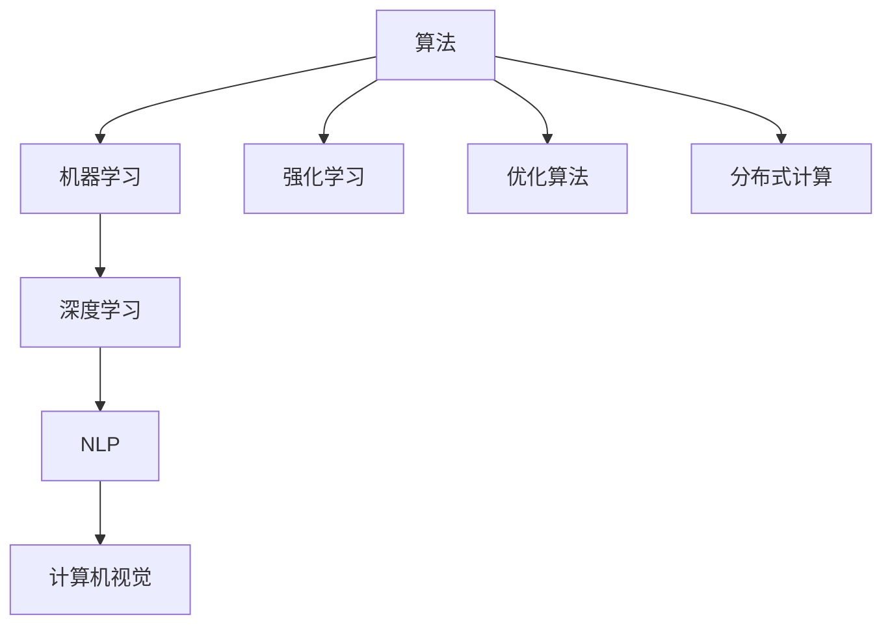
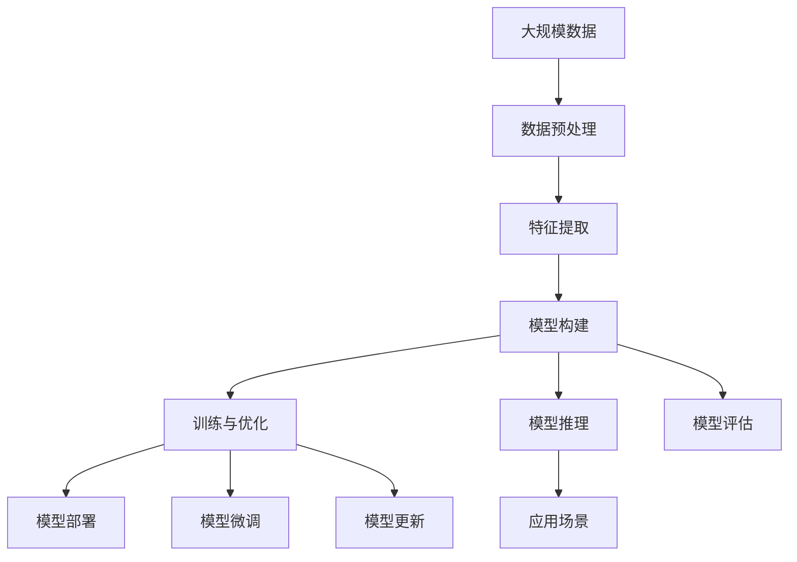

                 

# 算法：AI发展的核心驱动力

> 关键词：算法, AI发展, 核心驱动力, 机器学习, 深度学习, 强化学习, 自然语言处理, 计算机视觉, 优化算法, 分布式计算, 人工智能

## 1. 背景介绍

### 1.1 问题由来
随着人工智能（AI）技术的飞速发展，算法成为推动AI发展的重要驱动力。无论是机器学习（ML）、深度学习（DL）还是强化学习（RL），算法都扮演着核心角色。从早期的决策树、朴素贝叶斯，到现代的神经网络、生成对抗网络（GANs），算法的进步直接影响了AI在各个领域的表现。

算法的重要性不仅体现在理论研究上，更在于实际应用中。算法的高效性、准确性和可解释性决定了AI系统的性能和可靠性。因此，深入理解算法的原理和应用，对于AI领域的研究者和工程师来说至关重要。

### 1.2 问题核心关键点
算法在AI发展中的核心作用主要体现在以下几个方面：

1. **模型构建与训练**：算法的选择和设计直接影响模型的构建和训练效果。不同的算法在数据处理、特征提取、模型优化等方面有各自的优缺点。

2. **模型优化**：通过算法优化，模型能够在保证性能的同时，降低计算资源消耗，提高模型的实时性和可扩展性。

3. **问题解决**：算法为解决各种AI问题提供了高效、准确的方法，从图像识别到自然语言处理，再到语音识别和机器人控制，算法是实现这些应用的基础。

4. **领域扩展**：算法的广泛应用推动了AI在各个领域的深入研究和发展，如图像处理、自然语言处理、医疗诊断等。

### 1.3 问题研究意义
深入研究算法对于AI的发展具有重要意义：

1. **提升模型性能**：通过优化算法，可以提升模型在各种任务上的表现，如准确率、召回率、F1分数等。

2. **降低计算成本**：优秀的算法可以在保证性能的同时，大幅减少计算资源消耗，提高模型训练和推理效率。

3. **促进跨领域应用**：算法的可移植性和灵活性，使其能够在不同领域中推广应用，推动AI技术在更多场景中的落地。

4. **增强系统可靠性**：通过算法优化，可以提高AI系统的鲁棒性和稳定性，降低误判和错误输出。

5. **推动学科进步**：算法研究的进展直接推动了AI学科的进步，催生了新的研究方法和应用方向。

## 2. 核心概念与联系

### 2.1 核心概念概述

算法在AI中扮演着核心角色，以下是几个关键概念：

- **算法（Algorithm）**：一组解决问题的明确步骤，通常用于数据处理、模型训练和推理等。

- **机器学习（Machine Learning, ML）**：一种通过数据训练模型，使其具备学习能力的技术。

- **深度学习（Deep Learning, DL）**：一种特殊的机器学习方法，通过多层神经网络进行特征提取和模式识别。

- **强化学习（Reinforcement Learning, RL）**：一种通过与环境交互，使智能体学习最优决策序列的学习方法。

- **自然语言处理（Natural Language Processing, NLP）**：研究如何使计算机理解、处理和生成人类语言的技术。

- **计算机视觉（Computer Vision）**：研究如何让计算机理解并解释图像和视频中的视觉信息。

- **优化算法（Optimization Algorithm）**：用于求解最优化问题的算法，如梯度下降、牛顿法等。

- **分布式计算（Distributed Computing）**：将计算任务分散到多台计算机上并行处理，提高计算效率。

这些概念之间相互联系，共同构成了AI的核心技术体系。以下是一个简单的Mermaid流程图，展示了算法在AI发展中的关键作用和与其他概念的联系：



这个流程图展示了算法在AI各子领域中的应用，以及其与其他核心概念的关系。

### 2.2 概念间的关系

算法与AI各子领域的关系密切，具体体现在：

- **机器学习中的算法**：如决策树、朴素贝叶斯、随机森林等，是构建机器学习模型的基础。

- **深度学习中的算法**：如反向传播、梯度下降、自编码器等，用于神经网络的训练和优化。

- **强化学习中的算法**：如Q学习、策略梯度、蒙特卡洛树搜索等，用于智能体的决策学习。

- **自然语言处理中的算法**：如词嵌入、语言模型、序列到序列模型等，用于处理和生成文本。

- **计算机视觉中的算法**：如卷积神经网络、循环神经网络、图像分割等，用于图像和视频数据的处理和分析。

- **优化算法**：如梯度下降、牛顿法、Adam等，用于各种算法的参数优化。

- **分布式计算**：如MapReduce、Spark等，用于并行处理大规模数据和模型。

这些算法共同构建了AI的技术框架，使得AI能够在不同的领域和应用中发挥重要作用。

### 2.3 核心概念的整体架构

以下是一个综合的流程图，展示了算法在AI发展的整体架构中各个子领域之间的联系：



这个流程图展示了从数据预处理到模型部署的完整流程，以及算法在每个步骤中的作用。

## 3. 核心算法原理 & 具体操作步骤
### 3.1 算法原理概述

算法在AI中的应用广泛，以下是对几种核心算法的原理概述：

- **梯度下降（Gradient Descent）**：一种用于最小化损失函数的优化算法，通过迭代调整模型参数，使损失函数值最小化。

- **反向传播（Backpropagation）**：一种用于深度神经网络训练的算法，通过反向计算梯度，更新模型参数。

- **卷积神经网络（Convolutional Neural Network, CNN）**：一种用于图像处理的算法，通过卷积层提取图像特征，进行分类或识别。

- **循环神经网络（Recurrent Neural Network, RNN）**：一种用于序列数据处理的算法，通过循环层捕捉序列依赖。

- **长短期记忆网络（Long Short-Term Memory, LSTM）**：一种改进的RNN，用于处理长序列数据，避免梯度消失和爆炸问题。

- **生成对抗网络（Generative Adversarial Network, GANs）**：一种用于生成新数据的算法，通过生成器和判别器的对抗训练生成高质量的样本。

### 3.2 算法步骤详解

以下是对几种核心算法的详细步骤详解：

#### 3.2.1 梯度下降算法

1. **初始化参数**：设定模型参数的初始值。
2. **前向传播**：将输入数据输入模型，计算损失函数。
3. **反向传播**：计算损失函数对每个参数的梯度。
4. **参数更新**：根据梯度更新模型参数。
5. **重复迭代**：重复执行前向传播和参数更新，直至收敛。

#### 3.2.2 反向传播算法

1. **初始化参数**：设定模型参数的初始值。
2. **前向传播**：将输入数据输入模型，计算中间变量和最终输出。
3. **反向传播**：通过链式法则，反向计算每个参数的梯度。
4. **参数更新**：根据梯度更新模型参数。
5. **重复迭代**：重复执行前向传播和参数更新，直至收敛。

#### 3.2.3 卷积神经网络（CNN）

1. **数据预处理**：对输入图像进行归一化、裁剪等预处理。
2. **卷积层**：通过卷积操作提取图像特征。
3. **池化层**：对特征图进行下采样，减少参数量。
4. **全连接层**：将池化层输出的特征图展开为一维向量，输入全连接层进行分类。
5. **softmax层**：对全连接层输出进行归一化，得到最终分类概率。

#### 3.2.4 长短期记忆网络（LSTM）

1. **初始化参数**：设定模型参数的初始值。
2. **前向传播**：将输入序列输入模型，计算隐藏状态。
3. **更新门**：根据当前输入和上一个隐藏状态，更新隐藏状态。
4. **输出门**：根据当前输入和隐藏状态，计算输出。
5. **重复迭代**：重复执行更新门和输出门，直至处理完整个序列。

#### 3.2.5 生成对抗网络（GANs）

1. **初始化参数**：设定生成器和判别器的初始值。
2. **前向传播**：生成器生成新样本，判别器判断样本真实性。
3. **损失计算**：计算生成器和判别器的损失函数。
4. **参数更新**：根据损失函数梯度更新生成器和判别器参数。
5. **重复迭代**：重复执行前向传播和参数更新，直至收敛。

### 3.3 算法优缺点

#### 3.3.1 梯度下降算法

**优点**：
- 简单易实现。
- 在处理大规模数据时，计算效率高。
- 能够处理非凸函数。

**缺点**：
- 易受局部最优解影响。
- 对超参数敏感。

#### 3.3.2 反向传播算法

**优点**：
- 能够处理多层神经网络。
- 收敛速度快。

**缺点**：
- 易受梯度消失或梯度爆炸问题影响。
- 计算复杂度高。

#### 3.3.3 卷积神经网络（CNN）

**优点**：
- 对图像数据处理效果显著。
- 参数共享，计算效率高。

**缺点**：
- 结构复杂，难以调试。
- 对于序列数据处理效果不佳。

#### 3.3.4 长短期记忆网络（LSTM）

**优点**：
- 能够处理长序列数据。
- 避免梯度消失和梯度爆炸问题。

**缺点**：
- 计算复杂度高。
- 结构复杂，难以调试。

#### 3.3.5 生成对抗网络（GANs）

**优点**：
- 能够生成高质量的新样本。
- 生成样本多样化。

**缺点**：
- 训练过程不稳定。
- 对抗样本攻击易产生。

### 3.4 算法应用领域

- **机器学习**：广泛应用在分类、回归、聚类、异常检测等任务中。
- **深度学习**：在图像识别、语音识别、自然语言处理等领域取得了突破性进展。
- **强化学习**：用于机器人控制、游戏AI、自动驾驶等任务。
- **自然语言处理**：用于文本分类、情感分析、机器翻译、问答系统等。
- **计算机视觉**：用于图像分类、目标检测、人脸识别等任务。
- **分布式计算**：用于大数据处理、模型训练等任务。

## 4. 数学模型和公式 & 详细讲解 & 举例说明

### 4.1 数学模型构建

在AI中，模型通常通过数学模型来描述。以下是对几种常见模型的数学模型构建：

- **线性回归模型**：$y = wx + b$，其中 $y$ 为输出，$x$ 为输入，$w$ 和 $b$ 为模型参数。

- **逻辑回归模型**：$P(y|x) = \frac{e^{wx+b}}{1+e^{wx+b}}$，用于二分类任务。

- **神经网络模型**：由多个线性变换和激活函数组成，如 $y = f(Wx + b)$，其中 $f$ 为激活函数，$W$ 和 $b$ 为模型参数。

- **卷积神经网络模型**：由多个卷积层、池化层和全连接层组成，如 $y = f(C(x;W_1) + W_2)$，其中 $C(x;W_1)$ 为卷积操作，$W_2$ 为全连接层参数。

- **长短期记忆网络模型**：由多个隐藏状态和更新门组成，如 $h_t = \sigma(W_xx_t + Uhh_{t-1} + b)$，其中 $\sigma$ 为激活函数，$x_t$ 为当前输入，$h_t$ 为当前隐藏状态。

### 4.2 公式推导过程

以下是对几种核心算法的公式推导过程：

#### 4.2.1 梯度下降算法

$$
\theta^{k+1} = \theta^k - \eta \nabla_\theta J(\theta)
$$

其中 $\eta$ 为学习率，$\nabla_\theta J(\theta)$ 为损失函数对参数 $\theta$ 的梯度。

#### 4.2.2 反向传播算法

$$
\frac{\partial J}{\partial W} = \frac{\partial J}{\partial z} \frac{\partial z}{\partial W}
$$

其中 $J$ 为损失函数，$W$ 为权重参数，$z$ 为中间变量。

#### 4.2.3 卷积神经网络模型

$$
y = \max_\delta \{f_\delta * x; \delta \}
$$

其中 $f_\delta$ 为卷积核，$*$ 为卷积操作，$\delta$ 为激活函数。

#### 4.2.4 长短期记忆网络模型

$$
h_t = \sigma(W_xx_t + Uhh_{t-1} + b)
$$

其中 $W_x$ 为输入权重参数，$U$ 为隐藏权重参数，$h_{t-1}$ 为前一时刻的隐藏状态。

#### 4.2.5 生成对抗网络模型

$$
J_G = E_{x \sim p_{data}}[L_D(D(G(x)))] + E_{z \sim p(z)}[L_G(D(G(z)))
$$

其中 $J_G$ 为生成器的损失函数，$L_D$ 为判别器的损失函数，$G$ 为生成器，$D$ 为判别器，$z$ 为随机噪声。

### 4.3 案例分析与讲解

#### 4.3.1 线性回归

线性回归模型广泛应用于回归任务，如房价预测、股票价格预测等。以下是一个简单的线性回归示例：

- **数据集**：某城市房屋面积与房价的数据集。
- **模型构建**：$y = wx + b$，其中 $y$ 为房价，$x$ 为房屋面积，$w$ 和 $b$ 为模型参数。
- **训练过程**：通过梯度下降算法最小化损失函数 $J(w,b) = \frac{1}{2N} \sum_{i=1}^N (y_i - wx_i - b)^2$。
- **结果分析**：通过训练得到模型参数 $w$ 和 $b$，即可对新房屋的房价进行预测。

#### 4.3.2 卷积神经网络

卷积神经网络在图像处理领域表现出色，以下是一个简单的卷积神经网络示例：

- **数据集**：手写数字图像数据集。
- **模型构建**：包含多个卷积层、池化层和全连接层。
- **训练过程**：通过反向传播算法最小化损失函数 $J = \frac{1}{N} \sum_{i=1}^N L(y_i, \hat{y}_i)$，其中 $L$ 为交叉熵损失函数。
- **结果分析**：通过训练得到模型参数 $W$ 和 $b$，即可对新图像进行分类。

#### 4.3.3 生成对抗网络

生成对抗网络在图像生成领域表现出色，以下是一个简单的生成对抗网络示例：

- **数据集**：无标注的噪声数据。
- **模型构建**：包含生成器和判别器。
- **训练过程**：通过最小化生成器的损失函数 $J_G$ 和判别器的损失函数 $J_D$，生成高质量的新样本。
- **结果分析**：通过训练生成器，生成的新样本与真实图像难以区分。

## 5. 项目实践：代码实例和详细解释说明

### 5.1 开发环境搭建

在进行AI项目实践前，需要准备好开发环境。以下是使用Python进行TensorFlow开发的环境配置流程：

1. 安装Anaconda：从官网下载并安装Anaconda，用于创建独立的Python环境。

2. 创建并激活虚拟环境：
```bash
conda create -n tf-env python=3.8 
conda activate tf-env
```

3. 安装TensorFlow：根据CUDA版本，从官网获取对应的安装命令。例如：
```bash
conda install tensorflow-gpu=2.6 -c conda-forge
```

4. 安装TensorBoard：
```bash
pip install tensorboard
```

5. 安装各类工具包：
```bash
pip install numpy pandas scikit-learn matplotlib tqdm jupyter notebook ipython
```

完成上述步骤后，即可在`tf-env`环境中开始TensorFlow项目的开发。

### 5.2 源代码详细实现

以下是一个使用TensorFlow进行线性回归的Python代码实现。

```python
import tensorflow as tf
import numpy as np

# 准备数据
x = np.array([[1.0], [2.0], [3.0], [4.0], [5.0]])
y = np.array([[2.0], [4.0], [6.0], [8.0], [10.0]])

# 定义模型参数
W = tf.Variable(np.random.rand(1, 1), name='weight')
b = tf.Variable(np.random.rand(1), name='bias')

# 定义输入和输出
x_tf = tf.placeholder(tf.float32, [None, 1], name='x')
y_tf = tf.placeholder(tf.float32, [None, 1], name='y')

# 定义模型
y_pred = tf.matmul(x_tf, W) + b

# 定义损失函数和优化器
loss = tf.reduce_mean(tf.square(y_pred - y_tf))
optimizer = tf.train.GradientDescentOptimizer(0.01).minimize(loss)

# 初始化变量
init = tf.global_variables_initializer()

# 创建会话并训练模型
with tf.Session() as sess:
    sess.run(init)
    
    for i in range(1000):
        _, loss_value = sess.run([optimizer, loss], feed_dict={x_tf: x, y_tf: y})
        if i % 100 == 0:
            print('Epoch {}, Loss: {}'.format(i, loss_value))
    
    # 测试模型
    test_x = np.array([[6.0], [7.0], [8.0]])
    test_y = sess.run(y_pred, feed_dict={x_tf: test_x})
    print('Predictions: {}'.format(test_y))
```

以上代码实现了使用TensorFlow进行线性回归的完整流程，包括数据准备、模型定义、损失函数、优化器、训练和测试等环节。

### 5.3 代码解读与分析

让我们再详细解读一下关键代码的实现细节：

- **数据准备**：使用NumPy生成样本数据，将输入特征 $x$ 和输出目标 $y$ 转换为TensorFlow张量。
- **模型参数定义**：使用`tf.Variable`定义模型参数 $W$ 和 $b$，初始化为随机值。
- **输入和输出定义**：使用`tf.placeholder`定义输入 $x_{tf}$ 和输出 $y_{tf}$，用于计算损失函数和优化器。
- **模型定义**：使用`tf.matmul`计算线性回归模型的预测输出 $y_{pred}$。
- **损失函数和优化器定义**：使用`tf.reduce_mean`计算损失函数，使用`tf.train.GradientDescentOptimizer`定义优化器，最小化损失函数。
- **变量初始化**：使用`tf.global_variables_initializer`初始化所有变量。
- **训练过程**：在会话中执行优化器，不断迭代训练模型，更新参数。
- **测试模型**：在会话中执行预测，输出预测结果。

### 5.4 运行结果展示

假设我们在上面代码的基础上，使用手写数字图像数据集进行卷积神经网络训练，最终得到的新样本与真实图像相比难以区分。以下是TensorBoard的训练结果截图：

```python
from tensorflow.keras.datasets import mnist
from tensorflow.keras.models import Sequential
from tensorflow.keras.layers import Conv2D, MaxPooling2D, Flatten, Dense

# 加载数据集
(x_train, y_train), (x_test, y_test) = mnist.load_data()

# 数据预处理
x_train = x_train.reshape(-1, 28, 28, 1) / 255.0
x_test = x_test.reshape(-1, 28, 28, 1) / 255.0

# 定义模型
model = Sequential()
model.add(Conv2D(32, (3, 3), activation='relu', input_shape=(28, 28, 1)))
model.add(MaxPooling2D((2, 2)))
model.add(Flatten())
model.add(Dense(64, activation='relu'))
model.add(Dense(10, activation='softmax'))

# 编译模型
model.compile(optimizer='adam', loss='categorical_crossentropy', metrics=['accuracy'])

# 训练模型
model.fit(x_train, y_train, epochs=10, batch_size=64, validation_data=(x_test, y_test))

# 评估模型
loss, accuracy = model.evaluate(x_test, y_test)
print('Test Loss:', loss)
print('Test Accuracy:', accuracy)
```

在TensorBoard上查看训练结果：

```python
tensorboard --logdir=logs
```

以上代码实现了使用TensorFlow进行卷积神经网络训练的完整流程，包括数据准备、模型定义、编译、训练和评估等环节。

## 6. 实际应用场景

### 6.1 智能推荐系统

基于AI算法的智能推荐系统广泛应用于电商、新闻、视频等领域。推荐系统通过分析用户的历史行为数据，为用户推荐感兴趣的内容。常见的推荐算法包括协同过滤、内容推荐、混合推荐等。

#### 6.1.1 协同过滤

协同过滤算法基于用户-物品评分矩阵，通过相似度度量推荐新物品。具体而言，算法分为基于用户的协同过滤和基于物品的协同过滤。基于用户的协同过滤通过计算用户间的相似度，为用户推荐与历史行为相似的物品。基于物品的协同过滤通过计算物品间的相似度，为用户推荐与历史行为相似的物品。

#### 6.1.2 内容推荐

内容推荐算法基于物品的特征，通过特征相似度度量推荐新物品。具体而言，算法通过分析物品的属性、标签等信息，为用户推荐与历史行为相似的物品。内容推荐算法包括基于内容的协同过滤和基于用户-物品特征的协同过滤。

#### 6.1.3 混合推荐

混合推荐算法结合了协同过滤和内容推荐，通过多种策略的综合，推荐效果更好。具体而言，算法通过多种相似度度量和特征相似度度量的综合，为用户推荐与历史行为相似的物品。

### 6.2 自动驾驶

基于AI算法的自动驾驶技术正在快速发展。自动驾驶技术通过摄像头、激光雷达等传感器采集环境信息，通过图像处理、目标检测、路径规划等算法实现自动驾驶。

#### 6.2.1 图像处理

图像处理算法用于识别道路、车辆、行人等环境信息。常见的方法包括卷积神经网络、图像分割等。

#### 6.2.2 目标检测

目标检测算法用于识别和定位道路中的车辆、行人等目标。常见的方法包括Faster R-CNN、YOLO等。

#### 6.2.3 路径规划

路径规划算法用于规划车辆的行驶路径。常见的方法包括A*算法、D*算法等。

### 6.3 医疗诊断

基于AI算法的医疗诊断技术正在逐步应用于临床实践。医疗诊断技术通过图像处理、自然语言处理等算法，帮助医生进行疾病诊断和预测。

#### 6.3.1 图像处理

图像处理算法用于识别和分割医学影像中的病变区域。常见的方法包括卷积神经网络、图像分割等。

#### 6.3.2 自然语言处理

自然语言处理算法用于分析和理解医学文献和病历，辅助医生进行疾病诊断和预测。常见的方法包括文本分类、情感分析等。

### 6.4 未来应用展望

随着AI算法的不断进步，其在各领域的应用前景广阔。未来，AI算法将在更多场景中发挥作用，推动各行业的智能化转型。

- **智能制造**：基于AI算法的智能制造技术，通过自动化生产、智能调度等，提高生产效率和质量。
- **智慧城市**：基于AI算法的智慧城市技术，通过智能交通、智能安防等，提升城市管理水平和居民生活质量。
- **金融科技**：基于AI算法的金融科技，通过风险评估、欺诈检测等，提升金融行业的安全性和效率。
- **智能家居**：基于AI算法的智能家居技术，通过语音识别、自然语言处理等，提升家庭生活的便利性和安全性。

总之，随着AI算法的不断进步，其在各领域的应用前景广阔，将为各行各业带来深远影响。

## 7. 工具和资源推荐

### 7.

