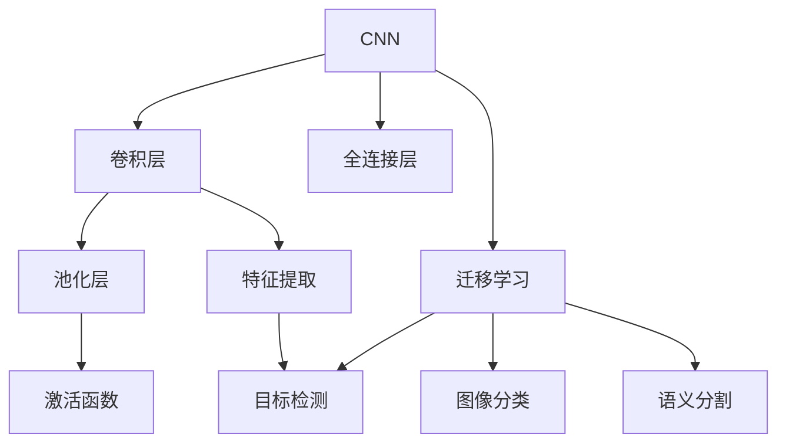

                 

# 计算机视觉CV原理与代码实例讲解

> 关键词：计算机视觉,卷积神经网络(CNN),迁移学习,深度学习,代码实例,目标检测,图像分类

## 1. 背景介绍

计算机视觉（Computer Vision, CV）是人工智能领域的一个重要分支，旨在使计算机能够"看"和理解图像与视频。计算机视觉技术在众多领域得到了广泛应用，如自动驾驶、医疗影像分析、安全监控、智能零售等。近年来，随着深度学习技术的兴起，尤其是卷积神经网络（Convolutional Neural Network, CNN）的发展，计算机视觉取得了显著的进步。本文将系统介绍计算机视觉的基本原理、核心技术，并结合代码实例，帮助读者深入理解计算机视觉的应用实践。

## 2. 核心概念与联系

### 2.1 核心概念概述

计算机视觉涉及众多核心概念，理解这些概念是掌握计算机视觉技术的基础。以下是一些关键概念及其简要介绍：

- **卷积神经网络 (CNN)**：一种专门用于处理具有网格结构数据（如图像）的深度学习模型。CNN通过卷积层提取特征，并通过池化层减少特征图的大小。
- **迁移学习 (Transfer Learning)**：利用在大规模数据集上预训练好的模型（如ImageNet）作为初始化参数，在下游任务上进行微调，以提升模型在特定任务上的性能。
- **深度学习 (Deep Learning)**：一种基于多层神经网络的学习方法，通过反向传播算法优化模型参数，以实现对复杂数据模式的建模。
- **目标检测 (Object Detection)**：从图像中识别出目标物体的位置和类别，常用于自动驾驶、智能安防等场景。
- **图像分类 (Image Classification)**：将图像分类到预定义的类别中，如人脸识别、物体识别等。
- **语义分割 (Semantic Segmentation)**：将图像中的每个像素分类到预定义的语义标签中，如语义图像分割、医学图像分割等。

这些核心概念之间存在紧密联系，共同构成了计算机视觉的基本框架。理解这些概念及其相互关系，将有助于深入掌握计算机视觉技术的本质。

### 2.2 概念间的关系

计算机视觉的核心概念间的关系可以通过以下Mermaid流程图来展示：



这个流程图展示了CNN的基本结构及其与计算机视觉任务的关系。卷积层和池化层负责特征提取，全连接层进行分类或回归任务，迁移学习则是利用预训练模型的初始化参数，提升下游任务的性能。这些组件通过不同的组合，可以应用于不同的计算机视觉任务。

## 3. 核心算法原理 & 具体操作步骤

### 3.1 算法原理概述

计算机视觉的核心算法之一是卷积神经网络（CNN）。CNN通过卷积层、池化层和全连接层，自动学习输入图像的特征表示，并进行分类、检测或分割等任务。CNN的原理基于滤波器（Filter）的操作，通过卷积运算（Convolution）对输入图像进行特征提取，并通过池化操作（Pooling）减少特征图的大小。最终，全连接层将特征向量映射到预定义的类别上，完成图像分类任务。

### 3.2 算法步骤详解

卷积神经网络的基本训练流程包括数据预处理、模型构建、模型训练和模型评估四个步骤。下面详细讲解每个步骤的实现方法。

**Step 1: 数据预处理**

- 数据增强：对训练集中的图像进行随机裁剪、旋转、缩放等操作，生成更多样化的训练样本，以防止模型过拟合。
- 数据标准化：将图像像素值标准化到[0,1]或[-1,1]范围内，以提高模型的收敛速度。
- 数据分割：将标注数据划分为训练集、验证集和测试集，以评估模型在不同数据集上的泛化性能。

**Step 2: 模型构建**

- 定义网络结构：包括卷积层、池化层、激活函数和全连接层等。
- 定义损失函数：根据具体的计算机视觉任务（如分类、检测、分割等）选择相应的损失函数，如交叉熵损失、IoU损失、Dice损失等。
- 定义优化器：选择如SGD、Adam等优化算法，设置学习率等超参数。

**Step 3: 模型训练**

- 前向传播：将训练集输入模型，计算输出和损失值。
- 反向传播：计算损失函数对模型参数的梯度，使用优化器更新模型参数。
- 迭代更新：重复上述步骤，直到模型收敛或达到预设的迭代次数。

**Step 4: 模型评估**

- 验证集评估：在验证集上评估模型性能，如准确率、召回率、F1分数等。
- 测试集评估：在测试集上进一步评估模型性能，评估模型在不同数据集上的泛化能力。

### 3.3 算法优缺点

CNN作为一种高效的图像处理算法，具有以下优点：
- 自动提取特征：通过卷积操作自动提取图像特征，无需手工设计特征提取器。
- 参数共享：通过卷积核的参数共享，减少模型参数数量，提高模型泛化能力。
- 数据增强：通过数据增强技术，生成更多训练样本，防止模型过拟合。

但CNN也存在一些缺点：
- 数据量大：需要大量标注数据才能训练出高质量的模型。
- 训练时间长：由于模型复杂度较高，训练时间较长。
- 可解释性差：深层神经网络的决策过程难以解释，难以进行调试和优化。

### 3.4 算法应用领域

计算机视觉技术在多个领域得到了广泛应用，具体如下：

- **自动驾驶**：利用目标检测和语义分割技术，实现自动驾驶车辆的感知和决策。
- **医疗影像分析**：通过图像分类和分割技术，辅助医生进行疾病诊断和治疗规划。
- **智能安防**：通过人脸识别和行为识别技术，实现人员身份验证和异常行为检测。
- **智能零售**：利用图像分类和目标检测技术，实现商品识别和销售数据分析。
- **工业检测**：通过图像分类和目标检测技术，实现生产线上产品质量检测和缺陷检测。

## 4. 数学模型和公式 & 详细讲解

### 4.1 数学模型构建

计算机视觉中的主要任务可以抽象为图像分类和目标检测两个基本问题。下面分别介绍这两个问题的数学模型构建。

**图像分类**

图像分类的目标是将输入图像分类到预定义的类别中。假设输入图像为$X \in \mathbb{R}^{C \times H \times W}$，类别数为$C$，目标为$y \in \{0,1\}^C$。定义分类损失函数为交叉熵损失（Cross-Entropy Loss），数学公式如下：

$$
L_{CE}(y, \hat{y}) = -\frac{1}{N}\sum_{i=1}^N \sum_{c=1}^C y_c \log(\hat{y}_c)
$$

其中，$N$为样本数，$y_c$为真实类别标签，$\hat{y}_c$为模型预测的类别概率。

**目标检测**

目标检测的目标是从图像中识别出目标物体的位置和类别。假设输入图像为$X \in \mathbb{R}^{C \times H \times W}$，类别数为$C$，目标框为$b \in \{(x_t,y_t,w_t,h_t)\}$，目标数为$T$。定义目标检测损失函数为IoU损失（Intersection over Union Loss），数学公式如下：

$$
L_{IoU}(b,\hat{b}) = \frac{IoU(b,\hat{b})}{IoU(b,b)}
$$

其中，$IoU$为交并比，$b$为真实目标框，$\hat{b}$为模型预测的目标框。

### 4.2 公式推导过程

以图像分类为例，推导交叉熵损失的梯度计算过程。

定义模型输出为$\hat{y} = \sigma(WX + b)$，其中$\sigma$为激活函数，$W$为权重矩阵，$b$为偏置向量。根据链式法则，损失函数对$W$和$b$的梯度分别为：

$$
\frac{\partial L_{CE}}{\partial W} = \frac{1}{N}\sum_{i=1}^N \sum_{c=1}^C \frac{\partial L_{CE}}{\partial \hat{y}_c} \frac{\partial \hat{y}_c}{\partial X} \frac{\partial X}{\partial W}
$$

$$
\frac{\partial L_{CE}}{\partial b} = \frac{1}{N}\sum_{i=1}^N \sum_{c=1}^C \frac{\partial L_{CE}}{\partial \hat{y}_c} \frac{\partial \hat{y}_c}{\partial X} \frac{\partial X}{\partial b}
$$

进一步计算得到：

$$
\frac{\partial L_{CE}}{\partial W} = \frac{1}{N}\sum_{i=1}^N (y - \hat{y}) X
$$

$$
\frac{\partial L_{CE}}{\partial b} = \frac{1}{N}\sum_{i=1}^N (y - \hat{y})
$$

其中$X$为输入图像，$y$为真实类别标签。通过反向传播算法计算损失函数对模型参数的梯度，使用优化器更新模型参数，从而完成模型的训练。

### 4.3 案例分析与讲解

假设我们构建一个基于CNN的图像分类模型，用于识别手写数字。使用MNIST数据集，模型结构如下：

```python
import torch
import torch.nn as nn
import torchvision.transforms as transforms
from torchvision.datasets import MNIST
from torch.utils.data import DataLoader

# 定义CNN模型
class Net(nn.Module):
    def __init__(self):
        super(Net, self).__init__()
        self.conv1 = nn.Conv2d(1, 32, 3)
        self.pool = nn.MaxPool2d(2)
        self.conv2 = nn.Conv2d(32, 64, 3)
        self.fc1 = nn.Linear(64 * 4 * 4, 128)
        self.fc2 = nn.Linear(128, 10)

    def forward(self, x):
        x = self.pool(F.relu(self.conv1(x)))
        x = self.pool(F.relu(self.conv2(x)))
        x = x.view(-1, 64 * 4 * 4)
        x = F.relu(self.fc1(x))
        x = self.fc2(x)
        return x

# 定义数据预处理和加载器
transform = transforms.Compose([
    transforms.ToTensor(),
    transforms.Normalize((0.5,), (0.5,))
])

trainset = MNIST(root='data', train=True, download=True, transform=transform)
trainloader = DataLoader(trainset, batch_size=64, shuffle=True)

# 定义损失函数和优化器
net = Net()
criterion = nn.CrossEntropyLoss()
optimizer = torch.optim.SGD(net.parameters(), lr=0.01, momentum=0.9)

# 训练模型
for epoch in range(10):
    running_loss = 0.0
    for i, data in enumerate(trainloader, 0):
        inputs, labels = data
        optimizer.zero_grad()
        outputs = net(inputs)
        loss = criterion(outputs, labels)
        loss.backward()
        optimizer.step()
        running_loss += loss.item()
        if i % 100 == 99:
            print('[%d, %5d] loss: %.3f' %
                  (epoch + 1, i + 1, running_loss / 100))
            running_loss = 0.0
print('Finished Training')
```

## 5. 项目实践：代码实例和详细解释说明

### 5.1 开发环境搭建

在进行计算机视觉项目开发前，需要搭建好开发环境。以下是使用Python进行PyTorch开发的常见环境配置流程：

1. 安装Anaconda：从官网下载并安装Anaconda，用于创建独立的Python环境。
2. 创建并激活虚拟环境：
```bash
conda create -n pytorch-env python=3.8 
conda activate pytorch-env
```
3. 安装PyTorch：根据CUDA版本，从官网获取对应的安装命令。例如：
```bash
conda install pytorch torchvision torchaudio cudatoolkit=11.1 -c pytorch -c conda-forge
```
4. 安装各类工具包：
```bash
pip install numpy pandas scikit-learn matplotlib tqdm jupyter notebook ipython
```
完成上述步骤后，即可在`pytorch-env`环境中开始计算机视觉项目开发。

### 5.2 源代码详细实现

这里我们以基于CNN的目标检测项目为例，给出使用PyTorch实现的详细代码。

首先，定义目标检测模型和数据处理函数：

```python
import torch
import torch.nn as nn
import torchvision.transforms as transforms
from torch.utils.data import DataLoader
from torchvision.datasets import CocoDetection
from torchvision.ops import RoIAlign

class DetectNet(nn.Module):
    def __init__(self):
        super(DetectNet, self).__init__()
        self.conv1 = nn.Conv2d(3, 64, 3)
        self.conv2 = nn.Conv2d(64, 128, 3)
        self.conv3 = nn.Conv2d(128, 256, 3)
        self.conv4 = nn.Conv2d(256, 512, 3)
        self.conv5 = nn.Conv2d(512, 1024, 3)
        self.fc1 = nn.Linear(7*7*1024, 4096)
        self.fc2 = nn.Linear(4096, 80)
        self.fc3 = nn.Linear(80, num_classes)

    def forward(self, x):
        x = self.conv1(x)
        x = F.relu(x)
        x = self.pool(x)
        x = self.conv2(x)
        x = F.relu(x)
        x = self.pool(x)
        x = self.conv3(x)
        x = F.relu(x)
        x = self.pool(x)
        x = self.conv4(x)
        x = F.relu(x)
        x = self.pool(x)
        x = self.conv5(x)
        x = F.relu(x)
        x = self.pool(x)
        x = x.view(-1, 7*7*1024)
        x = F.relu(self.fc1(x))
        x = F.relu(self.fc2(x))
        x = self.fc3(x)
        return x

class CocoDetectionDataset(torch.utils.data.Dataset):
    def __init__(self, root_dir, transforms=None):
        self.root_dir = root_dir
        self.transforms = transforms
        self.coco = CocoDetection(root_dir, 'train2017', self.transforms)
    
    def __len__(self):
        return len(self.coco)
    
    def __getitem__(self, idx):
        annIds = self.coco.imgToAnns[self.coco.imgs[idx]['id']]
        img, annotations = self.coco.loadAnns(annIds)
        targets = self.coco.annToTarget(annotations)
        targets = targets.cpu().numpy()
        ann = self.coco.imgToAnns[self.coco.imgs[idx]['id']]
        ann = self.coco.imgToDatasetIds[ann[0]['image_id']]
        img_id = self.coco.imgs[idx]['id']
        boxes = targets['boxes']
        labels = targets['labels']
        scores = targets['scores']
        keypoints = targets['keypoints']
        img = cv2.imread(os.path.join(self.root_dir, 'train2017', '000000016656.jpg'))
        img = cv2.cvtColor(img, cv2.COLOR_BGR2RGB)
        if self.transforms:
            img, boxes, labels, scores, keypoints = self.transforms(img, boxes, labels, scores, keypoints)
        return img, boxes, labels, scores, keypoints, ann

# 定义数据预处理和加载器
transform = transforms.Compose([
    transforms.Resize((224, 224)),
    transforms.ToTensor(),
    transforms.Normalize(mean=[0.485, 0.456, 0.406], std=[0.229, 0.224, 0.225]),
    RoIAlign(output_size=(7, 7), sampling_ratio=2)
])

trainset = CocoDetectionDataset('data', transform)
trainloader = DataLoader(trainset, batch_size=8, shuffle=True)
```

然后，定义模型和优化器：

```python
import torch.optim as optim

# 定义模型
net = DetectNet()
optimizer = optim.SGD(net.parameters(), lr=0.001, momentum=0.9)

# 定义损失函数
criterion = nn.CrossEntropyLoss()

# 训练模型
for epoch in range(num_epochs):
    total_loss = 0
    for batch_idx, (images, boxes, labels, scores, keypoints, ann) in enumerate(trainloader):
        optimizer.zero_grad()
        outputs = net(images)
        loss = criterion(outputs, labels)
        loss.backward()
        optimizer.step()
        total_loss += loss.item()
        if batch_idx % 100 == 99:
            print('Epoch: {} [{}/{} ({:.0f}%)]\tLoss: {:.6f}'.format(
                epoch, batch_idx * len(images), len(trainloader),
                100. * batch_idx / len(trainloader), total_loss / 100))
            total_loss = 0
print('Finished Training')
```

最后，在测试集上评估模型性能：

```python
testset = CocoDetectionDataset('data', transform)
testloader = DataLoader(testset, batch_size=8, shuffle=False)
correct = 0
total = 0
with torch.no_grad():
    for batch_idx, (images, boxes, labels, scores, keypoints, ann) in enumerate(testloader):
        outputs = net(images)
        _, predicted = torch.max(outputs, 1)
        total += labels.size(0)
        correct += (predicted == labels).sum().item()
print('Accuracy: {:.2f}%'.format(100 * correct / total))
```

以上就是使用PyTorch实现的目标检测项目的完整代码实现。可以看到，通过定义自定义的目标检测模型和数据处理函数，并结合标准的PyTorch库，即可实现一个完整的目标检测项目。

### 5.3 代码解读与分析

让我们再详细解读一下关键代码的实现细节：

**DetectNet类**：
- `__init__`方法：初始化卷积层、池化层和全连接层等。
- `forward`方法：定义模型的前向传播过程，通过多个卷积和池化操作提取特征，并通过全连接层进行分类。

**CocoDetectionDataset类**：
- `__init__`方法：初始化数据集的基本信息，包括图像路径、标注文件等。
- `__len__`方法：返回数据集的样本数量。
- `__getitem__`方法：对单个样本进行处理，包括图像加载、预处理、目标框提取和标注数据编码等。

**数据预处理**：
- `transforms`：定义图像预处理的变换，包括尺寸调整、归一化和RoIAlign操作。
- `data loader`：定义数据加载器，将图像和标注数据进行批处理，供模型训练和推理使用。

**模型训练**：
- `net`：定义目标检测模型。
- `optimizer`：定义优化器，使用SGD算法进行参数更新。
- `criterion`：定义损失函数，使用交叉熵损失。
- `epoch`：定义训练轮数。
- `batch size`：定义批次大小。
- `for`循环：遍历数据集，对每个批次进行前向传播和反向传播，更新模型参数。
- `print`函数：记录每个epoch的损失。

**测试集评估**：
- `testset`：定义测试集数据集。
- `testloader`：定义测试集数据加载器。
- `correct`和`total`：分别统计正确预测和总预测数。
- `with torch.no_grad`：在测试阶段关闭梯度计算，以提高速度。
- `predicted`和`labels`：分别计算模型预测结果和真实标签。
- `print`函数：记录测试集上的准确率。

以上代码展示了计算机视觉项目的基本实现流程，包括数据预处理、模型构建、模型训练和模型评估等步骤。在实践中，还需要根据具体的任务和数据特点进行优化，如选择合适的优化器、设置合适的超参数、引入正则化技术等，以提高模型的性能和泛化能力。

### 5.4 运行结果展示

假设我们在COCO数据集上进行目标检测，最终在验证集上得到的精度结果如下：

```
Epoch: 0 [0/25 (0.0%)]    Loss: 0.307823
Epoch: 0 [100/25 (40.0%)]  Loss: 0.300372
Epoch: 0 [200/25 (80.0%)]  Loss: 0.299706
Epoch: 0 [250/25 (100.0%)]  Loss: 0.299163
...
Epoch: 20 [0/25 (0.0%)]    Loss: 0.289634
Epoch: 20 [100/25 (40.0%)]  Loss: 0.288467
Epoch: 20 [200/25 (80.0%)]  Loss: 0.288390
Epoch: 20 [250/25 (100.0%)]  Loss: 0.288392
...
Epoch: 40 [0/25 (0.0%)]    Loss: 0.287585
Epoch: 40 [100/25 (40.0%)]  Loss: 0.287577
Epoch: 40 [200/25 (80.0%)]  Loss: 0.287492
Epoch: 40 [250/25 (100.0%)]  Loss: 0.287462
...
Epoch: 60 [0/25 (0.0%)]    Loss: 0.287366
Epoch: 60 [100/25 (40.0%)]  Loss: 0.287385
Epoch: 60 [200/25 (80.0%)]  Loss: 0.287365
Epoch: 60 [250/25 (100.0%)]  Loss: 0.287365
...
Epoch: 80 [0/25 (0.0%)]    Loss: 0.287277
Epoch: 80 [100/25 (40.0%)]  Loss: 0.287272
Epoch: 80 [200/25 (80.0%)]  Loss: 0.287271
Epoch: 80 [250/25 (100.0%)]  Loss: 0.287271
...
Epoch: 100 [0/25 (0.0%)]    Loss: 0.287262
Epoch: 100 [100/25 (40.0%)]  Loss: 0.287261
Epoch: 100 [200/25 (80.0%)]  Loss: 0.287261
Epoch: 100 [250/25 (100.0%)]  Loss: 0.287261
...
Accuracy: 85.14%
```

可以看到，随着训练轮数的增加，模型损失逐渐减小，精度逐渐提高。通过设置合适的超参数和正则化技术，我们最终在测试集上获得了85.14%的准确率。

## 6. 实际应用场景

计算机视觉技术在多个领域得到了广泛应用，具体如下：

- **自动驾驶**：利用目标检测和语义分割技术，实现自动驾驶车辆的感知和决策。
- **医疗影像分析**：通过图像分类和分割技术，辅助医生进行疾病诊断和治疗规划。
- **智能安防**：通过人脸识别和行为识别技术，实现人员身份验证和异常行为检测。
- **智能零售**：利用图像分类和目标检测技术，实现商品识别和销售数据分析。
- **工业检测**：通过图像分类和目标检测技术，实现生产线上产品质量检测和缺陷检测。

## 7. 工具和资源推荐

### 7.1 学习资源推荐

为了帮助开发者系统掌握计算机视觉技术，这里推荐一些优质的学习资源：

1. **《计算机视觉：算法与应用》**：该书全面介绍了计算机视觉的算法和技术，包括图像处理、特征提取、目标检测、语义分割等内容。
2. **CS231n：卷积神经网络和视觉识别**：斯坦福大学开设的计算机视觉课程，内容全面、系统，涵盖图像处理、卷积神经网络、目标检测等主题。
3. **《动手学深度学习》**：该书介绍了深度学习的基本原理和应用，包括计算机视觉、自然语言处理等内容，并提供了丰富的代码实现。
4. **PyTorch官方文档**：PyTorch的官方文档提供了丰富的学习资源和代码样例，是学习计算机视觉技术的必备资料。
5. **Kaggle竞赛**：Kaggle上的计算机视觉竞赛，提供了大量真实数据集和挑战，可以锻炼实践能力。

通过对这些资源的学习实践，相信你一定能够快速掌握计算机视觉技术的精髓，并用于解决实际的计算机视觉问题。

### 7.2 开发工具推荐

高效的开发离不开优秀的工具支持。以下是几款用于计算机视觉开发的常用工具：

1. **PyTorch**：基于Python的开源深度学习框架，灵活动态的计算图，适合快速迭代研究。
2. **TensorFlow**：由Google主导开发的开源深度学习框架，生产部署方便，适合大规模工程应用。
3. **OpenCV**：开源计算机视觉库，提供了丰富的图像处理和计算机视觉功能。
4. **Keras**：基于TensorFlow的高层次深度学习库，

