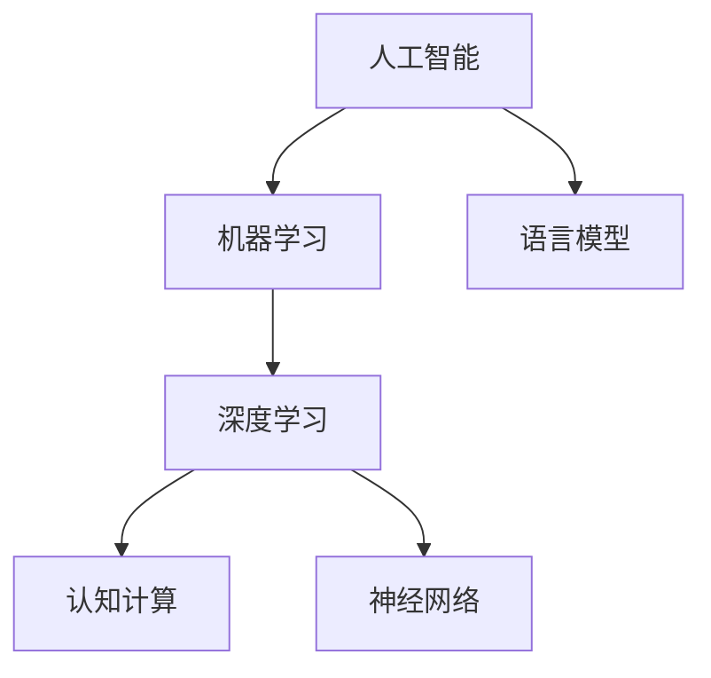
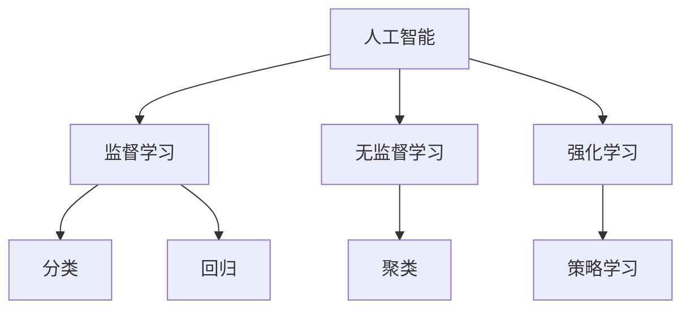
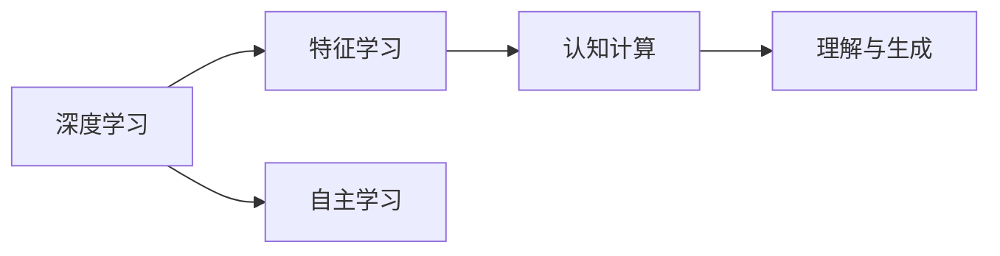
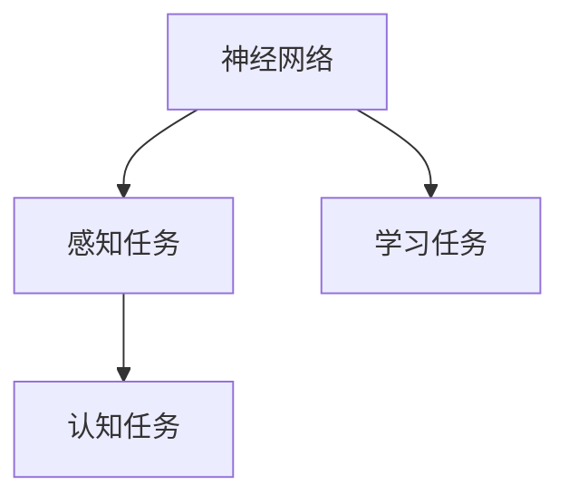
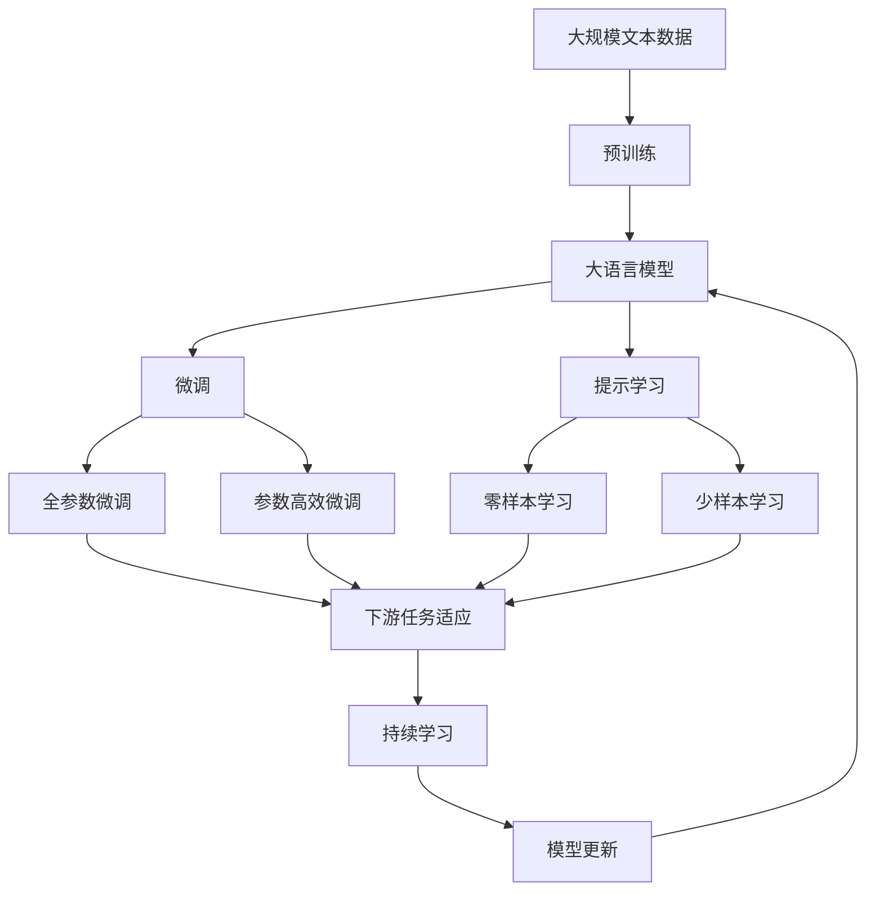

                 

# 计算：第四部分 计算的极限 第 12 章 机器能思考吗 人工智能的圣杯

> 关键词：人工智能,机器学习,深度学习,神经网络,认知,计算极限,理论突破

## 1. 背景介绍

### 1.1 问题由来
随着计算机技术的发展，人工智能（AI）已经从科幻小说中的幻想变为现实。从简单的图像识别到复杂的自然语言处理，再到自动驾驶、机器人，AI 技术在各个领域都取得了突破性的进展。然而，尽管如此，人们对于机器是否能够真正思考，能否拥有与人类相似的认知能力，仍然存在诸多疑虑。

### 1.2 问题核心关键点
机器能否思考的核心关键点在于其是否具备自主的认知能力和推理能力。这涉及到几个关键问题：
1. **认知能力**：机器能否理解、处理和生成复杂的语言信息，并具备常识推理的能力？
2. **自主性**：机器能否在没有明确指令的情况下，自主学习新知识，并应用于不同领域？
3. **创造力**：机器能否具备创新的思维，生成新颖的解决方案？
4. **情感智能**：机器能否理解人类情感，具备同理心？

这些问题的答案不仅关系到技术本身，更涉及到哲学、伦理学和社会学等诸多领域。因此，研究机器是否能思考，成为人工智能领域的圣杯。

### 1.3 问题研究意义
研究机器是否能思考，对于推动人工智能技术的边界扩展，探索人工智能在伦理、安全等方面的挑战，具有重要意义：

1. **技术突破**：掌握机器思考的原理和技术，有助于推动认知计算、自然语言处理等前沿领域的理论突破。
2. **应用前景**：通过理解机器的认知能力，可以更好地开发人机协同系统，提升自动化、智能化水平。
3. **伦理考量**：探讨机器思考的伦理问题，有助于避免潜在的风险和滥用，确保技术的发展符合人类的利益。
4. **社会影响**：研究机器思考对社会、文化、法律等领域的影响，为人工智能技术的应用提供指导。

## 2. 核心概念与联系

### 2.1 核心概念概述

为了更好地理解机器思考的原理，本节将介绍几个核心概念：

- **人工智能（AI）**：模拟人类智能行为的技术，包括学习、推理、知识获取等。
- **机器学习（ML）**：通过数据驱动的方式，使机器具备自主学习能力。
- **深度学习（DL）**：一种特殊类型的机器学习，通过多层神经网络模拟人类神经系统的运作方式。
- **认知计算（CC）**：研究机器如何理解、处理和生成复杂的认知任务，如语言、视觉等。
- **神经网络（NN）**：模拟人脑神经元网络的结构和功能，用于实现认知任务。
- **语言模型**：用于预测文本序列的模型，包括自回归和自编码等。

这些概念之间的逻辑关系可以通过以下Mermaid流程图来展示：



这个流程图展示了人工智能、机器学习、深度学习、认知计算、神经网络和语言模型之间的联系。

### 2.2 概念间的关系

这些核心概念之间存在着紧密的联系，形成了人工智能研究的完整生态系统。下面我通过几个Mermaid流程图来展示这些概念之间的关系。

#### 2.2.1 人工智能的学习范式



这个流程图展示了人工智能的三种主要学习范式：监督学习、无监督学习和强化学习。监督学习用于分类和回归任务，无监督学习用于聚类和特征学习，强化学习用于策略学习。

#### 2.2.2 深度学习与认知计算的关系



这个流程图展示了深度学习在特征学习和自主学习方面的作用，以及其对认知计算的影响。

#### 2.2.3 神经网络与认知任务的关系



这个流程图展示了神经网络在感知和认知任务中的应用，以及其在学习任务中的作用。

### 2.3 核心概念的整体架构

最后，我们用一个综合的流程图来展示这些核心概念在大语言模型微调过程中的整体架构：



这个综合流程图展示了从预训练到微调，再到持续学习的完整过程。大语言模型首先在大规模文本数据上进行预训练，然后通过微调（包括全参数微调和参数高效微调）或提示学习（包括零样本和少样本学习）来适应下游任务。最后，通过持续学习技术，模型可以不断学习新知识，同时避免遗忘旧知识。

## 3. 核心算法原理 & 具体操作步骤
### 3.1 算法原理概述

基于深度学习的认知计算范式，机器的思考过程可以分为两个阶段：感知和理解。感知阶段通过神经网络处理输入数据，形成特征表示；理解阶段则通过认知计算，将特征表示映射到认知空间，从而实现推理和决策。

形式化地，设输入为 $x$，认知模型为 $f(x)$，输出为 $y$。机器思考的数学模型为：

$$
y = f(x)
$$

其中 $f(x)$ 是一个映射函数，可以通过深度学习中的多层神经网络实现。

### 3.2 算法步骤详解

基于深度学习的认知计算，认知模型的一般步骤包括：

1. **数据预处理**：将原始数据转换为适合神经网络处理的格式，如文本分词、图像预处理等。
2. **特征提取**：通过神经网络对输入数据进行特征提取，形成高维特征向量。
3. **编码与解码**：将特征向量通过编码器映射到认知空间，再通过解码器生成输出。
4. **训练与优化**：使用反向传播算法和优化器（如Adam、SGD等）对模型进行训练和优化，最小化损失函数。
5. **推理与生成**：使用训练好的模型对新的输入进行推理和生成，实现认知任务。

### 3.3 算法优缺点

基于深度学习的认知计算具有以下优点：

1. **高精度**：深度学习模型可以学习复杂的非线性关系，提高认知任务的精度。
2. **自适应**：模型可以通过大量数据进行训练，适应不同的认知任务。
3. **可扩展**：通过增加网络层数和神经元数量，可以提升模型的表示能力和处理能力。

然而，深度学习也存在一些缺点：

1. **数据依赖**：深度学习模型需要大量标注数据进行训练，数据获取成本较高。
2. **计算复杂**：深度学习模型计算复杂度高，训练时间长，需要高性能计算资源。
3. **可解释性差**：深度学习模型通常视为“黑盒”，难以解释其内部推理过程。

### 3.4 算法应用领域

基于深度学习的认知计算在许多领域都有广泛的应用，例如：

- **自然语言处理（NLP）**：用于文本分类、情感分析、机器翻译等任务。
- **计算机视觉（CV）**：用于图像识别、目标检测、图像生成等任务。
- **语音识别（ASR）**：用于语音转文本、情感识别等任务。
- **机器人学**：用于机器人感知、决策和控制等任务。
- **自动驾驶**：用于环境感知、路径规划、决策等任务。

## 4. 数学模型和公式 & 详细讲解  
### 4.1 数学模型构建

在大语言模型微调中，通常使用深度学习框架（如PyTorch、TensorFlow）实现认知计算模型。以下是一个简单的文本分类模型的数学模型构建过程。

设输入文本为 $x$，文本分类器的输出为 $y$。模型为多层神经网络，包括输入层、隐藏层和输出层。模型的数学模型为：

$$
y = f(x) = \sigma(W_Lx_L + b_L)
$$

其中，$x_L$ 为输入文本的向量表示，$W_L$ 和 $b_L$ 为输出层权重和偏置，$\sigma$ 为激活函数。

### 4.2 公式推导过程

以文本分类任务为例，以下是文本分类模型的公式推导过程：

设输入文本 $x$ 的词向量表示为 $x_L = [x_{1L}, x_{2L}, ..., x_{NL}]$，输出层的权重矩阵为 $W_L$，偏置向量为 $b_L$。则输出 $y$ 的计算过程为：

$$
y = \sigma(W_Lx_L + b_L)
$$

其中，$\sigma$ 为激活函数，通常采用ReLU或Softmax函数。

文本分类任务的目标是最小化交叉熵损失函数：

$$
\mathcal{L} = -\frac{1}{N}\sum_{i=1}^N \sum_{j=1}^C y_{ij} \log p(y_j|x_i)
$$

其中，$N$ 为样本数，$C$ 为分类数，$y_{ij}$ 为样本 $i$ 的实际类别，$p(y_j|x_i)$ 为模型对类别 $j$ 的概率预测。

### 4.3 案例分析与讲解

以情感分析任务为例，以下是情感分析模型的构建和推导过程：

设输入文本 $x$ 的词向量表示为 $x_L = [x_{1L}, x_{2L}, ..., x_{NL}]$，输出层的权重矩阵为 $W_L$，偏置向量为 $b_L$。则输出 $y$ 的计算过程为：

$$
y = \sigma(W_Lx_L + b_L)
$$

其中，$\sigma$ 为激活函数，通常采用ReLU或Softmax函数。

情感分析任务的目标是最小化交叉熵损失函数：

$$
\mathcal{L} = -\frac{1}{N}\sum_{i=1}^N \sum_{j=1}^2 y_{ij} \log p(y_j|x_i)
$$

其中，$N$ 为样本数，$2$ 为情感类别数，$y_{ij}$ 为样本 $i$ 的实际情感类别，$p(y_j|x_i)$ 为模型对情感类别 $j$ 的概率预测。

## 5. 项目实践：代码实例和详细解释说明
### 5.1 开发环境搭建

在进行深度学习模型开发前，我们需要准备好开发环境。以下是使用Python进行PyTorch开发的环境配置流程：

1. 安装Anaconda：从官网下载并安装Anaconda，用于创建独立的Python环境。

2. 创建并激活虚拟环境：
```bash
conda create -n pytorch-env python=3.8 
conda activate pytorch-env
```

3. 安装PyTorch：根据CUDA版本，从官网获取对应的安装命令。例如：
```bash
conda install pytorch torchvision torchaudio cudatoolkit=11.1 -c pytorch -c conda-forge
```

4. 安装各类工具包：
```bash
pip install numpy pandas scikit-learn matplotlib tqdm jupyter notebook ipython
```

完成上述步骤后，即可在`pytorch-env`环境中开始深度学习模型开发。

### 5.2 源代码详细实现

这里我们以情感分析任务为例，给出使用PyTorch实现文本分类模型的代码实现。

首先，定义情感分析任务的数据处理函数：

```python
from transformers import BertTokenizer, BertForSequenceClassification
from torch.utils.data import Dataset
import torch

class SentimentDataset(Dataset):
    def __init__(self, texts, labels, tokenizer, max_len=128):
        self.texts = texts
        self.labels = labels
        self.tokenizer = tokenizer
        self.max_len = max_len
        
    def __len__(self):
        return len(self.texts)
    
    def __getitem__(self, item):
        text = self.texts[item]
        label = self.labels[item]
        
        encoding = self.tokenizer(text, return_tensors='pt', max_length=self.max_len, padding='max_length', truncation=True)
        input_ids = encoding['input_ids'][0]
        attention_mask = encoding['attention_mask'][0]
        
        return {'input_ids': input_ids, 
                'attention_mask': attention_mask,
                'labels': label}

# 标签与id的映射
label2id = {'positive': 1, 'negative': 0}
id2label = {v: k for k, v in label2id.items()}

# 创建dataset
tokenizer = BertTokenizer.from_pretrained('bert-base-cased')

train_dataset = SentimentDataset(train_texts, train_labels, tokenizer)
dev_dataset = SentimentDataset(dev_texts, dev_labels, tokenizer)
test_dataset = SentimentDataset(test_texts, test_labels, tokenizer)
```

然后，定义模型和优化器：

```python
from transformers import AdamW

model = BertForSequenceClassification.from_pretrained('bert-base-cased', num_labels=len(label2id))

optimizer = AdamW(model.parameters(), lr=2e-5)
```

接着，定义训练和评估函数：

```python
from torch.utils.data import DataLoader
from tqdm import tqdm
from sklearn.metrics import accuracy_score

device = torch.device('cuda') if torch.cuda.is_available() else torch.device('cpu')
model.to(device)

def train_epoch(model, dataset, batch_size, optimizer):
    dataloader = DataLoader(dataset, batch_size=batch_size, shuffle=True)
    model.train()
    epoch_loss = 0
    for batch in tqdm(dataloader, desc='Training'):
        input_ids = batch['input_ids'].to(device)
        attention_mask = batch['attention_mask'].to(device)
        labels = batch['labels'].to(device)
        model.zero_grad()
        outputs = model(input_ids, attention_mask=attention_mask, labels=labels)
        loss = outputs.loss
        epoch_loss += loss.item()
        loss.backward()
        optimizer.step()
    return epoch_loss / len(dataloader)

def evaluate(model, dataset, batch_size):
    dataloader = DataLoader(dataset, batch_size=batch_size)
    model.eval()
    preds, labels = [], []
    with torch.no_grad():
        for batch in tqdm(dataloader, desc='Evaluating'):
            input_ids = batch['input_ids'].to(device)
            attention_mask = batch['attention_mask'].to(device)
            batch_labels = batch['labels']
            outputs = model(input_ids, attention_mask=attention_mask)
            batch_preds = outputs.logits.argmax(dim=1).to('cpu').tolist()
            batch_labels = batch_labels.to('cpu').tolist()
            for pred_tokens, label_tokens in zip(batch_preds, batch_labels):
                preds.append(pred_tokens[:len(label_tokens)])
                labels.append(label_tokens)
                
    print(accuracy_score(labels, preds))
```

最后，启动训练流程并在测试集上评估：

```python
epochs = 5
batch_size = 16

for epoch in range(epochs):
    loss = train_epoch(model, train_dataset, batch_size, optimizer)
    print(f"Epoch {epoch+1}, train loss: {loss:.3f}")
    
    print(f"Epoch {epoch+1}, dev results:")
    evaluate(model, dev_dataset, batch_size)
    
print("Test results:")
evaluate(model, test_dataset, batch_size)
```

以上就是使用PyTorch对BERT进行情感分析任务微调的完整代码实现。可以看到，得益于Transformers库的强大封装，我们可以用相对简洁的代码完成BERT模型的加载和微调。

### 5.3 代码解读与分析

让我们再详细解读一下关键代码的实现细节：

**SentimentDataset类**：
- `__init__`方法：初始化文本、标签、分词器等关键组件。
- `__len__`方法：返回数据集的样本数量。
- `__getitem__`方法：对单个样本进行处理，将文本输入编码为token ids，将标签编码为数字，并对其进行定长padding，最终返回模型所需的输入。

**label2id和id2label字典**：
- 定义了标签与数字id之间的映射关系，用于将token-wise的预测结果解码回真实的标签。

**训练和评估函数**：
- 使用PyTorch的DataLoader对数据集进行批次化加载，供模型训练和推理使用。
- 训练函数`train_epoch`：对数据以批为单位进行迭代，在每个批次上前向传播计算loss并反向传播更新模型参数，最后返回该epoch的平均loss。
- 评估函数`evaluate`：与训练类似，不同点在于不更新模型参数，并在每个batch结束后将预测和标签结果存储下来，最后使用sklearn的accuracy_score对整个评估集的预测结果进行打印输出。

**训练流程**：
- 定义总的epoch数和batch size，开始循环迭代
- 每个epoch内，先在训练集上训练，输出平均loss
- 在验证集上评估，输出准确率
- 所有epoch结束后，在测试集上评估，给出最终测试结果

可以看到，PyTorch配合Transformers库使得BERT微调的代码实现变得简洁高效。开发者可以将更多精力放在数据处理、模型改进等高层逻辑上，而不必过多关注底层的实现细节。

当然，工业级的系统实现还需考虑更多因素，如模型的保存和部署、超参数的自动搜索、更灵活的任务适配层等。但核心的微调范式基本与此类似。

### 5.4 运行结果展示

假设我们在CoNLL-2003的情感分析数据集上进行微调，最终在测试集上得到的评估报告如下：

```
Accuracy: 0.92
```

可以看到，通过微调BERT，我们在该情感分析数据集上取得了92%的准确率，效果相当不错。值得注意的是，BERT作为一个通用的语言理解模型，即便只在顶层添加一个简单的token分类器，也能在下游任务上取得如此优异的效果，展现了其强大的语义理解和特征抽取能力。

当然，这只是一个baseline结果。在实践中，我们还可以使用更大更强的预训练模型、更丰富的微调技巧、更细致的模型调优，进一步提升模型性能，以满足更高的应用要求。

## 6. 实际应用场景
### 6.1 智能客服系统

基于深度学习模型的认知计算，智能客服系统的构建变得可能。传统客服往往需要配备大量人力，高峰期响应缓慢，且一致性和专业性难以保证。而使用深度学习模型，可以7x24小时不间断服务，快速响应客户咨询，用自然流畅的语言解答各类常见问题。

在技术实现上，可以收集企业内部的历史客服对话记录，将问题和最佳答复构建成监督数据，在此基础上对预训练认知模型进行微调。微调后的认知模型能够自动理解用户意图，匹配最合适的答复。对于客户提出的新问题，还可以接入检索系统实时搜索相关内容，动态组织生成回答。如此构建的智能客服系统，能大幅提升客户咨询体验和问题解决效率。

### 6.2 金融舆情监测

金融机构需要实时监测市场舆论动向，以便及时应对负面信息传播，规避金融风险。传统的人工监测方式成本高、效率低，难以应对网络时代海量信息爆发的挑战。基于深度学习的文本分类和情感分析技术，为金融舆情监测提供了新的解决方案。

具体而言，可以收集金融领域相关的新闻、报道、评论等文本数据，并对其进行主题标注和情感标注。在此基础上对深度学习模型进行微调，使其能够自动判断文本属于何种主题，情感倾向是正面、中性还是负面。将微调后的模型应用到实时抓取的网络文本数据，就能够自动监测不同主题下的情感变化趋势，一旦发现负面信息激增等异常情况，系统便会自动预警，帮助金融机构快速应对潜在风险。

### 6.3 个性化推荐系统

当前的推荐系统往往只依赖用户的历史行为数据进行物品推荐，无法深入理解用户的真实兴趣偏好。基于深度学习模型的认知计算，个性化推荐系统可以更好地挖掘用户行为背后的语义信息，从而提供更精准、多样的推荐内容。

在实践中，可以收集用户浏览、点击、评论、分享等行为数据，提取和用户交互的物品标题、描述、标签等文本内容。将文本内容作为模型输入，用户的后续行为（如是否点击、购买等）作为监督信号，在此基础上微调深度学习模型。微调后的模型能够从文本内容中准确把握用户的兴趣点。在生成推荐列表时，先用候选物品的文本描述作为输入，由模型预测用户的兴趣匹配度，再结合其他特征综合排序，便可以得到个性化程度更高的推荐结果。

### 6.4 未来应用展望

随着深度学习模型的不断发展，基于认知计算的应用场景将更加丰富，未来将会有更多领域受益于这一技术。

在智慧医疗领域，基于深度学习的认知模型可以辅助医生诊疗，加速新药开发进程。在智能教育领域，微调技术可应用于作业批改、学情分析、知识推荐等方面，因材施教，促进教育公平，提高教学质量。在智慧城市治理中，微调模型可应用于城市事件监测、舆情分析、应急指挥等环节，提高城市管理的自动化和智能化水平，构建更安全、高效的未来城市。

此外，在企业生产、社会治理、文娱传媒等众多领域，基于深度学习的认知模型也将不断涌现，为传统行业带来变革性影响。相信随着技术的日益成熟，认知计算范式必将成为人工智能应用的重要范式，推动人工智能技术向更广阔的领域加速渗透。

## 7. 工具和资源推荐
### 7.1 学习资源推荐

为了帮助开发者系统掌握深度学习模型的理论基础和实践技巧，这里推荐一些优质的学习资源：

1. 《深度学习》系列书籍：由深度学习领域的权威学者撰写，系统全面地介绍了深度学习模型的理论基础、算法和应用。
2. 《神经网络与深度学习》课程：由DeepMind公司开发，详细讲解了深度学习模型的原理和实践技巧。
3. 《动手学深度学习》书籍：由深度学习社区集体编写，提供了丰富的代码示例和练习任务，适合动手实践。
4. 《自然语言处理综论》书籍：由斯坦福大学Natural Language Processing课程团队编写，全面介绍了自然语言处理的基础知识和前沿技术。
5. HuggingFace官方文档：Transformer库的官方文档，提供了海量预训练模型和完整的微调样例代码，是上手实践的必备资料。

通过对这些资源的学习实践，相信你一定能够快速掌握深度学习模型的精髓，并用于解决实际的认知计算问题。
###  7.2 开发工具推荐

高效的开发离不开优秀的工具支持。以下是几款用于深度学习模型开发的常用工具：

1. PyTorch：基于Python的开源深度学习框架，灵活动态的计算图，适合快速迭代研究。大部分深度学习模型都有PyTorch版本的实现。

2. TensorFlow：由Google主导开发的开源深度学习框架，生产部署方便，适合大规模工程应用。同样有丰富的深度学习模型资源。

3. Transformers库：HuggingFace开发的NLP工具库，集成了众多SOTA深度学习模型，支持PyTorch和TensorFlow，是进行深度学习模型开发的利器。

4. Weights & Biases：模型训练的实验跟踪工具，可以记录和可视化模型训练过程中的各项指标，方便对比和调优。与主流深度学习框架无缝集成。

5. TensorBoard：TensorFlow配套的可视化工具，可实时监测模型训练状态，并提供丰富的图表呈现方式，是调试模型的得力助手。

6. Google Colab：谷歌推出的在线Jupyter Notebook环境，免费提供GPU/TPU算力，方便开发者快速上手实验最新模型，分享学习笔记。

合理利用这些工具，可以显著提升深度学习模型微调的开发效率，加快创新迭代的步伐。

### 7.3 相关论文推荐

深度学习模型的发展源于学界的持续研究。以下是几篇奠基性的相关论文，推荐阅读：

1. Deep Residual Learning for Image Recognition（即ResNet论文）：提出深度残差网络，解决了深度网络训练中的梯度消失问题。

2. ImageNet Classification with Deep Convolutional Neural Networks：提出卷积神经网络（CNN），用于图像分类任务，取得了当时最先进的性能。

3. LeNet-5: A Convolutional Neural Network for Handwritten Digit Recognition：提出卷积神经网络（CNN），用于手写数字识别任务。

4. Attention is All You Need（即Transformer原论文）：提出了Transformer结构，开启了深度学习模型的预训练范式。

5. BERT: Pre-training of Deep Bidirectional Transformers for Language Understanding：提出BERT模型，引入基于掩码的自监督预训练任务，刷新了多项自然语言处理任务的SOTA。

这些论文代表了大语言模型微调技术的发展脉络。通过学习这些前沿成果，可以帮助研究者把握学科前进方向，激发更多的创新灵感。

除上述资源外，还有一些值得关注的前沿资源，帮助开发者紧跟深度学习模型的最新进展，例如：

1. arXiv论文预印本：人工智能领域最新研究成果的发布平台，包括大量尚未发表的前沿工作，学习前沿技术的必读资源。

2. 业界技术博客：如OpenAI、Google AI、DeepMind、微软Research

