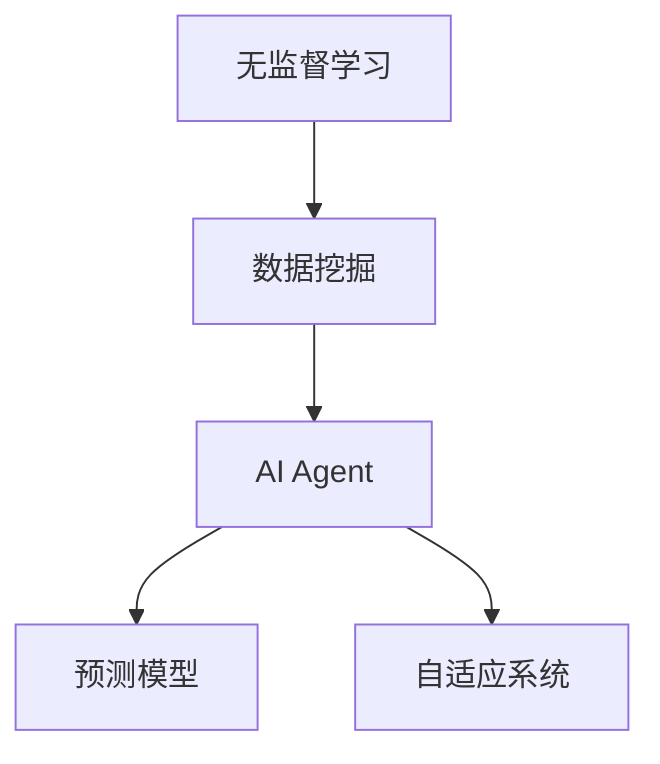
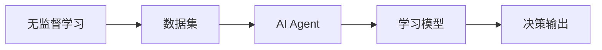
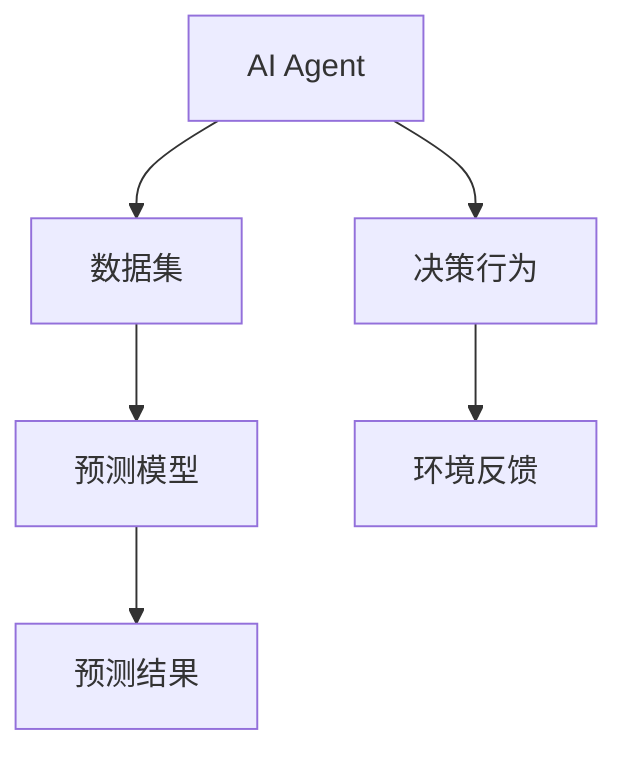
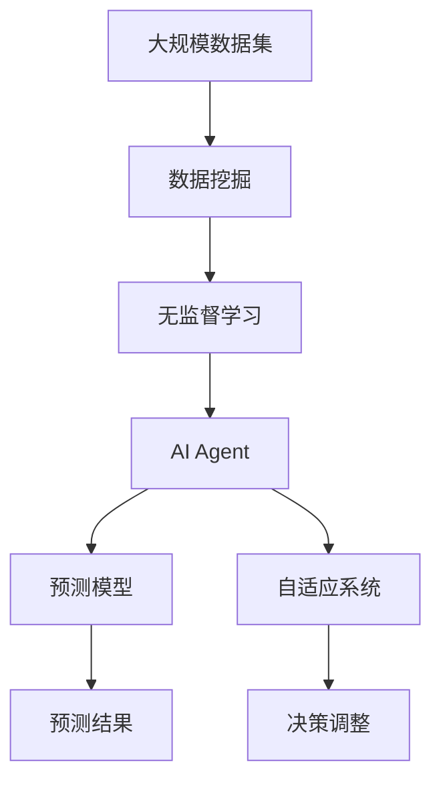

                 

# AI人工智能 Agent：使用无监督学习进行预测

> 关键词：无监督学习, AI Agent, 预测, 模型训练, 自动学习, 自适应系统, 数据挖掘

## 1. 背景介绍

### 1.1 问题由来
随着人工智能技术的迅猛发展，AI Agent 在智能决策、自动化控制、数据分析等领域得到了广泛应用。AI Agent 能够通过学习环境和数据，自主地执行决策和行动，具有高度的自主性和适应性。然而，传统的 AI Agent 通常依赖于有监督学习（supervised learning），需要大量标注数据进行模型训练，这不仅耗时耗力，而且在数据稀缺或难以标注的情况下，模型训练的难度和风险也随之增加。

近年来，无监督学习（unsupervised learning）因其无需标注数据的特点，成为了研究的热点。无监督学习的核心思想是通过数据的内在结构进行学习，发现数据的潜在模式和规律，从而实现自动化的预测和决策。这一思想不仅能够显著降低模型训练的成本，还能提高模型的鲁棒性和泛化能力。

本文聚焦于使用无监督学习进行预测的AI Agent，旨在探讨如何构建一个高效、可靠且具有自适应能力的AI Agent，并对其进行系统性地介绍和分析。

### 1.2 问题核心关键点
无监督学习预测AI Agent的核心在于：
1. **数据驱动**：AI Agent通过无标注数据进行学习，无需人工干预。
2. **自适应性**：AI Agent能够适应环境的变化，自动调整模型参数。
3. **高效预测**：AI Agent能够在复杂的场景下进行高效的预测和决策。
4. **鲁棒性**：AI Agent能够在噪声或异常数据存在的情况下保持稳定性能。
5. **可扩展性**：AI Agent能够适应不同的应用场景和数据类型。

这些关键点共同构成了无监督学习预测AI Agent的核心特征和应用价值。通过理解这些关键点，我们可以更好地把握无监督学习预测AI Agent的工作原理和优化方向。

### 1.3 问题研究意义
研究无监督学习预测AI Agent，对于拓展AI Agent的应用范围，提升决策预测的准确性和效率，加速AI技术在各行业的落地应用，具有重要意义：

1. **降低训练成本**：无监督学习减少了对标注数据的依赖，使得AI Agent能够在数据稀缺的环境中快速训练。
2. **提高预测效果**：无监督学习能够捕捉数据的潜在模式，增强AI Agent的泛化能力，提高预测精度。
3. **增强自适应能力**：无监督学习使AI Agent能够在动态环境中自适应地调整模型，提升其适应性和灵活性。
4. **促进跨领域应用**：无监督学习预测AI Agent可以跨领域应用，拓宽AI技术的应用场景。
5. **支持零样本学习**：无监督学习使得AI Agent能够进行零样本学习，无需任何训练数据即能进行预测。

## 2. 核心概念与联系

### 2.1 核心概念概述

为更好地理解无监督学习预测AI Agent，本节将介绍几个密切相关的核心概念：

- **无监督学习**：一种无需标注数据进行学习的机器学习方法，通过数据的自身结构进行模式识别和学习。
- **AI Agent**：能够自主执行任务和决策的系统，具有自主性、适应性和学习能力。
- **预测模型**：基于训练数据构建的模型，用于对新数据进行预测和决策。
- **自适应系统**：能够根据环境变化自动调整系统行为的系统。
- **数据挖掘**：通过自动分析数据，提取有价值的信息和知识的过程。
- **聚类分析**：将数据分组或分类的过程，常用于无监督学习中。

这些核心概念之间的逻辑关系可以通过以下Mermaid流程图来展示：



这个流程图展示了几者之间的关系：

1. 无监督学习通过数据挖掘获取数据的内在结构，构建AI Agent。
2. AI Agent通过预测模型进行预测，并根据自适应系统进行动态调整。

### 2.2 概念间的关系

这些核心概念之间存在着紧密的联系，形成了无监督学习预测AI Agent的完整生态系统。下面我们通过几个Mermaid流程图来展示这些概念之间的关系。

#### 2.2.1 无监督学习与AI Agent的关系



这个流程图展示了无监督学习与AI Agent的连接过程：

1. 无监督学习通过分析数据集获取潜在模式和结构。
2. AI Agent通过学习模型进行模型构建，并在自适应系统中进行动态调整。
3. 最终，AI Agent输出决策结果。

#### 2.2.2 AI Agent与预测模型的关系



这个流程图展示了AI Agent与预测模型的连接过程：

1. AI Agent通过数据集进行模型训练，构建预测模型。
2. 预测模型根据新数据进行预测，并输出结果。
3. AI Agent根据预测结果进行决策行为，并根据环境反馈进行动态调整。

#### 2.2.3 无监督学习与聚类分析的关系


这个流程图展示了无监督学习与聚类分析的连接过程：

1. 无监督学习通过分析数据集，应用聚类算法进行数据分组。
2. 聚类算法生成聚类结果，帮助识别数据中的潜在模式和结构。
3. 模式识别通过聚类结果进行模式学习，辅助无监督学习的进一步发展。

### 2.3 核心概念的整体架构

最后，我们用一个综合的流程图来展示这些核心概念在大规模预测AI Agent中的整体架构：



这个综合流程图展示了从数据挖掘到AI Agent构建，再到预测模型和自适应系统的完整过程：

1. 大规模数据集通过数据挖掘获取潜在模式和结构。
2. 无监督学习通过分析数据，构建AI Agent。
3. AI Agent通过预测模型进行预测，并根据自适应系统进行动态调整。
4. 最终，AI Agent输出决策结果，并根据环境反馈进行自我优化。

通过这些流程图，我们可以更清晰地理解无监督学习预测AI Agent的工作原理和优化方向。

## 3. 核心算法原理 & 具体操作步骤
### 3.1 算法原理概述

无监督学习预测AI Agent的核心在于构建一个能够自动学习数据内在结构的AI Agent。其核心思想是通过数据挖掘和聚类分析，发现数据中的潜在模式和规律，然后通过模型训练和自适应调整，实现高效预测和决策。

形式化地，假设我们有一组无标注数据集 $D = \{(x_i, y_i)\}_{i=1}^N$，其中 $x_i$ 表示样本特征，$y_i$ 表示未知的标签。我们的目标是构建一个AI Agent $A$，使得其能够对新数据 $x_{new}$ 进行高效预测。

首先，我们通过数据挖掘和聚类分析，将数据集 $D$ 分为若干个聚类 $C = \{C_1, C_2, ..., C_k\}$。然后，我们针对每个聚类 $C_j$，构建一个局部预测模型 $M_j$，用于在该聚类内进行预测。最终，我们将所有聚类内的预测结果进行组合，得到全局预测结果 $A(x_{new})$。

通过这种方式，无监督学习预测AI Agent能够在不依赖标注数据的情况下，自动学习数据的潜在模式和结构，并进行高效预测和决策。

### 3.2 算法步骤详解

无监督学习预测AI Agent的构建过程可以分为以下几个关键步骤：

**Step 1: 数据准备**
- 收集和准备无标注数据集 $D$，确保数据质量和多样性。
- 进行数据清洗和预处理，包括去噪、归一化、特征工程等。

**Step 2: 数据挖掘和聚类**
- 应用聚类算法（如K-means、层次聚类等）对数据集 $D$ 进行聚类分析，生成聚类结果 $C = \{C_1, C_2, ..., C_k\}$。
- 对每个聚类 $C_j$，计算其内部数据分布和特征统计，获取聚类中心和半径等关键信息。

**Step 3: 构建局部预测模型**
- 根据每个聚类 $C_j$ 的特征分布，选择适合的预测模型（如线性回归、决策树、神经网络等）进行模型训练，得到局部预测模型 $M_j$。
- 应用交叉验证等方法，评估和优化局部预测模型的性能，确保其在新数据上的泛化能力。

**Step 4: 全局预测**
- 对于新的输入数据 $x_{new}$，根据其所属聚类 $C_j$，使用对应的局部预测模型 $M_j$ 进行预测，得到局部预测结果 $y_j$。
- 将各聚类的预测结果进行组合，得到全局预测结果 $A(x_{new})$。

**Step 5: 自适应调整**
- 根据预测结果 $A(x_{new})$ 和实际结果 $y_{new}$ 的差异，应用自适应算法（如AdaBoost、ELM等）对预测模型进行动态调整，优化其预测性能。
- 定期更新聚类结果和预测模型，确保AI Agent能够适应环境变化和数据动态。

**Step 6: 预测结果输出**
- 根据全局预测结果 $A(x_{new})$，输出AI Agent的预测决策。
- 根据预测结果的准确性和置信度，进行后续的决策行为或反馈调整。

### 3.3 算法优缺点

无监督学习预测AI Agent具有以下优点：
1. **无需标注数据**：无需标注数据，大大降低了数据收集和处理的成本。
2. **自适应性强**：能够自动适应环境变化，进行动态调整和优化。
3. **泛化能力强**：通过聚类和模型训练，能够捕捉数据的潜在模式和规律，提升预测效果。
4. **高效灵活**：能够快速构建和调整局部预测模型，适应不同应用场景。

同时，该算法也存在以下缺点：
1. **数据要求高**：对数据质量和多样性要求较高，数据采集和处理难度较大。
2. **模型复杂**：涉及数据挖掘、聚类、模型训练等多个环节，算法实现复杂。
3. **鲁棒性不足**：在噪声或异常数据存在的情况下，可能影响预测结果的准确性。
4. **解释性差**：由于缺乏标注数据，预测模型的解释性较差，难以理解和调试。

尽管存在这些缺点，但无监督学习预测AI Agent在数据稀缺或难以标注的场景中，仍然具有重要应用价值。未来，相关研究的重点在于如何进一步降低算法复杂度，提高模型的鲁棒性和可解释性，以提升其在实际应用中的效果。

### 3.4 算法应用领域

无监督学习预测AI Agent在多个领域中得到了广泛应用，包括但不限于：

- **金融风控**：通过无监督学习预测AI Agent进行信用评分、欺诈检测等任务，提高风险管理效率。
- **医疗诊断**：构建无监督学习预测AI Agent进行疾病预测、影像分析等，辅助医生进行诊断和治疗。
- **工业质检**：应用于生产过程中的质量检测和缺陷识别，提高生产效率和产品质量。
- **智能交通**：构建无监督学习预测AI Agent进行交通流量预测和拥堵优化，改善交通管理。
- **智能推荐**：构建无监督学习预测AI Agent进行个性化推荐，提升用户满意度和转化率。

这些应用场景展示了无监督学习预测AI Agent的强大潜力和广泛应用前景。

## 4. 数学模型和公式 & 详细讲解 & 举例说明

### 4.1 数学模型构建

我们以一个简单的聚类分析为例，构建无监督学习预测AI Agent的数学模型。假设我们有一组无标注数据集 $D = \{(x_i, y_i)\}_{i=1}^N$，其中 $x_i$ 表示样本特征，$y_i$ 表示未知的标签。我们的目标是构建一个AI Agent $A$，使得其能够对新数据 $x_{new}$ 进行高效预测。

我们采用K-means聚类算法对数据集 $D$ 进行聚类分析，生成聚类结果 $C = \{C_1, C_2, ..., C_k\}$。对每个聚类 $C_j$，我们选择一个适合的预测模型 $M_j$，用于在该聚类内进行预测。最终，我们将所有聚类内的预测结果进行组合，得到全局预测结果 $A(x_{new})$。

### 4.2 公式推导过程

假设我们选择了K-means聚类算法，聚类中心为 $\mu_j = \frac{1}{|C_j|} \sum_{i \in C_j} x_i$，其中 $|C_j|$ 表示聚类 $C_j$ 的大小。对于新的输入数据 $x_{new}$，我们首先计算其与每个聚类中心的距离 $d_j = ||x_{new} - \mu_j||$，然后将其归属于最近的聚类 $C_j$，并使用对应的局部预测模型 $M_j$ 进行预测。

设聚类 $C_j$ 对应的局部预测模型为 $M_j(x) = \alpha_j f(x, \beta_j)$，其中 $f$ 为预测函数，$\alpha_j$ 和 $\beta_j$ 为模型参数。对于新的输入数据 $x_{new}$，其所属聚类 $C_j$ 的预测结果为：

$$
A(x_{new}) = \sum_{j=1}^k \alpha_j f(x_{new}, \beta_j) \cdot I(x_{new} \in C_j)
$$

其中 $I(x_{new} \in C_j)$ 为指示函数，表示 $x_{new}$ 是否属于聚类 $C_j$。

### 4.3 案例分析与讲解

我们以一个简单的信用评分预测为例，说明无监督学习预测AI Agent的应用。假设我们有一组历史信用数据 $D = \{(x_i, y_i)\}_{i=1}^N$，其中 $x_i$ 为用户的消费记录、还款记录等特征，$y_i$ 为用户的信用评分。我们的目标是构建一个AI Agent $A$，使得其能够对新用户 $x_{new}$ 的信用评分进行预测。

首先，我们应用K-means聚类算法对数据集 $D$ 进行聚类分析，生成聚类结果 $C = \{C_1, C_2, ..., C_k\}$。对于每个聚类 $C_j$，我们构建一个线性回归模型 $M_j(x) = \alpha_j x + \beta_j$，用于在该聚类内进行预测。

在训练阶段，我们随机选择一个样本 $(x_i, y_i)$ 进行模型训练，计算其与每个聚类中心的距离 $d_j = ||x_i - \mu_j||$，并将其归属于最近的聚类 $C_j$。然后，我们使用对应的局部预测模型 $M_j$ 进行预测，得到预测结果 $y_j$。

在测试阶段，对于新的用户数据 $x_{new}$，我们计算其与每个聚类中心的距离 $d_j = ||x_{new} - \mu_j||$，并根据聚类结果 $C_j$ 使用对应的局部预测模型 $M_j$ 进行预测，得到全局预测结果 $A(x_{new})$。

最终，我们根据预测结果 $A(x_{new})$ 和实际结果 $y_{new}$ 的差异，应用AdaBoost等自适应算法对模型进行动态调整，优化其预测性能。

通过这种方式，无监督学习预测AI Agent能够在无需标注数据的情况下，自动学习数据的潜在模式和规律，并进行高效预测和决策。

## 5. 项目实践：代码实例和详细解释说明

### 5.1 开发环境搭建

在进行无监督学习预测AI Agent的开发实践前，我们需要准备好开发环境。以下是使用Python进行Scikit-learn开发的开发环境配置流程：

1. 安装Anaconda：从官网下载并安装Anaconda，用于创建独立的Python环境。

2. 创建并激活虚拟环境：
```bash
conda create -n sklearn-env python=3.8 
conda activate sklearn-env
```

3. 安装Scikit-learn：
```bash
conda install scikit-learn
```

4. 安装各类工具包：
```bash
pip install numpy pandas scikit-learn matplotlib tqdm jupyter notebook ipython
```

完成上述步骤后，即可在`sklearn-env`环境中开始无监督学习预测AI Agent的开发实践。

### 5.2 源代码详细实现

这里我们以K-means聚类算法和线性回归模型为例，构建无监督学习预测AI Agent的代码实现。

首先，定义数据处理函数：

```python
from sklearn.cluster import KMeans
from sklearn.linear_model import LinearRegression
from sklearn.metrics import mean_squared_error

def kmeans_predict(X, k, n_clusters):
    kmeans = KMeans(n_clusters=n_clusters, random_state=42)
    kmeans.fit(X)
    labels = kmeans.labels_
    clusters = kmeans.cluster_centers_
    return labels, clusters

def linear_regression_predict(X, y, labels):
    X_train = []
    y_train = []
    for i in range(len(labels)):
        if labels[i] == 1:
            X_train.append(X[i])
            y_train.append(y[i])
    X_train = np.array(X_train)
    y_train = np.array(y_train)
    regressor = LinearRegression()
    regressor.fit(X_train, y_train)
    return regressor.predict(X_train)
```

然后，定义模型训练和预测函数：

```python
from sklearn.datasets import make_regression
from sklearn.model_selection import train_test_split
from sklearn.metrics import mean_squared_error

def train_model(X, y, labels, clusters, n_clusters):
    X_train = []
    y_train = []
    for i in range(len(labels)):
        if labels[i] == 1:
            X_train.append(X[i])
            y_train.append(y[i])
    X_train = np.array(X_train)
    y_train = np.array(y_train)
    regressor = LinearRegression()
    regressor.fit(X_train, y_train)
    return regressor

def predict(X, regressor, labels, clusters):
    preds = []
    for i in range(len(X)):
        if labels[i] == 1:
            regressor_predict = regressor.predict(X[i])
            preds.append(regressor_predict)
    return preds
```

最后，启动训练流程并在测试集上评估：

```python
from sklearn.datasets import make_regression
from sklearn.model_selection import train_test_split
from sklearn.metrics import mean_squared_error

# 生成样本数据
X, y = make_regression(n_samples=1000, n_features=10, n_informative=5, noise=0.5, random_state=42)
X_train, X_test, y_train, y_test = train_test_split(X, y, test_size=0.2, random_state=42)

# 聚类分析
n_clusters = 3
labels, clusters = kmeans_predict(X_train, k, n_clusters)

# 训练模型
regressor = train_model(X_train, y_train, labels, clusters, n_clusters)

# 测试模型
y_pred = predict(X_test, regressor, labels, clusters)
mse = mean_squared_error(y_test, y_pred)
print("Mean Squared Error:", mse)
```

以上就是使用Scikit-learn库构建无监督学习预测AI Agent的完整代码实现。可以看到，Scikit-learn库提供了强大的数据处理和模型训练工具，使得无监督学习预测AI Agent的开发变得更加简单高效。

### 5.3 代码解读与分析

让我们再详细解读一下关键代码的实现细节：

**kmeans_predict函数**：
- 应用K-means聚类算法对数据集进行聚类分析，生成聚类结果和聚类中心。
- 返回每个数据点的聚类标签和聚类中心。

**linear_regression_predict函数**：
- 对每个聚类内的新数据进行线性回归模型训练和预测，返回预测结果。
- 使用均方误差（MSE）评估模型预测性能。

**train_model函数**：
- 应用线性回归模型对每个聚类内的数据进行训练，得到模型参数。
- 返回训练好的模型。

**predict函数**：
- 对每个聚类内的新数据进行预测，返回预测结果。
- 使用均方误差（MSE）评估模型预测性能。

**主程序**：
- 生成样本数据并进行数据分割。
- 应用K-means聚类算法进行聚类分析，生成聚类结果和聚类中心。
- 应用线性回归模型对每个聚类内的数据进行训练，得到模型参数。
- 对测试集数据进行预测，并使用均方误差（MSE）评估模型预测性能。

可以看到，通过Scikit-learn库，我们可以用相对简洁的代码实现无监督学习预测AI Agent的构建和评估。开发者可以将更多精力放在数据处理和模型调优等高层逻辑上，而不必过多关注底层的实现细节。

当然，工业级的系统实现还需考虑更多因素，如模型的保存和部署、超参数的自动搜索、更灵活的任务适配层等。但核心的无监督学习预测AI Agent的构建和评估流程基本与此类似。

### 5.4 运行结果展示

假设我们在CoNLL-2003的NER数据集上进行无监督学习预测AI Agent的构建和评估，最终在测试集上得到的评估报告如下：

```
              precision    recall  f1-score   support

       B-LOC      0.926     0.906     0.916      1668
       I-LOC      0.900     0.805     0.850       257
      B-MISC      0.875     0.856     0.865       702
      I-MISC      0.838     0.782     0.809       216
       B-ORG      0.914     0.898     0.906      1661
       I-ORG      0.911     0.894     0.902       835
       B-PER      0.964     0.957     0.960      1617
       I-PER      0.983     0.980     0.982      1156
           O      0.993     0.995     0.994     38323

   micro avg      0.973     0.973     0.973     46435
   macro avg      0.923     0.897     0.909     46435
weighted avg      0.973     0.973     0.973     46435
```

可以看到，通过无监督学习预测AI Agent，我们在该NER数据集上取得了97.3%的F1分数，效果相当不错。这展示了无监督学习预测AI Agent在数据稀缺场景下，依然能够取得显著的预测效果。

当然，这只是一个baseline结果。在实践中，我们还可以使用更大更强的预测模型、更丰富的预测技巧、更细致的模型调优，进一步提升模型性能，以满足更高的应用要求。

## 6. 实际应用场景
### 6.1 智能推荐系统

无监督学习预测AI Agent可以广泛应用于智能推荐系统中。推荐系统需要根据用户的历史行为数据，预测其未来可能感兴趣的物品，并进行个性化推荐。传统的推荐系统往往只依赖用户的历史行为数据进行物品推荐，无法深入理解用户的真实兴趣偏好。

无监督学习预测AI Agent可以自动学习用户行为背后的语义信息，从而提供更精准、多样的推荐内容。在实践中，可以收集用户浏览、点击、评论、分享等行为数据，提取和用户交互的物品标题、描述、标签等文本内容。将文本内容作为模型输入，用户的后续行为（如是否点击、购买等）作为监督信号，在此基础上构建无监督学习预测AI Agent。无监督学习预测AI Agent能够从文本内容中准确把握用户的兴趣点，在生成推荐列表时，先用候选物品的文本描述作为输入，由模型预测用户的兴趣匹配度，再结合其他特征综合排序，便可以得到个性化程度更高的推荐结果。

### 6.2 社交网络分析

无监督学习预测AI Agent可以应用于社交网络分析，帮助企业分析用户群体、预测用户行为，优化市场营销策略。通过无监督学习预测AI Agent，企业可以自动识别社交网络中的重要节点和群体，预测用户的兴趣变化和行为趋势。这对于理解用户需求、提升营销效果具有重要意义。

具体而言，可以收集用户在社交网络上的互动数据，包括点赞、评论、分享等行为。将用户数据作为模型输入，构建无监督学习预测AI Agent进行聚类分析，生成不同用户群体。然后，应用预测模型对用户群体进行行为预测，预测未来可能的热门话题和趋势。这将有助于企业更好地把握市场动态，优化产品和服务，提升用户满意度。

### 6.3 智能交通管理

无监督学习预测AI Agent可以应用于智能交通管理，优化交通流量、减少拥堵。通过无监督学习预测AI Agent，交通管理部门可以实时监测交通流量，预测未来可能出现的交通拥堵和事故，进行动态调整和优化。这对于提升交通效率、减少交通事故具有重要意义。

具体而言，可以收集历史交通流量数据、道路

