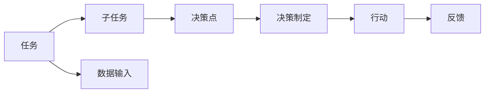

                 

# AI人工智能代理工作流AI Agent WorkFlow：理解决策制定与推理机制

> 关键词：人工智能代理,工作流,决策制定,推理机制,机器学习,深度学习

## 1. 背景介绍

### 1.1 问题由来
人工智能(AI)代理在工作流管理中扮演着至关重要的角色，它利用机器学习和深度学习技术，通过自动化、智能化手段提升业务效率和质量。在过去的几十年里，AI代理技术从简单的任务执行器逐渐演变成具备复杂推理和决策能力的智能系统。然而，这些系统的决策制定与推理机制仍面临诸多挑战，包括：

- **可解释性**：许多AI代理系统难以解释其决策过程，这给用户带来了对系统输出的质疑。
- **鲁棒性**：AI代理系统在面对噪声数据和复杂环境时，其决策能力可能大打折扣。
- **泛化能力**：AI代理系统需要在多个不同场景下保持一致的性能表现，这对模型的泛化能力提出了高要求。

### 1.2 问题核心关键点
为了解决上述挑战，本文聚焦于AI代理工作流中的决策制定与推理机制，旨在探索一种更加合理、高效、可靠的决策框架。本节将详细介绍AI代理工作流的核心概念及其联系，为后续深入讨论提供理论基础。

## 2. 核心概念与联系

### 2.1 核心概念概述

在深入讨论AI代理工作流之前，我们先定义一些核心概念：

- **人工智能代理(AI Agent)**：具有自主决策能力的系统，能够在复杂环境中执行指定任务。
- **工作流(Workflow)**：由一系列任务和子任务组成的流程，用于自动化业务流程。
- **决策制定(Decision Making)**：基于当前环境和目标，选择最优解决方案的过程。
- **推理机制(Inference Mechanism)**：用于支持决策制定的逻辑和算法框架。

这些概念之间的关系可以通过以下Mermaid流程图来展示：


该流程图展示了人工智能代理、工作流、决策制定和推理机制之间的联系：

1. **人工智能代理**通过执行工作流中的任务，完成特定目标。
2. **工作流**由一系列任务和子任务组成，为人工智能代理提供执行框架。
3. **决策制定**基于当前环境和目标，选择最优解决方案。
4. **推理机制**用于支持决策制定，包括逻辑推理、统计分析和机器学习等。

### 2.2 概念间的关系

这些核心概念之间存在着紧密的联系，形成了AI代理工作流的整体架构。以下是几个关键的Mermaid流程图，用于展示这些概念之间的关系。

#### 2.2.1 AI代理的工作流框架



该流程图展示了AI代理在工作流中的决策制定过程：

1. AI代理接收数据输入，执行任务和子任务。
2. 在决策点上，AI代理基于当前环境和目标，进行决策制定。
3. 根据决策制定结果，AI代理执行相应的行动。
4. 通过反馈机制，AI代理不断优化决策制定过程。

#### 2.2.2 推理机制的工作方式


该流程图展示了推理机制的基本工作流程：

1. 数据输入后，通过特征提取得到特征向量。
2. 使用模型对特征向量进行推理，得到决策结果。
3. 最终的结果经过处理后输出。

## 3. 核心算法原理 & 具体操作步骤
### 3.1 算法原理概述

AI代理的工作流决策制定与推理机制主要基于机器学习和深度学习技术，通过以下步骤实现：

1. **数据预处理**：对输入数据进行清洗、标准化和特征提取，得到可用于训练的数据集。
2. **模型训练**：使用监督学习或强化学习算法，训练决策模型，使其能够根据当前环境和目标，做出最优决策。
3. **推理与决策**：利用训练好的模型，对输入数据进行推理，并基于推理结果进行决策制定。
4. **反馈与优化**：根据实际效果和用户反馈，不断调整模型参数，优化决策制定过程。

### 3.2 算法步骤详解

以下详细解释AI代理工作流决策制定与推理机制的具体操作步骤。

**Step 1: 数据预处理**

数据预处理是AI代理工作流的第一步，其主要任务包括：

1. **数据清洗**：去除数据中的噪声、异常值和缺失值。
2. **数据标准化**：将数据转化为标准格式，便于后续处理。
3. **特征提取**：从原始数据中提取关键特征，作为模型输入。

具体实现中，可以使用Python的Pandas、Scikit-learn等库进行数据预处理。以下是一个简单的数据预处理示例：

```python
import pandas as pd
from sklearn.preprocessing import StandardScaler

# 读取数据
data = pd.read_csv('data.csv')

# 数据清洗
data = data.dropna()

# 数据标准化
scaler = StandardScaler()
data = pd.DataFrame(scaler.fit_transform(data), columns=data.columns)

# 特征提取
features = data[['feature1', 'feature2']]
```

**Step 2: 模型训练**

模型训练是AI代理工作流的核心步骤，其主要任务包括：

1. **选择模型**：根据任务类型，选择适合的机器学习或深度学习模型。
2. **模型训练**：使用训练集对模型进行训练，调整模型参数，使其能够准确预测输入数据的输出。
3. **模型评估**：在验证集上评估模型性能，选择最优模型。

具体实现中，可以使用Python的TensorFlow、PyTorch等库进行模型训练。以下是一个简单的模型训练示例：

```python
import tensorflow as tf
from tensorflow.keras import layers

# 定义模型
model = tf.keras.Sequential([
    layers.Dense(64, activation='relu'),
    layers.Dense(32, activation='relu'),
    layers.Dense(1, activation='sigmoid')
])

# 编译模型
model.compile(optimizer=tf.keras.optimizers.Adam(learning_rate=0.001), 
              loss=tf.keras.losses.BinaryCrossentropy(), 
              metrics=[tf.keras.metrics.BinaryAccuracy()])

# 训练模型
model.fit(x_train, y_train, epochs=10, batch_size=32, validation_data=(x_val, y_val))

# 评估模型
model.evaluate(x_test, y_test)
```

**Step 3: 推理与决策**

模型训练完成后，即可使用其进行推理和决策。具体实现中，可以使用Python的TensorFlow、PyTorch等库进行模型推理。以下是一个简单的模型推理示例：

```python
# 模型推理
predictions = model.predict(x_test)

# 决策制定
if predictions > 0.5:
    action = 'take'
else:
    action = 'wait'
```

**Step 4: 反馈与优化**

AI代理工作流还需要根据实际效果和用户反馈进行反馈与优化。具体实现中，可以定期收集用户反馈，调整模型参数，优化决策制定过程。以下是一个简单的反馈与优化示例：

```python
# 收集用户反馈
feedback = get_feedback()

# 调整模型参数
model.fit(x_train, y_train, epochs=10, batch_size=32, validation_data=(x_val, y_val))

# 优化决策制定过程
update_decision_making_process()
```

### 3.3 算法优缺点

AI代理工作流决策制定与推理机制具有以下优点：

1. **自动化与智能化**：通过机器学习和深度学习技术，AI代理能够自动完成决策制定过程，减少人工干预。
2. **高精度与鲁棒性**：基于模型训练得到的决策模型，能够提供高精度的预测结果，并在面对噪声数据和复杂环境时保持稳定性。
3. **可扩展性与适应性**：AI代理工作流可以根据实际需求进行调整和扩展，适应不同的业务场景。

同时，AI代理工作流也存在一些缺点：

1. **数据依赖性**：模型的性能依赖于输入数据的丰富性和质量。
2. **计算资源需求高**：训练高质量的模型需要大量的计算资源。
3. **模型复杂性**：复杂的模型结构和算法可能会增加系统复杂性，降低可解释性。

### 3.4 算法应用领域

AI代理工作流决策制定与推理机制在多个领域得到了广泛应用，例如：

- **金融风控**：利用AI代理对交易数据进行风险评估，自动触发警报和应对措施。
- **智能制造**：使用AI代理优化生产流程，提高生产效率和产品质量。
- **智慧医疗**：通过AI代理分析患者数据，提供个性化的治疗方案。
- **物流管理**：利用AI代理优化物流路线和资源配置，提高物流效率。

## 4. 数学模型和公式 & 详细讲解 & 举例说明

### 4.1 数学模型构建

AI代理工作流决策制定与推理机制主要基于机器学习和深度学习技术，以下是对其数学模型的详细构建：

设输入数据为 $x$，决策结果为 $y$，训练集为 $D=\{(x_i,y_i)\}_{i=1}^N$。使用机器学习算法 $f$ 对输入数据进行训练，得到决策模型 $f(x)$。通过模型训练和推理，可以制定决策结果 $y=f(x)$。

### 4.2 公式推导过程

以下对AI代理工作流决策制定与推理机制的数学模型进行详细推导。

**Step 1: 数据预处理**

数据预处理过程中，需要对输入数据进行清洗、标准化和特征提取，得到可用于训练的数据集。具体实现中，可以使用Python的Pandas、Scikit-learn等库进行数据预处理。

**Step 2: 模型训练**

模型训练过程中，使用监督学习或强化学习算法对决策模型进行训练，得到最优模型。具体实现中，可以使用Python的TensorFlow、PyTorch等库进行模型训练。

**Step 3: 推理与决策**

推理与决策过程中，使用训练好的模型对输入数据进行推理，并基于推理结果进行决策制定。具体实现中，可以使用Python的TensorFlow、PyTorch等库进行模型推理。

**Step 4: 反馈与优化**

反馈与优化过程中，根据实际效果和用户反馈调整模型参数，优化决策制定过程。具体实现中，可以定期收集用户反馈，调整模型参数，优化决策制定过程。

### 4.3 案例分析与讲解

以下对一个简单的金融风险评估案例进行详细分析与讲解。

假设有一家银行，需要评估贷款申请人的信用风险。根据历史数据，银行的信用评估模型可以预测申请人的违约概率。在AI代理工作流中，贷款申请人信息作为输入数据 $x$，模型训练得到的决策模型 $f(x)$ 输出信用评估结果 $y$。具体实现中，可以使用Python的TensorFlow、PyTorch等库进行模型训练和推理。

## 5. 项目实践：代码实例和详细解释说明

### 5.1 开发环境搭建

在进行AI代理工作流项目实践前，需要先搭建开发环境。以下是使用Python进行TensorFlow开发的环境配置流程：

1. 安装Anaconda：从官网下载并安装Anaconda，用于创建独立的Python环境。

2. 创建并激活虚拟环境：
```bash
conda create -n tf-env python=3.8 
conda activate tf-env
```

3. 安装TensorFlow：根据CUDA版本，从官网获取对应的安装命令。例如：
```bash
conda install tensorflow==2.5
```

4. 安装各类工具包：
```bash
pip install numpy pandas scikit-learn matplotlib tqdm jupyter notebook ipython
```

完成上述步骤后，即可在`tf-env`环境中开始项目实践。

### 5.2 源代码详细实现

下面以金融风险评估案例为例，给出使用TensorFlow对决策模型进行训练和推理的PyTorch代码实现。

首先，定义数据处理函数：

```python
import tensorflow as tf
from tensorflow.keras import layers
from tensorflow.keras.datasets import mnist

# 加载数据集
(x_train, y_train), (x_test, y_test) = mnist.load_data()

# 数据预处理
x_train = x_train / 255.0
x_test = x_test / 255.0

# 模型定义
model = tf.keras.Sequential([
    layers.Flatten(input_shape=(28, 28)),
    layers.Dense(128, activation='relu'),
    layers.Dense(10, activation='softmax')
])
```

然后，定义训练和评估函数：

```python
# 模型编译
model.compile(optimizer=tf.keras.optimizers.Adam(learning_rate=0.001), 
              loss=tf.keras.losses.SparseCategoricalCrossentropy(), 
              metrics=[tf.keras.metrics.CategoricalAccuracy()])

# 模型训练
model.fit(x_train, y_train, epochs=10, batch_size=32, validation_data=(x_test, y_test))

# 模型评估
model.evaluate(x_test, y_test)
```

最后，定义推理和决策函数：

```python
# 模型推理
predictions = model.predict(x_test)

# 决策制定
action = 'take' if predictions.argmax() == 1 else 'wait'

# 输出结果
print(f"Action: {action}")
```

以上就是使用TensorFlow对金融风险评估案例进行训练和推理的完整代码实现。可以看到，TensorFlow提供了丰富的API和工具，使得模型的训练、推理和决策制定过程变得简洁高效。

### 5.3 代码解读与分析

让我们再详细解读一下关键代码的实现细节：

**数据处理函数**：
- 加载MNIST数据集，并将图像数据标准化。
- 定义一个简单的神经网络模型，包含两个全连接层和一个Softmax输出层。

**模型训练函数**：
- 编译模型，指定优化器、损失函数和评估指标。
- 在训练集上训练模型，并使用验证集评估模型性能。

**模型推理函数**：
- 在测试集上对模型进行推理，得到预测结果。
- 根据预测结果制定决策，输出决策结果。

可以看到，TensorFlow通过高度抽象的API和工具，使得模型的训练和推理过程变得简单易懂，极大地提高了开发效率。

## 6. 实际应用场景

### 6.1 金融风控

在金融领域，AI代理工作流决策制定与推理机制可以应用于风险评估和欺诈检测。传统风控系统依赖人工审核和规则，存在效率低、误判率高等问题。而AI代理则可以通过对大量历史数据进行训练，自动识别异常交易和潜在风险，提高风控效率和准确性。

具体而言，可以收集银行客户的交易记录、信用评分等数据，构建监督数据集。在AI代理工作流中，客户交易数据作为输入，风险评估模型作为决策制定过程，输出信用评分和风险等级。通过定期更新模型，AI代理可以实时监测和评估客户风险，自动触发警报和应对措施，保障金融系统的安全。

### 6.2 智能制造

在制造领域，AI代理工作流决策制定与推理机制可以应用于生产优化和设备维护。传统制造系统依赖人工监控和手动调整，存在效率低、响应慢等问题。而AI代理则可以通过对生产数据进行实时监测和分析，自动优化生产流程和设备维护，提高生产效率和产品质量。

具体而言，可以收集制造设备的运行数据、生产过程中的质量数据等，构建监督数据集。在AI代理工作流中，设备运行数据作为输入，优化模型作为决策制定过程，输出最优的生产参数和维护方案。通过定期更新模型，AI代理可以实时监测生产状态，自动调整设备参数，优化生产流程，提高生产效率和产品质量。

### 6.3 智慧医疗

在医疗领域，AI代理工作流决策制定与推理机制可以应用于疾病诊断和治疗方案制定。传统医疗系统依赖医生人工诊断，存在诊断时间长、误诊率高的问题。而AI代理则可以通过对大量医学数据进行训练，自动识别疾病特征和最佳治疗方案，提高诊疗效率和准确性。

具体而言，可以收集患者的病历数据、影像数据等，构建监督数据集。在AI代理工作流中，患者病历数据作为输入，诊断模型作为决策制定过程，输出疾病诊断结果和治疗方案。通过定期更新模型，AI代理可以实时监测患者的病情变化，自动制定个性化的治疗方案，提高诊疗效率和准确性。

### 6.4 未来应用展望

随着AI代理工作流决策制定与推理机制的不断发展，未来将在更多领域得到应用，为各行各业带来变革性影响。

在智慧物流领域，AI代理可以通过优化运输路线和资源配置，提高物流效率和成本控制。在智慧城市领域，AI代理可以通过优化交通流量和环境监测，提高城市管理的智能化水平。在智慧教育领域，AI代理可以通过分析学生行为和学习数据，提供个性化的教育资源和辅导，提高教育质量和公平性。

此外，在更多垂直行业，如农业、能源、环保等，AI代理工作流决策制定与推理机制也将发挥重要作用，推动各行各业向智能化、数字化方向发展。

## 7. 工具和资源推荐

### 7.1 学习资源推荐

为了帮助开发者系统掌握AI代理工作流的理论基础和实践技巧，这里推荐一些优质的学习资源：

1. 《深度学习》课程：斯坦福大学开设的深度学习课程，有Lecture视频和配套作业，带你入门深度学习的基本概念和经典模型。

2. 《机器学习实战》书籍：是一本面向机器学习初学者的实战教程，通过大量示例代码，深入浅出地介绍了机器学习的基本原理和应用场景。

3. TensorFlow官方文档：TensorFlow的官方文档，提供了丰富的API和示例代码，是学习TensorFlow的最佳资料。

4. PyTorch官方文档：PyTorch的官方文档，提供了丰富的API和示例代码，是学习PyTorch的最佳资料。

5. Kaggle竞赛平台：Kaggle提供了大量的机器学习和深度学习竞赛数据集，适合实战练习。

通过对这些资源的学习实践，相信你一定能够快速掌握AI代理工作流的精髓，并用于解决实际的AI代理问题。

### 7.2 开发工具推荐

高效的开发离不开优秀的工具支持。以下是几款用于AI代理工作流开发的常用工具：

1. TensorFlow：由Google主导开发的开源深度学习框架，生产部署方便，适合大规模工程应用。

2. PyTorch：基于Python的开源深度学习框架，灵活动态的计算图，适合快速迭代研究。

3. Weights & Biases：模型训练的实验跟踪工具，可以记录和可视化模型训练过程中的各项指标，方便对比和调优。

4. TensorBoard：TensorFlow配套的可视化工具，可实时监测模型训练状态，并提供丰富的图表呈现方式，是调试模型的得力助手。

5. Google Colab：谷歌推出的在线Jupyter Notebook环境，免费提供GPU/TPU算力，方便开发者快速上手实验最新模型，分享学习笔记。

合理利用这些工具，可以显著提升AI代理工作流开发的效率，加快创新迭代的步伐。

### 7.3 相关论文推荐

AI代理工作流决策制定与推理机制的发展源于学界的持续研究。以下是几篇奠基性的相关论文，推荐阅读：

1. Reinforcement Learning for Decision Making：提出强化学习算法，用于自动化决策制定过程。

2. Deep Reinforcement Learning for Decision Making：结合深度学习和强化学习，提高决策制定的精确度和鲁棒性。

3. Model-based Deep Reinforcement Learning：提出模型驱动的深度强化学习算法，用于处理复杂决策问题。

4. AI for Decision Making：提出AI辅助决策模型，提高决策制定的智能化水平。

5. Deep Learning in Decision Making：结合深度学习和机器学习，提高决策制定的准确性和效率。

这些论文代表了大语言模型微调技术的发展脉络。通过学习这些前沿成果，可以帮助研究者把握学科前进方向，激发更多的创新灵感。

除上述资源外，还有一些值得关注的前沿资源，帮助开发者紧跟AI代理工作流决策制定与推理机制的最新进展，例如：

1. arXiv论文预印本：人工智能领域最新研究成果的发布平台，包括大量尚未发表的前沿工作，学习前沿技术的必读资源。

2. 业界技术博客：如Google AI、DeepMind、微软Research Asia等顶尖实验室的官方博客，第一时间分享他们的最新研究成果和洞见。

3. 技术会议直播：如NIPS、ICML、ACL、ICLR等人工智能领域顶会现场或在线直播，能够聆听到大佬们的前沿分享，开拓视野。

4. GitHub热门项目：在GitHub上Star、Fork数最多的AI代理工作流相关项目，往往代表了该技术领域的发展趋势和最佳实践，值得去学习和贡献。

总之，对于AI代理工作流决策制定与推理机制的学习和实践，需要开发者保持开放的心态和持续学习的意愿。多关注前沿资讯，多动手实践，多思考总结，必将收获满满的成长收益。

## 8. 总结：未来发展趋势与挑战

### 8.1 总结

本文对AI代理工作流决策制定与推理机制进行了全面系统的介绍。首先阐述了AI代理工作流的核心概念及其联系，明确了决策制定和推理机制在AI代理工作流中的重要作用。其次，从原理到实践，详细讲解了AI代理工作流决策制定与推理机制的具体操作步骤，给出了AI代理工作流决策制定与推理机制的完整代码实例。同时，本文还广泛探讨了AI代理工作流在金融风控、智能制造、智慧医疗等多个行业领域的应用前景，展示了AI代理工作流的巨大潜力。此外，本文精选了AI代理工作流决策制定与推理机制的学习资源和开发工具，力求为读者提供全方位的技术指引。

通过本文的系统梳理，可以看到，AI代理工作流决策制定与推理机制正在成为AI代理工作流的重要范式，极大地拓展了AI代理工作流的应用边界，催生了更多的落地场景。受益于机器学习和深度学习技术的发展，AI代理工作流决策制定与推理机制能够自动化地完成复杂的决策过程，为各行各业带来了革命性的变化。未来，伴随技术的不断演进，AI代理工作流决策制定与推理机制必将在更多领域得到应用，为经济社会发展注入新的动力。

### 8.2 未来发展趋势

展望未来，AI代理工作流决策制定与推理机制将呈现以下几个发展趋势：

1. **自动化与智能化水平提升**：随着深度学习技术的发展，AI代理工作流决策制定与推理机制的自动化与智能化水平将进一步提升，能够在更复杂的环境中提供高精度的决策结果。

2. **多模态信息融合**：未来的AI代理工作流决策制定与推理机制将更多地融合多模态信息，如视觉、听觉、文本等，提升决策制定的全面性和准确性。

3. **知识图谱与逻辑规则**：将知识图谱和逻辑规则与AI代理工作流决策制定与推理机制结合，形成更加全面、准确的信息整合能力，提高决策制定的可解释性和可靠性。

4. **因果推理与解释性**：引入因果推理方法，增强AI代理工作流决策制定与推理机制的逻辑性和可解释性，帮助用户理解和信任模型的决策过程。

5. **可扩展性与分布式计算**：未来的AI代理工作流决策制定与推理机制将更多地依赖分布式计算技术，提高系统的可扩展性和计算效率。

6. **安全与隐私保护**：在AI代理工作流决策制定与推理机制中引入安全与隐私保护技术，保障数据和模型的安全性。

以上趋势凸显了AI代理工作流决策制定与推理机制的广阔前景。这些方向的探索发展，必将进一步提升AI代理工作流的性能和应用范围，为人工智能技术的产业化进程注入新的动力。

### 8.3 面临的挑战

尽管AI代理工作流决策制定与推理机制已经取得了显著成就，但在迈向更加智能化、普适化应用的过程中，它仍面临着诸多挑战：

1. **数据隐私与安全**：AI代理工作流决策制定与推理机制依赖大量数据，如何保障数据隐私和安全是一个重要问题。

2. **模型复杂性与可解释性**：复杂的模型结构和算法可能会增加系统复杂性，降低可解释性，如何平衡模型复杂性与可解释性是一个重要问题。

3. **计算资源需求**：训练高质量的模型需要大量的计算资源，如何降低计算成本是一个重要问题。

4. **决策鲁棒性与稳定性**：AI代理工作流决策制定与推理机制在面对噪声数据和复杂环境时，其决策能力可能大打折扣，如何提高决策鲁棒性和稳定性是一个重要问题。

5. **模型泛化能力**：AI代理工作流决策制定与推理机制需要在多个不同场景下保持一致的性能表现，如何提高模型的泛化能力是一个重要问题。

6. **伦理与公平性**：AI代理工作流决策制定与推理机制在处理决策问题时，可能存在偏见和歧视，如何保障公平性是一个重要问题。

正视AI代理工作流决策制定与推理机制面临的这些挑战，积极应对并寻求突破，将是大语言模型微调技术走向成熟的必由之路。相信随着学界和产业界的共同努力，这些挑战终将一一被克服，AI代理工作流决策制定与推理机制必将在构建人机协同的智能系统、推动人类社会向智能化方向发展中扮演越来越重要的角色。

### 8.4 研究展望

面向未来，AI代理工作流决策制定与推理机制需要在以下几个方面进行深入研究：

1. **多模态融合与信息整合**：将视觉、听觉、文本等多模态信息与决策制定过程结合，提升决策制定的全面性和准确性。

2. **因果推理与解释性**：引入因果推理方法，增强AI代理工作流决策制定与推理机制的逻辑性和可解释性，帮助用户理解和信任模型的决策过程。

3. **可扩展性与分布式计算**：研究分布式计算技术，提高AI代理工作流决策

