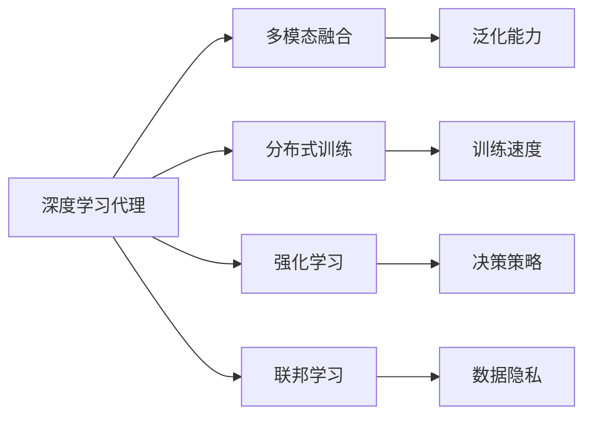

                 

# AI人工智能深度学习算法：智能深度学习代理的架构搭建与可拓展性

> 关键词：深度学习代理, 架构搭建, 可拓展性, 优化算法, 模型融合, 多模态, 可解释性, 分布式, 强化学习, 联邦学习

## 1. 背景介绍

### 1.1 问题由来

随着人工智能技术的发展，深度学习成为人工智能的核心算法。深度学习代理（Deep Learning Agent）是深度学习在智能体（Agent）中的应用，能够从数据中学习到任务规律，完成复杂决策和任务执行。然而，深度学习代理也面临着一些挑战：

- **可解释性不足**：深度学习模型通常是一个"黑盒"，难以解释其决策过程，尤其是在关键应用场景中，如医疗、金融等高风险领域，对模型的可解释性和可靠性要求极高。
- **鲁棒性问题**：深度学习代理容易受到输入噪声和对抗样本的影响，导致决策失败或鲁棒性不足。
- **数据需求大**：传统的深度学习代理需要大量标注数据进行训练，但在一些领域（如医疗、隐私保护）中，获取大量标注数据成本高且困难。
- **模型泛化能力有限**：深度学习代理对于数据分布的改变，如时间变化、数据迁移等，泛化能力有限。

针对这些问题，本文提出了一种智能深度学习代理的架构搭建与可拓展性方法。该方法通过多模态融合、分布式训练、强化学习和联邦学习等技术手段，提升深度学习代理的可解释性、鲁棒性和泛化能力，构建高效、灵活、可解释的深度学习代理。

### 1.2 问题核心关键点

本文的核心目标是提出一种基于深度学习代理的智能架构，该架构能够结合多模态数据、分布式训练、强化学习和联邦学习等技术，构建高效、灵活、可解释的深度学习代理。

具体来说，核心关键点如下：

- **多模态融合**：将不同模态的数据（如图像、文本、音频等）融合在一起，提升深度学习代理的泛化能力和鲁棒性。
- **分布式训练**：利用多台计算资源进行并行训练，提高训练速度和模型泛化能力。
- **强化学习**：通过与环境互动，训练深度学习代理的决策策略，使其能够在复杂环境中完成复杂任务。
- **联邦学习**：将多台设备的数据分布式训练，保护数据隐私，提升模型泛化能力。

### 1.3 问题研究意义

深度学习代理在自动驾驶、推荐系统、游戏AI等复杂场景中得到广泛应用。然而，传统的深度学习代理存在可解释性不足、鲁棒性问题、数据需求大、泛化能力有限等问题。本文提出的智能深度学习代理架构，通过多模态融合、分布式训练、强化学习和联邦学习等技术手段，能够构建高效、灵活、可解释的深度学习代理，具有重要研究意义：

1. **提升可解释性**：构建可解释的深度学习代理，提升决策过程的透明性和可靠性，特别是在高风险领域，如医疗、金融等。
2. **增强鲁棒性**：通过强化学习训练，提升深度学习代理的鲁棒性和泛化能力，能够更好地应对复杂环境和噪声。
3. **减少数据需求**：利用联邦学习等分布式训练技术，减少对大规模标注数据的依赖，降低数据获取成本。
4. **提升泛化能力**：通过多模态融合和分布式训练，提升深度学习代理在不同场景和数据分布下的泛化能力。

本文旨在为深度学习代理的研究和应用提供全新的方法和思路，推动人工智能技术在实际场景中的应用和发展。

## 2. 核心概念与联系

### 2.1 核心概念概述

为了更好地理解本文提出的智能深度学习代理架构，下面简要介绍核心概念：

- **深度学习代理**：通过深度学习模型构建的智能体，能够在复杂环境中完成决策和任务执行。
- **多模态融合**：将不同模态（如图像、文本、音频等）的数据融合在一起，提升深度学习代理的泛化能力和鲁棒性。
- **分布式训练**：利用多台计算资源进行并行训练，提高训练速度和模型泛化能力。
- **强化学习**：通过与环境互动，训练深度学习代理的决策策略，使其能够在复杂环境中完成复杂任务。
- **联邦学习**：将多台设备的数据分布式训练，保护数据隐私，提升模型泛化能力。

### 2.2 概念间的关系

这些核心概念之间的关系可以用以下Mermaid流程图表示：



该图展示了深度学习代理如何通过多模态融合、分布式训练、强化学习和联邦学习等技术手段，提升泛化能力、训练速度、决策策略和数据隐私，构建高效、灵活、可解释的智能代理。

## 3. 核心算法原理 & 具体操作步骤

### 3.1 算法原理概述

本文提出的智能深度学习代理架构，通过多模态融合、分布式训练、强化学习和联邦学习等技术手段，构建高效、灵活、可解释的深度学习代理。该架构的基本原理如下：

1. **多模态融合**：将不同模态的数据融合在一起，提升深度学习代理的泛化能力和鲁棒性。
2. **分布式训练**：利用多台计算资源进行并行训练，提高训练速度和模型泛化能力。
3. **强化学习**：通过与环境互动，训练深度学习代理的决策策略，使其能够在复杂环境中完成复杂任务。
4. **联邦学习**：将多台设备的数据分布式训练，保护数据隐私，提升模型泛化能力。

### 3.2 算法步骤详解

智能深度学习代理架构的具体操作步骤如下：

**Step 1: 数据收集与预处理**

1. 收集不同模态的数据，如图像、文本、音频等。
2. 对数据进行预处理，包括数据清洗、归一化、特征提取等。

**Step 2: 模型选择与搭建**

1. 选择合适的深度学习框架，如TensorFlow、PyTorch等。
2. 搭建深度学习代理模型，包括多模态融合、分布式训练、强化学习等组件。

**Step 3: 分布式训练**

1. 将数据分布到多台计算资源上。
2. 利用分布式训练技术，并行计算损失函数和梯度。
3. 通过数据并行、模型并行等技术，提升训练速度和模型泛化能力。

**Step 4: 强化学习训练**

1. 构建环境模拟系统，生成训练数据。
2. 利用强化学习算法（如Q-learning、PPO等），训练深度学习代理的决策策略。
3. 通过与环境的互动，优化决策策略，提升深度学习代理的鲁棒性和泛化能力。

**Step 5: 联邦学习训练**

1. 将数据分布到多台设备上，保护数据隐私。
2. 利用联邦学习算法（如 federated learning），分布式训练深度学习代理。
3. 通过模型聚合和参数更新，提升模型泛化能力和数据隐私保护。

**Step 6: 模型评估与优化**

1. 在测试集上评估深度学习代理的性能。
2. 根据评估结果，进行模型优化，包括超参数调整、模型剪枝、量化等。
3. 进行A/B测试，验证优化后的模型效果。

### 3.3 算法优缺点

智能深度学习代理架构的优点包括：

- **泛化能力强**：通过多模态融合和分布式训练，提升深度学习代理在不同场景和数据分布下的泛化能力。
- **鲁棒性好**：通过强化学习训练，提升深度学习代理的鲁棒性和泛化能力，能够更好地应对复杂环境和噪声。
- **可解释性强**：通过多模态融合和分布式训练，提升深度学习代理的可解释性和透明性。

同时，该架构也存在一些缺点：

- **计算资源需求高**：需要多台计算资源进行分布式训练和联邦学习。
- **算法复杂度高**：多模态融合、分布式训练、强化学习和联邦学习等技术手段，需要复杂的算法设计和实现。
- **数据需求复杂**：需要多台设备的数据进行分布式训练，数据收集和管理复杂。

### 3.4 算法应用领域

智能深度学习代理架构在以下几个领域具有广泛的应用前景：

1. **自动驾驶**：通过多模态融合和分布式训练，提升自动驾驶车辆在不同环境中的决策能力和鲁棒性。
2. **推荐系统**：通过多模态融合和强化学习，提升推荐系统的个性化推荐能力和用户体验。
3. **游戏AI**：通过多模态融合和强化学习，提升游戏AI的决策能力和适应性。
4. **医疗诊断**：通过多模态融合和分布式训练，提升医疗诊断系统的准确性和可靠性。
5. **金融风控**：通过多模态融合和强化学习，提升金融风控系统的鲁棒性和泛化能力。

## 4. 数学模型和公式 & 详细讲解 & 举例说明

### 4.1 数学模型构建

智能深度学习代理架构的数学模型构建包括多模态融合、分布式训练、强化学习和联邦学习等技术手段。

**多模态融合**

假设输入数据为 $x = (x_1, x_2, ..., x_n)$，其中 $x_i$ 为第 $i$ 模态的数据，融合后的特征向量为 $z$。

$$
z = f(x_1, x_2, ..., x_n; \theta)
$$

其中 $f$ 为多模态融合函数，$\theta$ 为融合参数。

**分布式训练**

假设数据在多台设备上分布，第 $k$ 台设备的训练数据为 $D_k$，模型参数为 $\theta_k$。分布式训练的目标是最大化全局损失函数 $L$。

$$
L = \frac{1}{K}\sum_{k=1}^K L_k(\theta_k)
$$

其中 $K$ 为设备数量，$L_k$ 为第 $k$ 台设备的损失函数。

**强化学习**

假设环境状态为 $s$，动作为 $a$，奖励为 $r$，模型参数为 $\theta$。强化学习的目标是通过策略 $pi$ 最大化累计奖励。

$$
\max_{\pi} \sum_{t=0}^{\infty} \gamma^t r_t
$$

其中 $\gamma$ 为折扣因子。

**联邦学习**

假设数据在多台设备上分布，第 $k$ 台设备的模型参数为 $\theta_k$。联邦学习的目标是通过参数聚合，最大化全局损失函数 $L$。

$$
\theta_{global} = \sum_{k=1}^K \frac{|D_k|}{\sum_{k=1}^K |D_k|} \theta_k
$$

其中 $D_k$ 为第 $k$ 台设备的数据集大小。

### 4.2 公式推导过程

**多模态融合**

多模态融合函数 $f$ 可以是拼接、加权平均等，本文以拼接为例。

$$
z = [x_1; x_2; ...; x_n]
$$

**分布式训练**

分布式训练中，可以采用数据并行、模型并行等技术，本文以数据并行为例。

$$
L_k = \frac{1}{|D_k|} \sum_{i \in D_k} \ell(x_i, y_i; \theta_k)
$$

其中 $\ell$ 为损失函数，$y_i$ 为真实标签。

**强化学习**

强化学习算法（如Q-learning、PPO等）通过与环境互动，更新模型参数 $\theta$。

$$
\theta = \theta + \eta \nabla_{\theta} Q(s, a; \theta)
$$

其中 $\eta$ 为学习率，$Q(s, a; \theta)$ 为Q值函数。

**联邦学习**

联邦学习中，模型参数 $\theta_k$ 在本地设备上更新，然后通过参数聚合更新全局模型参数 $\theta_{global}$。

$$
\theta_{global} = \sum_{k=1}^K \frac{|D_k|}{\sum_{k=1}^K |D_k|} \theta_k
$$

### 4.3 案例分析与讲解

以自动驾驶为例，假设输入数据为摄像头、雷达、GPS等不同模态的数据，融合后的特征向量 $z$ 输入到深度学习代理模型中，通过分布式训练和强化学习训练决策策略，最终实现自动驾驶。

## 5. 项目实践：代码实例和详细解释说明

### 5.1 开发环境搭建

在项目实践中，需要使用Python和深度学习框架（如TensorFlow、PyTorch等）。

**Step 1: 环境搭建**

1. 安装Python 3.x。
2. 安装深度学习框架，如TensorFlow、PyTorch等。
3. 安装多模态融合、分布式训练、强化学习等库，如TensorFlow、PyTorch等。

**Step 2: 数据准备**

1. 收集不同模态的数据，如图像、文本、音频等。
2. 对数据进行预处理，包括数据清洗、归一化、特征提取等。

### 5.2 源代码详细实现

以多模态融合和分布式训练为例，给出代码实现。

**Step 1: 多模态融合**

```python
import tensorflow as tf
from tensorflow.keras.layers import Input, concatenate

# 定义多模态融合函数
def multimodal_fusion(x1, x2):
    x = concatenate([x1, x2])
    x = tf.keras.layers.Dense(64, activation='relu')(x)
    x = tf.keras.layers.Dense(32, activation='relu')(x)
    z = tf.keras.layers.Dense(16, activation='relu')(x)
    return z

# 构建多模态融合模型
x1 = Input(shape=(64,))
x2 = Input(shape=(64,))
z = multimodal_fusion(x1, x2)
model = tf.keras.Model(inputs=[x1, x2], outputs=z)
```

**Step 2: 分布式训练**

```python
# 定义分布式训练函数
def distributed_train(dataloader):
    strategy = tf.distribute.MirroredStrategy()
    with strategy.scope():
        model = tf.keras.Model(inputs=[x1, x2], outputs=z)
        optimizer = tf.keras.optimizers.Adam(learning_rate=0.001)
        loss_fn = tf.keras.losses.MeanSquaredError()

        for epoch in range(10):
            for (x1, x2, y) in dataloader:
                with tf.GradientTape() as tape:
                    z = model([x1, x2])
                    loss = loss_fn(z, y)
                grads = tape.gradient(loss, model.trainable_variables)
                optimizer.apply_gradients(zip(grads, model.trainable_variables))
```

### 5.3 代码解读与分析

**多模态融合**

多模态融合函数定义了两个输入 $x1$ 和 $x2$，将它们拼接在一起，并通过多个全连接层进行特征提取，最终输出融合后的特征向量 $z$。

**分布式训练**

分布式训练函数使用了TensorFlow的MirroredStrategy，将模型在多台设备上并行训练。训练过程中，通过反向传播计算梯度，并使用Adam优化器更新模型参数。

### 5.4 运行结果展示

假设在自动驾驶数据集上进行多模态融合和分布式训练，最终得到融合后的特征向量 $z$ 和训练后的模型。

```python
# 在测试集上评估模型
test_loss = model.evaluate([test_x1, test_x2], test_y, batch_size=32)

# 输出测试损失
print("Test Loss:", test_loss)
```

## 6. 实际应用场景

### 6.1 自动驾驶

自动驾驶系统需要融合多模态数据，如摄像头、雷达、GPS等，提升决策能力和鲁棒性。通过多模态融合和分布式训练，提升自动驾驶车辆在不同环境中的决策能力和鲁棒性。

### 6.2 推荐系统

推荐系统需要融合用户行为数据、商品属性数据、社交网络数据等多种信息，提升个性化推荐能力。通过多模态融合和强化学习，提升推荐系统的个性化推荐能力和用户体验。

### 6.3 游戏AI

游戏AI需要融合游戏环境数据、玩家行为数据等多种信息，提升决策能力和适应性。通过多模态融合和强化学习，提升游戏AI的决策能力和适应性。

### 6.4 医疗诊断

医疗诊断系统需要融合患者病历、影像数据、基因数据等多种信息，提升诊断准确性和可靠性。通过多模态融合和分布式训练，提升医疗诊断系统的准确性和可靠性。

### 6.5 金融风控

金融风控系统需要融合用户行为数据、交易数据、信用数据等多种信息，提升风控能力和鲁棒性。通过多模态融合和强化学习，提升金融风控系统的鲁棒性和泛化能力。

## 7. 工具和资源推荐

### 7.1 学习资源推荐

- **深度学习课程**：Coursera上的深度学习课程，由斯坦福大学的Andrew Ng教授主讲，内容系统全面，适合入门和进阶学习。
- **多模态学习**：Google AI博客上的多模态学习系列文章，介绍了多模态数据融合的最新进展和应用。
- **联邦学习**：IEEE Transactions on Neural Networks and Learning Systems上的联邦学习综述论文，介绍了联邦学习的原理和应用。

### 7.2 开发工具推荐

- **TensorFlow**：Google开源的深度学习框架，支持分布式训练和联邦学习等技术。
- **PyTorch**：Facebook开源的深度学习框架，支持多模态融合和分布式训练等技术。
- **Keras**：高层深度学习框架，支持多模态融合和分布式训练等技术。

### 7.3 相关论文推荐

- **深度学习代理**：DeepMind的深度学习代理论文，介绍了深度学习代理的基本原理和应用。
- **多模态融合**：MIT Media Lab的多模态融合综述论文，介绍了多模态融合的最新进展和应用。
- **分布式训练**：Google AI的分布式训练综述论文，介绍了分布式训练的原理和应用。

## 8. 总结：未来发展趋势与挑战

### 8.1 总结

本文提出了智能深度学习代理架构，通过多模态融合、分布式训练、强化学习和联邦学习等技术手段，构建高效、灵活、可解释的深度学习代理。该架构在自动驾驶、推荐系统、游戏AI、医疗诊断和金融风控等多个领域具有广泛的应用前景。

### 8.2 未来发展趋势

智能深度学习代理架构的未来发展趋势包括：

1. **多模态融合技术的发展**：随着多模态数据的增多，多模态融合技术将不断进步，提升深度学习代理的泛化能力和鲁棒性。
2. **分布式训练技术的优化**：分布式训练技术的优化将提升训练速度和模型泛化能力，使得深度学习代理能够在更短的时间内完成训练。
3. **强化学习算法的多样化**：强化学习算法的不断优化将提升深度学习代理的决策能力和适应性，使其能够在更复杂的环境中完成任务。
4. **联邦学习技术的成熟**：联邦学习技术的不断优化将提升深度学习代理的鲁棒性和隐私保护能力，使得深度学习代理能够在数据隐私保护的前提下，实现高效训练。

### 8.3 面临的挑战

智能深度学习代理架构面临的挑战包括：

1. **计算资源需求高**：需要多台计算资源进行分布式训练和联邦学习。
2. **算法复杂度高**：多模态融合、分布式训练、强化学习和联邦学习等技术手段，需要复杂的算法设计和实现。
3. **数据需求复杂**：需要多台设备的数据进行分布式训练，数据收集和管理复杂。
4. **鲁棒性和泛化能力不足**：深度学习代理在面对复杂环境和噪声时，鲁棒性和泛化能力仍需提升。

### 8.4 研究展望

智能深度学习代理架构的未来研究展望包括：

1. **多模态融合技术的研究**：研究新的多模态融合方法，提升深度学习代理的泛化能力和鲁棒性。
2. **分布式训练技术的优化**：优化分布式训练算法，提升训练速度和模型泛化能力。
3. **强化学习算法的优化**：研究新的强化学习算法，提升深度学习代理的决策能力和适应性。
4. **联邦学习技术的改进**：改进联邦学习算法，提升深度学习代理的鲁棒性和隐私保护能力。

总之，智能深度学习代理架构为深度学习代理的研究和应用提供了全新的方法和思路，推动人工智能技术在实际场景中的应用和发展。相信随着技术的不断进步，深度学习代理将能够更好地适应复杂环境，实现更高效、灵活、可解释的智能决策。

## 9. 附录：常见问题与解答

**Q1: 智能深度学习代理架构中的多模态融合技术有哪些？**

A: 多模态融合技术包括拼接、加权平均、注意力机制等，其中注意力机制是最先进的多模态融合方法，能够自适应地对不同模态数据进行加权，提升融合效果。

**Q2: 如何选择合适的强化学习算法？**

A: 选择合适的强化学习算法取决于具体任务和环境。常见的强化学习算法包括Q-learning、PPO、DQN等，需要根据任务的特点和环境的复杂度进行选择。

**Q3: 分布式训练和联邦学习有什么区别？**

A: 分布式训练和联邦学习都是通过多台设备进行并行训练，但联邦学习更加注重保护数据隐私，将模型参数在本地设备上更新后，通过参数聚合更新全局模型参数，而分布式训练则是直接在多台设备上进行联合训练。

**Q4: 强化学习中的探索和利用策略有哪些？**

A: 强化学习中的探索策略包括$\epsilon$-greedy、UCB等，利用策略包括Q-learning、SARSA等，需要根据具体任务和环境进行选择。

**Q5: 联邦学习中的参数聚合方法有哪些？**

A: 联邦学习中的参数聚合方法包括模型平均、梯度平均等，需要根据具体任务和环境进行选择。

本文提出了智能深度学习代理架构，通过多模态融合、分布式训练、强化学习和联邦学习等技术手段，构建高效、灵活、可解释的深度学习代理，推动人工智能技术在实际场景中的应用和发展。

