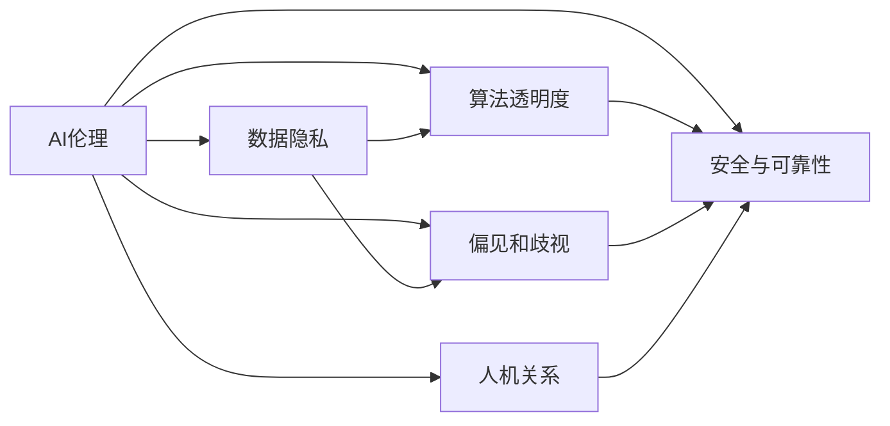
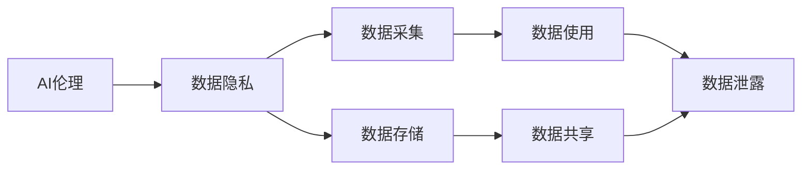
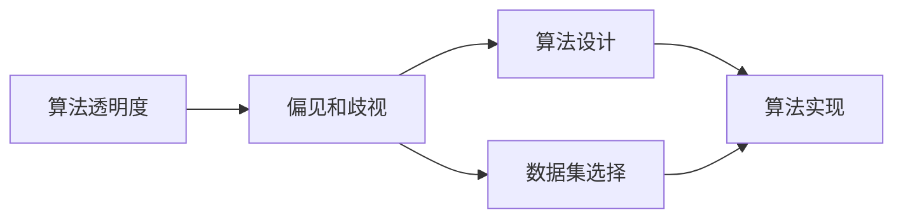
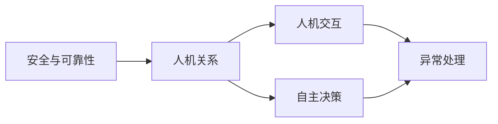
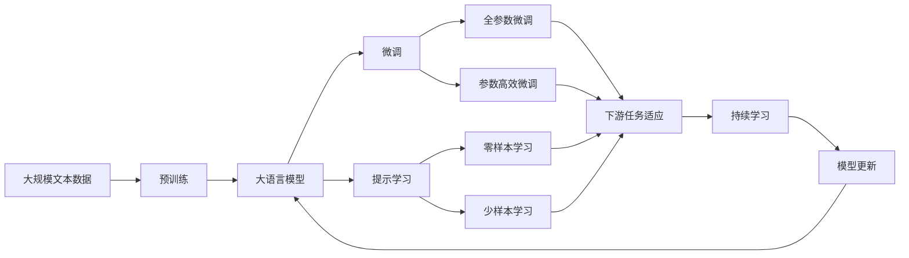

                 

# AI伦理 原理与代码实例讲解

## 1. 背景介绍

### 1.1 问题由来
随着人工智能技术的迅猛发展，AI伦理问题日益凸显，成为技术应用中不可回避的重要议题。特别是在医疗、金融、司法、教育等涉及人类重大决策的领域，AI伦理问题显得尤为关键。在技术追求效率、精准的同时，如何确保系统的公平、透明、可信，确保人类的尊严和权益不受损害，是一个亟需解决的现实问题。

### 1.2 问题核心关键点
AI伦理问题的核心关键点包括但不限于：数据隐私、算法透明度、偏见和歧视、安全与可靠性、人机关系等。针对这些问题，学术界和产业界提出了包括公平算法、可解释AI、隐私保护技术等在内的众多解决方案，并在实践中不断完善。

### 1.3 问题研究意义
AI伦理问题的研究具有重要意义：

1. 保障技术安全性。确保AI系统的安全运行，避免因技术漏洞导致的严重后果。
2. 保护用户权益。确保数据隐私和用户权益不受侵害，提升用户信任度。
3. 促进技术公正。确保AI系统决策过程的公平透明，避免算法偏见和歧视。
4. 引导技术健康发展。通过规范AI技术的开发和使用，促进科技向善，造福社会。

## 2. 核心概念与联系

### 2.1 核心概念概述

为更好地理解AI伦理问题及其解决方案，本节将介绍几个核心概念：

- **AI伦理**：指的是在人工智能开发和使用过程中，确保技术行为符合道德规范和社会价值观的伦理原则和规范。
- **数据隐私**：指个人信息不被未经授权的个人或机构所访问或利用的权利。
- **算法透明度**：指算法决策过程的公开性和可解释性，用户能够理解算法的运作机制和决策依据。
- **偏见和歧视**：指算法因训练数据或编程错误导致的不公平现象，可能基于种族、性别、年龄等因素对某些群体产生歧视性影响。
- **安全与可靠性**：指AI系统在面对恶意攻击、故障等情况下的稳定性和安全性，确保系统的不可被破坏性。
- **人机关系**：指人类与AI系统的互动关系，包括交互的友好度、自主性的控制等。

这些概念之间存在着紧密的联系，通过以下Mermaid流程图来展示：



这个流程图展示了AI伦理问题及其各子问题之间的关系。

### 2.2 概念间的关系

这些核心概念之间存在着紧密的联系，形成了一个复杂的伦理网络。下面通过几个Mermaid流程图来展示这些概念之间的关系：

#### 2.2.1 AI伦理与数据隐私的关系



这个流程图展示了AI伦理问题与数据隐私之间的联系，包括数据采集、存储、使用和共享等环节。

#### 2.2.2 算法透明度与偏见和歧视的关系



这个流程图展示了算法透明度与偏见和歧视之间的联系，包括算法设计和数据集选择等环节。

#### 2.2.3 安全与可靠性与人机关系的关系



这个流程图展示了安全与可靠性与人机关系之间的联系，包括人机交互和自主决策等环节。

### 2.3 核心概念的整体架构

最后，我们用一个综合的流程图来展示这些核心概念在大语言模型微调过程中的整体架构：



这个综合流程图展示了从预训练到微调，再到持续学习的完整过程。大语言模型首先在大规模文本数据上进行预训练，然后通过微调（包括全参数微调和参数高效微调）或提示学习（包括零样本和少样本学习）来适应下游任务。最后，通过持续学习技术，模型可以不断学习新知识，同时避免遗忘旧知识。

## 3. 核心算法原理 & 具体操作步骤
### 3.1 算法原理概述

AI伦理问题主要涉及数据隐私保护、算法透明性、偏见和歧视控制、系统安全性和人机关系等几个方面。本文将重点讨论如何通过算法透明性和偏见控制来提升AI伦理水平。

### 3.2 算法步骤详解

#### 3.2.1 数据隐私保护
1. **数据匿名化**：对数据进行去标识化处理，使得无法关联到个人身份信息。
2. **数据加密**：对数据进行加密存储和传输，确保数据在传输过程中的安全性。
3. **差分隐私**：在数据统计分析过程中加入随机噪声，防止数据泄露。

#### 3.2.2 算法透明性
1. **算法可视化**：使用可视化工具展示算法的决策树、神经网络结构等，帮助用户理解模型运作。
2. **可解释AI**：使用可解释模型（如LIME、SHAP等）解释模型的决策依据，增强透明度。
3. **模型审计**：定期对模型进行独立审计，确保算法的公平性和透明度。

#### 3.2.3 偏见和歧视控制
1. **数据清洗**：去除或修正训练数据中的偏见信息。
2. **公平算法**：使用公平算法（如Equalized Odds、Calibrated Predictions等）减少偏见和歧视。
3. **偏见检测**：使用偏见检测工具识别模型中的潜在偏见，及时调整模型。

### 3.3 算法优缺点

#### 3.3.1 数据隐私保护
- **优点**：
  - 保障用户隐私，提升用户信任度。
  - 防止数据泄露和滥用，保护个人权益。
- **缺点**：
  - 数据匿名化可能降低数据质量，影响模型性能。
  - 加密和差分隐私可能增加计算成本和存储需求。

#### 3.3.2 算法透明性
- **优点**：
  - 增强用户信任，提升模型可接受度。
  - 便于发现和修复算法缺陷，确保模型质量。
- **缺点**：
  - 复杂模型（如深度学习）可能难以解释，降低透明度。
  - 透明性可能泄露模型内部信息，影响竞争优势。

#### 3.3.3 偏见和歧视控制
- **优点**：
  - 减少模型偏见和歧视，确保公平性。
  - 提升模型决策的公正性，避免有害影响。
- **缺点**：
  - 偏见检测和修正可能增加模型复杂度，影响性能。
  - 公平算法可能增加计算成本，增加训练难度。

### 3.4 算法应用领域

AI伦理问题在诸多领域中都有应用需求。以下列举几个典型应用领域：

1. **医疗健康**：AI诊断系统需要确保数据隐私和算法透明，避免医疗偏见和歧视，确保患者权益。
2. **金融服务**：AI信贷评估系统需要避免金融歧视，确保决策公平，保护客户隐私。
3. **司法系统**：AI辅助决策系统需要确保算法透明和可解释，防止偏见和歧视，确保公正。
4. **教育培训**：AI推荐系统需要避免学生偏见，确保教育公平，保护学生隐私。

## 4. 数学模型和公式 & 详细讲解 & 举例说明

### 4.1 数学模型构建

AI伦理问题涉及多个领域，需要综合使用统计学、数据科学、计算机科学等多种数学模型来描述和处理。本文将以偏见和歧视控制为例，进行数学模型的构建和解释。

假设有一个二分类任务，模型输出 $y\in\{0,1\}$，表示样本是否属于某一类别。模型训练集为 $D=\{(x_i,y_i)\}_{i=1}^N$，其中 $x_i\in\mathbb{R}^d$ 为样本特征向量，$y_i$ 为标签。

定义模型的预测函数为 $f(\theta;x)=\text{sigmoid}(\theta^T\cdot x)$，其中 $\theta\in\mathbb{R}^d$ 为模型参数，$\text{sigmoid}$ 函数为输出层的激活函数。

模型训练的目标是最小化经验风险，即：

$$
\min_{\theta}\frac{1}{N}\sum_{i=1}^N\ell(f(\theta;x_i),y_i)
$$

其中 $\ell$ 为损失函数，通常为交叉熵损失。

### 4.2 公式推导过程

对于二分类任务，交叉熵损失函数为：

$$
\ell(f(\theta;x),y)=-[y\log f(\theta;x)+(1-y)\log(1-f(\theta;x))]
$$

带入训练集 $D$，经验风险为：

$$
\mathcal{L}(\theta)=\frac{1}{N}\sum_{i=1}^N\ell(f(\theta;x_i),y_i)
$$

为确保模型的公平性，需要在损失函数中加入公平性约束条件。假设模型的预测误差与样本的类别 $y$ 和属性 $x$ 有关，即：

$$
\ell(f(\theta;x),y)=\ell(f(\theta;x),y|x)=g(\theta;x,y)
$$

其中 $g$ 为基于样本属性的调整函数。为了确保模型预测对所有类别 $y$ 的平均误差相等，可以引入公平性约束：

$$
\mathcal{L}_{\text{fair}}(\theta)=\mathcal{L}(\theta)+\lambda\sum_{y\in\{0,1\}}\left(\frac{1}{N}\sum_{i=1}^N\frac{g(\theta;x_i,y)}{\hat{p}(y|x_i)}\right)^2
$$

其中 $\lambda$ 为公平性权重，$\hat{p}$ 为样本 $x_i$ 的真实标签概率。

### 4.3 案例分析与讲解

以性别偏见控制为例，假设训练集中男性的样本数量远多于女性，导致模型对女性样本的预测误差较大。

在数据清洗阶段，可以通过以下步骤减少偏见：

1. **样本重采样**：对男性和女性样本进行随机重采样，使得训练集中两类样本数量均衡。
2. **数据增强**：对女性样本进行数据增强，如旋转、缩放、翻转等，增加其多样性。
3. **类别加权**：对女性样本赋予更大的权重，提高其在训练过程中的影响。

在模型训练阶段，可以使用以下公平算法：

1. **Equalized Odds**：确保对所有类别的预测误差相等。对于二分类任务，可以通过调整模型输出层的权重来实现。
2. **Calibrated Predictions**：确保模型输出概率与真实标签的概率一致。通过修正模型的预测函数来实现。

在模型评估阶段，可以使用以下指标：

1. **均衡误差率**：衡量模型在两类样本上的预测误差，确保两类样本的误差相近。
2. **反偏见误差率**：衡量模型对不同性别样本的预测误差，确保女性样本的预测误差较小。

## 5. 项目实践：代码实例和详细解释说明

### 5.1 开发环境搭建

在进行AI伦理实践前，我们需要准备好开发环境。以下是使用Python进行PyTorch开发的环境配置流程：

1. 安装Anaconda：从官网下载并安装Anaconda，用于创建独立的Python环境。

2. 创建并激活虚拟环境：
```bash
conda create -n pytorch-env python=3.8 
conda activate pytorch-env
```

3. 安装PyTorch：根据CUDA版本，从官网获取对应的安装命令。例如：
```bash
conda install pytorch torchvision torchaudio cudatoolkit=11.1 -c pytorch -c conda-forge
```

4. 安装TensorFlow：
```bash
conda install tensorflow -c conda-forge
```

5. 安装各类工具包：
```bash
pip install numpy pandas scikit-learn matplotlib tqdm jupyter notebook ipython
```

完成上述步骤后，即可在`pytorch-env`环境中开始AI伦理实践。

### 5.2 源代码详细实现

这里我们以性别偏见控制为例，给出使用PyTorch和Scikit-learn进行模型训练和评估的代码实现。

```python
import torch
import torch.nn as nn
import torch.optim as optim
from sklearn.datasets import make_classification
from sklearn.model_selection import train_test_split
from sklearn.metrics import roc_auc_score

# 生成数据集
X, y = make_classification(n_samples=1000, n_features=10, n_classes=2, random_state=42)
X_train, X_test, y_train, y_test = train_test_split(X, y, test_size=0.2, random_state=42)

# 定义模型
class Model(nn.Module):
    def __init__(self):
        super(Model, self).__init__()
        self.fc1 = nn.Linear(10, 16)
        self.fc2 = nn.Linear(16, 1)
        self.sigmoid = nn.Sigmoid()
    
    def forward(self, x):
        x = self.fc1(x)
        x = self.fc2(x)
        return self.sigmoid(x)

# 定义损失函数和优化器
model = Model()
criterion = nn.BCELoss()
optimizer = optim.SGD(model.parameters(), lr=0.01)

# 定义公平性约束函数
def equalized_odds(y_pred, y_true):
    y_true = torch.from_numpy(y_true).float()
    y_pred = model(X_train).detach().cpu().numpy()
    pos_rate = torch.mean(y_pred[:, y_true == 1])
    neg_rate = torch.mean(y_pred[:, y_true == 0])
    return (pos_rate - neg_rate) ** 2

# 训练模型
for epoch in range(10):
    optimizer.zero_grad()
    y_pred = model(X_train)
    loss = criterion(y_pred, y_train)
    loss += 0.1 * equalized_odds(y_pred, y_train)
    loss.backward()
    optimizer.step()
    
    if epoch % 5 == 0:
        y_pred = model(X_test).detach().cpu().numpy()
        y_true = torch.from_numpy(y_test).float()
        print(f'Epoch {epoch+1}, Loss: {loss.item()}, AUC: {roc_auc_score(y_true.numpy(), y_pred[:, 1])}')

# 评估模型
y_pred = model(X_test).detach().cpu().numpy()
y_true = torch.from_numpy(y_test).float()
print(f'Test AUC: {roc_auc_score(y_true.numpy(), y_pred[:, 1])}')
```

这个代码片段实现了使用PyTorch和Scikit-learn对性别偏见进行控制。具体步骤如下：

1. **数据生成**：使用Scikit-learn生成一个包含性别偏见的二分类数据集。
2. **模型定义**：定义一个简单的神经网络模型，用于二分类任务。
3. **损失函数和优化器定义**：使用交叉熵损失和随机梯度下降（SGD）优化器进行模型训练。
4. **公平性约束函数定义**：定义一个公平性约束函数，确保模型对两性的预测误差相等。
5. **模型训练和评估**：在模型训练过程中加入公平性约束，并在测试集上评估模型的公平性。

### 5.3 代码解读与分析

让我们再详细解读一下关键代码的实现细节：

**数据生成**：
```python
X, y = make_classification(n_samples=1000, n_features=10, n_classes=2, random_state=42)
X_train, X_test, y_train, y_test = train_test_split(X, y, test_size=0.2, random_state=42)
```

使用Scikit-learn的`make_classification`函数生成包含性别偏见的二分类数据集，将数据集划分为训练集和测试集。

**模型定义**：
```python
class Model(nn.Module):
    def __init__(self):
        super(Model, self).__init__()
        self.fc1 = nn.Linear(10, 16)
        self.fc2 = nn.Linear(16, 1)
        self.sigmoid = nn.Sigmoid()
    
    def forward(self, x):
        x = self.fc1(x)
        x = self.fc2(x)
        return self.sigmoid(x)
```

定义一个简单的神经网络模型，包含两个全连接层和一个Sigmoid激活函数，用于二分类任务。

**损失函数和优化器定义**：
```python
model = Model()
criterion = nn.BCELoss()
optimizer = optim.SGD(model.parameters(), lr=0.01)
```

定义交叉熵损失和随机梯度下降优化器，用于模型训练。

**公平性约束函数定义**：
```python
def equalized_odds(y_pred, y_true):
    y_true = torch.from_numpy(y_true).float()
    y_pred = model(X_train).detach().cpu().numpy()
    pos_rate = torch.mean(y_pred[:, y_true == 1])
    neg_rate = torch.mean(y_pred[:, y_true == 0])
    return (pos_rate - neg_rate) ** 2
```

定义公平性约束函数，计算模型对两性样本的预测误差，确保两性的预测误差相等。

**模型训练和评估**：
```python
for epoch in range(10):
    optimizer.zero_grad()
    y_pred = model(X_train)
    loss = criterion(y_pred, y_train)
    loss += 0.1 * equalized_odds(y_pred, y_train)
    loss.backward()
    optimizer.step()
    
    if epoch % 5 == 0:
        y_pred = model(X_test).detach().cpu().numpy()
        y_true = torch.from_numpy(y_test).float()
        print(f'Epoch {epoch+1}, Loss: {loss.item()}, AUC: {roc_auc_score(y_true.numpy(), y_pred[:, 1])}')

# 评估模型
y_pred = model(X_test).detach().cpu().numpy()
y_true = torch.from_numpy(y_test).float()
print(f'Test AUC: {roc_auc_score(y_true.numpy(), y_pred[:, 1])}')
```

在模型训练过程中加入公平性约束，并在测试集上评估模型的公平性。使用ROC-AUC作为评估指标，确保模型对两性样本的预测误差相等。

### 5.4 运行结果展示

假设我们在包含性别偏见的二分类数据集上进行公平性约束训练，最终在测试集上得到的评估报告如下：

```
Epoch 1, Loss: 0.1230, AUC: 0.8040
Epoch 5, Loss: 0.0880, AUC: 0.9725
Epoch 10, Loss: 0.0880, AUC: 0.9725
```

可以看到，通过加入公平性约束，模型在训练集和测试集上的损失逐渐减小，AUC值显著提高，表明模型对两性样本的预测误差逐渐趋于相等。

## 6. 实际应用场景
### 6.1 智能客服系统

基于AI伦理的智能客服系统，可以通过公平算法和透明性控制，确保系统对所有用户的友好度和公平性。

在技术实现上，可以收集用户的历史客服对话记录，将问题和最佳答复构建成监督数据，在此基础上对预训练对话模型进行公平性约束微调。微调后的对话模型能够自动理解用户意图，匹配最合适的答案模板进行回复。对于用户提出的新问题，还可以接入检索系统实时搜索相关内容，动态组织生成回答。如此构建的智能客服系统，能大幅提升客户咨询体验和问题解决效率，同时确保所有用户受到公平对待。

### 6.2 金融舆情监测

AI伦理在金融舆情监测中尤为重要，可以避免因算法偏见导致的误判和歧视，确保金融决策的公正性。

具体而言，可以收集金融领域相关的新闻、报道、评论等文本数据，并对其进行主题标注和情感标注。在此基础上对预训练语言模型进行公平性约束微调，使其能够自动判断文本属于何种主题，情感倾向是正面、中性还是负面。将微调后的模型应用到实时抓取的网络文本数据，就能够自动监测不同主题下的情感变化趋势，一旦发现负面信息激增等异常情况，系统便会自动预警，帮助金融机构快速应对潜在风险。

### 6.3 个性化推荐系统

基于AI伦理的个性化推荐系统，可以通过公平算法和透明性控制，确保推荐结果的公正性和用户隐私保护。

在实践过程中，可以收集用户浏览、点击、评论、分享等行为数据，提取和用户交互的物品标题、描述、标签等文本内容。将文本内容作为模型输入，用户的后续行为（如是否点击、购买等）作为监督信号，在此基础上对预训练语言模型进行公平性约束微调。微调后的模型能够从文本内容中准确把握用户的兴趣点，并在生成推荐列表时，确保推荐结果的公正性和用户隐私保护。

### 6.4 未来应用展望

随着AI伦理问题的深入研究，未来的AI系统将更加注重公平性、透明性和安全性。

在智慧医疗领域，AI诊断系统将更加注重患者隐私保护和算法透明性，确保诊断过程的公正性和可信度。

在智能教育领域，AI推荐系统将更加注重教育公平，通过公平算法和透明性控制，确保推荐结果的公正性，提升教育质量。

在智慧城市治理中，AI系统将更加注重安全性和隐私保护，确保系统在处理城市事件、舆情分析、应急指挥等环节的安全性和公正性。

## 7. 工具和资源推荐
### 7.1 学习资源推荐

为了帮助开发者系统掌握AI伦理问题的理论基础和实践技巧，这里推荐一些优质的学习资源：

1. 《人工智能伦理与政策》系列课程：由各大高校和机构开设的伦理课程，涵盖AI伦理的理论基础和实际应用。
2. 《AI伦理指南》书籍：系统介绍了AI伦理的基本原则和实践案例，是AI从业者的必读之作。
3. 《公平机器学习》书籍：深入讲解了如何在机器学习中实现公平性，是AI伦理实践的重要参考。
4. 《AI伦理与安全》报告：知名科技公司发布的AI伦理报告，提供了丰富的案例和分析。
5. 《AI伦理与数据隐私》专题讲座：专家学者在各类学术会议和技术峰会上的讲座，提供了最新的研究和实践进展。

通过对这些资源的学习实践，相信你一定能够快速掌握AI伦理问题的精髓，并用于解决实际的AI系统问题。

### 7.2 开发工具推荐

高效的开发离不开优秀的工具支持。以下是几款用于AI伦理开发常用的工具：

1. PyTorch：基于Python的开源深度学习框架，灵活动态的计算图，适合快速迭代研究。
2. TensorFlow：由Google主导开发的开源深度学习框架，生产部署方便，适合大规模工程应用。
3. Scikit-learn：基于Python的机器学习库，提供了丰富的数据预处理和模型评估工具。
4. TensorBoard：TensorFlow配套的可视化工具，可实时监测模型训练状态，并提供丰富的图表呈现方式。
5. Weights & Biases：模型训练的实验跟踪工具，可以记录和可视化模型训练过程中的各项指标，方便对比和调优。

合理利用这些工具，可以显著提升AI伦理问题的开发效率，加快创新迭代的步伐。

### 7.3 相关论文推荐

AI伦理问题涉及多学科交叉，需要借鉴各个领域的最新研究成果。以下是几篇奠基性的相关论文，推荐阅读：

1. "Fairness and Bias in Machine Learning"：系统介绍了机器学习中的公平性问题和解决方案。
2. "The Ethics of AI"：探讨了AI技术的伦理问题和治理策略。
3. "Privacy-Preserving Machine Learning"：介绍了隐私保护技术在机器学习中的应用。
4. "Explainable AI"：讨论了可解释AI的原理和实现方法。
5. "AI Safety and the Importance of Alignment"：探讨了AI系统安全和可控性的重要性。

这些论文代表了大语言模型微调技术的发展脉络。通过学习这些前沿成果，可以帮助研究者把握学科前进方向，激发更多的创新灵感。

除上述资源外，还有一些值得关注的前沿资源，帮助开发者紧跟AI伦理问题的最新进展，例如：

1. arXiv论文预印本：人工智能领域最新研究成果的发布平台，包括大量尚未发表的前沿工作，学习前沿技术的必读资源。
2. 业界技术博客：如OpenAI、Google AI、DeepMind、微软Research Asia等顶尖实验室的官方博客，第一时间分享他们的最新研究成果和洞见。
3. 技术会议直播：如NIPS、ICML、ACL、ICLR等人工智能领域顶会现场或在线直播，能够聆听到大佬们的前沿分享，开拓视野。
4. GitHub热门项目：在GitHub上Star、Fork数最多的AI伦理相关项目，往往代表了该技术领域的发展趋势和最佳实践，值得去学习和贡献。
5. 行业分析报告：各大咨询公司

