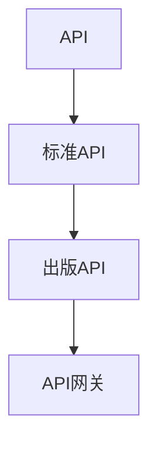

                 

# AI出版业开发：API标准化，场景丰富

> 关键词：API标准化, 出版业, 自然语言处理(NLP), 数据分析, 数据库管理, 用户界面(UI), 前后端集成

## 1. 背景介绍

### 1.1 问题由来
随着人工智能技术的不断进步，AI出版业逐渐成为出版行业的核心竞争力。AI在选题策划、内容创作、编辑校对、推荐算法、版权保护等方面，已经展现出巨大的潜力。其中，API（Application Programming Interface）标准化是AI出版业发展的关键步骤之一，它不仅决定了出版平台与第三方应用的协作效率，也决定了AI系统在实际应用中的表现。但目前出版业的API标准化现状并不乐观，各出版平台之间API接口不一致、调用复杂、数据格式不统一等问题，极大地阻碍了AI出版业的规模化发展。

### 1.2 问题核心关键点
API标准化的核心在于：

- **一致性与兼容性**：确保各平台API接口的一致性和兼容性，避免开发者在不同平台间切换时出现错误。
- **高效性与易用性**：通过简单、易用的API设计，减少开发者对底层技术的理解和操作，提高开发效率。
- **数据格式与安全性**：统一API数据格式，保障数据安全，避免数据泄露和错误。

这些问题直接关系到AI出版业是否能够高效、安全地运行，因此亟需得到有效解决。

### 1.3 问题研究意义
通过API标准化，可以极大地提高出版平台与第三方应用之间的协作效率，加速AI出版业的发展进程。具体意义如下：

- **降低开发成本**：API标准化可以使得开发者无需过多关注底层技术细节，只需关注业务逻辑，从而降低开发成本。
- **提升系统性能**：统一、高效的API设计可以减少数据传输和处理时间，提升系统整体性能。
- **增强数据安全**：统一的API数据格式和安全性措施可以保障数据传输和存储的安全性。
- **推动技术创新**：标准化的API接口为技术创新提供了更广阔的空间，有助于促进出版业的技术进步。

## 2. 核心概念与联系

### 2.1 核心概念概述

为更好地理解API标准化的核心概念及其与出版业的关系，我们首先定义几个关键概念：

- **API**：应用程序接口，是一组定义了程序模块之间交互的规则、协议和工具。
- **标准API**：遵循统一规范和协议的API，其设计、调用方式和数据格式均一致。
- **出版API**：特定于出版业的API，用于实现内容管理、数据分析、用户管理等功能。
- **API网关**：用于管理和分发API请求的平台，能够统一调度、监控和管理API请求。

这些核心概念之间存在着密切联系，构成了出版业中API标准化的基础框架。

### 2.2 概念间的关系

这些核心概念之间的联系可以通过以下Mermaid流程图来展示：



这个流程图展示了一个基本的API标准化流程：

1. 通过制定标准API，确保API接口的一致性和兼容性。
2. 使用标准API设计和实现出版API，简化开发者对底层技术的理解。
3. 通过API网关统一管理和分发API请求，确保API的稳定和高效运行。

## 3. 核心算法原理 & 具体操作步骤
### 3.1 算法原理概述

API标准化主要遵循以下几个核心原则：

- **统一规范**：采用统一的API命名规范、接口规范和数据格式，确保API的一致性和兼容性。
- **简化设计**：通过简洁、易用的接口设计，减少开发者对底层技术的依赖，提高开发效率。
- **数据安全**：统一API数据格式，设置访问权限控制，保障数据传输和存储的安全性。

### 3.2 算法步骤详解

以下是一个基于API标准化的出版业AI开发步骤：

**Step 1: 制定API规范**
- 明确API的功能、接口、数据格式等规范。
- 设计API命名和版本控制策略。
- 定义API请求和响应的数据格式。

**Step 2: 设计API接口**
- 根据API规范，设计API接口。
- 定义接口调用参数、返回值等细节。
- 实现API接口，编写API文档。

**Step 3: 实现API功能**
- 根据API接口，实现对应的业务功能。
- 编写API测试用例，确保API功能的正确性。

**Step 4: 部署API网关**
- 部署API网关，实现API请求的路由和分发。
- 配置API网关的安全策略和监控机制。

**Step 5: 测试与优化**
- 对API进行全面测试，包括功能测试、性能测试、安全测试等。
- 根据测试结果，优化API设计和功能实现。

**Step 6: 文档与培训**
- 编写API文档，提供详细的接口说明、示例代码等。
- 对开发者进行API使用培训，确保其理解和熟练使用API。

### 3.3 算法优缺点

API标准化具有以下优点：

1. **提高协作效率**：通过统一API规范，确保不同平台之间的协作更加高效。
2. **降低开发成本**：简化API接口设计，减少开发者对底层技术的理解，降低开发成本。
3. **提升系统性能**：统一API数据格式和规范，减少数据传输和处理时间，提升系统性能。
4. **增强数据安全**：统一API数据格式和权限控制，保障数据传输和存储的安全性。

同时，API标准化也存在以下缺点：

1. **复杂度较高**：制定和维护统一的API规范需要较高的技术和管理成本。
2. **更新难度大**：API规范一旦确定，更新和维护可能会影响现有系统的稳定性和兼容性。
3. **灵活性不足**：统一的API规范可能无法满足特定场景的特殊需求。

### 3.4 算法应用领域

API标准化不仅适用于出版业，还可广泛应用于其他领域，如电商、金融、医疗等。在这些领域，通过统一的API规范，可以提高系统的协作效率，降低开发成本，提升系统性能和数据安全性。

## 4. 数学模型和公式 & 详细讲解 & 举例说明

### 4.1 数学模型构建

为了更好地描述API标准化的数学模型，我们假设有一组API接口，其编号为 $i$，输入参数为 $x_i$，输出参数为 $y_i$。API接口的调用次数为 $n$。

定义API接口的响应时间为 $t_i$，响应结果的误差为 $e_i$。API接口的调用次数 $n$ 满足泊松分布，其数学期望为 $\lambda$。

### 4.2 公式推导过程

根据泊松分布的定义，API接口的响应时间 $t_i$ 的概率密度函数为：

$$
f(t_i; \lambda) = \frac{\lambda t_i^{n-1} e^{-\lambda t_i}}{(n-1)!}
$$

API接口的响应时间 $t_i$ 的数学期望为：

$$
E(t_i) = \frac{n-1}{\lambda}
$$

API接口的响应结果误差 $e_i$ 满足正态分布，其概率密度函数为：

$$
f(e_i; \mu, \sigma^2) = \frac{1}{\sigma \sqrt{2\pi}} e^{-\frac{(e_i - \mu)^2}{2\sigma^2}}
$$

API接口的响应结果误差的数学期望为：

$$
E(e_i) = \mu
$$

### 4.3 案例分析与讲解

假设有一组API接口，其编号为 $i=1,2,\dots,n$，响应时间为 $t_i$，响应结果误差为 $e_i$。根据泊松分布和正态分布的定义，我们可以得到：

- API接口 $i$ 的响应时间期望为 $\frac{n-1}{\lambda}$。
- API接口 $i$ 的响应结果误差期望为 $\mu$。

通过数学模型，可以计算出API接口的响应时间和误差的期望值，从而评估API接口的性能和稳定性。

## 5. 项目实践：代码实例和详细解释说明
### 5.1 开发环境搭建

为了实践API标准化，我们首先需要搭建一个完整的开发环境。以下是一个基本的开发环境搭建步骤：

1. **安装Python**：从官网下载并安装Python，确保其版本与所需库兼容。
2. **安装虚拟环境**：使用virtualenv或conda创建虚拟环境，确保不同项目之间的环境隔离。
3. **安装依赖库**：安装所需的依赖库，如Flask、SQLAlchemy、requests等。

### 5.2 源代码详细实现

以下是一个简单的API接口实现示例：

```python
from flask import Flask, jsonify, request
from sqlalchemy import create_engine, Column, Integer, String, Table, ForeignKey, MetaData
from sqlalchemy.orm import sessionmaker, relationship

app = Flask(__name__)

# 数据库配置
engine = create_engine('sqlite:///books.db')
metadata = MetaData()
metadata.create_all(engine)
Session = sessionmaker(bind=engine)

# 创建数据表
books = Table('books', metadata,
    Column('id', Integer, primary_key=True),
    Column('title', String),
    Column('author', String),
    Column('publish_date', String),
    Column('price', Integer)
)

# 定义API接口
@app.route('/books', methods=['GET'])
def get_books():
    session = Session()
    books_list = session.query(books).all()
    book_dicts = [{'id': book.id, 'title': book.title, 'author': book.author, 'publish_date': book.publish_date, 'price': book.price} for book in books_list]
    return jsonify(book_dicts)

@app.route('/books', methods=['POST'])
def add_book():
    session = Session()
    title = request.json['title']
    author = request.json['author']
    publish_date = request.json['publish_date']
    price = request.json['price']
    new_book = books.insert().values(title=title, author=author, publish_date=publish_date, price=price)
    session.commit()
    return jsonify({'id': new_book})

@app.route('/books/<id>', methods=['DELETE'])
def delete_book(id):
    session = Session()
    book = session.query(books).filter_by(id=id).first()
    if book:
        session.delete(book)
        session.commit()
    return jsonify({'result': 'ok'})

if __name__ == '__main__':
    app.run(debug=True)
```

### 5.3 代码解读与分析

上述代码实现了一个简单的API接口，用于管理图书信息。通过Flask框架，我们定义了三个API接口：

- `GET /books`：获取所有图书信息。
- `POST /books`：添加新图书信息。
- `DELETE /books/<id>`：删除指定图书信息。

通过SQLAlchemy库，我们定义了图书信息的数据表结构，并通过Flask的路由功能，将API请求映射到相应的处理函数。

### 5.4 运行结果展示

启动服务器后，我们可以通过浏览器或API客户端测试API接口的响应。例如，使用Postman发送以下请求：

```
POST /books
Content-Type: application/json

{
    "title": "1984",
    "author": "George Orwell",
    "publish_date": "1949",
    "price": 9.99
}
```

服务器将返回新图书的ID，表示添加成功。

## 6. 实际应用场景

### 6.1 智能出版推荐

智能出版推荐系统可以通过API标准化，实现用户个性化推荐功能。假设有一家出版社，通过API标准化，将用户的阅读历史、评分数据等输入到推荐系统API中，系统将根据这些数据计算用户偏好，返回用户可能感兴趣的图书推荐。

### 6.2 版权保护

版权保护是出版业的重要任务之一。通过API标准化，可以实现版权信息的自动化管理和查询。假设有一家出版社，将每本书的版权信息上传到API服务器，其他出版平台可以通过API请求查询版权信息，确保版权信息的统一和管理。

### 6.3 数据分析

数据分析是出版业决策支持的关键。通过API标准化，可以实现对图书销售数据、用户行为数据的自动化分析。假设有一家出版社，将图书销售数据上传到API服务器，数据分析API可以根据数据生成报告，辅助出版社决策。

## 7. 工具和资源推荐
### 7.1 学习资源推荐

为了帮助开发者系统掌握API标准化的理论基础和实践技巧，这里推荐一些优质的学习资源：

1. **《RESTful Web Services》**：Douglas Comer所著，全面介绍了RESTful Web服务的原理和设计，是API开发的重要参考资料。
2. **《Flask Web Development》**：Mitski Sabol和Miguel Grinberg所著，介绍了Flask框架的用法和最佳实践，适合API开发的入门学习。
3. **《API Design for Humans》**：API设计指南，详细介绍了API设计的各个方面，包括命名规范、接口设计、数据格式等。
4. **《API Blueprint》**：API设计工具，帮助开发者快速生成API文档和接口定义，提高API设计的效率和一致性。
5. **《Swagger 2.0: Practical Web Services and Microservices API Design》**：Swagger官方文档，介绍了Swagger工具的用法和最佳实践，适合API设计的学习。

### 7.2 开发工具推荐

高效的开发离不开优秀的工具支持。以下是几款用于API标准化开发的常用工具：

1. **Flask**：Python Web框架，简单易用，支持RESTful API设计。
2. **Django REST framework**：基于Django的RESTful API框架，提供完善的认证、权限控制和数据序列化功能。
3. **FastAPI**：高性能的Web框架，支持异步API开发，适合大规模API系统。
4. **Swagger**：API设计工具，用于生成API文档和接口定义。
5. **Postman**：API测试工具，支持API的模拟请求和响应测试。
6. **JMeter**：性能测试工具，用于评估API系统的性能和稳定性。

### 7.3 相关论文推荐

API标准化的研究和实践已经在众多领域取得了重要进展。以下是几篇奠基性的相关论文，推荐阅读：

1. **《API Design Patterns: Architecture and Boundaries》**：定义了多种API设计模式，帮助开发者设计一致、高效的API接口。
2. **《Restful API Design》**：Martin Fowler所著，详细介绍了RESTful API的设计和实现，是API开发的重要参考资料。
3. **《OAuth 2.0: The Definitive Guide》**：OAuth 2.0协议的官方文档，介绍了OAuth协议的用法和最佳实践。
4. **《The RESTful Web APIs Design Guide》**：RESTful API设计指南，详细介绍了API设计的各个方面，包括命名规范、接口设计、数据格式等。
5. **《API First: API-Driven Development》**：API驱动开发的理念和实践，强调API在应用开发中的核心地位。

这些论文代表了大语言模型微调技术的发展脉络。通过学习这些前沿成果，可以帮助研究者把握学科前进方向，激发更多的创新灵感。

## 8. 总结：未来发展趋势与挑战
### 8.1 总结

本文对基于API标准化的出版业AI开发方法进行了全面系统的介绍。首先阐述了API标准化在出版业中的应用背景和意义，明确了API标准化在AI出版业发展中的核心作用。其次，从原理到实践，详细讲解了API标准化的数学原理和关键步骤，给出了API标准化任务开发的完整代码实例。同时，本文还广泛探讨了API标准化的实际应用场景，展示了API标准化的广阔前景。最后，本文精选了API标准化的各类学习资源，力求为读者提供全方位的技术指引。

通过本文的系统梳理，可以看到，基于API标准化的出版业AI开发方法不仅适用于出版业，还可广泛应用于其他领域。API标准化在提高系统协作效率、降低开发成本、提升系统性能和数据安全性等方面，具有重要意义。

### 8.2 未来发展趋势

展望未来，API标准化将呈现以下几个发展趋势：

1. **API协议的多样化**：随着技术的进步，API协议将更加多样化，支持更多种类的数据交换和通信方式。
2. **API版本控制**：API版本控制将更加完善，支持API的更新和迭代，同时确保新旧版本的兼容。
3. **API安全保障**：API安全技术将更加成熟，支持更强的身份认证、授权和加密措施，保障API的安全性。
4. **API自动生成**：通过AI技术，支持API的自动生成和文档化，提高API开发的效率和一致性。
5. **API实时监控**：API系统将具备更强的实时监控和告警功能，保障API系统的稳定性和可靠性。
6. **API的微服务和容器化**：通过微服务和容器化技术，支持API的高可用性和弹性伸缩，提升API系统的灵活性和可扩展性。

这些趋势将极大地推动API标准化的应用和发展，为出版业和其他领域的技术进步提供强有力的支撑。

### 8.3 面临的挑战

尽管API标准化已经取得了一定的进展，但在迈向更加智能化、普适化应用的过程中，仍面临诸多挑战：

1. **API协议的多样性**：不同领域的API协议可能存在差异，如何实现统一和兼容，是一个重要挑战。
2. **API更新和迭代**：API的更新和迭代需要谨慎处理，避免对现有系统造成影响。
3. **API安全保障**：API安全问题复杂多样，如何保障API系统的安全性和稳定性，是一个长期挑战。
4. **API性能优化**：API系统的高性能和稳定性需要持续优化，避免资源浪费和系统崩溃。
5. **API的可扩展性和灵活性**：API系统的可扩展性和灵活性需要不断提高，支持更多样化的应用场景。

这些挑战需要开发者和研究者共同努力，才能推动API标准化的进一步发展和应用。

### 8.4 研究展望

面向未来，API标准化的研究需要在以下几个方面寻求新的突破：

1. **API协议的统一与兼容**：制定更加统一的API协议，支持更多种类的数据交换和通信方式，确保不同平台之间的协作效率。
2. **API的自动生成与文档化**：通过AI技术，支持API的自动生成和文档化，提高API开发的效率和一致性。
3. **API的安全保障与监控**：引入更强的安全技术和实时监控机制，保障API系统的安全性和稳定性。
4. **API的微服务和容器化**：通过微服务和容器化技术，支持API的高可用性和弹性伸缩，提升API系统的灵活性和可扩展性。

这些研究方向将引领API标准化的未来发展，推动出版业和其他领域的技术进步。

## 9. 附录：常见问题与解答

**Q1：如何设计统一的API规范？**

A: 设计统一的API规范需要遵循以下几个步骤：

1. **需求分析**：明确API的功能、接口、数据格式等需求，确保API设计的合理性和可扩展性。
2. **制定规范**：根据需求，制定统一的API命名规范、接口规范和数据格式规范，确保API的一致性和兼容性。
3. **文档编写**：编写详细的API文档，包括接口描述、请求和响应示例、错误码等，确保开发者理解和熟练使用API。
4. **测试与优化**：对API进行全面测试，包括功能测试、性能测试、安全测试等，根据测试结果优化API设计和功能实现。

通过以上步骤，可以制定出统一的API规范，确保API的一致性和兼容性。

**Q2：API标准化的实现过程中，如何保证API的安全性？**

A: 保证API的安全性需要从以下几个方面入手：

1. **身份认证与授权**：引入身份认证和授权机制，确保API请求的合法性。常用的身份认证方式包括OAuth 2.0、JWT等。
2. **数据加密与传输**：对API请求和响应进行加密，确保数据传输的安全性。常用的加密方式包括HTTPS、AES等。
3. **访问控制与限制**：设置访问控制和访问限制，确保API请求的合理性和合法性。常用的访问控制方式包括IP白名单、请求频率限制等。
4. **API网关监控与告警**：通过API网关监控API请求和响应，设置异常告警机制，确保API系统的稳定性和安全性。

通过以上措施，可以有效地保障API的安全性，确保API系统的稳定和可靠运行。

**Q3：API标准化在实际应用中，如何处理API更新和迭代？**

A: 处理API更新和迭代需要遵循以下几个步骤：

1. **版本控制**：引入版本控制机制，对API进行版本管理，确保新旧版本的兼容。常用的版本控制方式包括API版本前缀、API版本号等。
2. **兼容性测试**：对API更新和迭代进行兼容性测试，确保新旧版本之间不出现冲突。
3. **文档更新**：及时更新API文档，确保开发者理解和熟练使用新版本的API接口。
4. **逐步发布与回滚**：采用逐步发布和回滚机制，确保API更新和迭代的平稳过渡。

通过以上措施，可以有效地处理API更新和迭代，确保API系统的稳定性和兼容性。

**Q4：API标准化在实际应用中，如何处理API性能优化？**

A: 处理API性能优化需要从以下几个方面入手：

1. **缓存机制**：引入缓存机制，减少API请求的数据传输和处理时间，提升系统性能。常用的缓存方式包括Redis、Memcached等。
2. **异步处理**：引入异步处理机制，提升API系统的并发处理能力，提高系统性能。常用的异步处理方式包括异步编程、消息队列等。
3. **负载均衡**：引入负载均衡机制，分散API请求的负载，提高系统性能和稳定性。常用的负载均衡方式包括Nginx、Kubernetes等。
4. **性能监控与优化**：通过性能监控工具，及时发现API系统的性能瓶颈，进行优化。常用的性能监控工具包括Prometheus、Grafana等。

通过以上措施，可以有效地处理API性能优化，提升API系统的性能和稳定性。

**Q5：API标准化在实际应用中，如何处理API的可扩展性和灵活性？**

A: 处理API的可扩展性和灵活性需要从以下几个方面入手：

1. **微服务架构**：引入微服务架构，提升API系统的灵活性和可扩展性。常用的微服务框架包括Spring Cloud、Dubbo等。
2. **API网关**：引入API网关，统一管理和分发API请求，支持API的灵活配置和扩展。常用的API网关包括Kong、Zuul等。
3. **容器化技术**：引入容器化技术，支持API系统的弹性伸缩和可扩展性。常用的容器化技术包括Docker、Kubernetes等。
4. **API接口的灵活设计**：设计灵活的API接口，支持多种数据格式和通信方式，提升API系统的灵活性和可扩展性。

通过以上措施，可以有效地处理API的可扩展性和灵活性，提升API系统的灵活性和可扩展性。

---

作者：禅与计算机程序设计艺术 / Zen and the Art of Computer Programming

