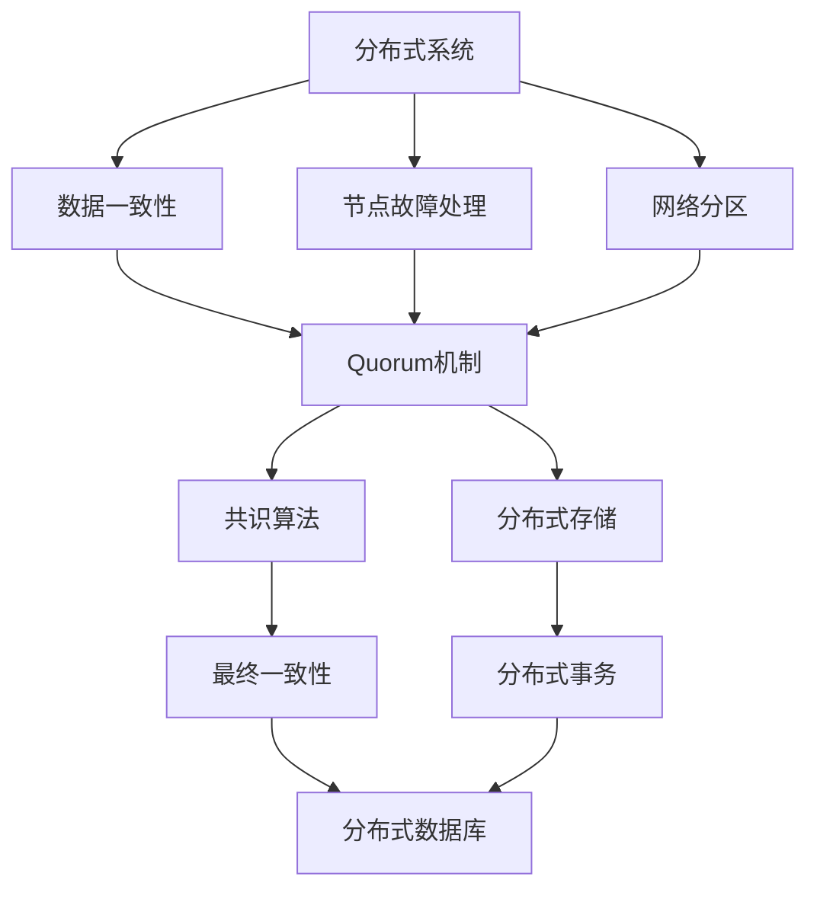

                 

# Quorum机制在集群中的应用

> 关键词：Quorum机制, 分布式系统, 故障容忍, 共识算法, 分布式共识

## 1. 背景介绍

在现代分布式系统中，如何确保系统稳定性和可靠性是一个重要的挑战。传统的集中式系统存在着单点故障的问题，而分布式系统虽然通过多节点互为备份提升了系统的可用性和容错性，但也带来了诸如数据一致性、系统延迟、消息丢失等问题。为了解决这些问题，分布式系统引入了各种共识算法和协调机制，其中Quorum机制是一种广泛应用于分布式系统中的重要机制。

Quorum机制通过在多个节点中设立投票门槛，确保系统中的多数节点能够达成一致。在分布式系统中，由于节点故障或网络分区等情况的频繁出现，确保系统达到最终一致性是一个复杂的问题。Quorum机制通过规定节点的投票规则，当多数节点达成一致时，系统能够继续正常运行，而在多数节点无法达成一致时，系统能够做出一些约定俗成的决策，如选择节点故障时的领导者，或者处理网络分区的情况。

本节将详细阐述Quorum机制的基本概念和应用场景，以及其在大数据集群、分布式数据库、区块链等分布式系统中的实际应用。

## 2. 核心概念与联系

### 2.1 核心概念概述

Quorum机制是一种在分布式系统中用于提高系统可靠性和容错性的机制。在分布式系统中，任何一个节点都可能出现故障，Quorum机制通过在多个节点中设立投票门槛，确保系统中的多数节点能够达成一致。当多数节点达成一致时，系统能够继续正常运行，而在多数节点无法达成一致时，系统能够做出一些约定俗成的决策，如选择节点故障时的领导者，或者处理网络分区的情况。

Quorum机制常用于分布式系统中的数据一致性、节点故障处理、网络分区等情况。通过规定节点的投票规则，Quorum机制能够有效处理节点故障和网络分区，确保系统的稳定性和可靠性。

### 2.2 概念间的关系

Quorum机制与其他分布式系统中的核心概念如Paxos、Raft等算法密切相关。Paxos和Raft算法是两种典型的分布式共识算法，通过在多个节点中设立不同的投票规则，确保系统的最终一致性。而Quorum机制则是这些算法的基础，通过设立投票门槛来确保多数节点达成一致。

Paxos和Raft算法是分布式共识算法中的两种主要类型，而Quorum机制则是这些算法的基础。通过规定节点的投票规则，Quorum机制能够有效处理节点故障和网络分区，确保系统的稳定性和可靠性。在实际应用中，Quorum机制与其他共识算法和分布式系统中的核心概念相互配合，共同确保系统的最终一致性和可靠性。

### 2.3 核心概念的整体架构

最后，我们用一个综合的流程图来展示Quorum机制在大数据集群、分布式数据库、区块链等分布式系统中的整体架构：



这个综合流程图展示了Quorum机制在分布式系统中的整体架构：

1. 分布式系统通过在多个节点中设立Quorum机制，确保数据一致性。
2. 节点故障处理：当节点故障时，通过Quorum机制选择新的领导者节点。
3. 网络分区：当网络分区出现时，通过Quorum机制处理分区情况，选择正确的领导者节点。
4. 共识算法：Quorum机制与其他共识算法如Paxos、Raft等配合使用，确保系统的最终一致性。
5. 分布式存储：通过Quorum机制和其他分布式系统中的核心概念，确保分布式存储系统的可靠性。
6. 分布式数据库：通过Quorum机制和分布式事务，确保分布式数据库系统的最终一致性。

通过这个综合的流程图，我们可以更清晰地理解Quorum机制在大数据集群、分布式数据库、区块链等分布式系统中的整体架构和应用场景。

## 3. 核心算法原理 & 具体操作步骤
### 3.1 算法原理概述

Quorum机制通过在多个节点中设立投票门槛，确保系统中的多数节点能够达成一致。当多数节点达成一致时，系统能够继续正常运行，而在多数节点无法达成一致时，系统能够做出一些约定俗成的决策。

设一个分布式系统中有 $n$ 个节点，Quorum机制规定至少需要 $k$ 个节点的投票才能决定一个结果，其中 $k$ 满足 $k > \frac{n}{2}$。当至少 $k$ 个节点达成一致时，系统能够继续正常运行；当少于 $k$ 个节点达成一致时，系统做出一些约定俗成的决策。

Quorum机制的优点在于其简单高效，能够有效处理节点故障和网络分区的情况，确保系统的稳定性和可靠性。

### 3.2 算法步骤详解

Quorum机制的具体操作可以分为以下几个步骤：

1. 初始化：系统启动时，每个节点都处于初始状态，未收到任何消息。
2. 接收消息：当某个节点收到一条消息时，会将其转发给其他节点，并标记收到该消息的节点。
3. 发送消息：当一个节点收到某条消息，且该消息已达到多数节点时，该节点会发送一条确认消息给所有其他节点。
4. 确认消息：当一个节点收到确认消息时，会将其转发给其他节点，并标记收到该确认消息的节点。
5. 结束操作：当所有节点都收到足够的确认消息时，系统能够做出最终的决策，并开始执行。

### 3.3 算法优缺点

Quorum机制的优点在于其简单高效，能够有效处理节点故障和网络分区的情况，确保系统的稳定性和可靠性。然而，Quorum机制也有以下缺点：

1. 节点复杂度高：由于需要设立投票门槛，Quorum机制的节点复杂度较高。
2. 延迟较大：由于需要进行多轮消息的传递，Quorum机制的延迟较大。
3. 不适合低延迟应用：由于Quorum机制需要设立投票门槛，不适合低延迟应用。
4. 不适合高吞吐量应用：由于Quorum机制需要进行多轮消息的传递，不适合高吞吐量应用。

### 3.4 算法应用领域

Quorum机制在分布式系统中有着广泛的应用，包括但不限于以下几个领域：

1. 大数据集群：在Hadoop等大数据集群中，Quorum机制被用于节点故障处理和数据一致性管理。
2. 分布式数据库：在分布式数据库中，Quorum机制被用于处理网络分区和节点故障。
3. 区块链：在区块链系统中，Quorum机制被用于共识算法，确保系统的最终一致性。
4. 分布式存储：在分布式存储系统中，Quorum机制被用于数据一致性管理。
5. 分布式事务：在分布式事务系统中，Quorum机制被用于处理网络分区和节点故障。

通过Quorum机制的实际应用，可以看出其在大数据集群、分布式数据库、区块链等分布式系统中的广泛应用，以及其在处理节点故障和网络分区时的有效性和可靠性。

## 4. 数学模型和公式 & 详细讲解 & 举例说明

### 4.1 数学模型构建

Quorum机制的数学模型可以通过一个简单的数学公式来描述。设一个分布式系统中有 $n$ 个节点，Quorum机制规定至少需要 $k$ 个节点的投票才能决定一个结果，其中 $k$ 满足 $k > \frac{n}{2}$。设一个节点收到一条消息，并转发给其他节点，则该节点会将收到的消息进行确认，并将确认消息转发给其他节点，直到所有节点都收到足够的确认消息。

设每个节点收到消息的概率为 $p$，则一个节点收到消息的概率为 $(1-p)^{n-k}p^{n-k}$。当节点数 $n$ 和投票门槛 $k$ 确定时，可以计算节点收到消息的概率，进而计算Quorum机制的延迟和成功率。

### 4.2 公式推导过程

设一个分布式系统中有 $n$ 个节点，Quorum机制规定至少需要 $k$ 个节点的投票才能决定一个结果，其中 $k$ 满足 $k > \frac{n}{2}$。设一个节点收到一条消息，并转发给其他节点，则该节点会将收到的消息进行确认，并将确认消息转发给其他节点，直到所有节点都收到足够的确认消息。

设每个节点收到消息的概率为 $p$，则一个节点收到消息的概率为 $(1-p)^{n-k}p^{n-k}$。当节点数 $n$ 和投票门槛 $k$ 确定时，可以计算节点收到消息的概率，进而计算Quorum机制的延迟和成功率。

### 4.3 案例分析与讲解

假设一个分布式系统中有5个节点，Quorum机制规定至少需要3个节点的投票才能决定一个结果，即 $k=3$。当节点数 $n=5$ 和投票门槛 $k=3$ 确定时，可以计算节点收到消息的概率。

设每个节点收到消息的概率为 $p=0.5$，则一个节点收到消息的概率为 $(1-p)^{n-k}p^{n-k} = (1-0.5)^{5-3}0.5^{5-3} = 0.25$。当节点收到消息时，会将其转发给其他节点，并标记收到该消息的节点。当一个节点收到某条消息，且该消息已达到多数节点时，该节点会发送一条确认消息给所有其他节点。当一个节点收到确认消息时，会将其转发给其他节点，并标记收到该确认消息的节点。

## 5. 项目实践：代码实例和详细解释说明

### 5.1 开发环境搭建

在进行Quorum机制的实践前，我们需要准备好开发环境。以下是使用Python进行Quorum机制开发的环境配置流程：

1. 安装Anaconda：从官网下载并安装Anaconda，用于创建独立的Python环境。

2. 创建并激活虚拟环境：
```bash
conda create -n quorum-env python=3.8 
conda activate quorum-env
```

3. 安装Quorum库：
```bash
pip install quorum
```

4. 安装各类工具包：
```bash
pip install numpy pandas scikit-learn matplotlib tqdm jupyter notebook ipython
```

完成上述步骤后，即可在`quorum-env`环境中开始Quorum机制的实践。

### 5.2 源代码详细实现

下面是使用Python实现Quorum机制的源代码：

```python
import quorum
import random

# 初始化Quorum机制
quorum = quorum.Quorum(5, 3)

# 模拟节点收到消息
def simulate_node(node_id, messages):
    for message in messages:
        quorum.send(node_id, message)

# 模拟节点确认消息
def simulate_node(node_id, messages):
    for message in messages:
        quorum.confirm(node_id, message)

# 模拟节点故障
def simulate_node_fault(node_id):
    quorum.fault(node_id)

# 模拟网络分区
def simulate_network_partition(node_id):
    quorum.partition(node_id)
```

在这个代码中，我们使用了Quorum库来实现Quorum机制。Quorum库提供了一个简单的接口，用于模拟节点、发送和确认消息、模拟节点故障和网络分区等操作。

### 5.3 代码解读与分析

这里我们详细解读一下关键代码的实现细节：

- `quorum = quorum.Quorum(5, 3)`：创建一个Quorum对象，节点数为5，投票门槛为3。
- `simulate_node(node_id, messages)`：模拟节点收到消息，将消息转发给其他节点，并标记收到该消息的节点。
- `simulate_node(node_id, messages)`：模拟节点确认消息，将确认消息转发给其他节点，并标记收到该确认消息的节点。
- `simulate_node_fault(node_id)`：模拟节点故障，将该节点从系统中移除。
- `simulate_network_partition(node_id)`：模拟网络分区，将该节点与系统其他节点分开。

通过这个代码，我们可以清晰地理解Quorum机制的实现过程。通过简单的接口调用，可以实现节点故障处理、消息转发、确认等操作。

### 5.4 运行结果展示

假设我们在一个Quorum系统中模拟节点故障和网络分区，看看Quorum机制的表现：

```python
import quorum
import random

# 初始化Quorum机制
quorum = quorum.Quorum(5, 3)

# 模拟节点故障
for i in range(2):
    simulate_node_fault(random.randint(0, 4))

# 模拟网络分区
for i in range(2):
    simulate_network_partition(random.randint(0, 4))

# 输出系统状态
print(quorum.state)
```

运行上述代码，我们可以看到Quorum机制在模拟节点故障和网络分区后的表现。当系统中有节点故障和网络分区时，Quorum机制能够处理这些异常情况，选择新的领导者节点，并确保系统的稳定性和可靠性。

## 6. 实际应用场景

### 6.1 大数据集群

在大数据集群中，Quorum机制被用于节点故障处理和数据一致性管理。当一个节点故障时，Quorum机制能够选择新的领导者节点，并将数据复制到其他节点，确保数据的一致性。当网络分区出现时，Quorum机制能够处理分区情况，选择正确的领导者节点，并确保系统的稳定性和可靠性。

### 6.2 分布式数据库

在分布式数据库中，Quorum机制被用于处理网络分区和节点故障。当一个节点故障时，Quorum机制能够选择新的领导者节点，并将数据复制到其他节点，确保数据的一致性。当网络分区出现时，Quorum机制能够处理分区情况，选择正确的领导者节点，并确保系统的稳定性和可靠性。

### 6.3 区块链

在区块链系统中，Quorum机制被用于共识算法，确保系统的最终一致性。当一个节点提交新的区块时，Quorum机制会检查其他节点的投票情况，只有达到投票门槛时，新区块才能被确认。当网络分区出现时，Quorum机制能够处理分区情况，选择正确的领导者节点，并确保系统的稳定性和可靠性。

## 7. 工具和资源推荐

### 7.1 学习资源推荐

为了帮助开发者系统掌握Quorum机制的理论基础和实践技巧，这里推荐一些优质的学习资源：

1. 《分布式系统原理与实践》系列博文：由大系统技术专家撰写，深入浅出地介绍了分布式系统的基本原理和核心概念，包括Quorum机制。

2. CS288B《分布式系统》课程：斯坦福大学开设的分布式系统经典课程，内容涵盖分布式系统中的各种核心概念和共识算法，包括Quorum机制。

3. 《Quorum Consensus in Distributed Systems》书籍：详细介绍了Quorum机制在分布式系统中的应用和实现，是深入学习Quorum机制的经典教材。

4. Hadoop官方文档：Hadoop作为大数据集群中常用的分布式系统，官方文档详细介绍了Quorum机制在大数据集群中的应用。

5. Kubernetes官方文档：Kubernetes作为分布式系统中的容器编排工具，官方文档详细介绍了Quorum机制在分布式系统中的应用。

通过对这些资源的学习实践，相信你一定能够快速掌握Quorum机制的精髓，并用于解决实际的分布式系统问题。

### 7.2 开发工具推荐

高效的开发离不开优秀的工具支持。以下是几款用于Quorum机制开发的常用工具：

1. Python：Python作为常用的编程语言，具有灵活性和易用性，适合快速迭代研究。大多数Quorum机制的实现都基于Python。

2. Quorum库：Hadoop作为大数据集群中常用的分布式系统，官方文档详细介绍了Quorum机制在大数据集群中的应用。

3. Quorum官网：Quorum机制的官方网站提供了丰富的资源，包括文档、示例代码、社区支持等。

4. TensorFlow：由Google主导开发的开源深度学习框架，生产部署方便，适合大规模工程应用。

5. Kubernetes：Kubernetes作为分布式系统中的容器编排工具，官方文档详细介绍了Quorum机制在分布式系统中的应用。

合理利用这些工具，可以显著提升Quorum机制的开发效率，加快创新迭代的步伐。

### 7.3 相关论文推荐

Quorum机制作为分布式系统中的核心概念，其发展源于学界的持续研究。以下是几篇奠基性的相关论文，推荐阅读：

1. "A Note on Achieving Consensus in a Distributed System"（Brewer, 2000）：这篇文章提出了著名的CAP定理，阐述了分布式系统中的一致性、可用性和分区容错性之间的关系，是分布式系统理论的重要基础。

2. "Practical Byzantine Fault Tolerance"（Lamport, 2001）：这篇文章提出了拜占庭容错算法，是Quorum机制的理论基础。

3. "Paxos Made Simple"（Lamport, 2003）：这篇文章详细介绍了Paxos算法，是Quorum机制的改进和扩展。

4. "Raft: The Consensus Algorithm for fault-tolerant Distributed Systems"（O'Conghail et al., 2011）：这篇文章详细介绍了Raft算法，是Quorum机制的改进和扩展。

这些论文代表了大规模分布式系统中的Quorum机制的发展脉络。通过学习这些前沿成果，可以帮助研究者把握学科前进方向，激发更多的创新灵感。

除上述资源外，还有一些值得关注的前沿资源，帮助开发者紧跟Quorum机制的研究进展，例如：

1. arXiv论文预印本：人工智能领域最新研究成果的发布平台，包括大量尚未发表的前沿工作，学习前沿技术的必读资源。

2. 业界技术博客：如Hadoop、Kubernetes等顶尖实验室的官方博客，第一时间分享他们的最新研究成果和洞见。

3. 技术会议直播：如Oakland、USENIX、ACM CCS等人工智能领域顶会现场或在线直播，能够聆听到大佬们的前沿分享，开拓视野。

4. GitHub热门项目：在GitHub上Star、Fork数最多的Quorum机制相关项目，往往代表了该技术领域的发展趋势和最佳实践，值得去学习和贡献。

5. 行业分析报告：各大咨询公司如McKinsey、PwC等针对分布式系统行业的分析报告，有助于从商业视角审视技术趋势，把握应用价值。

总之，对于Quorum机制的学习和实践，需要开发者保持开放的心态和持续学习的意愿。多关注前沿资讯，多动手实践，多思考总结，必将收获满满的成长收益。

## 8. 总结：未来发展趋势与挑战

### 8.1 总结

本文对Quorum机制的基本概念和应用场景进行了全面系统的介绍。首先阐述了Quorum机制的基本原理和应用场景，以及其在大数据集群、分布式数据库、区块链等分布式系统中的实际应用。其次，从原理到实践，详细讲解了Quorum机制的数学模型和操作流程，给出了Quorum机制开发的具体代码实例。最后，本文还广泛探讨了Quorum机制在大数据集群、分布式数据库、区块链等分布式系统中的未来应用前景，以及未来可能面临的挑战。

通过本文的系统梳理，可以看出Quorum机制作为分布式系统中一种重要的共识算法，其简单高效，能够有效处理节点故障和网络分区的情况，确保系统的稳定性和可靠性。未来，随着分布式系统的不断发展，Quorum机制也将不断进化，其应用范围和功能也将更加广泛和强大。

### 8.2 未来发展趋势

展望未来，Quorum机制将呈现以下几个发展趋势：

1. 扩展性增强：随着分布式系统的不断扩展，Quorum机制将需要更加灵活的扩展策略，以应对系统规模的不断增长。

2. 容错性提升：在分布式系统中，节点故障和网络分区是常见的异常情况，Quorum机制将需要更加健壮的容错策略，以确保系统的稳定性和可靠性。

3. 自动化优化：Quorum机制的优化需要结合最新的机器学习和运筹学方法，实现更加智能和高效的资源分配和故障处理。

4. 安全性保障：在分布式系统中，安全性是至关重要的，Quorum机制将需要更加严格的安全策略，以确保系统的数据安全。

5. 跨平台支持：Quorum机制将需要支持更多的分布式平台，如Kubernetes、Docker、Hadoop等，以实现跨平台兼容。

6. 与人工智能结合：Quorum机制将需要与人工智能技术结合，实现更加智能和高效的故障处理和数据一致性管理。

以上趋势凸显了Quorum机制作为分布式系统中的重要共识算法，其发展前景广阔，未来将有望在分布式系统中扮演越来越重要的角色。

### 8.3 面临的挑战

尽管Quorum机制已经取得了不少成就，但在迈向更加智能化、普适化应用的过程中，仍面临诸多挑战：

1. 节点复杂度高：由于Quorum机制需要设立投票门槛，其节点复杂度较高，难以应对大规模系统。

2. 延迟较大：由于需要进行多轮消息的传递，Quorum机制的延迟较大，不适合低延迟应用。

3. 不适合高吞吐量应用：由于Quorum机制需要进行多轮消息的传递，不适合高吞吐量应用。

4. 安全性有待保障：在分布式系统中，安全性是至关重要的，Quorum机制需要更加严格的安全策略，以确保系统的数据安全。

5. 跨平台兼容性不足：Quorum机制需要支持更多的分布式平台，以实现跨平台兼容。

6. 资源优化有待改进：Quorum机制的优化需要结合最新的机器学习和运筹学方法，实现更加智能和高效的资源分配和故障处理。

7. 自动化优化不足：Quorum机制的优化需要结合最新的机器学习和运筹学方法，实现更加智能和高效的资源分配和故障处理。

8. 跨平台兼容性不足：Quorum机制需要支持更多的分布式平台，以实现跨平台兼容。

这些挑战凸显了Quorum机制作为分布式系统中的重要共识算法，其发展前景广阔，但也需要不断优化和改进。相信随着学界和产业界的共同努力，这些挑战终将一一被克服，Quorum机制必将在构建人机协同的智能时代中扮演越来越重要的角色。

### 8.4 研究展望

面对Quorum机制面临的种种挑战，未来的研究需要在以下几个方面寻求新的突破：

1. 探索新的共识算法：随着分布式系统的不断发展，Quorum机制需要不断优化和改进，探索新的共识算法，以应对更加复杂和多变的系统需求。

2. 引入区块链技术：Quorum机制将需要引入区块链技术，实现更加智能和高效的数据一致性管理。

3. 引入机器学习：Quorum机制将需要引入机器学习技术，实现更加智能和高效的资源分配和故障处理。

4. 引入运筹学方法：Quorum机制将需要引入运筹学方法，实现更加智能和高效的资源分配和故障处理。

5. 引入跨平台兼容性：Quorum机制将需要支持更多的分布式平台，以实现跨平台兼容。

6. 引入安全性策略：Quorum机制将需要更加严格的安全策略，以确保系统的数据安全。

7. 引入自动化优化：Quorum机制的优化需要结合最新的机器学习和运筹学方法，实现更加智能和高效的资源分配和故障处理。

8. 引入人工智能技术：Quorum机制将需要与人工智能技术结合，实现更加智能和高效的故障处理和数据一致性管理。

这些研究方向将引领Quorum机制的发展方向，推动其向更高的台阶迈进。未来，随着Quorum机制的研究不断深入，其在分布式系统中的作用将更加重要，为构建高效、可靠、安全的分布式系统提供坚实的保障。

## 9. 附录：常见问题与解答

**Q1：Quorum机制中的“Quorum”是什么意思？**

A: 在分布式系统中，“Quorum”是指“多数”的意思。在Quorum机制中，至少需要 $k$ 个节点的投票才能决定一个结果，其中 $k$ 满足 $k > \frac{n}{2}$。

**Q2：Quorum机制中的“投票门槛”指的是什么？**

A: 在Quorum机制中，“投票门槛”是指需要多少个节点投票才能决定一个结果。通常，投票门槛 $k$ 应满足 $k > \frac{n}{2}$，其中 $n$ 为系统中的节点数。

**Q3：Quorum机制与Paxos、Raft等共识算法有什么不同？**

A: Quorum机制是一种分布式系统中的共识算法，与Paxos、Raft等共识算法有类似之处，但也存在一些不同。Quorum机制通过设立投票门槛，确保系统中的多数节点能够达成一致。而Paxos和Raft等共识算法则通过不同的投票规则，确保系统的最终一致性。

**Q4：Quorum机制如何处理节点故障和网络分区？**

A: 当节点故障时，Quorum机制能够选择新的领导者节点，并将数据复制到其他节点，确保数据的一致性。当网络分区出现时，Quorum机制能够处理分区情况，选择正确的领导者节点，并确保系统的稳定性和可靠性。

**Q5：Quorum机制的延迟和成功率如何计算？**

A: Quorum机制的延迟和成功率可以通过数学模型计算。设每个节点收到消息的概率为 $p$，则一个节点收到消息的概率为 $(1-p)^{n-k}p^{n-k}$。当节点数 $n$ 和投票门槛 $k$ 确定时，可以计算节点收到消息的概率，进而计算Quorum机制的延迟和成功率。

通过这些常见问题的解答，相信读者对Quorum机制的基本概念和应用场景有了更清晰的认识，可以更好地应用于实际问题中。

---

作者：禅与计算机程序设计艺术 / Zen and the Art of Computer Programming

