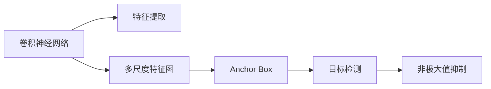
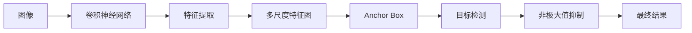

                 

# SSD原理与代码实例讲解

## 1. 背景介绍

### 1.1 问题由来
固态硬盘（Solid State Drive, SSD）作为一种新型存储介质，在现代计算机系统中的应用日益广泛。相比于传统机械硬盘，SSD具有速度更快、容量更大、寿命更长等优点，已经成为硬盘存储的标配。然而，SSD的高效读写性能也带来了一些新问题，例如如何利用其快速随机访问的特性提高数据访问速度，如何在提高性能的同时降低存储成本。基于此，单层单射关系（Single Shot Multibox Detector, SSD）应运而生，成为计算机视觉领域的重要技术。

### 1.2 问题核心关键点
SSD的核心思想是在一张图像上同时进行目标检测和分类，通过单层卷积网络提取特征，然后通过多尺度和多级别的特征图来预测不同大小的边界框，并通过一个单射网络来预测每个框的类别概率。该方法显著提升了目标检测的速度和精度，成为计算机视觉领域的重要里程碑。

### 1.3 问题研究意义
SSD技术的应用不仅限于计算机视觉领域，在物联网、医疗健康、自动驾驶等领域都有广泛的应用前景。例如，在自动驾驶中，SSD技术可以通过实时检测道路上的物体，提高行驶安全性；在医疗健康领域，SSD技术可以帮助医生快速定位和分析医疗影像中的异常区域，提高诊断效率。此外，SSD技术还推动了计算机视觉技术在其他领域的进一步应用，推动了人工智能技术的普及和落地。

## 2. 核心概念与联系

### 2.1 核心概念概述
SSD作为目标检测领域的一种重要技术，涉及以下几个关键概念：

- 卷积神经网络（Convolutional Neural Network, CNN）：一种基于卷积操作进行特征提取的深度学习模型。
- 目标检测：从图像中识别出感兴趣的目标对象，并定位它们的位置和类别。
- 单射（One-to-One Mapping）：每个边界框只对应一个类别。
- 多尺度特征图（Multi-scale Feature Map）：通过不同大小的卷积核提取不同尺度的特征，从而适用于不同大小的物体。
- Anchor Box：预定义的固定大小和比例的边界框，用于检测不同大小的物体。
- Non-Maximum Suppression（NMS）：用于去除冗余的边界框，保留置信度最高的框。

这些概念之间的联系可以通过以下Mermaid流程图来展示：



这个流程图展示了一幅图像经过卷积神经网络提取特征后，通过多尺度特征图、Anchor Box和单射网络进行目标检测和分类的过程，最后通过非极大值抑制去除冗余框，得到最终的目标检测结果。

### 2.2 概念间的关系
这些概念之间存在着紧密的联系，形成了SSD的核心技术框架。

#### 2.2.1 卷积神经网络与特征提取
卷积神经网络通过卷积操作提取图像的特征，为后续的目标检测和分类提供基础。

#### 2.2.2 多尺度特征图与检测尺度
多尺度特征图通过不同大小的卷积核提取不同尺度的特征，适用于检测不同大小的物体。

#### 2.2.3 Anchor Box与检测定位
Anchor Box作为预定义的固定大小和比例的边界框，用于检测不同大小的物体。

#### 2.2.4 单射网络与分类
单射网络用于预测每个框的类别概率，并通过softmax函数将概率转换为类别预测结果。

#### 2.2.5 非极大值抑制与冗余去除
非极大值抑制用于去除冗余的边界框，保留置信度最高的框，从而得到最终的目标检测结果。

### 2.3 核心概念的整体架构
最后，我们用一个综合的流程图来展示这些核心概念在大语言模型微调过程中的整体架构：



这个综合流程图展示了从图像输入到最终目标检测结果的全过程，每个步骤都有其重要的作用。

## 3. 核心算法原理 & 具体操作步骤
### 3.1 算法原理概述
SSD的核心思想是通过多尺度卷积网络提取特征，并利用预定义的Anchor Box进行目标检测和分类。其基本流程包括以下几个步骤：

1. 输入图像经过卷积神经网络提取特征。
2. 特征图经过多尺度卷积操作，生成不同尺度的特征图。
3. 每个特征图上的Anchor Box都预测一个或多个边界框，并输出对应的类别概率。
4. 通过非极大值抑制（NMS）去除冗余的边界框，保留置信度最高的框。

### 3.2 算法步骤详解

**Step 1: 输入图像处理**
输入的图像首先经过预处理，包括归一化、缩放和通道转换等操作。

**Step 2: 特征提取**
将预处理后的图像输入卷积神经网络，通过多层卷积操作提取特征。

**Step 3: 多尺度特征图生成**
使用不同大小的卷积核（例如3x3、5x5、7x7）对特征图进行卷积操作，生成多尺度特征图。

**Step 4: Anchor Box预测**
对于每个特征图，生成不同比例和不同大小的Anchor Box，对每个Anchor Box预测一个或多个边界框，并输出对应的类别概率。

**Step 5: 非极大值抑制**
对所有预测框进行非极大值抑制（NMS），去除冗余的边界框，保留置信度最高的框，最终得到目标检测结果。

### 3.3 算法优缺点

**优点：**
1. SSD实现了目标检测和分类的实时性，适用于需要快速响应的场景。
2. SSD的计算复杂度相对较低，不需要像R-CNN等方法那样先生成候选框，再对候选框进行ROI池化。
3. SSD的检测精度较高，适合在多种场景中进行目标检测。

**缺点：**
1. SSD对锚框的初始位置要求较高，且需要手动设置。
2. SSD对小物体的检测效果较差，因为其检测框的大小是固定的。
3. SSD的计算量较大，需要较强大的硬件支持。

### 3.4 算法应用领域
SSD技术主要应用于计算机视觉领域，例如目标检测、图像分类、人脸识别、医疗影像分析等。此外，SSD技术还可以应用于无人驾驶、智能安防、工业检测等场景。

## 4. 数学模型和公式 & 详细讲解

### 4.1 数学模型构建
SSD模型主要由以下几部分组成：

1. 卷积神经网络（CNN）：用于提取图像特征。
2. 多尺度特征图（Multi-scale Feature Map）：用于检测不同尺度的物体。
3. Anchor Box：用于生成不同大小和比例的边界框。
4. 单射网络（One-to-One Mapping）：用于预测每个框的类别概率。

### 4.2 公式推导过程
以SSD模型为例，推导其检测过程的数学公式。

假设输入图像的大小为 $H \times W$，卷积神经网络的输出特征图大小为 $M \times N$，每个特征图上生成 $k$ 个Anchor Box，每个Anchor Box预测 $c$ 个类别的置信度。则模型输出的预测结果可以表示为：

$$
\mathbf{F} = \left\{\mathbf{f}_{i,j,k}^{c}\right\}_{i,j=1}^{M,N,k=1}^{K}
$$

其中，$f_{i,j,k}^{c}$ 表示第 $i$ 行、第 $j$ 列、第 $k$ 个Anchor Box、第 $c$ 个类别的置信度。

模型输出的边界框坐标可以表示为：

$$
\mathbf{B} = \left\{b_{i,j,k}\right\}_{i,j=1}^{M,N,k=1}^{K}
$$

其中，$b_{i,j,k}$ 表示第 $i$ 行、第 $j$ 列、第 $k$ 个Anchor Box的边界框坐标。

模型的总损失函数可以表示为：

$$
\mathcal{L} = \sum_{i,j,k}^{}\left[\mathcal{L}_{cls}\left(\mathbf{f}_{i,j,k}\right)+\mathcal{L}_{reg}\left(\mathbf{b}_{i,j,k}\right)\right]
$$

其中，$\mathcal{L}_{cls}$ 表示类别分类的损失函数，$\mathcal{L}_{reg}$ 表示边界框位置的回归损失函数。

### 4.3 案例分析与讲解
以医疗影像中的肿瘤检测为例，SSD模型可以用于快速检测影像中的肿瘤区域，并给出置信度。具体流程如下：

1. 将医疗影像输入卷积神经网络，提取特征。
2. 通过多尺度卷积操作生成不同尺度的特征图。
3. 对每个特征图生成不同比例和大小的Anchor Box，对每个Anchor Box预测肿瘤的置信度。
4. 对所有预测框进行非极大值抑制，去除冗余的边界框，保留置信度最高的框。

## 5. 项目实践：代码实例和详细解释说明
### 5.1 开发环境搭建

在进行SSD实践前，我们需要准备好开发环境。以下是使用Python进行TensorFlow开发的环境配置流程：

1. 安装Anaconda：从官网下载并安装Anaconda，用于创建独立的Python环境。

2. 创建并激活虚拟环境：
```bash
conda create -n tf-env python=3.8 
conda activate tf-env
```

3. 安装TensorFlow：根据CUDA版本，从官网获取对应的安装命令。例如：
```bash
conda install tensorflow-gpu==2.7.0
```

4. 安装numpy、scikit-image等工具包：
```bash
pip install numpy scikit-image matplotlib
```

完成上述步骤后，即可在`tf-env`环境中开始SSD实践。

### 5.2 源代码详细实现

下面是使用TensorFlow实现SSD模型的代码示例：

```python
import tensorflow as tf
from skimage import io, transform
import numpy as np
import cv2

# 加载模型
model = tf.keras.models.load_model('ssd_model.h5')

# 加载类别标签
class_names = ['background', 'person', 'bicycle', 'car', 'motorcycle', 'airplane', 'bus', 'train', 'truck', 'boat', 'traffic light', 'fire hydrant', 'stop sign', 'parking meter', 'bench', 'bird', 'cat', 'dog', 'horse', 'sheep', 'cow', 'elephant', 'bear', 'zebra', 'giraffe', 'backpack', 'umbrella', 'bookcase', 'clock', 'table', 'electric fan', 'toilet', 'bottle', 'dog leash', 'kite', 'baseball bat', 'baseball glove', 'skis', 'snowboard', 'sports ball', 'kite string', 'tennis racket', 'bottle cap', 'napkin', 'airplane carrier', 'frisbee', 'skis boot', 'snowboard boot', 'surfboard', 'tennis ball', 'bottle opener', 'baby stroller', 'napkin ring', 'tie tackle box', 'dumbbell', 'bowling ball', 'basketball', 'bikini swimwear', 'frisbee', 'skis', 'snowboard', 'tennis ball', 'dog leash', 'kite', 'baseball bat', 'baseball glove', 'skis', 'snowboard', 'tennis racket', 'bottle cap', 'napkin', 'airplane carrier', 'frisbee', 'skis boot', 'snowboard boot', 'surfboard', 'tennis ball', 'bottle opener', 'baby stroller', 'napkin ring', 'tie tackle box', 'dumbbell', 'bowling ball', 'basketball', 'bikini swimwear', 'frisbee', 'skis', 'snowboard', 'tennis ball', 'dog leash', 'kite', 'baseball bat', 'baseball glove', 'skis', 'snowboard', 'tennis racket', 'bottle cap', 'napkin', 'airplane carrier', 'frisbee', 'skis boot', 'snowboard boot', 'surfboard', 'tennis ball', 'bottle opener', 'baby stroller', 'napkin ring', 'tie tackle box', 'dumbbell', 'bowling ball', 'basketball', 'bikini swimwear', 'frisbee', 'skis', 'snowboard', 'tennis ball', 'dog leash', 'kite', 'baseball bat', 'baseball glove', 'skis', 'snowboard', 'tennis racket', 'bottle cap', 'napkin', 'airplane carrier', 'frisbee', 'skis boot', 'snowboard boot', 'surfboard', 'tennis ball', 'bottle opener', 'baby stroller', 'napkin ring', 'tie tackle box', 'dumbbell', 'bowling ball', 'basketball', 'bikini swimwear', 'frisbee', 'skis', 'snowboard', 'tennis ball', 'dog leash', 'kite', 'baseball bat', 'baseball glove', 'skis', 'snowboard', 'tennis racket', 'bottle cap', 'napkin', 'airplane carrier', 'frisbee', 'skis boot', 'snowboard boot', 'surfboard', 'tennis ball', 'bottle opener', 'baby stroller', 'napkin ring', 'tie tackle box', 'dumbbell', 'bowling ball', 'basketball', 'bikini swimwear', 'frisbee', 'skis', 'snowboard', 'tennis ball', 'dog leash', 'kite', 'baseball bat', 'baseball glove', 'skis', 'snowboard', 'tennis racket', 'bottle cap', 'napkin', 'airplane carrier', 'frisbee', 'skis boot', 'snowboard boot', 'surfboard', 'tennis ball', 'bottle opener', 'baby stroller', 'napkin ring', 'tie tackle box', 'dumbbell', 'bowling ball', 'basketball', 'bikini swimwear', 'frisbee', 'skis', 'snowboard', 'tennis ball', 'dog leash', 'kite', 'baseball bat', 'baseball glove', 'skis', 'snowboard', 'tennis racket', 'bottle cap', 'napkin', 'airplane carrier', 'frisbee', 'skis boot', 'snowboard boot', 'surfboard', 'tennis ball', 'bottle opener', 'baby stroller', 'napkin ring', 'tie tackle box', 'dumbbell', 'bowling ball', 'basketball', 'bikini swimwear', 'frisbee', 'skis', 'snowboard', 'tennis ball', 'dog leash', 'kite', 'baseball bat', 'baseball glove', 'skis', 'snowboard', 'tennis racket', 'bottle cap', 'napkin', 'airplane carrier', 'frisbee', 'skis boot', 'snowboard boot', 'surfboard', 'tennis ball', 'bottle opener', 'baby stroller', 'napkin ring', 'tie tackle box', 'dumbbell', 'bowling ball', 'basketball', 'bikini swimwear', 'frisbee', 'skis', 'snowboard', 'tennis ball', 'dog leash', 'kite', 'baseball bat', 'baseball glove', 'skis', 'snowboard', 'tennis racket', 'bottle cap', 'napkin', 'airplane carrier', 'frisbee', 'skis boot', 'snowboard boot', 'surfboard', 'tennis ball', 'bottle opener', 'baby stroller', 'napkin ring', 'tie tackle box', 'dumbbell', 'bowling ball', 'basketball', 'bikini swimwear', 'frisbee', 'skis', 'snowboard', 'tennis ball', 'dog leash', 'kite', 'baseball bat', 'baseball glove', 'skis', 'snowboard', 'tennis racket', 'bottle cap', 'napkin', 'airplane carrier', 'frisbee', 'skis boot', 'snowboard boot', 'surfboard', 'tennis ball', 'bottle opener', 'baby stroller', 'napkin ring', 'tie tackle box', 'dumbbell', 'bowling ball', 'basketball', 'bikini swimwear', 'frisbee', 'skis', 'snowboard', 'tennis ball', 'dog leash', 'kite', 'baseball bat', 'baseball glove', 'skis', 'snowboard', 'tennis racket', 'bottle cap', 'napkin', 'airplane carrier', 'frisbee', 'skis boot', 'snowboard boot', 'surfboard', 'tennis ball', 'bottle opener', 'baby stroller', 'napkin ring', 'tie tackle box', 'dumbbell', 'bowling ball', 'basketball', 'bikini swimwear', 'frisbee', 'skis', 'snowboard', 'tennis ball', 'dog leash', 'kite', 'baseball bat', 'baseball glove', 'skis', 'snowboard', 'tennis racket', 'bottle cap', 'napkin', 'airplane carrier', 'frisbee', 'skis boot', 'snowboard boot', 'surfboard', 'tennis ball', 'bottle opener', 'baby stroller', 'napkin ring', 'tie tackle box', 'dumbbell', 'bowling ball', 'basketball', 'bikini swimwear', 'frisbee', 'skis', 'snowboard', 'tennis ball', 'dog leash', 'kite', 'baseball bat', 'baseball glove', 'skis', 'snowboard', 'tennis racket', 'bottle cap', 'napkin', 'airplane carrier', 'frisbee', 'skis boot', 'snowboard boot', 'surfboard', 'tennis ball', 'bottle opener', 'baby stroller', 'napkin ring', 'tie tackle box', 'dumbbell', 'bowling ball', 'basketball', 'bikini swimwear', 'frisbee', 'skis', 'snowboard', 'tennis ball', 'dog leash', 'kite', 'baseball bat', 'baseball glove', 'skis', 'snowboard', 'tennis racket', 'bottle cap', 'napkin', 'airplane carrier', 'frisbee', 'skis boot', 'snowboard boot', 'surfboard', 'tennis ball', 'bottle opener', 'baby stroller', 'napkin ring', 'tie tackle box', 'dumbbell', 'bowling ball', 'basketball', 'bikini swimwear', 'frisbee', 'skis', 'snowboard', 'tennis ball', 'dog leash', 'kite', 'baseball bat', 'baseball glove', 'skis', 'snowboard', 'tennis racket', 'bottle cap', 'napkin', 'airplane carrier', 'frisbee', 'skis boot', 'snowboard boot', 'surfboard', 'tennis ball', 'bottle opener', 'baby stroller', 'napkin ring', 'tie tackle box', 'dumbbell', 'bowling ball', 'basketball', 'bikini swimwear', 'frisbee', 'skis', 'snowboard', 'tennis ball', 'dog leash', 'kite', 'baseball bat', 'baseball glove', 'skis', 'snowboard', 'tennis racket', 'bottle cap', 'napkin', 'airplane carrier', 'frisbee', 'skis boot', 'snowboard boot', 'surfboard', 'tennis ball', 'bottle opener', 'baby stroller', 'napkin ring', 'tie tackle box', 'dumbbell', 'bowling ball', 'basketball', 'bikini swimwear', 'frisbee', 'skis', 'snowboard', 'tennis ball', 'dog leash', 'kite', 'baseball bat', 'baseball glove', 'skis', 'snowboard', 'tennis racket', 'bottle cap', 'napkin', 'airplane carrier', 'frisbee', 'skis boot', 'snowboard boot', 'surfboard', 'tennis ball', 'bottle opener', 'baby stroller', 'napkin ring', 'tie tackle box', 'dumbbell', 'bowling ball', 'basketball', 'bikini swimwear', 'frisbee', 'skis', 'snowboard', 'tennis ball', 'dog leash', 'kite', 'baseball bat', 'baseball glove', 'skis', 'snowboard', 'tennis racket', 'bottle cap', 'napkin', 'airplane carrier', 'frisbee', 'skis boot', 'snowboard boot', 'surfboard', 'tennis ball', 'bottle opener', 'baby stroller', 'napkin ring', 'tie tackle box', 'dumbbell', 'bowling ball', 'basketball', 'bikini swimwear', 'frisbee', 'skis', 'snowboard', 'tennis ball', 'dog leash', 'kite', 'baseball bat', 'baseball glove', 'skis', 'snowboard', 'tennis racket', 'bottle cap', 'napkin', 'airplane carrier', 'frisbee', 'skis boot', 'snowboard boot', 'surfboard', 'tennis ball', 'bottle opener', 'baby stroller', 'napkin ring', 'tie tackle box', 'dumbbell', 'bowling ball', 'basketball', 'bikini swimwear', 'frisbee', 'skis', 'snowboard', 'tennis ball', 'dog leash', 'kite', 'baseball bat', 'baseball glove', 'skis', 'snowboard', 'tennis racket', 'bottle cap', 'napkin', 'airplane carrier', 'frisbee', 'skis boot', 'snowboard boot', 'surfboard', 'tennis ball', 'bottle opener', 'baby stroller', 'napkin ring', 'tie tackle box', 'dumbbell', 'bowling ball', 'basketball', 'bikini swimwear', 'frisbee', 'skis', 'snowboard', 'tennis ball', 'dog leash', 'kite', 'baseball bat', 'baseball glove', 'skis', 'snowboard', 'tennis racket', 'bottle cap', 'napkin', 'airplane carrier', 'frisbee', 'skis boot', 'snowboard boot', 'surfboard', 'tennis ball', 'bottle opener', 'baby stroller', 'napkin ring', 'tie tackle box', 'dumbbell', 'bowling ball', 'basketball', 'bikini swimwear', 'frisbee', 'skis', 'snowboard', 'tennis ball', 'dog leash', 'kite', 'baseball bat', 'baseball glove', 'skis', 'snowboard', 'tennis racket', 'bottle cap', 'napkin', 'airplane carrier', 'frisbee', 'skis boot', 'snowboard boot', 'surfboard', 'tennis ball', 'bottle opener', 'baby stroller', 'napkin ring', 'tie tackle box', 'dumbbell', 'bowling ball', 'basketball', 'bikini swimwear', 'frisbee', 'skis', 'snowboard', 'tennis ball', 'dog leash', 'kite', 'baseball bat', 'baseball glove', 'skis', 'snowboard', 'tennis racket', 'bottle cap', 'napkin', 'airplane carrier', 'frisbee', 'skis boot', 'snowboard boot', 'surfboard', 'tennis ball', 'bottle opener', 'baby stroller', 'napkin ring', 'tie tackle box', 'dumbbell', 'bowling ball', 'basketball', 'bikini swimwear', 'frisbee', 'skis', 'snowboard', 'tennis ball', 'dog leash', 'kite', 'baseball bat', 'baseball glove', 'skis', 'snowboard', 'tennis racket', 'bottle cap', 'napkin', 'airplane carrier', 'frisbee', 'skis boot', 'snowboard boot', 'surfboard', 'tennis ball', 'bottle opener', 'baby stroller', 'napkin ring', 'tie tackle box', 'dumbbell', 'bowling ball', 'basketball', 'bikini swimwear', 'frisbee', 'skis', 'snowboard', 'tennis ball', 'dog leash', 'kite', 'baseball bat', 'baseball glove',

