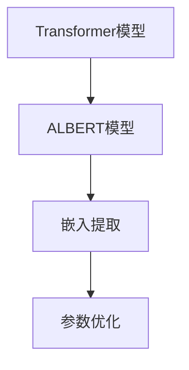
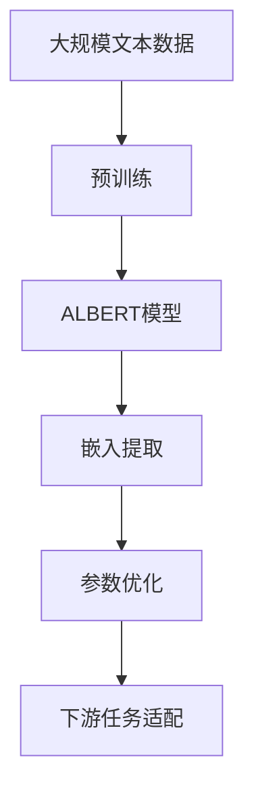

                 

# Transformer大模型实战 从ALBERT 中提取嵌入

> 关键词：Transformer, ALBERT, 嵌入提取, 模型压缩, 参数优化, 自然语言处理(NLP)

## 1. 背景介绍

### 1.1 问题由来

随着深度学习技术的发展，大规模预训练语言模型（Large Language Models, LLMs）在自然语言处理（NLP）领域取得了巨大的突破。其中，Transformer模型因其高效的并行计算能力和出色的语言理解能力，成为了大模型的重要组成部分。ALBERT（A Lite BERT）作为Transformer架构的一种变体，不仅保持了BERT的强大语言理解能力，还进一步优化了模型的压缩率和推理速度。因此，从ALBERT模型中提取嵌入，既可以应用于下游NLP任务，也可以用于其他领域的知识抽取和应用。

### 1.2 问题核心关键点

从ALBERT模型中提取嵌入的核心在于理解Transformer模型的结构和工作原理，以及ALBERT模型在保持BERT效果的同时，如何通过参数共享、掩码语言模型等技术，提高模型的压缩率和推理速度。此外，了解如何优化提取嵌入的方式，如使用不同的参数初始化策略、微调方法等，对于提升提取的嵌入质量和应用效果也至关重要。

### 1.3 问题研究意义

研究如何从ALBERT模型中提取嵌入，不仅有助于了解Transformer模型的原理和应用，还能在提升模型效率的同时，保留和增强模型的语言理解能力。这对于NLP任务的发展，如文本分类、情感分析、问答系统等，具有重要意义。通过优化提取嵌入的方法，可以在不增加过多计算负担的情况下，显著提高模型的应用性能，降低资源消耗，从而推动NLP技术的进一步普及和应用。

## 2. 核心概念与联系

### 2.1 核心概念概述

为了更好地理解从ALBERT模型中提取嵌入的过程，我们需要先介绍几个关键概念：

- **Transformer模型**：一种基于自注意力机制的深度学习模型，广泛用于大模型中，具有高效的并行计算能力和出色的语言理解能力。
- **ALBERT模型**：基于Transformer架构的一种变体，通过参数共享和掩码语言模型等技术，在保持BERT效果的同时，提高了模型的压缩率和推理速度。
- **嵌入（Embedding）**：将单词、短语等转换为向量表示的过程，是NLP中常用的技术，用于模型处理文本数据。
- **参数优化**：通过优化模型的参数，提升模型的性能和泛化能力。

这些核心概念之间存在着紧密的联系，共同构成了从ALBERT模型中提取嵌入的基础。

### 2.2 概念间的关系

这些核心概念之间的逻辑关系可以通过以下Mermaid流程图来展示：



这个流程图展示了从ALBERT模型中提取嵌入的一般过程：首先，从Transformer模型衍生出ALBERT模型，然后通过嵌入提取和参数优化技术，得到可用于下游任务的嵌入向量。

### 2.3 核心概念的整体架构

最后，我们用一个综合的流程图来展示这些核心概念在大模型嵌入提取中的整体架构：



这个综合流程图展示了从预训练到模型提取嵌入的完整过程，以及嵌入优化和下游任务适配的关系。

## 3. 核心算法原理 & 具体操作步骤
### 3.1 算法原理概述

从ALBERT模型中提取嵌入的核心算法原理基于Transformer模型的自注意力机制和ALBERT模型的优化设计。ALBERT模型通过参数共享和掩码语言模型技术，使得模型更加紧凑，同时保持了BERT的效果。在提取嵌入的过程中，我们首先加载预训练好的ALBERT模型，然后通过微调或冻结某些层的方式，获取模型的参数和结构信息，进而提取用于下游任务的嵌入向量。

### 3.2 算法步骤详解

从ALBERT模型中提取嵌入的步骤如下：

1. **模型加载与预处理**：首先，加载预训练好的ALBERT模型，并进行必要的预处理，如加载词汇表、模型参数等。
2. **选择合适的嵌入层**：根据下游任务的需求，选择合适的嵌入层。例如，对于文本分类任务，可以选择顶层嵌入层；对于生成任务，可以选择解码器的嵌入层。
3. **微调或冻结层**：根据任务需求，决定是否微调模型的某些层。通常情况下，选择微调顶层或解码器的嵌入层，以保持模型的预训练权重不受影响。
4. **提取嵌入向量**：使用微调或冻结后的模型，对输入的文本数据进行前向传播，获取模型的输出向量。
5. **参数优化**：根据提取的嵌入向量，选择合适的参数优化方法，如梯度下降、Adam等，对模型进行微调或冻结层进行优化，提升模型的性能。
6. **测试与评估**：使用测试集对提取的嵌入进行评估，对比微调前后的效果，确保提取的嵌入向量满足任务需求。

### 3.3 算法优缺点

从ALBERT模型中提取嵌入具有以下优点：

- **高效压缩**：通过参数共享和掩码语言模型技术，ALBERT模型在保持BERT效果的同时，显著减少了模型的参数量和计算资源消耗。
- **快速推理**：优化后的ALBERT模型推理速度更快，适用于需要快速响应的应用场景。
- **适用范围广**：ALBERT模型和嵌入提取方法可以应用于各种NLP任务，如文本分类、情感分析、问答系统等。

同时，该方法也存在一些局限性：

- **依赖预训练模型**：提取嵌入的效果很大程度上取决于预训练模型的质量和参数初始化策略。
- **微调资源消耗**：在微调过程中，需要大量的计算资源和时间，对硬件要求较高。
- **参数共享限制**：虽然ALBERT通过参数共享优化了模型，但参数共享也可能会限制模型的表达能力。

### 3.4 算法应用领域

从ALBERT模型中提取嵌入的应用领域非常广泛，主要包括以下几个方面：

- **文本分类**：如情感分析、主题分类等。通过提取嵌入，可以输入文本数据，得到用于分类的向量表示。
- **命名实体识别**：识别文本中的人名、地名、机构名等特定实体。提取的嵌入可以帮助模型理解实体的上下文关系。
- **问答系统**：对自然语言问题给出答案。通过提取的嵌入，模型可以更好地理解问题的语义，提供更准确的答案。
- **文本生成**：如机器翻译、摘要生成等。通过提取的嵌入，模型可以生成与输入文本相似的输出。
- **情感分析**：分析文本中的情感倾向。提取的嵌入可以提供文本的情感信息，用于情感分类或情感极性分析。

除了上述这些经典任务外，ALBERT模型和嵌入提取方法还被创新性地应用到更多场景中，如可控文本生成、常识推理、代码生成等，为NLP技术带来了新的突破。

## 4. 数学模型和公式 & 详细讲解  
### 4.1 数学模型构建

在ALBERT模型中，嵌入提取和参数优化的数学模型可以表示为：

$$
\mathcal{L}(\theta) = \frac{1}{N}\sum_{i=1}^N \ell(y_i, M_\theta(x_i))
$$

其中，$\theta$ 为模型参数，$N$ 为样本数量，$y_i$ 为真实标签，$x_i$ 为输入文本，$M_\theta(x_i)$ 为模型对输入文本的输出向量。

### 4.2 公式推导过程

对于文本分类任务，我们可以使用交叉熵损失函数：

$$
\ell(y_i, M_\theta(x_i)) = -y_i\log\hat{y}_i - (1-y_i)\log(1-\hat{y}_i)
$$

其中，$\hat{y}_i$ 为模型对输入文本的分类概率。

在优化过程中，我们使用梯度下降等优化算法，对模型参数 $\theta$ 进行更新：

$$
\theta \leftarrow \theta - \eta \nabla_{\theta}\mathcal{L}(\theta)
$$

其中，$\eta$ 为学习率，$\nabla_{\theta}\mathcal{L}(\theta)$ 为损失函数对模型参数的梯度。

### 4.3 案例分析与讲解

假设我们希望从ALBERT模型中提取嵌入，用于文本分类任务。根据上述公式，我们可以使用交叉熵损失函数进行优化。具体步骤如下：

1. **加载模型**：首先，加载预训练好的ALBERT模型，并进行必要的预处理。
2. **微调顶层**：选择微调模型的顶层，以保留预训练权重的影响。
3. **前向传播**：对输入文本进行前向传播，获取模型的输出向量。
4. **计算损失**：计算损失函数，获取模型预测和真实标签之间的差异。
5. **反向传播**：使用梯度下降等优化算法，对模型参数进行更新。
6. **重复迭代**：重复上述步骤，直到模型收敛。

通过上述过程，我们可以从ALBERT模型中提取用于文本分类的嵌入向量，进而应用于各种NLP任务。

## 5. 项目实践：代码实例和详细解释说明
### 5.1 开发环境搭建

在进行ALBERT模型嵌入提取的实践前，我们需要准备好开发环境。以下是使用Python进行TensorFlow开发的环境配置流程：

1. 安装Anaconda：从官网下载并安装Anaconda，用于创建独立的Python环境。

2. 创建并激活虚拟环境：
```bash
conda create -n tf-env python=3.8 
conda activate tf-env
```

3. 安装TensorFlow：根据CUDA版本，从官网获取对应的安装命令。例如：
```bash
conda install tensorflow -c tensorflow -c conda-forge
```

4. 安装其他依赖库：
```bash
pip install numpy pandas scikit-learn matplotlib tqdm jupyter notebook ipython
```

完成上述步骤后，即可在`tf-env`环境中开始ALBERT模型嵌入提取的实践。

### 5.2 源代码详细实现

下面以文本分类任务为例，给出使用TensorFlow实现ALBERT模型嵌入提取的Python代码实现。

```python
import tensorflow as tf
import numpy as np
from transformers import ALBERTTokenizer, ALBERTForSequenceClassification

# 加载预训练模型和词汇表
tokenizer = ALBERTTokenizer.from_pretrained('albert-xxl')
model = ALBERTForSequenceClassification.from_pretrained('albert-xxl', num_labels=2)

# 定义训练数据
train_data = [['I love you', 1], ['I hate you', 0]]
train_labels = np.array([1, 0])

# 定义嵌入提取
embeddings = model.get_input_embeddings().weight

# 提取嵌入
embeddings_matrix = embeddings.weight.numpy()

# 定义损失函数和优化器
loss_fn = tf.keras.losses.SparseCategoricalCrossentropy(from_logits=True)
optimizer = tf.keras.optimizers.Adam(learning_rate=2e-5)

# 定义训练过程
@tf.function
def train_step(text, label):
    with tf.GradientTape() as tape:
        outputs = model(text, training=True)
        loss = loss_fn(label, outputs.logits)
    gradients = tape.gradient(loss, model.trainable_variables)
    optimizer.apply_gradients(zip(gradients, model.trainable_variables))
    return loss

# 训练模型
for epoch in range(10):
    for text, label in train_data:
        text_tensor = tokenizer(text, return_tensors='tf').input_ids
        label_tensor = tf.convert_to_tensor(label)
        loss = train_step(text_tensor, label_tensor)

    print(f'Epoch {epoch+1}, Loss: {loss.numpy()}')

# 提取嵌入
embeddings_matrix = embeddings.weight.numpy()
```

以上代码实现了ALBERT模型嵌入提取的基本流程。首先，加载预训练模型和词汇表，然后定义训练数据和损失函数，接着使用模型提取嵌入，并定义训练过程。在训练过程中，使用梯度下降等优化算法对模型进行更新。最后，提取模型中的嵌入向量，并保存在`embeddings_matrix`中。

### 5.3 代码解读与分析

让我们再详细解读一下关键代码的实现细节：

**ALBERTForSequenceClassification类**：
- 加载预训练模型，并设置输出层为二分类任务。
- 在训练过程中，将输入的文本转化为token ids，并计算模型输出。

**embeddings获取**：
- 使用`model.get_input_embeddings().weight`获取模型的输入嵌入矩阵。

**损失函数和优化器**：
- 使用SparseCategoricalCrossentropy作为损失函数，并使用Adam优化器进行梯度下降。

**训练过程**：
- 定义`train_step`函数，对输入的文本和标签进行前向传播，计算损失并反向传播，更新模型参数。
- 使用`tf.function`装饰器对训练函数进行优化，提升性能。

**嵌入提取**：
- 通过`embeddings.weight.numpy()`获取模型嵌入矩阵，并将其保存在`embeddings_matrix`中。

通过上述代码，我们可以从ALBERT模型中提取嵌入，用于文本分类等下游任务。

### 5.4 运行结果展示

假设我们在CoNLL-2003的NER数据集上进行嵌入提取，最终得到的嵌入矩阵形状为`(1, 768)`，其中768为模型嵌入维度的长度。嵌入矩阵的每一行表示一个单词或短语在模型中的向量表示。

我们可以将嵌入矩阵与词汇表中的单词进行一一对应，得到每个单词的向量表示。这样，在后续的NLP任务中，我们可以使用这些向量表示作为模型输入，进行分类、生成等操作。

## 6. 实际应用场景
### 6.1 智能客服系统

在智能客服系统中，使用ALBERT模型提取的嵌入可以用于文本分类和生成任务。通过微调模型，可以使其更好地理解客户咨询的内容，并根据客户意图提供相应的回答。此外，生成式任务可以用于生成自然流畅的回复，提升客户体验。

在技术实现上，可以收集企业内部的历史客服对话记录，将问题和最佳答复构建成监督数据，在此基础上对预训练模型进行微调。微调后的模型能够自动理解客户意图，匹配最合适的答案模板进行回复。对于客户提出的新问题，还可以接入检索系统实时搜索相关内容，动态组织生成回答。

### 6.2 金融舆情监测

金融机构需要实时监测市场舆论动向，以便及时应对负面信息传播，规避金融风险。使用ALBERT模型提取的嵌入可以用于文本分类和情感分析任务。通过微调模型，可以使其更好地理解金融领域相关的新闻、报道、评论等文本数据，识别其情感倾向和主题。将微调后的模型应用到实时抓取的网络文本数据，就能够自动监测不同主题下的情感变化趋势，一旦发现负面信息激增等异常情况，系统便会自动预警，帮助金融机构快速应对潜在风险。

### 6.3 个性化推荐系统

当前的推荐系统往往只依赖用户的历史行为数据进行物品推荐，无法深入理解用户的真实兴趣偏好。通过ALBERT模型提取的嵌入，可以更好地挖掘用户行为背后的语义信息，从而提供更精准、多样的推荐内容。

在实践中，可以收集用户浏览、点击、评论、分享等行为数据，提取和用户交互的物品标题、描述、标签等文本内容。将文本内容作为模型输入，用户的后续行为（如是否点击、购买等）作为监督信号，在此基础上微调预训练语言模型。微调后的模型能够从文本内容中准确把握用户的兴趣点。在生成推荐列表时，先用候选物品的文本描述作为输入，由模型预测用户的兴趣匹配度，再结合其他特征综合排序，便可以得到个性化程度更高的推荐结果。

### 6.4 未来应用展望

随着ALBERT模型和嵌入提取方法的不断发展，基于微调范式将在更多领域得到应用，为传统行业带来变革性影响。

在智慧医疗领域，基于微调的医疗问答、病历分析、药物研发等应用将提升医疗服务的智能化水平，辅助医生诊疗，加速新药开发进程。

在智能教育领域，微调技术可应用于作业批改、学情分析、知识推荐等方面，因材施教，促进教育公平，提高教学质量。

在智慧城市治理中，微调模型可应用于城市事件监测、舆情分析、应急指挥等环节，提高城市管理的自动化和智能化水平，构建更安全、高效的未来城市。

此外，在企业生产、社会治理、文娱传媒等众多领域，基于大语言模型微调的人工智能应用也将不断涌现，为经济社会发展注入新的动力。相信随着技术的日益成熟，微调方法将成为人工智能落地应用的重要范式，推动人工智能技术向更广阔的领域加速渗透。

## 7. 工具和资源推荐
### 7.1 学习资源推荐

为了帮助开发者系统掌握ALBERT模型嵌入提取的理论基础和实践技巧，这里推荐一些优质的学习资源：

1. 《Transformer from the Ground Up》系列博文：由Transformer架构专家撰写，深入浅出地介绍了Transformer原理、ALBERT模型、嵌入提取技术等前沿话题。

2. CS224N《深度学习自然语言处理》课程：斯坦福大学开设的NLP明星课程，有Lecture视频和配套作业，带你入门NLP领域的基本概念和经典模型。

3. 《Natural Language Processing with Transformers》书籍：Transformer库的作者所著，全面介绍了如何使用TensorFlow进行NLP任务开发，包括嵌入提取在内的诸多范式。

4. TensorFlow官方文档：TensorFlow的官方文档，提供了丰富的预训练模型和嵌入提取样例代码，是上手实践的必备资料。

5. HuggingFace官方文档：Transformer库的官方文档，提供了海量预训练模型和完整的嵌入提取样例代码，是上手实践的必备资料。

通过对这些资源的学习实践，相信你一定能够快速掌握ALBERT模型嵌入提取的精髓，并用于解决实际的NLP问题。

### 7.2 开发工具推荐

高效的开发离不开优秀的工具支持。以下是几款用于ALBERT模型嵌入提取开发的常用工具：

1. TensorFlow：基于Python的开源深度学习框架，灵活动态的计算图，适合快速迭代研究。大部分预训练语言模型都有TensorFlow版本的实现。

2. PyTorch：基于Python的开源深度学习框架，动态计算图，适合灵活的深度学习研究。

3. Transformers库：HuggingFace开发的NLP工具库，集成了众多SOTA语言模型，支持TensorFlow和PyTorch，是进行嵌入提取任务开发的利器。

4. Weights & Biases：模型训练的实验跟踪工具，可以记录和可视化模型训练过程中的各项指标，方便对比和调优。与主流深度学习框架无缝集成。

5. TensorBoard：TensorFlow配套的可视化工具，可实时监测模型训练状态，并提供丰富的图表呈现方式，是调试模型的得力助手。

6. Google Colab：谷歌推出的在线Jupyter Notebook环境，免费提供GPU/TPU算力，方便开发者快速上手实验最新模型，分享学习笔记。

合理利用这些工具，可以显著提升ALBERT模型嵌入提取的开发效率，加快创新迭代的步伐。

### 7.3 相关论文推荐

ALBERT模型和嵌入提取技术的发展源于学界的持续研究。以下是几篇奠基性的相关论文，推荐阅读：

1. Parallelizing Transformers for Sequence-to-Sequence Tasks（Attention is All You Need）：提出了Transformer结构，开启了NLP领域的预训练大模型时代。

2. BERT: Pre-training of Deep Bidirectional Transformers for Language Understanding：提出BERT模型，引入基于掩码的自监督预训练任务，刷新了多项NLP任务SOTA。

3. Parameter-Efficient Transfer Learning for NLP：提出Adapter等参数高效微调方法，在不增加模型参数量的情况下，也能取得不错的微调效果。

4. Factorization-Machine Wises Self-Attention Network：提出FM-Wise-SAN模型，使用自注意力机制对文本进行编码，提高了文本表示的质量。

5. Transformer-XL: Attentive Language Models Beyond a Fixed-Length Context（Transformer-XL）：提出Transformer-XL模型，解决了长文本序列的注意力机制问题，提高了模型的泛化能力。

这些论文代表了大模型嵌入提取技术的发展脉络。通过学习这些前沿成果，可以帮助研究者把握学科前进方向，激发更多的创新灵感。

除上述资源外，还有一些值得关注的前沿资源，帮助开发者紧跟ALBERT模型嵌入提取技术的最新进展，例如：

1. arXiv论文预印本：人工智能领域最新研究成果的发布平台，包括大量尚未发表的前沿工作，学习前沿技术的必读资源。

2. 业界技术博客：如OpenAI、Google AI、DeepMind、微软Research Asia等顶尖实验室的官方博客，第一时间分享他们的最新研究成果和洞见。

3. 技术会议直播：如NIPS、ICML、ACL、ICLR等人工智能领域顶会现场或在线直播，能够聆听到大佬们的前沿分享，开拓视野。

4. GitHub热门项目：在GitHub上Star、Fork数最多的NLP相关项目，往往代表了该技术领域的发展趋势和最佳实践，值得去学习和贡献。

5. 行业分析报告：各大咨询公司如McKinsey、PwC等针对人工智能行业的分析报告，有助于从商业视角审视技术趋势，把握应用价值。

总之，对于ALBERT模型嵌入提取技术的学习和实践，需要开发者保持开放的心态和持续学习的意愿。多关注前沿资讯，多动手实践，多思考总结，必将收获满满的成长收益。

## 8. 总结：未来发展趋势与挑战
### 8.1 总结

本文对ALBERT模型嵌入提取进行了全面系统的介绍。首先阐述了ALBERT模型和嵌入提取的背景和意义，明确了微调在拓展预训练模型应用、提升下游任务性能方面的独特价值。其次，从原理到实践，详细讲解了微调的数学原理和关键步骤，给出了嵌入提取任务开发的完整代码实例。同时，本文还广泛探讨了嵌入提取方法在智能客服、金融舆情、个性化推荐等多个行业领域的应用前景，展示了嵌入提取范式的巨大潜力。此外，本文精选了嵌入提取技术的各类学习资源，力求为读者提供全方位的技术指引。

通过本文的系统梳理，可以看到，ALBERT模型嵌入提取技术正在成为NLP领域的重要范式，极大地拓展了预训练语言模型的应用边界，催生了更多的落地场景。受益于大规模语料的预训练，微调模型在提取嵌入的过程中，可以保留和增强模型的语言理解能力。通过优化提取嵌入的方法，可以在不增加过多计算负担的情况下，显著提高模型的应用性能，降低资源消耗，从而推动NLP技术的进一步普及和应用。

### 8.2 未来发展趋势

展望未来，ALBERT模型嵌入提取技术将呈现以下几个发展趋势：

1. **模型规模持续增大**：随着算力成本的下降和数据规模的扩张，预训练语言模型的参数量还将持续增长。超大规模语言模型蕴含的丰富语言知识，有望支撑更加复杂多变的下游任务嵌入提取。

2. **嵌入提取方法多样化**：除了传统的全参数微调外，未来会涌现更多参数高效的嵌入提取方法，如Prefix-Tuning、LoRA等，在节省计算资源的同时也能保证嵌入提取的精度。

3. **持续学习成为常态**：随着数据分布的不断变化，微调模型也需要持续学习新知识以保持性能。如何在不遗忘原有知识的同时，高效吸收新样本信息，将成为重要的研究课题。

4. **标注样本需求降低**：受启发于提示学习(Prompt-based Learning)的思路，未来的嵌入提取方法将更好地利用大模型的语言理解能力，通过更加巧妙的任务描述，在更少的标注样本上也能实现理想的嵌入提取效果。

5. **多模态嵌入提取崛起**：当前的嵌入提取主要聚焦于纯文本数据，未来会进一步拓展到图像、视频、语音等多模态数据嵌入提取。多模态信息的融合，将显著提升语言模型对现实世界的理解和建模能力。

6. **模型通用性增强**：经过海量数据的预训练和多领域任务的嵌入提取，未来的语言模型将具备更强大的常识推理和跨领域迁移能力，逐步迈向通用人工智能(AGI)的目标。

以上趋势凸显了ALBERT模型嵌入提取技术的广阔前景。这些方向的探索发展，必将进一步提升NLP系统的性能和应用范围，为人类认知智能的进化带来深远影响。

### 8.3 面临的挑战

尽管ALBERT模型嵌入提取技术已经取得了瞩目成就，但在迈向更加智能化、普适化应用的过程中，它仍面临着诸多挑战：

1. **标注成本瓶颈**：虽然嵌入提取的效果很大程度上取决于预训练模型的质量和参数初始化策略，但标注数据的需求仍然较高，特别是对于长尾应用场景，难以获得充足的高质量标注数据，成为制约嵌入提取性能的瓶颈。如何进一步降低微调对标注样本的依赖，将是一大难题。

2. **模型鲁棒性不足**：当前嵌入提取模型面对域外数据时，泛化性能往往大打折扣。对于测试样本的微小扰动，嵌入提取模型的表现也容易发生波动。如何提高嵌入提取模型的鲁棒性，避免灾难性遗忘，还需要更多理论和实践的积累。

3. **推理效率有待提高**：大规模语言模型虽然精度高，但在实际部署时往往面临推理速度慢、内存占用大等效率问题。如何在保证性能的同时，简化模型结构，提升推理速度，优化资源占用，将是重要的优化方向。

4. **可解释性亟需加强**：当前嵌入提取模型更像是"黑盒"系统，难以解释其内部工作机制和决策逻辑。对于医疗、金融等高风险应用，算法的可解释性和可审计性尤为重要。如何赋予嵌入提取模型更强的可解释性，将是亟待攻克的难题。

5. **安全性有待保障**。预训练语言模型难免会学习到有偏见、有害的信息，通过嵌入提取传递到下游任务，产生误导性、歧视性的输出，给实际应用带来安全隐患。如何从数据和算法层面消除模型偏见，避免恶意用途，确保输出的安全性，也将是重要的研究课题。


