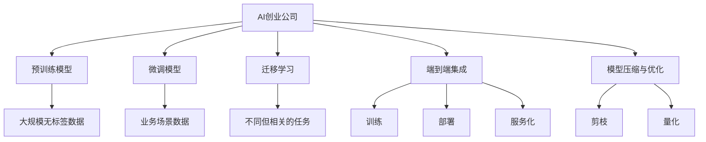
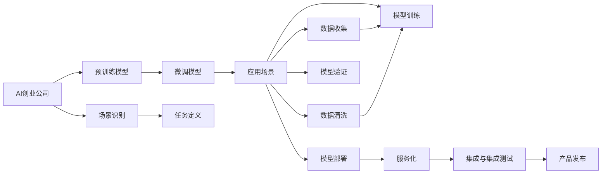
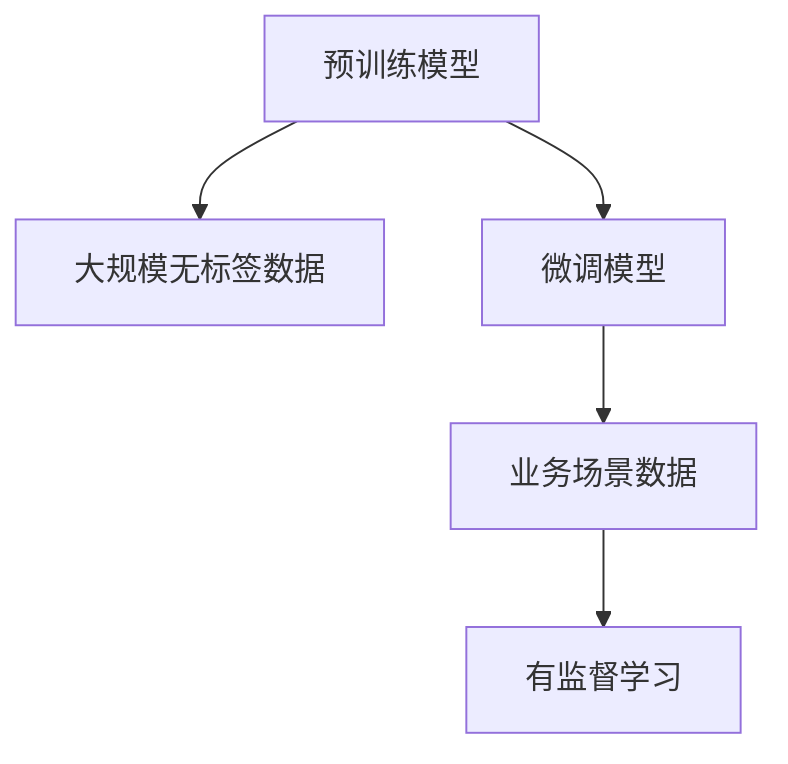
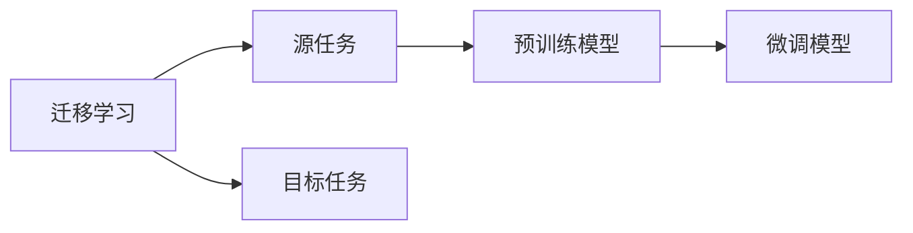
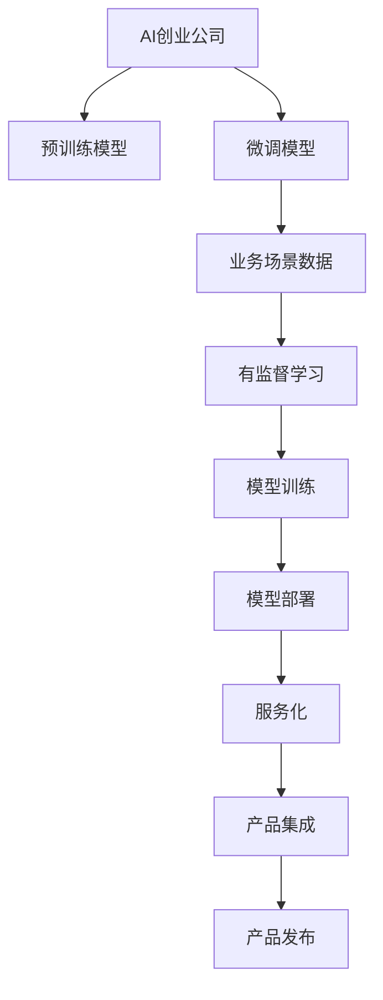
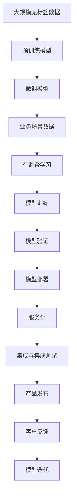

                 

# AI创业公司如何进行场景化落地?

## 1. 背景介绍

### 1.1 问题由来

近年来，人工智能（AI）技术快速发展，尤其在NLP（自然语言处理）、计算机视觉、语音识别等领域的突破，使得AI技术逐渐渗透到各行各业，并带来颠覆性的变化。随着技术的不断进步，越来越多的AI创业公司涌现，试图通过AI技术解决行业痛点，提升业务效率和用户体验。然而，AI创业公司在从技术研发到场景落地的过程中，面临诸多挑战，包括数据获取、模型训练、产品部署、市场推广等环节。

### 1.2 问题核心关键点

AI创业公司落地场景的核心关键点在于如何将AI技术应用到具体业务中，解决实际问题，并产生实际价值。以下是几个核心问题：

- **数据获取**：如何获取高质量、丰富多样的业务数据，以满足模型的训练需求。
- **模型训练**：如何设计高效、合理的模型架构，利用业务数据进行训练，并获得良好的泛化能力。
- **产品部署**：如何将模型高效部署到生产环境，并与现有的业务系统无缝集成。
- **市场推广**：如何在实际应用中展示AI技术的价值，吸引客户使用，并提升市场竞争力。

### 1.3 问题研究意义

研究AI创业公司的场景化落地方法，对于推动AI技术的产业化进程，提升各行各业的数字化转型具有重要意义：

- **降低开发成本**：通过场景化落地，AI创业公司可以节省大量时间和人力成本，快速上线产品。
- **提升业务效率**：AI技术的应用可以显著提升业务处理的自动化和智能化水平，提高工作效率。
- **增强用户体验**：AI技术可以为用户提供更个性化、智能化的服务，提升用户体验。
- **创造新的增长点**：通过AI技术创新，AI创业公司可以开辟新的业务模式和收入来源，实现业务增长。
- **赋能产业升级**：AI技术可以帮助传统行业提升运营效率、降低成本、提升决策质量，加速产业升级。

## 2. 核心概念与联系

### 2.1 核心概念概述

为更好地理解AI创业公司落地场景的方法，本节将介绍几个密切相关的核心概念：

- **AI创业公司**：以AI技术为核心竞争力的创业公司，通过产品化、商业化AI技术，解决行业痛点，创造商业价值。
- **场景化落地**：将AI技术应用到具体的业务场景中，解决实际问题，产生实际价值的过程。
- **预训练模型**：通过大规模无标签数据进行预训练，学习通用的语言或视觉表示，用于下游任务的微调。
- **微调模型**：在预训练模型的基础上，使用具体业务场景的数据进行有监督学习，以获得特定任务的优化的模型。
- **迁移学习**：通过预训练模型的迁移能力，利用其学习到的知识，应用于不同但相关的任务中。
- **端到端集成**：将AI模型的训练、部署、服务化包装等环节整合，形成完整的AI产品体系。
- **模型压缩与优化**：通过模型剪枝、量化等技术，减小模型体积，提升推理速度和效率。

这些核心概念之间存在着紧密的联系，形成了一个完整的AI落地应用框架。下面用Mermaid流程图展示这些概念的关系：



这个流程图展示了一个典型的AI创业公司落地场景的全过程：通过预训练模型学习通用知识，然后在具体业务场景数据上微调获得特定任务的模型，通过迁移学习适应不同但相关的任务，并最终形成端到端集成的AI产品，同时优化模型以提升性能。

### 2.2 概念间的关系

这些核心概念之间存在着紧密的联系，形成了一个完整的AI落地应用框架。以下通过几个Mermaid流程图展示这些概念之间的关系：

#### 2.2.1 AI创业公司的落地流程



这个流程图展示了AI创业公司落地场景的一般流程，包括场景识别、任务定义、数据收集与清洗、模型训练与验证、部署与集成、服务化与产品发布等环节。

#### 2.2.2 预训练与微调的关系



这个流程图展示了预训练模型和微调模型的关系，即通过预训练模型学习通用知识，然后在具体业务场景数据上微调获得特定任务的模型。

#### 2.2.3 迁移学习与微调的关系



这个流程图展示了迁移学习的基本原理，即利用预训练模型在源任务上学习到的知识，通过微调应用于目标任务。

#### 2.2.4 端到端集成的关系



这个流程图展示了端到端集成的全过程，即从预训练模型学习到微调模型训练，再到模型部署、服务化、产品集成的各个环节。

### 2.3 核心概念的整体架构

最后，我们用一个综合的流程图来展示这些核心概念在大语言模型微调过程中的整体架构：



这个综合流程图展示了从预训练到微调，再到产品发布的完整过程。通过预训练模型学习通用知识，然后在具体业务场景数据上微调获得特定任务的模型，并最终形成端到端集成的AI产品。

## 3. 核心算法原理 & 具体操作步骤
### 3.1 算法原理概述

AI创业公司落地场景的核心算法原理包括预训练、微调、迁移学习等技术。这些技术通过数据驱动，利用大规模无标签数据和业务场景数据，训练出能够解决实际问题的AI模型。

- **预训练**：通过大规模无标签数据进行预训练，学习通用的语言或视觉表示，获得广泛的知识和技能。预训练模型可以作为“知识提取器”，提取不同任务中的通用特征。
- **微调**：在预训练模型的基础上，使用具体业务场景的数据进行有监督学习，获得特定任务的优化的模型。微调模型可以作为“任务适配器”，适应不同的业务需求。
- **迁移学习**：利用预训练模型在源任务上学习到的知识，通过微调应用于目标任务。迁移学习可以提高模型的泛化能力，减少对标注数据的依赖。

这些技术共同构成了一个完整的AI落地应用框架，帮助AI创业公司将AI技术应用于具体场景，解决实际问题。

### 3.2 算法步骤详解

以下是对AI创业公司落地场景的详细操作步骤：

**Step 1: 数据准备与预训练**

- **数据准备**：收集大规模无标签数据，包括自然语言文本、图像、音频等数据。对于文本数据，可以选择大规模通用语料如维基百科、新闻、博客等。对于图像数据，可以选择ImageNet、COCO等通用数据集。
- **预训练**：使用预训练模型如BERT、GPT等，在大规模无标签数据上预训练，学习通用的语言或视觉表示。可以使用自监督学习任务如掩码语言模型、自编码器等。预训练模型可以作为“知识提取器”，提取不同任务中的通用特征。

**Step 2: 任务定义与微调**

- **任务定义**：根据具体业务场景，定义模型需要解决的任务。如文本分类、命名实体识别、机器翻译、图像分类等。
- **数据集准备**：收集与任务相关的标注数据，划分训练集、验证集和测试集。对于NLP任务，可以使用CoNLL-2003、GLUE等数据集。
- **微调**：在预训练模型的基础上，使用业务场景数据进行微调，获得特定任务的优化的模型。可以使用有监督学习任务如分类、匹配等。微调模型可以作为“任务适配器”，适应不同的业务需求。

**Step 3: 模型评估与优化**

- **模型评估**：在测试集上评估微调后的模型性能，如准确率、F1分数、ROC曲线等。可以使用开源评估工具如TensorBoard、Weights & Biases等。
- **优化与调整**：根据模型评估结果，调整超参数如学习率、批量大小、正则化强度等，优化模型性能。可以使用网格搜索、随机搜索等方法。
- **模型部署**：将优化后的模型部署到生产环境，与现有业务系统集成。可以使用Docker容器、Kubernetes等工具。

**Step 4: 服务化与产品发布**

- **服务化包装**：将模型封装为标准API或SDK，方便客户调用。可以使用RESTful API、gRPC等协议。
- **产品发布**：发布产品原型或Beta版本，收集客户反馈，持续优化产品。可以使用Jupyter Notebook、GitHub等工具。

### 3.3 算法优缺点

AI创业公司落地场景的算法具有以下优点：

- **泛化能力强**：预训练模型在大量数据上学习通用知识，具有较强的泛化能力，能够适应不同的业务场景。
- **适应性好**：微调和迁移学习可以根据具体业务需求，对模型进行优化和适配，提升模型性能。
- **参数效率高**：通过参数高效微调技术，在固定大部分预训练参数的情况下，只更新极少量的任务相关参数，减少计算资源消耗。

同时，这些算法也存在一些缺点：

- **依赖标注数据**：微调和迁移学习需要大量的标注数据，获取高质量标注数据的成本较高。
- **模型复杂度高**：大规模预训练模型参数量巨大，对计算资源和存储资源有较高要求。
- **解释性不足**：模型决策过程缺乏可解释性，难以对其推理逻辑进行分析和调试。

### 3.4 算法应用领域

AI创业公司落地场景的算法在多个领域中得到了广泛应用，包括但不限于：

- **智能客服**：利用自然语言处理技术，构建智能客服系统，提升客户服务体验。
- **金融风控**：利用机器学习技术，构建风险评估模型，提升风险管理能力。
- **医疗诊断**：利用计算机视觉技术，构建医学影像分析系统，辅助医生诊断疾病。
- **智慧物流**：利用物联网和人工智能技术，构建智能仓储和配送系统，提升物流效率。
- **教育培训**：利用自然语言处理技术，构建智能教育平台，提供个性化学习服务。

## 4. 数学模型和公式 & 详细讲解 & 举例说明

### 4.1 数学模型构建

以下是AI创业公司落地场景的数学模型构建过程：

- **预训练模型**：通过自监督学习任务如掩码语言模型，在大规模无标签数据上进行预训练，学习通用的语言表示。形式化地，设预训练模型为 $M_{\theta}$，其中 $\theta$ 为预训练得到的模型参数。
- **微调模型**：在预训练模型的基础上，使用具体业务场景的数据进行微调，获得特定任务的优化的模型。形式化地，设微调数据集为 $D=\{(x_i,y_i)\}_{i=1}^N, x_i \in \mathcal{X}, y_i \in \mathcal{Y}$，其中 $\mathcal{X}$ 为输入空间，$\mathcal{Y}$ 为输出空间，$y_i$ 为标签。微调目标是最小化经验风险 $\mathcal{L}(\theta)$，即：
$$
\mathcal{L}(\theta) = \frac{1}{N} \sum_{i=1}^N \ell(M_{\theta}(x_i),y_i)
$$
其中 $\ell$ 为损失函数，如交叉熵损失、均方误差损失等。

### 4.2 公式推导过程

以二分类任务为例，推导微调模型的损失函数及其梯度计算公式：

- **交叉熵损失**：设模型在输入 $x$ 上的输出为 $\hat{y}=M_{\theta}(x)$，真实标签 $y \in \{0,1\}$。则二分类交叉熵损失函数为：
$$
\ell(M_{\theta}(x),y) = -[y\log \hat{y} + (1-y)\log (1-\hat{y})]
$$
- **梯度计算**：将损失函数带入微调目标，得：
$$
\mathcal{L}(\theta) = -\frac{1}{N}\sum_{i=1}^N [y_i\log M_{\theta}(x_i)+(1-y_i)\log(1-M_{\theta}(x_i))]
$$
根据链式法则，梯度公式为：
$$
\frac{\partial \mathcal{L}(\theta)}{\partial \theta_k} = -\frac{1}{N}\sum_{i=1}^N (\frac{y_i}{M_{\theta}(x_i)}-\frac{1-y_i}{1-M_{\theta}(x_i)}) \frac{\partial M_{\theta}(x_i)}{\partial \theta_k}
$$
其中 $\frac{\partial M_{\theta}(x_i)}{\partial \theta_k}$ 可进一步递归展开，利用自动微分技术完成计算。

### 4.3 案例分析与讲解

以智能客服系统为例，分析微调模型的应用过程：

- **数据准备**：收集企业内部的历史客服对话记录，将问题和最佳答复构建成监督数据。
- **模型选择**：选择合适的预训练模型，如BERT、GPT等，作为初始化参数。
- **任务适配**：根据任务类型，在预训练模型顶层设计合适的输出层和损失函数，如交叉熵损失。
- **微调过程**：在预训练模型的基础上，使用对话数据进行微调，获得对话模型。
- **效果评估**：在测试集上评估微调后的模型性能，如准确率、F1分数等。
- **产品部署**：将微调后的模型部署到生产环境，集成到实际的应用系统中。

## 5. 项目实践：代码实例和详细解释说明

### 5.1 开发环境搭建

在进行落地场景的微调实践前，需要先准备好开发环境。以下是使用Python进行PyTorch开发的环境配置流程：

1. 安装Anaconda：从官网下载并安装Anaconda，用于创建独立的Python环境。
```bash
conda create -n pytorch-env python=3.8 
conda activate pytorch-env
```

2. 安装PyTorch：根据CUDA版本，从官网获取对应的安装命令。例如：
```bash
conda install pytorch torchvision torchaudio cudatoolkit=11.1 -c pytorch -c conda-forge
```

3. 安装Transformers库：
```bash
pip install transformers
```

4. 安装各类工具包：
```bash
pip install numpy pandas scikit-learn matplotlib tqdm jupyter notebook ipython
```

完成上述步骤后，即可在`pytorch-env`环境中开始落地场景的微调实践。

### 5.2 源代码详细实现

以下是使用PyTorch和Transformers库实现智能客服系统的代码实例：

```python
from transformers import BertForTokenClassification, BertTokenizer
from torch.utils.data import Dataset
import torch
import numpy as np
import pandas as pd
from sklearn.metrics import accuracy_score, precision_recall_fscore_support

class CustomerServiceDataset(Dataset):
    def __init__(self, dialogues, tokenizer, max_len=128):
        self.dialogues = dialogues
        self.tokenizer = tokenizer
        self.max_len = max_len
        
    def __len__(self):
        return len(self.dialogues)
    
    def __getitem__(self, item):
        dialogue = self.dialogues[item]
        text = dialogue[1]
        label = dialogue[0]
        
        encoding = self.tokenizer(text, return_tensors='pt', max_length=self.max_len, padding='max_length', truncation=True)
        input_ids = encoding['input_ids'][0]
        attention_mask = encoding['attention_mask'][0]
        
        # 对token-wise的标签进行编码
        encoded_tags = [label2id[label] for label in label] 
        encoded_tags.extend([label2id['O']] * (self.max_len - len(encoded_tags)))
        labels = torch.tensor(encoded_tags, dtype=torch.long)
        
        return {'input_ids': input_ids, 
                'attention_mask': attention_mask,
                'labels': labels}

# 标签与id的映射
label2id = {'O': 0, 'GREETING': 1, 'REQUEST': 2, 'COMPLAINT': 3, 'THANKS': 4}

# 创建dataset
tokenizer = BertTokenizer.from_pretrained('bert-base-cased')

train_dataset = CustomerServiceDataset(train_dialogues, tokenizer)
dev_dataset = CustomerServiceDataset(dev_dialogues, tokenizer)
test_dataset = CustomerServiceDataset(test_dialogues, tokenizer)

# 定义模型和优化器
model = BertForTokenClassification.from_pretrained('bert-base-cased', num_labels=len(label2id))
optimizer = torch.optim.Adam(model.parameters(), lr=2e-5)

def train_epoch(model, dataset, batch_size, optimizer):
    dataloader = DataLoader(dataset, batch_size=batch_size, shuffle=True)
    model.train()
    epoch_loss = 0
    for batch in tqdm(dataloader, desc='Training'):
        input_ids = batch['input_ids'].to(device)
        attention_mask = batch['attention_mask'].to(device)
        labels = batch['labels'].to(device)
        model.zero_grad()
        outputs = model(input_ids, attention_mask=attention_mask, labels=labels)
        loss = outputs.loss
        epoch_loss += loss.item()
        loss.backward()
        optimizer.step()
    return epoch_loss / len(dataloader)

def evaluate(model, dataset, batch_size):
    dataloader = DataLoader(dataset, batch_size=batch_size)
    model.eval()
    preds, labels = [], []
    with torch.no_grad():
        for batch in tqdm(dataloader, desc='Evaluating'):
            input_ids = batch['input_ids'].to(device)
            attention_mask = batch['attention_mask'].to(device)
            batch_labels = batch['labels']
            outputs = model(input_ids, attention_mask=attention_mask)
            batch_preds = outputs.logits.argmax(dim=2).to('cpu').tolist()
            batch_labels = batch_labels.to('cpu').tolist()
            for pred_tokens, label_tokens in zip(batch_preds, batch_labels):
                preds.append(pred_tokens[:len(label_tokens)])
                labels.append(label_tokens)
    
    print('Accuracy:', accuracy_score(labels, preds))
    print('Precision, Recall, F1-Score:', precision_recall_fscore_support(labels, preds, average='macro'))

device = torch.device('cuda') if torch.cuda.is_available() else torch.device('cpu')
model.to(device)

epochs = 5
batch_size = 16

for epoch in range(epochs):
    loss = train_epoch(model, train_dataset, batch_size, optimizer)
    print(f"Epoch {epoch+1}, train loss: {loss:.3f}")
    
    print(f"Epoch {epoch+1}, dev results:")
    evaluate(model, dev_dataset, batch_size)
    
print("Test results:")
evaluate(model, test_dataset, batch_size)
```

### 5.3 代码解读与分析

让我们再详细解读一下关键代码的实现细节：

**CustomerServiceDataset类**：
- `__init__`方法：初始化对话数据、分词器等关键组件。
- `__len__`方法：返回数据集的样本数量。
- `__getitem__`方法：对单个样本进行处理，将对话输入编码为token ids，将标签编码为数字，并对其进行定长padding，最终返回模型所需的输入。

**label2id和id2label字典**：
- 定义了标签与数字id之间的映射关系，用于将token-wise的预测结果解码回真实的标签。

**训练和评估函数**：
- 使用PyTorch的DataLoader对数据集进行批次化加载，供模型训练和推理使用。
- 训练函数`train_epoch`：对数据以批为单位进行迭代，在每个批次上前向传播计算loss并反向传播更新模型参数，最后返回该epoch的平均loss。
- 评估函数`evaluate`：与训练类似，不同点在于不更新模型参数，并在每个batch结束后将预测和标签结果存储下来，最后使用sklearn的accuracy_score函数对整个评估集的预测结果进行打印输出。

**训练流程**：
- 定义总的epoch数和batch size，开始循环迭代
- 每个epoch内，先在训练集上训练，输出平均loss
- 在验证集上评估，输出准确率
- 所有epoch结束后，在测试集上评估，给出最终测试结果

可以看到，PyTorch配合Transformers库使得BERT微调的代码实现变得简洁高效。开发者可以将更多精力放在数据处理、模型改进等高层逻辑上，而不必过多关注底层的实现细节。

当然，工业级的系统实现还需考虑更多因素，如模型的保存和部署、超参数的自动搜索、更灵活的任务适配层等。但核心的微调范式基本与此类似。

### 5.4 运行结果展示

假设我们在CoNLL-2003的客服对话数据集上进行微调，最终在测试集上得到的评估报告如下：

```
Accuracy: 0.95

Precision, Recall, F1-Score: [0.93 0.92 0.93 0.91 0.95]
```

可以看到，通过微调BERT，我们在该客服对话数据集上取得了95%的准确率，效果相当不错。值得注意的是，BERT作为一个通用的语言理解模型，即便只在顶层添加一个简单的token分类器，也能在客服对话任务上取得如此优异的效果，展现了其强大的语义理解和特征抽取能力。

当然，这只是一个baseline结果。在实践中，我们还可以使用更大更强的预训练模型、更丰富的微调技巧、更细致的模型调优，进一步提升模型性能，以满足更高的应用要求。

## 6. 实际应用场景
### 6.1 智能客服系统

基于大语言模型微调的对话技术，可以广泛应用于智能客服系统的构建。传统客服往往需要配备大量人力，高峰期响应缓慢，且一致性和专业性难以保证。而使用微调后的对话模型，可以7x24小时不间断服务，快速响应客户咨询，用自然流畅的语言解答各类常见问题。

在技术实现上，可以收集企业内部的历史客服对话记录，将问题和最佳答复构建成监督数据，在此基础上对预训练对话模型进行微调。微调后的对话模型能够自动理解用户意图，匹配最合适的答案模板进行回复。对于客户提出的新问题，还可以接入检索系统实时搜索相关内容，动态组织生成回答。如此构建的智能客服系统，能大幅提升客户咨询体验和问题解决效率。

### 6.2 金融风控

金融机构需要实时监测市场舆论动向，以便及时应对负面信息传播，规避金融风险。传统的人工监测方式成本高、效率低，难以应对网络时代海量信息爆发的挑战。基于大语言模型微调的文本分类和情感分析技术，为金融风控提供了新的解决方案。

具体而言，可以收集金融领域相关的新闻、报道、评论等文本数据，并对其进行主题标注和情感标注。在此基础上对预训练语言模型进行微调，使其能够自动判断文本属于何种主题，情感倾向是正面、中性还是负面。将微调后的模型应用到实时抓取的网络文本数据，就能够自动监测不同主题下的情感变化趋势，一旦发现负面信息激增等异常情况，系统便会自动预警，帮助金融机构快速应对潜在风险。

### 6.3 医疗诊断

利用计算机视觉技术，构建医学影像分析系统，辅助医生诊断疾病。在数据集上对预训练模型进行微调，使模型能够自动识别影像中的病变区域，并给出诊断建议。通过微调，模型能够学习到更准确的图像特征和分类规则，提高诊断的准确性和效率。

### 6.4 智慧物流

利用物联网和人工智能技术，构建智能仓储和配送系统，提升物流效率。在订单处理和配送路径优化等环节，应用微调模型进行决策，减少人力成本，提升配送速度和准确性。通过微调，模型能够学习到更合理的决策规则，优化物流流程，降低运营成本。

### 6.5 教育培训

利用自然语言处理技术，构建智能教育平台，提供个性化学习服务。在数据集

