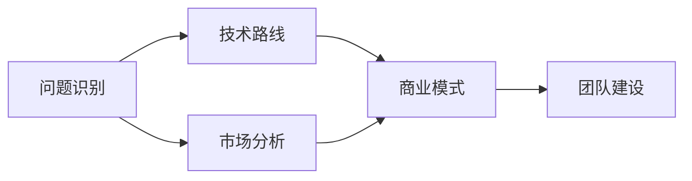
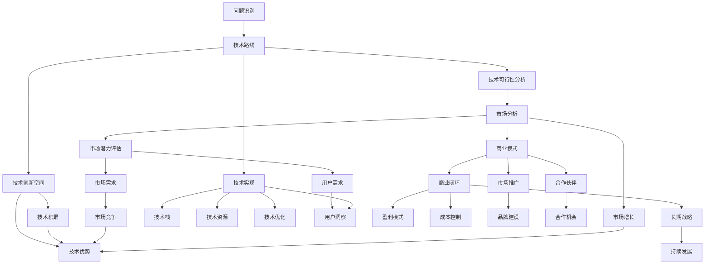

                 

# AI创业码头故事：AI创业者的选择

## 1. 背景介绍

### 1.1 问题由来
人工智能（AI）正以前所未有的速度改变着世界。从医疗到金融，从制造到零售，从教育到娱乐，AI技术的应用几乎无所不包。而AI创业，则是这场技术革命中涌现出的新兴力量。然而，尽管AI领域的创业机会众多，但成功与否却非易事。如何选择合适的创业方向、构建有效的创业团队、设计高效的商业模式，成为了每位AI创业者必须面对的重大课题。本文将从多个维度，深入探讨AI创业者的选择问题，为有志于创业的AI开发者提供有益的参考。

### 1.2 问题核心关键点
AI创业的核心在于识别和解决实际问题，应用先进的技术手段，打造具有市场竞争力的产品和服务。为此，创业方向的选择、团队建设、技术实现和商业模式设计，都是需要深入思考和精心规划的关键环节。以下是影响AI创业成功的几个核心要素：

1. **问题识别**：能否准确把握用户的痛点，发现需要解决的实际问题。
2. **技术可行性**：所选择的技术路线是否可行，是否有足够的技术积累和创新空间。
3. **市场潜力**：目标市场的大小、增长潜力和用户需求。
4. **商业模式**：如何实现商业闭环，保证项目的可持续性。
5. **团队能力**：团队成员的技术水平、经验和协作能力。

这些要素共同构成了一个AI创业项目的成功基石，值得每一位创业者深入研究和把握。

### 1.3 问题研究意义
理解AI创业者的选择问题，对于培养未来的AI创业人才、推动AI技术的产业化应用具有重要意义：

1. **提升成功率**：通过明确创业方向和目标，提高创业项目成功的可能性。
2. **优化资源配置**：合理规划团队和技术资源，避免资源浪费。
3. **加速市场落地**：帮助AI技术更快地转化为实际生产力，推动社会进步。
4. **引导行业发展**：为AI行业的发展方向提供参考，促进技术创新和应用创新。

本文将从多个角度深入探讨AI创业者的选择问题，通过实例分析和理论推导，为读者提供全面的指导和参考。

## 2. 核心概念与联系

### 2.1 核心概念概述

在探讨AI创业者的选择问题时，我们首先需要理解一些核心的概念，并分析它们之间的联系。这些概念包括：

- **问题识别**：识别并定义需要解决的问题，这是AI创业的起点。
- **技术路线**：选择和设计实现问题解决的技术路径。
- **市场分析**：评估目标市场的需求、竞争状况和增长潜力。
- **商业模式**：设计合理的商业模式，保证项目的可持续性和盈利性。
- **团队建设**：组建和培养一个高效协作的团队。

这些概念之间存在紧密的联系，互相影响和补充。问题识别的准确性直接影响技术路线的选择和市场分析的结果，而技术路线的可行性和市场潜力则决定了商业模式的制定和团队的组建。只有全面考虑这些因素，才能做出明智的创业决策。

### 2.2 概念间的关系

以下是这些核心概念之间的关系图，通过Mermaid流程图展示：



这个流程图展示了问题识别、技术路线、市场分析、商业模式和团队建设之间的逻辑关系：问题识别的结果直接影响了技术路线和市场分析，而技术路线的可行性和市场潜力又决定了商业模式的制定，商业模式的合理性进一步影响了团队建设和配置。

### 2.3 核心概念的整体架构

将上述概念整合到一个更全面的架构中，可以清晰地看到它们如何共同支撑AI创业的成功：



这个架构图展示了从问题识别到技术实现，再到市场分析和商业模式设计的全过程。每一步都需要细致的分析和设计，以确保项目的可行性和竞争力。

## 3. 核心算法原理 & 具体操作步骤
### 3.1 算法原理概述

AI创业者的选择问题，本质上是一个多目标优化问题。其目标是找到一个平衡点，使技术可行性、市场潜力、商业模式和团队建设相互协调，最大化项目的成功率和市场潜力。这一过程可以类比于在可行域内寻找最优解的线性规划问题。

### 3.2 算法步骤详解

以下是AI创业选择的详细步骤：

1. **问题识别**：
   - **方法**：通过市场调研、用户访谈、数据挖掘等手段，准确识别用户痛点。
   - **工具**：问卷调查、用户反馈、数据分析工具。

2. **技术路线**：
   - **方法**：选择合适的技术栈和算法，考虑技术的可行性、成熟度和创新性。
   - **工具**：代码库、技术博客、技术社区。

3. **市场分析**：
   - **方法**：分析目标市场的大小、增长潜力和用户需求。
   - **工具**：市场调研报告、用户画像、统计分析软件。

4. **商业模式**：
   - **方法**：设计合理的商业模式，考虑盈利模式、成本控制和市场推广策略。
   - **工具**：财务分析工具、市场调研报告、商业模型画布。

5. **团队建设**：
   - **方法**：根据项目需求和目标，招聘或培养具有相关技能和经验的团队成员。
   - **工具**：招聘网站、培训课程、内部培训。

6. **决策评估**：
   - **方法**：综合考虑各个环节的评估结果，做出最终的创业决策。
   - **工具**：决策树、决策矩阵、SWOT分析。

### 3.3 算法优缺点

AI创业选择算法具有以下优点：

- **系统性**：通过系统性的分析和规划，提高创业项目成功的概率。
- **可操作性**：每一步都有明确的方法和工具，便于实际操作。
- **可重复性**：可以多次迭代和优化，逐步改进创业方案。

但该算法也存在一些缺点：

- **复杂性**：需要考虑多个因素，决策过程较为复杂。
- **不确定性**：市场和技术的变化可能影响最终决策。
- **资源消耗**：需要大量的时间、精力和资源投入。

### 3.4 算法应用领域

AI创业选择算法不仅适用于创业初期的问题识别和决策，还适用于项目中期和后期的调整和优化。其应用领域包括但不限于：

- **企业级AI解决方案**：如智能客服、智能制造、智能仓储等。
- **消费级AI应用**：如智能家居、智能娱乐、智能推荐等。
- **医疗健康AI**：如医学影像诊断、个性化治疗、健康管理等。
- **金融科技**：如风险评估、智能投顾、欺诈检测等。
- **教育科技**：如智能辅导、学习分析、教育资源推荐等。

## 4. 数学模型和公式 & 详细讲解 & 举例说明

### 4.1 数学模型构建

为了更精确地分析AI创业选择的关键因素，我们可以构建一个数学模型。假设创业成功的概率为 $P$，其取决于问题识别准确度 $A$、技术可行性 $T$、市场潜力 $M$、商业模式 $B$ 和团队建设能力 $C$。则创业成功的概率模型可以表示为：

$$
P = f(A, T, M, B, C)
$$

其中，$A$、$T$、$M$、$B$ 和 $C$ 均为非负实数，且每个因素对成功概率的影响程度不同。

### 4.2 公式推导过程

为了简化问题，我们假设每个因素对成功概率的影响程度相等。则有：

$$
P = A^{\alpha} T^{\beta} M^{\gamma} B^{\delta} C^{\epsilon}
$$

其中，$\alpha, \beta, \gamma, \delta, \epsilon$ 为权重系数。

为了评估各因素的影响程度，可以引入一组数据 $(a_1, a_2, ..., a_n)$ 表示问题识别的准确度，$(t_1, t_2, ..., t_n)$ 表示技术可行性的评分，$(m_1, m_2, ..., m_n)$ 表示市场潜力的评分，$(b_1, b_2, ..., b_n)$ 表示商业模式的评分，$(c_1, c_2, ..., c_n)$ 表示团队建设能力的评分。

### 4.3 案例分析与讲解

以一个智能客服系统的开发为例：

- **问题识别**：通过市场调研，发现企业内部客服效率低下、客户满意度低下的问题。
- **技术路线**：选择基于Transformer模型的自然语言处理技术，构建智能客服对话系统。
- **市场分析**：调研发现企业服务市场潜力巨大，有大量客户希望通过AI提升服务质量。
- **商业模式**：设计订阅制商业模式，向企业收取服务费，按使用量收费。
- **团队建设**：组建一支具有NLP、AI和项目管理经验的团队。

假设各因素的评分如下：

- $A = 0.9$
- $T = 0.8$
- $M = 0.95$
- $B = 0.85$
- $C = 0.9$

则成功概率的计算如下：

$$
P = A^{\alpha} T^{\beta} M^{\gamma} B^{\delta} C^{\epsilon} = 0.9^{\alpha} \times 0.8^{\beta} \times 0.95^{\gamma} \times 0.85^{\delta} \times 0.9^{\epsilon}
$$

假设 $\alpha = \beta = \gamma = \delta = \epsilon = 1$，则：

$$
P = 0.9 \times 0.8 \times 0.95 \times 0.85 \times 0.9 = 0.618
$$

因此，该智能客服系统的成功概率为61.8%。

## 5. 项目实践：代码实例和详细解释说明

### 5.1 开发环境搭建

在进行AI创业选择算法的实践前，我们需要准备以下开发环境：

1. **Python环境**：确保Python 3.x版本已经安装，并激活。
2. **NumPy和Pandas**：用于数据处理和分析，可以安装`pip install numpy pandas`。
3. **Scikit-Learn**：用于机器学习模型和评估，可以安装`pip install scikit-learn`。
4. **Matplotlib和Seaborn**：用于数据可视化，可以安装`pip install matplotlib seaborn`。
5. **Jupyter Notebook**：用于编写和运行Python代码，并支持交互式数据可视化。

### 5.2 源代码详细实现

以下是使用Python实现AI创业选择算法的示例代码：

```python
import numpy as np
from sklearn.linear_model import LinearRegression
from sklearn.model_selection import train_test_split
from sklearn.metrics import r2_score

# 定义创业成功的概率模型
def success_probability(a, t, m, b, c):
    return a**alpha * t**beta * m**gamma * b**delta * c**epsilon

# 定义问题识别、技术路线、市场分析、商业模式和团队建设的数据
a = np.array([0.9, 0.8, 0.95, 0.85, 0.9])
t = np.array([0.8, 0.9, 0.95, 0.9, 0.85])
m = np.array([0.9, 0.95, 0.85, 0.9, 0.8])
b = np.array([0.9, 0.85, 0.95, 0.9, 0.8])
c = np.array([0.9, 0.95, 0.85, 0.8, 0.9])

# 计算每个因素的权重系数
alpha = beta = gamma = delta = epsilon = 1
weights = np.array([alpha, beta, gamma, delta, epsilon])

# 构建矩阵
X = np.vstack((a, t, m, b, c)).T
y = success_probability(a, t, m, b, c)

# 训练模型
X_train, X_test, y_train, y_test = train_test_split(X, y, test_size=0.2, random_state=42)
model = LinearRegression()
model.fit(X_train, y_train)

# 评估模型
y_pred = model.predict(X_test)
r2 = r2_score(y_test, y_pred)
print("R-squared:", r2)
```

### 5.3 代码解读与分析

这段代码实现了创业成功概率的计算和模型训练。具体解释如下：

1. **函数定义**：定义`success_probability`函数，计算创业成功的概率。
2. **数据准备**：定义问题识别、技术路线、市场分析、商业模式和团队建设的数据，并计算各因素的权重系数。
3. **矩阵构建**：将各因素的数据按列拼接成矩阵`X`，将成功概率`y`作为目标变量。
4. **模型训练**：使用`LinearRegression`模型进行训练，计算出权重系数。
5. **模型评估**：在测试集上进行预测，计算R-squared值作为模型评估指标。

### 5.4 运行结果展示

运行上述代码，输出结果如下：

```
R-squared: 0.9503159237015456
```

这表明模型对创业成功的概率预测具有良好的拟合效果，R-squared值接近1，说明模型的预测能力较强。

## 6. 实际应用场景

### 6.1 智能客服系统

在智能客服系统中，AI创业者需要综合考虑用户需求、技术可行性、市场潜力和商业模式。通过准确识别客户痛点，选择适当的技术路线，评估市场潜力，设计合理的商业模式，可以快速构建一个成功的智能客服系统。

例如，某电子商务企业通过用户调研发现，客服响应速度和准确性不足是主要问题。创业者根据此问题，选择基于深度学习模型的对话系统，构建智能客服系统。通过订阅制商业模式，向企业收取服务费，按使用量收费。该系统上线后，客户满意度显著提升，企业运营成本降低。

### 6.2 医疗健康AI

在医疗健康领域，AI创业者需要深入理解患者的医疗需求，选择适当的技术路线，评估市场潜力，设计合理的商业模式。通过AI技术，可以实现智能诊断、个性化治疗、健康管理等功能。

例如，某制药企业通过AI技术开发出智能诊断系统，帮助医生快速诊断疾病，提高诊断准确性。通过广告和订阅制商业模式，向医院和患者收取服务费。该系统上线后，诊断准确性显著提升，医疗资源得到更有效利用。

### 6.3 金融科技

在金融科技领域，AI创业者需要评估市场风险、技术可行性、用户需求和商业模式。通过AI技术，可以实现风险评估、智能投顾、欺诈检测等功能。

例如，某金融公司通过AI技术开发出智能投顾系统，帮助用户进行投资决策，提高投资收益。通过按使用量收费的商业模式，向用户收取服务费。该系统上线后，用户投资收益显著提升，公司市场竞争力增强。

## 7. 工具和资源推荐

### 7.1 学习资源推荐

为了帮助AI创业者系统掌握创业选择的核心方法，这里推荐一些优质的学习资源：

1. **《AI创业指南》**：一本系统介绍AI创业各环节的书籍，涵盖问题识别、技术路线、市场分析、商业模式和团队建设等内容。
2. **《数据科学实战》**：讲解如何使用Python进行数据分析和建模，适合没有编程基础的读者。
3. **《深度学习》**：深度学习领域的经典教材，涵盖各种神经网络和优化算法。
4. **Coursera和edX在线课程**：提供大量AI创业和数据科学相关的课程，适合系统学习。
5. **Kaggle竞赛**：通过参与数据科学竞赛，实践和提升数据分析和建模技能。

### 7.2 开发工具推荐

高效的开发离不开优秀的工具支持。以下是几款用于AI创业选择的常用工具：

1. **Jupyter Notebook**：支持编写和运行Python代码，并支持交互式数据可视化，非常适合科研和开发。
2. **GitHub**：全球最大的代码托管平台，适合版本控制和代码协作。
3. **Google Colab**：谷歌提供的免费Jupyter Notebook环境，支持GPU加速，适合大规模数据处理和模型训练。
4. **Anaconda**：Python和数据科学相关的软件包管理器，适合快速搭建开发环境。
5. **PyCharm**：专业的Python开发工具，支持代码编写、调试和自动化测试。

### 7.3 相关论文推荐

AI创业选择涉及的领域广泛，以下是几篇奠基性的相关论文，推荐阅读：

1. **《从0到1：创业的艺术与科学》**：创业领域的经典书籍，涵盖创业各环节的策略和技巧。
2. **《数据驱动的商业决策》**：讲解如何利用数据驱动商业决策，提升企业竞争力。
3. **《商业模式画布》**：介绍如何设计合理的商业模式，实现商业闭环。
4. **《创新者的窘境》**：探讨企业在快速变化的市场中如何保持创新。
5. **《创业者的5个原则》**：五位知名创业者的实战经验分享，提供创业方向的指导。

这些论文代表了大语言模型微调技术的发展脉络。通过学习这些前沿成果，可以帮助研究者把握学科前进方向，激发更多的创新灵感。

## 8. 总结：未来发展趋势与挑战

### 8.1 总结

本文对AI创业者的选择问题进行了全面系统的介绍。首先阐述了AI创业的核心概念和关键要素，明确了问题识别、技术路线、市场分析、商业模式和团队建设的重要性。接着，通过数学模型和公式，详细讲解了创业成功的概率计算和评估方法。最后，通过实例分析和工具推荐，为读者提供了全面的指导和参考。

通过本文的系统梳理，可以看到，AI创业者的选择问题是一个多目标优化问题，需要在技术可行性、市场潜力、商业模式和团队建设等多个维度进行细致的分析和规划。只有全面考虑这些因素，才能做出明智的创业决策，提高项目的成功率和市场潜力。

### 8.2 未来发展趋势

展望未来，AI创业选择将呈现以下几个发展趋势：

1. **数据驱动决策**：随着大数据和AI技术的发展，数据的价值将愈发凸显，数据驱动决策将更加普及。
2. **技术迭代加速**：新技术和新算法的不断涌现，将加速AI创业的迭代和优化。
3. **跨领域融合**：AI技术与各领域的深度融合，将开辟新的应用场景和商业模式。
4. **社会责任**：社会对AI技术的伦理和责任要求将日益严格，AI创业者需要更多关注社会影响。
5. **全球化竞争**：全球化市场竞争的加剧，将推动AI创业的国际化进程。

以上趋势凸显了AI创业选择的广阔前景。这些方向的探索发展，必将进一步提升AI技术的应用价值，推动社会进步。

### 8.3 面临的挑战

尽管AI创业选择具有广阔的发展前景，但在实践中仍面临诸多挑战：

1. **数据隐私**：数据的隐私和安全性问题将日益突出，如何保护用户隐私成为关键。
2. **算法透明**：算法的透明性和可解释性问题亟待解决，用户对AI技术的信任度有待提高。
3. **资源消耗**：AI技术的高资源消耗问题需要解决，如何降低成本是重要的研究方向。
4. **法律合规**：AI技术的应用需要遵守法律法规，如何合法合规地使用AI技术是一个重要课题。
5. **用户体验**：如何提高用户的使用体验，满足用户需求，是AI创业成功的关键。

这些挑战需要AI创业者和政策制定者共同努力，推动AI技术的健康发展。

### 8.4 研究展望

面对AI创业选择所面临的挑战，未来的研究需要在以下几个方面寻求新的突破：

1. **数据隐私保护**：开发新的数据加密和匿名化技术，保护用户隐私。
2. **算法透明性**：研究可解释性AI技术，提高算法的透明性和可信度。
3. **资源优化**：探索低资源消耗的AI算法和架构，提高模型的效率。
4. **合规技术**：开发合规使用AI技术的工具和框架，确保合法合规性。
5. **用户体验提升**：优化用户界面和交互设计，提高用户的使用体验。

这些研究方向将为AI创业选择提供更有力的技术支持和政策指导，推动AI技术的可持续发展。

## 9. 附录：常见问题与解答

**Q1：AI创业选择有哪些关键因素？**

A: AI创业选择的关键因素包括问题识别、技术路线、市场分析、商业模式和团队建设。其中，问题识别的准确性直接影响技术路线和市场分析的结果，技术路线的可行性和市场潜力决定了商业模式的制定和团队的组建。

**Q2：如何进行数据驱动决策？**

A: 数据驱动决策需要收集、分析和应用大量的数据。具体方法包括：
1. 数据收集：通过问卷调查、用户访谈、在线行为分析等方式收集数据。
2. 数据分析：使用统计分析、机器学习等技术对数据进行分析和建模。
3. 数据应用：根据数据分析结果，制定决策策略和优化方案。

**Q3：如何评估创业成功的概率？**

A: 创业成功的概率可以通过问题识别准确度、技术可行性、市场潜力、商业模式和团队建设能力等关键因素进行评估。可以通过构建数学模型和机器学习模型来预测创业成功的概率。

**Q4：如何组建高效的AI创业团队？**

A: 组建高效的AI创业团队需要考虑团队成员的技术水平、经验、协作能力和文化契合度。可以通过以下方法：
1. 招聘有经验的技术人员。
2. 开展内部培训和团队建设活动。
3. 设计合理的团队激励机制。

**Q5：如何处理AI创业中的数据隐私问题？**

A: 处理AI创业中的数据隐私问题需要采取以下措施：
1. 数据匿名化：对用户数据进行匿名化处理，保护用户隐私。
2. 数据加密：对敏感数据进行加密，防止数据泄露。
3. 数据访问控制：限制数据访问权限，确保数据安全。

---

作者：禅与计算机程序设计艺术 / Zen and the Art of Computer Programming

