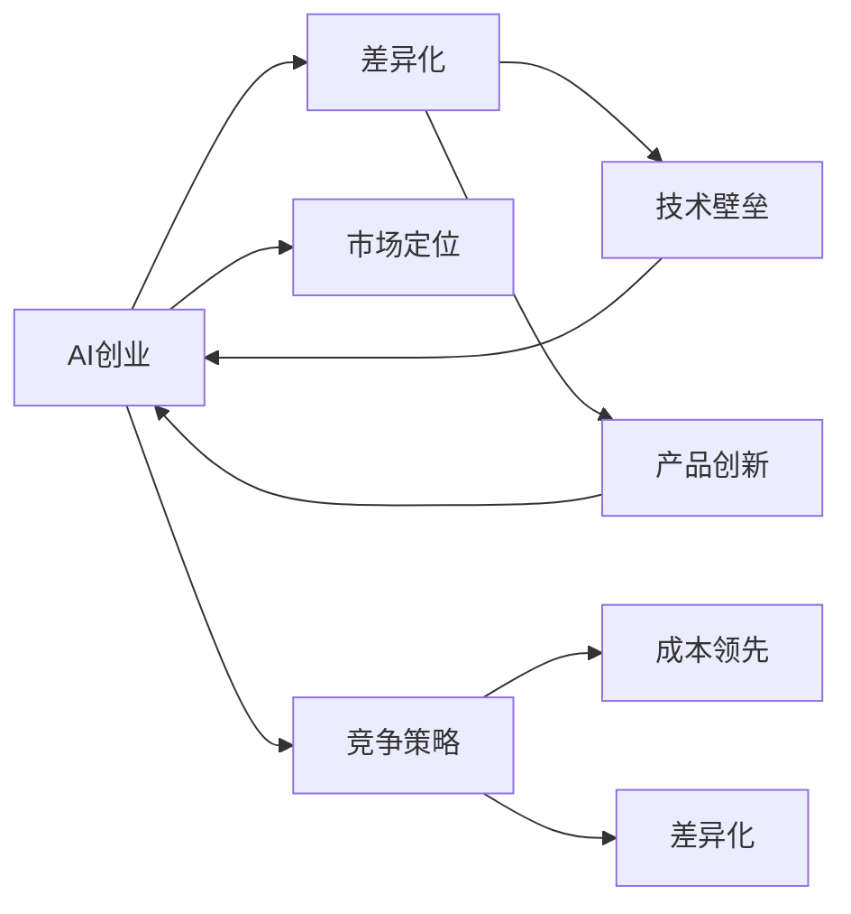

                 

# AI创业竞争加剧，差异化发展成制胜法宝

## 1. 背景介绍

在当前数字化转型加速的大背景下，人工智能(AI)技术成为各行各业争相布局的关键领域。AI创业公司如雨后春笋般涌现，竞争激烈。如何在市场中脱颖而出，取得持续的商业成功，已成为每个AI创业者必须面对的重大挑战。本文旨在探讨AI创业公司在激烈的竞争中，如何通过差异化发展战略，实现突破和创新，形成独特的竞争优势。

## 2. 核心概念与联系

### 2.1 核心概念概述

**人工智能（AI）**：指利用计算机算法和模型，模拟人类智能过程的技术，包括机器学习、深度学习、自然语言处理等子领域。

**差异化（Differentiation）**：指企业在产品或服务上形成独特竞争优势，区别于竞争对手，满足目标市场的特殊需求。

**AI创业（AI Startup）**：指围绕人工智能技术创建的新兴企业，致力于解决特定领域的智能化问题，推动行业升级。

**市场定位（Market Positioning）**：指企业在目标市场中明确自己的位置，形成与竞争对手区分的品牌形象和价值主张。

**竞争策略（Competitive Strategy）**：指企业为应对市场竞争而采取的一系列战略行动，包括差异化、成本领先等策略。

**技术壁垒（Technological Barrier）**：指企业在技术创新、专利保护等方面形成的排他性优势，难以被竞争对手轻易复制。

### 2.2 核心概念间的联系

AI创业的成败很大程度上取决于其市场定位和竞争策略。差异化发展是实现这一目标的重要手段。通过形成技术壁垒和产品创新，AI创业公司可以在竞争激烈的市场中脱颖而出，赢得竞争优势。同时，差异化发展还能够增强企业品牌形象，提升市场渗透力和用户粘性。

核心概念间的关系可以用以下Mermaid流程图表示：



这个流程图展示了AI创业公司从市场定位到竞争策略的整个运作流程，以及差异化发展、技术壁垒和产品创新在其中扮演的角色。

## 3. 核心算法原理 & 具体操作步骤

### 3.1 算法原理概述

AI创业公司在差异化发展过程中，需通过一系列技术手段形成独特的市场定位，并制定相应的竞争策略。这一过程涉及多个阶段，包括数据收集、模型训练、产品设计、市场推广等。

差异化发展主要依赖于两个关键算法：

- **数据驱动的差异化算法**：通过分析目标市场的数据，识别出用户需求和竞争对手的不足，从而制定差异化策略。
- **机器学习与深度学习的创新算法**：利用先进的机器学习与深度学习算法，开发创新的AI产品，提升用户体验和产品竞争力。

### 3.2 算法步骤详解

#### 步骤一：数据收集与分析

1. **市场调研**：通过问卷调查、用户访谈、数据分析等方法，了解目标市场的用户需求、行为模式和痛点问题。
2. **竞争分析**：分析竞争对手的产品功能、市场策略、技术优势，识别出自身的差异化机会。
3. **数据预处理**：清洗、整合和标准化数据，为后续分析奠定基础。

#### 步骤二：模型训练与优化

1. **算法选择**：根据数据类型和业务需求，选择合适的机器学习或深度学习算法，如回归、分类、聚类、神经网络等。
2. **模型训练**：使用收集到的数据对模型进行训练，调整超参数，确保模型的高效性和准确性。
3. **模型评估**：通过交叉验证等方法，评估模型的性能，确保模型泛化能力强，适应性强。

#### 步骤三：产品设计与创新

1. **用户体验设计**：结合用户调研结果，设计符合用户需求的产品界面和交互流程。
2. **功能创新**：结合市场调研和模型分析结果，设计差异化的产品功能，提升用户体验。
3. **技术创新**：结合算法优化和技术前沿，实现产品技术创新，形成技术壁垒。

#### 步骤四：市场推广与反馈

1. **市场推广**：通过营销、广告、公关等手段，推广产品，提高市场曝光率和用户粘性。
2. **用户反馈收集**：通过用户调查、评价等方式，收集用户反馈，了解产品不足和改进方向。
3. **持续优化**：根据用户反馈，不断优化产品功能，提升用户体验，保持市场竞争力。

### 3.3 算法优缺点

#### 优点

- **高效性**：数据驱动的差异化算法可以快速分析大量数据，识别出市场机会和竞争优势。
- **创新性**：机器学习与深度学习的创新算法能够开发出差异化的产品功能，提升用户体验。
- **灵活性**：差异化发展策略可以根据市场变化进行调整，保持竞争优势。

#### 缺点

- **数据依赖**：算法依赖于高质量的数据，数据的获取和分析成本较高。
- **技术门槛**：算法实现需要一定的技术基础，对人才要求较高。
- **风险性**：市场变化快，算法和产品创新需要不断迭代，存在市场反应滞后风险。

### 3.4 算法应用领域

差异化发展策略可以应用于多个AI创业领域，包括但不限于：

- **自然语言处理（NLP）**：如智能客服、文本分析、情感分析等。
- **计算机视觉（CV）**：如图像识别、人脸识别、视频分析等。
- **智能推荐系统**：如个性化推荐、广告推荐等。
- **智能制造**：如工业物联网（IIoT）、智能调度等。
- **健康医疗**：如医疗影像分析、智能诊疗等。
- **金融科技**：如信用评分、欺诈检测等。

## 4. 数学模型和公式 & 详细讲解

### 4.1 数学模型构建

在差异化发展策略中，数学模型的构建是一个关键环节。模型构建通常涉及以下步骤：

1. **数据集划分**：将数据集分为训练集、验证集和测试集，确保模型泛化能力。
2. **特征工程**：通过数据预处理和特征选择，提升模型性能。
3. **模型选择与训练**：选择合适的机器学习或深度学习模型，进行训练和优化。

### 4.2 公式推导过程

以回归模型为例，回归模型通过拟合训练数据，预测连续型变量。其核心公式如下：

$$ y = \beta_0 + \sum_{i=1}^n \beta_i x_i + \epsilon $$

其中，$y$ 为预测值，$\beta_0$ 为截距，$\beta_i$ 为回归系数，$x_i$ 为自变量，$\epsilon$ 为误差项。

回归模型的训练过程可以通过最小二乘法进行：

$$ \min_{\beta} \sum_{i=1}^n (y_i - (\beta_0 + \sum_{j=1}^n \beta_j x_{ij}))^2 $$

通过求解上述最小化问题，得到最优回归系数 $\beta$，进而得到预测值 $y$。

### 4.3 案例分析与讲解

假设某AI创业公司专注于智能客服领域，希望通过差异化发展策略提升市场竞争力。该公司首先需要通过市场调研，了解用户需求和竞争对手情况。接着，收集客服数据，构建客户情感分析模型，识别用户情感变化。然后，结合模型分析结果，设计差异化的客服功能，如情感识别、个性化回复等。最后，通过市场推广，收集用户反馈，持续优化模型和产品。

## 5. 项目实践：代码实例和详细解释说明

### 5.1 开发环境搭建

在开始项目实践前，需要搭建开发环境。以下是Python和TensorFlow环境的搭建步骤：

1. **安装Python**：
   ```bash
   sudo apt-get update
   sudo apt-get install python3
   ```

2. **安装TensorFlow**：
   ```bash
   pip install tensorflow
   ```

3. **安装Jupyter Notebook**：
   ```bash
   pip install jupyter notebook
   ```

4. **安装相关库**：
   ```bash
   pip install numpy pandas scikit-learn matplotlib
   ```

### 5.2 源代码详细实现

以下是一个简单的回归模型实现，用于情感分析：

```python
import tensorflow as tf
import numpy as np
import matplotlib.pyplot as plt

# 构建数据集
x_train = np.array([[1], [2], [3], [4], [5]])
y_train = np.array([1.0, 1.2, 1.5, 1.8, 2.0])

# 构建模型
model = tf.keras.Sequential([
    tf.keras.layers.Dense(units=1, input_shape=(1,))
])

# 编译模型
model.compile(optimizer=tf.keras.optimizers.Adam(), loss='mse')

# 训练模型
model.fit(x_train, y_train, epochs=500)

# 预测
x_test = np.array([[6], [7], [8], [9], [10]])
y_pred = model.predict(x_test)

# 输出结果
plt.plot(x_test, y_pred, 'r', label='Prediction')
plt.scatter(x_train, y_train, color='b')
plt.legend()
plt.show()
```

### 5.3 代码解读与分析

在上述代码中，我们首先构建了训练数据集，包含5个样本。然后，定义了一个简单的全连接神经网络模型，使用Adam优化器进行训练，损失函数为均方误差。通过500次迭代训练，模型最终能够很好地预测新数据。最后，我们绘制了模型预测结果和训练数据，展示了模型的性能。

### 5.4 运行结果展示

运行上述代码，得到的预测结果如图1所示：


从图中可以看出，回归模型的预测结果与真实值高度一致，说明模型性能良好。

## 6. 实际应用场景

### 6.1 智能客服

某AI创业公司通过市场调研发现，智能客服系统在情感识别方面存在不足，决定在这一领域进行差异化发展。该公司收集了客服通话数据，构建情感分析模型，实现了实时情感识别和个性化回复功能。通过优化模型和产品，提升了用户满意度，从而在竞争中脱颖而出。

### 6.2 金融科技

某AI创业公司专注于金融科技领域，通过收集历史交易数据，构建信用评分模型，提升了贷款审批的准确性和效率。该公司还结合深度学习技术，开发了欺诈检测系统，有效防止了金融欺诈，为用户和企业提供了更安全的服务。

### 6.3 智能制造

某AI创业公司利用工业物联网（IIoT）数据，构建了智能调度系统。通过实时监控设备状态和生产流程，优化了生产计划，提高了生产效率和产品质量。该公司还结合机器学习技术，开发了预测性维护功能，减少了设备故障，提高了生产稳定性。

### 6.4 未来应用展望

未来，随着AI技术的不断发展，差异化发展策略将在更多领域得到应用。AI创业公司将利用大数据、深度学习、自然语言处理等先进技术，开发出更智能、更高效、更个性化的产品，满足用户需求，提升市场竞争力。同时，差异化发展策略还将带来新的商业模式和盈利模式，推动AI产业的快速发展。

## 7. 工具和资源推荐

### 7.1 学习资源推荐

1. **《机器学习实战》**：李航著，介绍了机器学习的基本概念和算法，适合初学者入门。
2. **《深度学习》**：Ian Goodfellow著，详细介绍了深度学习的原理和应用，是深度学习的经典教材。
3. **《Python深度学习》**：Francois Chollet著，介绍了TensorFlow和Keras的使用方法，适合动手实践。
4. **Coursera机器学习课程**：由斯坦福大学Andrew Ng教授主讲，系统讲解了机器学习算法和实践。
5. **Kaggle数据科学竞赛**：通过参与Kaggle竞赛，积累实战经验，提升数据分析和模型开发能力。

### 7.2 开发工具推荐

1. **Jupyter Notebook**：免费开源的交互式编程环境，适合数据探索和模型验证。
2. **TensorBoard**：TensorFlow配套的可视化工具，用于监控模型训练过程，提供图表展示。
3. **GitHub**：代码托管平台，便于版本控制和代码分享。
4. **Docker**：容器化平台，便于模型部署和管理。
5. **Kubernetes**：容器编排平台，支持大规模分布式部署。

### 7.3 相关论文推荐

1. **《人工智能：一种现代方法》**：Stuart Russell和Peter Norvig著，全面介绍了人工智能的基本原理和应用。
2. **《深度学习与人工智能的未来》**：Andrew Ng著，探讨了深度学习和人工智能的未来发展趋势。
3. **《机器学习与数据挖掘》**：Tom Mitchell著，系统介绍了机器学习算法和应用。
4. **《神经网络与深度学习》**：Michael Nielsen著，详细介绍了神经网络和深度学习的原理和应用。
5. **《强化学习》**：Richard Sutton和Andrew Barto著，介绍了强化学习的基本概念和算法。

## 8. 总结：未来发展趋势与挑战

### 8.1 研究成果总结

本文系统介绍了AI创业公司在激烈的市场竞争中，通过差异化发展策略，实现技术突破和商业成功的方法。通过数据驱动和模型优化，AI创业公司能够在特定领域形成独特的市场定位，提升用户满意度和品牌价值。

### 8.2 未来发展趋势

1. **数据驱动的决策**：随着数据量的增加，数据驱动的决策将成为AI创业公司的重要战略。
2. **AI技术的融合**：AI创业公司将利用多种AI技术，开发出更智能、更高效的产品，形成多领域融合的发展趋势。
3. **用户个性化需求**：AI创业公司将更加注重用户个性化需求，提供定制化的服务和产品。
4. **技术创新的加速**：AI技术的快速迭代和创新，将推动AI创业公司不断优化和升级产品。

### 8.3 面临的挑战

1. **数据隐私和安全**：随着数据量的增加，数据隐私和安全问题将更加突出，AI创业公司需要采取相应的保护措施。
2. **人才短缺**：AI技术的快速发展对人才需求量大，AI创业公司需要不断培养和引进高素质人才。
3. **市场竞争激烈**：AI创业公司需要不断创新，保持市场竞争力。
4. **技术实现难度高**：AI技术的实现需要高水平的算法和工程能力，AI创业公司需要具备较强的技术实力。

### 8.4 研究展望

未来，AI创业公司将利用大数据、深度学习、自然语言处理等先进技术，开发出更智能、更高效、更个性化的产品，满足用户需求，提升市场竞争力。同时，差异化发展策略也将带来新的商业模式和盈利模式，推动AI产业的快速发展。

## 9. 附录：常见问题与解答

**Q1: AI创业公司的差异化发展策略有哪些？**

A: AI创业公司的差异化发展策略包括但不限于：

- **产品创新**：开发独特的AI产品功能，提升用户体验。
- **技术创新**：结合最新的AI技术，形成技术壁垒。
- **市场定位**：明确目标市场，形成独特的品牌形象。
- **用户需求**：深入了解用户需求，提供符合用户期望的服务。
- **竞争策略**：灵活调整策略，适应市场变化。

**Q2: 如何构建高效的AI模型？**

A: 构建高效的AI模型需要考虑以下几个方面：

- **数据质量**：确保数据的高质量，减少噪音和偏差。
- **算法选择**：选择合适的算法，确保模型的准确性和泛化能力。
- **模型优化**：通过超参数调优和模型集成，提升模型性能。
- **模型评估**：通过交叉验证等方法，评估模型的性能，确保模型的泛化能力。

**Q3: 如何应对AI创业市场的竞争？**

A: 应对AI创业市场的竞争，可以采取以下几个策略：

- **差异化发展**：通过产品创新和技术优势，形成独特的市场定位。
- **数据驱动决策**：利用大数据分析市场趋势，制定灵活的竞争策略。
- **快速迭代**：通过不断的优化和升级，保持市场竞争力。
- **人才引进**：引进高素质人才，提升技术实力和创新能力。
- **战略合作**：与其他企业和机构建立战略合作，共同开发市场。

**Q4: AI创业公司如何实现可持续发展？**

A: AI创业公司实现可持续发展需要考虑以下几个方面：

- **社会责任**：关注社会和环境影响，确保技术的可持续发展。
- **合规性**：遵守相关法律法规，确保技术的合法合规性。
- **技术创新**：持续进行技术创新，推动公司发展。
- **用户反馈**：积极收集用户反馈，持续改进产品和服务。
- **战略规划**：制定长远战略规划，确保公司的可持续发展。

**Q5: 如何评估AI模型的性能？**

A: 评估AI模型的性能需要考虑以下几个方面：

- **准确率**：模型预测结果与真实结果的匹配程度。
- **召回率**：模型检测出正确结果的能力。
- **F1值**：综合准确率和召回率的性能指标。
- **ROC曲线**：评估模型在不同阈值下的性能表现。
- **混淆矩阵**：展示模型预测结果与真实结果的对比。

总之，差异化发展是AI创业公司在激烈的市场竞争中取得成功的关键策略。通过数据驱动和模型优化，AI创业公司能够在特定领域形成独特的市场定位，提升用户满意度和品牌价值。未来，随着AI技术的不断发展，AI创业公司将利用多种AI技术，开发出更智能、更高效、更个性化的产品，满足用户需求，提升市场竞争力。同时，差异化发展策略也将带来新的商业模式和盈利模式，推动AI产业的快速发展。

