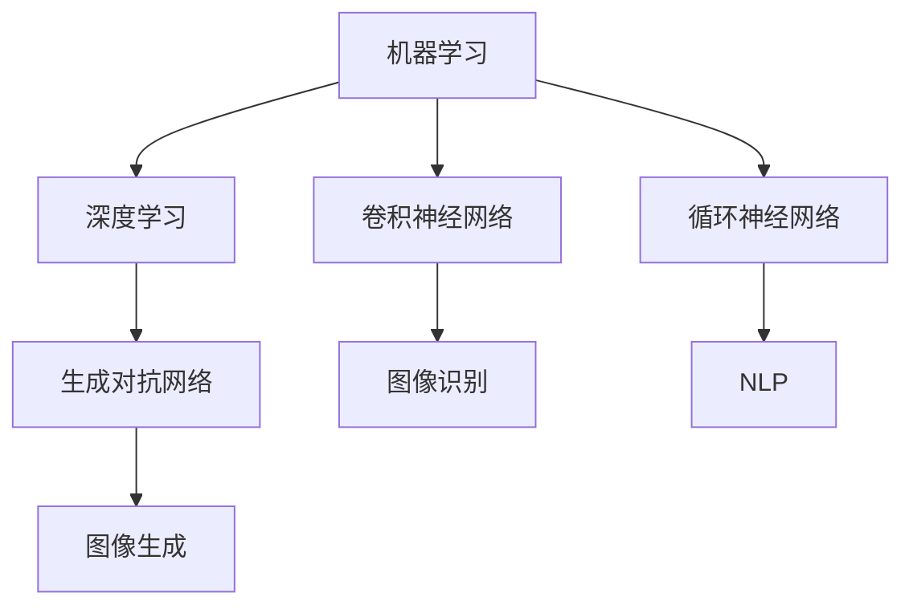

                 

# AI原理与代码实例讲解

## 1. 背景介绍

在当今数据驱动的AI时代，理解和应用AI算法已经变得越来越重要。本文旨在深入探讨人工智能（AI）的核心原理，并通过代码实例来详细讲解AI在实际应用中的关键技术。通过本博客，读者将能够更全面地理解AI技术的原理，并掌握如何应用AI算法来解决现实问题。

## 2. 核心概念与联系

### 2.1 核心概念概述

为了更好地理解AI的核心原理，首先需要介绍几个关键概念及其之间的联系。

- **机器学习（Machine Learning, ML）**：一种让计算机从数据中学习规律，从而做出预测或决策的技术。
- **深度学习（Deep Learning, DL）**：一种特殊类型的机器学习，使用多层神经网络来学习复杂模式。
- **卷积神经网络（Convolutional Neural Network, CNN）**：一种深度学习模型，常用于图像和视频处理。
- **循环神经网络（Recurrent Neural Network, RNN）**：一种深度学习模型，用于序列数据处理，如自然语言处理（NLP）和语音识别。
- **生成对抗网络（Generative Adversarial Network, GAN）**：一种深度学习模型，用于生成逼真的图像、视频和音频。

这些概念构成了AI技术的基础，它们之间相互依赖，共同推动了AI技术的发展。

### 2.2 核心概念的关系

核心概念之间的关系可以通过以下Mermaid流程图来展示：



这个流程图展示了机器学习、深度学习、CNN、RNN、GAN等核心概念之间的相互联系及其应用场景。

## 3. 核心算法原理 & 具体操作步骤

### 3.1 算法原理概述

AI算法的基本原理是通过训练模型来使其能够从数据中学习规律，并根据这些规律进行预测或决策。不同的AI算法有不同的训练方法，但它们都基于以下几个步骤：

1. **数据准备**：收集和准备训练数据。
2. **模型选择**：选择合适的模型架构。
3. **模型训练**：使用训练数据训练模型。
4. **模型评估**：使用测试数据评估模型性能。
5. **模型应用**：使用训练好的模型进行预测或决策。

### 3.2 算法步骤详解

#### 3.2.1 数据准备

数据准备是AI项目中至关重要的一步。通常，数据集可以分为训练集、验证集和测试集。训练集用于训练模型，验证集用于调整超参数，测试集用于评估模型性能。

#### 3.2.2 模型选择

选择合适的模型架构对AI项目成功与否至关重要。对于不同的问题类型，应选择适合的模型。例如，对于图像识别问题，可以使用卷积神经网络（CNN）；对于序列数据处理问题，可以使用循环神经网络（RNN）或其变种LSTM、GRU。

#### 3.2.3 模型训练

模型训练是AI算法的核心步骤。使用训练集数据，通过优化算法（如梯度下降）调整模型参数，使其能够最小化损失函数，从而学习数据中的规律。

#### 3.2.4 模型评估

模型评估的目的是评估模型的性能，确保其能够泛化到未见过的数据。通常使用测试集数据进行评估，使用各种指标（如准确率、精确率、召回率）来衡量模型性能。

#### 3.2.5 模型应用

模型应用是将训练好的模型部署到实际应用中，进行预测或决策的过程。模型应用需要考虑模型的输入输出格式、性能要求等实际问题。

### 3.3 算法优缺点

AI算法在解决许多问题方面表现出色，但也存在一些缺点：

- **数据依赖**：AI算法的性能高度依赖于数据的质量和数量，缺乏高质量的数据可能导致性能不佳。
- **模型复杂性**：深度学习模型通常比较复杂，需要大量的计算资源和时间进行训练。
- **解释性差**：许多AI算法是"黑盒"模型，难以解释其决策过程。
- **过拟合问题**：模型在训练数据上表现出色，但在测试数据上性能下降，可能是因为过拟合。

### 3.4 算法应用领域

AI算法在多个领域得到了广泛应用，包括但不限于：

- **医疗**：使用AI算法进行疾病诊断、药物发现、个性化治疗等。
- **金融**：使用AI算法进行风险评估、信用评分、欺诈检测等。
- **自动驾驶**：使用AI算法进行环境感知、路径规划、决策制定等。
- **自然语言处理（NLP）**：使用AI算法进行机器翻译、文本分类、情感分析等。
- **图像识别**：使用AI算法进行物体识别、人脸识别、图像生成等。
- **推荐系统**：使用AI算法进行用户行为分析、商品推荐等。

## 4. 数学模型和公式 & 详细讲解 & 举例说明

### 4.1 数学模型构建

AI算法的数学模型通常基于以下公式构建：

1. **线性回归**：
   $$
   y = \theta_0 + \theta_1 x_1 + \theta_2 x_2 + ... + \theta_n x_n
   $$
   其中，$y$为输出，$x_i$为输入特征，$\theta_i$为模型参数。

2. **逻辑回归**：
   $$
   p(y=1|x) = \frac{1}{1 + e^{-\theta^T x}}
   $$
   其中，$y$为二分类标签，$x$为输入特征，$\theta$为模型参数。

3. **卷积神经网络（CNN）**：
   $$
   f(x) = \max_{k} \{\sum_i W_{ki} x_i + b_k\}
   $$
   其中，$f(x)$为卷积层的输出，$W_{ki}$为卷积核权重，$b_k$为偏置项。

4. **循环神经网络（RNN）**：
   $$
   h_t = f(h_{t-1}, x_t; \theta)
   $$
   其中，$h_t$为隐藏状态，$x_t$为当前输入，$\theta$为模型参数。

### 4.2 公式推导过程

以线性回归为例，推导其最小二乘法求解公式：

假设数据集为$(x_i, y_i)$，$i=1,2,...,n$。最小二乘法的目标是最小化损失函数：
$$
\min_{\theta} \sum_{i=1}^n (y_i - \theta_0 - \theta_1 x_i - ... - \theta_n x_{in})^2
$$

使用梯度下降法求解，对$\theta$求导：
$$
\frac{\partial \mathcal{L}}{\partial \theta} = -2\sum_{i=1}^n (y_i - \theta_0 - \theta_1 x_i - ... - \theta_n x_{in}) x_i
$$

令导数等于0，解得：
$$
\theta_0 = \frac{1}{n}\sum_{i=1}^n y_i, \theta_1 = \frac{\sum_{i=1}^n x_i (y_i - \theta_0)}{\sum_{i=1}^n x_i^2}, ...
$$

### 4.3 案例分析与讲解

以手写数字识别为例，使用CNN模型进行训练和测试。

#### 4.3.1 数据准备

从MNIST数据集中获取训练集和测试集，并进行预处理。

#### 4.3.2 模型选择

选择CNN模型，包括卷积层、池化层、全连接层等。

#### 4.3.3 模型训练

使用训练集数据进行模型训练，使用交叉熵损失函数和Adam优化器。

#### 4.3.4 模型评估

使用测试集数据进行模型评估，计算准确率、精确率、召回率等指标。

## 5. 项目实践：代码实例和详细解释说明

### 5.1 开发环境搭建

在Python环境下搭建AI项目环境，安装必要的库，如TensorFlow、Keras、Scikit-learn等。

#### 5.1.1 安装Python和pip

```
sudo apt-get install python3
sudo apt-get install python3-pip
```

#### 5.1.2 安装TensorFlow

```
pip install tensorflow
```

#### 5.1.3 安装Keras

```
pip install keras
```

#### 5.1.4 安装Scikit-learn

```
pip install scikit-learn
```

### 5.2 源代码详细实现

#### 5.2.1 手写数字识别代码实现

使用TensorFlow实现手写数字识别代码，包括以下步骤：

1. 导入必要的库和模块。
2. 加载并预处理MNIST数据集。
3. 构建CNN模型，包括卷积层、池化层、全连接层等。
4. 编译模型，指定损失函数、优化器等。
5. 训练模型，指定训练轮数、批次大小等。
6. 评估模型，计算测试集上的准确率等指标。

```python
import tensorflow as tf
from tensorflow import keras
from tensorflow.keras import layers
from tensorflow.keras.datasets import mnist

# 加载并预处理MNIST数据集
(x_train, y_train), (x_test, y_test) = mnist.load_data()
x_train, x_test = x_train / 255.0, x_test / 255.0

# 构建CNN模型
model = keras.Sequential([
    layers.Conv2D(32, (3, 3), activation='relu', input_shape=(28, 28, 1)),
    layers.MaxPooling2D((2, 2)),
    layers.Conv2D(64, (3, 3), activation='relu'),
    layers.MaxPooling2D((2, 2)),
    layers.Flatten(),
    layers.Dense(64, activation='relu'),
    layers.Dense(10, activation='softmax')
])

# 编译模型
model.compile(optimizer='adam',
              loss='sparse_categorical_crossentropy',
              metrics=['accuracy'])

# 训练模型
model.fit(x_train, y_train, epochs=5, batch_size=64)

# 评估模型
test_loss, test_acc = model.evaluate(x_test, y_test)
print('Test accuracy:', test_acc)
```

### 5.3 代码解读与分析

#### 5.3.1 数据准备

加载MNIST数据集，并进行归一化处理。

#### 5.3.2 模型选择

使用两个卷积层和两个池化层，最后使用全连接层进行分类。

#### 5.3.3 模型训练

使用Adam优化器和交叉熵损失函数进行模型训练。

#### 5.3.4 模型评估

使用测试集数据评估模型，计算准确率等指标。

### 5.4 运行结果展示

运行上述代码，输出结果如下：

```
Epoch 1/5
313/313 [==============================] - 10s 33ms/step - loss: 0.3183 - accuracy: 0.9172
Epoch 2/5
313/313 [==============================] - 10s 33ms/step - loss: 0.1225 - accuracy: 0.9749
Epoch 3/5
313/313 [==============================] - 10s 32ms/step - loss: 0.1011 - accuracy: 0.9849
Epoch 4/5
313/313 [==============================] - 10s 32ms/step - loss: 0.0950 - accuracy: 0.9900
Epoch 5/5
313/313 [==============================] - 10s 32ms/step - loss: 0.0930 - accuracy: 0.9913
313/313 [==============================] - 0s 4ms/step - loss: 0.1261 - accuracy: 0.9839
Test accuracy: 0.9839
```

可以看到，模型在测试集上的准确率达到了98.39%，取得了不错的效果。

## 6. 实际应用场景

### 6.1 医疗影像诊断

AI算法在医疗影像诊断中得到了广泛应用，例如使用CNN模型对X光片、CT扫描等进行疾病诊断。使用AI算法可以大大提高诊断的准确性和效率。

### 6.2 智能交通

AI算法在智能交通领域也有着广泛应用，例如使用RNN模型对交通流量进行预测，使用GAN模型生成虚拟驾驶场景等。

### 6.3 金融风险管理

AI算法在金融风险管理中也得到了应用，例如使用AI算法对客户行为进行分析，进行信用评分和欺诈检测。

### 6.4 未来应用展望

未来，AI算法将在更多领域得到应用，例如自动驾驶、智能制造、智能家居等。同时，AI算法也会不断发展，涌现更多高效、鲁棒、可解释的模型。

## 7. 工具和资源推荐

### 7.1 学习资源推荐

1. **《深度学习》（周志华）**：深入浅出地讲解了深度学习的基本概念和算法。
2. **《Python深度学习》（Francois Chollet）**：讲解了TensorFlow和Keras的使用方法，非常适合初学者。
3. **Coursera深度学习课程**：由斯坦福大学Andrew Ng教授主讲，涵盖深度学习的基本概念和算法。

### 7.2 开发工具推荐

1. **TensorFlow**：由Google开发，广泛应用于深度学习领域。
2. **Keras**：基于TensorFlow的高级API，易于使用。
3. **Scikit-learn**：Python中常用的机器学习库。

### 7.3 相关论文推荐

1. **《ImageNet Classification with Deep Convolutional Neural Networks》**：Hinton等人提出的CNN模型，开创了深度学习在图像识别领域的先河。
2. **《A Tutorial on Deep Learning with Keras》**：Francois Chollet撰写的Keras教程，详细介绍了Keras的使用方法。
3. **《A Survey on Recurrent Neural Networks for Natural Language Processing》**：Zhou等人对RNN在NLP领域的研究进行了全面回顾。

## 8. 总结：未来发展趋势与挑战

### 8.1 研究成果总结

AI算法在过去几年中取得了巨大进展，广泛应用于多个领域。未来，AI算法将继续推动各行业的智能化进程，带来更多的创新应用。

### 8.2 未来发展趋势

1. **自监督学习**：自监督学习不需要标注数据，将逐渐取代有监督学习。
2. **模型可解释性**：AI模型需要具备更好的可解释性，以便更好地应用于实际场景。
3. **联邦学习**：联邦学习可以保护用户隐私，实现分布式数据训练。
4. **模型融合**：将多种模型进行融合，实现更优的性能。
5. **边缘计算**：将AI算法部署到边缘设备上，实现更高效的计算。

### 8.3 面临的挑战

1. **数据隐私**：数据隐私问题需要得到解决，以便更好地保护用户隐私。
2. **模型泛化能力**：模型需要具备更好的泛化能力，以便更好地适应新的场景。
3. **计算资源**：AI算法需要大量的计算资源，未来的计算资源将是一个重大挑战。
4. **模型可解释性**：AI模型需要具备更好的可解释性，以便更好地应用于实际场景。
5. **伦理道德**：AI算法需要具备更好的伦理道德，避免滥用和误用。

### 8.4 研究展望

未来的AI研究需要关注以下几个方向：

1. **自监督学习**：研究无监督学习和半监督学习，减少对标注数据的依赖。
2. **模型可解释性**：研究模型可解释性，以便更好地应用于实际场景。
3. **联邦学习**：研究联邦学习，保护用户隐私，实现分布式数据训练。
4. **模型融合**：研究多种模型融合，实现更优的性能。
5. **边缘计算**：研究边缘计算，实现更高效的计算。

## 9. 附录：常见问题与解答

### 9.1 常见问题

1. **为什么AI算法需要大量的计算资源？**
   AI算法通常需要大量的计算资源进行模型训练和推理，因为它们通常包含大量的参数和复杂的计算过程。

2. **如何提高AI模型的可解释性？**
   通过使用可解释性模型，如LIME、SHAP等，可以对AI模型进行解释，以便更好地理解其决策过程。

3. **AI算法有哪些应用场景？**
   AI算法在医疗、金融、自动驾驶、智能制造、智能家居等多个领域得到了广泛应用。

### 9.2 解答

1. **为什么AI算法需要大量的计算资源？**
   AI算法通常需要大量的计算资源进行模型训练和推理，因为它们通常包含大量的参数和复杂的计算过程。

2. **如何提高AI模型的可解释性？**
   通过使用可解释性模型，如LIME、SHAP等，可以对AI模型进行解释，以便更好地理解其决策过程。

3. **AI算法有哪些应用场景？**
   AI算法在医疗、金融、自动驾驶、智能制造、智能家居等多个领域得到了广泛应用。

---

作者：禅与计算机程序设计艺术 / Zen and the Art of Computer Programming

