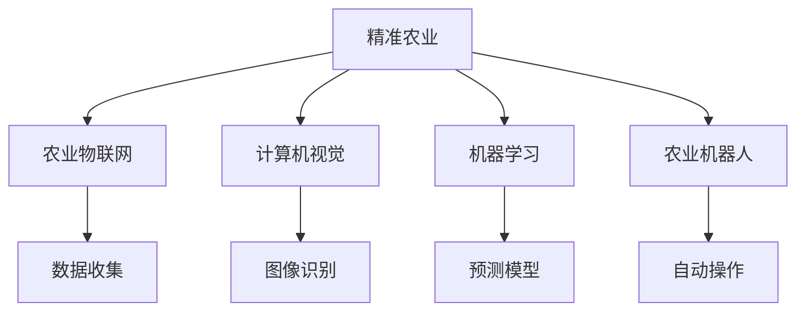
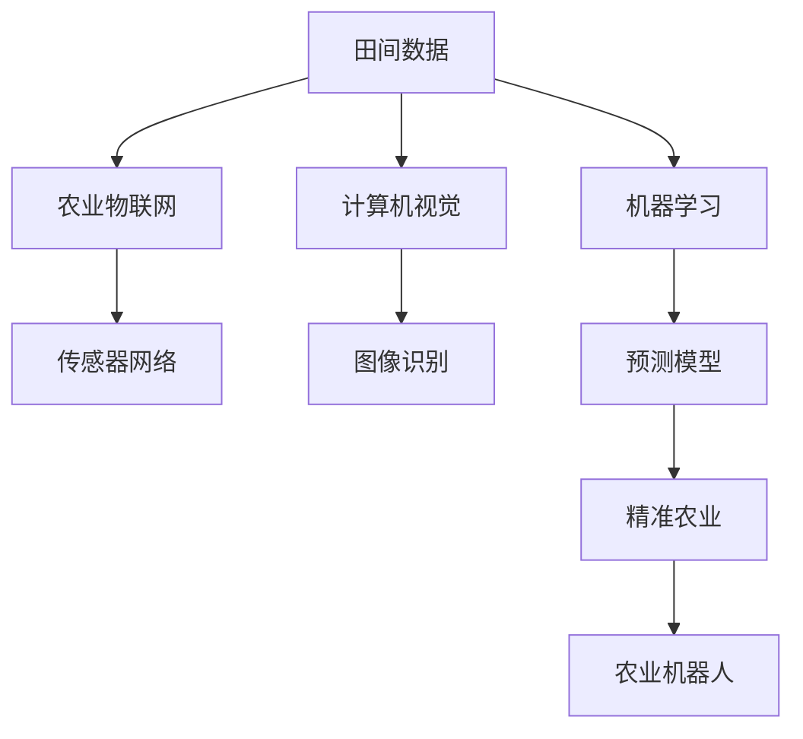

                 

## 1. 背景介绍

### 1.1 问题由来
近年来，人工智能（AI）技术在农业中的应用日益广泛，推动了精准农业（Precision Agriculture）的发展。精准农业是利用先进的信息技术和管理方法，对农作物生长、土壤条件、气象数据等进行精确监测和分析，从而实现科学化、定制化的农业生产。人工智能技术，尤其是机器学习、计算机视觉、传感器网络等，在精准农业中扮演了重要角色。

### 1.2 问题核心关键点
精准农业的关键在于通过数据分析和机器学习模型，实现对农业生产各环节的精准管理。主要包括以下几个方面：

- 农业物联网（IoT）：通过传感器网络收集田间数据，包括土壤湿度、温度、光照、气象等，为农业生产提供实时监控。
- 计算机视觉：利用图像识别技术，识别作物病虫害、生长状态、产量等，辅助农作物管理。
- 机器学习：通过历史数据和实时数据，训练预测模型，实现对农作物生长、病虫害预警、产量预测等功能。
- 农业机器人：基于自主导航和智能控制，实现自动播种、施肥、喷药、收割等农业操作。

### 1.3 问题研究意义
精准农业的广泛应用，对于提高农业生产效率、减少资源浪费、保障食品安全、实现可持续发展具有重要意义：

1. **提升生产效率**：通过数据分析和智能化管理，优化种植方案，提高作物产量和品质。
2. **节约资源**：精确施肥、灌溉、喷洒农药，减少化肥、水、农药的滥用。
3. **保障食品安全**：通过精准管理，减少农药残留，提高食品安全性。
4. **应对气候变化**：实时监测气候变化，调整种植计划，适应极端天气。
5. **可持续发展**：促进农业生产与环境保护的协调，实现绿色农业。

## 2. 核心概念与联系

### 2.1 核心概念概述

为更好地理解AI在农业中的应用，本节将介绍几个密切相关的核心概念：

- **精准农业**：利用AI技术对农业生产进行精确监测和分析，实现科学化管理。
- **农业物联网（IoT）**：通过传感器网络收集田间数据，实现实时监控和智能管理。
- **计算机视觉**：利用图像识别技术，识别作物生长状态、病虫害等，辅助决策。
- **机器学习**：通过历史数据和实时数据，训练预测模型，实现农作物生长、病虫害预警等功能。
- **农业机器人**：基于自主导航和智能控制，实现自动化农业操作。

### 2.2 概念间的关系

这些核心概念之间的逻辑关系可以通过以下Mermaid流程图来展示：



这个流程图展示了大语言模型微调过程中各个核心概念的关系和作用：

1. 精准农业是整个农业生产管理的高级目标。
2. 农业物联网通过传感器网络收集田间数据，为精准农业提供实时监控。
3. 计算机视觉利用图像识别技术，辅助精准农业对作物生长状态、病虫害等进行识别。
4. 机器学习通过历史和实时数据训练预测模型，实现对农作物生长、病虫害预警等功能的精确预测。
5. 农业机器人基于自主导航和智能控制，实现自动化农业操作。

### 2.3 核心概念的整体架构

最后，我们用一个综合的流程图来展示这些核心概念在大语言模型微调过程中的整体架构：



这个综合流程图展示了从田间数据采集到精准农业管理的完整过程。传感器网络收集田间数据，计算机视觉进行图像识别，机器学习训练预测模型，农业机器人实现自动化操作，共同构成了精准农业的技术体系。

## 3. 核心算法原理 & 具体操作步骤
### 3.1 算法原理概述

AI在农业中的应用主要基于监督学习和无监督学习的原理。其核心思想是利用历史数据和实时数据，训练机器学习模型，辅助农业生产决策。

### 3.2 算法步骤详解

基于监督学习和无监督学习的AI在农业中的应用一般包括以下几个关键步骤：

**Step 1: 数据准备**
- 收集田间数据，包括土壤湿度、温度、光照、气象等。
- 收集历史作物数据，如生长周期、产量、病虫害等。
- 对数据进行预处理，如清洗、归一化、降维等。

**Step 2: 模型选择和训练**
- 选择合适的机器学习模型，如回归模型、分类模型、聚类模型等。
- 将准备好的数据分为训练集和验证集，用于模型训练和参数调优。
- 使用训练集训练模型，通过验证集调整模型参数。

**Step 3: 模型应用**
- 将训练好的模型应用于实时数据，进行预测和决策。
- 对模型输出进行后处理，如阈值处理、平滑处理等，得到最终的决策结果。

**Step 4: 结果验证**
- 在测试集上验证模型的性能，如准确率、召回率、F1分数等。
- 分析模型预测结果与实际结果的差异，进行误差分析和改进。

### 3.3 算法优缺点

AI在农业中的应用具有以下优点：

1. **提高生产效率**：通过数据分析和智能化管理，优化种植方案，提高作物产量和品质。
2. **节约资源**：精确施肥、灌溉、喷洒农药，减少化肥、水、农药的滥用。
3. **保障食品安全**：通过精准管理，减少农药残留，提高食品安全性。
4. **应对气候变化**：实时监测气候变化，调整种植计划，适应极端天气。
5. **可持续发展**：促进农业生产与环境保护的协调，实现绿色农业。

同时，AI在农业中也存在以下缺点：

1. **数据质量问题**：农业数据采集往往受到环境干扰，数据质量不高。
2. **模型复杂度**：农业问题复杂多变，单一模型难以处理。
3. **设备成本高**：农业机器人、传感器等设备价格较高，初期投资大。
4. **技术壁垒**：需要专业的技术人员进行模型部署和维护，技术门槛较高。
5. **模型解释性差**：机器学习模型的决策过程复杂，难以解释和理解。

尽管存在这些局限性，但AI在农业中的应用前景广阔，将在未来农业生产中扮演越来越重要的角色。

### 3.4 算法应用领域

AI在农业中的应用涵盖了多个领域，以下是几个典型的应用场景：

**1. 智能灌溉系统**
- 利用传感器网络监测土壤湿度和气象条件，智能调整灌溉策略。
- 通过机器学习模型，预测未来的天气和作物需求，优化灌溉方案。

**2. 作物生长监测**
- 利用无人机和相机采集田间图像，通过计算机视觉技术识别作物生长状态和病虫害。
- 通过历史数据和实时数据训练模型，预测作物生长周期和产量。

**3. 精准施肥和喷药**
- 利用土壤传感器监测土壤养分，智能调整施肥方案。
- 利用无人机和传感器监测病虫害，智能喷药。

**4. 农业机器人**
- 利用自主导航和智能控制技术，实现自动播种、施肥、喷药、收割等操作。
- 通过机器视觉和环境感知，提高机器人的作业精度和效率。

**5. 农场管理**
- 利用数据分析和管理软件，实现农场的生产、存储、物流等环节的智能化管理。
- 通过预测模型，优化农场的生产计划和资源配置。

## 4. 数学模型和公式 & 详细讲解 & 举例说明（备注：数学公式请使用latex格式，latex嵌入文中独立段落使用 $$，段落内使用 $)
### 4.1 数学模型构建

我们以智能灌溉系统为例，构建一个基于监督学习的预测模型。设 $X$ 为输入变量，$Y$ 为输出变量，则预测模型的数学模型为：

$$
Y = f(X; \theta)
$$

其中，$f$ 为模型函数，$\theta$ 为模型参数。

### 4.2 公式推导过程

以线性回归模型为例，推导其预测函数和损失函数：

假设 $X$ 为 $n$ 个样本的特征向量，$Y$ 为 $n$ 个样本的输出向量，则线性回归模型的预测函数为：

$$
Y = \beta_0 + \beta_1 X_1 + \beta_2 X_2 + ... + \beta_p X_p
$$

其中，$\beta_0$ 为截距，$\beta_1, \beta_2, ..., \beta_p$ 为线性系数。

线性回归模型的损失函数为：

$$
L(\theta) = \frac{1}{2} \sum_{i=1}^n (y_i - f(x_i; \theta))^2
$$

其中，$(y_i, x_i)$ 为训练集中的样本，$f(x_i; \theta)$ 为模型预测值。

通过最小化损失函数 $L(\theta)$，可以求得模型参数 $\theta$ 的最优值。

### 4.3 案例分析与讲解

假设我们有一个智能灌溉系统，需要根据土壤湿度、温度和降雨量，预测最佳的灌溉策略。具体步骤如下：

1. 数据准备：收集历史灌溉数据和土壤传感器数据。
2. 模型选择：选择线性回归模型。
3. 模型训练：将数据分为训练集和验证集，使用训练集训练模型，通过验证集调整参数。
4. 模型应用：将训练好的模型应用于实时数据，预测最佳的灌溉量。
5. 结果验证：在测试集上验证模型的性能，分析误差原因，进行改进。

## 5. 项目实践：代码实例和详细解释说明
### 5.1 开发环境搭建

在进行AI在农业中的应用项目实践前，我们需要准备好开发环境。以下是使用Python进行AI开发的环境配置流程：

1. 安装Anaconda：从官网下载并安装Anaconda，用于创建独立的Python环境。

2. 创建并激活虚拟环境：
```bash
conda create -n ai-env python=3.8 
conda activate ai-env
```

3. 安装必要的Python包：
```bash
pip install numpy pandas scikit-learn matplotlib seaborn jupyter notebook ipython
```

4. 安装TensorFlow和Keras：
```bash
pip install tensorflow==2.0.0 keras
```

5. 安装其他相关包：
```bash
pip install opencv-python tensorflow-gpu
```

完成上述步骤后，即可在`ai-env`环境中开始AI在农业中的应用项目实践。

### 5.2 源代码详细实现

下面以智能灌溉系统为例，给出使用TensorFlow和Keras进行AI在农业中的应用开发的Python代码实现。

```python
import tensorflow as tf
from tensorflow.keras.models import Sequential
from tensorflow.keras.layers import Dense
from tensorflow.keras.optimizers import Adam
import numpy as np
import pandas as pd

# 数据准备
data = pd.read_csv('irrigation_data.csv')
X = data[['soil_moisture', 'temperature', 'rainfall']]
y = data['irrigation']

# 模型构建
model = Sequential()
model.add(Dense(32, input_dim=3, activation='relu'))
model.add(Dense(1, activation='sigmoid'))

# 模型编译
model.compile(loss='binary_crossentropy', optimizer=Adam(learning_rate=0.001), metrics=['accuracy'])

# 模型训练
model.fit(X, y, epochs=100, batch_size=32, validation_split=0.2)

# 模型评估
test_data = pd.read_csv('test_irrigation_data.csv')
X_test = test_data[['soil_moisture', 'temperature', 'rainfall']]
y_test = test_data['irrigation']
loss, acc = model.evaluate(X_test, y_test, verbose=0)
print('Test accuracy:', acc)

# 模型应用
# 假设获取到新的土壤湿度、温度和降雨量数据
new_data = np.array([[70, 25, 10]])
predicted_irrigation = model.predict(new_data)
if predicted_irrigation[0] > 0.5:
    print('推荐灌溉')
else:
    print('无需灌溉')
```

以上代码实现了基于监督学习的智能灌溉系统的模型训练和预测功能。具体步骤如下：

1. 数据准备：使用Pandas库读取历史灌溉数据，将其分为输入变量 $X$ 和输出变量 $y$。
2. 模型构建：使用Keras构建一个简单的神经网络模型，包含一个隐藏层和一个输出层。
3. 模型编译：设置损失函数、优化器和评估指标。
4. 模型训练：使用训练数据训练模型，并通过验证集调整超参数。
5. 模型评估：在测试集上评估模型性能，计算准确率。
6. 模型应用：对新的数据进行预测，推荐灌溉策略。

### 5.3 代码解读与分析

让我们再详细解读一下关键代码的实现细节：

**数据准备**：
- 使用Pandas库读取数据文件，并将数据分为输入变量 $X$ 和输出变量 $y$。

**模型构建**：
- 使用Keras构建一个简单的神经网络模型，包含一个隐藏层和一个输出层。隐藏层使用ReLU激活函数，输出层使用sigmoid激活函数，适合二分类问题。

**模型编译**：
- 设置损失函数为二分类交叉熵，优化器为Adam，学习率为0.001。

**模型训练**：
- 使用训练数据训练模型，通过验证集调整超参数。epochs参数表示训练轮数，batch_size参数表示每个批次的大小。

**模型评估**：
- 使用测试集评估模型性能，计算准确率。

**模型应用**：
- 假设获取到新的土壤湿度、温度和降雨量数据，使用模型进行预测。如果预测结果大于0.5，则推荐灌溉。

可以看到，TensorFlow和Keras使得AI在农业中的应用开发变得简洁高效。开发者可以将更多精力放在数据处理、模型改进等高层逻辑上，而不必过多关注底层的实现细节。

## 6. 实际应用场景

### 6.1 智能灌溉系统

智能灌溉系统是AI在农业中的经典应用之一。传统灌溉方式往往依赖人工经验和天气预报，容易出现过度或不足灌溉的问题。智能灌溉系统通过传感器网络监测土壤湿度、温度和降雨量，利用AI模型预测最佳的灌溉策略，实现精确灌溉，提高水资源利用效率。

具体实现如下：

1. 在田间部署传感器网络，监测土壤湿度、温度、降雨量等数据。
2. 收集历史灌溉数据，构建预测模型。
3. 将预测模型应用于实时数据，推荐灌溉策略。
4. 通过移动端或农场管理软件，展示灌溉策略和实时数据。

### 6.2 作物生长监测

作物生长监测是AI在农业中的另一个重要应用。传统人工监测作物生长状态耗时耗力，难以及时发现病虫害。通过无人机和相机采集田间图像，利用计算机视觉技术，实时监测作物生长状态和病虫害，辅助农业生产决策。

具体实现如下：

1. 使用无人机或相机采集田间图像。
2. 使用计算机视觉技术，如图像分割、目标检测等，识别作物生长状态和病虫害。
3. 通过历史数据和实时数据训练预测模型，预测作物生长周期和产量。
4. 通过农场管理软件，展示监测结果和预测结果，辅助决策。

### 6.3 精准施肥和喷药

精准施肥和喷药是农业生产中的重要环节。传统施肥和喷药方式往往依赖经验，容易出现过量或不足的问题。通过土壤传感器和无人机监测土壤养分和病虫害，利用AI模型预测最佳的施肥和喷药方案，实现精准施肥和喷药。

具体实现如下：

1. 使用土壤传感器监测土壤养分和pH值。
2. 使用无人机监测田间病虫害。
3. 通过历史数据和实时数据训练预测模型，预测最佳的施肥和喷药方案。
4. 通过农业机器人或无人机，实现精准施肥和喷药。

### 6.4 未来应用展望

随着AI技术的不断发展，未来农业中将涌现更多AI应用。以下是几个未来应用的展望：

**1. 智能施肥系统**
- 利用传感器网络监测土壤养分，智能调整施肥方案。
- 通过机器学习模型，预测未来的土壤养分需求，优化施肥策略。

**2. 病虫害预测和防治**
- 利用无人机和传感器监测病虫害，智能预警。
- 通过机器学习模型，预测病虫害爆发趋势，提前防治。

**3. 智能农机自动化**
- 利用农业机器人，实现自动播种、施肥、喷药、收割等操作。
- 通过机器视觉和环境感知，提高农机作业的精度和效率。

**4. 农场管理智能化**
- 利用数据分析和管理软件，实现农场的生产、存储、物流等环节的智能化管理。
- 通过预测模型，优化农场的生产计划和资源配置。

## 7. 工具和资源推荐

### 7.1 学习资源推荐

为了帮助开发者系统掌握AI在农业中的应用理论基础和实践技巧，这里推荐一些优质的学习资源：

1. **《深度学习》教材**：Ian Goodfellow、Yoshua Bengio和Aaron Courville合著的经典教材，系统介绍了深度学习的理论基础和应用实践。

2. **Coursera《深度学习专项课程》**：由DeepLearning.AI团队开设的深度学习课程，涵盖深度学习的基础知识和应用案例。

3. **Kaggle农业数据竞赛**：Kaggle平台上提供的农业数据竞赛，通过实际数据集训练AI模型，解决农业问题。

4. **GitHub开源项目**：在GitHub上Star、Fork数最多的农业AI项目，如TensorFlow农业应用、PyTorch农业应用等，提供大量代码实现和解决方案。

5. **农业科研论文**：农业领域的顶级会议和期刊，如AGM、PAA、Plant Science等，提供最新研究和实践成果。

通过这些资源的学习实践，相信你一定能够快速掌握AI在农业中的应用精髓，并用于解决实际的农业问题。

### 7.2 开发工具推荐

高效的开发离不开优秀的工具支持。以下是几款用于AI在农业中的应用开发的常用工具：

1. **TensorFlow**：由Google主导开发的开源深度学习框架，生产部署方便，适合大规模工程应用。

2. **Keras**：Keras提供了高层API，方便开发者快速搭建深度学习模型。

3. **PyTorch**：Facebook开发的开源深度学习框架，灵活高效，适合研究开发。

4. **Pandas**：用于数据处理和分析的Python库，提供了强大的数据处理和可视化功能。

5. **Scikit-learn**：用于机器学习算法的Python库，提供了丰富的机器学习算法和工具。

6. **Seaborn**：用于数据可视化的Python库，提供了美观、易用的数据可视化工具。

合理利用这些工具，可以显著提升AI在农业中的应用开发效率，加快创新迭代的步伐。

### 7.3 相关论文推荐

AI在农业中的应用源于学界的持续研究。以下是几篇奠基性的相关论文，推荐阅读：

1. **《基于深度学习的农业物联网系统》**：介绍了如何利用深度学习技术构建农业物联网系统，实现精准农业。

2. **《农业机器人与计算机视觉技术》**：探讨了农业机器人与计算机视觉技术在智能农业中的应用，展示了最新的研究成果。

3. **《机器学习在农作物病虫害预测中的应用》**：介绍了机器学习技术在农作物病虫害预测中的应用，展示了最新模型和算法。

4. **《深度学习在智能灌溉系统中的应用》**：介绍了深度学习技术在智能灌溉系统中的应用，展示了最新的研究成果。

5. **《农业大数据分析与决策支持系统》**：介绍了如何利用大数据技术实现农业生产管理的智能化决策支持系统。

这些论文代表了大语言模型微调技术的发展脉络。通过学习这些前沿成果，可以帮助研究者把握学科前进方向，激发更多的创新灵感。

除上述资源外，还有一些值得关注的前沿资源，帮助开发者紧跟AI在农业中的应用技术的最新进展，例如：

1. **arXiv论文预印本**：人工智能领域最新研究成果的发布平台，包括大量尚未发表的前沿工作，学习前沿技术的必读资源。

2. **顶级会议和期刊**：如IEEE Transactions on Neural Networks and Learning Systems、IEEE Journal of Selected Topics in Signal Processing等，提供最新研究和实践成果。

3. **顶会直播**：如ICML、NIPS、CVPR等人工智能领域顶会现场或在线直播，能够聆听到大佬们的前沿分享，开拓视野。

4. **GitHub热门项目**：在GitHub上Star、Fork数最多的AI在农业应用项目，如TensorFlow农业应用、PyTorch农业应用等，提供大量代码实现和解决方案。

5. **行业分析报告**：各大咨询公司如McKinsey、PwC等针对农业领域的分析报告，有助于从商业视角审视技术趋势，把握应用价值。

总之，对于AI在农业中的应用的学习和实践，需要开发者保持开放的心态和持续学习的意愿。多关注前沿资讯，多动手实践，多思考总结，必将收获满满的成长收益。

## 8. 总结：未来发展趋势与挑战

### 8.1 总结

本文对AI在农业中的应用进行了全面系统的介绍。首先阐述了AI在农业中的应用背景和研究意义，明确了AI在农业中的应用对提高生产效率、节约资源、保障食品安全、实现可持续发展等方面的重要作用。其次，从原理到实践，详细讲解了AI在农业中的应用数学原理和关键步骤，给出了AI在农业中的应用项目开发的完整代码实例。同时，本文还广泛探讨了AI在农业中的应用前景和挑战，展示了AI在农业中的广阔前景和巨大潜力。

通过本文的系统梳理，可以看到，AI在农业中的应用不仅在技术上取得了巨大突破，而且在实际应用中展现了巨大的商业价值和社会意义。未来，伴随AI技术的进一步发展，AI在农业中的应用将更加广泛和深入，为农业生产带来革命性的变化。

### 8.2 未来发展趋势

展望未来，AI在农业中的应用将呈现以下几个发展趋势：

1. **技术融合加速**：AI与物联网、区块链、大数据等技术的融合，将进一步提升农业智能化水平，实现全链条数字化管理。

2. **模型轻量化**：为了适应农业设备的资源限制，未来将开发更多轻量级、高效的AI模型，实现低成本、高效率的应用。

3. **决策支持智能化**：通过AI技术，构建农业决策支持系统，辅助农业生产管理，提高决策的科学性和精准性。

4. **精准农业深化**：利用AI技术，实现对农业生产的精准管理，提高资源利用效率，实现绿色农业。

5. **知识图谱应用**：将农业领域的专家知识、规则、经验等整合到知识图谱中，实现知识驱动的智能农业。

以上趋势凸显了AI在农业中的应用前景。这些方向的探索发展，将进一步推动农业生产方式的变革，实现农业生产的高效、智能、绿色。

### 8.3 面临的挑战

尽管AI在农业中的应用前景广阔，但在迈向更加智能化、普适化应用的过程中，它仍面临诸多挑战：

1. **数据质量和多样性**：农业数据采集受到环境干扰，数据质量不高。不同作物、不同地区的差异性大，数据多样性复杂。

2. **技术复杂度**：农业问题复杂多变，单一模型难以处理。农业设备智能化水平较低，对技术要求高。

3. **模型可解释性**：AI模型的决策过程复杂，难以解释和理解。对高风险农业应用，模型的可解释性和可审计性尤为重要。

4. **技术成本**：AI技术在农业中的应用初期投资大，设备成本高。技术实施和维护需要专业知识，技术门槛高。

5. **伦理和安全**：AI模型可能学习到有偏见、有害的信息，通过微调传递到下游任务，产生误导性、歧视性的输出，给实际应用带来安全隐患。

6. **生态系统建设**：农业AI技术需要与现有的农业生态系统协同工作，如传感器网络、农业机器人、农业设备等，实现全链条智能化管理。

正视AI在农业中的应用面临的这些挑战，积极应对并寻求突破，将是大语言模型微调技术迈向成熟的必由之路。相信随着学界和产业界的共同努力，这些挑战终将一一被克服，AI在农业中的应用必将在构建智能农业中扮演越来越重要的角色。

### 8.4 研究展望

面对AI在农业应用中的挑战，未来的研究需要在以下几个方面寻求新的突破：

1. **数据采集和处理**：开发更多高精度、低成本的农业传感器，提高数据采集的精度和效率。改进数据预处理和特征提取方法，提高数据质量。

2. **模型多样性**：开发更多多模态、多任务学习的AI模型，提高模型的泛化能力和适应性。

3. **模型可解释性**：引入因果分析、对比学习等方法，增强AI模型的决策过程的解释性。引入专家知识，建立模型与领域知识的融合机制。

4. **知识图谱应用**：构建农业领域的知识图谱，将专家知识、规则、经验等整合到知识图谱中，实现知识驱动的智能农业。

5. **伦理和安全**：在模型训练和应用过程中，引入伦理导向的评估指标，过滤和惩罚有偏见、有害的输出倾向。加强模型和数据的安全性保障，确保数据和模型的安全。

6. **生态系统建设**：开发更多的农业智能设备和系统，实现农业设备的智能化管理。建立农业AI技术的标准和规范，实现技术与生态系统的协同工作。

这些研究方向的探索，必将引领AI在农业中的应用技术迈向更高的

