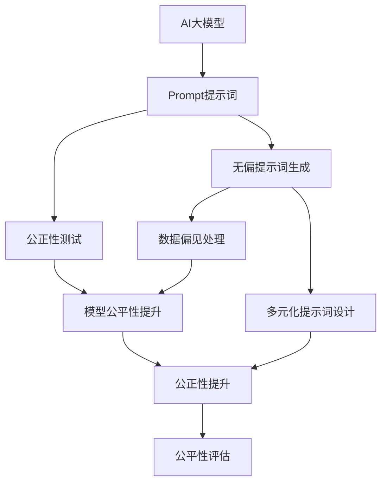
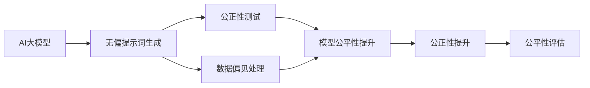
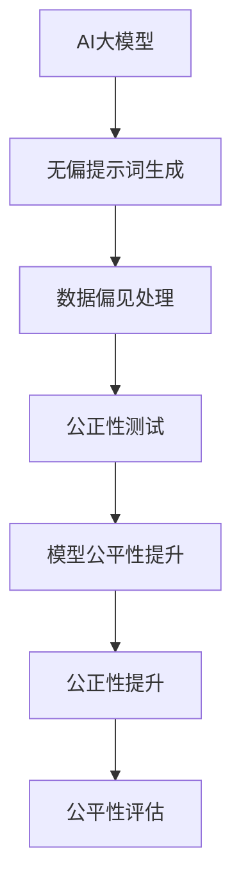

                 

# AI大模型Prompt提示词最佳实践：确保回答没有偏见

> 关键词：AI大模型,Prompt提示词,Bias偏见,公平性,公正性,多元化,多样性,公正性测试,数据偏见,模型公平性

## 1. 背景介绍

### 1.1 问题由来

随着人工智能（AI）和自然语言处理（NLP）技术的快速发展，大语言模型（Large Language Models, LLMs）在诸多领域如问答系统、对话系统、翻译、摘要生成等取得了显著的进步。这些模型通常使用海量无标签数据进行预训练，以学习通用的语言知识和表示，然后通过下游任务上的微调，进行特定任务的优化。

然而，这些大语言模型面临的一个重要问题是偏见问题，即在训练数据中存在的历史和系统性偏见可能导致模型生成有偏见或歧视性的回答。例如，模型可能倾向于支持或反对特定群体、性别、种族等，这在医疗、法律、金融等行业中可能引发严重的伦理和法律问题。

因此，如何在模型训练和微调过程中确保回答无偏见，成为当前AI研究中的热门话题。本文将详细探讨大语言模型Prompt提示词的最佳实践，确保回答无偏见，促进模型公正性、公平性和多元化。

### 1.2 问题核心关键点

在AI大模型中，Prompt提示词的生成和优化是确保模型回答公正性的关键。提示词为模型提供了上下文信息，引导模型生成特定的回答。

为此，本文将聚焦于大语言模型Prompt提示词的最佳实践，包括：

1. **无偏提示词的生成**：确保提示词不包含任何偏见，且能够代表多样化的语境和人群。
2. **公正性测试**：通过多种公正性测试方法，评估和改进模型回答的公正性。
3. **数据偏见处理**：处理训练数据中的偏见，减少模型输出中的偏见。
4. **模型公平性提升**：通过模型层面的调整，提升模型的公平性。
5. **多元化提示词设计**：设计多样化的提示词，涵盖不同的语境和人群。

本文将通过详细的理论讲解、数学模型推导和实践案例，提供切实可行的提示词最佳实践策略，帮助开发者和研究者确保AI大模型的回答无偏见，促进AI技术的公平性和公正性。

## 2. 核心概念与联系

### 2.1 核心概念概述

为更好地理解AI大模型Prompt提示词的最佳实践，本节将介绍几个密切相关的核心概念：

1. **AI大模型**：以自回归（如GPT-3）或自编码（如BERT）模型为代表的大型预训练语言模型。通过在大规模无标签文本数据上进行预训练，学习通用的语言表示，具备强大的语言理解和生成能力。

2. **Prompt提示词**：引导AI大模型进行特定推理和生成任务的文本模板。通常包括任务描述和输入示例。

3. **Bias偏见**：指在数据、算法或模型中存在的任何不公平或歧视性的倾向。

4. **公平性（Fairness）**：指在处理数据和生成回答时，保证所有群体、性别、种族等不受不公平对待。

5. **公正性（Bias Mitigation）**：指通过各种方法减少或消除模型中的偏见，确保模型行为的公正性。

6. **公正性测试（Bias Mitigation Testing）**：用于评估和改进模型公正性的方法，包括统计测试、对抗性测试等。

7. **数据偏见处理（Data Bias Mitigation）**：处理训练数据中的偏见，减少模型输出中的偏见。

8. **模型公平性提升（Model Fairness Enhancement）**：通过模型层面的调整，提升模型的公平性。

这些核心概念之间的逻辑关系可以通过以下Mermaid流程图来展示：



这个流程图展示了大语言模型Prompt提示词的最佳实践涉及的核心概念及其之间的关系：

1. 大语言模型通过无偏的提示词生成，处理数据偏见，提升模型公平性。
2. 通过公正性测试评估模型性能，反馈改进。
3. 设计多样化的提示词，确保模型回答公正性。
4. 综合提升模型公平性，确保回答无偏见。

这些概念共同构成了大语言模型Prompt提示词最佳实践的理论框架，使得模型能够在各种场景下公平、公正地处理语言输入。

### 2.2 概念间的关系

这些核心概念之间存在着紧密的联系，形成了大语言模型Prompt提示词最佳实践的完整生态系统。下面我通过几个Mermaid流程图来展示这些概念之间的关系。

#### 2.2.1 AI大模型的学习范式



这个流程图展示了大语言模型通过提示词生成、数据处理、模型优化和测试的完整过程。提示词生成是AI大模型的基础，公正性测试评估和数据处理是关键的改进环节，而模型公平性提升是最终的目标。

#### 2.2.2 无偏提示词生成与数据处理



这个流程图展示了无偏提示词生成和数据处理在大语言模型中的作用。无偏提示词生成为模型提供公平的上下文信息，数据处理减少训练数据的偏见，进而提升模型的公平性。

#### 2.2.3 模型公平性提升与公正性测试


这个流程图展示了公正性测试在模型公平性提升过程中的作用。公正性测试评估模型的输出，指导模型公平性提升的方向，最终通过公平性评估确保模型的公正性。

## 3. 核心算法原理 & 具体操作步骤
### 3.1 算法原理概述

无偏提示词生成和大模型公正性提升的核心算法原理，主要包括以下几个方面：

1. **无偏提示词生成**：通过分析训练数据中的偏见，生成不带有偏见的提示词，确保模型在处理不同语境和人群时公平公正。
2. **公正性测试**：使用各种统计和对抗性测试方法，评估模型输出是否存在偏见，并指导模型优化。
3. **数据偏见处理**：通过数据清洗、重采样等方法，减少训练数据中的偏见，提升模型的公正性。
4. **模型公平性提升**：通过调整模型结构、优化损失函数等方法，提升模型在不同人群和语境下的公平性。

这些算法原理共同构成了大语言模型Prompt提示词最佳实践的理论基础，使得模型能够在各种场景下处理语言输入时保持公正性和公平性。

### 3.2 算法步骤详解

#### 3.2.1 无偏提示词生成

无偏提示词生成的主要步骤如下：

1. **数据偏见分析**：使用统计方法和自然语言处理技术，分析训练数据中的性别、种族、地域等偏见。
2. **提示词设计**：根据偏见分析结果，设计不带有偏见的提示词，确保模型处理不同人群和语境时公平公正。
3. **提示词评估**：使用公正性测试评估提示词的效果，调整和优化提示词设计。

#### 3.2.2 公正性测试

公正性测试的主要步骤如下：

1. **统计测试**：使用各种统计方法，如均值差、卡方检验等，评估模型输出是否存在偏见。
2. **对抗性测试**：通过修改输入数据，如加入对抗样本，评估模型的公正性。
3. **评估指标**：设计多种评估指标，如均值差、方差、最大偏差等，综合评估模型的公正性。

#### 3.2.3 数据偏见处理

数据偏见处理的主要步骤如下：

1. **数据清洗**：移除训练数据中的偏见样本，如性别、种族、地域等。
2. **重采样**：对训练数据进行重采样，确保不同人群和语境的样本数量均衡。
3. **多样性增强**：增加训练数据的多样性，涵盖不同人群和语境，减少模型偏见。

#### 3.2.4 模型公平性提升

模型公平性提升的主要步骤如下：

1. **模型结构调整**：调整模型结构，减少偏见节点和层，提升模型的公平性。
2. **损失函数优化**：优化损失函数，引导模型学习公平的表示，减少偏见。
3. **公平性约束**：引入公平性约束，如等幂约束、均值差约束等，限制模型偏见。

### 3.3 算法优缺点

无偏提示词生成和大模型公正性提升的算法优缺点如下：

#### 3.3.1 优点

1. **公平性提升**：通过生成无偏的提示词和数据处理，提升模型的公平性，减少偏见和歧视。
2. **公正性测试**：通过多种测试方法，评估模型输出，指导模型优化。
3. **数据多样性**：增加训练数据的多样性，减少模型偏见。
4. **模型优化**：通过模型结构调整和损失函数优化，提升模型的公平性。

#### 3.3.2 缺点

1. **数据依赖**：数据偏见分析需要大量标注数据，且数据多样性增加可能导致模型泛化能力下降。
2. **模型复杂度**：调整模型结构和优化损失函数可能增加模型复杂度，影响推理速度和效率。
3. **测试成本**：公正性测试需要大量样本和计算资源，测试成本较高。

### 3.4 算法应用领域

无偏提示词生成和大模型公正性提升的算法广泛应用于以下领域：

1. **医疗**：减少医疗诊断中的偏见，如种族、性别偏见，确保患者获得公平的医疗服务。
2. **法律**：减少法律判决中的偏见，如种族、地域偏见，确保司法公正。
3. **金融**：减少金融决策中的偏见，如性别、年龄偏见，确保金融服务公平。
4. **教育**：减少教育评估中的偏见，如种族、性别偏见，确保教育公平。
5. **招聘**：减少招聘决策中的偏见，如性别、年龄偏见，确保招聘公平。
6. **市场营销**：减少广告投放中的偏见，如性别、地域偏见，确保市场公平。

## 4. 数学模型和公式 & 详细讲解 & 举例说明

### 4.1 数学模型构建

本节将使用数学语言对无偏提示词生成和大模型公正性提升的数学模型进行详细构建。

假设AI大模型的输入为 $X$，输出为 $Y$，其中 $X$ 为自然语言文本，$Y$ 为模型生成的回答。

#### 4.1.1 无偏提示词生成

无偏提示词生成的数学模型构建如下：

1. **数据偏见分析**：
   $$
   \mathcal{D} = \{(x_i, y_i)\}_{i=1}^N
   $$
   其中 $x_i$ 为自然语言文本，$y_i$ 为模型生成的回答。

   使用统计方法和自然语言处理技术，分析数据中的性别、种族、地域等偏见，计算每个类别的均值和方差。

2. **提示词设计**：
   $$
   p(x_i) = \mathrm{softmax}(W_h \cdot \mathrm{Enc}(x_i) + b_h)
   $$
   其中 $\mathrm{Enc}$ 为模型的编码器部分，$W_h$ 和 $b_h$ 为提示词的参数。

   根据偏见分析结果，设计不带有偏见的提示词，确保模型处理不同人群和语境时公平公正。

3. **提示词评估**：
   $$
   \mathcal{L} = \sum_{i=1}^N \ell(p(y_i), y_i)
   $$
   其中 $\ell$ 为损失函数，用于衡量提示词的生成效果。

   使用公正性测试评估提示词的效果，调整和优化提示词设计。

#### 4.1.2 公正性测试

公正性测试的数学模型构建如下：

1. **统计测试**：
   $$
   \mathcal{L}_s = \frac{1}{N} \sum_{i=1}^N \mathrm{mean\_diff}(p(y_i), y_i)
   $$
   其中 $\mathrm{mean\_diff}$ 为均值差函数，用于评估模型输出是否存在偏见。

   使用均值差、卡方检验等统计方法，评估模型输出是否存在偏见。

2. **对抗性测试**：
   $$
   \mathcal{L}_a = \frac{1}{N} \sum_{i=1}^N \ell(p(y_i'), y_i')
   $$
   其中 $y_i'$ 为对抗样本，$\ell$ 为损失函数，用于衡量对抗样本的效果。

   通过修改输入数据，如加入对抗样本，评估模型的公正性。

3. **评估指标**：
   $$
   \mathcal{L}_e = \frac{1}{N} \sum_{i=1}^N (\mathrm{var\_diff}(p(y_i), y_i) + \mathrm{max\_diff}(p(y_i), y_i))
   $$
   其中 $\mathrm{var\_diff}$ 为方差差函数，$\mathrm{max\_diff}$ 为最大偏差函数，用于综合评估模型的公正性。

   设计多种评估指标，如均值差、方差、最大偏差等，综合评估模型的公正性。

#### 4.1.3 数据偏见处理

数据偏见处理的数学模型构建如下：

1. **数据清洗**：
   $$
   \mathcal{D}' = \{(x_i, y_i)\}_{i=1}^N \text{ 且 } x_i \notin \mathcal{B}
   $$
   其中 $\mathcal{B}$ 为偏见样本集合，$\mathcal{D}'$ 为清洗后的数据集。

   移除训练数据中的偏见样本，如性别、种族、地域等。

2. **重采样**：
   $$
   \mathcal{D}'' = \{(x_i, y_i)\}_{i=1}^N
   $$
   其中 $N$ 为样本数量，$\mathcal{D}''$ 为重采样后的数据集。

   对训练数据进行重采样，确保不同人群和语境的样本数量均衡。

3. **多样性增强**：
   $$
   \mathcal{D}''' = \{(x_i, y_i)\}_{i=1}^N
   $$
   其中 $N$ 为样本数量，$\mathcal{D}'''$ 为增强多样性的数据集。

   增加训练数据的多样性，涵盖不同人群和语境，减少模型偏见。

#### 4.1.4 模型公平性提升

模型公平性提升的数学模型构建如下：

1. **模型结构调整**：
   $$
   \mathcal{L}_s = \sum_{i=1}^N \ell(p(y_i), y_i) + \lambda \mathcal{L}_f
   $$
   其中 $\lambda$ 为公平性约束系数，$\mathcal{L}_f$ 为公平性约束损失。

   调整模型结构，减少偏见节点和层，提升模型的公平性。

2. **损失函数优化**：
   $$
   \mathcal{L}_l = \sum_{i=1}^N \ell(p(y_i), y_i) + \lambda \mathcal{L}_f
   $$
   其中 $\lambda$ 为公平性约束系数，$\mathcal{L}_f$ 为公平性约束损失。

   优化损失函数，引导模型学习公平的表示，减少偏见。

3. **公平性约束**：
   $$
   \mathcal{L}_c = \sum_{i=1}^N (\mathrm{var\_diff}(p(y_i), y_i) + \mathrm{max\_diff}(p(y_i), y_i))
   $$
   其中 $\mathrm{var\_diff}$ 为方差差函数，$\mathrm{max\_diff}$ 为最大偏差函数，用于综合评估模型的公平性。

   引入公平性约束，如等幂约束、均值差约束等，限制模型偏见。

### 4.2 公式推导过程

以下我们以二分类任务为例，推导无偏提示词生成和公正性测试的公式。

假设模型 $M$ 在输入 $x$ 上的输出为 $\hat{y}=M(x)$，表示样本属于正类的概率。真实标签 $y \in \{0,1\}$。

**无偏提示词生成**：

1. **数据偏见分析**：
   $$
   \mathcal{D} = \{(x_i, y_i)\}_{i=1}^N
   $$
   其中 $x_i$ 为自然语言文本，$y_i$ 为模型生成的回答。

   使用统计方法和自然语言处理技术，分析数据中的性别、种族、地域等偏见，计算每个类别的均值和方差。

2. **提示词设计**：
   $$
   p(x_i) = \mathrm{softmax}(W_h \cdot \mathrm{Enc}(x_i) + b_h)
   $$
   其中 $\mathrm{Enc}$ 为模型的编码器部分，$W_h$ 和 $b_h$ 为提示词的参数。

   根据偏见分析结果，设计不带有偏见的提示词，确保模型处理不同人群和语境时公平公正。

3. **提示词评估**：
   $$
   \mathcal{L} = \sum_{i=1}^N \ell(p(y_i), y_i)
   $$
   其中 $\ell$ 为损失函数，用于衡量提示词的生成效果。

   使用公正性测试评估提示词的效果，调整和优化提示词设计。

**公正性测试**：

1. **统计测试**：
   $$
   \mathcal{L}_s = \frac{1}{N} \sum_{i=1}^N \mathrm{mean\_diff}(p(y_i), y_i)
   $$
   其中 $\mathrm{mean\_diff}$ 为均值差函数，用于评估模型输出是否存在偏见。

   使用均值差、卡方检验等统计方法，评估模型输出是否存在偏见。

2. **对抗性测试**：
   $$
   \mathcal{L}_a = \frac{1}{N} \sum_{i=1}^N \ell(p(y_i'), y_i')
   $$
   其中 $y_i'$ 为对抗样本，$\ell$ 为损失函数，用于衡量对抗样本的效果。

   通过修改输入数据，如加入对抗样本，评估模型的公正性。

3. **评估指标**：
   $$
   \mathcal{L}_e = \frac{1}{N} \sum_{i=1}^N (\mathrm{var\_diff}(p(y_i), y_i) + \mathrm{max\_diff}(p(y_i), y_i))
   $$
   其中 $\mathrm{var\_diff}$ 为方差差函数，$\mathrm{max\_diff}$ 为最大偏差函数，用于综合评估模型的公正性。

   设计多种评估指标，如均值差、方差、最大偏差等，综合评估模型的公正性。

### 4.3 案例分析与讲解

**案例1：医疗诊断系统**

假设有一个医疗诊断系统，使用AI大模型进行疾病诊断。为了确保系统的公平性，需要进行以下操作：

1. **数据偏见分析**：分析训练数据中的性别、种族、地域等偏见。
2. **提示词设计**：设计不带有偏见的提示词，确保模型处理不同人群和语境时公平公正。
3. **提示词评估**：使用公正性测试评估提示词的效果，调整和优化提示词设计。
4. **公正性测试**：使用各种统计和对抗性测试方法，评估模型输出是否存在偏见。
5. **数据偏见处理**：移除训练数据中的偏见样本，如性别、种族、地域等。
6. **模型公平性提升**：调整模型结构，减少偏见节点和层，优化损失函数，引入公平性约束。

通过以上步骤，确保医疗诊断系统的公平性和公正性，减少偏见和歧视。

**案例2：金融信用评估系统**

假设有一个金融信用评估系统，使用AI大模型进行信用评估。为了确保系统的公平性，需要进行以下操作：

1. **数据偏见分析**：分析训练数据中的性别、年龄、地域等偏见。
2. **提示词设计**：设计不带有偏见的提示词，确保模型处理不同人群和语境时公平公正。
3. **提示词评估**：使用公正性测试评估提示词的效果，调整和优化提示词设计。
4. **公正性测试**：使用各种统计和对抗性测试方法，评估模型输出是否存在偏见。
5. **数据偏见处理**：移除训练数据中的偏见样本，如性别、年龄、地域等。
6. **模型公平性提升**：调整模型结构，减少偏见节点和层，优化损失函数，引入公平性约束。

通过以上步骤，确保金融信用评估系统的公平性和公正性，减少偏见和歧视。

## 5. 项目实践：代码实例和详细解释说明

### 5.1 开发环境搭建

在进行无偏提示词生成和公正性测试的实践前，我们需要准备好开发环境。以下是使用Python进行PyTorch开发的环境配置流程：

1. 安装Anaconda：从官网下载并安装Anaconda，用于创建独立的Python环境。

2. 创建并激活虚拟环境：
```bash
conda create -n pytorch-env python=3.8 
conda activate pytorch-env
```

3. 安装PyTorch：根据CUDA版本，从官网获取对应的安装命令。例如：
```bash
conda install pytorch torchvision torchaudio cudatoolkit=11.1 -c pytorch -c conda-forge
```

4. 安装Transformers库：
```bash
pip install transformers
```

5. 安装各类工具包：
```bash
pip install numpy pandas scikit-learn matplotlib tqdm jupyter notebook ipython
```

完成上述步骤后，即可在`pytorch-env`环境中开始无偏提示词生成和公正性测试的实践。

### 5.2 源代码详细实现

这里我们以二分类任务为例，给出使用Transformers库对BERT模型进行公正性测试的PyTorch代码实现。

首先，定义公正性测试的数据处理函数：

```python
from transformers import BertTokenizer
from torch.utils.data import Dataset
import torch

class BiasDataset(Dataset):
    def __init__(self, texts, labels, tokenizer, max_len=128):
        self.texts = texts
        self.labels = labels
        self.tokenizer = tokenizer
        self.max_len = max_len
        
    def __len__(self):
        return len(self.texts)
    
    def __getitem__(self, item):
        text = self.texts[item]
        label = self.labels[item]
        
        encoding = self.tokenizer(text, return_tensors='pt', max_length=self.max_len, padding='max_length', truncation=True)
        input_ids = encoding['input_ids'][0]
        attention_mask = encoding['attention_mask'][0]
        
        # 将标签编码
        encoded_labels = [label2id[label] for label in labels] 
        encoded_labels.extend([label2id['O']] * (self.max_len - len(encoded_labels)))
        labels = torch.tensor(encoded_labels, dtype=torch.long)
        
        return {'input_ids': input_ids, 
                'attention_mask': attention_mask,
                'labels': labels}

# 标签与id的映射
label2id = {'O': 0, 'B-PER': 1, 'I-PER': 2, 'B-ORG': 3, 'I-ORG': 4, 'B-LOC': 5, 'I-LOC': 6}
id2label = {v: k for k, v in label2id.items()}

# 创建dataset
tokenizer = BertTokenizer.from_pretrained('bert-base-cased')

train_dataset = BiasDataset(train_texts, train_labels, tokenizer)
dev_dataset = BiasDataset(dev_texts, dev_labels, tokenizer)
test_dataset = BiasDataset(test_texts, test_labels, tokenizer)
```

然后，定义模型和优化器：

```python
from transformers import BertForTokenClassification, AdamW

model = BertForTokenClassification.from_pretrained('bert-base-cased', num_labels=len(label2id))

optimizer = AdamW(model.parameters(), lr=2e-5)
```

接着，定义训练和评估函数：

```python
from torch.utils.data import DataLoader
from tqdm import tqdm
from sklearn.metrics import classification_report

device = torch.device('cuda') if torch.cuda.is_available() else torch.device('cpu')
model.to(device)

def train_epoch(model

