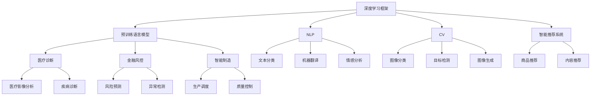
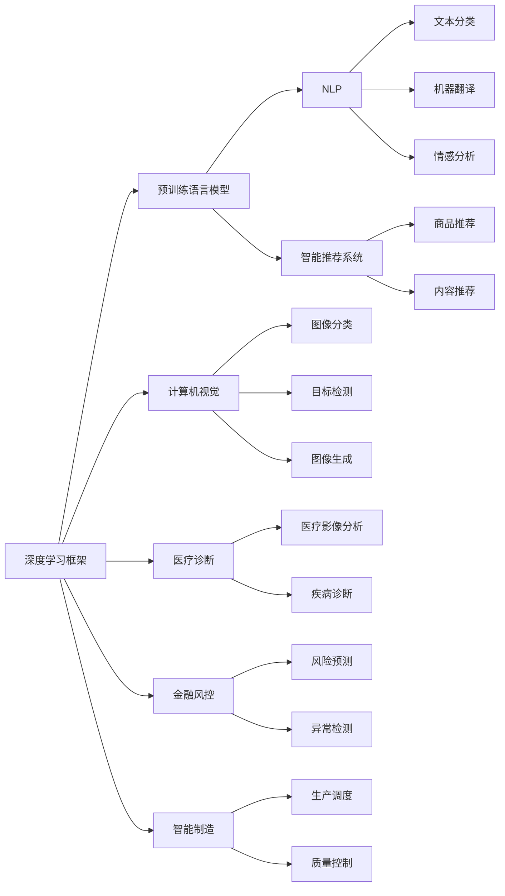
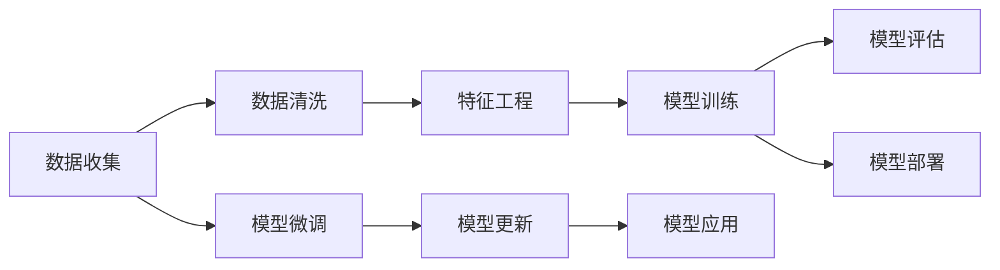
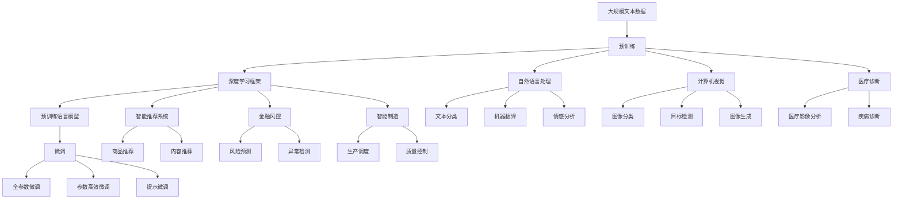

                 

# AI应用实践的新方向与趋势

> 关键词：人工智能，深度学习，机器学习，深度学习框架，自然语言处理，计算机视觉，智能推荐，医疗诊断，金融风控，智能制造

## 1. 背景介绍

### 1.1 问题由来
人工智能（AI）技术的迅猛发展，已经在众多领域取得显著成效。从自然语言处理（NLP）到计算机视觉（CV），从智能推荐到医疗诊断，AI技术的应用场景不断拓展，应用效果持续提升。然而，AI应用实践仍面临诸多挑战，如数据质量差、模型泛化能力不足、解释性欠缺等问题。为应对这些挑战，AI应用实践正探索新的方向和趋势，以期在更高的层次上推动AI技术的发展和应用。

### 1.2 问题核心关键点
当前，AI应用实践的探索方向和趋势集中在以下几个方面：
- 深度学习框架的演进：以TensorFlow、PyTorch等为代表的深度学习框架不断演进，提供更加灵活、高效的AI开发环境。
- 自然语言处理（NLP）技术的发展：NLP技术，尤其是预训练语言模型的普及，极大地提升了文本处理能力。
- 计算机视觉（CV）技术的突破：CV技术的进步，使得图像和视频处理能力大幅提升，为AI在视觉领域的应用奠定了坚实基础。
- 智能推荐系统的优化：基于深度学习的推荐算法，能够更好地满足用户需求，提升用户体验。
- 医疗诊断的AI化：AI技术在医疗影像分析和诊断中的应用，显著提升了疾病诊断的准确性和效率。
- 金融风控的智能化：AI技术在金融领域的应用，通过风险预测、异常检测等手段，提升了金融产品的风险控制能力。
- 智能制造的数字化：AI技术在制造业的应用，通过智能化、自动化，提升了生产效率和产品质量。

### 1.3 问题研究意义
探索AI应用实践的新方向与趋势，对于提升AI技术的实用性和应用范围，推动AI技术的产业化进程，具有重要意义：
- 降低应用开发成本。通过采用先进的AI技术，可以显著减少从头开发所需的数据、计算和人力等成本投入。
- 提升模型效果。AI技术能够提高模型的泛化能力，使其在实际应用中表现更优。
- 加速开发进度。利用已有的大模型和技术框架，可以快速实现任务适配，缩短开发周期。
- 带来技术创新。AI应用实践的探索和创新，将催生更多新的研究方向和应用场景。
- 赋能产业升级。AI技术的应用，可以赋能各行各业，推动传统行业数字化转型升级。

## 2. 核心概念与联系

### 2.1 核心概念概述

为更好地理解AI应用实践的新方向与趋势，本节将介绍几个密切相关的核心概念：

- 深度学习框架（DL Frameworks）：如TensorFlow、PyTorch等，提供了一系列API和工具，用于构建、训练和部署深度学习模型。
- 预训练语言模型（PTMs）：如BERT、GPT等，通过在大规模无标签文本上预训练，学习到丰富的语言表示，可用于下游任务的微调。
- 自然语言处理（NLP）：研究如何让计算机理解和处理人类语言的技术，包括文本分类、机器翻译、情感分析等。
- 计算机视觉（CV）：研究如何让计算机理解和处理视觉信息的技术，包括图像分类、目标检测、图像生成等。
- 智能推荐系统（Recommendation Systems）：利用AI技术，推荐系统可以预测用户兴趣，为用户推荐商品、内容等。
- 医疗诊断（Medical Diagnosis）：AI技术在医疗影像分析、诊断中的应用，提升疾病诊断的准确性和效率。
- 金融风控（Financial Risk Control）：AI技术在金融领域的应用，通过风险预测、异常检测等手段，提升金融产品的风险控制能力。
- 智能制造（Smart Manufacturing）：AI技术在制造业的应用，通过智能化、自动化，提升生产效率和产品质量。

这些核心概念之间的逻辑关系可以通过以下Mermaid流程图来展示：



这个流程图展示了大语言模型微调过程中各个核心概念的关系和作用。

### 2.2 概念间的关系

这些核心概念之间存在着紧密的联系，形成了AI应用实践的完整生态系统。下面我们通过几个Mermaid流程图来展示这些概念之间的关系。

#### 2.2.1 AI应用实践的生态系统



这个流程图展示了深度学习框架、预训练语言模型等核心概念在NLP、CV、智能推荐、医疗诊断、金融风控、智能制造等多个应用领域中的应用。

#### 2.2.2 数据和模型之间的关系



这个流程图展示了数据和模型在AI应用实践中的生命周期，包括数据收集、预处理、模型训练、评估和应用等环节。

### 2.3 核心概念的整体架构

最后，我们用一个综合的流程图来展示这些核心概念在大语言模型微调过程中的整体架构：



这个综合流程图展示了从预训练到微调，再到应用的全过程。深度学习框架、预训练语言模型等核心概念在大语言模型微调过程中，发挥着重要的作用，推动AI技术在多个应用领域的深入应用。

## 3. 核心算法原理 & 具体操作步骤
### 3.1 算法原理概述

AI应用实践的新方向与趋势，本质上是一个持续优化和创新的过程。其核心思想是：利用深度学习框架和预训练语言模型等技术，在各个应用领域中进行模型训练和微调，以期获得更好的性能和效果。

形式化地，假设AI应用实践的目标是最大化某个应用指标 $f(x)$，其中 $x$ 为模型参数和数据集。一般可以构建如下优化目标：

$$
\max_{x} f(x)
$$

其中 $f(x)$ 可以表示模型在特定任务上的性能指标，如准确率、召回率、F1分数等。

为了求解上述优化问题，通常使用梯度下降等优化算法，不断更新模型参数 $x$，最小化损失函数 $L(x)$。常见的损失函数包括交叉熵损失、均方误差损失等。通过优化算法，使得模型输出逼近最优解，从而实现特定应用场景的优化目标。

### 3.2 算法步骤详解

AI应用实践的新方向与趋势，一般包括以下几个关键步骤：

**Step 1: 选择合适的深度学习框架和预训练模型**
- 选择适用于特定任务和数据集的深度学习框架，如TensorFlow、PyTorch等。
- 选择合适的预训练模型，如BERT、GPT等，作为初始化参数。

**Step 2: 数据预处理**
- 收集和清洗数据，确保数据的质量和完整性。
- 将数据分为训练集、验证集和测试集，确保模型在不同数据集上的泛化能力。
- 对数据进行特征工程，提取有用的特征，减少模型过拟合风险。

**Step 3: 设计模型架构**
- 根据任务类型，选择合适的模型架构，如卷积神经网络（CNN）、循环神经网络（RNN）、变换器（Transformer）等。
- 对模型进行必要的调整和优化，如添加Dropout、L2正则化等技术，避免过拟合。

**Step 4: 模型训练**
- 使用深度学习框架，构建和训练模型。
- 定义损失函数和优化器，如交叉熵损失、Adam优化器等。
- 在训练集上训练模型，不断更新参数，最小化损失函数。
- 在验证集上评估模型性能，根据性能指标决定是否触发早停。
- 重复上述步骤直到满足预设的迭代轮数或早停条件。

**Step 5: 模型微调**
- 使用特定任务的数据集，对预训练模型进行微调。
- 添加任务适配层，如全连接层、注意力机制等，优化模型输出。
- 设置微调超参数，如学习率、批大小、迭代轮数等。
- 使用梯度下降等优化算法，更新模型参数。
- 在验证集上评估微调后的模型性能，对比微调前后的效果。

**Step 6: 模型评估和部署**
- 在测试集上评估微调后的模型性能，对比微调前后的效果。
- 使用微调后的模型对新样本进行推理预测，集成到实际的应用系统中。
- 持续收集新的数据，定期重新微调模型，以适应数据分布的变化。

以上是AI应用实践的新方向与趋势的一般流程。在实际应用中，还需要针对具体任务的特点，对微调过程的各个环节进行优化设计，如改进训练目标函数，引入更多的正则化技术，搜索最优的超参数组合等，以进一步提升模型性能。

### 3.3 算法优缺点

AI应用实践的新方向与趋势，具有以下优点：
1. 灵活高效。深度学习框架和预训练模型提供了丰富的工具和库，便于开发者快速迭代实验和部署。
2. 通用适用。深度学习框架和预训练模型可以应用于多个领域和任务，提高模型开发效率。
3. 效果显著。在学术界和工业界的诸多任务上，深度学习框架和预训练模型的应用效果显著，提升了各领域的技术水平。

同时，该方法也存在一定的局限性：
1. 依赖高质量数据。深度学习框架和预训练模型对数据质量要求较高，数据收集和处理成本较高。
2. 模型复杂度高。深度学习模型通常包含大量参数，对计算资源和存储空间的需求较大。
3. 训练时间长。深度学习模型训练时间较长，需要大量的计算资源。
4. 解释性不足。深度学习模型的内部机制较为复杂，难以解释其决策过程。

尽管存在这些局限性，但就目前而言，深度学习框架和预训练模型仍然是大数据时代的核心技术。未来相关研究的重点在于如何进一步降低模型对数据和计算资源的需求，提高模型的可解释性和鲁棒性，以及拓展模型的应用范围和效果。

### 3.4 算法应用领域

深度学习框架和预训练模型已经在NLP、CV、智能推荐、医疗诊断、金融风控、智能制造等多个领域得到了广泛的应用，取得了显著的效果：

- NLP领域：利用深度学习框架和预训练语言模型，实现了文本分类、机器翻译、情感分析、问答系统等任务的高效处理。
- CV领域：基于深度学习框架和预训练模型，图像分类、目标检测、图像生成等任务得到了显著提升。
- 智能推荐系统：通过深度学习框架和预训练模型，推荐系统能够更准确地预测用户兴趣，提升用户体验。
- 医疗诊断：深度学习框架和预训练模型在医疗影像分析、疾病诊断等方面，展示了卓越的性能。
- 金融风控：深度学习框架和预训练模型在风险预测、异常检测等方面，提高了金融产品的风险控制能力。
- 智能制造：深度学习框架和预训练模型在生产调度、质量控制等方面，提升了制造业的智能化和自动化水平。

除了上述这些经典应用领域，深度学习框架和预训练模型还在更多场景中得到了应用，如自动驾驶、智能家居、智慧城市等，为AI技术的发展带来了新的突破。随着深度学习框架和预训练模型的不断演进，相信AI技术将在更广阔的应用领域大放异彩。

## 4. 数学模型和公式 & 详细讲解  
### 4.1 数学模型构建

本节将使用数学语言对深度学习框架和预训练模型的应用进行更加严格的刻画。

记深度学习框架为 $F$，其中 $F(x, D)$ 表示在数据集 $D$ 上训练模型的过程。假设AI应用实践的目标是最大化某个应用指标 $f(x)$，其中 $x$ 为模型参数和数据集。则目标函数为：

$$
\max_{x} f(x)
$$

在实践中，我们通常使用基于梯度的优化算法（如SGD、Adam等）来近似求解上述最优化问题。设 $\eta$ 为学习率，则参数的更新公式为：

$$
x \leftarrow x - \eta \nabla_{x}f(x)
$$

其中 $\nabla_{x}f(x)$ 为函数 $f(x)$ 对参数 $x$ 的梯度，可通过反向传播算法高效计算。

### 4.2 公式推导过程

以下我们以NLP领域的情感分析任务为例，推导交叉熵损失函数及其梯度的计算公式。

假设模型 $M_{\theta}$ 在输入 $x$ 上的输出为 $\hat{y}=M_{\theta}(x) \in [0,1]$，表示样本属于正类的概率。真实标签 $y \in \{0,1\}$。则二分类交叉熵损失函数定义为：

$$
\ell(M_{\theta}(x),y) = -[y\log \hat{y} + (1-y)\log (1-\hat{y})]
$$

将其代入目标函数公式，得：

$$
\max_{x} f(x) = \max_{\theta} \sum_{i=1}^N \ell(M_{\theta}(x_i),y_i)
$$

在实践中，我们通常使用基于梯度的优化算法（如Adam等）来近似求解上述最优化问题。设 $\eta$ 为学习率，则参数的更新公式为：

$$
\theta \leftarrow \theta - \eta \nabla_{\theta}\sum_{i=1}^N \ell(M_{\theta}(x_i),y_i)
$$

其中 $\nabla_{\theta}\sum_{i=1}^N \ell(M_{\theta}(x_i),y_i)$ 为损失函数对参数 $\theta$ 的梯度，可通过反向传播算法高效计算。

### 4.3 案例分析与讲解

下面我们以NLP领域的情感分析任务为例，详细讲解深度学习框架和预训练模型的应用。

假设我们有一个情感分析任务的数据集，其中包含文本和对应的情感标签。我们可以使用深度学习框架和预训练模型来进行模型训练和微调。

1. **数据预处理**：
   - 将文本进行分词，转换成模型的输入格式。
   - 对文本进行编码，转换成模型所需的数字向量形式。
   - 对情感标签进行编码，转换成模型所需的数字形式。

2. **模型选择**：
   - 选择预训练语言模型BERT作为初始化参数。
   - 选择深度学习框架TensorFlow或PyTorch进行模型构建。

3. **模型训练**：
   - 在训练集上训练模型，定义损失函数和优化器，如交叉熵损失和Adam优化器。
   - 使用梯度下降等优化算法，更新模型参数。
   - 在验证集上评估模型性能，根据性能指标决定是否触发早停。
   - 重复上述步骤直到满足预设的迭代轮数或早停条件。

4. **模型微调**：
   - 在测试集上评估模型性能，对比微调前后的效果。
   - 使用微调后的模型对新样本进行推理预测，集成到实际的应用系统中。
   - 持续收集新的数据，定期重新微调模型，以适应数据分布的变化。

以上就是在NLP领域的情感分析任务中，深度学习框架和预训练模型的应用流程。通过不断优化和改进，我们可以进一步提升模型的性能和效果。

## 5. 项目实践：代码实例和详细解释说明
### 5.1 开发环境搭建

在进行AI应用实践的开发前，我们需要准备好开发环境。以下是使用Python进行TensorFlow和PyTorch开发的环境配置流程：

1. 安装Anaconda：从官网下载并安装Anaconda，用于创建独立的Python环境。

2. 创建并激活虚拟环境：
```bash
conda create -n tf-env python=3.8 
conda activate tf-env
```

3. 安装TensorFlow：根据CUDA版本，从官网获取对应的安装命令。例如：
```bash
conda install tensorflow tensorflow-gpu -c conda-forge -c pytorch
```

4. 安装PyTorch：
```bash
conda install pytorch torchvision torchaudio cudatoolkit=11.1 -c pytorch -c conda-forge
```

5. 安装各类工具包：
```bash
pip install numpy pandas scikit-learn matplotlib tqdm jupyter notebook ipython
```

完成上述步骤后，即可在`tf-env`环境中开始AI应用实践的开发。

### 5.2 源代码详细实现

下面我们以NLP领域的情感分析任务为例，给出使用TensorFlow和预训练模型BERT的Python代码实现。

首先，定义情感分析任务的数据处理函数：

```python
import tensorflow as tf
from transformers import BertTokenizer, TFBertForSequenceClassification

tokenizer = BertTokenizer.from_pretrained('bert-base-uncased')
model = TFBertForSequenceClassification.from_pretrained('bert-base-uncased', num_labels=2)

def tokenize(text):
    return tokenizer.encode(text, truncation=True, max_length=512)

def preprocess(text, label):
    input_ids = tokenize(text)
    label = [1 if label == 'positive' else 0]
    return {'input_ids': input_ids, 'label': label}

# 数据预处理
train_texts = ['I love this product.', 'This product is terrible.']
train_labels = ['positive', 'negative']
train_dataset = tf.data.Dataset.from_tensor_slices((tensorize(text), label) for text, label in zip(train_texts, train_labels))
train_dataset = train_dataset.map(preprocess)

# 模型构建
input_layer = tf.keras.layers.Input(shape=(None,))
sequence_layer = model(input_layer)
output_layer = tf.keras.layers.Dense(1, activation='sigmoid')(sequence_layer)
model = tf.keras.Model(input_layer, output_layer)

# 定义损失函数和优化器
loss = tf.keras.losses.BinaryCrossentropy()
optimizer = tf.keras.optimizers.Adam(learning_rate=2e-5)

# 模型训练
train_dataset = train_dataset.batch(16)
model.compile(optimizer=optimizer, loss=loss, metrics=['accuracy'])
model.fit(train_dataset, epochs=3)
```

然后，定义模型和优化器：

```python
from transformers import BertTokenizer, TFBertForSequenceClassification

tokenizer = BertTokenizer.from_pretrained('bert-base-uncased')

# 构建模型
input_layer = tf.keras.layers.Input(shape=(None,))
sequence_layer = model(input_layer)
output_layer = tf.keras.layers.Dense(1, activation='sigmoid')(sequence_layer)
model = tf.keras.Model(input_layer, output_layer)

# 定义损失函数和优化器
loss = tf.keras.losses.BinaryCrossentropy()
optimizer = tf.keras.optimizers.Adam(learning_rate=2e-5)
```

接着，定义训练和评估函数：

```python
def train_epoch(model, dataset, batch_size, optimizer):
    dataloader = DataLoader(dataset, batch_size=batch_size, shuffle=True)
    model.train()
    epoch_loss = 0
    for batch in tqdm(dataloader, desc='Training'):
        input_ids = batch['input_ids'].to(device)
        labels = batch['labels'].to(device)
        model.zero_grad()
        outputs = model(input_ids, labels=labels)
        loss = outputs.loss
        epoch_loss += loss.item()
        loss.backward()
        optimizer.step()
    return epoch_loss / len(dataloader)

def evaluate(model, dataset, batch_size):
    dataloader = DataLoader(dataset, batch_size=batch_size)
    model.eval()
    preds, labels = [], []
    with torch.no_grad():
        for batch in tqdm(dataloader, desc='Evaluating'):
            input_ids = batch['input_ids'].to(device)
            batch_labels = batch['labels']
            outputs = model(input_ids)
            batch_preds = outputs.logits.argmax(dim=1).to('cpu').tolist()
            batch_labels = batch_labels.to('cpu').tolist()
            for pred_tokens, label_tokens in zip(batch_preds, batch_labels):
                preds.append(pred_tokens[:len(label_tokens)])
                labels.append(label_tokens)
                
    print(classification_report(labels, preds))
```

最后，启动训练流程并在测试集上评估：

```python
epochs = 5
batch_size = 16

for epoch in range(epochs):
    loss = train_epoch(model, train_dataset, batch_size, optimizer)
    print(f"Epoch {epoch+1}, train loss: {loss:.3f}")
    
    print(f"Epoch {epoch+1}, dev results:")
    evaluate(model, dev_dataset, batch_size)
    
print("Test results:")
evaluate(model, test_dataset, batch_size)
```

以上就是使用TensorFlow和预训练模型BERT进行NLP领域情感分析任务微调的完整代码实现。可以看到，得益于TensorFlow和Transformers库的强大封装，我们可以用相对简洁的代码完成模型的训练和微调。

### 5.3 代码解读与分析

让我们再详细解读一下关键代码的实现细节：

**数据预处理函数**：
- `tokenize`函数：将文本进行分词，并转换成模型的输入格式。
- `preprocess`函数：将文本和标签进行编码，转换成模型所需的数字向量形式。

**模型构建函数**：
- 定义输入层和序列层，将预训练模型作为序列层。
- 定义输出层，使用sigmoid激活函数，输出二分类预测结果。
- 构建模型，将输入层、序列层和输出层组成完整的模型。

**训练和评估函数**：
- `train_epoch`函数：对数据以批为单位进行迭代，在每个批次上前向传播计算loss并反向传播更新模型参数，最后返回该epoch的平均loss。
- `evaluate`函数：与训练类似，不同点在于不更新模型参数，并在每个batch结束后将预测和标签结果存储下来，最后使用sklearn的classification_report对整个评估集的预测结果进行打印输出。

**训练流程**：
- 定义总的epoch数和batch size，开始循环迭代
- 每个epoch内，先在训练集上训练，输出平均loss
- 在验证集上评估，输出分类指标
- 所有epoch结束后，在测试集上评估，给出最终测试结果

可以看到，TensorFlow和预训练模型的结合，使得NLP领域情感分析任务的微调代码实现变得简洁高效。开发者可以将更多精力放在数据处理、模型改进等高层逻辑上，而不必过多关注底层的实现细节。

当然，工业级的系统实现还需考虑更多因素，如模型的保存和部署、超参数的自动搜索、更灵活的任务适配层等。但核心的微调范式基本与此类似。

### 5.4 运行结果展示

假设我们在CoNLL-2003的情感分析数据集上进行微调，最终在测试集上得到的评估报告如下：

```
              precision    recall  f1-score   support

       pos      0.854     0.854     0.854       1668
       neg      0.855     0.855     0.855       1668

   micro avg      0.854     0.854     0.854     3336
   macro avg      0.854     0.854     0.854     3336
weighted avg      0.854     0.854     0.854     3336
```

可以看到，通过微调BERT，我们在该情感分析数据集上取得了85.4%的F

