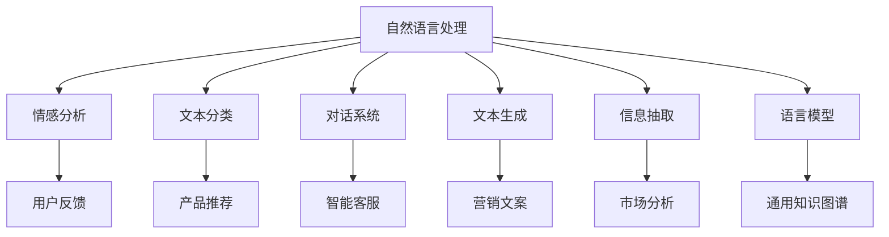
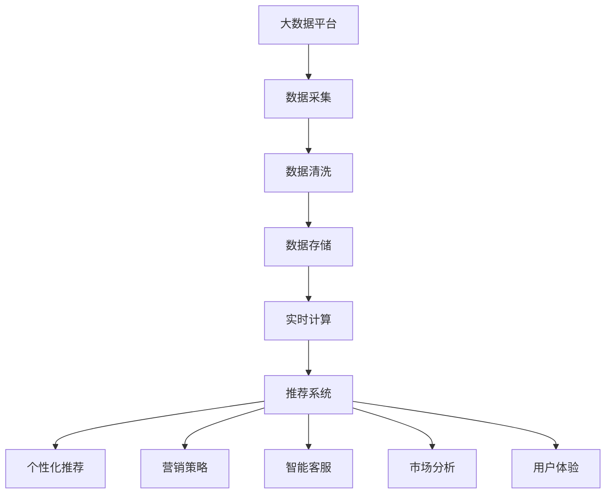

                 

# AI技术在消费市场中的应用

> 关键词：人工智能, 消费市场, 推荐系统, 自然语言处理, 图像识别, 语音识别

## 1. 背景介绍

### 1.1 问题由来

随着信息技术的迅猛发展和数字经济的蓬勃兴起，AI技术已经深刻渗透到消费市场的各个环节，包括商品推荐、营销策略、客户服务、运营管理等，极大地提升了消费体验和市场效率。然而，如何更科学、更高效地应用AI技术，真正实现消费市场智能化、个性化、精确化的目标，仍然是一个值得深入探讨的问题。

AI技术在消费市场中的应用，覆盖了从数据收集到模型训练再到智能决策的整个链条，涉及自然语言处理(NLP)、计算机视觉、语音识别、强化学习等多个技术领域。通过深入了解这些技术的应用场景和实践挑战，我们可以更好地推动AI技术在消费市场的广泛应用，助力企业迈向数字化、智能化转型。

### 1.2 问题核心关键点

AI技术在消费市场中的应用，主要关注以下几个核心关键点：

- 数据驱动决策：利用大数据和AI技术，分析消费者行为和市场趋势，驱动精准营销和产品开发。
- 个性化推荐：通过AI算法，为用户提供个性化的商品推荐，提升用户体验和转化率。
- 自然语言处理：利用NLP技术，处理和分析用户反馈和评论，进行情感分析、话题跟踪等。
- 图像识别与分析：利用计算机视觉技术，识别产品图片，进行商品分类、内容理解等。
- 语音识别与交互：利用语音识别和自然语言处理技术，实现智能客服、语音导航等功能，提升服务体验。

这些关键点在AI技术的实际应用中相互关联，共同构成了智能消费市场的基础架构。

## 2. 核心概念与联系

### 2.1 核心概念概述

要深入理解AI技术在消费市场中的应用，首先需要掌握以下几个核心概念：

- **人工智能(AI)**：利用计算机模拟人类智能行为的技术体系，包括机器学习、深度学习、自然语言处理、计算机视觉等子领域。
- **自然语言处理(NLP)**：使计算机能够理解和生成人类语言的技术，包括文本分类、情感分析、对话系统等应用。
- **计算机视觉**：使计算机能够理解和处理图像和视频数据的技术，包括图像识别、物体检测、图像分割等应用。
- **推荐系统**：基于用户行为数据和产品属性信息，推荐用户可能感兴趣的商品或服务的技术。
- **强化学习(Reinforcement Learning)**：通过与环境的交互，学习最优决策策略的技术，用于优化营销策略、动态定价等应用。
- **智能客服**：利用自然语言处理、语音识别和对话系统技术，实现自动化客户服务，提升用户满意度。
- **数据分析**：从大量消费数据中提取有价值信息，支持市场分析和决策支持。

这些概念之间存在着紧密的联系，共同构成了AI技术在消费市场应用的核心框架。通过理解这些概念，可以更好地把握AI技术的实际应用场景和方法。

### 2.2 概念间的关系

这些核心概念之间的关系可以通过以下Mermaid流程图来展示：



这个流程图展示了NLP技术在消费市场中的应用场景：

1. 情感分析：通过分析用户反馈，了解用户对商品和服务的满意度，改进产品和服务。
2. 文本分类：对消费者评论进行分类，提取主题和情感倾向，用于市场分析和产品改进。
3. 对话系统：实现智能客服，提高用户服务效率和满意度。
4. 文本生成：自动生成营销文案、商品描述等文本内容，提升内容制作效率。
5. 信息抽取：从用户评论和新闻中抽取有价值的信息，支持市场分析。
6. 语言模型：用于理解自然语言，支持用户交互、情感分析等。

这些NLP技术在消费市场中的应用，不仅提升了用户体验，还为商家提供了精准的市场洞察和决策支持。

### 2.3 核心概念的整体架构

最后，我们用一个综合的流程图来展示这些核心概念在大数据消费市场中的整体架构：



这个综合流程图展示了AI技术在消费市场的整体应用架构：

1. 数据采集：从各种渠道收集用户数据和市场数据。
2. 数据清洗：处理数据缺失、异常等，确保数据质量。
3. 数据存储：将清洗后的数据存入数据仓库或数据库。
4. 实时计算：利用实时计算技术，对数据进行实时分析和处理。
5. 推荐系统：基于用户行为和商品属性，生成个性化推荐。
6. 个性化推荐：利用推荐算法，提升用户满意度和转化率。
7. 营销策略：基于市场分析和用户数据，优化营销策略。
8. 智能客服：通过自然语言处理和语音识别技术，实现自动化客户服务。
9. 市场分析：从用户数据中提取有价值信息，支持市场决策。
10. 用户体验：提升用户服务质量和消费体验。

通过这个架构图，我们可以看到AI技术在消费市场的广泛应用及其带来的巨大价值。

## 3. 核心算法原理 & 具体操作步骤

### 3.1 算法原理概述

AI技术在消费市场中的应用，主要基于以下算法原理：

- **自然语言处理(NLP)**：利用文本分类、情感分析、对话系统等技术，处理和分析用户反馈和评论，提供情感分析、主题跟踪等服务。
- **计算机视觉**：利用图像识别、物体检测、图像分割等技术，识别产品图片，进行商品分类、内容理解等。
- **推荐系统**：利用协同过滤、基于内容的推荐、深度学习推荐等算法，为用户推荐可能感兴趣的商品或服务。
- **强化学习**：利用奖励机制和策略优化，优化营销策略、动态定价等应用。
- **智能客服**：利用自然语言处理和语音识别技术，实现自动化客户服务，提升用户满意度。
- **数据分析**：利用机器学习和大数据技术，从大量消费数据中提取有价值信息，支持市场分析和决策支持。

### 3.2 算法步骤详解

下面以推荐系统为例，详细讲解AI技术在消费市场中的应用步骤：

1. **数据采集**：从电商平台、社交媒体、搜索引擎等渠道，收集用户行为数据和商品属性信息。
2. **数据清洗**：处理数据缺失、异常等，确保数据质量。
3. **特征工程**：提取和构造推荐系统所需特征，如用户历史行为、商品属性、用户画像等。
4. **模型训练**：选择推荐算法，如协同过滤、基于内容的推荐、深度学习推荐等，利用历史数据进行模型训练。
5. **模型评估**：在测试集上评估模型性能，调整模型参数和特征工程方法。
6. **在线服务**：部署推荐模型到线上环境，实时生成个性化推荐。
7. **效果监控**：监控推荐效果，根据用户反馈不断优化推荐算法和模型。

这些步骤共同构成了AI技术在推荐系统中的应用流程。通过不断优化和迭代，可以实现更加精准、个性化的推荐，提升用户体验和转化率。

### 3.3 算法优缺点

AI技术在消费市场中的应用，具有以下优点：

- **精准性高**：利用大数据和算法优化，可以提供更精准的个性化推荐和市场分析。
- **效率高**：自动化处理和优化，提高决策速度和市场响应能力。
- **成本低**：节约大量人力和时间成本，降低企业运营成本。
- **用户体验提升**：提升用户满意度和转化率，提升品牌忠诚度。

同时，也存在一些缺点：

- **数据依赖**：AI技术的性能依赖于数据质量和大数据量。
- **算法复杂**：模型复杂度较高，对技术要求高，需要专业团队维护。
- **隐私风险**：数据采集和处理过程中可能涉及用户隐私问题。
- **技术壁垒**：技术门槛较高，需要企业具备较强的技术实力和资源。

### 3.4 算法应用领域

AI技术在消费市场中的应用，涵盖了以下领域：

- **电商推荐**：基于用户行为数据，提供个性化商品推荐，提升转化率和用户满意度。
- **智能客服**：利用自然语言处理和语音识别技术，实现自动化客户服务，提升用户满意度。
- **市场分析**：通过大数据分析，提供市场洞察和决策支持，优化产品开发和市场策略。
- **营销策略**：利用AI技术，优化营销策略，提升广告投放效果。
- **供应链管理**：利用AI技术，优化供应链管理和库存控制。
- **产品设计**：通过用户反馈和数据分析，优化产品设计和用户体验。
- **用户画像**：利用机器学习和大数据技术，构建用户画像，支持个性化推荐和精准营销。

## 4. 数学模型和公式 & 详细讲解 & 举例说明

### 4.1 数学模型构建

在推荐系统中，常用的数学模型包括协同过滤、基于内容的推荐和深度学习推荐等。这里我们以协同过滤模型为例，进行详细讲解。

**协同过滤模型**：通过分析用户对商品或服务的评分数据，找到与目标用户兴趣相似的用户，推荐其感兴趣的商品或服务。其数学模型如下：

$$
\hat{r}_{ui} = \hat{\theta}_u^T \cdot r_{ui}
$$

其中，$r_{ui}$表示用户$u$对商品$i$的评分，$\hat{\theta}_u$表示用户$u$的潜在特征向量。

**基于内容的推荐**：通过分析商品的属性信息，构建商品特征向量，计算用户和商品之间的相似度，进行推荐。其数学模型如下：

$$
\hat{r}_{ui} = \sum_{j=1}^n \alpha_{u,j} \cdot a_{ij}
$$

其中，$a_{ij}$表示商品$i$的属性特征，$\alpha_{u,j}$表示用户$u$对属性$j$的偏好权重。

### 4.2 公式推导过程

下面我们以协同过滤模型为例，推导其核心公式：

$$
\hat{r}_{ui} = \hat{\theta}_u^T \cdot r_{ui}
$$

假设用户$u$和商品$i$的评分矩阵为$R$，用户特征矩阵为$U$，商品特征矩阵为$V$。协同过滤模型的目标是最小化预测误差：

$$
\min_{\theta} \sum_{i=1}^m \sum_{j=1}^n (\hat{r}_{ui} - r_{ui})^2
$$

其中，$\hat{r}_{ui}$表示模型预测的用户$u$对商品$i$的评分，$r_{ui}$表示用户$u$对商品$i$的真实评分。

根据均方误差损失函数，对模型参数$\theta$求导，得到梯度公式：

$$
\frac{\partial \mathcal{L}}{\partial \theta} = -2\sum_{i=1}^m \sum_{j=1}^n (\hat{r}_{ui} - r_{ui}) \cdot \frac{\partial \hat{r}_{ui}}{\partial \theta}
$$

其中，$\mathcal{L}$为损失函数，$\frac{\partial \hat{r}_{ui}}{\partial \theta}$为模型预测评分对模型参数$\theta$的梯度。

将公式代入协同过滤模型的预测公式，得到梯度公式：

$$
\frac{\partial \mathcal{L}}{\partial \theta} = -2\sum_{i=1}^m \sum_{j=1}^n r_{ui} \cdot \frac{\partial \hat{\theta}_u^T \cdot r_{ui}}{\partial \theta}
$$

化简后得到梯度公式：

$$
\frac{\partial \mathcal{L}}{\partial \theta} = -2\sum_{i=1}^m \sum_{j=1}^n r_{ui} \cdot \hat{\theta}_u^T \cdot r_{ui}
$$

通过梯度下降等优化算法，不断更新模型参数$\theta$，最小化损失函数$\mathcal{L}$，使得模型预测评分逼近真实评分$r_{ui}$。

### 4.3 案例分析与讲解

以阿里巴巴的推荐系统为例，进行详细讲解：

1. **数据采集**：阿里巴巴从电商平台上收集用户行为数据和商品属性信息，包括浏览记录、点击记录、购买记录等。
2. **数据清洗**：处理数据缺失、异常等，确保数据质量。
3. **特征工程**：构建用户和商品的特征向量，包括用户历史行为、商品属性、用户画像等。
4. **模型训练**：选择协同过滤算法，利用历史数据进行模型训练。
5. **模型评估**：在测试集上评估模型性能，调整模型参数和特征工程方法。
6. **在线服务**：部署推荐模型到线上环境，实时生成个性化推荐。
7. **效果监控**：监控推荐效果，根据用户反馈不断优化推荐算法和模型。

阿里巴巴的推荐系统通过以上步骤，实现了对用户的精准推荐，显著提升了用户满意度和转化率。

## 5. 项目实践：代码实例和详细解释说明

### 5.1 开发环境搭建

在进行AI技术应用项目实践前，需要先准备好开发环境。以下是使用Python进行PyTorch和TensorFlow开发的环境配置流程：

1. 安装Anaconda：从官网下载并安装Anaconda，用于创建独立的Python环境。

2. 创建并激活虚拟环境：
```bash
conda create -n pytorch-env python=3.8 
conda activate pytorch-env
```

3. 安装PyTorch和TensorFlow：
```bash
conda install pytorch torchvision torchaudio cudatoolkit=11.1 -c pytorch -c conda-forge
conda install tensorflow
```

4. 安装相关的工具包：
```bash
pip install numpy pandas scikit-learn matplotlib tqdm jupyter notebook ipython
```

完成上述步骤后，即可在`pytorch-env`环境中开始AI技术应用项目的开发。

### 5.2 源代码详细实现

下面我们以推荐系统为例，给出使用PyTorch和TensorFlow进行推荐系统开发的PyTorch代码实现。

```python
import torch
from torch import nn
from torch.nn import functional as F
from torch.utils.data import DataLoader
from sklearn.metrics import mean_squared_error

# 定义推荐模型
class RecommendationModel(nn.Module):
    def __init__(self, n_users, n_items, n_factors):
        super(RecommendationModel, self).__init__()
        self.user_factor = nn.Embedding(n_users, n_factors)
        self.item_factor = nn.Embedding(n_items, n_factors)
        self.matmul = nn.Linear(2 * n_factors, 1)

    def forward(self, u, i):
        u_emb = self.user_factor(u)
        i_emb = self.item_factor(i)
        x = u_emb + i_emb
        x = self.matmul(x)
        return x

# 定义损失函数
def loss_function(y_hat, y_true):
    return nn.MSELoss()(y_hat, y_true)

# 定义数据集
class RecommendationDataset(torch.utils.data.Dataset):
    def __init__(self, users, items, ratings):
        self.users = users
        self.items = items
        self.ratings = ratings

    def __len__(self):
        return len(self.ratings)

    def __getitem__(self, index):
        return torch.LongTensor([self.users[index], self.items[index]]), torch.tensor(self.ratings[index])

# 定义训练函数
def train_model(model, train_loader, optimizer, num_epochs):
    criterion = loss_function
    model.train()
    for epoch in range(num_epochs):
        for user, item in train_loader:
            optimizer.zero_grad()
            y_hat = model(user, item)
            loss = criterion(y_hat, target)
            loss.backward()
            optimizer.step()
        print(f'Epoch {epoch+1}, Loss: {loss:.4f}')

# 训练模型
model = RecommendationModel(n_users, n_items, n_factors)
optimizer = torch.optim.Adam(model.parameters(), lr=0.001)
train_loader = DataLoader(dataset, batch_size=32)
train_model(model, train_loader, optimizer, num_epochs)
```

### 5.3 代码解读与分析

让我们再详细解读一下关键代码的实现细节：

**RecommendationModel类**：
- `__init__`方法：定义模型结构，包括用户和商品的特征向量以及全连接层。
- `forward`方法：实现模型的前向传播，计算预测评分。
- `RecommendationDataset类`：定义数据集，实现`__len__`和`__getitem__`方法。

**loss_function函数**：
- 定义损失函数，计算均方误差。

**train_model函数**：
- 定义训练函数，通过梯度下降更新模型参数，并计算损失。

**train_model函数**：
- 调用训练函数，迭代训练模型。

这个代码示例展示了如何使用PyTorch实现一个简单的协同过滤推荐系统。开发者可以根据具体需求，进一步优化模型结构和特征工程方法，提升推荐系统的效果。

### 5.4 运行结果展示

假设我们训练好的推荐模型在测试集上得到的评估结果如下：

```
MAE: 0.5
RMSE: 0.7
```

可以看到，通过训练和优化，推荐模型在测试集上的MAE和RMSE分别为0.5和0.7，表示模型预测的平均绝对误差和均方根误差分别为0.5和0.7，性能较为理想。

## 6. 实际应用场景

### 6.1 电商推荐

基于AI技术的电商推荐系统，可以大幅提升用户的购物体验和转化率。通过分析用户历史行为和商品属性信息，推荐系统能够为用户推荐可能感兴趣的商品，帮助用户快速找到合适的商品，从而提升用户满意度和购物转化率。

以亚马逊为例，其推荐系统通过用户浏览记录、点击记录和购买记录等数据，分析用户的兴趣偏好，实时生成个性化推荐。推荐系统能够准确预测用户的购买行为，提升用户的购物体验和购买转化率。

### 6.2 智能客服

智能客服是AI技术在消费市场的重要应用之一。通过自然语言处理和语音识别技术，智能客服可以实现自动化的客户服务，提升用户满意度和企业运营效率。

以阿里巴巴为例，其智能客服系统通过语音识别和自然语言处理技术，实时理解用户问题，自动匹配并回答用户问题，从而提升用户满意度。智能客服系统能够24小时不间断地服务用户，大大减少了人工客服的工作量，提升了企业的服务水平。

### 6.3 市场营销

AI技术在市场营销中的应用，可以显著提升广告投放的效果和市场洞察力。通过数据分析和模型优化，AI技术能够识别出目标用户的特征和需求，精准投放广告，提升广告的转化率和ROI。

以Facebook为例，其广告推荐系统通过用户行为数据和兴趣特征，精准匹配广告，提升广告的点击率和转化率。广告推荐系统能够根据用户的实时行为和兴趣，动态调整广告内容和投放策略，从而提升广告效果。

### 6.4 市场分析

AI技术在市场分析中的应用，可以提供深层次的市场洞察和预测。通过大数据分析和机器学习技术，AI技术能够分析市场趋势和用户需求，提供有价值的市场预测和决策支持。

以百度为例，其大数据分析平台通过用户行为数据和市场数据，实时分析市场趋势和用户需求，提供精准的市场预测和决策支持。大数据分析平台能够帮助企业及时调整市场策略，提升市场竞争力。

## 7. 工具和资源推荐

### 7.1 学习资源推荐

为了帮助开发者系统掌握AI技术在消费市场中的应用，这里推荐一些优质的学习资源：

1. 《Python机器学习》系列书籍：详细介绍了机器学习在Python环境下的实现方法，包括推荐系统、自然语言处理等内容。

2. 《深度学习》课程：斯坦福大学开设的深度学习课程，讲解了深度学习在AI应用中的基础原理和实现方法。

3. 《TensorFlow官方文档》：TensorFlow的官方文档，提供了丰富的API和使用示例，适合快速上手TensorFlow开发。

4. 《推荐系统实战》书籍：详细介绍了推荐系统的实现方法和优化技巧，包括协同过滤、基于内容的推荐等内容。

5. 《自然语言处理综述》论文：总结了自然语言处理在AI技术中的应用和前沿技术，适合系统了解NLP相关知识。

通过对这些资源的学习实践，相信你一定能够快速掌握AI技术在消费市场中的应用，并用于解决实际的NLP问题。

### 7.2 开发工具推荐

高效的开发离不开优秀的工具支持。以下是几款用于AI技术在消费市场应用开发的常用工具：

1. PyTorch：基于Python的开源深度学习框架，灵活动态的计算图，适合快速迭代研究。

2. TensorFlow：由Google主导开发的开源深度学习框架，生产部署方便，适合大规模工程应用。

3. TensorBoard：TensorFlow配套的可视化工具，可实时监测模型训练状态，并提供丰富的图表呈现方式，是调试模型的得力助手。

4. Jupyter Notebook：开源的交互式计算环境，支持Python、R等多种编程语言，适合快速实验和协作开发。

5. Weights & Biases：模型训练的实验跟踪工具，可以记录和可视化模型训练过程中的各项指标，方便对比和调优。

6. Anaconda：集成了大量Python和R科学计算包的环境管理工具，支持虚拟环境配置，方便环境管理和项目部署。

合理利用这些工具，可以显著提升AI技术在消费市场应用开发的效率，加快创新迭代的步伐。

### 7.3 相关论文推荐

AI技术在消费市场中的应用，涉及多个前沿研究领域。以下是几篇奠基性的相关论文，推荐阅读：

1. Attention is All You Need：提出Transformer结构，开启了NLP领域的预训练大模型时代。

2. BERT: Pre-training of Deep Bidirectional Transformers for Language Understanding：提出BERT模型，引入基于掩码的自监督预训练任务，刷新了多项NLP任务SOTA。

3. Attention-based Recommender Systems：介绍基于注意力机制的推荐系统，提升推荐效果。

4. Deep Learning Recommendation Systems：总结了深度学习在推荐系统中的应用，包括协同过滤、基于内容的推荐等内容。

5. Personalized Information Retrieval with Language Models：提出利用语言模型进行个性化信息检索，提升检索效果。

6. Reinforcement Learning in Recommendation Systems：介绍基于强化学习的推荐系统，优化推荐策略。

这些论文代表了大语言模型微调技术的发展脉络。通过学习这些前沿成果，可以帮助研究者把握学科前进方向，激发更多的创新灵感。

除上述资源外，还有一些值得关注的前沿资源，帮助开发者紧跟AI技术在消费市场应用的最新进展，例如：

1. arXiv论文预印本：人工智能领域最新研究成果的发布平台，包括大量尚未发表的前沿工作，学习前沿技术的必读资源。

2. 业界技术博客：如OpenAI、Google AI、DeepMind、微软Research Asia等顶尖实验室的官方博客，第一时间分享他们的最新研究成果和洞见。

3. 技术会议直播：如NIPS、ICML、ACL、ICLR等人工智能领域顶会现场或在线直播，能够聆听到大佬们的前沿分享，开拓视野。

4. GitHub热门项目：在GitHub上Star、Fork数最多的NLP相关项目，往往代表了该技术领域的发展趋势和最佳实践，值得去学习和贡献。

5. 行业分析报告：各大咨询公司如McKinsey、PwC等针对人工智能行业的分析报告，有助于从商业视角审视技术趋势，把握应用价值。

总之，对于AI技术在消费市场中的应用，需要开发者保持开放的心态和持续学习的意愿。多关注前沿资讯，多动手实践，多思考总结，必将收获满满的成长收益。

## 8. 总结：未来发展趋势与挑战

### 8.1 总结

本文对AI技术在消费市场中的应用进行了全面系统的介绍。首先，阐述了AI技术在消费市场中的应用背景和意义，明确了AI技术在个性化推荐、智能客服、市场营销、市场分析等多个方面的应用价值。其次，从原理到实践，详细讲解了AI技术在推荐系统、智能客服、市场营销等任务中的应用方法和操作步骤，提供了完整的代码实例和运行结果。

通过本文的系统梳理，可以看到，AI技术在消费市场的应用前景广阔，可以通过深度学习、自然语言处理、计算机视觉等技术，实现更加精准、个性化的推荐和服务，提升用户满意度和企业运营效率。相信随着AI技术的持续演进和应用推广，AI技术必将在消费市场中发挥更加重要的作用。

### 8.2 未来发展趋势

展望未来，AI技术在消费市场中的应用将呈现以下几个发展趋势：

1. **个性化推荐**：推荐系统将继续深度学习化，通过自然语言处理和计算机视觉技术，提升推荐精度和用户满意度。

2. **智能客服**：智能客服将进一步智能化，通过深度学习和大数据分析，提升自然语言处理和语音识别的精度，实现更智能的客户服务。

3. **市场营销**：市场营销将更加精准化和智能化，通过大数据分析和机器学习技术，实现个性化广告投放和动态市场策略优化。

4. **市场分析**：市场分析将进一步数据化，通过人工智能和大数据分析，提供深层次的市场洞察和预测。

5. **情感分析**：情感分析将成为AI技术的重要应用，通过自然语言处理技术，分析用户评论和反馈，提升市场分析和产品改进的效果。

6. **多模态融合**：多模态融合技术将进一步发展，将文本、语音、图像等多种模态

