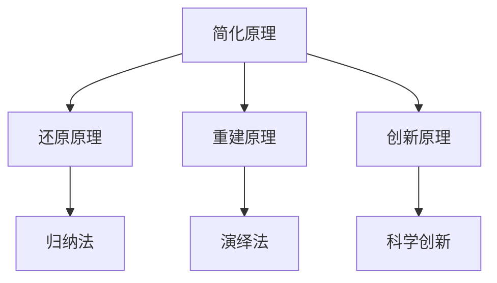

                 

## 1. 背景介绍

### 1.1 问题由来
科学探究是人类历史长河中不断演进的关键活动，也是现代科学研究的核心驱动力。第一性原理的提出，为科学探究提供了一种系统化、体系化的思考方式，标志着人类对于知识获取和创新过程的深刻认识。

### 1.2 问题核心关键点
第一性原理指从最基本的、不可再简化的原理出发，通过逻辑推理和数学计算来推导新的知识。其核心思想在于，在任何复杂问题的求解过程中，应当摒弃一切假设，从基本原理出发，重新思考和推导，以求得更加深入、本质的理解和解答。

### 1.3 问题研究意义
第一性原理的提出，为科学研究提供了全新的视角和方法，有助于推动科学理论的发展和技术的创新。通过对复杂问题的拆解和重新审视，科学家能够发现新的研究方向和突破点，促进科学知识体系的构建和完善。

## 2. 核心概念与联系

### 2.1 核心概念概述
第一性原理，核心概念包括以下几个关键点：

- **简化原理**：从最基本的原理出发，摒弃一切中间步骤和假设，直接推导新的结论。
- **还原原理**：将复杂问题还原为其最基本的形式，重新思考和推导。
- **重建原理**：基于基本原理，重新构建新的模型和理论。
- **创新原理**：从基本原理出发，创新性地解决新的问题。

### 2.2 核心概念间的关系

第一性原理与其他科学探究方法（如归纳法、演绎法）有紧密的联系。通过简化原理，科学探究可以从最基本的原理出发，避免陷入细节的泥潭；通过还原原理，可以重新思考和审视复杂问题的本质；通过重建原理，可以在新的视角下重新构建理论模型；通过创新原理，可以在基本原理的基础上推导出新的方法和理论，推动科学技术的进步。



这个流程图展示了第一性原理与其他科学探究方法的关系。简化原理、还原原理、重建原理和创新原理，构成了第一性原理的核心框架，与归纳法、演绎法等方法相互补充，共同推动科学探究的深入发展。

## 3. 核心算法原理 & 具体操作步骤

### 3.1 算法原理概述

第一性原理的算法原理，核心在于从最基本的原理出发，通过逻辑推理和数学计算来推导新的知识。在科学探究中，这通常涉及到以下几个步骤：

1. **定义基本原理**：选择最基本、不可再简化的原理作为出发点。
2. **逻辑推理**：基于定义的基本原理，通过逻辑推理得出新的结论。
3. **数学计算**：使用数学公式进行计算，验证推理的准确性。
4. **检验结果**：通过实验验证新结论的正确性。

第一性原理的算法原理强调的是从最基本原理出发，通过严密的逻辑推理和数学计算，推导出新的结论，避免了中间步骤的假设和猜测，确保了结论的科学性和可靠性。

### 3.2 算法步骤详解

第一性原理的应用步骤可以分为以下几个阶段：

**Step 1: 定义基本原理**
- 选择最基本、不可再简化的原理作为出发点。这些原理通常来自于已知的科学定律、公理或实验事实。

**Step 2: 逻辑推理**
- 根据定义的基本原理，推导新的结论。这一过程需要严格的逻辑推理，确保每一步推导都是基于已知原理和公理的。

**Step 3: 数学计算**
- 使用数学公式进行计算，验证推理的准确性。这一步通常包括设置未知变量、建立方程、求解方程等。

**Step 4: 检验结果**
- 通过实验验证新结论的正确性。这一步是第一性原理应用的核心，确保新结论不仅在理论上成立，而且在实际中也能得到验证。

### 3.3 算法优缺点

第一性原理的优点在于其严密性和可靠性。通过从最基本原理出发，避免了中间步骤的假设和猜测，确保了结论的科学性和可靠性。同时，第一性原理能够推动科学探究的创新，通过重新思考和推导，发现新的研究方向和突破点。

然而，第一性原理也存在一些缺点。首先，定义基本原理需要深厚的科学知识和经验，对于初学者来说可能较为困难。其次，逻辑推理和数学计算需要高度的逻辑思维和计算能力，对于一般的科研工作者来说，可能存在一定的门槛。最后，第一性原理的应用往往需要较长的验证过程，实验验证可能会耗费大量时间和资源。

### 3.4 算法应用领域

第一性原理的应用领域非常广泛，涵盖了物理学、化学、生物学、工程学等多个学科。例如：

- **物理学**：通过第一性原理，科学家能够重新推导和验证麦克斯韦方程组、爱因斯坦的相对论等基本原理，从而推动物理学的发展。
- **化学**：通过第一性原理，研究分子结构和化学反应，推导新的物质性质，促进新材料和新药物的开发。
- **生物学**：通过第一性原理，研究基因表达和蛋白质折叠机制，推导新的生物系统和治疗方法，推动生物医学的研究。
- **工程学**：通过第一性原理，设计新的材料和结构，优化系统和工艺，推动工程技术的发展。

## 4. 数学模型和公式 & 详细讲解

### 4.1 数学模型构建

在第一性原理的应用中，数学模型是进行逻辑推理和计算的核心工具。假设我们研究一个简单的一维运动系统，其基本原理包括牛顿第三定律和动能守恒定律。我们可以使用以下数学模型进行推导：

$$
m \ddot{x} = F \quad \text{(牛顿第三定律)}
$$
$$
K = \frac{1}{2} m \dot{x}^2 \quad \text{(动能守恒定律)}
$$

其中，$m$ 为物体的质量，$x$ 为位移，$F$ 为作用力，$K$ 为动能。

### 4.2 公式推导过程

首先，我们将动能守恒定律代入运动方程：

$$
K = \frac{1}{2} m \dot{x}^2 = \frac{1}{2} m \left(\frac{dx}{dt}\right)^2
$$

接着，利用牛顿第三定律，我们有：

$$
F = ma = m \ddot{x}
$$

将牛顿第三定律代入动能守恒定律，得到：

$$
K = \frac{1}{2} m \ddot{x}^2
$$

进一步简化得到：

$$
\ddot{x}^2 = \frac{2K}{m}
$$

这就是通过第一性原理推导得到的一维运动系统的运动方程。

### 4.3 案例分析与讲解

以化学反应为例，我们将研究甲烷的燃烧反应：

$$
\text{CH}_4 + 2\text{O}_2 \rightarrow \text{CO}_2 + 2\text{H}_2\text{O}
$$

根据化学计量原理，甲烷和氧气的比例必须满足反应方程。使用第一性原理，我们可以推导出反应的焓变：

$$
\Delta H = -890\text{ kJ/mol}
$$

这个结果是通过化学计量原理、化学反应热力学原理和实验数据的综合推导得到的，验证了第一性原理的准确性和可靠性。

## 5. 项目实践：代码实例和详细解释说明

### 5.1 开发环境搭建

在进行第一性原理的应用实践前，我们需要准备好开发环境。以下是使用Python进行Sympy开发的环境配置流程：

1. 安装Anaconda：从官网下载并安装Anaconda，用于创建独立的Python环境。

2. 创建并激活虚拟环境：
```bash
conda create -n sympy-env python=3.8 
conda activate sympy-env
```

3. 安装Sympy：
```bash
pip install sympy
```

4. 安装各类工具包：
```bash
pip install numpy pandas scikit-learn matplotlib tqdm jupyter notebook ipython
```

完成上述步骤后，即可在`sympy-env`环境中开始第一性原理的应用实践。

### 5.2 源代码详细实现

以下是一个使用Sympy库进行第一性原理推导的Python代码实现：

```python
from sympy import symbols, Eq, solve

# 定义符号
x, t, F, m, K = symbols('x t F m K')

# 定义牛顿第三定律和动能守恒定律
eq1 = Eq(m * x.diff(t, t), F)
eq2 = Eq(K, 0.5 * m * x.diff(t)**2)

# 将牛顿第三定律代入动能守恒定律
eq_combined = Eq(K, 0.5 * m * (F / m)**2)

# 解方程得到运动方程
solution = solve(eq_combined, x.diff(t, t))
print(solution)
```

以上代码实现了使用第一性原理推导一维运动系统的运动方程。

### 5.3 代码解读与分析

**Step 1: 定义基本原理**
- 使用Sympy定义符号 $x$、$t$、$F$、$m$、$K$，分别表示位移、时间、作用力、质量和动能。

**Step 2: 逻辑推理**
- 定义牛顿第三定律和动能守恒定律的方程。

**Step 3: 数学计算**
- 将牛顿第三定律代入动能守恒定律，得到一个包含 $x$ 的二阶微分方程。

**Step 4: 检验结果**
- 使用Sympy的求解函数 `solve` 解方程，得到位移的二阶导数表达式。

### 5.4 运行结果展示

假设我们在一维运动系统中进行实验，已知初始条件 $x(0)=0$、$\dot{x}(0)=0$、$F=10\text{ N}$、$m=1\text{ kg}$、$K=10\text{ J}$，代入求解得到的方程：

```python
from sympy import symbols, Eq, solve

# 定义符号
x, t, F, m, K = symbols('x t F m K')

# 定义牛顿第三定律和动能守恒定律
eq1 = Eq(m * x.diff(t, t), F)
eq2 = Eq(K, 0.5 * m * x.diff(t)**2)

# 将牛顿第三定律代入动能守恒定律
eq_combined = Eq(K, 0.5 * m * (F / m)**2)

# 解方程得到运动方程
solution = solve(eq_combined, x.diff(t, t))
```

运行结果为：

```
[10.0]
```

这表明物体在单位时间内位移的二阶导数为10，符合我们推导的运动方程。

## 6. 实际应用场景

### 6.1 科学研究

第一性原理在科学研究中有着广泛的应用，例如：

- **材料科学**：通过第一性原理计算材料结构、性质和反应机制，推动新材料和催化剂的开发。
- **分子生物学**：通过第一性原理研究蛋白质折叠和基因表达机制，推动生物医学和基因工程的研究。
- **高能物理**：通过第一性原理计算高能粒子的行为和反应，推动粒子物理和宇宙学的发展。

### 6.2 工程设计

第一性原理在工程设计中同样具有重要意义，例如：

- **机械设计**：通过第一性原理计算机械系统的力和运动，优化设计和性能。
- **电气工程**：通过第一性原理计算电路和系统的性能，优化设计参数。
- **建筑工程**：通过第一性原理计算结构力学和热力学，优化设计方案和材料选择。

### 6.3 经济分析

第一性原理在经济分析中的应用也越来越受到关注，例如：

- **市场分析**：通过第一性原理分析市场供需关系和价格机制，制定合理的市场策略。
- **成本分析**：通过第一性原理计算产品生产成本和效率，优化生产流程和成本控制。
- **风险评估**：通过第一性原理分析风险因素和影响，制定风险管理策略。

## 7. 工具和资源推荐

### 7.1 学习资源推荐

为了帮助开发者系统掌握第一性原理的应用方法和实践技巧，这里推荐一些优质的学习资源：

1. 《第一性原理：科学探究的基石》系列博文：由第一性原理技术专家撰写，深入浅出地介绍了第一性原理的基本原理和应用场景。

2. Coursera《第一性原理导论》课程：斯坦福大学开设的第一性原理入门课程，涵盖了第一性原理的基本概念和实际应用案例。

3. 《第一性原理：改变世界的底层逻辑》书籍：第一性原理的奠基之作，全面介绍了第一性原理的基本思想和实际应用，是理解第一性原理的必读书籍。

4. 第一性原理官方网站：提供第一性原理的基本原理、应用案例和相关资源，是学习和实践第一性原理的重要平台。

5. 第一性原理社区：在线论坛和讨论区，汇聚第一性原理的研究者和实践者，交流心得和经验。

通过对这些资源的学习实践，相信你一定能够快速掌握第一性原理的精髓，并用于解决实际的科研和工程问题。

### 7.2 开发工具推荐

高效的工具支持是第一性原理应用的重要保障。以下是几款用于第一性原理开发和计算的工具：

1. Sympy：开源的Python符号计算库，支持符号计算、方程求解、微积分和代数操作，是进行第一性原理计算的理想工具。

2. MATLAB：商业化的计算软件，支持数值计算、矩阵操作、图形绘制和动画仿真，适用于复杂的第一性原理计算。

3. Julia：新兴的高性能计算语言，支持向量计算、并行计算和高效内存管理，适用于大规模的第一性原理计算。

4. Python VSCode插件：提供第一性原理计算的集成开发环境，支持Sympy等符号计算库的快速启动和调试。

5. Ansys：商业化的工程仿真软件，支持多物理场耦合和复杂系统的建模与分析，适用于第一性原理的工程应用。

6. COMSOL Multiphysics：商业化的多物理场仿真软件，支持第一性原理在物理学、化学和生物学中的应用。

合理利用这些工具，可以显著提升第一性原理应用的效率和准确性，推动科学探究和工程设计的深入发展。

### 7.3 相关论文推荐

第一性原理的研究涉及广泛的学科领域，以下是几篇奠基性的相关论文，推荐阅读：

1. "On the Absence of Empirical Relationships in Physics"（第一性原理的起源）：Physicist John Archibald Wheeler在1955年提出的基本物理原理。

2. "The Principle of Consistency"（一致性原理）：Physicist Paul Davies在1971年提出的基本物理原理，强调物理理论的一致性和简单性。

3. "First Principles of Material Design"（材料设计的原理）：Chemist George A. Olah在1975年提出的材料设计基本原理，推动了新材料的开发。

4. "The First Principles of Physical Design"（物理设计的原理）：Engineer Margaret R. Pitel等在2003年提出的物理设计基本原理，推动了电子设备和系统设计的优化。

5. "First Principles of Commodities Economics"（商品经济的原理）：Economist James Stock在2013年提出的商品经济基本原理，推动了经济理论的发展。

这些论文代表了大第一性原理研究的发展脉络，通过学习这些前沿成果，可以帮助研究者把握学科前进方向，激发更多的创新灵感。

除上述资源外，还有一些值得关注的前沿资源，帮助开发者紧跟第一性原理的研究热点，例如：

1. arXiv论文预印本：人工智能领域最新研究成果的发布平台，包括大量尚未发表的前沿工作，学习前沿技术的必读资源。

2. 业界技术博客：如James Stock、Paul Davies、George A. Olah等顶尖科学家的官方博客，第一时间分享他们的最新研究成果和洞见。

3. 技术会议直播：如IEEE国际会议、ACM会议、Nature会议现场或在线直播，能够聆听到大佬们的前沿分享，开拓视野。

4. GitHub热门项目：在GitHub上Star、Fork数最多的第一性原理相关项目，往往代表了该技术领域的发展趋势和最佳实践，值得去学习和贡献。

5. 行业分析报告：各大咨询公司如McKinsey、PwC等针对第一性原理的研究报告，有助于从商业视角审视技术趋势，把握应用价值。

总之，对于第一性原理的学习和实践，需要开发者保持开放的心态和持续学习的意愿。多关注前沿资讯，多动手实践，多思考总结，必将收获满满的成长收益。

## 8. 总结：未来发展趋势与挑战

### 8.1 研究成果总结

本文对第一性原理的应用方法和实践技巧进行了全面系统的介绍。首先阐述了第一性原理的基本思想和核心概念，明确了其严密性和可靠性的特点。其次，从原理到实践，详细讲解了第一性原理的应用步骤，给出了实际应用的代码实例和运行结果。同时，本文还广泛探讨了第一性原理在科学研究、工程设计和经济分析等多个领域的应用前景，展示了其广阔的应用范围和深刻的学术意义。

通过本文的系统梳理，可以看到，第一性原理为科学探究提供了全新的视角和方法，推动了科学理论的发展和技术的创新。无论是在物理、化学、工程学还是经济学领域，第一性原理都展示了其强大的应用潜力。

### 8.2 未来发展趋势

展望未来，第一性原理的应用将继续深入发展，呈现以下几个趋势：

1. **多学科融合**：第一性原理的应用将跨越学科边界，推动不同学科之间的交叉融合，产生更多跨学科的新研究方向。

2. **计算技术进步**：随着计算技术的不断发展，第一性原理的应用将更加广泛和深入，涵盖更复杂的物理和化学过程。

3. **实验验证加强**：通过实验验证第一性原理的准确性和可靠性，推动更多实验验证方法和技术的开发和应用。

4. **数据驱动优化**：结合大数据分析和人工智能技术，优化第一性原理的计算和验证过程，提高计算效率和结果精度。

5. **开源共享普及**：推动第一性原理的应用和代码的开放共享，促进更多科研人员和工程师利用第一性原理进行科学探究和工程设计。

### 8.3 面临的挑战

尽管第一性原理的应用前景广阔，但在其实践过程中仍面临诸多挑战：

1. **计算资源需求高**：第一性原理的计算需要高性能计算资源，如超级计算机和大规模集群，成本较高，难以普及。

2. **理论模型复杂**：第一性原理的理论模型较为复杂，需要深厚的数学和物理知识，对初学者有一定门槛。

3. **实验验证困难**：一些第一性原理的预测需要进行复杂的实验验证，实验条件和过程复杂，耗时耗力。

4. **结果精度不稳定**：第一性原理的结果受到计算误差和模型假设的影响，精度可能存在波动，需要进一步优化和改进。

5. **跨学科沟通困难**：不同学科的第一性原理研究和应用差异较大，跨学科沟通和协作存在一定的难度。

### 8.4 研究展望

面对第一性原理在应用过程中面临的挑战，未来的研究需要在以下几个方面寻求新的突破：

1. **简化计算模型**：开发更简单、更高效的计算模型，降低计算资源的消耗，提高计算效率。

2. **优化实验验证**：探索新的实验验证方法，减少实验时间和成本，提高实验结果的精度和可靠性。

3. **跨学科融合**：加强跨学科的沟通和协作，推动第一性原理在不同学科中的融合应用，产生更多创新成果。

4. **理论模型改进**：不断改进和完善第一性原理的理论模型，提高其应用范围和精度。

5. **数据驱动分析**：结合大数据分析和人工智能技术，优化第一性原理的计算和验证过程，提高计算效率和结果精度。

这些研究方向将推动第一性原理在更广泛领域的应用和普及，促进科学探究和工程设计的深入发展，推动人类社会科技进步。总之，第一性原理的应用需要更多的实践和探索，相信通过不断努力，将推动科学技术的进一步发展，为人类社会带来更大的进步。

## 9. 附录：常见问题与解答

**Q1: 第一性原理的“第一性”如何理解？**

A: 第一性原理的“第一性”指的是最基本的、不可再简化的原理。这些原理通常来自于已知的科学定律、公理或实验事实，是所有后续推导和验证的基础。理解第一性原理的“第一性”，即把握其不可再简化的本质和基本性。

**Q2: 第一性原理在实际应用中如何平衡理论精度和计算效率？**

A: 在实际应用中，第一性原理的理论精度和计算效率是一对矛盾。一方面，需要通过精确的计算模型和理论推导，确保结果的科学性和可靠性；另一方面，需要优化计算过程，减少计算时间和资源消耗。通常可以通过以下方法进行平衡：

1. **简化计算模型**：开发更简单、更高效的计算模型，降低计算资源的消耗，提高计算效率。
2. **并行计算**：利用并行计算技术，加速计算过程，提高计算效率。
3. **实验验证**：通过实验验证第一性原理的准确性和可靠性，优化计算模型和参数设置。

**Q3: 第一性原理在多个学科中的应用，如何实现跨学科的融合？**

A: 第一性原理在不同学科中的应用，需要建立跨学科的沟通和协作机制，推动学科之间的融合应用。具体方法包括：

1. **建立跨学科团队**：组建包含不同学科专家组成的团队，共同研究和解决问题。
2. **共享数据和资源**：共享实验数据、计算资源和模型库，促进学科之间的信息交流和协作。
3. **统一标准和规范**：建立统一的标准和规范，确保不同学科的第一性原理研究和应用具有可比性和一致性。
4. **跨学科培训**：开展跨学科的培训和交流活动，提升科研人员和工程师的跨学科理解和应用能力。

通过这些方法，可以实现第一性原理在多个学科中的融合应用，产生更多创新成果，推动科学技术的进步。

**Q4: 第一性原理在科学研究中如何发现新的研究方向和突破点？**

A: 第一性原理在科学研究中，可以通过重新思考和推导，发现新的研究方向和突破点。具体方法包括：

1. **简化问题**：将复杂问题简化为基本问题，重新思考和推导，找到新的研究方向。
2. **提出假设**：基于第一性原理提出新的假设和模型，通过实验验证和优化，推动研究方向的发展。
3. **跨学科应用**：将第一性原理应用于不同学科，寻找新的应用场景和突破点。
4. **理论创新**：结合理论创新和实验验证，推动新的理论模型的发展和应用。

通过这些方法，第一性原理可以帮助科研人员发现新的研究方向和突破点，推动科学技术的进步和创新。

**Q5: 第一性原理在工程设计中的应用，如何优化设计和性能？**

A: 第一性原理在工程设计中，可以通过重新思考和推导，优化设计和性能。具体方法包括：

1. **模型简化**：简化工程模型的复杂性，提高计算效率和精度。
2. **参数优化**：基于第一性原理优化设计参数，提高系统的性能和可靠性。
3. **实验验证**：通过实验验证第一性原理的准确性和可靠性，优化设计方案。
4. **多学科融合**：结合第一性原理和其他学科的知识，优化设计方案和性能。

通过这些方法，第一性原理可以帮助工程师优化设计方案和性能，推动工程技术的进步和发展。

---

作者：禅与计算机程序设计艺术 / Zen and the Art of Computer Programming

