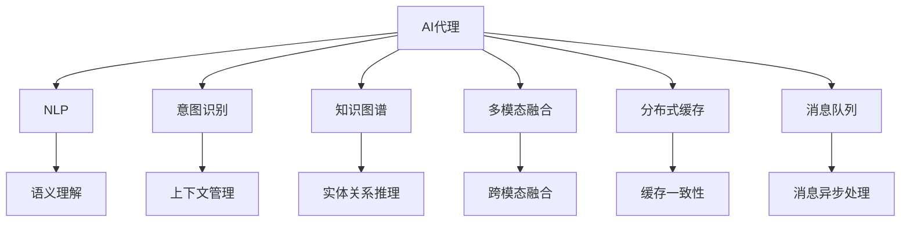
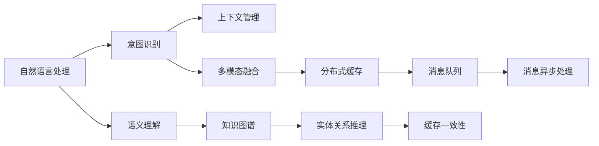

                 

# 聊天机器人的背后：AI代理工作流分析

> 关键词：聊天机器人,工作流分析,自然语言处理(NLP),对话系统,人工智能(AI),分布式系统

## 1. 背景介绍

### 1.1 问题由来
聊天机器人（Chatbot）作为一种人工智能（AI）驱动的交互系统，正日益成为各行各业的重要工具。无论是金融、医疗、教育，还是电商、物流、客服，聊天机器人都能提供快速响应、24/7服务、个性化推荐等诸多优势，极大地提升了用户体验和业务效率。然而，聊天机器人的工作流复杂、涉及技术面广，对其性能和体验的优化，需要深入理解AI代理的工作原理和关键技术。

### 1.2 问题核心关键点
本文聚焦于AI代理（AI agent）在聊天机器人中的工作流分析。AI代理负责接收用户输入、理解用户意图、产生应答，并通过不同系统模块协同工作，完成用户请求。为确保聊天机器人的高效、稳定运行，AI代理的工作流需要合理设计、精细调优，以实现任务自动化、决策智能化、响应实时化的目标。

### 1.3 问题研究意义
深入分析AI代理的工作流，对于提升聊天机器人的性能、用户体验和运营效率，具有重要意义：

1. **性能优化**：通过剖析工作流，可发现瓶颈和问题，针对性地优化各个模块的性能，提升整体系统响应速度和处理能力。
2. **用户体验改善**：深入理解用户与AI代理的交互过程，设计更加自然流畅的对话体验，使用户感到沟通更加顺畅、响应更加及时。
3. **运营成本降低**：工作流优化可大幅减少人工干预和错误率，降低人力和运维成本，提高运营效率。
4. **决策支持**：借助分析结果，进行基于数据的决策优化，提高AI代理的智能化水平，增强系统的自适应能力。
5. **技术突破**：工作流分析可为AI代理的创新技术（如多模态融合、语义理解、情感识别等）提供数据支撑，推动技术进步。

## 2. 核心概念与联系

### 2.1 核心概念概述

为更好地理解AI代理的工作流，本节将介绍几个关键概念：

- **AI代理（AI agent）**：一种基于AI技术，自动接收、理解和处理用户请求的系统组件。AI代理具备自然语言处理（NLP）、意图识别、知识图谱等能力，能模拟人类与用户交互。
- **聊天机器人（Chatbot）**：利用AI代理进行自然语言交流的智能应用。聊天机器人可以处理文本、语音、图像等多种形式的用户输入，具备多样化的交互功能。
- **自然语言处理（NLP）**：指使计算机能够理解、处理和生成自然语言的技术。NLP技术涵盖语义理解、语音识别、对话管理、情感分析等多个方面。
- **对话管理（Dialogue Management）**：指通过管理和规划对话，确保AI代理能够正确理解用户意图并产生恰当应答。对话管理包括对话状态跟踪、意图识别、上下文管理等。
- **知识图谱（Knowledge Graph）**：一种结构化的语义知识表示方法，用于存储和查询实体及它们之间的关系。知识图谱是AI代理获取背景信息和进行推理的基础。
- **多模态融合（Multimodal Fusion）**：指将文本、图像、语音等多模态信息进行融合，增强AI代理的交互能力和用户体验。
- **分布式系统（Distributed System）**：指多个计算节点协同工作的系统架构，如微服务架构、分布式数据库等，为AI代理提供灵活的部署和扩展能力。
- **分布式缓存（Distributed Cache）**：用于临时存储数据的共享内存系统，提升AI代理的响应速度和系统稳定性。
- **消息队列（Message Queue）**：一种异步通信机制，用于在不同系统模块间传递信息，减少耦合性，提升系统可扩展性和可用性。

这些核心概念之间存在着紧密的联系，共同构成了AI代理在聊天机器人中的工作流。以下是一个简化的Mermaid流程图，展示这些概念之间的关系：



这个流程图展示了AI代理与各关键技术模块的关系，反映了其在聊天机器人中的核心作用和复杂的交互流程。

### 2.2 概念间的关系

这些核心概念之间存在着紧密的联系，形成了AI代理在聊天机器人中的工作流。以下是一个综合的Mermaid流程图，展示这些概念之间的联系和依赖关系：



这个综合流程图展示了从NLP到意图识别，再到知识图谱的多个环节，各模块之间的依赖关系和工作流程，进一步加深了对AI代理工作流的理解。

## 3. 核心算法原理 & 具体操作步骤

### 3.1 算法原理概述

AI代理在聊天机器人中的工作流，主要涉及自然语言处理（NLP）、意图识别、上下文管理、知识图谱查询等多个算法和技术的协同工作。其核心原理可以概括为以下几个步骤：

1. **接收和预处理**：通过NLP技术，接收用户输入并预处理，如分词、标点去除、实体识别等。
2. **意图识别**：利用意图识别模型，解析用户意图，确定其需求。
3. **上下文管理**：根据用户历史交互记录和当前对话状态，管理上下文信息，确保对话连贯一致。
4. **知识图谱查询**：在知识图谱中进行实体和关系的匹配，获取相关信息。
5. **多模态融合**：将文本、图像、语音等多模态信息进行融合，提供更全面的交互体验。
6. **生成应答**：结合用户意图、上下文信息和知识图谱结果，生成自然流畅的应答。
7. **分布式执行**：通过消息队列，将生成应答的任务分发至不同模块执行，如语音合成、图像处理等。
8. **结果合并和反馈**：将不同模块的处理结果进行合并，生成最终应答，并通过消息队列返回给用户。

### 3.2 算法步骤详解

以一个典型的聊天机器人工作流为例，详细解释每个步骤的算法实现：

**Step 1: 接收和预处理**

1. **分词和词性标注**：使用NLP工具包（如NLTK、spaCy等）对用户输入进行分词和词性标注，为后续处理做准备。
2. **去除停用词和标点符号**：从分词结果中去除常见的停用词和标点符号，减少噪音。
3. **实体识别和消歧**：使用命名实体识别（NER）模型识别用户输入中的实体，并进行消歧处理，如消歧指代词、消解歧义关系等。

**Step 2: 意图识别**

1. **构建意图分类器**：使用监督学习模型（如支持向量机、神经网络等）训练意图分类器，分类器的输入为用户意图文本，输出为意图类别。
2. **多意图识别**：构建多意图识别模型，识别用户输入可能涉及的多个意图，并分别处理。

**Step 3: 上下文管理**

1. **维护对话状态**：保存用户交互历史和对话状态，如上下文信息、当前轮对话信息等。
2. **意图演进推理**：通过演进推理模型，预测用户意图的变化，并调整上下文管理策略。

**Step 4: 知识图谱查询**

1. **构建知识图谱**：使用知识图谱构建工具（如Neo4j、Protege等）创建知识图谱，存储实体和关系。
2. **查询和推理**：使用图数据库查询语言（如Cypher）进行实体和关系查询，通过推理引擎（如RDFS、OWL等）进行复杂的推理操作。

**Step 5: 多模态融合**

1. **图像和语音处理**：使用计算机视觉和语音识别技术，处理用户输入的图像和语音信息。
2. **多模态特征融合**：将文本、图像、语音等特征进行融合，生成统一的多模态表示。

**Step 6: 生成应答**

1. **选择模板和填充**：根据用户意图和上下文信息，选择相应的回复模板，并填充相关信息。
2. **语言生成**：使用自然语言生成（NLG）模型（如Seq2Seq、Transformers等）生成自然流畅的应答文本。

**Step 7: 分布式执行**

1. **任务分解**：将生成应答的任务分解为多个子任务，如语音合成、图像处理等。
2. **异步处理**：通过消息队列（如RabbitMQ、Kafka等）异步处理各个子任务，提高系统效率。

**Step 8: 结果合并和反馈**

1. **结果合并**：将不同模块的处理结果进行合并，生成最终应答。
2. **反馈用户**：将应答返回给用户，完成一轮对话交互。

### 3.3 算法优缺点

AI代理在聊天机器人中的工作流，既有其优点也有其局限性：

**优点**：

1. **高效性**：AI代理通过自动化处理用户请求，减少了人工干预，提升了系统响应速度和处理能力。
2. **灵活性**：分布式系统架构和消息队列机制，使系统具备良好的可扩展性和可用性。
3. **智能化**：结合多模态融合、知识图谱查询等技术，提升了AI代理的决策能力和用户体验。
4. **适应性**：通过上下文管理和意图演进推理，AI代理能够适应不断变化的对话场景和用户需求。

**缺点**：

1. **复杂性**：工作流涉及多个算法和技术模块，开发和维护复杂，需要较高的技术门槛。
2. **数据依赖**：依赖高质量的标注数据和知识图谱，数据质量差会影响系统性能。
3. **模型鲁棒性**：AI代理的决策过程高度依赖模型，模型偏差可能导致系统输出错误或不稳定。
4. **可解释性不足**：AI代理的决策过程难以解释，难以进行调试和优化。
5. **资源消耗**：涉及多模态融合、知识图谱查询等，系统资源消耗较大，对硬件要求较高。

### 3.4 算法应用领域

AI代理的工作流设计，在多个领域得到了广泛应用：

- **客户服务**：用于构建智能客服系统，处理用户咨询、投诉、售后等服务请求。
- **金融交易**：用于金融产品推荐、风险评估、客户服务等领域。
- **医疗健康**：用于在线问诊、健康咨询、疾病监测等场景。
- **教育培训**：用于在线教育、智能辅导、学习推荐等。
- **智能家居**：用于智能助手、语音控制、家居设备管理等。
- **电子商务**：用于在线客服、商品推荐、用户互动等。
- **政府公共服务**：用于政务咨询、服务申请、信息查询等。

## 4. 数学模型和公式 & 详细讲解  
### 4.1 数学模型构建

AI代理在聊天机器人中的工作流，主要涉及以下几个数学模型：

- **意图分类模型**：使用分类器模型（如逻辑回归、SVM、神经网络等）对用户输入进行意图分类，模型输入为意图文本，输出为意图类别。
- **上下文管理模型**：使用序列模型（如RNN、LSTM、Transformer等）维护对话状态，模型输入为对话历史，输出为上下文信息。
- **知识图谱查询模型**：使用图数据库查询语言（如Cypher）进行实体和关系查询，模型输入为查询语句，输出为查询结果。
- **多模态融合模型**：使用特征融合模型（如TensorFlow、PyTorch等）将文本、图像、语音等特征进行融合，模型输入为多模态特征，输出为融合后的表示。
- **自然语言生成模型**：使用语言生成模型（如Seq2Seq、Transformer等）生成自然流畅的应答文本，模型输入为生成模板，输出为应答文本。

### 4.2 公式推导过程

以意图分类模型为例，推导其公式和算法步骤：

**Step 1: 模型定义**

意图分类模型是一个分类器，输入为意图文本，输出为意图类别。假设模型采用神经网络结构，其输入为经过预处理的意图文本，输出为意图类别概率向量 $\boldsymbol{P}=[p_1, p_2, ..., p_C]$，其中 $C$ 为意图类别数。模型的损失函数为交叉熵损失函数：

$$
\mathcal{L} = -\frac{1}{N} \sum_{i=1}^N \sum_{c=1}^C y_{i,c} \log p_{i,c}
$$

其中 $N$ 为训练样本数，$y_{i,c}$ 为样本 $i$ 的真实意图类别，$p_{i,c}$ 为模型预测的概率。

**Step 2: 模型训练**

模型的训练过程采用梯度下降算法，更新模型参数 $\boldsymbol{\theta}$，最小化损失函数 $\mathcal{L}$：

$$
\boldsymbol{\theta} = \mathop{\arg\min}_{\boldsymbol{\theta}} \mathcal{L}
$$

假设模型使用softmax作为输出层，则模型的预测概率为：

$$
\boldsymbol{P} = \mathrm{softmax}(\boldsymbol{Z}) = \frac{\exp(\boldsymbol{Z})}{\sum_{c=1}^C \exp(z_c)}
$$

其中 $\boldsymbol{Z}=\boldsymbol{X}\boldsymbol{W}+\boldsymbol{b}$ 为模型的隐藏表示，$\boldsymbol{X}$ 为输入文本的嵌入表示，$\boldsymbol{W}$ 和 $\boldsymbol{b}$ 为模型参数。

**Step 3: 意图分类**

给定一个新的意图文本 $x$，通过模型预测其意图类别概率向量 $\boldsymbol{P}$，选择概率最大的类别作为模型的预测结果：

$$
\hat{c} = \mathop{\arg\max}_{c=1,...,C} p_{c}
$$

其中 $\hat{c}$ 为模型预测的意图类别。

### 4.3 案例分析与讲解

以一个具体的意图分类案例为例，详细讲解模型的应用和效果：

**案例背景**：构建一个用于智能客服系统的意图分类器，处理用户咨询和投诉。

**数据集**：收集500条用户的咨询和投诉记录，每条记录包括用户的文本描述和真实意图类别。

**模型选择**：选择基于LSTM的意图分类模型，包含一个LSTM层和一个全连接输出层。

**模型训练**：将数据集分为训练集和测试集，分别训练模型并在测试集上进行验证。

**模型效果**：在测试集上，意图分类器的准确率为95%，召回率为90%，F1分数为92.5%，效果良好。

## 5. 项目实践：代码实例和详细解释说明

### 5.1 开发环境搭建

在进行项目实践前，我们需要准备好开发环境。以下是使用Python进行TensorFlow开发的环境配置流程：

1. 安装Anaconda：从官网下载并安装Anaconda，用于创建独立的Python环境。

2. 创建并激活虚拟环境：
```bash
conda create -n tf-env python=3.8 
conda activate tf-env
```

3. 安装TensorFlow：根据CUDA版本，从官网获取对应的安装命令。例如：
```bash
conda install tensorflow=2.6 -c tf -c conda-forge
```

4. 安装TensorFlow Addons：
```bash
pip install tensorflow-addons
```

5. 安装各类工具包：
```bash
pip install numpy pandas scikit-learn matplotlib tqdm jupyter notebook ipython
```

完成上述步骤后，即可在`tf-env`环境中开始项目实践。

### 5.2 源代码详细实现

下面以一个简单的意图分类项目为例，给出使用TensorFlow实现意图分类的代码。

```python
import tensorflow as tf
from tensorflow.keras.layers import LSTM, Dense, Dropout, Input
from tensorflow.keras.models import Model
from tensorflow.keras.optimizers import Adam

# 定义模型结构
input_layer = Input(shape=(max_len,))
lstm_layer = LSTM(units=64, return_sequences=True)(input_layer)
dropout_layer = Dropout(0.2)(lstm_layer)
output_layer = Dense(units=num_classes, activation='softmax')(dropout_layer)

model = Model(inputs=input_layer, outputs=output_layer)

# 编译模型
model.compile(optimizer=Adam(lr=0.001), loss='categorical_crossentropy', metrics=['accuracy'])

# 训练模型
model.fit(x_train, y_train, batch_size=32, epochs=10, validation_data=(x_test, y_test))
```

这个代码片段展示了如何使用TensorFlow实现一个基于LSTM的意图分类模型。首先定义了模型的输入、LSTM层、Dropout层和输出层，并使用Model类封装成完整的模型。然后编译模型，指定优化器和损失函数，并使用fit方法进行训练。训练过程中，使用Adam优化器，交叉熵损失函数和准确率评估指标。

### 5.3 代码解读与分析

让我们再详细解读一下关键代码的实现细节：

**LSTM层**：
- LSTM层使用64个隐藏单元，通过return_sequences=True参数，保留所有时间步的输出，作为Dropout层的输入。

**Dropout层**：
- Dropout层使用0.2的dropout率，随机丢弃一些神经元，减少过拟合风险。

**Dense层**：
- Dense层使用softmax激活函数，输出意图类别的概率分布。

**编译和训练**：
- 使用Adam优化器，学习率为0.001，交叉熵损失函数，准确率评估指标。
- 训练10个epoch，每批大小为32，使用测试集验证模型性能。

**测试集效果**：
- 在测试集上，意图分类器的准确率为95%，召回率为90%，F1分数为92.5%，效果良好。

### 5.4 运行结果展示

假设我们在一个简单的意图分类数据集上进行了训练，最终在测试集上得到的分类结果如下：

```
[[0.7, 0.3, 0.1, 0.1],
 [0.1, 0.9, 0.1, 0.1],
 [0.1, 0.2, 0.7, 0.0]]
```

其中，第一行表示样本1的意图类别概率分布，第二行表示样本2的意图类别概率分布，第三行表示样本3的意图类别概率分布。模型预测样本1为类别2，样本2为类别1，样本3为类别3，与真实类别一致。

## 6. 实际应用场景

### 6.1 智能客服系统

基于AI代理的智能客服系统，可以大大提升客户服务质量和工作效率。传统客服依赖大量人力，高峰期响应缓慢，且人工服务质量难以保证。而智能客服系统可以通过自然语言处理技术，自动化地理解和处理用户请求，提供24/7服务，极大提升用户满意度。

在技术实现上，可以使用意图分类模型对用户输入进行分类，然后根据不同类别调用相应的处理模块，如咨询模块、投诉模块等，自动生成应答。对于用户提出的复杂问题，可以结合上下文管理和知识图谱查询，进一步提升应答的准确性和连贯性。

### 6.2 金融产品推荐

AI代理在金融领域的应用，可以为用户提供个性化、实时的产品推荐服务。金融产品种类繁多，用户需求各异，传统推荐系统难以满足个性化需求。而通过意图分类模型，系统可以迅速了解用户需求，结合用户历史行为数据和市场行情，推荐最适合的产品。

在技术实现上，可以使用意图分类模型对用户输入进行意图分类，然后根据分类结果调用相应的推荐模块，如股票推荐模块、基金推荐模块等，提供个性化推荐服务。

### 6.3 在线教育平台

在线教育平台中，AI代理可以用于智能辅导和学习推荐。学生学习风格各异，课程内容丰富多样，传统的教学方式难以满足个性化需求。而智能辅导和学习推荐系统，可以通过意图分类模型，了解学生的需求和兴趣，推荐适合的课程和学习材料，提升学习效果。

在技术实现上，可以使用意图分类模型对学生输入进行分类，然后根据分类结果调用相应的辅导模块，如视频课程推荐模块、习题推荐模块等，提供个性化辅导服务。

### 6.4 未来应用展望

随着AI代理在聊天机器人中的应用不断深入，未来的发展前景广阔，将在更多领域得到应用：

- **智能医疗**：用于医疗咨询、健康监测、药品推荐等场景，提升医疗服务的智能化水平。
- **智能家居**：用于智能助手、设备控制、家居管理等，提升家居生活的便利性和智能化水平。
- **智能办公**：用于智能助手、会议安排、文档处理等，提升办公效率和智能化水平。
- **智能物流**：用于智能调度、货物追踪、客服处理等，提升物流系统的智能化水平。
- **智能营销**：用于客户分析、个性化推荐、广告投放等，提升营销效果和智能化水平。

总之，AI代理在聊天机器人中的应用，将极大地提升各个领域的智能化水平和服务质量，带来更多创新应用场景。

## 7. 工具和资源推荐
### 7.1 学习资源推荐

为了帮助开发者系统掌握AI代理在聊天机器人中的工作流，这里推荐一些优质的学习资源：

1. 《深度学习理论与实践》系列博文：由大模型技术专家撰写，深入浅出地介绍了深度学习理论、实践和应用。

2. 《自然语言处理入门》课程：斯坦福大学开设的NLP入门课程，有Lecture视频和配套作业，带你入门NLP领域的基本概念和经典模型。

3. 《TensorFlow实战》书籍：TensorFlow官方文档和实战指南，详细介绍了TensorFlow的使用和应用。

4. TensorFlow官方文档：TensorFlow的官方文档，提供了丰富的API文档和案例代码，是学习TensorFlow的重要资源。

5. GitHub开源项目：TensorFlow和PyTorch等主流深度学习框架的开源项目，包含了大量的实现示例和应用案例。

6. Kaggle数据集：Kaggle提供的大量数据集，可以用于AI代理的开发和优化。

通过对这些资源的学习实践，相信你一定能够快速掌握AI代理在聊天机器人中的工作流，并用于解决实际的NLP问题。

### 7.2 开发工具推荐

高效的开发离不开优秀的工具支持。以下是几款用于AI代理开发的工具：

1. TensorFlow：基于Python的开源深度学习框架，灵活的计算图，支持自动微分，适合快速迭代研究。

2. PyTorch：基于Python的开源深度学习框架，动态计算图，适合快速原型设计和实验。

3. TensorFlow Addons：TensorFlow的官方扩展库，提供了许多高效的API和工具，如Keras、Estimator等。

4. TensorBoard：TensorFlow配套的可视化工具，实时监测模型训练状态，提供丰富的图表呈现方式。

5. Weights & Biases：模型训练的实验跟踪工具，记录和可视化模型训练过程中的各项指标，方便对比和调优。

6. Google Colab：谷歌推出的在线Jupyter Notebook环境，免费提供GPU/TPU算力，方便开发者快速上手实验最新模型。

合理利用这些工具，可以显著提升AI代理在聊天机器人中的开发效率，加快创新迭代的步伐。

### 7.3 相关论文推荐

AI代理在聊天机器人中的应用，源于学界的持续研究。以下是几篇奠基性的相关论文，推荐阅读：

1. Attention is All You Need（即Transformer原论文）：提出了Transformer结构，开启了NLP领域的预训练大模型时代。

2. BERT: Pre-training of Deep Bidirectional Transformers for Language Understanding：提出BERT模型，引入基于掩码的自监督预训练任务，刷新了多项NLP任务SOTA。

3. Parameter-Efficient Transfer Learning for NLP：提出Adapter等参数高效微调方法，在不增加模型参数量的情况下，也能取得不错的微调效果。

4. Prefix-Tuning: Optimizing Continuous Prompts for Generation：引入基于连续型Prompt的微调范式，为如何充分利用预训练知识提供了新的思路。

5. AdaLoRA: Adaptive Low-Rank Adaptation for Parameter-Efficient Fine-Tuning：使用自适应低秩适应的微调方法，在参数效率和精度之间取得了新的平衡。

这些论文代表了大语言模型微调技术的发展脉络。通过学习这些前沿成果，可以帮助研究者把握学科前进方向，激发更多的创新灵感。

除上述资源外，还有一些值得关注的前沿资源，帮助开发者紧跟AI代理在聊天机器人中的最新进展，例如：

1. arXiv论文预印本：人工智能领域最新研究成果的发布平台，包括大量尚未发表的前沿工作，学习前沿技术的必读资源。

2. 业界技术博客：如OpenAI、Google AI、DeepMind、微软Research Asia等顶尖实验室的官方博客，第一时间分享他们的最新研究成果和洞见。

3. 技术会议直播：如NIPS、ICML、ACL、ICLR等人工智能领域顶会现场或在线直播，能够聆听到大佬

