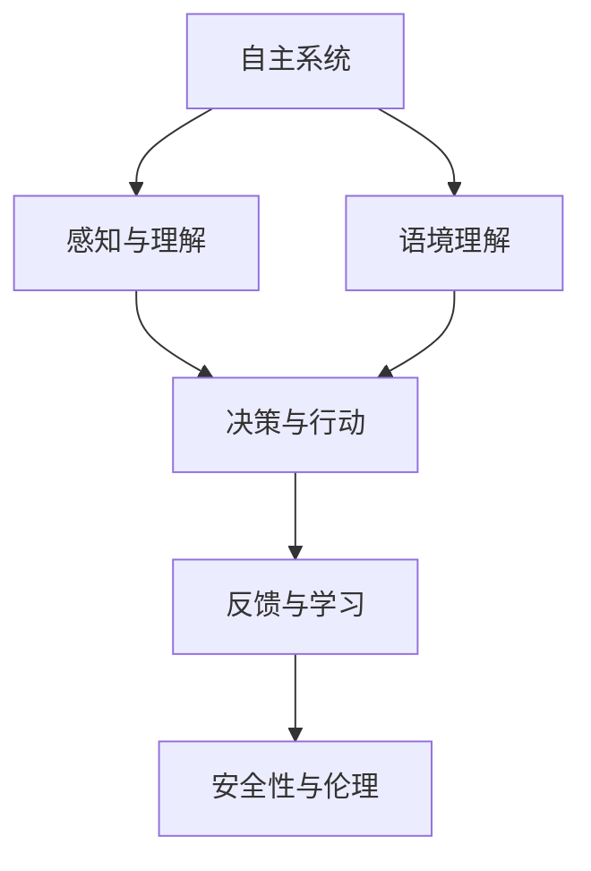
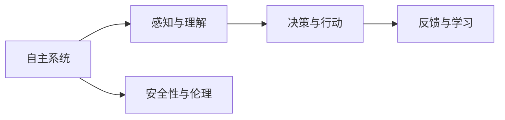
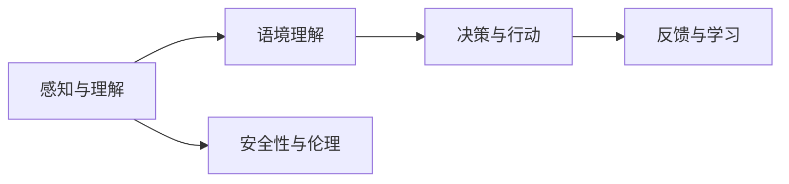
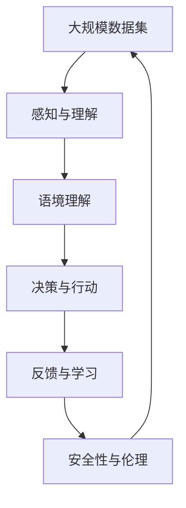

                 

# 自主系统与意识功能的互动

## 1. 背景介绍

### 1.1 问题由来

在当今的数字化时代，自主系统（Autonomous Systems）已经成为各个领域的重要组成部分，从无人驾驶汽车、智能家居到医疗机器人，自主系统的应用场景日益增多。然而，这些系统的智能化和自主决策能力不仅仅依赖于算法和数据，还在很大程度上取决于其意识功能的实现。意识功能使自主系统能够感知环境、理解语境、做出决策并产生行动，从而实现更高级别的智能互动。

### 1.2 问题核心关键点

自主系统与意识功能的互动涉及以下几个核心问题：
1. **感知与理解**：如何使自主系统能够通过传感器和输入数据感知环境，并从中提取有价值的信息。
2. **语境理解**：如何在动态变化的环境中进行语境理解，并根据语境调整行为。
3. **决策与行动**：如何基于感知和理解进行决策，并执行相应的行动。
4. **反馈与学习**：如何通过反馈机制实现系统的学习和优化，提高系统性能。
5. **安全性与伦理**：如何确保自主系统的决策和行为在安全性和伦理道德方面不出现问题。

这些问题涉及计算机视觉、自然语言处理、决策科学等多个领域的知识，需要跨学科的综合研究。本文旨在探讨这些问题，并提供一些解决方案。

### 1.3 问题研究意义

研究自主系统与意识功能的互动，对于提升自主系统的智能化水平、保证系统安全性和伦理道德具有重要意义：
1. **提升智能化水平**：通过意识功能的实现，自主系统可以更自然地与人类进行交互，处理更复杂、更动态的环境变化。
2. **保障安全性**：意识的引入有助于系统进行风险评估和决策，减少意外事故的发生。
3. **增强伦理道德**：通过意识功能，系统可以更好地理解和处理伦理道德问题，避免对人类造成伤害。

## 2. 核心概念与联系

### 2.1 核心概念概述

1. **自主系统（Autonomous Systems）**：
   - 指能够自主决策和执行任务的智能系统。
   - 典型例子包括无人驾驶汽车、无人机、智能家居等。

2. **意识功能（Consciousness Functionality）**：
   - 指系统能够感知、理解、决策和行动的能力。
   - 意识功能的实现依赖于感知、认知、决策等多个模块的协同工作。

3. **感知与理解（Perception and Understanding）**：
   - 指系统如何通过传感器获取环境信息，并从中提取有价值的数据。
   - 涉及计算机视觉、声音识别、运动捕捉等多个领域。

4. **语境理解（Context Understanding）**：
   - 指系统如何根据当前的环境和历史数据理解语境，做出合适的决策。
   - 依赖于自然语言处理、知识图谱等技术。

5. **决策与行动（Decision and Action）**：
   - 指系统如何基于感知和理解进行决策，并执行相应的行动。
   - 依赖于决策理论、规划算法等。

6. **反馈与学习（Feedback and Learning）**：
   - 指系统如何通过反馈机制进行学习和优化，提高系统性能。
   - 涉及强化学习、自适应算法等。

7. **安全性与伦理（Safety and Ethics）**：
   - 指系统在决策和行为过程中如何保证安全性和伦理道德。
   - 依赖于风险评估、伦理审查等机制。

这些核心概念之间的联系可以通过以下Mermaid流程图来展示：



这个流程图展示了自主系统与意识功能之间的相互作用关系，各模块协同工作，实现系统的智能决策和行为。

### 2.2 概念间的关系

这些核心概念之间存在着紧密的联系，形成了自主系统与意识功能的完整生态系统。我们可以进一步细化这些概念的关系，以更清晰地理解系统的工作原理和优化方向。

#### 2.2.1 自主系统的学习范式



这个流程图展示了自主系统的学习范式，从感知与理解到决策与行动，再到反馈与学习，形成了一个闭环的循环系统，不断优化系统的性能。

#### 2.2.2 意识功能的具体实现



这个流程图展示了意识功能的具体实现路径，从感知与理解到语境理解，再到决策与行动，最终通过反馈与学习不断优化系统性能，并确保安全性与伦理。

### 2.3 核心概念的整体架构

最后，我们用一个综合的流程图来展示这些核心概念在大规模自主系统中的整体架构：



这个综合流程图展示了从大规模数据集的感知与理解到最终的安全性与伦理的完整路径，强调了各模块的协同作用和闭环优化。

## 3. 核心算法原理 & 具体操作步骤
### 3.1 算法原理概述

自主系统与意识功能的互动涉及多种算法和技术的综合应用，包括但不限于：
- 计算机视觉（Computer Vision）：用于图像和视频的感知与理解。
- 自然语言处理（Natural Language Processing, NLP）：用于文本的感知与理解。
- 决策科学（Decision Science）：用于制定决策和行动的策略。
- 强化学习（Reinforcement Learning, RL）：用于通过反馈机制进行学习和优化。
- 安全与伦理评估（Safety and Ethics Assessment）：用于保障系统的安全性和伦理道德。

这些算法的核心原理可以总结如下：

1. **感知与理解**：通过传感器和输入设备获取环境信息，使用计算机视觉和自然语言处理技术进行处理和分析。
2. **语境理解**：利用知识图谱、规则引擎等技术，对感知结果进行语境分析，理解当前环境的状态和目标。
3. **决策与行动**：基于感知和理解结果，使用决策算法和规划算法进行决策，并控制执行器执行相应的行动。
4. **反馈与学习**：通过反馈机制收集系统行为的结果，使用强化学习算法进行学习和优化，提升系统性能。
5. **安全性与伦理**：通过风险评估和伦理审查机制，确保系统在决策和行为过程中不产生负面影响。

### 3.2 算法步骤详解

以下是自主系统与意识功能互动的详细步骤：

**Step 1: 数据采集与感知**
- 使用各种传感器和输入设备（如摄像头、麦克风、雷达等）采集环境数据。
- 使用计算机视觉技术处理图像数据，提取关键信息。
- 使用自然语言处理技术处理文本数据，提取关键信息。

**Step 2: 语境理解**
- 利用知识图谱、规则引擎等技术，结合历史数据，对感知结果进行语境分析。
- 理解当前环境的状态和目标，确定系统的行动方向。

**Step 3: 决策与行动**
- 基于感知和语境理解结果，使用决策算法（如专家系统、决策树、贝叶斯网络等）进行决策。
- 使用规划算法（如A*、RRT等）生成行动计划，并控制执行器执行行动。

**Step 4: 反馈与学习**
- 收集系统行为的结果，使用强化学习算法（如Q-Learning、策略梯度等）进行学习和优化。
- 定期更新决策算法和规划算法，提升系统性能。

**Step 5: 安全性与伦理评估**
- 对系统的决策和行动进行风险评估，确保安全性和伦理道德。
- 使用伦理审查机制，避免系统对人类造成伤害。

### 3.3 算法优缺点

自主系统与意识功能的互动算法具有以下优点：
- 实现了系统的高自主性和智能化。
- 能够适应动态变化的环境，灵活应对各种情况。
- 通过反馈与学习机制，不断优化系统性能。

同时，也存在一些缺点：
- 数据采集和感知环节需要高性能传感器和计算设备。
- 语境理解和决策过程中涉及复杂算法，需要高技术水平。
- 安全性与伦理评估需要严格的审查和评估机制。

### 3.4 算法应用领域

自主系统与意识功能的互动算法已经广泛应用于以下几个领域：

1. **无人驾驶汽车**：通过摄像头、雷达、激光雷达等传感器采集环境数据，结合计算机视觉和自然语言处理技术进行感知与理解，利用决策算法和规划算法进行决策和行动，确保行车安全。
2. **智能家居**：通过摄像头、麦克风等设备采集环境数据，结合自然语言处理技术进行语境理解，利用决策算法和规划算法进行家居控制和互动，提升居住体验。
3. **医疗机器人**：通过摄像头、传感器等设备采集患者数据，结合计算机视觉和自然语言处理技术进行感知与理解，利用决策算法和规划算法进行手术操作和护理，确保医疗质量。
4. **智能客服**：通过语音识别和自然语言处理技术进行语境理解，利用决策算法和规划算法进行客户交互，提供高质量的客户服务。
5. **金融交易**：通过市场数据和用户交互数据进行感知与理解，利用决策算法和规划算法进行交易决策和风险管理，提升投资回报。

## 4. 数学模型和公式 & 详细讲解 & 举例说明

### 4.1 数学模型构建

以下是一个简化版的自主系统与意识功能互动的数学模型：

- **感知与理解**：
  $$
  X = f(V)
  $$
  其中 $X$ 为感知结果，$V$ 为传感器数据。

- **语境理解**：
  $$
  C = g(X, K)
  $$
  其中 $C$ 为语境理解结果，$K$ 为知识图谱和规则引擎。

- **决策与行动**：
  $$
  A = h(C, P)
  $$
  其中 $A$ 为行动计划，$P$ 为决策算法。

- **反馈与学习**：
  $$
  \theta = \theta + \alpha \Delta L
  $$
  其中 $\theta$ 为模型参数，$\Delta L$ 为损失函数，$\alpha$ 为学习率。

- **安全性与伦理评估**：
  $$
  R = f(C, E)
  $$
  其中 $R$ 为风险评估结果，$E$ 为伦理审查机制。

### 4.2 公式推导过程

以下是一个简化的感知与理解公式推导过程：

假设有一个无人驾驶汽车，其摄像头采集到的图像数据为 $V$，使用计算机视觉技术进行处理，提取关键信息 $X$。其公式如下：

$$
X = f(V) = f_{image}(V) + f_{semantic}(V)
$$

其中 $f_{image}$ 为图像处理函数，$f_{semantic}$ 为语义理解函数。

### 4.3 案例分析与讲解

以无人驾驶汽车为例，分析其感知与理解、语境理解、决策与行动、反馈与学习、安全性与伦理评估的各个环节：

1. **感知与理解**：
   - 使用摄像头采集道路图像数据 $V$。
   - 使用计算机视觉技术进行处理，提取车道线、车辆、行人等关键信息 $X$。

2. **语境理解**：
   - 结合历史数据和知识图谱，对 $X$ 进行分析，理解当前环境的语境。
   - 确定车辆在道路上的位置和方向。

3. **决策与行动**：
   - 利用决策算法，确定车辆的行驶路径和速度。
   - 使用规划算法，生成具体的行动计划。

4. **反馈与学习**：
   - 收集行动结果，如是否发生事故、是否违规等。
   - 使用强化学习算法，更新决策算法和规划算法，优化行动计划。

5. **安全性与伦理评估**：
   - 对车辆的行动进行风险评估，确保安全。
   - 使用伦理审查机制，避免对行人造成伤害。

## 5. 项目实践：代码实例和详细解释说明

### 5.1 开发环境搭建

在进行项目实践前，我们需要准备好开发环境。以下是使用Python进行OpenCV、PyTorch、TensorFlow等库进行自主系统开发的流程：

1. 安装Python和相关的依赖包：
```bash
pip install numpy opencv-python torch tensorflow
```

2. 安装PyTorch和TensorFlow：
```bash
pip install torch torchvision torchtext tensorflow
```

3. 安装OpenCV：
```bash
pip install opencv-python
```

4. 安装其他相关库：
```bash
pip install matplotlib pillow
```

完成上述步骤后，即可在Python环境中开始项目开发。

### 5.2 源代码详细实现

以下是使用Python和OpenCV库实现无人驾驶汽车感知与理解的代码实现：

```python
import cv2
import numpy as np

# 摄像头采集图像
cap = cv2.VideoCapture(0)

while True:
    ret, frame = cap.read()
    if not ret:
        break
    
    # 灰度化处理
    gray = cv2.cvtColor(frame, cv2.COLOR_BGR2GRAY)
    
    # 边缘检测
    edges = cv2.Canny(gray, 100, 200)
    
    # 显示边缘检测结果
    cv2.imshow('edges', edges)
    
    if cv2.waitKey(1) & 0xFF == ord('q'):
        break

cap.release()
cv2.destroyAllWindows()
```

这段代码通过摄像头采集图像，进行灰度化和边缘检测，最终显示边缘检测结果。

### 5.3 代码解读与分析

这段代码的核心步骤如下：

1. 使用`cv2.VideoCapture`函数开启摄像头，获取图像数据。
2. 对图像进行灰度化处理，以便于边缘检测。
3. 使用`cv2.Canny`函数进行边缘检测，生成边缘检测结果。
4. 显示边缘检测结果。
5. 监听`q`键，如果按下则退出循环。

这段代码实现了无人驾驶汽车感知与理解的基础功能，展示了如何通过OpenCV库进行图像处理和边缘检测。

### 5.4 运行结果展示

运行上述代码，将看到一个窗口展示摄像头采集的图像及其边缘检测结果。


## 6. 实际应用场景

### 6.1 无人驾驶汽车

无人驾驶汽车是自主系统与意识功能互动的一个重要应用场景。通过计算机视觉技术进行感知与理解，结合知识图谱进行语境理解，利用决策算法和规划算法进行决策与行动，确保行车安全。

### 6.2 智能家居

智能家居系统通过摄像头、麦克风等设备采集环境数据，结合自然语言处理技术进行语境理解，利用决策算法和规划算法进行家居控制和互动，提升居住体验。

### 6.3 医疗机器人

医疗机器人通过摄像头、传感器等设备采集患者数据，结合计算机视觉和自然语言处理技术进行感知与理解，利用决策算法和规划算法进行手术操作和护理，确保医疗质量。

### 6.4 金融交易

金融交易系统通过市场数据和用户交互数据进行感知与理解，利用决策算法和规划算法进行交易决策和风险管理，提升投资回报。

### 6.5 智能客服

智能客服系统通过语音识别和自然语言处理技术进行语境理解，利用决策算法和规划算法进行客户交互，提供高质量的客户服务。

## 7. 工具和资源推荐

### 7.1 学习资源推荐

为了帮助开发者系统掌握自主系统与意识功能的实现，这里推荐一些优质的学习资源：

1. **《计算机视觉：算法与应用》**：全面介绍计算机视觉的基本概念和经典算法。
2. **《自然语言处理综论》**：深入讲解自然语言处理的基本理论和应用。
3. **《强化学习：原理与实践》**：详细介绍强化学习的原理和实践方法。
4. **《自动驾驶技术》**：涵盖自动驾驶技术的各个方面，从感知到决策，再到行动。
5. **Coursera《机器学习》课程**：斯坦福大学开设的机器学习课程，涵盖强化学习、决策科学等多个领域。

通过对这些资源的学习实践，相信你一定能够快速掌握自主系统与意识功能的实现方法，并用于解决实际的自主系统问题。

### 7.2 开发工具推荐

高效的开发离不开优秀的工具支持。以下是几款用于自主系统开发的常用工具：

1. **OpenCV**：开源计算机视觉库，提供丰富的图像处理和计算机视觉算法。
2. **PyTorch**：开源深度学习框架，支持动态计算图，适合快速迭代研究。
3. **TensorFlow**：开源深度学习框架，支持静态计算图，生产部署方便。
4. **Ros**：开源机器人操作系统，支持多种传感器和执行器，便于进行机器人控制和交互。
5. **MATLAB**：科学计算和可视化工具，支持多学科的算法开发和仿真。

合理利用这些工具，可以显著提升自主系统开发的效率，加快创新迭代的步伐。

### 7.3 相关论文推荐

自主系统与意识功能的互动研究涉及多个领域，以下是几篇奠基性的相关论文，推荐阅读：

1. **"Playing Atari with Deep Reinforcement Learning"**：DeepMind的论文，展示了深度强化学习在游戏中的应用。
2. **"Visual Attention with Transformers"**：Facebook的论文，展示了Transformer在视觉注意力任务中的应用。
3. **"Learning to Reason: A Theory of Concept Learning in Humans and Machines"**：斯坦福大学的论文，探讨了人类和机器学习推理的相似性。
4. **"Safe and Interpretable Autonomous Vehicle Decision-Making"**：美国交通部的报告，探讨了无人驾驶汽车决策的安全性和可解释性。

这些论文代表了大规模自主系统与意识功能互动的发展脉络。通过学习这些前沿成果，可以帮助研究者把握学科前进方向，激发更多的创新灵感。

## 8. 总结：未来发展趋势与挑战

### 8.1 总结

本文对自主系统与意识功能的互动进行了全面系统的介绍。首先阐述了自主系统与意识功能的实现背景和意义，明确了系统在感知、理解、决策、行动等方面的关键要素。其次，从原理到实践，详细讲解了系统实现的数学模型和算法步骤，提供了无人驾驶汽车的代码实例。同时，本文还广泛探讨了系统的应用场景，展示了其在无人驾驶汽车、智能家居、医疗机器人等多个领域的潜在价值。

通过本文的系统梳理，可以看到，自主系统与意识功能的互动技术正在成为智能系统的重要组成部分，极大地拓展了系统的智能水平和应用范围。未来，伴随技术的不断发展，自主系统必将在更多领域得到应用，为人类社会带来更深远的影响。

### 8.2 未来发展趋势

展望未来，自主系统与意识功能的互动技术将呈现以下几个发展趋势：

1. **更强的感知能力**：随着计算机视觉和传感器技术的发展，系统将具备更强的感知能力，能够处理更复杂、更动态的环境变化。
2. **更强的语境理解能力**：通过自然语言处理和知识图谱技术的进步，系统将具备更强的语境理解能力，能够更好地理解人类意图和需求。
3. **更强的决策能力**：通过决策科学和强化学习技术的结合，系统将具备更强的决策能力，能够更好地应对各种复杂情况。
4. **更高的安全性与伦理**：通过风险评估和伦理审查机制的完善，系统将具备更高的安全性与伦理道德，避免对人类造成伤害。
5. **更广泛的应用场景**：随着技术的不断成熟，系统将具备更广泛的应用场景，应用于更多领域，如医疗、金融、教育等。

以上趋势凸显了自主系统与意识功能的互动技术的广阔前景。这些方向的探索发展，必将进一步提升系统的性能和应用范围，为人类社会带来更多智能化、自动化的解决方案。

### 8.3 面临的挑战

尽管自主系统与意识功能的互动技术已经取得了显著进展，但在迈向更加智能化、普适化应用的过程中，仍面临诸多挑战：

1. **数据获取与标注**：大规模自主系统需要大量的高质量数据，而数据的获取和标注成本较高。如何高效获取数据、降低标注成本，是当前的一个重要挑战。
2. **计算资源消耗**：大规模自主系统需要高性能计算资源，而计算资源的高消耗是限制系统应用的一个重要因素。如何优化计算资源消耗，提升系统性能，是一个亟待解决的问题。
3. **安全性与伦理**：系统的决策和行为可能带来安全风险，如何保障系统的安全性和伦理道德，是一个重要的研究课题。
4. **复杂环境适应**：复杂多变的环境变化是系统需要应对的主要挑战之一。如何提升系统在复杂环境中的适应能力，是一个重要研究方向。
5. **人机交互**：系统的决策和行为需要与人类进行高效互动，如何实现人机交互的流畅性、自然性，是一个重要的研究课题。

这些挑战需要研究者不断创新、不断探索，才能逐步解决，推动自主系统与意识功能技术的成熟和发展。

### 8.4 研究展望

面对自主系统与意识功能互动所面临的挑战，未来的研究需要在以下几个方面寻求新的突破：

1. **数据高效获取与标注**：探索无监督学习和半监督学习的方法，利用少样本学习、自适应学习等技术，高效获取数据、降低标注成本。
2. **计算资源优化**：研究模型压缩、模型量化等技术，优化计算资源消耗，提升系统性能。
3. **安全与伦理保障**：建立系统风险评估机制，引入伦理审查机制，确保系统的安全性和伦理道德。
4. **复杂环境适应**：研究多模态感知、多任务学习等技术，提升系统在复杂环境中的适应能力。
5. **人机交互优化**：研究自然语言处理、多模态交互等技术，提升系统与人类互动的流畅性和自然性。

这些研究方向的探索，必将引领自主系统与意识功能的互动技术迈向更高的台阶，为人类社会带来更智能化、自动化的解决方案。

## 9. 附录：常见问题与解答

**Q1：自主系统与意识功能的互动技术是否适用于所有应用场景？**

A: 自主系统与意识功能的互动技术可以应用于多种应用场景，如无人驾驶汽车、智能家居、医疗机器人等。但对于一些特定的领域，如军事、航空等，由于其特殊性和安全性要求，可能需要进行定制化的开发。

**Q2：如何优化自主系统的感知与理解能力？**

A: 优化感知与理解能力需要以下几个步骤：
1. 使用高性能传感器和设备，采集高质量的环境数据。
2. 利用计算机视觉和自然语言处理技术，处理和分析数据。
3. 引入先验知识和规则，提高感知与理解的准确性。

**Q3：如何保障自主系统的安全性与伦理？**

A: 保障安全性与伦理需要以下几个步骤：
1. 建立风险评估机制，对系统的决策和行为进行评估。
2. 引入伦理审查机制，确保系统不产生负面影响。
3. 使用人工智能伦理框架，指导系统的开发和应用。

**Q4：如何提升自主系统的语境理解能力？**

A: 提升语境理解能力需要以下几个步骤：
1. 利用知识图谱、规则引擎等技术，结合历史数据，进行语境分析。
2. 引入先验知识和规则，提高语境理解的准确性。
3. 利用多任务学习和跨模态学习等技术，提升系统的语境理解能力。

**Q5：如何优化自主系统的决策与行动？**

A: 优化决策与行动需要以下几个步骤：
1. 使用决策算法和规划算法，生成行动计划。
2. 引入先验知识和规则，提高决策的合理性。
3. 利用强化学习等技术，通过反馈机制不断优化决策与行动。

这些问题的答案展示了自主系统与意识功能的互动技术在实现和应用中的关键要素和优化方向。

---

作者：禅与计算机程序设计艺术 / Zen and the Art of Computer Programming

