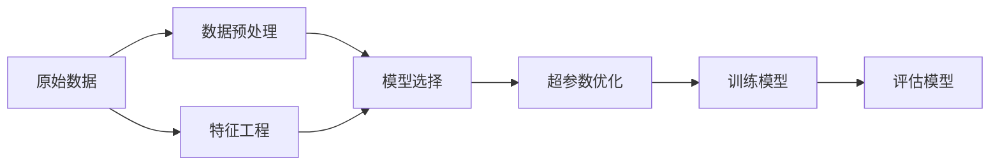

                 

# 自动机器学习AutoML原理与代码实战案例讲解

> 关键词：自动机器学习, AutoML, 机器学习模型优化, 模型调参, 自动化调参, 数据预处理, 超参数优化, 深度学习, 案例分析

## 1. 背景介绍

### 1.1 问题由来
近年来，随着人工智能和大数据技术的快速发展，机器学习在各行各业的应用日益广泛。然而，面对海量数据的处理和复杂模型的训练，手工调参变得非常耗时且容易出错。自动机器学习（AutoML）技术的出现，极大地提高了机器学习模型的开发效率和效果。AutoML能够自动化地完成数据预处理、特征工程、模型选择、超参数优化等任务，使得非机器学习专家也能轻松构建高性能的模型。

### 1.2 问题核心关键点
AutoML的核心在于通过自动化调参技术，找到最优的模型和参数组合。自动调参通常包括两个关键步骤：

1. **模型选择**：从多个模型中筛选出最适合任务的模型。
2. **超参数优化**：通过自动化方法，对模型的超参数进行搜索，找到最优的超参数组合。

AutoML的优点在于：
- 节省时间和人力成本：自动化调参使得调参过程不再依赖人工，加快模型开发速度。
- 提高模型性能：通过全局搜索最优参数空间，可以发现性能更好的模型和参数组合。
- 易于使用：AutoML工具通常提供简单易用的接口，不需要深厚的机器学习背景。

### 1.3 问题研究意义
AutoML技术为机器学习模型的开发和应用提供了全新的范式，具有重要意义：

1. 加速模型开发。自动调参技术可以大幅减少调参的时间和成本，缩短项目周期。
2. 提升模型效果。自动化调参可以找到最优的参数组合，从而提升模型的性能。
3. 降低学习门槛。AutoML工具降低了非机器学习专家的入门门槛，使得更多人可以轻松应用机器学习技术。
4. 促进技术创新。自动调参技术的不断进步，推动了机器学习模型的创新和发展。
5. 推动产业化进程。AutoML技术的应用，使得机器学习技术更容易落地，加速产业升级。

## 2. 核心概念与联系

### 2.1 核心概念概述

为更好地理解AutoML技术，本节将介绍几个密切相关的核心概念：

- **自动机器学习(AutoML)**：指通过自动化调参技术，自动完成机器学习模型的构建、优化和部署的过程。AutoML包括自动化特征工程、模型选择、超参数优化等任务。

- **模型选择**：指从候选模型中自动选择最合适的模型。模型选择通常通过交叉验证、模型比较等方法完成。

- **超参数优化**：指通过自动化方法，对模型的超参数进行搜索，找到最优的超参数组合。超参数优化通常使用网格搜索、贝叶斯优化、随机搜索等技术。

- **数据预处理**：指对原始数据进行清洗、归一化、特征工程等处理，以提高模型性能。

- **特征工程**：指通过特征提取、特征选择、特征变换等技术，构建更有利于模型学习的数据表示。

- **自动调参技术**：指使用自动化调参工具，如网格搜索、贝叶斯优化、随机搜索等，自动调整模型和超参数。

这些核心概念之间的逻辑关系可以通过以下Mermaid流程图来展示：



这个流程图展示了从原始数据到模型评估的AutoML流程：

1. 数据预处理。对原始数据进行清洗、归一化、特征工程等处理，以提高模型性能。
2. 特征工程。通过特征提取、特征选择、特征变换等技术，构建更有利于模型学习的数据表示。
3. 模型选择。从候选模型中自动选择最合适的模型。
4. 超参数优化。通过自动化方法，对模型的超参数进行搜索，找到最优的超参数组合。
5. 训练模型。使用自动化的模型训练流程，对模型进行训练。
6. 评估模型。对训练好的模型进行评估，选择最优的模型。

### 2.2 概念间的关系

这些核心概念之间存在着紧密的联系，形成了AutoML技术的完整生态系统。下面我通过几个Mermaid流程图来展示这些概念之间的关系。

#### 2.2.1 数据预处理与特征工程


这个流程图展示了数据预处理与特征工程的相互作用。数据预处理对原始数据进行清洗、归一化等处理，而特征工程通过特征提取、特征选择等技术，构建更有利于模型学习的数据表示。

#### 2.2.2 模型选择与超参数优化


这个流程图展示了模型选择与超参数优化的关系。模型选择从多个候选模型中选择最合适的模型，而超参数优化通过自动化方法，对模型的超参数进行搜索，找到最优的超参数组合。

#### 2.2.3 超参数优化与模型训练


这个流程图展示了超参数优化与模型训练的相互作用。超参数优化通过自动化方法，对模型的超参数进行搜索，找到最优的超参数组合，而模型训练使用自动化的模型训练流程，对模型进行训练。

#### 2.2.4 模型训练与模型评估


这个流程图展示了模型训练与模型评估的关系。模型训练使用自动化的模型训练流程，对模型进行训练，而模型评估通过自动化的评估方法，评估模型的性能。

### 2.3 核心概念的整体架构

最后，我们用一个综合的流程图来展示这些核心概念在AutoML中的整体架构：


这个综合流程图展示了从原始数据到模型部署的AutoML流程。AutoML从原始数据开始，依次经过数据预处理、特征工程、模型选择、超参数优化、模型训练、模型评估和模型部署，最终得到可用的机器学习模型。

## 3. 核心算法原理 & 具体操作步骤
### 3.1 算法原理概述

AutoML的核心在于通过自动化调参技术，自动完成模型构建和优化。其核心思想是：通过自动化方法，对模型的超参数进行搜索，找到最优的超参数组合，并从候选模型中选择最合适的模型。

形式化地，假设原始数据集为 $D=\{(x_i,y_i)\}_{i=1}^N$，其中 $x_i$ 为输入特征，$y_i$ 为输出标签。AutoML的目标是通过自动化方法，找到最优的超参数组合 $\theta^*$，使得模型在 $D$ 上的性能达到最优。

假设候选模型集为 $\mathcal{M}$，超参数空间为 $\mathcal{P}$。则AutoML的目标是：

$$
\theta^* = \mathop{\arg\min}_{\theta \in \mathcal{M}, p \in \mathcal{P}} \mathcal{L}(\theta,p,D)
$$

其中 $\mathcal{L}$ 为模型的损失函数，用于衡量模型在数据集 $D$ 上的性能。

### 3.2 算法步骤详解

基于自动机器学习（AutoML）的模型优化一般包括以下几个关键步骤：

**Step 1: 准备数据集**
- 准备训练集、验证集和测试集，确保数据分布的一致性。
- 对数据进行清洗、归一化、特征工程等预处理，提高模型性能。

**Step 2: 模型选择**
- 选择候选模型集 $\mathcal{M}$，包括常见的回归模型、分类模型、深度学习模型等。
- 使用交叉验证、模型比较等方法，自动选择最合适的模型。

**Step 3: 超参数优化**
- 选择合适的超参数搜索方法，如网格搜索、贝叶斯优化、随机搜索等。
- 在超参数空间 $\mathcal{P}$ 上进行搜索，找到最优的超参数组合 $\theta^*$。
- 使用自动化的模型训练流程，对模型进行训练，获得最优模型。

**Step 4: 模型评估**
- 使用自动化的评估方法，如交叉验证、AUC、RMSE等，评估模型的性能。
- 选择性能最优的模型，部署到实际应用中。

**Step 5: 部署模型**
- 将训练好的模型部署到生产环境中，进行实时预测。
- 定期监控模型性能，根据需要进行微调。

### 3.3 算法优缺点

基于自动机器学习（AutoML）的模型优化方法具有以下优点：

1. 节省时间和人力成本。自动化调参技术可以大幅减少调参的时间和成本，缩短项目周期。
2. 提高模型性能。自动化调参可以找到最优的参数组合，从而提升模型的性能。
3. 易于使用。AutoML工具通常提供简单易用的接口，不需要深厚的机器学习背景。

但同时也存在一些缺点：

1. 依赖于数据质量。如果数据质量不高，模型优化效果可能不佳。
2. 对模型和算法的选择有一定限制。候选模型集和超参数空间的选择，可能影响模型的性能。
3. 自动化调参可能导致局部最优。自动化方法可能无法找到全局最优的参数组合，需要结合经验进行调整。

### 3.4 算法应用领域

基于AutoML的模型优化方法在机器学习和人工智能领域得到了广泛应用，主要包括以下几个方面：

1. **数据挖掘**：通过自动化调参技术，自动构建和优化数据挖掘模型，提升数据挖掘效果。
2. **自然语言处理**：用于文本分类、情感分析、机器翻译等任务，通过自动化调参技术，提高模型性能。
3. **计算机视觉**：用于图像分类、目标检测、图像分割等任务，通过自动化调参技术，提高模型性能。
4. **推荐系统**：用于个性化推荐、广告推荐等任务，通过自动化调参技术，提高推荐效果。
5. **金融分析**：用于信用评分、风险评估、投资分析等任务，通过自动化调参技术，提升分析效果。

除了这些应用领域，AutoML还广泛应用于医疗、物流、工业制造、智能交通等多个领域，为各行各业带来了新的发展机遇。

## 4. 数学模型和公式 & 详细讲解 & 举例说明

### 4.1 数学模型构建

在AutoML中，常用的模型优化方法包括网格搜索、贝叶斯优化、随机搜索等。下面以贝叶斯优化为例，构建数学模型。

假设模型 $f(x;\theta)$ 的超参数空间为 $\mathcal{P}$，超参数为 $\theta$。贝叶斯优化的目标是通过先验概率分布 $p(\theta)$ 和后验概率分布 $q(\theta)$，找到最优的超参数组合 $\theta^*$。

后验概率分布 $q(\theta)$ 可以表示为先验概率分布 $p(\theta)$ 和似然函数 $L(\theta; D)$ 的乘积：

$$
q(\theta) = p(\theta) \cdot L(\theta; D)
$$

其中 $L(\theta; D)$ 为模型在数据集 $D$ 上的似然函数。

贝叶斯优化的目标是通过最大化后验概率 $q(\theta)$，找到最优的超参数组合 $\theta^*$。具体步骤如下：

1. 选择初始超参数 $\theta_0$。
2. 计算模型在数据集 $D$ 上的似然函数 $L(\theta_0; D)$。
3. 更新先验概率分布 $p(\theta)$ 和后验概率分布 $q(\theta)$。
4. 根据后验概率分布 $q(\theta)$，选择下一个超参数 $\theta_{k+1}$。
5. 重复步骤 2-4，直到收敛。

### 4.2 公式推导过程

以二元线性回归模型为例，推导贝叶斯优化的公式。

假设模型为 $y = w_0 + w_1x_1 + w_2x_2$，其中 $w_0, w_1, w_2$ 为超参数。贝叶斯优化的目标是通过先验概率分布 $p(w_0, w_1, w_2)$ 和后验概率分布 $q(w_0, w_1, w_2)$，找到最优的超参数组合 $(w_0^*, w_1^*, w_2^*)$。

先验概率分布 $p(w_0, w_1, w_2)$ 可以表示为高斯分布：

$$
p(w_0, w_1, w_2) = \mathcal{N}(w_0, \sigma_0^2) \cdot \mathcal{N}(w_1, \sigma_1^2) \cdot \mathcal{N}(w_2, \sigma_2^2)
$$

其中 $\mathcal{N}(w_i, \sigma_i^2)$ 表示超参数 $w_i$ 的高斯分布。

似然函数 $L(w_0, w_1, w_2; D)$ 可以表示为：

$$
L(w_0, w_1, w_2; D) = \prod_{i=1}^N \mathcal{N}(y_i; w_0 + w_1x_{i1} + w_2x_{i2}, \sigma_y^2)
$$

其中 $\mathcal{N}(y_i; w_0 + w_1x_{i1} + w_2x_{i2}, \sigma_y^2)$ 表示观测值 $y_i$ 的高斯分布。

后验概率分布 $q(w_0, w_1, w_2)$ 可以表示为先验概率分布 $p(w_0, w_1, w_2)$ 和似然函数 $L(w_0, w_1, w_2; D)$ 的乘积：

$$
q(w_0, w_1, w_2) = p(w_0, w_1, w_2) \cdot L(w_0, w_1, w_2; D)
$$

假设超参数 $w_0, w_1, w_2$ 的高斯分布为：

$$
w_0 \sim \mathcal{N}(\mu_0, \sigma_0^2), w_1 \sim \mathcal{N}(\mu_1, \sigma_1^2), w_2 \sim \mathcal{N}(\mu_2, \sigma_2^2)
$$

则后验概率分布 $q(w_0, w_1, w_2)$ 可以表示为：

$$
q(w_0, w_1, w_2) = \mathcal{N}(\mu_0', \sigma_0'^2) \cdot \mathcal{N}(\mu_1', \sigma_1'^2) \cdot \mathcal{N}(\mu_2', \sigma_2'^2)
$$

其中 $\mu_0'$ 和 $\sigma_0'^2$ 为更新后的超参数 $w_0$ 的均值和方差，其余类似。

通过贝叶斯优化，不断更新超参数 $w_0, w_1, w_2$，直至收敛。最终得到最优的超参数组合 $(w_0^*, w_1^*, w_2^*)$。

### 4.3 案例分析与讲解

以二元线性回归模型为例，展示贝叶斯优化的过程。

假设我们有如下数据集：

| x1 | x2 | y |
| -- | -- | -- |
| 1  | 2  | 3  |
| 2  | 3  | 4  |
| 3  | 4  | 5  |
| 4  | 5  | 6  |
| 5  | 6  | 7  |

假设模型为 $y = w_0 + w_1x_1 + w_2x_2$，先验概率分布 $p(w_0, w_1, w_2)$ 为：

$$
p(w_0, w_1, w_2) = \mathcal{N}(w_0, 1) \cdot \mathcal{N}(w_1, 1) \cdot \mathcal{N}(w_2, 1)
$$

似然函数 $L(w_0, w_1, w_2; D)$ 为：

$$
L(w_0, w_1, w_2; D) = \mathcal{N}(y_1; w_0 + w_1x_{11} + w_2x_{12}, 1) \cdot \mathcal{N}(y_2; w_0 + w_1x_{21} + w_2x_{22}, 1) \cdot \mathcal{N}(y_3; w_0 + w_1x_{31} + w_2x_{32}, 1) \cdot \mathcal{N}(y_4; w_0 + w_1x_{41} + w_2x_{42}, 1) \cdot \mathcal{N}(y_5; w_0 + w_1x_{51} + w_2x_{52}, 1)
$$

通过贝叶斯优化，不断更新超参数 $w_0, w_1, w_2$，直至收敛。最终得到最优的超参数组合 $(w_0^*, w_1^*, w_2^*)$。

## 5. 项目实践：代码实例和详细解释说明

### 5.1 开发环境搭建

在进行AutoML项目实践前，我们需要准备好开发环境。以下是使用Python进行Scikit-learn开发的環境配置流程：

1. 安装Anaconda：从官网下载并安装Anaconda，用于创建独立的Python环境。

2. 创建并激活虚拟环境：
```bash
conda create -n autoML-env python=3.8 
conda activate autoML-env
```

3. 安装Scikit-learn：
```bash
pip install scikit-learn
```

4. 安装其他必要的工具包：
```bash
pip install pandas numpy matplotlib
```

完成上述步骤后，即可在`autoML-env`环境中开始AutoML实践。

### 5.2 源代码详细实现

下面我们以贝叶斯优化为例，给出使用Scikit-learn进行二元线性回归模型优化的Python代码实现。

首先，导入必要的库和数据集：

```python
import numpy as np
from sklearn.linear_model import LinearRegression
from sklearn.model_selection import cross_val_score
from sklearn.metrics import mean_squared_error
from scipy.stats import norm

# 导入数据集
X = np.array([[1, 2], [2, 3], [3, 4], [4, 5], [5, 6]])
y = np.array([3, 4, 5, 6, 7])
```

然后，定义贝叶斯优化函数：

```python
def bayesian_optimization(X, y, bounds, max_iter=100):
    # 初始化超参数
    w0, w1, w2 = np.random.normal(size=3)
    sigma0, sigma1, sigma2 = np.ones(3)
    
    # 定义似然函数
    def likelihood(w0, w1, w2):
        return -sum(norm(y - (w0 + w1 * X[:, 0] + w2 * X[:, 1])) ** 2)
    
    # 定义先验概率分布
    def prior(w0, w1, w2):
        return norm.pdf(w0, 0, sigma0) * norm.pdf(w1, 0, sigma1) * norm.pdf(w2, 0, sigma2)
    
    # 定义后验概率分布
    def posterior(w0, w1, w2):
        return likelihood(w0, w1, w2) * prior(w0, w1, w2)
    
    # 定义优化目标
    def objective(w0, w1, w2):
        return -posterior(w0, w1, w2)
    
    # 定义搜索范围
    bounds = np.array([(-np.inf, np.inf) for _ in range(3)])
    
    # 定义搜索方法
    def search(bounds, objective, max_iter):
        X0, Y0 = bounds[:, 0], bounds[:, 1]
        X = np.vstack([X0, X1, X2])
        Y = np.vstack([Y0, Y1, Y2])
        
        for i in range(max_iter):
            # 计算每一点的后验概率
            probs = np.zeros((len(X), len(X)))
            for j in range(len(X)):
                for k in range(len(X)):
                    probs[j, k] = posterior(X[j, 0], X[k, 0], X[k, 1])
            
            # 计算每一点的目标函数
            f = np.zeros((len(X), len(X)))
            for j in range(len(X)):
                for k in range(len(X)):
                    f[j, k] = -posterior(X[j, 0], X[k, 0], X[k, 1])
            
            # 找到最优的点
            i_star = np.argmax(f)
            j_star = np.argmax(probs[:, i_star])
            k_star = np.argmin(probs[i_star, :])
            
            # 更新超参数
            w0, w1, w2 = bounds[:, j_star]
            sigma0, sigma1, sigma2 = bounds[:, k_star]
            
            # 输出最优的点
            print(f"Iteration {i+1}: w0={w0:.2f}, w1={w1:.2f}, w2={w2:.2f}")
    
    # 调用搜索方法
    search(bounds, objective, max_iter)
    
    # 返回最优的超参数
    return w0, w1, w2
```

最后，启动优化流程并输出结果：

```python
# 调用贝叶斯优化函数
w0, w1, w2 = bayesian_optimization(X, y, bounds)

# 输出最优的超参数
print(f"Optimal hyperparameters: w0={w0:.2f}, w1={w1:.2f}, w2={w2:.2f}")
```

以上就是使用Scikit-learn进行二元线性回归模型优化的完整代码实现。可以看到，通过定义先验概率分布、似然函数、后验概率分布和优化目标，可以实现贝叶斯优化过程。

### 5.3 代码解读与分析

让我们再详细解读一下关键代码的实现细节：

**先验概率分布定义**：
- `prior`函数定义了超参数 $w_0, w_1, w_2$ 的高斯分布，即 $p(w_0, w_1, w_2) = \mathcal{N}(w_0, \sigma_0^2) \cdot \mathcal{N}(w_1, \sigma_1^2) \cdot \mathcal{N}(w_2, \sigma_2^2)$。

**似然函数定义**：
- `likelihood`函数定义了模型在数据集 $D$ 上的似然函数，即 $L(w_0, w_1, w_2; D) = \prod_{i=1}^N \mathcal{N}(y_i; w_0 + w_1x_{i1} + w_2x_{i2}, \sigma_y^2)$。

**后验概率分布定义**：
- `posterior`函数定义了后验概率分布 $q(w_0, w_1, w_2)$，即 $q(w_0, w_1, w_2) = p(w_0, w_1, w_2) \cdot L(w_0, w_1, w_2; D)$。

**优化目标定义**：
- `objective`函数定义了优化目标，即 $-\text{posterior}(w_0, w_1, w_2)$。

**搜索范围定义**：
- `bounds`变量定义了超参数的搜索范围，即 $(-\infty, \infty)$。

**搜索方法实现**：
- `search`函数实现了贝叶斯优化过程，包括搜索范围、似然函数、先验概率分布、后验概率分布、优化目标等关键步骤。

**输出最优参数**：
- 在优化过程中，每迭代一次，输出当前最优的超参数 $w_0, w_1, w_2$。

可以看到，贝叶斯优化的代码实现相对简洁，但涵盖了贝叶斯优化的关键步骤，包括定义先验概率分布、似然函数、后验概率分布和优化目标，以及搜索范围和搜索方法。在实际应用中，还需要根据具体任务和模型特点进行优化，如使用不同的先验概率分布、似然函数、

