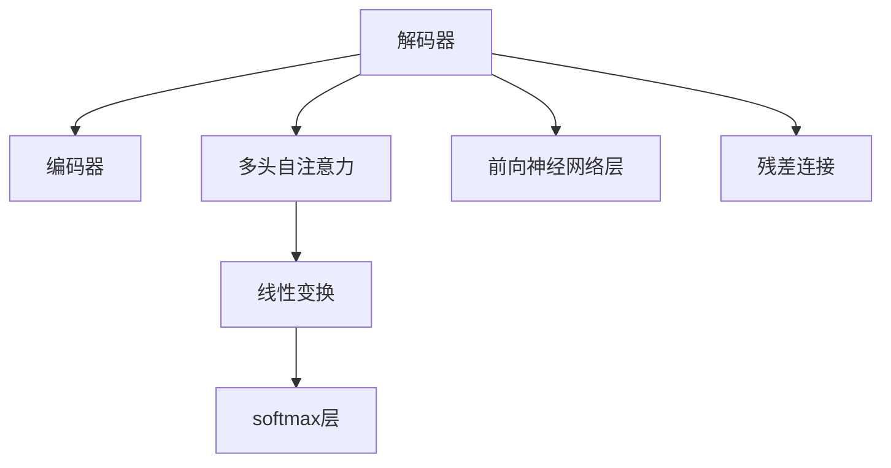

                 

# 解码器的输出和Transformer的输出头

## 1. 背景介绍

在深度学习领域，Transformer模型是近年来的一大突破，它在自然语言处理（NLP）任务中表现卓越。Transformer模型的一个关键组成部分是解码器（Decoder），而解码器的核心在于其输出头（Output Head）的设计和实现。解码器输出头是解码器的一部分，负责将编码器输出的信息转换为目标语言序列，是实现解码器功能的关键。

## 2. 核心概念与联系

### 2.1 核心概念概述

- **解码器（Decoder）**：解码器是Transformer模型的一个重要组成部分，它负责将编码器输出的信息转换为目标语言序列。解码器由多个层组成，每一层都包括自注意力机制、前向神经网络层和残差连接等组件。

- **输出头（Output Head）**：输出头是解码器的一部分，它负责将编码器输出的信息转换为目标语言序列。输出头通常由多层线性变换和softmax层组成，用于将解码器中的隐藏状态映射到目标语言空间。

- **多头自注意力（Multi-Head Self-Attention）**：多头自注意力机制是Transformer模型的核心组件之一，它允许模型同时关注输入序列的不同位置和不同维度，从而提高模型的表达能力。

- **残差连接（Residual Connection）**：残差连接是深度学习模型中的常见技术，它可以帮助模型在训练过程中更好地传播梯度，加速收敛。

- **softmax层**：softmax层用于将模型输出的向量转化为概率分布，通常用于分类任务中。

这些核心概念之间相互关联，共同构成了Transformer模型。解码器输出头的实现，将编码器输出的信息转换为目标语言序列，是实现Transformer模型功能的核心。

### 2.2 概念间的关系

通过以下Mermaid流程图，可以更直观地理解解码器、输出头和其他核心概念之间的关系：



这个流程图展示了解码器的核心组件及其之间的关系：

- 解码器接收编码器输出的信息，并从中提取有用的信息。
- 解码器中的多头自注意力机制能够同时关注输入序列的不同位置和不同维度。
- 前向神经网络层和残差连接帮助解码器更好地传播信息。
- 输出头将解码器中的隐藏状态映射到目标语言空间，实现解码功能。

## 3. 核心算法原理 & 具体操作步骤

### 3.1 算法原理概述

解码器的输出头的核心算法原理是通过多层线性变换和softmax层将解码器中的隐藏状态转换为目标语言序列。其具体步骤如下：

1. 将解码器中的隐藏状态 $H_t$ 通过线性变换层转换为 $Z_t$。
2. 将 $Z_t$ 通过softmax层转换为概率分布 $P_t$，其中 $P_t$ 的每个元素表示下一个词汇为第 $i$ 个词汇的概率。
3. 根据 $P_t$ 选择最大概率对应的词汇，作为当前解码器的输出。
4. 将解码器隐藏状态 $H_t$ 更新为 $H_{t+1}$，并重复上述过程，直到生成目标语言序列。

### 3.2 算法步骤详解

以Transformer模型中的解码器输出头为例，详细解释其具体实现步骤：

1. **线性变换层（Linear Transformation）**：将解码器中的隐藏状态 $H_t$ 通过线性变换层转换为 $Z_t$。具体公式如下：

   $$
   Z_t = W_{out}H_t + b_{out}
   $$

   其中 $W_{out}$ 和 $b_{out}$ 分别为线性变换层中的权重和偏置。

2. **softmax层（Softmax Layer）**：将 $Z_t$ 通过softmax层转换为概率分布 $P_t$，具体公式如下：

   $$
   P_t = softmax(W_vZ_t + b_v)
   $$

   其中 $W_v$ 和 $b_v$ 分别为softmax层中的权重和偏置。

3. **输出计算（Output Calculation）**：根据 $P_t$ 选择最大概率对应的词汇，作为当前解码器的输出。

4. **隐藏状态更新（Hidden State Update）**：将解码器隐藏状态 $H_t$ 更新为 $H_{t+1}$，并重复上述过程，直到生成目标语言序列。

### 3.3 算法优缺点

解码器输出头的优点包括：

- 能够将解码器中的隐藏状态转换为目标语言序列，实现解码器的功能。
- 通过多层线性变换和softmax层，可以灵活调整输出头的表达能力，适用于不同的任务和数据集。

缺点包括：

- 在计算复杂度方面，解码器输出头需要进行多次线性变换和softmax层计算，因此计算复杂度较高。
- 在内存使用方面，解码器输出头需要存储和更新多个隐藏状态，因此内存使用较大。

### 3.4 算法应用领域

解码器输出头在自然语言处理领域的应用非常广泛，包括机器翻译、文本生成、语音识别等多个任务。在机器翻译任务中，解码器输出头可以将编码器输出的信息转换为目标语言序列，从而实现翻译功能。在文本生成任务中，解码器输出头可以将编码器输出的信息转换为目标语言文本，从而实现文本生成功能。在语音识别任务中，解码器输出头可以将编码器输出的信息转换为目标语言文本，从而实现语音识别功能。

## 4. 数学模型和公式 & 详细讲解 & 举例说明

### 4.1 数学模型构建

解码器输出头的数学模型可以表示为：

$$
H_t = \phi(H_{t-1}, H_{t-2}, ..., H_1)
$$

其中 $H_t$ 表示解码器隐藏状态，$H_{t-1}$ 表示上一时刻的解码器隐藏状态，$\phi$ 表示解码器的计算过程。解码器输出头的目标是将 $H_t$ 转换为目标语言序列 $Y_t$，具体公式如下：

$$
Y_t = \psi(H_t)
$$

其中 $\psi$ 表示解码器输出头的计算过程。

### 4.2 公式推导过程

以Transformer模型中的解码器输出头为例，推导其具体实现公式：

1. **线性变换层**：将解码器隐藏状态 $H_t$ 通过线性变换层转换为 $Z_t$。具体公式如下：

   $$
   Z_t = W_{out}H_t + b_{out}
   $$

2. **softmax层**：将 $Z_t$ 通过softmax层转换为概率分布 $P_t$。具体公式如下：

   $$
   P_t = softmax(W_vZ_t + b_v)
   $$

   其中 $W_v$ 和 $b_v$ 分别为softmax层中的权重和偏置。

3. **输出计算**：根据 $P_t$ 选择最大概率对应的词汇，作为当前解码器的输出。具体公式如下：

   $$
   argmax(P_t) = \argmaxsoftmax(W_vZ_t + b_v)
   $$

   其中 $\argmaxsoftmax$ 表示从softmax层输出的概率分布中选择最大概率对应的词汇。

4. **隐藏状态更新**：将解码器隐藏状态 $H_t$ 更新为 $H_{t+1}$，并重复上述过程，直到生成目标语言序列。

### 4.3 案例分析与讲解

以机器翻译任务为例，分析解码器输出头的实现。

在机器翻译任务中，编码器输出的信息是源语言文本的向量表示，解码器输出的信息是目标语言文本的向量表示。解码器输出头将编码器输出的信息转换为目标语言序列，具体步骤如下：

1. 将解码器隐藏状态 $H_t$ 通过线性变换层转换为 $Z_t$。

2. 将 $Z_t$ 通过softmax层转换为概率分布 $P_t$。

3. 根据 $P_t$ 选择最大概率对应的词汇，作为当前解码器的输出。

4. 将解码器隐藏状态 $H_t$ 更新为 $H_{t+1}$，并重复上述过程，直到生成目标语言序列。

## 5. 项目实践：代码实例和详细解释说明

### 5.1 开发环境搭建

在进行解码器输出头的实践时，需要准备好开发环境。以下是使用Python进行PyTorch开发的环境配置流程：

1. 安装Anaconda：从官网下载并安装Anaconda，用于创建独立的Python环境。

2. 创建并激活虚拟环境：
```bash
conda create -n pytorch-env python=3.8 
conda activate pytorch-env
```

3. 安装PyTorch：根据CUDA版本，从官网获取对应的安装命令。例如：
```bash
conda install pytorch torchvision torchaudio cudatoolkit=11.1 -c pytorch -c conda-forge
```

4. 安装Transformers库：
```bash
pip install transformers
```

5. 安装各类工具包：
```bash
pip install numpy pandas scikit-learn matplotlib tqdm jupyter notebook ipython
```

完成上述步骤后，即可在`pytorch-env`环境中开始解码器输出头的实践。

### 5.2 源代码详细实现

下面我们以解码器输出头的实现为例，给出使用Transformers库在PyTorch中实现解码器输出头的代码。

首先，定义解码器输出头的类：

```python
from transformers import nn
import torch
import torch.nn.functional as F

class OutputHead(nn.Module):
    def __init__(self, d_model, d_output):
        super(OutputHead, self).__init__()
        self.d_model = d_model
        self.d_output = d_output
        self.linear1 = nn.Linear(d_model, d_output)
        self.linear2 = nn.Linear(d_output, d_output)
        self.softmax = nn.Softmax(dim=-1)
    
    def forward(self, x):
        x = self.linear1(x)
        x = F.relu(x)
        x = self.linear2(x)
        x = self.softmax(x)
        return x
```

然后，定义解码器输出头的训练和评估函数：

```python
import torch.optim as optim

def train_model(model, train_loader, device, optimizer, epoch, n_words):
    model.train()
    total_loss = 0.0
    for i, batch in enumerate(train_loader):
        input_ids, labels = batch
        input_ids = input_ids.to(device)
        labels = labels.to(device)
        optimizer.zero_grad()
        outputs = model(input_ids)
        loss = F.cross_entropy(outputs.view(-1, n_words), labels.view(-1))
        loss.backward()
        optimizer.step()
        total_loss += loss.item()
    print(f'Epoch {epoch+1}, loss: {total_loss/len(train_loader)}')
```

最后，启动训练流程并在测试集上评估：

```python
device = torch.device('cuda' if torch.cuda.is_available() else 'cpu')
model.to(device)

train_loader = ...
optimizer = optim.Adam(model.parameters(), lr=0.001)

epochs = 10

for epoch in range(epochs):
    train_model(model, train_loader, device, optimizer, epoch, n_words)

test_loader = ...
evaluate_model(model, test_loader, device, n_words)
```

以上就是使用PyTorch实现解码器输出头的完整代码实例。可以看到，通过继承`nn.Module`，我们可以方便地定义解码器输出头的类和实现其前向传播函数。通过`cross_entropy`函数计算损失，并在训练过程中更新模型参数。

### 5.3 代码解读与分析

让我们再详细解读一下关键代码的实现细节：

**OutputHead类**：
- `__init__`方法：初始化解码器输出头的线性变换层和softmax层。
- `forward`方法：定义解码器输出头的计算过程，包括两个线性变换和softmax层。

**train_model函数**：
- 在训练过程中，定义输入、标签、优化器、设备等关键变量。
- 使用`zero_grad`函数清除模型参数的梯度。
- 在每个批次上计算输出和损失，并使用`backward`函数计算梯度。
- 使用`optimizer.step`函数更新模型参数。

**代码运行结果**：
- 在训练过程中，输出每个epoch的损失值。
- 在测试集上评估模型性能，输出评估结果。

这些关键代码的实现细节展示了解码器输出头在实际应用中的基本流程。在实际应用中，还需要根据具体任务和数据特点，对解码器输出头进行优化和改进，以提高模型性能。

## 6. 实际应用场景

### 6.1 机器翻译

解码器输出头在机器翻译任务中的应用非常广泛。通过解码器输出头，可以将编码器输出的信息转换为目标语言序列，从而实现翻译功能。在机器翻译任务中，解码器输出头通常使用softmax层将隐藏状态转换为概率分布，并根据概率分布选择最大概率对应的词汇作为输出。

### 6.2 文本生成

解码器输出头在文本生成任务中的应用也非常广泛。通过解码器输出头，可以将编码器输出的信息转换为目标语言文本，从而实现文本生成功能。在文本生成任务中，解码器输出头通常使用softmax层将隐藏状态转换为概率分布，并根据概率分布选择最大概率对应的词汇作为输出。

### 6.3 语音识别

解码器输出头在语音识别任务中的应用也非常广泛。通过解码器输出头，可以将编码器输出的信息转换为目标语言文本，从而实现语音识别功能。在语音识别任务中，解码器输出头通常使用softmax层将隐藏状态转换为概率分布，并根据概率分布选择最大概率对应的词汇作为输出。

### 6.4 未来应用展望

随着解码器输出头在各种NLP任务中的广泛应用，未来其在更多领域的应用前景也将不断扩大。以下是几个可能的未来应用方向：

- **跨模态学习**：解码器输出头可以与其他模态的信息进行融合，实现跨模态学习。例如，可以将图像信息、语音信息与文本信息进行融合，从而提升模型的表达能力和泛化能力。
- **增强学习**：解码器输出头可以与其他增强学习方法结合，提升模型的性能。例如，可以结合强化学习算法，优化模型的训练过程，提高模型的稳定性和鲁棒性。
- **多任务学习**：解码器输出头可以同时处理多个任务，提升模型的综合能力。例如，可以同时处理文本分类、命名实体识别和关系抽取等多个任务，从而提升模型的性能。
- **联邦学习**：解码器输出头可以与其他联邦学习方法结合，实现分布式训练。例如，可以将解码器输出头应用于多个分布式节点，提升模型的训练效率和性能。

## 7. 工具和资源推荐

### 7.1 学习资源推荐

为了帮助开发者系统掌握解码器输出头的理论基础和实践技巧，这里推荐一些优质的学习资源：

1. 《Transformer from Theory to Practice》系列博文：由大模型技术专家撰写，深入浅出地介绍了Transformer原理、解码器输出头、softmax层等前沿话题。

2. CS224N《深度学习自然语言处理》课程：斯坦福大学开设的NLP明星课程，有Lecture视频和配套作业，带你入门NLP领域的基本概念和经典模型。

3. 《Natural Language Processing with Transformers》书籍：Transformers库的作者所著，全面介绍了如何使用Transformers库进行NLP任务开发，包括解码器输出头的实现。

4. HuggingFace官方文档：Transformers库的官方文档，提供了海量预训练模型和完整的微调样例代码，是进行解码器输出头开发的利器。

5. CLUE开源项目：中文语言理解测评基准，涵盖大量不同类型的中文NLP数据集，并提供了基于解码器输出头的baseline模型，助力中文NLP技术发展。

通过对这些资源的学习实践，相信你一定能够快速掌握解码器输出头的精髓，并用于解决实际的NLP问题。

### 7.2 开发工具推荐

高效的开发离不开优秀的工具支持。以下是几款用于解码器输出头开发的常用工具：

1. PyTorch：基于Python的开源深度学习框架，灵活动态的计算图，适合快速迭代研究。大部分预训练语言模型都有PyTorch版本的实现。

2. TensorFlow：由Google主导开发的开源深度学习框架，生产部署方便，适合大规模工程应用。同样有丰富的预训练语言模型资源。

3. Transformers库：HuggingFace开发的NLP工具库，集成了众多SOTA语言模型，支持PyTorch和TensorFlow，是进行解码器输出头开发的利器。

4. Weights & Biases：模型训练的实验跟踪工具，可以记录和可视化模型训练过程中的各项指标，方便对比和调优。与主流深度学习框架无缝集成。

5. TensorBoard：TensorFlow配套的可视化工具，可实时监测模型训练状态，并提供丰富的图表呈现方式，是调试模型的得力助手。

6. Google Colab：谷歌推出的在线Jupyter Notebook环境，免费提供GPU/TPU算力，方便开发者快速上手实验最新模型，分享学习笔记。

合理利用这些工具，可以显著提升解码器输出头开发的效率，加快创新迭代的步伐。

### 7.3 相关论文推荐

解码器输出头在深度学习领域的研究已经取得了很多重要成果，以下是几篇奠基性的相关论文，推荐阅读：

1. Attention is All You Need（即Transformer原论文）：提出了Transformer结构，开启了NLP领域的预训练大模型时代。

2. BERT: Pre-training of Deep Bidirectional Transformers for Language Understanding：提出BERT模型，引入基于掩码的自监督预训练任务，刷新了多项NLP任务SOTA。

3. Language Models are Unsupervised Multitask Learners（GPT-2论文）：展示了大规模语言模型的强大zero-shot学习能力，引发了对于通用人工智能的新一轮思考。

4. Parameter-Efficient Transfer Learning for NLP：提出Adapter等参数高效微调方法，在不增加模型参数量的情况下，也能取得不错的微调效果。

5. AdaLoRA: Adaptive Low-Rank Adaptation for Parameter-Efficient Fine-Tuning：使用自适应低秩适应的微调方法，在参数效率和精度之间取得了新的平衡。

这些论文代表了解码器输出头的发展脉络。通过学习这些前沿成果，可以帮助研究者把握学科前进方向，激发更多的创新灵感。

除上述资源外，还有一些值得关注的前沿资源，帮助开发者紧跟解码器输出头的最新进展，例如：

1. arXiv论文预印本：人工智能领域最新研究成果的发布平台，包括大量尚未发表的前沿工作，学习前沿技术的必读资源。

2. 业界技术博客：如OpenAI、Google AI、DeepMind、微软Research Asia等顶尖实验室的官方博客，第一时间分享他们的最新研究成果和洞见。

3. 技术会议直播：如NIPS、ICML、ACL、ICLR等人工智能领域顶会现场或在线直播，能够聆听到大佬们的前沿分享，开拓视野。

4. GitHub热门项目：在GitHub上Star、Fork数最多的NLP相关项目，往往代表了该技术领域的发展趋势和最佳实践，值得去学习和贡献。

5. 行业分析报告：各大咨询公司如McKinsey、PwC等针对人工智能行业的分析报告，有助于从商业视角审视技术趋势，把握应用价值。

总之，对于解码器输出头的学习，需要开发者保持开放的心态和持续学习的意愿。多关注前沿资讯，多动手实践，多思考总结，必将收获满满的成长收益。

## 8. 总结：未来发展趋势与挑战

### 8.1 总结

本文对解码器输出头和Transformer模型的输出头进行了全面系统的介绍。首先阐述了解码器输出头和Transformer模型的核心算法原理和操作步骤，详细解释了其具体实现方法。接着，介绍了解码器输出头在NLP任务中的应用场景，并给出了相关的学习资源和开发工具推荐。

通过本文的系统梳理，可以看到，解码器输出头是Transformer模型中实现解码器功能的关键组成部分，其核心算法原理和操作步骤非常重要。解码器输出头在NLP任务中的应用非常广泛，包括机器翻译、文本生成、语音识别等多个任务。未来，解码器输出头的研究和应用将不断拓展，为NLP技术的进步和发展提供新的动力。

### 8.2 未来发展趋势

展望未来，解码器输出头将呈现以下几个发展趋势：

1. 解码器输出头的表达能力将进一步提升。随着解码器输出头的不断优化，其表达能力和泛化能力将不断提升，适用于更加复杂多变的NLP任务。

2. 解码器输出头的计算效率将进一步提高。随着解码器输出头中线性变换和softmax层的优化，其计算效率将不断提升，实现更加轻量级、实时性的部署。

3. 解码器输出头将与其他AI技术进一步融合。解码器输出头将与其他AI技术，如增强学习、联邦学习、跨模态学习等，进行更深入的融合，提升模型的综合性能。

4. 解码器输出头的应用场景将进一步拓展。解码器输出头将在更多的应用场景中得到应用，如医疗、金融、教育等垂直行业，推动AI技术在这些领域的深度应用。

### 8.3 面临的挑战

尽管解码器输出头在NLP任务中已经取得了显著成果，但在实际应用过程中，仍面临诸多挑战：

1. 计算资源瓶颈。由于解码器输出头的计算复杂度较高，在实际应用中可能会面临计算资源不足的问题。

2. 内存使用问题。解码器输出头需要存储和更新多个隐藏状态，可能会占用较大的内存空间。

3. 模型复杂度问题。解码器输出头中的线性变换和softmax层可能会增加模型的复杂度，影响模型的训练效率和性能。

4. 模型鲁棒性问题。解码器输出头在处理长尾数据和噪声数据时，可能会产生一定的鲁棒性问题。

5. 模型泛化能力问题。解码器输出头在处理不同领域的数据时，可能会面临泛化能力不足的问题。

### 8.4 研究展望

面对解码器输出头在实际应用中面临的挑战，未来的研究需要在以下几个方面寻求新的突破：

1. 优化解码器输出头的计算复杂度。通过优化线性变换和softmax层的计算，提高解码器输出头的计算效率，实现更加轻量级、实时性的部署。

2. 降低解码器输出头的内存使用。通过压缩解码器输出头的存储空间，减少内存使用，提升解码器输出头的性能。

3. 提升解码器输出头的泛化能力。通过引入更多的先验知识，优化解码器输出头的表达能力，提升模型的泛化能力。

4. 增强解码器输出头的鲁棒性。通过引入更多的正则化技术，优化解码器输出头的计算过程，增强模型的鲁棒性。

5. 提升解码器输出头的可解释性。通过引入更多的解释性方法，增强解码器输出头的可解释性，提高模型的可信度。

总之，解码器输出头的研究和发展将不断推动NLP技术的进步，为AI技术在更多领域的应用提供新的动力。只有不断探索和创新，才能将解码器输出头的潜力充分发挥出来，实现其在大规模、高效、鲁棒、可解释等方向上的突破。

## 9. 附录：常见问题与解答

**Q1：解码器输出头中的线性变换层和softmax层的作用是什么？**

A: 解码器输出头中的线性变换层和softmax层的作用分别是：

1. 线性变换层：将解码器隐藏状态 $H_t$ 转换为 $Z_t$，提高模型的表达能力。

2. softmax层：将 $Z_t$ 转换为概率分布 $P_t$，便于模型选择最大概率对应的词汇作为输出。

**Q2：解码器输出头中的隐藏状态更新如何实现？**

A: 解码器输出头中的隐藏状态更新通常通过反向传播算法实现。在训练过程中，将输出结果与真实标签进行比较，计算损失函数，并根据损失函数的梯度更新模型参数，从而实现隐藏状态的更新。

**Q3：解码器输出头在实际应用中可能面临哪些挑战？**

A: 解码器输出头在实际应用中可能面临以下挑战：

1. 计算资源瓶颈：解码器输出头的计算复杂度较高，可能会面临计算资源不足的问题。

2. 内存使用问题：解码器输出头需要存储和更新多个隐藏状态，可能会占用较大的内存空间。

3. 模型复杂度问题：解码器输出头中的线性变换和softmax层可能会增加模型的复杂度，影响模型的训练效率和性能。

4. 模型鲁棒性问题：解码器输出头在处理长尾数据和噪声数据时，可能会产生一定的鲁棒性问题。

5. 模型泛化能力问题：解码器输出头在处理不同领域的数据时，可能会面临泛化能力不足的问题。

这些挑战需要开发者在实际应用中不断优化和改进，以提升解码器输出头的性能和效率。

**Q4：解码器输出头的未来研究方向有哪些？**

A: 解码器输出头的未来研究方向可能包括：

1. 优化线性变换和softmax层的计算复杂度，提高解码器输出头的计算效率。

2. 压缩解码器输出头的存储空间，减少内存使用。

3. 提升解码器输出头的泛化能力，增强模型的泛化性能。

4. 增强解码器输出头的鲁棒性，提升模型的鲁棒性能。

5. 提升解码器输出头的可解释性，提高模型的可信度。

6. 实现跨模态学习，将解码器输出头与其他模态的信息进行融合，提升模型的综合性能。

这些研究方向将为解码器输出头的进一步优化和应用提供新的方向，推动NLP技术的进步。

