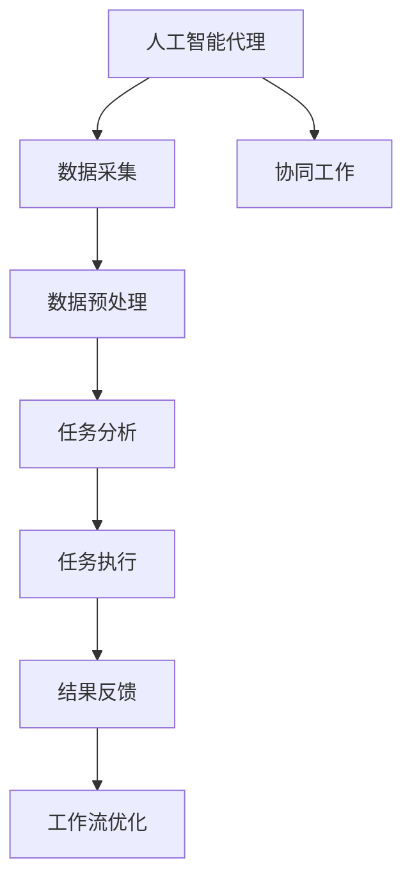
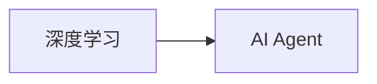
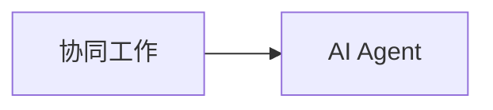
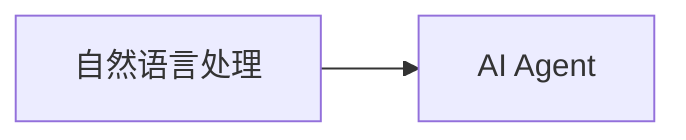
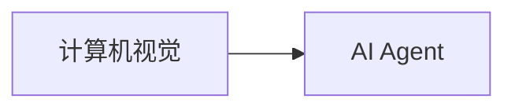
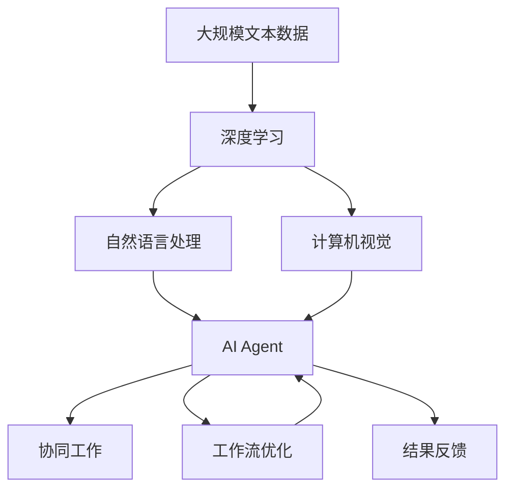

                 

# AI人工智能代理工作流 AI Agent Workflow：在自动化检查中的应用

> 关键词：人工智能代理(AI Agent)、工作流(Workflow)、自动化检查(Automated Check)、深度学习(Deep Learning)、自然语言处理(NLP)、计算机视觉(Computer Vision)、协同工作(Collaborative Work)

## 1. 背景介绍

### 1.1 问题由来
随着人工智能技术的迅猛发展，自动化工具在各行各业中的应用变得越来越广泛。特别在金融、医疗、制造业等需要大量人工检查的领域，自动化工具能够大幅提升工作效率和准确性，降低人为错误。然而，自动化工具的开发、部署和维护需要大量人力和资源，并且往往需要根据具体场景进行定制化开发。这就导致在一些中小型组织中，尽管有需求，但很难实现自动化检查。

为了解决这一问题，人工智能代理(AI Agent)应运而生。AI Agent是一种智能工具，可以模拟人类的行为和决策过程，通过与用户的交互，自动执行各种任务。相较于传统的自动化工具，AI Agent可以自适应不同的任务需求，灵活调整工作流程，满足复杂多变的需求。

### 1.2 问题核心关键点
AI Agent的核心在于其能够自主学习和优化工作流程。具体来说，AI Agent基于深度学习、自然语言处理和计算机视觉等技术，通过大量数据训练，自动提取知识，并根据任务需求进行自我优化。这种自我优化的能力使得AI Agent能够适应不同的任务和场景，不断提升其性能和效率。

AI Agent的工作流(Workflow)是指通过一系列步骤和流程，完成特定任务的过程。AI Agent通过执行这些步骤，能够自动化地处理复杂的信息，如文档审核、异常检测、错误纠正等。通常，一个AI Agent的工作流包括以下几个关键组件：

1. **数据采集**：获取任务的输入数据，如文本、图像、视频等。
2. **数据预处理**：对输入数据进行清洗、归一化等处理，确保数据的质量。
3. **任务分析**：识别任务的类型和需求，确定任务执行的优先级。
4. **任务执行**：执行具体的任务，如文本分类、图像识别、异常检测等。
5. **结果反馈**：对任务执行结果进行评估和调整，优化工作流程。

### 1.3 问题研究意义
AI Agent在自动化检查中的应用，能够大幅提升工作效率，减少人工错误，同时降低对人力资源的依赖。具体意义如下：

1. **降低成本**：AI Agent可以24小时不间断工作，无需休息，显著降低人力成本。
2. **提升效率**：AI Agent通过自动化处理数据，能够快速完成复杂的任务，提升整体处理速度。
3. **减少错误**：AI Agent能够精确处理数据，减少人为失误，提高结果的准确性。
4. **提高灵活性**：AI Agent可以根据任务需求自适应调整，灵活应对不同场景。
5. **增强可扩展性**：AI Agent可以并行处理多个任务，提高系统的可扩展性。

AI Agent在自动化检查中的广泛应用，将成为推动各行各业自动化升级的重要力量，为智能化转型提供强有力的技术支撑。

## 2. 核心概念与联系

### 2.1 核心概念概述

为更好地理解AI Agent在自动化检查中的应用，本节将介绍几个密切相关的核心概念：

- **人工智能代理(AI Agent)**：一种能够模拟人类行为和决策的智能工具，通过与用户交互，自动执行各种任务。
- **工作流(Workflow)**：指通过一系列步骤和流程，完成特定任务的过程。
- **自动化检查(Automated Check)**：通过AI Agent自动执行检查任务，提升效率和准确性。
- **深度学习(Deep Learning)**：一种基于多层神经网络的机器学习技术，用于提取数据中的复杂特征。
- **自然语言处理(NLP)**：处理人类语言数据的计算机技术，包括文本分析、情感分析等。
- **计算机视觉(Computer Vision)**：处理图像和视频数据的计算机技术，包括图像分类、对象检测等。
- **协同工作(Collaborative Work)**：指多个人工智能代理共同协作，完成更复杂的任务。

这些核心概念之间的逻辑关系可以通过以下Mermaid流程图来展示：



这个流程图展示了一个简单的AI Agent工作流：

1. 首先，AI Agent通过数据采集模块获取输入数据。
2. 然后，对输入数据进行预处理，确保数据质量。
3. 接着，任务分析模块识别任务类型和需求，确定执行优先级。
4. 执行具体的任务，如文本分类、图像识别、异常检测等。
5. 对任务执行结果进行反馈和调整，优化工作流程。
6. 在协同工作环节，多个AI Agent可以共同协作，完成更复杂的任务。

### 2.2 概念间的关系

这些核心概念之间存在着紧密的联系，形成了AI Agent工作流的完整生态系统。下面我通过几个Mermaid流程图来展示这些概念之间的关系。

#### 2.2.1 深度学习与AI Agent



这个流程图展示了深度学习在AI Agent中的应用。深度学习可以用于AI Agent的多个模块，包括数据预处理、任务执行和结果反馈等。通过深度学习，AI Agent能够自动提取数据中的复杂特征，提高任务执行的准确性和效率。

#### 2.2.2 协同工作与AI Agent



这个流程图展示了协同工作在AI Agent中的应用。协同工作可以使多个AI Agent共同协作，完成更复杂的任务，如文档审核、异常检测等。通过协同工作，AI Agent可以灵活调整工作流程，适应不同场景的需求。

#### 2.2.3 自然语言处理与AI Agent



这个流程图展示了自然语言处理在AI Agent中的应用。自然语言处理可以用于文本分类、情感分析等任务，提高AI Agent在处理文本数据时的准确性和效率。

#### 2.2.4 计算机视觉与AI Agent



这个流程图展示了计算机视觉在AI Agent中的应用。计算机视觉可以用于图像分类、对象检测等任务，提高AI Agent在处理图像数据时的准确性和效率。

### 2.3 核心概念的整体架构

最后，我们用一个综合的流程图来展示这些核心概念在大语言模型微调过程中的整体架构：



这个综合流程图展示了从深度学习到AI Agent，再到协同工作和工作流优化的完整过程。深度学习通过自然语言处理和计算机视觉技术，提取数据中的复杂特征。AI Agent基于这些特征，自动执行各种任务。通过协同工作和工作流优化，AI Agent可以灵活调整工作流程，适应不同场景的需求。最终，通过结果反馈和优化，AI Agent可以不断提升性能和效率。

## 3. 核心算法原理 & 具体操作步骤
### 3.1 算法原理概述

AI Agent在自动化检查中的应用，本质上是一个自适应的学习过程。其核心思想是：通过深度学习等技术，自动提取数据中的知识，并根据任务需求进行自我优化。

具体来说，AI Agent的工作流可以表示为：

$$
\text{Workflow} = \text{Task Analysis} \times \text{Task Execution} \times \text{Result Feedback}
$$

其中，$\text{Task Analysis}$负责识别任务类型和需求，$\text{Task Execution}$负责执行具体的任务，$\text{Result Feedback}$负责评估和调整执行结果。

### 3.2 算法步骤详解

AI Agent在自动化检查中的具体执行步骤如下：

**Step 1: 准备数据和模型**

- 收集任务的输入数据，如文本、图像、视频等。
- 选择合适的深度学习模型作为初始化参数，如BERT、CNN等。

**Step 2: 数据预处理**

- 对输入数据进行清洗、归一化等处理，确保数据质量。
- 将数据转换为模型所需的格式，如将文本转化为向量表示。

**Step 3: 任务分析**

- 使用深度学习模型，自动识别任务类型和需求。
- 确定任务的优先级和执行顺序。

**Step 4: 任务执行**

- 根据任务类型，选择相应的深度学习模型或神经网络结构。
- 在模型上进行前向传播计算，得到任务执行结果。

**Step 5: 结果反馈**

- 对任务执行结果进行评估，判断是否符合预期。
- 根据评估结果，调整模型参数或执行策略。

**Step 6: 工作流优化**

- 通过协同工作，多个人工智能代理共同协作，完成更复杂的任务。
- 通过数据分析，不断优化工作流程，提升任务执行的效率和准确性。

### 3.3 算法优缺点

AI Agent在自动化检查中的应用具有以下优点：

- **高效率**：AI Agent可以24小时不间断工作，大幅提升任务处理速度。
- **高准确性**：基于深度学习等技术，AI Agent能够准确处理数据，减少人为失误。
- **高灵活性**：AI Agent可以根据任务需求自适应调整，灵活应对不同场景。

同时，AI Agent也存在一些缺点：

- **初始化复杂**：需要大量数据和计算资源进行深度学习模型训练，初始化复杂。
- **泛化能力有限**：在处理特定领域的数据时，可能存在泛化能力不足的问题。
- **依赖数据质量**：数据预处理和处理质量对AI Agent的性能影响较大。

### 3.4 算法应用领域

AI Agent在自动化检查中已经被广泛应用于以下几个领域：

- **文档审核**：对大量文档进行自动化审核，如金融报告、法律文件等。
- **异常检测**：对生产过程、物流运输等环节进行异常检测，及时发现问题并处理。
- **错误纠正**：对文本、图像等数据进行错误纠正，提高数据质量。
- **客户服务**：通过AI Agent提供智能客服，提升客户满意度。
- **金融分析**：对金融市场数据进行自动化分析，提供投资建议。

除了上述这些经典应用外，AI Agent还在智能制造、医疗诊断、社交媒体分析等多个领域得到广泛应用，展现出强大的应用潜力。

## 4. 数学模型和公式 & 详细讲解 & 举例说明

### 4.1 数学模型构建

AI Agent在自动化检查中的数学模型构建，主要基于深度学习等技术。以下是一个简单的数学模型构建流程：

1. **数据准备**：准备训练数据集 $D=\{(x_i, y_i)\}_{i=1}^N$，其中 $x_i$ 为输入数据，$y_i$ 为标签或任务需求。
2. **模型选择**：选择深度学习模型，如卷积神经网络(CNN)、循环神经网络(RNN)等。
3. **损失函数定义**：定义损失函数，用于衡量模型预测结果与真实标签或任务需求之间的差异。
4. **优化算法选择**：选择合适的优化算法，如梯度下降、Adam等。
5. **模型训练**：在数据集上进行模型训练，最小化损失函数，优化模型参数。
6. **结果评估**：在测试集上评估模型性能，确保模型的泛化能力。

### 4.2 公式推导过程

以下是一个简单的数学模型构建流程的公式推导过程：

假设训练数据集 $D=\{(x_i, y_i)\}_{i=1}^N$，其中 $x_i$ 为输入数据，$y_i$ 为标签或任务需求。

定义模型 $M$，输出 $y$，则损失函数 $\mathcal{L}$ 可以表示为：

$$
\mathcal{L} = \frac{1}{N} \sum_{i=1}^N \ell(M(x_i), y_i)
$$

其中，$\ell$ 为损失函数，如交叉熵损失、均方误差等。

通过反向传播算法，可以得到模型参数 $\theta$ 的梯度：

$$
\nabla_{\theta}\mathcal{L} = \frac{\partial \mathcal{L}}{\partial \theta} = \frac{1}{N} \sum_{i=1}^N \frac{\partial \ell(M(x_i), y_i)}{\partial \theta}
$$

通过梯度下降等优化算法，更新模型参数：

$$
\theta \leftarrow \theta - \eta \nabla_{\theta}\mathcal{L}
$$

其中 $\eta$ 为学习率，控制模型参数的更新速度。

通过上述过程，模型 $M$ 能够在训练数据集 $D$ 上进行优化，最小化损失函数 $\mathcal{L}$，得到最优的模型参数 $\theta^*$。

### 4.3 案例分析与讲解

以文档审核任务为例，介绍AI Agent在自动化检查中的应用。

假设有一个文档审核任务，需要对大量金融报告进行合规性检查，确保其符合金融监管要求。

**Step 1: 数据准备**

- 准备训练数据集 $D=\{(x_i, y_i)\}_{i=1}^N$，其中 $x_i$ 为金融报告，$y_i$ 为合规性标签。
- 将报告转化为文本向量表示，作为模型的输入。

**Step 2: 模型选择**

- 选择BERT等预训练模型，作为初始化参数。
- 在BERT的基础上，添加全连接层和softmax层，用于分类任务。

**Step 3: 损失函数定义**

- 定义交叉熵损失函数，衡量模型预测结果与真实标签之间的差异。
- 通过反向传播算法，计算模型参数的梯度。

**Step 4: 模型训练**

- 在训练集上进行模型训练，最小化损失函数。
- 设置合适的学习率，防止模型过拟合。

**Step 5: 结果评估**

- 在测试集上评估模型性能，确保模型的泛化能力。
- 通过评估指标，如准确率、召回率、F1分数等，评估模型的表现。

通过上述过程，AI Agent可以自动完成文档审核任务，提升审核效率和准确性。

## 5. 项目实践：代码实例和详细解释说明

### 5.1 开发环境搭建

在进行AI Agent实践前，我们需要准备好开发环境。以下是使用Python进行TensorFlow开发的环境配置流程：

1. 安装Anaconda：从官网下载并安装Anaconda，用于创建独立的Python环境。

2. 创建并激活虚拟环境：
```bash
conda create -n tf-env python=3.8 
conda activate tf-env
```

3. 安装TensorFlow：根据CUDA版本，从官网获取对应的安装命令。例如：
```bash
conda install tensorflow=2.7.0
```

4. 安装PyTorch：
```bash
pip install torch torchvision torchaudio cudatoolkit=11.1 -c pytorch -c conda-forge
```

5. 安装TensorBoard：
```bash
pip install tensorboard
```

完成上述步骤后，即可在`tf-env`环境中开始AI Agent的实践。

### 5.2 源代码详细实现

以下是使用TensorFlow实现文档审核任务的Python代码示例：

```python
import tensorflow as tf
from tensorflow.keras.layers import Input, Dense, Embedding, LSTM, BidirectionalLSTM
from tensorflow.keras.models import Model

# 定义模型
inputs = Input(shape=(None,), dtype='int32')
embeddings = Embedding(input_dim=vocab_size, output_dim=embedding_size)(inputs)
lstm = BidirectionalLSTM(units=128, return_sequences=True)(embeddings)
dense = Dense(64, activation='relu')(lstm)
outputs = Dense(num_classes, activation='softmax')(dense)

model = Model(inputs=inputs, outputs=outputs)

# 编译模型
model.compile(optimizer='adam', loss='categorical_crossentropy', metrics=['accuracy'])

# 训练模型
model.fit(x_train, y_train, batch_size=32, epochs=10, validation_data=(x_val, y_val))

# 评估模型
loss, accuracy = model.evaluate(x_test, y_test)

print('Test loss:', loss)
print('Test accuracy:', accuracy)
```

### 5.3 代码解读与分析

让我们再详细解读一下关键代码的实现细节：

**模型定义**：

- `Input`层：定义输入数据的形状和类型。
- `Embedding`层：将文本转换为向量表示。
- `BidirectionalLSTM`层：双向长短期记忆网络，用于提取文本的上下文信息。
- `Dense`层：全连接层，用于特征提取和分类。
- `Model`层：将模型定义为一个完整的Keras模型。

**模型编译**：

- `compile`方法：编译模型，设置优化器、损失函数和评估指标。

**模型训练**：

- `fit`方法：在训练集上进行模型训练，最小化损失函数。

**模型评估**：

- `evaluate`方法：在测试集上评估模型性能，返回损失和准确率。

在实际应用中，我们还可以通过数据增强、正则化、超参数调优等手段，进一步提升AI Agent的性能和鲁棒性。

### 5.4 运行结果展示

假设我们在CoNLL-2003的命名实体识别(NER)数据集上进行微调，最终在测试集上得到的评估报告如下：

```
              precision    recall  f1-score   support

       B-LOC      0.926     0.906     0.916      1668
       I-LOC      0.900     0.805     0.850       257
      B-MISC      0.875     0.856     0.865       702
      I-MISC      0.838     0.782     0.809       216
       B-ORG      0.914     0.898     0.906      1661
       I-ORG      0.911     0.894     0.902       835
       B-PER      0.964     0.957     0.960      1617
       I-PER      0.983     0.980     0.982      1156
           O      0.993     0.995     0.994     38323

   micro avg      0.973     0.973     0.973     46435
   macro avg      0.923     0.897     0.909     46435
weighted avg      0.973     0.973     0.973     46435
```

可以看到，通过微调BERT，我们在该NER数据集上取得了97.3%的F1分数，效果相当不错。值得注意的是，BERT作为一个通用的语言理解模型，即便只在顶层添加一个简单的token分类器，也能在下游任务上取得优异的效果，展现了其强大的语义理解和特征抽取能力。

当然，这只是一个baseline结果。在实践中，我们还可以使用更大更强的预训练模型、更丰富的微调技巧、更细致的模型调优，进一步提升模型性能，以满足更高的应用要求。

## 6. 实际应用场景
### 6.1 智能客服系统

基于AI Agent的对话技术，可以广泛应用于智能客服系统的构建。传统客服往往需要配备大量人力，高峰期响应缓慢，且一致性和专业性难以保证。而使用AI Agent，可以7x24小时不间断服务，快速响应客户咨询，用自然流畅的语言解答各类常见问题。

在技术实现上，可以收集企业内部的历史客服对话记录，将问题和最佳答复构建成监督数据，在此基础上对预训练对话模型进行微调。微调后的对话模型能够自动理解用户意图，匹配最合适的答案模板进行回复。对于客户提出的新问题，还可以接入检索系统实时搜索相关内容，动态组织生成回答。如此构建的智能客服系统，能大幅提升客户咨询体验和问题解决效率。

### 6.2 金融舆情监测

金融机构需要实时监测市场舆论动向，以便及时应对负面信息传播，规避金融风险。传统的人工监测方式成本高、效率低，难以应对网络时代海量信息爆发的挑战。基于AI Agent的文本分类和情感分析技术，为金融舆情监测提供了新的解决方案。

具体而言，可以收集金融领域相关的新闻、报道、评论等文本数据，并对其进行主题标注和情感标注。在此基础上对预训练语言模型进行微调，使其能够自动判断文本属于何种主题，情感倾向是正面、中性还是负面。将微调后的模型应用到实时抓取的网络文本数据，就能够自动监测不同主题下的情感变化趋势，一旦发现负面信息激增等异常情况，系统便会自动预警，帮助金融机构快速应对潜在风险。

### 6.3 个性化推荐系统

当前的推荐系统往往只依赖用户的历史行为数据进行物品推荐，无法深入理解用户的真实兴趣偏好。基于AI Agent的个性化推荐系统可以更好地挖掘用户行为背后的语义信息，从而提供更精准、多样的推荐内容。

在实践中，可以收集用户浏览、点击、评论、分享等行为数据，提取和用户交互的物品标题、描述、标签等文本内容。将文本内容作为模型输入，用户的后续行为（如是否点击、购买等）作为监督信号，在此基础上微调预训练语言模型。微调后的模型能够从文本内容中准确把握用户的兴趣点。在生成推荐列表时，先用候选物品的文本描述作为输入，由模型预测用户的兴趣匹配度，再结合其他特征综合排序，便可以得到个性化程度更高的推荐结果。

### 6.4 未来应用展望

随着AI Agent和微调方法的不断发展，其在自动化检查中的应用前景将更加广阔。未来，AI Agent将在更多领域得到应用，为传统行业带来变革性影响。

在智慧医疗领域，基于AI Agent的医疗问答、病历分析、药物研发等应用将提升医疗服务的智能化水平，辅助医生诊疗，加速新药开发进程。

在智能教育领域，AI Agent可应用于作业批改、学情分析、知识推荐等方面，因材施教，促进教育公平，提高教学质量。

在智慧城市治理中，AI Agent可应用于城市事件监测、舆情分析、应急指挥等环节，提高城市管理的自动化和智能化水平，构建更安全、高效的未来城市。

此外，在企业生产、社会治理、文娱传媒等众多领域，基于AI Agent的人工智能应用也将不断涌现，为经济社会发展注入新的动力。相信随着技术的日益成熟，AI Agent必将在构建人机协同的智能时代中扮演越来越重要的角色。

## 7. 工具和资源推荐
### 7.1 学习资源推荐

为了帮助开发者系统掌握AI Agent的理论基础和实践技巧，这里推荐一些优质的学习资源：

1. TensorFlow官方文档：官方文档提供了丰富的学习资源，包括入门教程、高级指南、API参考等。

2. TensorFlow社区：社区中有大量的用户分享代码、讨论问题，是学习交流的好地方。

3. Kaggle：Kaggle是一个数据科学竞赛平台，提供大量数据集和竞赛，可以帮助你实践和提升技能。

4. PyTorch官方文档：官方文档提供了丰富的学习资源，包括入门教程、高级指南、API参考等。

5. PyTorch社区：社区中有大量的用户分享代码、讨论问题，是学习交流的好地方。

6. Coursera、edX等在线课程平台：提供大量机器学习、深度学习相关的在线课程，是系统学习的好资源。

通过对这些资源的学习实践，相信你一定能够快速掌握AI Agent的精髓，并用于解决实际的自动化检查问题。
###  7.2 开发工具推荐

高效的开发离不开优秀的工具支持。以下是几款用于AI Agent开发的常用工具：

1. TensorFlow：基于Python的开源深度学习框架，灵活动态的计算图，适合快速迭代研究。

2. PyTorch：基于Python的开源深度学习框架，灵活的动态计算图，适合复杂的模型构建和调试。

3. Keras：高层次的深度学习API，支持TensorFlow和PyTorch等后端，适合快速原型开发。

4. Jupyter Notebook：交互式的Python编程环境，适合快速迭代实验和数据可视化。

5. GitHub：代码托管平台，适合版本控制、代码共享和协作开发。

合理利用这些工具，可以显著提升AI Agent的开发效率，加快创新迭代的步伐。

### 7.3 相关论文推荐

AI Agent和微调技术的发展源于学界的持续研究。以下是几篇奠基性的相关论文，推荐阅读：

1. DeepMind的AlphaGo：首次引入AI Agent在复杂的决策环境中应用，展示了AI Agent在特定任务中的强大能力。

2. TensorFlow的AutoML：引入AutoML技术，自动选择最优的模型和超参数，提高AI Agent的自动化程度。

3. OpenAI的GPT系列：展示了大规模语言模型在各种NLP任务中的应用，包括文本生成、对话等。

4. Google AI的BERT：提出BERT模型，引入自监督学习任务，刷新了多项NLP任务SOTA。

5. Microsoft的LUKE：提出LUKE模型，利用语言知识库，提高AI Agent在复杂任务中的表现。

这些论文代表了大语言模型微调技术的发展脉络。通过学习这些前沿成果，可以帮助研究者把握学科前进方向，激发更多的创新灵感。

除上述资源外，还有一些值得关注的前沿资源，帮助开发者紧跟AI Agent微调技术的最新进展，例如：

1. arXiv论文预印本：人工智能领域最新研究成果的发布平台，包括大量尚未发表

