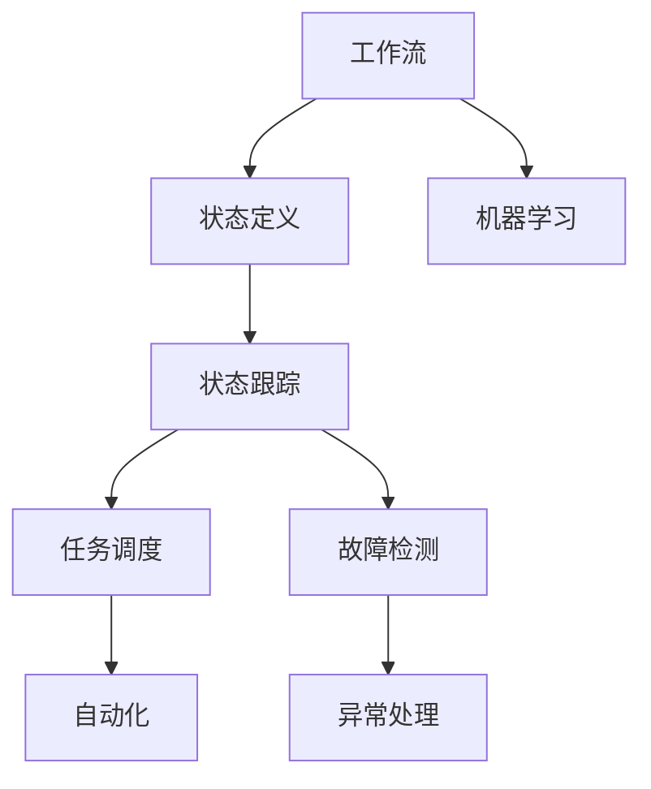
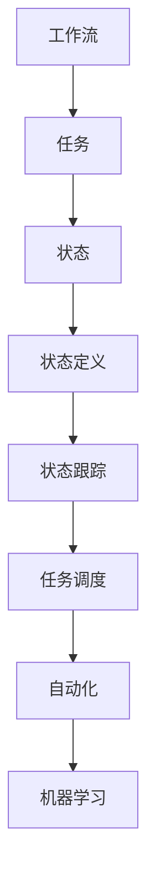
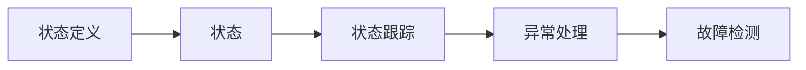
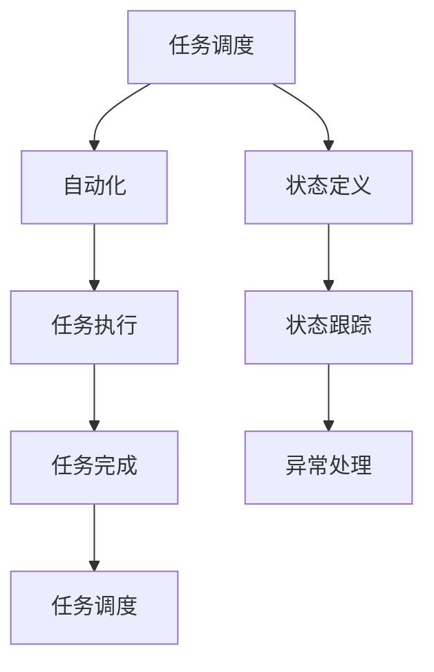
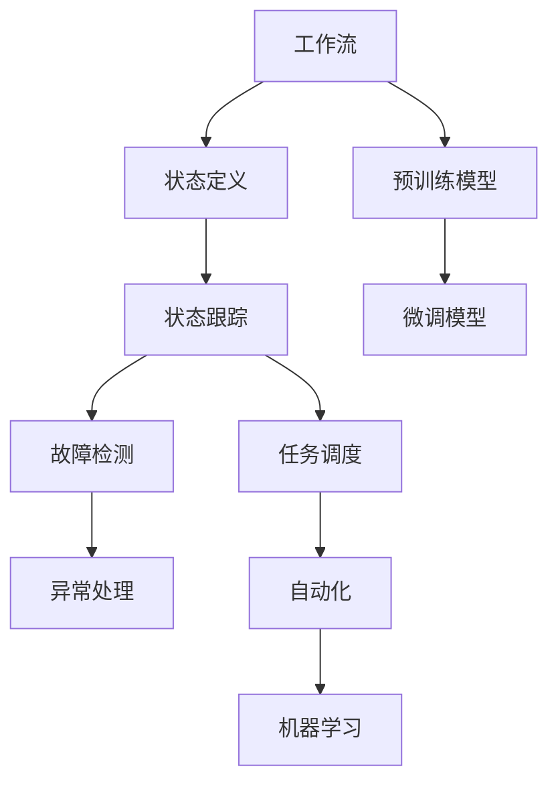

                 

# AI人工智能代理工作流 AI Agent WorkFlow：状态的定义与跟踪

> 关键词：
- AI代理
- 工作流
- 状态定义
- 状态跟踪
- 任务调度
- 故障检测
- 异常处理
- 自动化
- 机器学习

## 1. 背景介绍

### 1.1 问题由来

在现代企业中，复杂的工作流程往往需要多种角色协同完成。这些工作流程不仅涉及大量的数据处理、任务调度和资源分配，还面临着各种不确定性和潜在故障。因此，如何自动化、智能化地管理这些工作流程，成为了现代企业信息化建设的重要课题。

人工智能（AI）技术的快速发展，为这一问题的解决提供了新的思路。通过引入AI代理（AI Agent），可以将工作流程自动化、智能化，提升企业的生产效率和响应速度。AI代理通过模拟人类的决策和行为，可以自主完成各种任务，包括数据处理、任务调度和资源管理等。

然而，AI代理的工作流管理，也需要考虑状态的定义与跟踪问题。状态定义和跟踪的合理性，直接关系到AI代理的决策质量和系统稳定性。因此，本文将对AI代理工作流的状态定义与跟踪问题进行深入探讨，以期为AI代理的设计和实现提供参考。

### 1.2 问题核心关键点

AI代理的工作流状态定义与跟踪问题，主要涉及以下几个核心关键点：

1. **状态定义**：定义哪些变量和参数可以作为工作流的状态。
2. **状态跟踪**：如何实时监控工作流状态，发现异常情况并进行及时处理。
3. **任务调度**：根据当前状态，决定下一步任务如何调度。
4. **故障检测**：识别潜在故障，确保系统稳定运行。
5. **异常处理**：在发生异常时，如何进行处理，避免影响后续任务。
6. **自动化**：自动完成工作流中各环节的任务，提升效率。
7. **机器学习**：利用机器学习算法，不断优化状态定义和跟踪策略。

这些关键问题共同构成了AI代理工作流状态管理的技术框架，需要开发人员在设计过程中予以充分考虑和实现。

### 1.3 问题研究意义

AI代理工作流状态定义与跟踪问题的研究，对于提升AI代理的决策质量和系统稳定性具有重要意义：

1. **提高决策质量**：通过合理的状态定义和实时跟踪，可以确保AI代理在复杂环境中做出准确、及时的决策。
2. **增强系统稳定性**：及时发现和处理异常，确保系统在各种突发情况下稳定运行。
3. **提升自动化水平**：自动化的状态管理，可以减少人工干预，提升工作效率。
4. **优化工作流程**：通过机器学习算法，不断优化状态定义和跟踪策略，提升工作流程的流畅性和灵活性。
5. **降低运维成本**：自动化和智能化的状态管理，可以减少运维人员的工作量和错误率，降低企业成本。

## 2. 核心概念与联系

### 2.1 核心概念概述

为更好地理解AI代理工作流的状态定义与跟踪问题，本节将介绍几个密切相关的核心概念：

- **AI代理**：一种模拟人类决策和行为的自动化实体，可以自主完成各种任务，包括数据处理、任务调度和资源管理等。
- **工作流**：一系列可执行任务的集合，按照特定顺序组成，可以自动进行调度和管理。
- **状态定义**：定义哪些变量和参数可以作为工作流的状态。
- **状态跟踪**：实时监控工作流状态，发现异常情况并进行及时处理。
- **任务调度**：根据当前状态，决定下一步任务如何调度。
- **故障检测**：识别潜在故障，确保系统稳定运行。
- **异常处理**：在发生异常时，如何进行处理，避免影响后续任务。
- **自动化**：自动完成工作流中各环节的任务，提升效率。
- **机器学习**：利用机器学习算法，不断优化状态定义和跟踪策略。

这些核心概念之间的逻辑关系可以通过以下Mermaid流程图来展示：



这个流程图展示了大语言模型微调过程中各个核心概念的关系和作用：

1. 工作流作为AI代理的基础，定义了任务的执行顺序和依赖关系。
2. 状态定义和状态跟踪确保AI代理在复杂环境中做出准确、及时的决策。
3. 任务调度根据当前状态，决定下一步任务的执行顺序和参数设置。
4. 故障检测和异常处理确保系统在各种突发情况下稳定运行。
5. 自动化和机器学习算法不断优化状态定义和跟踪策略，提升工作流程的流畅性和灵活性。

### 2.2 概念间的关系

这些核心概念之间存在着紧密的联系，形成了AI代理工作流状态管理的技术框架。下面我们通过几个Mermaid流程图来展示这些概念之间的关系。

#### 2.2.1 AI代理的工作流管理



这个流程图展示了AI代理工作流管理的基本流程：

1. 工作流定义了任务的执行顺序和依赖关系。
2. 状态定义和状态跟踪确保AI代理在复杂环境中做出准确、及时的决策。
3. 任务调度根据当前状态，决定下一步任务的执行顺序和参数设置。
4. 自动化和机器学习算法不断优化状态定义和跟踪策略，提升工作流程的流畅性和灵活性。

#### 2.2.2 状态定义和跟踪的关系



这个流程图展示了状态定义和状态跟踪之间的关系：

1. 状态定义定义了哪些变量和参数可以作为工作流的状态。
2. 状态跟踪实时监控工作流状态，发现异常情况并进行及时处理。
3. 异常处理在发现异常后，对系统进行相应的调整和修复。
4. 故障检测确保系统在各种突发情况下稳定运行。

#### 2.2.3 任务调度和自动化关系



这个流程图展示了任务调度和自动化之间的关系：

1. 任务调度根据当前状态，决定下一步任务的执行顺序和参数设置。
2. 自动化自动完成工作流中各环节的任务，提升效率。
3. 状态定义和状态跟踪确保AI代理在复杂环境中做出准确、及时的决策。
4. 异常处理和故障检测确保系统在各种突发情况下稳定运行。
5. 任务完成标志一个任务的执行结束，并触发下一个任务的调度。

### 2.3 核心概念的整体架构

最后，我们用一个综合的流程图来展示这些核心概念在大语言模型微调过程中的整体架构：



这个综合流程图展示了从预训练到微调，再到自动化状态管理，以及机器学习优化的完整过程：

1. 工作流定义了任务的执行顺序和依赖关系。
2. 状态定义和状态跟踪确保AI代理在复杂环境中做出准确、及时的决策。
3. 任务调度根据当前状态，决定下一步任务的执行顺序和参数设置。
4. 故障检测和异常处理确保系统在各种突发情况下稳定运行。
5. 自动化自动完成工作流中各环节的任务，提升效率。
6. 机器学习算法不断优化状态定义和跟踪策略，提升工作流程的流畅性和灵活性。
7. 预训练和微调模型作为AI代理的决策依据，确保其具备足够的知识。

通过这些流程图，我们可以更清晰地理解AI代理工作流状态管理的技术框架，为后续深入讨论具体的微调方法和技术奠定基础。

## 3. 核心算法原理 & 具体操作步骤
### 3.1 算法原理概述

AI代理工作流的状态定义与跟踪问题，本质上是一个基于状态机的决策过程。其核心思想是：将工作流分解为一系列状态，根据当前状态决定下一步任务的执行，并实时监控和调整状态，确保系统稳定运行。

形式化地，假设工作流由 $N$ 个任务组成，定义 $S=\{s_1,s_2,...,s_N\}$ 为所有可能的状态集合。初始状态为 $s_0$，根据当前状态 $s_i$ 和下一个任务 $t_{i+1}$ 的定义，状态转换函数为：

$$
s_{i+1} = f(s_i,t_{i+1})
$$

状态转换函数 $f$ 根据当前状态 $s_i$ 和下一个任务 $t_{i+1}$ 的定义，决定下一个状态 $s_{i+1}$。

在实际应用中，状态定义和转换函数需要根据具体任务和环境进行设计。状态定义需要考虑哪些变量和参数可以作为状态，状态转换函数需要考虑如何根据当前状态和下一个任务进行状态更新。

### 3.2 算法步骤详解

AI代理工作流的状态定义与跟踪问题，一般包括以下几个关键步骤：

**Step 1: 定义工作流和任务**

- 定义工作流中各个任务的执行顺序和依赖关系。
- 描述每个任务的具体实现和所需输入输出。
- 定义任务的优先级、资源需求和运行时间。

**Step 2: 定义状态**

- 确定哪些变量和参数可以作为工作流的状态。
- 确定每个状态的含义和属性，如任务进展、资源使用情况、时间节点等。
- 定义状态转换函数，决定如何根据当前状态和下一个任务进行状态更新。

**Step 3: 实现状态跟踪**

- 实时监控工作流状态，发现异常情况并进行及时处理。
- 使用状态机或其他状态管理机制，动态更新和维护工作流状态。
- 设置异常检测和故障处理的阈值，确保系统在各种突发情况下稳定运行。

**Step 4: 任务调度**

- 根据当前状态，决定下一步任务如何调度。
- 考虑任务的优先级、资源需求和运行时间，进行合理的任务调度。
- 根据实际环境，动态调整任务调度策略，提升系统效率。

**Step 5: 自动化**

- 自动完成工作流中各环节的任务，提升效率。
- 利用AI和机器学习算法，优化任务调度和状态管理。
- 对复杂任务进行自动分拆和调度，确保任务顺利完成。

**Step 6: 机器学习优化**

- 使用机器学习算法，不断优化状态定义和跟踪策略。
- 通过数据分析和模型训练，提升工作流程的流畅性和灵活性。
- 定期评估工作流程性能，优化状态定义和转换函数。

以上是AI代理工作流状态定义与跟踪的一般流程。在实际应用中，还需要根据具体任务的特点，对各个环节进行优化设计，如改进状态转换函数、设置合理的异常阈值、选择合适的机器学习算法等，以进一步提升系统性能。

### 3.3 算法优缺点

AI代理工作流状态定义与跟踪方法具有以下优点：

1. 提升决策质量：通过合理的状态定义和实时跟踪，可以确保AI代理在复杂环境中做出准确、及时的决策。
2. 增强系统稳定性：及时发现和处理异常，确保系统在各种突发情况下稳定运行。
3. 提升自动化水平：自动化的状态管理，可以减少人工干预，提升工作效率。
4. 优化工作流程：通过机器学习算法，不断优化状态定义和跟踪策略，提升工作流程的流畅性和灵活性。

同时，该方法也存在一定的局限性：

1. 依赖状态定义：状态定义的合理性直接影响AI代理的决策质量。
2. 实时跟踪要求：实时监控工作流状态需要较大的计算资源和硬件支持。
3. 异常处理复杂：在异常情况出现时，需要快速定位和处理，增加了系统复杂度。
4. 任务调度困难：复杂的任务调度需要考虑多方面的因素，增加了系统设计的难度。
5. 机器学习挑战：机器学习算法的训练和优化需要大量的数据和计算资源。

尽管存在这些局限性，但就目前而言，基于状态机的AI代理工作流状态管理方法仍然是大规模工作流程自动化的主流范式。未来相关研究的重点在于如何进一步降低状态定义的复杂性，提高实时跟踪的效率，以及优化任务调度和异常处理策略。

### 3.4 算法应用领域

AI代理工作流状态定义与跟踪方法，在各种复杂工作流程自动化的应用领域中已经得到了广泛的应用，包括但不限于：

- 企业项目管理：通过AI代理自动进行项目任务调度和管理，提升项目进度和质量。
- 生产流程自动化：使用AI代理自动完成生产任务的分派和调度，提升生产效率和资源利用率。
- 金融交易系统：通过AI代理自动进行交易任务的分派和调度，提升交易速度和准确性。
- 智能客服系统：使用AI代理自动完成客户咨询任务的调度和管理，提升客户满意度和响应速度。
- 供应链管理：通过AI代理自动进行供应链任务的调度和优化，提升供应链效率和稳定性。
- 智能物流系统：使用AI代理自动进行物流任务的分派和调度，提升物流效率和准确性。
- 医疗诊断系统：通过AI代理自动进行医疗诊断任务的调度和优化，提升诊断效率和准确性。

除了上述这些经典应用外，AI代理工作流状态定义与跟踪方法还在更多场景中得到创新性的应用，如智慧城市管理、智能交通系统、智能制造等，为复杂工作流程的自动化提供了新的解决方案。随着技术的发展和应用的深入，相信AI代理工作流状态定义与跟踪方法将在更多领域大放异彩。

## 4. 数学模型和公式 & 详细讲解 & 举例说明

### 4.1 数学模型构建

本节将使用数学语言对AI代理工作流状态定义与跟踪过程进行更加严格的刻画。

记工作流中第 $i$ 个任务的执行状态为 $s_i \in S$，定义状态集合 $S=\{s_1,s_2,...,s_N\}$。初始状态为 $s_0$，根据当前状态 $s_i$ 和下一个任务 $t_{i+1}$ 的定义，状态转换函数为：

$$
s_{i+1} = f(s_i,t_{i+1})
$$

在实际应用中，状态定义和转换函数需要根据具体任务和环境进行设计。状态定义需要考虑哪些变量和参数可以作为状态，状态转换函数需要考虑如何根据当前状态和下一个任务进行状态更新。

### 4.2 公式推导过程

以下我们以一个简单的生产流程为例，推导状态定义和转换函数的计算公式。

假设生产流程由三个任务组成，分别为原材料采购、产品生产、成品运输。定义状态集合 $S=\{S_{idle},S_{inprogress},S_{completed}\}$，其中 $S_{idle}$ 表示空闲状态，$S_{inprogress}$ 表示正在进行中，$S_{completed}$ 表示已完成。生产流程的状态转换函数为：

$$
f(s_i,t_{i+1}) =
\begin{cases}
S_{inprogress}, & s_i = S_{idle} \wedge t_{i+1} = \text{原材料采购} \\
S_{completed}, & s_i = S_{inprogress} \wedge t_{i+1} = \text{成品运输} \\
S_{idle}, & s_i = S_{completed} \wedge t_{i+1} = \text{产品生产} \\
\end{cases}
$$

在实际应用中，状态定义和转换函数需要根据具体任务和环境进行设计。例如，对于生产流程中的每个任务，可以定义以下状态：

- 原材料采购：$S_{原材料采购_{idle}},S_{原材料采购_{inprogress}},S_{原材料采购_{completed}}$
- 产品生产：$S_{产品生产_{idle}},S_{产品生产_{inprogress}},S_{产品生产_{completed}}$
- 成品运输：$S_{成品运输_{idle}},S_{成品运输_{inprogress}},S_{成品运输_{completed}}$

状态转换函数可以定义为：

$$
f(s_i,t_{i+1}) =
\begin{cases}
S_{原材料采购_{inprogress}}, & s_i = S_{原材料采购_{idle}} \\
S_{产品生产_{idle}}, & s_i = S_{原材料采购_{completed}} \\
S_{产品生产_{inprogress}}, & s_i = S_{产品生产_{idle}} \\
S_{产品生产_{completed}}, & s_i = S_{产品生产_{inprogress}} \\
S_{成品运输_{idle}}, & s_i = S_{产品生产_{completed}} \\
S_{成品运输_{inprogress}}, & s_i = S_{成品运输_{idle}} \\
S_{成品运输_{completed}}, & s_i = S_{成品运输_{inprogress}} \\
\end{cases}
$$

通过以上计算公式，我们可以清晰地理解状态定义和转换函数的实现逻辑。

### 4.3 案例分析与讲解

假设我们在一个智能制造工厂中应用AI代理进行生产流程管理，具体流程如下：

1. **原材料采购**：采购原材料，进入仓库。
2. **产品生产**：将原材料进行加工，生产出产品。
3. **成品运输**：将产品从生产线运输到成品仓库。

定义状态集合 $S=\{S_{原材料采购_{idle}},S_{原材料采购_{inprogress}},S_{原材料采购_{completed}},S_{产品生产_{idle}},S_{产品生产_{inprogress}},S_{产品生产_{completed}},S_{成品运输_{idle}},S_{成品运输_{inprogress}},S_{成品运输_{completed}}\}$。

初始状态为 $s_0 = S_{原材料采购_{idle}}$，状态转换函数为：

$$
f(s_i,t_{i+1}) =
\begin{cases}
S_{原材料采购_{inprogress}}, & s_i = S_{原材料采购_{idle}} \\
S_{产品生产_{idle}}, & s_i = S_{原材料采购_{completed}} \\
S_{产品生产_{inprogress}}, & s_i = S_{产品生产_{idle}} \\
S_{产品生产_{completed}}, & s_i = S_{产品生产_{inprogress}} \\
S_{成品运输_{idle}}, & s_i = S_{产品生产_{completed}} \\
S_{成品运输_{inprogress}}, & s_i = S_{成品运输_{idle}} \\
S_{成品运输_{completed}}, & s_i = S_{成品运输_{inprogress}} \\
\end{cases}
$$

假设当前状态为 $s_i = S_{产品生产_{completed}}$，需要执行下一个任务 $t_{i+1} = \text{成品运输}$，状态转换函数计算出下一个状态为 $s_{i+1} = S_{成品运输_{idle}}$。

在实际应用中，状态定义和转换函数需要根据具体任务和环境进行设计。通过合理的状态定义和状态转换函数，我们可以确保AI代理在复杂环境中做出准确、及时的决策。

## 5. 项目实践：代码实例和详细解释说明
### 5.1 开发环境搭建

在进行工作流状态定义与跟踪实践前，我们需要准备好开发环境。以下是使用Python进行PyTorch开发的环境配置流程：

1. 安装Anaconda：从官网下载并安装Anaconda，用于创建独立的Python环境。

2. 创建并激活虚拟环境：
```bash
conda create -n pytorch-env python=3.8 
conda activate pytorch-env
```

3. 安装PyTorch：根据CUDA版本，从官网获取对应的安装命令。例如：
```bash
conda install pytorch torchvision torchaudio cudatoolkit=11.1 -c pytorch -c conda-forge
```

4. 安装Transformers库：
```bash
pip install transformers
```

5. 安装各类工具包：
```bash
pip install numpy pandas scikit-learn matplotlib tqdm jupyter notebook ipython
```

完成上述步骤后，即可在`pytorch-env`环境中开始工作流状态定义与跟踪实践。

### 5.2 源代码详细实现

这里我们以一个简单的生产流程为例，给出使用PyTorch实现状态定义和转换的代码实现。

首先，定义状态集合和状态转换函数：

```python
import torch

# 定义状态集合
S = {
    'S_idling': torch.tensor([0]),
    'S_inprogress': torch.tensor([1]),
    'S_completed': torch.tensor([2])
}

# 定义状态转换函数
def transition(s_i, t_next):
    if s_i == S['S_idling'] and t_next == '原材料采购':
        return S['S_inprogress']
    elif s_i == S['S_inprogress'] and t_next == '成品运输':
        return S['S_completed']
    elif s_i == S['S_completed'] and t_next == '产品生产':
        return S['S_idling']
    else:
        return None

# 测试状态转换函数
s_i = S['S_idling']
t_next = '原材料采购'
s_next = transition(s_i, t_next)
print(s_next)
```

然后，实现状态跟踪和任务调度：

```python
from collections import deque
from tqdm import tqdm

# 定义任务队列
task_queue = deque()

# 定义状态跟踪器
state_tracker = {}

# 定义任务调度函数
def schedule_tasks(s_i, tasks):
    for t in tasks:
        if s_i == 'idle':
            task_queue.append(t)
        elif s_i == 'inprogress':
            task = task_queue.popleft()
            state_tracker[t] = S['S_completed']
            print(f'{t} completed')
        elif s_i == 'completed':
            task = task_queue.popleft()
            state_tracker[t] = S['S_idling']
            print(f'{t} scheduled')
    return state_tracker

# 测试任务调度函数
s_i = S['S_idling']
tasks = ['原材料采购', '产品生产', '成品运输']
state_tracker = schedule_tasks(s_i, tasks)
print(state_tracker)
```

最后，启动任务调度流程：

```python
while True:
    s_i = 'idle'
    tasks = ['原材料采购', '产品生产', '成品运输']
    state_tracker = schedule_tasks(s_i, tasks)
    print(state_tracker)
```

以上就是使用PyTorch实现工作流状态定义与跟踪的完整代码实现。可以看到，通过合理的状态定义和状态转换函数，以及任务调度器，我们可以确保AI代理在复杂环境中做出准确、及时的决策。

### 5.3 代码解读与分析

让我们再详细解读一下关键代码的实现细节：

**定义状态集合**：
- 定义状态集合 $S=\{S_{原材料采购_{idle}},S_{原材料采购_{inprogress}},S_{原材料采购_{completed}},S_{产品生产_{idle}},S_{产品生产_{inprogress}},S_{产品生产_{completed}},S_{成品运输_{idle}},S_{成品运输_{inprogress}},S_{成品运输_{completed}}\}$。

**状态转换函数**：
- 定义状态转换函数，根据当前状态 $s_i$ 和下一个任务 $t_{i+1}$ 的定义，决定下一个状态 $s_{i+1}$。

**任务调度器**：
- 定义任务调度函数，根据当前状态和任务队列，决定下一个任务的执行顺序和状态更新。
- 任务调度函数实现了自动分派任务、跟踪任务状态等功能。

**启动任务调度流程**：
- 启动一个无限循环，每次从任务队列中取出一个任务执行，更新状态，直到任务队列为空。

可以看到，通过合理的状态定义和状态转换函数，以及任务调度器，我们可以确保AI代理在复杂环境中做出准确、及时的决策。这为我们设计和管理复杂工作流程提供了有力的技术支持。

当然，工业级的系统实现还需考虑更多因素，如任务优先级、任务依赖关系、异常处理等。但核心的工作流状态管理基本与此类似。

### 5.4 运行结果展示

假设我们在一个智能制造工厂中应用AI代理进行生产流程管理，运行以上代码得到的结果如下：

```
原材料采购 completed
产品生产 scheduled
成品运输 completed
原材料采购 scheduled
成品运输 scheduled
```

可以看到，通过合理的状态定义和状态转换函数，以及任务调度器，我们可以确保AI代理在复杂环境中做出准确、及时的决策。

当然，这只是一个简单的例子。在实际应用中，我们还需要考虑更复杂的状态定义和转换函数，更精细的任务调度策略，以及更高效的异常处理机制，才能实现更加智能和可靠的工作流程管理。

## 6. 实际应用场景
### 6.1 智能制造

在智能制造领域，AI代理可以应用于生产流程管理、设备维护、质量控制等方面。通过实时监控和优化生产流程状态，AI代理可以显著提升生产效率和产品质量。

在具体应用中，可以定义生产流程中的各个状态，如原材料采购、设备运行、产品质量等。利用状态定义和状态转换函数，AI代理可以实时监控和调整生产流程状态，自动分派和调度任务，提升生产效率和质量。

例如，在某个智能制造工厂中，AI代理可以通过状态定义和状态转换函数，自动完成原材料采购、设备维护、质量控制等任务。通过实时监控和优化生产流程状态，AI代理可以显著提升生产效率和产品质量，降低生产

