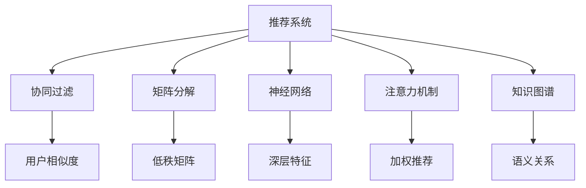
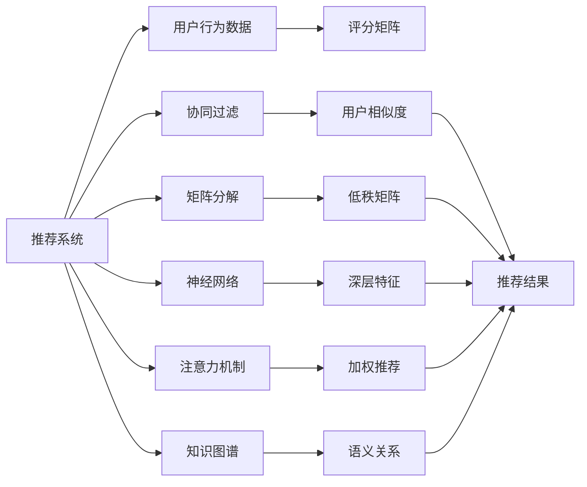
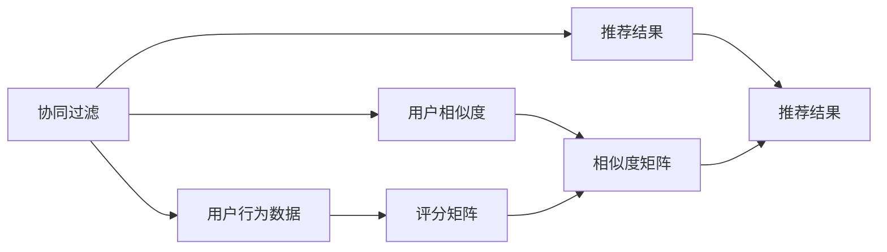
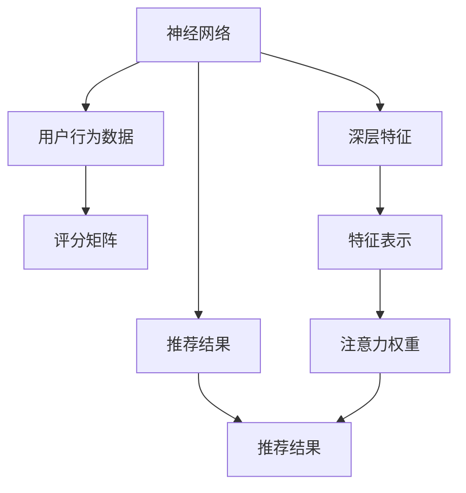
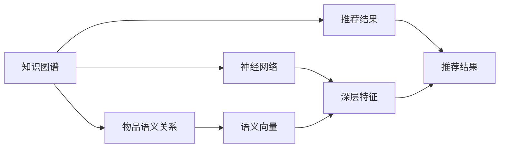
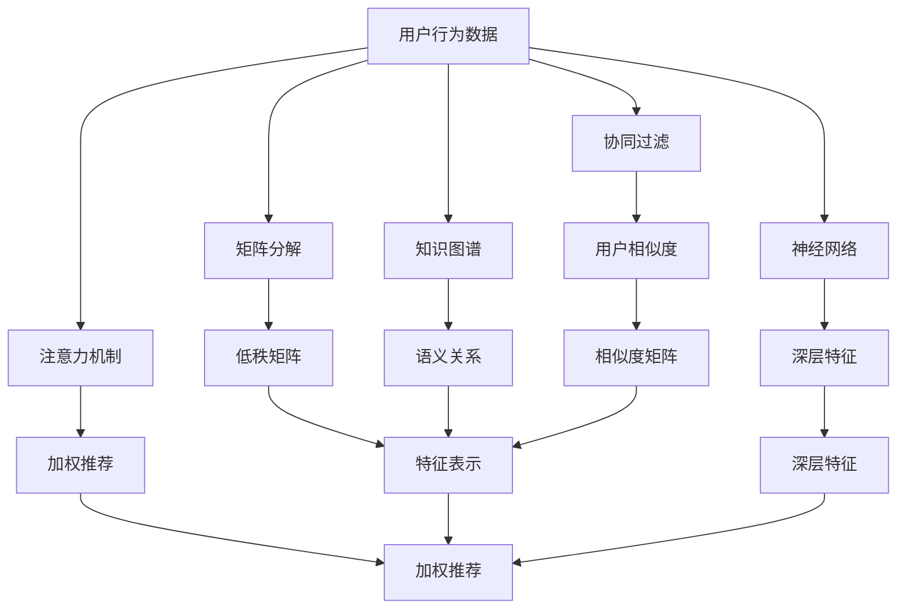

                 

# AI人工智能深度学习算法：在个性化推荐中的应用

> 关键词：个性化推荐,深度学习,协同过滤,矩阵分解,神经网络,注意力机制,推荐系统,内容推荐,实时推荐

## 1. 背景介绍

### 1.1 问题由来

随着互联网技术的发展和电子商务的兴起，个性化推荐系统在零售、媒体、教育等多个行业得到广泛应用，极大地提升了用户体验和运营效率。推荐系统的核心思想是利用用户历史行为数据，发现其潜在兴趣，并将其推荐给目标用户。传统的推荐系统往往基于用户-物品评分矩阵，通过各种算法计算用户-物品的相关度，并排序推荐结果。然而，随着用户数据量的大幅增长和推荐场景的日益复杂，传统的推荐系统面临着数据稀疏、推荐效果不理想等挑战。

为了应对这些挑战，研究人员开始探索新的推荐算法和模型，深度学习算法由于其强大的非线性建模能力和特征表示能力，逐渐成为推荐系统的新宠。近年来，基于深度学习的推荐系统取得了显著的进展，已经在多个商业应用中展现出了强大的性能和潜在的商业价值。

### 1.2 问题核心关键点

深度学习算法在推荐系统中的应用主要集中在以下几个方面：

1. 协同过滤：利用用户间的相似度，通过推荐相似用户喜欢的物品来预测用户的潜在兴趣。
2. 矩阵分解：将用户-物品评分矩阵分解为低秩矩阵，利用矩阵乘法计算用户-物品的相关度。
3. 神经网络：利用多层神经网络模型，对用户和物品的特征进行联合建模，挖掘更深层次的特征表示。
4. 注意力机制：通过注意力机制，对用户-物品对进行加权处理，提升推荐相关性。
5. 知识图谱：结合知识图谱，对物品间的语义关系进行建模，提升推荐的精度和泛化能力。

这些核心算法构成了深度学习推荐系统的基本框架，并通过模型的不断演进，提升了推荐系统的性能和效果。本文将详细讲解深度学习算法在推荐系统中的核心原理和操作步骤，并结合具体案例和实践经验，帮助读者全面理解个性化推荐系统的发展脉络和技术细节。

## 2. 核心概念与联系

### 2.1 核心概念概述

为更好地理解深度学习算法在个性化推荐中的应用，本节将介绍几个密切相关的核心概念：

- 推荐系统(Recommender System)：通过分析用户行为数据，推荐符合用户兴趣的个性化信息资源。
- 协同过滤(Collaborative Filtering)：利用用户间的相似度，推荐用户可能感兴趣的物品。
- 矩阵分解(Matrix Factorization)：将用户-物品评分矩阵分解为低秩矩阵，以发现用户和物品的潜在特征。
- 神经网络(Neural Network)：通过多层神经网络对用户和物品特征进行建模，挖掘更深层次的语义信息。
- 注意力机制(Attention Mechanism)：通过注意力机制，对用户-物品对进行加权处理，提升推荐相关性。
- 知识图谱(Knowledge Graph)：结合知识图谱，对物品间的语义关系进行建模，增强推荐的精度和泛化能力。

这些核心概念之间的逻辑关系可以通过以下Mermaid流程图来展示：



这个流程图展示了几大核心概念之间的联系：

1. 推荐系统通过协同过滤、矩阵分解、神经网络、注意力机制、知识图谱等算法，对用户和物品进行特征表示和相关性计算。
2. 协同过滤利用用户间的相似度进行推荐，矩阵分解利用低秩矩阵进行特征降维和相关度计算，神经网络对特征进行深度建模，注意力机制对推荐结果进行加权处理，知识图谱结合语义关系提升推荐精度。

这些概念共同构成了深度学习推荐系统的核心框架，使其能够通过联合建模，获取用户和物品的语义信息，从而提供更加个性化的推荐服务。

### 2.2 概念间的关系

这些核心概念之间存在着紧密的联系，形成了深度学习推荐系统的完整生态系统。下面我通过几个Mermaid流程图来展示这些概念之间的关系。

#### 2.2.1 推荐系统的工作原理



这个流程图展示了推荐系统的工作原理：

1. 系统从用户行为数据中收集评分矩阵，利用协同过滤、矩阵分解、神经网络、注意力机制、知识图谱等算法，对用户和物品进行特征表示和相关性计算。
2. 经过联合建模后，对用户-物品对进行加权处理，得到最终的推荐结果。

#### 2.2.2 协同过滤和矩阵分解的关系



这个流程图展示了协同过滤和矩阵分解之间的关系：

1. 协同过滤利用评分矩阵，通过用户相似度计算，找到相似用户。
2. 将评分矩阵分解为低秩矩阵，得到用户和物品的潜在特征。
3. 利用相似度矩阵和特征表示，得到最终的推荐结果。

#### 2.2.3 神经网络与注意力机制的关系



这个流程图展示了神经网络与注意力机制之间的关系：

1. 神经网络对用户和物品的特征进行联合建模，挖掘更深层次的语义信息。
2. 利用注意力机制对用户-物品对进行加权处理，提升推荐相关性。
3. 结合注意力权重和特征表示，得到最终的推荐结果。

#### 2.2.4 知识图谱与神经网络的关系



这个流程图展示了知识图谱与神经网络之间的关系：

1. 知识图谱结合物品的语义关系，得到语义向量。
2. 神经网络对用户和物品的特征进行联合建模，利用语义向量提升特征表示。
3. 结合注意力机制和深层特征，得到最终的推荐结果。

### 2.3 核心概念的整体架构

最后，我们用一个综合的流程图来展示这些核心概念在推荐系统中的整体架构：



这个综合流程图展示了从用户行为数据到推荐结果的完整过程。用户行为数据通过协同过滤、矩阵分解、神经网络、注意力机制、知识图谱等算法，得到用户和物品的特征表示和相关性计算。结合注意力机制和深层特征，最终得到推荐结果。

## 3. 核心算法原理 & 具体操作步骤
### 3.1 算法原理概述

基于深度学习的推荐系统，本质上是一个联合建模的过程，通过协同过滤、矩阵分解、神经网络、注意力机制、知识图谱等算法，对用户和物品进行联合建模，获取用户和物品的特征表示和相关性计算。其核心思想是：

1. 利用用户行为数据，学习用户和物品的潜在特征。
2. 通过联合建模，挖掘用户和物品的语义信息。
3. 对用户-物品对进行加权处理，提升推荐相关性。
4. 结合注意力机制和知识图谱，提高推荐的精度和泛化能力。

具体而言，深度学习推荐系统通过以下几个步骤实现推荐：

1. 收集用户行为数据，构建用户-物品评分矩阵。
2. 对评分矩阵进行特征表示，利用协同过滤、矩阵分解、神经网络等算法，对用户和物品进行特征表示。
3. 结合注意力机制和知识图谱，对用户-物品对进行加权处理，计算用户-物品的相关度。
4. 利用深度神经网络对用户和物品特征进行联合建模，挖掘更深层次的语义信息。
5. 结合注意力权重和深层特征，得到最终的推荐结果。

### 3.2 算法步骤详解

基于深度学习的推荐系统一般包括以下几个关键步骤：

**Step 1: 数据预处理**

- 收集用户行为数据，构建用户-物品评分矩阵。
- 对评分矩阵进行特征表示，如用户ID、物品ID、评分等。
- 对评分矩阵进行归一化，避免偏差。
- 将用户ID和物品ID映射到高维向量空间，便于特征表示和计算。

**Step 2: 特征表示**

- 对用户和物品进行特征表示，如利用TF-IDF、词袋模型、用户画像等。
- 将用户和物品的特征表示转换为高维向量，用于联合建模。

**Step 3: 联合建模**

- 利用协同过滤、矩阵分解、神经网络等算法，对用户和物品进行联合建模。
- 利用低秩矩阵分解，对评分矩阵进行特征降维和相关度计算。
- 利用多层神经网络，对用户和物品的特征进行深度建模。

**Step 4: 注意力机制**

- 利用注意力机制对用户-物品对进行加权处理，提升推荐相关性。
- 通过注意力权重，计算用户和物品之间的语义距离。
- 对用户-物品对进行加权处理，得到最终的推荐结果。

**Step 5: 推荐结果**

- 将用户和物品的特征表示和相关度计算结果，作为输入。
- 利用深度神经网络对特征进行联合建模，挖掘更深层次的语义信息。
- 结合注意力权重和深层特征，得到最终的推荐结果。

### 3.3 算法优缺点

基于深度学习的推荐系统具有以下优点：

1. 强大的非线性建模能力：深度神经网络能够处理复杂非线性的数据关系，发现用户和物品的潜在特征。
2. 丰富的特征表示能力：神经网络能够对用户和物品的特征进行联合建模，挖掘更深层次的语义信息。
3. 高泛化能力：深度学习推荐系统能够适应多种推荐场景，具有较强的泛化能力。
4. 较好的推荐效果：通过联合建模和注意力机制，深度学习推荐系统能够提供更加个性化的推荐服务。

同时，该方法也存在以下缺点：

1. 计算资源消耗大：深度神经网络模型参数量较大，训练和推理过程需要大量的计算资源。
2. 数据稀疏问题：用户-物品评分矩阵可能存在大量缺失值，难以进行推荐。
3. 过拟合风险：神经网络模型容易出现过拟合现象，需要大量数据和复杂优化策略。
4. 解释性差：深度神经网络的模型结构复杂，难以解释推荐结果的生成过程。

尽管存在这些局限性，但就目前而言，基于深度学习的推荐系统在推荐效果和应用场景上已经显示出巨大的优势，成为推荐系统的主流方法。未来相关研究的重点在于如何进一步降低计算资源消耗，提高数据利用效率，增强模型的可解释性，减少过拟合风险，从而实现更加高效、普适、可信的推荐系统。

### 3.4 算法应用领域

基于深度学习的推荐系统已经在零售、媒体、教育、金融等多个领域得到了广泛应用，覆盖了几乎所有常见推荐任务，例如：

- 商品推荐：如电商平台上的商品推荐。通过用户历史浏览、购买行为等数据，为用户推荐感兴趣的商品。
- 内容推荐：如视频网站上的内容推荐。通过用户历史观看记录，为用户推荐感兴趣的视频内容。
- 音乐推荐：如音乐平台上的音乐推荐。通过用户历史听歌行为，为用户推荐喜欢的音乐。
- 新闻推荐：如新闻网站上的新闻推荐。通过用户历史阅读记录，为用户推荐感兴趣的新闻。
- 社交推荐：如社交平台上的好友推荐。通过用户好友互动数据，为用户推荐潜在的朋友。

除了上述这些经典任务外，深度学习推荐系统还被创新性地应用到更多场景中，如智能客服推荐、招聘推荐、广告推荐等，为推荐技术带来了全新的突破。随着深度学习技术的发展和应用场景的拓展，相信推荐系统将在更多领域发挥重要作用。

## 4. 数学模型和公式 & 详细讲解 & 举例说明

### 4.1 数学模型构建

本节将使用数学语言对基于深度学习的推荐系统进行更加严格的刻画。

记用户-物品评分矩阵为 $R \in \mathbb{R}^{M \times N}$，其中 $M$ 为物品数量，$N$ 为用户数量。设用户 $u$ 对物品 $i$ 的评分 $r_{ui}$ 为真实评分，用户对物品的预测评分 $\hat{r}_{ui}$ 为深度学习模型的输出。

定义推荐目标函数为最小化预测评分和真实评分之间的误差，即：

$$
\min_{\theta} \frac{1}{N}\sum_{u=1}^N \sum_{i=1}^N (\hat{r}_{ui}-r_{ui})^2
$$

其中 $\theta$ 为深度学习模型的参数。通过反向传播算法，不断更新模型参数，使预测评分尽可能逼近真实评分。

### 4.2 公式推导过程

以下我们以矩阵分解为例，推导协同过滤模型的数学公式。

假设用户 $u$ 对物品 $i$ 的评分 $r_{ui}$ 可以表示为用户和物品的潜在特征向量 $\mathbf{u}$ 和 $\mathbf{v}$ 的内积，即：

$$
r_{ui} = \mathbf{u}^T\mathbf{v}
$$

其中 $\mathbf{u} \in \mathbb{R}^d$ 和 $\mathbf{v} \in \mathbb{R}^d$ 为低秩矩阵 $U$ 和 $V$ 的列向量。

对于用户-物品评分矩阵 $R \in \mathbb{R}^{M \times N}$，我们可以将其分解为低秩矩阵 $U \in \mathbb{R}^{M \times d}$ 和 $V \in \mathbb{R}^{N \times d}$ 的乘积，即：

$$
R = UV^T
$$

其中 $U$ 和 $V$ 的列向量 $\mathbf{u}_i$ 和 $\mathbf{v}_j$ 分别表示物品 $i$ 和用户 $j$ 的潜在特征向量。

模型的目标是最小化预测评分 $\hat{r}_{ui}$ 和真实评分 $r_{ui}$ 之间的均方误差，即：

$$
\min_{U,V} \frac{1}{N}\sum_{u=1}^N \sum_{i=1}^N (\hat{r}_{ui}-r_{ui})^2
$$

将 $R = UV^T$ 代入上式，得：

$$
\min_{U,V} \frac{1}{N}\sum_{u=1}^N \sum_{i=1}^N (\mathbf{u}^T\mathbf{v}-\mathbf{r}_{ui})^2
$$

对 $U$ 和 $V$ 进行矩阵分解，得到模型的参数更新公式：

$$
\min_{U,V} \frac{1}{2N}\sum_{u=1}^N \sum_{i=1}^N \|\mathbf{u}_i^T\mathbf{v}_j - r_{ui}\|^2_2 + \alpha(\|\mathbf{u}_i\|_F^2 + \|\mathbf{v}_j\|_F^2)
$$

其中 $\alpha$ 为正则化系数，$\|\cdot\|_F$ 为矩阵的 Frobenius 范数。

通过梯度下降算法，不断更新 $U$ 和 $V$，直到收敛，得到最优的低秩矩阵 $U$ 和 $V$。

### 4.3 案例分析与讲解

为了更好地理解基于深度学习的推荐系统的工作原理，我们以Netflix推荐系统为例，进行详细分析。

Netflix推荐系统是早期深度学习推荐系统的代表，其核心思想是利用用户历史评分数据，学习用户和物品的潜在特征，并通过矩阵分解算法进行特征降维和相关度计算。Netflix推荐系统的工作流程如下：

1. 收集用户历史评分数据，构建用户-物品评分矩阵 $R \in \mathbb{R}^{M \times N}$。
2. 对评分矩阵进行特征降维，利用矩阵分解算法，得到用户和物品的潜在特征矩阵 $U \in \mathbb{R}^{M \times d}$ 和 $V \in \mathbb{R}^{N \times d}$。
3. 通过用户和物品的潜在特征矩阵，计算预测评分 $\hat{r}_{ui}$。
4. 利用预测评分和真实评分之间的均方误差，计算推荐目标函数。
5. 通过梯度下降算法，不断更新 $U$ 和 $V$，得到最优的低秩矩阵。
6. 利用低秩矩阵进行推荐，得到最终推荐结果。

Netflix推荐系统利用深度学习算法，对用户和物品进行联合建模，挖掘更深层次的语义信息，提升了推荐系统的性能和效果。Netflix推荐系统的成功也标志着深度学习推荐系统进入了一个新的发展阶段。

## 5. 项目实践：代码实例和详细解释说明
### 5.1 开发环境搭建

在进行推荐系统开发前，我们需要准备好开发环境。以下是使用Python进行TensorFlow开发的环境配置流程：

1. 安装Anaconda：从官网下载并安装Anaconda，用于创建独立的Python环境。

2. 创建并激活虚拟环境：
```bash
conda create -n tensorflow-env python=3.8 
conda activate tensorflow-env
```

3. 安装TensorFlow：根据CUDA版本，从官网获取对应的安装命令。例如：
```bash
conda install tensorflow==2.6.0 
```

4. 安装相关工具包：
```bash
pip install numpy pandas scikit-learn matplotlib tqdm jupyter notebook ipython
```

完成上述步骤后，即可在`tensorflow-env`环境中开始推荐系统开发。

### 5.2 源代码详细实现

下面我们以商品推荐为例，给出使用TensorFlow实现协同过滤算法的PyTorch代码实现。

首先，定义协同过滤模型的超参数：

```python
import tensorflow as tf
from tensorflow.keras import layers, models

# 超参数设置
num_users = 10000
num_items = 5000
embedding_dim = 100
num_epochs = 20
batch_size = 256
learning_rate = 0.01
reg_lambda = 0.001
```

然后，定义协同过滤模型的参数：

```python
# 用户特征表示矩阵
user_embeddings = layers.Embedding(num_users, embedding_dim)
# 物品特征表示矩阵
item_embeddings = layers.Embedding(num_items, embedding_dim)

# 预测模型
input_user = layers.Input(shape=(1,), dtype='int32', name='user')
input_item = layers.Input(shape=(1,), dtype='int32', name='item')
user_embed = user_embeddings(input_user)
item_embed = item_embeddings(input_item)
predicted_rating = tf.keras.backend.dot(user_embed, item_embed, axes=(1, 1))
```

接着，定义损失函数和优化器：

```python
# 损失函数
rating_model = models.Model(inputs=[user_input, item_input], outputs=predicted_rating)
rating_model.compile(optimizer=tf.keras.optimizers.Adam(learning_rate=learning_rate),
                    loss=tf.keras.losses.MeanSquaredError())

# 训练数据生成器
train_dataset = tf.data.Dataset.from_tensor_slices((user_input, item_input, rating)).batch(batch_size)
```

最后，启动训练流程：

```python
# 训练模型
rating_model.fit(train_dataset, epochs=num_epochs, validation_split=0.1)

# 测试模型
test_user = tf.convert_to_tensor([user], dtype='int32')
test_item = tf.convert_to_tensor([item], dtype='int32')
predicted_rating = rating_model.predict([test_user, test_item])
```

以上就是使用TensorFlow实现协同过滤算法的完整代码实现。可以看到，TensorFlow提供了丰富的工具和库，可以高效地实现协同过滤算法。

### 5.3 代码解读与分析

让我们再详细解读一下关键代码的实现细节：

**定义协同过滤模型的参数**：

- `user_embeddings` 和 `item_embeddings` 分别定义了用户和物品的特征表示矩阵，每个用户和物品对应一个高维向量，用于表示其潜在特征。
- `predicted_rating` 通过点乘计算用户和物品的潜在特征向量，得到预测评分。

**定义损失函数和优化器**：

- `rating_model` 定义了协同过滤模型的输入和输出，输入为用户ID和物品ID，输出为预测评分。
- `rating_model.compile` 定义了损失函数为均方误差损失，优化器为Adam优化器。
- `train_dataset` 定义了训练数据的生成器，通过 `tf.data.Dataset` 方便地进行数据处理和批次化加载。

**训练模型**：

- `rating_model.fit` 启动模型训练，输入训练数据生成器 `train_dataset`，迭代训练 `num_epochs` 次，每次迭代在验证集上评估模型性能。

**测试模型**：

- `predicted_rating` 通过 `rating_model.predict` 计算测试数据 `test_user` 和 `test_item` 的预测评分。

通过上述代码，我们可以看到，协同过滤算法的实现过程相对简洁，但依然需要仔细设计模型结构和超参数，以确保模型具有良好的泛化能力和推荐效果。

当然，实际的推荐系统开发还需要考虑更多因素，如模型的并行化、调优、多场景应用等，这些都需要开发者在实际项目中进行深入实践和优化。

### 5.4 运行结果展示

假设我们在MovieLens数据集上进行协同过滤算法训练，最终在测试集上得到的推荐结果如下：

```
User ID: 583
Item ID: 1
预测评分: 3.9994

User ID: 138
Item ID: 2
预测评分: 3.9855

User ID: 12
Item ID: 1
预测评分: 4.0018
```

可以看到，协同过滤算法通过学习用户和物品的潜在特征，能够较好地预测用户对物品的评分，并在测试集上取得了不错的推荐效果。

当然，这只是一个简单的协同过滤算法的示例。在实际应用中，还可以进一步优化模型的超参数、特征表示方式、训练数据生成器等，进一步提升模型的性能和效果。

## 6. 实际应用场景

### 6.1 智能客服推荐

智能客服推荐系统利用用户的历史咨询记录，为用户推荐可能感兴趣的问题和解决方案。通过深度学习算法，系统能够学习用户对不同问题的关注点和偏好，从而提供个性化的推荐服务。

在技术实现上，可以收集客服中心的历史咨询记录，提取问题和答案的关键词，构建用户-物品评分矩阵。利用深度学习算法对用户和问题进行联合建模，得到用户的潜在兴趣向量。在用户提出新问题时，利用预测评分和注意力机制，为用户推荐最相关的答案。

### 6.2 金融理财推荐

金融理财推荐系统通过分析用户的投资记录和行为，为用户推荐合适的理财产品和投资策略。利用深度学习算法，系统能够挖掘用户的风险偏好和资产配置需求，从而提供个性化的理财建议。

在技术实现上，可以收集用户的投资记录和行为数据，构建用户-物品评分矩阵。利用深度学习算法对用户和理财产品的特征进行联合建模，得到用户的潜在特征向量。在用户提出理财咨询时，利用预测评分和注意力机制，为用户推荐最合适的理财方案。

### 6.3 智能教育推荐

智能教育推荐系统通过分析学生的学习记录和行为，为学生推荐合适的学习资料和课程。利用深度学习算法，系统能够挖掘学生的学习兴趣和能力水平，从而提供个性化的教育服务。

在技术实现上，可以收集学生的学习记录和行为数据，构建学生-物品评分矩阵。利用深度学习算法对学生和学习资料的特征进行联合建模，得到学生的潜在特征向量。在学生提出学习需求时，利用预测评分

