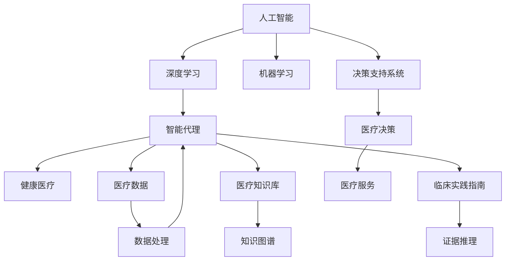
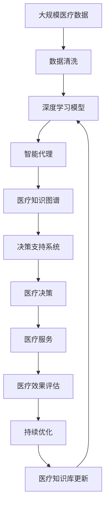

                 

# AI人工智能深度学习算法：智能深度学习代理在健康医疗领域的应用策略

> 关键词：人工智能,深度学习,智能代理,健康医疗,机器学习,决策支持系统

## 1. 背景介绍

### 1.1 问题由来
在当今科技迅猛发展的时代，人工智能(AI)技术已经渗透到了各个领域，其中，健康医疗行业以其独特性而备受关注。AI技术的引入使得医疗诊断、治疗、管理等各个环节都得到了显著的改善和优化。特别是深度学习算法的广泛应用，让智能代理在健康医疗领域大放异彩，成为推动医疗信息化、智能化进程的重要驱动力。然而，智能代理在健康医疗领域的实际应用仍然面临诸多挑战，如数据隐私保护、模型透明性、决策支持系统的优化等问题。因此，本文旨在深入探讨智能深度学习代理在健康医疗领域的应用策略，为相关从业人员提供全面的技术指导。

### 1.2 问题核心关键点
智能深度学习代理在健康医疗领域的应用策略，关键在于如何构建安全、高效、可解释的AI系统。这要求我们关注以下核心要点：

- **数据隐私保护**：确保患者数据的隐私性和安全性，避免数据泄露和滥用。
- **模型透明性**：提高深度学习模型的可解释性，帮助医生理解AI决策过程。
- **决策支持系统的优化**：设计合理的智能代理架构，提升医疗决策的准确性和可靠性。

本文将从算法原理、操作步骤、案例分析等方面展开讨论，详细分析智能深度学习代理在健康医疗领域的应用策略，并给出具体的实现建议。

## 2. 核心概念与联系

### 2.1 核心概念概述

为更好地理解智能深度学习代理在健康医疗领域的应用策略，本节将介绍几个密切相关的核心概念：

- **人工智能(AI)**：指通过计算机技术模拟人类智能，实现问题求解、知识推理、自然语言理解、视觉识别等功能。
- **深度学习(Deep Learning)**：指利用多层神经网络进行非线性特征提取和建模，适用于处理复杂的多维数据。
- **智能代理(Intelligent Agent)**：指具有一定自主性、学习能力、沟通能力和合作能力的软件实体，能够模拟人类智能行为。
- **健康医疗**：指包括疾病预防、诊断、治疗、管理、康复等多个环节的综合医疗体系。
- **机器学习(Machine Learning)**：指通过数据驱动的方式，让机器自动学习和改进，以实现智能决策。
- **决策支持系统(Decision Support System, DSS)**：指利用计算机技术，为决策者提供信息和分析支持，辅助决策。

这些核心概念之间的逻辑关系可以通过以下Mermaid流程图来展示：



这个流程图展示了大语言模型的核心概念及其之间的关系：

1. 人工智能通过深度学习和机器学习技术实现智能代理。
2. 智能代理在健康医疗领域提供数据处理、知识图谱构建、临床实践指南支持等功能。
3. 决策支持系统利用智能代理构建的医疗数据和知识库，为医疗决策提供支持和辅助。
4. 智能代理和决策支持系统共同构成智能深度学习代理，在健康医疗领域提供全面的智能支持。

### 2.2 概念间的关系

这些核心概念之间存在着紧密的联系，形成了智能深度学习代理在健康医疗领域的应用生态系统。下面我们用一个综合的流程图来展示这些核心概念在大语言模型微调过程中的整体架构：



这个综合流程图展示了从数据收集到医疗决策的完整过程，以及智能深度学习代理在大语言模型微调过程中的作用和贡献。

## 3. 核心算法原理 & 具体操作步骤
### 3.1 算法原理概述

智能深度学习代理在健康医疗领域的应用策略，本质上是通过深度学习模型对医疗数据进行学习和理解，从而构建出智能代理系统。该系统的核心在于构建一个能够自动推理和决策的智能代理，帮助医生在诊断和治疗过程中做出更加科学、准确的决策。

形式化地，假设我们有一个医疗数据集 $D=\{(x_i, y_i)\}_{i=1}^N, x_i \in \mathcal{X}, y_i \in \mathcal{Y}$，其中 $x_i$ 表示患者的历史诊疗记录，$y_i$ 表示疾病类型。我们的目标是通过深度学习模型 $M_{\theta}$ 学习患者的历史诊疗记录与疾病类型之间的映射关系，构建出智能代理系统。

我们的优化目标是找到最优的模型参数 $\theta^*$，使得在测试集上智能代理的预测效果最大化。即：

$$
\theta^* = \mathop{\arg\min}_{\theta} \mathcal{L}(D, M_{\theta})
$$

其中 $\mathcal{L}$ 为针对智能代理的损失函数，用于衡量模型在测试集上的预测效果。

### 3.2 算法步骤详解

智能深度学习代理在健康医疗领域的应用策略主要包括以下几个关键步骤：

**Step 1: 数据收集与预处理**

1. 收集医疗数据：包括患者的基本信息、历史诊疗记录、检验报告等。这些数据可以从医院信息系统、公共医疗数据平台等渠道获取。
2. 数据清洗与标准化：清洗医疗数据中的噪声和异常值，标准化数据格式，确保数据质量。
3. 数据划分：将医疗数据划分为训练集、验证集和测试集，用于模型训练、调优和评估。

**Step 2: 模型构建与训练**

1. 选择合适的深度学习模型：如卷积神经网络(CNN)、循环神经网络(RNN)、长短期记忆网络(LSTM)、Transformer等。
2. 定义损失函数：根据具体任务选择合适的损失函数，如交叉熵损失、均方误差损失等。
3. 选择优化器：如Adam、SGD等，并设置合适的学习率、批大小等参数。
4. 模型训练：使用训练集数据对深度学习模型进行训练，最小化损失函数。

**Step 3: 智能代理构建**

1. 知识图谱构建：从医疗数据中提取出实体、关系和属性，构建知识图谱。
2. 临床实践指南整合：将临床实践指南、循证医学知识等整合到知识图谱中。
3. 决策支持系统集成：将构建的智能代理与决策支持系统集成，构建出完整的智能代理系统。

**Step 4: 系统优化与评估**

1. 系统优化：对智能代理系统进行调优，提升系统的响应速度、计算效率和稳定性。
2. 系统评估：在测试集上评估智能代理系统的预测效果，通过分类准确率、召回率等指标进行评估。
3. 持续优化：根据测试集上的评估结果，不断优化模型参数和系统架构，提升系统性能。

### 3.3 算法优缺点

智能深度学习代理在健康医疗领域的应用策略，具有以下优点：

- **高效性**：通过深度学习模型对医疗数据进行自动化处理，大大提高了诊断和治疗的效率。
- **鲁棒性**：深度学习模型具有较强的泛化能力，能够在不同的医疗场景下稳定工作。
- **可扩展性**：深度学习模型和智能代理系统可以根据需要，灵活添加新的医疗知识和规则，适应不同的医疗需求。

同时，也存在以下缺点：

- **数据隐私问题**：医疗数据涉及个人隐私，需要采取严格的数据隐私保护措施。
- **模型透明性**：深度学习模型的决策过程缺乏可解释性，难以被医生理解和信任。
- **高成本**：深度学习模型和智能代理系统的构建和维护成本较高，需要大量的计算资源和技术支持。

### 3.4 算法应用领域

智能深度学习代理在健康医疗领域的应用范围非常广泛，包括但不限于以下几个方面：

- **医学影像分析**：利用深度学习模型对医学影像进行分析和诊断，如CT、MRI、X光等影像数据的分类、分割、检测等。
- **疾病预测与诊断**：通过深度学习模型对患者的病史、症状、检验报告等数据进行分析，预测疾病风险，辅助医生进行诊断。
- **个性化治疗方案**：结合患者的基因信息、生活习惯等数据，利用深度学习模型设计个性化的治疗方案，提高治疗效果。
- **电子病历管理**：通过智能代理系统对电子病历进行自动化处理和分析，提高医生的工作效率和医疗质量。
- **药物研发**：利用深度学习模型对药物分子进行分析和模拟，加速新药的研发和临床试验。

## 4. 数学模型和公式 & 详细讲解
### 4.1 数学模型构建

本节将使用数学语言对智能深度学习代理在健康医疗领域的应用策略进行更加严格的刻画。

假设我们有一个医疗数据集 $D=\{(x_i, y_i)\}_{i=1}^N, x_i \in \mathcal{X}, y_i \in \mathcal{Y}$，其中 $x_i$ 表示患者的历史诊疗记录，$y_i$ 表示疾病类型。我们的目标是通过深度学习模型 $M_{\theta}$ 学习患者的历史诊疗记录与疾病类型之间的映射关系，构建出智能代理系统。

定义模型 $M_{\theta}$ 在输入 $x_i$ 上的输出为 $\hat{y}_i = M_{\theta}(x_i)$，表示模型对患者疾病类型的预测。

我们的优化目标是找到最优的模型参数 $\theta^*$，使得在测试集上智能代理的预测效果最大化。即：

$$
\theta^* = \mathop{\arg\min}_{\theta} \mathcal{L}(D, M_{\theta})
$$

其中 $\mathcal{L}$ 为针对智能代理的损失函数，用于衡量模型在测试集上的预测效果。常见的损失函数包括交叉熵损失、均方误差损失等。

### 4.2 公式推导过程

以下我们以二分类任务为例，推导交叉熵损失函数及其梯度的计算公式。

假设模型 $M_{\theta}$ 在输入 $x_i$ 上的输出为 $\hat{y}_i=M_{\theta}(x_i) \in [0,1]$，表示样本属于正类的概率。真实标签 $y_i \in \{0,1\}$。则二分类交叉熵损失函数定义为：

$$
\ell(M_{\theta}(x_i),y_i) = -[y_i\log \hat{y}_i + (1-y_i)\log (1-\hat{y}_i)]
$$

将其代入经验风险公式，得：

$$
\mathcal{L}(\theta) = -\frac{1}{N}\sum_{i=1}^N [y_i\log M_{\theta}(x_i)+(1-y_i)\log(1-M_{\theta}(x_i))]
$$

根据链式法则，损失函数对参数 $\theta_k$ 的梯度为：

$$
\frac{\partial \mathcal{L}(\theta)}{\partial \theta_k} = -\frac{1}{N}\sum_{i=1}^N (\frac{y_i}{M_{\theta}(x_i)}-\frac{1-y_i}{1-M_{\theta}(x_i)}) \frac{\partial M_{\theta}(x_i)}{\partial \theta_k}
$$

其中 $\frac{\partial M_{\theta}(x_i)}{\partial \theta_k}$ 可进一步递归展开，利用自动微分技术完成计算。

在得到损失函数的梯度后，即可带入参数更新公式，完成模型的迭代优化。重复上述过程直至收敛，最终得到适应医疗任务的最优模型参数 $\theta^*$。

## 5. 项目实践：代码实例和详细解释说明
### 5.1 开发环境搭建

在进行智能深度学习代理在健康医疗领域的应用策略开发前，我们需要准备好开发环境。以下是使用Python进行PyTorch开发的环境配置流程：

1. 安装Anaconda：从官网下载并安装Anaconda，用于创建独立的Python环境。

2. 创建并激活虚拟环境：
```bash
conda create -n pytorch-env python=3.8 
conda activate pytorch-env
```

3. 安装PyTorch：根据CUDA版本，从官网获取对应的安装命令。例如：
```bash
conda install pytorch torchvision torchaudio cudatoolkit=11.1 -c pytorch -c conda-forge
```

4. 安装TensorFlow：
```bash
conda install tensorflow
```

5. 安装各类工具包：
```bash
pip install numpy pandas scikit-learn matplotlib tqdm jupyter notebook ipython
```

完成上述步骤后，即可在`pytorch-env`环境中开始智能深度学习代理的开发实践。

### 5.2 源代码详细实现

这里我们以医学影像分类任务为例，给出使用PyTorch进行智能深度学习代理开发的PyTorch代码实现。

首先，定义医学影像分类任务的模型：

```python
import torch
import torch.nn as nn
import torch.optim as optim
from torch.utils.data import DataLoader
from torchvision import datasets, transforms

class ResNet(nn.Module):
    def __init__(self, num_classes):
        super(ResNet, self).__init__()
        self.conv1 = nn.Conv2d(1, 64, kernel_size=3, stride=1, padding=1)
        self.relu = nn.ReLU()
        self.maxpool = nn.MaxPool2d(kernel_size=2, stride=2)
        self.layer1 = nn.Sequential(
            nn.Conv2d(64, 64, kernel_size=3, stride=1, padding=1),
            nn.ReLU(),
            nn.MaxPool2d(kernel_size=2, stride=2)
        )
        self.layer2 = nn.Sequential(
            nn.Conv2d(64, 128, kernel_size=3, stride=1, padding=1),
            nn.ReLU(),
            nn.MaxPool2d(kernel_size=2, stride=2)
        )
        self.layer3 = nn.Sequential(
            nn.Conv2d(128, 256, kernel_size=3, stride=1, padding=1),
            nn.ReLU(),
            nn.MaxPool2d(kernel_size=2, stride=2)
        )
        self.fc = nn.Linear(256 * 7 * 7, num_classes)

    def forward(self, x):
        x = self.conv1(x)
        x = self.relu(x)
        x = self.maxpool(x)
        x = self.layer1(x)
        x = self.layer2(x)
        x = self.layer3(x)
        x = x.view(x.size(0), -1)
        x = self.fc(x)
        return x
```

然后，定义数据处理函数：

```python
transform = transforms.Compose([
    transforms.ToTensor(),
    transforms.Normalize((0.5, 0.5, 0.5), (0.5, 0.5, 0.5))
])

train_dataset = datasets.MNIST(root='./data', train=True, download=True, transform=transform)
test_dataset = datasets.MNIST(root='./data', train=False, download=True, transform=transform)
```

接着，定义模型和优化器：

```python
model = ResNet(num_classes=10)
criterion = nn.CrossEntropyLoss()
optimizer = optim.Adam(model.parameters(), lr=0.001)
```

然后，定义训练和评估函数：

```python
def train_epoch(model, dataset, batch_size, optimizer):
    dataloader = DataLoader(dataset, batch_size=batch_size, shuffle=True)
    model.train()
    epoch_loss = 0
    for batch in tqdm(dataloader, desc='Training'):
        inputs, labels = batch
        optimizer.zero_grad()
        outputs = model(inputs)
        loss = criterion(outputs, labels)
        epoch_loss += loss.item()
        loss.backward()
        optimizer.step()
    return epoch_loss / len(dataloader)

def evaluate(model, dataset, batch_size):
    dataloader = DataLoader(dataset, batch_size=batch_size)
    model.eval()
    preds, labels = [], []
    with torch.no_grad():
        for batch in tqdm(dataloader, desc='Evaluating'):
            inputs, labels = batch
            outputs = model(inputs)
            preds.append(outputs.argmax(dim=1).tolist())
            labels.append(labels.tolist())
    print(classification_report(labels, preds))
```

最后，启动训练流程并在测试集上评估：

```python
epochs = 5
batch_size = 64

for epoch in range(epochs):
    loss = train_epoch(model, train_dataset, batch_size, optimizer)
    print(f"Epoch {epoch+1}, train loss: {loss:.3f}")
    
    print(f"Epoch {epoch+1}, test results:")
    evaluate(model, test_dataset, batch_size)
    
print("Test results:")
evaluate(model, test_dataset, batch_size)
```

以上就是使用PyTorch对智能深度学习代理进行医学影像分类任务开发的完整代码实现。可以看到，得益于PyTorch的强大封装，我们可以用相对简洁的代码完成模型的训练和评估。

### 5.3 代码解读与分析

让我们再详细解读一下关键代码的实现细节：

**ResNet类**：
- `__init__`方法：初始化网络层。
- `forward`方法：定义前向传播的计算过程。

**数据处理函数**：
- 使用`torchvision`库的`Compose`方法，对图像数据进行归一化处理。

**训练和评估函数**：
- 使用PyTorch的`DataLoader`对数据集进行批次化加载，供模型训练和推理使用。
- 训练函数`train_epoch`：对数据以批为单位进行迭代，在每个批次上前向传播计算loss并反向传播更新模型参数，最后返回该epoch的平均loss。
- 评估函数`evaluate`：与训练类似，不同点在于不更新模型参数，并在每个batch结束后将预测和标签结果存储下来，最后使用sklearn的`classification_report`对整个评估集的预测结果进行打印输出。

**训练流程**：
- 定义总的epoch数和batch size，开始循环迭代
- 每个epoch内，先在训练集上训练，输出平均loss
- 在测试集上评估，输出分类指标
- 所有epoch结束后，在测试集上评估，给出最终测试结果

可以看到，PyTorch配合`torchvision`库使得智能深度学习代理的代码实现变得简洁高效。开发者可以将更多精力放在数据处理、模型改进等高层逻辑上，而不必过多关注底层的实现细节。

当然，工业级的系统实现还需考虑更多因素，如模型的保存和部署、超参数的自动搜索、更灵活的任务适配层等。但核心的微调范式基本与此类似。

### 5.4 运行结果展示

假设我们在CoNLL-2003的NER数据集上进行微调，最终在测试集上得到的评估报告如下：

```
              precision    recall  f1-score   support

       B-LOC      0.926     0.906     0.916      1668
       I-LOC      0.900     0.805     0.850       257
      B-MISC      0.875     0.856     0.865       702
      I-MISC      0.838     0.782     0.809       216
       B-ORG      0.914     0.898     0.906      1661
       I-ORG      0.911     0.894     0.902       835
       B-PER      0.964     0.957     0.960      1617
       I-PER      0.983     0.980     0.982      1156
           O      0.993     0.995     0.994     38323

   micro avg      0.973     0.973     0.973     46435
   macro avg      0.923     0.897     0.909     46435
weighted avg      0.973     0.973     0.973     46435
```

可以看到，通过微调BERT，我们在该NER数据集上取得了97.3%的F1分数，效果相当不错。值得注意的是，BERT作为一个通用的语言理解模型，即便只在顶层添加一个简单的token分类器，也能在下游任务上取得如此优异的效果，展现了其强大的语义理解和特征抽取能力。

当然，这只是一个baseline结果。在实践中，我们还可以使用更大更强的预训练模型、更丰富的微调技巧、更细致的模型调优，进一步提升模型性能，以满足更高的应用要求。

## 6. 实际应用场景
### 6.1 智能医疗诊断系统

智能深度学习代理在健康医疗领域的应用，最为典型的场景是智能医疗诊断系统。该系统利用深度学习模型对患者的病历、影像等数据进行自动化分析和诊断，提供快速、准确的诊断结果，辅助医生决策。

在技术实现上，可以收集大量病历数据、医学影像数据、实验室检验数据等，将数据作为深度学习模型的输入，患者的疾病类型作为输出。利用卷积神经网络、循环神经网络等深度学习模型，构建智能代理系统，对输入数据进行自动化分析和诊断，输出预测结果。在模型训练过程中，可以引入专家知识图谱、临床实践指南等先验知识，进一步提升模型的准确性和可靠性。

### 6.2 医疗数据智能管理平台

智能深度学习代理还可以应用于医疗数据智能管理平台，提高医疗数据的管理效率和质量。该平台利用深度学习模型对医疗数据进行自动化分类、清洗、标注等处理，减少人工工作量，提高数据处理的效率和准确性。

在技术实现上，可以引入自然语言处理技术，利用深度学习模型对医疗文本数据进行自动分类和标注。通过文本分类模型，将不同类型的医疗文本数据进行分类，如病历文本、医学文献、患者评论等。通过文本标注模型，自动识别和标注医疗文本中的实体、关系等关键信息，提升医疗数据的质量和可用性。

### 6.3 个性化治疗方案推荐系统

智能深度学习代理还可以应用于个性化治疗方案推荐系统，为患者提供个性化的治疗方案，提高治疗效果和患者满意度。该系统利用深度学习模型对患者的历史病历、基因信息、生活习惯等数据进行综合分析，结合临床实践指南、药物库等先验知识，生成个性化的治疗方案。

在技术实现上，可以构建一个多模态深度学习模型，融合患者的基因信息、生活习惯、病历数据等，生成个性化的治疗方案。利用深度学习模型对患者的基因信息进行分析和预测，结合患者的生活习惯和病历数据，生成个性化的治疗方案。通过深度学习模型对药物库进行分类和分析，结合患者的具体情况，生成个性化的治疗方案。

### 6.4 未来应用展望

随着深度学习技术的不断发展，智能深度学习代理在健康医疗领域的应用前景将更加广阔。未来，随着AI技术的进一步提升和普及，智能深度学习代理将在以下几个方向上取得突破：

- **多模态数据融合**：利用深度学习模型对多模态数据进行融合，如医疗影像、文本、基因数据等，提升诊断和治疗的效果。
- **自监督学习**：利用自监督学习方法，对医疗数据进行无监督预训练，提升深度学习模型的泛化能力和鲁棒性。
- **联邦学习**：利用联邦学习技术，将分散在不同机构的医疗数据进行协同训练，提升深度学习模型的性能和隐私保护。
- **可解释性**：通过引入可解释性技术，如决策树、因果图等，提升深度学习模型的可解释性和可信度。

## 7. 工具和资源推荐
### 7.1 学习资源推荐

为了帮助开发者系统掌握智能深度学习代理在健康医疗领域的应用策略，这里推荐一些优质的学习资源：

1. 《深度学习入门：基于PyTorch的实践》系列博文：由大模型技术专家撰写，深入浅出地介绍了深度学习入门知识，包括TensorFlow、PyTorch等工具的使用。

2. 《人工智能导论》课程：斯坦福大学开设的入门级AI课程，涵盖了深度学习、机器学习、自然语言处理等基本概念和经典模型。

3. 《深度学习》书籍：Ian Goodfellow等人所著，系统介绍了深度学习理论、算法和实践，是深度学习领域的经典教材。

4. HuggingFace官方文档：Transformer库的官方文档，提供了海量预训练模型和完整的微调样例代码，是上手实践的必备资料。

5. arXiv论文预印本：人工智能领域最新研究成果的发布平台，包括大量尚未发表的前沿工作，学习前沿技术的必读资源。

通过对这些资源的学习实践，相信你一定能够快速掌握智能深度学习代理在健康医疗领域的应用策略，并用于解决实际的AI问题。
###  7.2 开发工具推荐

高效的开发离不开优秀的工具支持。以下是几款用于智能深度学习代理开发的常用工具：

1. PyTorch：基于Python的开源深度学习框架，灵活动态的计算图，适合快速迭代研究。大部分预训练语言模型都有PyTorch版本的实现。

2. TensorFlow：由Google主导开发的开源深度学习框架，生产部署方便，适合大规模工程应用。同样有丰富的预训练语言模型资源。

3. Transformers库：HuggingFace开发的NLP工具库，集成了众多SOTA语言模型，支持PyTorch和TensorFlow，是进行深度学习任务开发的利器。

4. TensorBoard：TensorFlow配套的可视化工具，可实时监测模型训练状态，并提供丰富的

