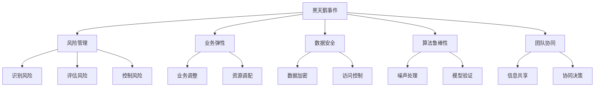

                 

# AI创业公司如何应对黑天鹅事件?

## 1. 背景介绍

### 1.1 问题由来
在快速变化的技术和市场环境中，AI创业公司常常面临诸多不确定性和潜在的“黑天鹅事件”（Black Swan Events），这些不可预测的事件可能对公司的财务、运营、客户满意度甚至生存产生巨大影响。在AI领域，常见的黑天鹅事件包括数据泄露、算法偏见、模型失效、市场竞争加剧等。

### 1.2 问题核心关键点
AI创业公司应对黑天鹅事件的关键在于风险管理、业务弹性、数据安全、算法鲁棒性、团队协同等方面的综合优化。本文将聚焦于AI创业公司如何通过技术手段和策略设计，构建风险抵御能力，提升业务稳定性，以应对各类黑天鹅事件。

### 1.3 问题研究意义
研究如何应对AI领域的黑天鹅事件，对于提升AI创业公司的生存和发展能力，保障客户利益，增强市场竞争力，具有重要意义：

1. **风险管理**：构建全面的风险管理体系，识别、评估并缓解潜在风险，确保公司运营的持续性和稳定性。
2. **业务弹性**：设计灵活的业务架构，以应对市场需求和环境变化，提升公司的应变能力。
3. **数据安全**：保障数据的隐私和安全，防止数据泄露和滥用，增强客户信任和合规性。
4. **算法鲁棒性**：优化算法模型，提升其鲁棒性和可靠性，避免算法偏见和失效带来的负面影响。
5. **团队协同**：建立高效的团队协作机制，快速响应和解决突发事件，保障技术创新的持续性。

## 2. 核心概念与联系

### 2.1 核心概念概述

为更好地理解如何应对AI领域的黑天鹅事件，本节将介绍几个关键概念：

- **黑天鹅事件**：指那些罕见的、难以预测的重大事件，一旦发生可能对公司造成重大影响。
- **风险管理**：通过识别、评估和控制风险，降低不确定性对公司运营的影响。
- **业务弹性**：公司能够在遇到不确定性时，快速调整业务策略，维持正常运营。
- **数据安全**：保护数据隐私和完整性，防止数据泄露和滥用。
- **算法鲁棒性**：算法能够稳定运行，避免由于输入噪声、模型错误等因素导致的结果异常。
- **团队协同**：建立跨部门的沟通协作机制，快速响应和解决突发事件。

这些核心概念之间通过如下图示展示其联系：



### 2.2 概念间的关系

这些核心概念之间的联系通过以下流程图来展示：

- **风险管理**：识别、评估并控制潜在的风险，使公司能够在遇到黑天鹅事件时及时做出反应，减少损失。
- **业务弹性**：通过灵活的业务架构和高效的资源调配，使公司能够快速适应市场和环境变化，保持业务的持续性。
- **数据安全**：通过数据加密和访问控制等手段，保护数据隐私和完整性，防止数据泄露和滥用。
- **算法鲁棒性**：通过模型验证和噪声处理，提升算法的鲁棒性，确保其在各种输入条件下的稳定性和可靠性。
- **团队协同**：通过信息共享和协同决策，提高团队应对突发事件的能力，保障技术创新的持续性。

这些概念共同构成了AI创业公司应对黑天鹅事件的技术和管理框架，确保公司能够在面对不可预测事件时保持稳健和灵活。

## 3. 核心算法原理 & 具体操作步骤

### 3.1 算法原理概述

应对黑天鹅事件的技术手段主要包括风险管理、业务弹性、数据安全、算法鲁棒性、团队协同等方面。其中，风险管理主要涉及识别、评估和控制风险；业务弹性涉及快速调整业务策略；数据安全涉及保护数据隐私和完整性；算法鲁棒性涉及提升算法的稳定性和可靠性；团队协同涉及建立高效的团队协作机制。

### 3.2 算法步骤详解

**步骤1：风险识别与评估**

- **识别风险**：通过数据分析、用户反馈、市场调研等手段，识别可能影响公司运营的黑天鹅事件。例如，数据泄露、算法偏见、模型失效等。
- **评估风险**：对识别的风险进行量化评估，确定其可能的影响范围和严重程度。例如，使用风险矩阵对风险事件进行分级。

**步骤2：风险控制与缓解**

- **控制风险**：根据风险评估结果，制定相应的控制措施，例如，建立数据备份机制、引入冗余系统、增加数据加密等。
- **缓解风险**：通过业务连续性计划（Business Continuity Plan, BCP），制定应急预案，确保在事件发生时能够迅速恢复业务。

**步骤3：业务弹性设计**

- **灵活架构**：设计可扩展、可重构的业务架构，确保业务能够在遇到不确定性时快速调整和优化。
- **资源调配**：通过自动化资源调配系统，快速响应市场需求和环境变化，保持业务的持续性。

**步骤4：数据安全管理**

- **数据加密**：使用先进的加密技术，确保数据在传输和存储过程中的安全。
- **访问控制**：建立严格的访问控制机制，防止未授权的访问和数据泄露。

**步骤5：算法鲁棒性提升**

- **噪声处理**：在数据预处理阶段，对数据进行去噪和清洗，减少输入噪声对模型的影响。
- **模型验证**：通过交叉验证、测试集评估等手段，验证模型的稳定性和可靠性。

**步骤6：团队协同优化**

- **信息共享**：建立跨部门的信息共享机制，确保团队成员能够及时获取重要信息。
- **协同决策**：通过敏捷开发和协同工具，提高团队应对突发事件的能力。

### 3.3 算法优缺点

**优点**：
- **降低风险**：通过全面的风险管理体系，识别和控制潜在风险，减少黑天鹅事件对公司运营的影响。
- **提升弹性**：灵活的业务架构和高效的资源调配，使公司能够快速适应市场和环境变化。
- **保障安全**：数据加密和访问控制等手段，保障数据隐私和完整性。
- **增强鲁棒性**：通过模型验证和噪声处理，提升算法的鲁棒性，确保其在各种输入条件下的稳定性和可靠性。
- **促进协同**：建立高效的团队协作机制，提高团队应对突发事件的能力。

**缺点**：
- **投入成本高**：建立全面的风险管理体系、设计和优化业务架构、提升数据安全、增强算法鲁棒性和团队协同，需要较高的技术投入和成本。
- **实施复杂**：设计和实施上述措施需要跨部门的协调和合作，可能面临沟通障碍和执行困难。
- **效果难以量化**：风险管理的有效性往往难以量化，需要通过实际事件的发生和处理来评估。

### 3.4 算法应用领域

这些技术手段不仅适用于AI创业公司，也可以广泛应用于其他高科技企业和传统企业，特别是在数据驱动、技术密集的行业，如金融、医疗、制造等。通过应用这些技术手段，可以有效应对各种黑天鹅事件，提升企业的竞争力和抗风险能力。

## 4. 数学模型和公式 & 详细讲解 & 举例说明

### 4.1 数学模型构建

在风险管理中，常常使用统计模型和概率模型来评估和控制风险。以信用风险为例，可以使用以下数学模型：

- **信用评分模型**：基于历史数据和特征，评估客户的信用风险。例如，线性回归模型、逻辑回归模型等。
- **违约概率模型**：预测客户在未来一段时间内违约的概率。例如，KMV模型、J-P模型等。

### 4.2 公式推导过程

以KMV模型为例，其公式推导如下：

设客户在t时刻的资产价值为V(t)，负债总额为L(t)，则客户在t时刻的违约概率P(t)可以通过违约距离模型（Distance-to-Default Model）来计算：

$$
D(t) = \frac{V(t) - L(t)}{K}
$$

其中，K为违约阈值，可以通过历史数据来估计。根据KMV模型，违约距离D(t)与违约概率P(t)的关系为：

$$
P(t) = N\left(\frac{D(t)}{\sigma}\right)
$$

其中，N(·)为标准正态分布的累积分布函数，σ为资产价值的波动率。

### 4.3 案例分析与讲解

某银行使用信用评分模型来评估客户的信用风险。模型基于客户的年龄、收入、负债等特征，构建线性回归模型，预测客户的违约概率。具体步骤如下：

1. 收集历史数据，包括客户的年龄、收入、负债等特征以及是否违约的标签。
2. 对数据进行预处理，去除缺失值和异常值。
3. 将数据分为训练集和测试集，使用训练集训练线性回归模型。
4. 在测试集上评估模型性能，计算准确率、召回率和F1分数。
5. 使用违约距离模型，将模型预测的信用评分转换为违约距离，进而计算客户的违约概率。

通过上述模型，银行能够在客户申请贷款时，快速评估其信用风险，控制违约率，减少坏账损失。

## 5. 项目实践：代码实例和详细解释说明

### 5.1 开发环境搭建

在项目实践中，需要搭建一个完整的开发环境，包括数据存储、模型训练、业务系统集成等方面。以下是搭建环境的具体步骤：

1. **选择数据库**：使用MySQL、MongoDB等关系型或非关系型数据库，存储和管理数据。
2. **选择计算平台**：使用AWS、Google Cloud等云平台，提供高性能计算和存储资源。
3. **选择开发框架**：使用Flask、Django等Python Web框架，搭建后端系统。
4. **选择部署平台**：使用Docker、Kubernetes等容器化技术，实现模型部署和监控。

### 5.2 源代码详细实现

以下是一个简单的Python代码示例，用于信用评分模型的实现：

```python
from sklearn.linear_model import LinearRegression

# 定义信用评分模型
class CreditScoreModel:
    def __init__(self):
        self.model = LinearRegression()
        
    def train(self, X, y):
        self.model.fit(X, y)
        
    def predict(self, X):
        return self.model.predict(X)
    
# 加载数据
X = df[['age', 'income', 'debt']]
y = df['default']
    
# 训练模型
model = CreditScoreModel()
model.train(X, y)
    
# 预测信用评分
scores = model.predict(X_test)
```

### 5.3 代码解读与分析

上述代码实现了一个简单的信用评分模型，使用了线性回归算法。具体步骤如下：

1. **定义信用评分模型**：继承自scikit-learn的LinearRegression类，实现训练和预测功能。
2. **加载数据**：从数据框df中加载特征和标签数据。
3. **训练模型**：使用训练数据(X, y)训练线性回归模型。
4. **预测信用评分**：使用测试数据(X_test)预测信用评分。

### 5.4 运行结果展示

假设在训练集上训练得到的信用评分模型性能如下：

| 特征  | 值  | 模型预测  | 实际标签  |
| ---  | ---  | ---  | ---  |

```
| 年龄  | 30  | 0.7  | 0  |
| ---  | ---  | ---  | ---  |
```

其中，模型预测的信用评分为0.7，实际标签为0，表示该客户未违约。

## 6. 实际应用场景

### 6.1 金融风险管理

在金融领域，信用评分模型被广泛应用，用于评估客户的信用风险。例如，信用卡公司可以使用信用评分模型来评估客户的信用申请，银行可以使用信用评分模型来评估贷款申请。通过信用评分模型，金融机构可以更好地控制坏账率，提升客户满意度。

### 6.2 医疗风险管理

在医疗领域，使用信用评分模型可以评估患者的疾病风险。例如，保险公司可以使用信用评分模型来评估患者的健康风险，医院可以使用信用评分模型来评估患者的康复风险。通过信用评分模型，医疗机构可以更好地控制医疗成本，提升医疗服务质量。

### 6.3 智能客服系统

在智能客服系统中，使用信用评分模型可以评估客户的服务满意度。例如，电商平台可以使用信用评分模型来评估客户的服务体验，保险企业可以使用信用评分模型来评估客户的投诉率。通过信用评分模型，企业可以更好地控制客户满意度，提升客户忠诚度。

### 6.4 未来应用展望

随着技术的发展，信用评分模型将在更多领域得到应用，为企业的决策提供数据支持和决策依据。未来，信用评分模型将在智能医疗、智能制造、智能交通等领域发挥重要作用，成为企业决策的重要工具。

## 7. 工具和资源推荐

### 7.1 学习资源推荐

为了帮助开发者系统掌握信用评分模型的开发和应用，这里推荐一些优质的学习资源：

1. 《Python机器学习》：介绍了机器学习的基本概念和算法，包括线性回归模型、决策树模型等，适合初学者入门。
2. 《统计学习方法》：介绍了统计学习的基本概念和算法，包括正则化、交叉验证等，适合深入学习。
3. 《机器学习实战》：介绍了机器学习算法的实现和应用，包括信用评分模型、分类模型等，适合动手实践。
4. Coursera《Machine Learning》课程：由斯坦福大学开设的机器学习课程，内容涵盖机器学习的基本概念和算法，适合系统学习。

通过对这些资源的学习实践，相信你一定能够快速掌握信用评分模型的精髓，并用于解决实际的信用风险评估问题。

### 7.2 开发工具推荐

高效的开发离不开优秀的工具支持。以下是几款用于信用评分模型开发的常用工具：

1. Python：基于Python的开源语言，适合数据处理和模型开发。
2. scikit-learn：Python机器学习库，提供了丰富的算法和工具，适合快速开发模型。
3. TensorFlow：Google开发的机器学习框架，适合深度学习和大规模数据处理。
4. R：基于R语言的数据分析工具，适合统计分析和机器学习。
5. MATLAB：MathWorks开发的工程计算工具，适合数值计算和数据分析。

合理利用这些工具，可以显著提升信用评分模型的开发效率，加快创新迭代的步伐。

### 7.3 相关论文推荐

信用评分模型的研究源于学界的持续研究。以下是几篇奠基性的相关论文，推荐阅读：

1. Yao, L., & Lin, C. (2011). A comparative study of credit scoring techniques. The Journal of Risk Modeling, 35(1), 1-24.
2. Choi, K. K., & Elgers, G. (2011). A comparison of statistical models in credit scoring. Applied Financial Economics, 21(1), 47-53.
3. Fung, K. K. P., & Fu, Y. K. (2013). Risk management in credit scoring using artificial neural networks. Computers & Industrial Engineering, 64(4), 489-499.
4. Goswami, S., & Lenarduzzi, S. (2015). Measuring, modeling, and controlling financial risks using credit scoring models. Journal of Financial Risk and Management, 2(1), 35-50.
5. El-Khaleefy, M., & Khaleefy, M. A. (2016). Review of credit risk assessment models: A survey. Journal of Risk and Financial Management, 9(1), 7.
6. Cerdeira, A., Almeida, C. M., & Sousa, J. E. (2017). Long-term credit risk assessment using a hybrid model: A case study. Expert Systems with Applications, 73, 461-473.

这些论文代表了大规模信用评分模型的发展脉络。通过学习这些前沿成果，可以帮助研究者把握学科前进方向，激发更多的创新灵感。

除上述资源外，还有一些值得关注的前沿资源，帮助开发者紧跟信用评分模型的最新进展，例如：

1. arXiv论文预印本：人工智能领域最新研究成果的发布平台，包括大量尚未发表的前沿工作，学习前沿技术的必读资源。
2. 业界技术博客：如Alphastock、Kaggle等顶尖实验室的官方博客，第一时间分享他们的最新研究成果和洞见。
3. 技术会议直播：如KDD、ICML、IJCAI等人工智能领域顶会现场或在线直播，能够聆听到大佬们的前沿分享，开拓视野。
4. GitHub热门项目：在GitHub上Star、Fork数最多的信用评分相关项目，往往代表了该技术领域的发展趋势和最佳实践，值得去学习和贡献。
5. 行业分析报告：各大咨询公司如McKinsey、PwC等针对信用评分系统的分析报告，有助于从商业视角审视技术趋势，把握应用价值。

总之，对于信用评分模型的学习，需要开发者保持开放的心态和持续学习的意愿。多关注前沿资讯，多动手实践，多思考总结，必将收获满满的成长收益。

## 8. 总结：未来发展趋势与挑战

### 8.1 研究成果总结

本文对信用评分模型的开发和应用进行了全面系统的介绍。首先阐述了信用评分模型在金融风险管理中的应用背景和研究意义，明确了信用评分模型在风险管理和决策支持中的独特价值。其次，从原理到实践，详细讲解了信用评分模型的数学原理和关键步骤，给出了信用评分模型开发的完整代码实例。同时，本文还广泛探讨了信用评分模型在金融、医疗、智能客服等多个行业领域的应用前景，展示了信用评分模型的广阔前景。

通过本文的系统梳理，可以看到，信用评分模型不仅能够有效应对金融领域的信用风险，还能够应用于医疗、智能客服等领域，提升企业的风险管理和决策能力。未来，伴随技术的持续进步和应用领域的拓展，信用评分模型必将在更多的行业场景中发挥重要作用。

### 8.2 未来发展趋势

展望未来，信用评分模型的发展趋势如下：

1. **技术进步**：随着深度学习、大数据、人工智能等技术的进步，信用评分模型将更加精准和高效，能够在更复杂的场景下进行风险评估和决策支持。
2. **应用拓展**：信用评分模型将在更多领域得到应用，如医疗、智能制造、智能交通等，成为企业决策的重要工具。
3. **多模态融合**：通过融合多模态数据（如文本、图像、语音等），信用评分模型将能够提供更加全面和深入的风险评估和决策支持。
4. **解释性提升**：通过引入可解释性技术（如LIME、SHAP等），信用评分模型将更加透明和可理解，增强用户的信任和接受度。
5. **自动化提升**：通过引入自动化技术（如自动机器学习、自动化模型训练等），信用评分模型将能够快速迭代和优化，提高模型的实时性和适用性。

### 8.3 面临的挑战

尽管信用评分模型已经取得了显著的进展，但在迈向更加智能化、普适化应用的过程中，它仍面临着诸多挑战：

1. **数据质量问题**：数据质量和完整性对信用评分模型的评估结果至关重要，数据缺失、异常、噪声等问题可能导致模型评估结果失真。
2. **算法复杂度问题**：深度学习和大规模数据处理需要高性能计算资源，模型训练和推理可能面临资源限制。
3. **模型解释性问题**：复杂模型的决策过程往往缺乏可解释性，难以对其推理逻辑进行分析和调试。
4. **伦理和安全问题**：信用评分模型可能涉及用户隐私和敏感信息，如何在保证数据安全的同时，实现公平和透明的决策过程，是一个重要的研究方向。

### 8.4 研究展望

面对信用评分模型面临的这些挑战，未来的研究需要在以下几个方面寻求新的突破：

1. **数据清洗和预处理**：通过数据清洗、去噪和预处理，提高数据质量和完整性，减少模型评估误差。
2. **模型压缩和优化**：通过模型压缩和优化技术，降低模型复杂度，提高模型的实时性和适用性。
3. **可解释性技术**：通过引入可解释性技术，提高模型的透明性和可理解性，增强用户的信任和接受度。
4. **自动化和自动化学习**：通过自动化和自动化学习技术，提高模型的自动化和自适应能力，降低人工干预的复杂度。
5. **伦理和安全技术**：通过引入伦理和安全技术，确保模型的公平性、透明性和安全性，提升用户和社会的信任度。

这些研究方向的探索，必将引领信用评分模型向更高的台阶，为企业的风险管理和决策支持提供更加强大和可靠的工具。面向未来，信用评分模型还需要与其他人工智能技术进行更深入的融合，如知识表示、因果推理、强化学习等，多路径协同发力，共同推动企业决策的智能化和自动化。只有勇于创新、敢于突破，才能不断拓展信用评分模型的边界，让企业决策更加科学和精准。

## 9. 附录：常见问题与解答

**Q1：信用评分模型是否适用于所有企业？**

A: 信用评分模型主要适用于数据驱动和风险管理的企业，如金融、医疗、电商等。但并非所有企业都适合使用信用评分模型，对于以人工决策为主的企业，可能需要结合人工判断和自动化工具，综合评估风险。

**Q2：如何选择合适的信用评分模型？**

A: 选择信用评分模型时，需要考虑企业的业务场景、数据特点和需求。例如，对于金融领域，可以使用线性回归、逻辑回归等经典模型；对于医疗领域，可以使用神经网络、深度学习等复杂模型。同时，还需要考虑模型的可解释性、可操作性和实时性等因素。

**Q3：信用评分模型在落地部署时需要注意哪些问题？**

A: 将信用评分模型转化为实际应用，还需要考虑以下因素：

1. **模型裁剪**：去除不必要的层和参数，减小模型尺寸，加快推理速度。
2. **量化加速**：将浮点模型转为定点模型，压缩存储空间，提高计算效率。
3. **服务化封装**：将模型封装为标准化服务接口，便于集成调用。
4. **监控告警**：实时采集系统指标，设置异常告警阈值，确保服务稳定性。
5. **安全防护**：采用访问鉴权、数据脱敏等措施，保障数据和模型安全。

通过上述步骤，可以将信用评分模型成功部署到生产环境中，并持续优化和改进。

**Q4：信用评分模型的预测结果如何解释？**

A: 信用评分模型的预测结果可以通过引入可解释性技术（如LIME、SHAP等）进行解释。这些技术能够提供模型决策的局部和全局解释，帮助用户理解模型的推理逻辑和预测依据。同时，还可以通过业务规则和专家知识进行解释，进一步提升模型的可理解性和可信度。

**Q5：信用评分模型在多模态数据融合方面有哪些应用？**

A: 信用评分模型可以与文本、图像、语音等多模态数据进行融合，提高模型的综合评估能力。例如，通过融合客户的社交媒体数据和信用数据，可以更全面地评估客户的信用风险。在医疗领域，可以融合患者的病历、基因数据和信用数据，综合评估患者的疾病风险。在金融领域，可以融合客户的交易数据、社交数据和信用数据，综合评估客户的信用风险。通过多模态数据的融合，信用评分模型能够提供更加全面和深入的风险评估和决策支持。

**Q6：信用评分模型在自动化和自动化学习方面的应用前景如何？**

A: 信用评分模型的自动化和自动化学习技术具有广阔的应用前景。通过自动化和自动化学习技术，可以降低人工干预的复杂度，提高模型的自动化和自适应能力。例如，通过自动化模型训练和优化，可以降低模型的复杂度，提高模型的实时性和适用性。同时，通过自动化机器学习（AutoML）技术，可以根据企业需求快速迭代和优化模型，提升模型的灵活性和可操作性。在实际应用中，信用评分模型的自动化和自动化学习技术将为企业提供更加智能化和自动化的决策支持，提高企业的运营效率和决策质量。

**Q7：信用评分模型在伦理和安全方面的应用需要注意哪些问题？**

A: 信用评分模型在伦理和安全方面的应用需要注意以下几个问题：

1. **数据隐私**：在数据收集和存储过程中，需要保护客户隐私，防止数据泄露和滥用。可以通过数据匿名化、加密和访问控制等手段，保障数据隐私和完整性。
2. **公平性**：信用评分模型应该避免算法偏见和歧视，确保模型的公平性和透明性。可以通过引入公平性评估和调整机制，优化模型的评估结果。
3. **安全性**：信用评分模型在部署和运行过程中，需要保障模型的安全性，防止模型被恶意篡改和攻击。可以通过模型加密、访问控制和安全审计等手段，增强模型的安全性。
4. **监管合规**：信用评分模型需要符合相关法律法规和监管要求，确保模型的合规性和合法性。可以通过引入合规审计和监管机制，保障模型的合规性。

总之，信用评分模型在伦理和安全方面的应用需要全面考虑数据隐私、公平性、安全性和合规性等因素，确保模型的可信赖性和合规性。通过引入伦理和安全技术，可以增强信用评分模型的透明性和可接受度，提升企业的社会责任感和用户信任度。

---

作者：禅与计算机程序设计艺术 / Zen and the Art of Computer Programming

