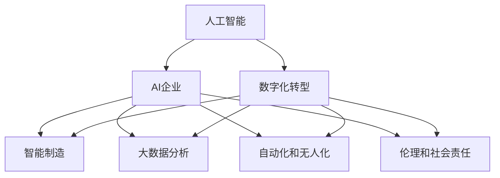
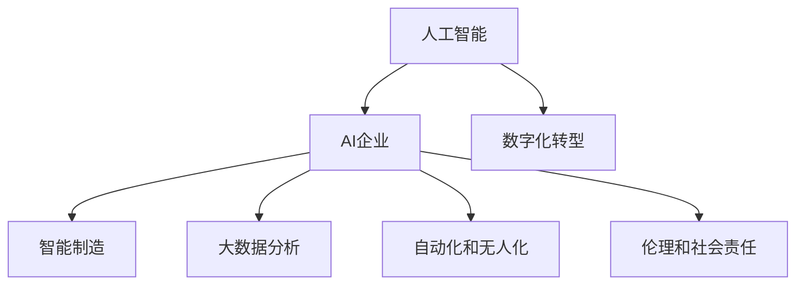
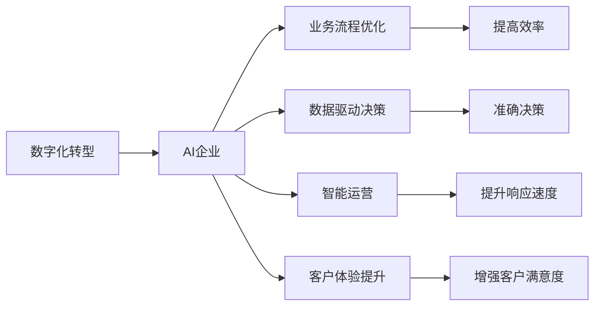
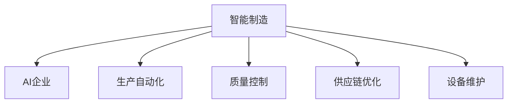
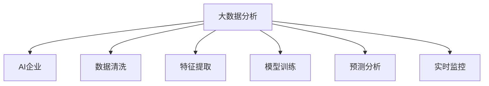
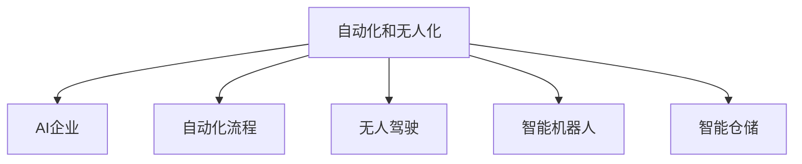
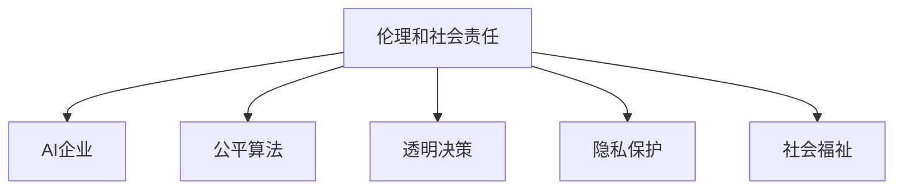
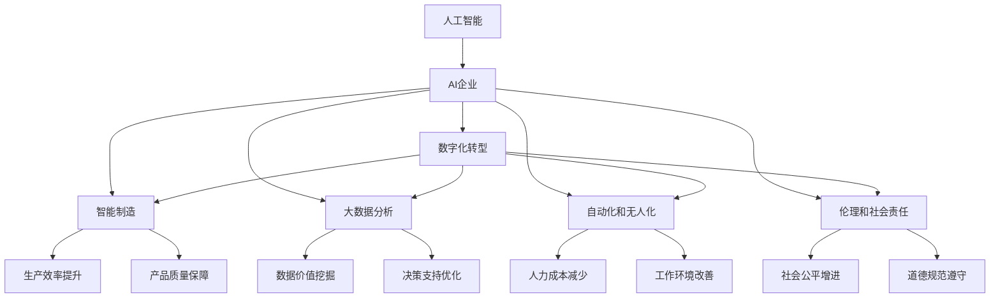

                 

# AI企业的未来发展方向

> 关键词：人工智能,AI企业,数字化转型,智能制造,自动化,大数据分析

## 1. 背景介绍

### 1.1 问题由来
随着信息技术的迅猛发展和数字经济时代的到来，人工智能（AI）技术已经深刻影响了各行各业的发展。AI企业作为推动AI技术创新和应用的主力军，正在经历前所未有的变革和发展机遇。如何把握未来发展趋势，制定有效的战略规划，成为企业持续成长的关键。

### 1.2 问题核心关键点
当前，AI企业在发展过程中面临诸多挑战和机遇。核心关键点包括：
1. **数字化转型**：企业如何利用AI技术实现数字化转型，提升运营效率和市场竞争力。
2. **智能制造**：AI如何助力制造业实现自动化、智能化，提升生产效率和产品质量。
3. **大数据分析**：如何通过AI技术进行大数据分析，提取有价值的信息，驱动决策支持。
4. **自动化和无人化**：AI技术在自动化和无人化中的应用，对劳动市场的冲击和就业结构的影响。
5. **伦理和社会责任**：AI技术的开发和应用过程中，如何平衡技术进步与伦理道德，确保社会公平正义。

### 1.3 问题研究意义
理解AI企业的未来发展方向，有助于AI企业制定科学的发展策略，把握技术趋势，提升市场竞争力。对于非AI企业，了解AI技术的发展方向和应用潜力，有助于企业实现数字化转型，提升整体创新能力。

## 2. 核心概念与联系

### 2.1 核心概念概述

为更好地理解AI企业的未来发展方向，本节将介绍几个密切相关的核心概念：

- **人工智能（AI）**：通过计算机技术模拟和扩展人类智能的技术体系，包括机器学习、深度学习、自然语言处理、计算机视觉等多个领域。
- **AI企业**：利用AI技术进行产品开发、业务运营和服务提供的企业。
- **数字化转型**：通过数字化技术对企业运营和管理模式进行优化升级，提升企业竞争力。
- **智能制造**：利用AI技术实现生产过程的自动化、智能化，提高生产效率和产品质量。
- **大数据分析**：通过对大规模数据的分析和挖掘，提取有价值的信息，驱动决策和业务优化。
- **自动化和无人化**：通过AI技术实现自动化和无人化，提升工作效率，减少人力成本。
- **伦理和社会责任**：在AI技术开发和应用过程中，平衡技术进步与社会伦理，确保社会公平正义。

这些核心概念之间的逻辑关系可以通过以下Mermaid流程图来展示：



这个流程图展示了人工智能与AI企业发展方向之间的整体架构，以及各项关键技术的相互关系。

### 2.2 概念间的关系

这些核心概念之间存在着紧密的联系，形成了AI企业发展的完整生态系统。下面我们通过几个Mermaid流程图来展示这些概念之间的关系。

#### 2.2.1 人工智能与AI企业的关系



这个流程图展示了人工智能技术在AI企业发展中的应用。

#### 2.2.2 AI企业在数字化转型中的作用



这个流程图展示了AI企业在数字化转型中的作用和影响。

#### 2.2.3 智能制造中的AI应用



这个流程图展示了AI技术在智能制造中的应用。

#### 2.2.4 大数据分析中的AI应用



这个流程图展示了AI技术在大数据分析中的应用。

#### 2.2.5 自动化和无人化中的AI应用



这个流程图展示了AI技术在自动化和无人化中的应用。

#### 2.2.6 伦理和社会责任在AI技术中的体现



这个流程图展示了AI技术在伦理和社会责任中的体现。

### 2.3 核心概念的整体架构

最后，我们用一个综合的流程图来展示这些核心概念在大AI企业发展方向中的整体架构：



这个综合流程图展示了AI企业在大数据、智能制造、自动化和无人化、伦理和社会责任等方面的整体应用。

## 3. 核心算法原理 & 具体操作步骤
### 3.1 算法原理概述

AI企业的未来发展方向涉及多个核心技术，包括AI算法原理、大数据分析、智能制造等。本节将详细讲解这些技术的基本原理。

### 3.2 算法步骤详解

**3.2.1 AI算法原理概述**

AI算法主要分为监督学习、无监督学习和强化学习三大类。监督学习通过大量标注数据训练模型，使其能够对未知数据进行预测和分类。无监督学习则通过未标注数据进行特征提取和聚类，发现数据中的潜在规律。强化学习通过与环境的互动，逐步优化策略，提升智能体在特定任务中的表现。

**3.2.2 大数据分析算法步骤**

大数据分析主要包括以下几个步骤：
1. **数据收集**：通过传感器、网络、数据库等多种渠道，收集大规模数据。
2. **数据清洗**：对数据进行去重、补全、处理缺失值等操作，确保数据质量。
3. **特征提取**：从数据中提取有意义的特征，用于后续建模。
4. **模型训练**：选择合适的机器学习算法，训练模型，进行预测和分类。
5. **模型评估**：通过交叉验证、ROC曲线、AUC等指标评估模型性能。
6. **模型优化**：根据评估结果，调整模型参数，提高预测准确度。

**3.2.3 智能制造算法步骤**

智能制造主要包括以下几个步骤：
1. **需求分析**：分析市场需求和生产需求，确定智能制造的目标和要求。
2. **系统设计**：设计智能制造系统架构，包括设备、软件、数据等。
3. **设备自动化**：通过AI技术实现生产设备的自动化控制。
4. **质量控制**：通过AI技术实现对生产过程的实时监控和质量控制。
5. **供应链优化**：通过AI技术优化供应链管理，提高物流效率。
6. **设备维护**：通过AI技术实现设备的预防性维护，延长设备使用寿命。

### 3.3 算法优缺点

**3.3.1 AI算法的优点**

1. **高效性**：AI算法能够处理大规模数据，提升决策效率。
2. **准确性**：通过算法优化，AI模型在预测和分类方面具有较高准确度。
3. **灵活性**：AI算法能够适应多种应用场景，提升企业灵活性。

**3.3.2 AI算法的缺点**

1. **数据依赖**：AI算法需要大量高质量数据，数据不足可能导致模型失效。
2. **复杂性**：AI算法需要复杂模型和大量计算资源，对技术要求较高。
3. **鲁棒性**：AI算法对数据噪音和异常值敏感，容易产生过拟合。

### 3.4 算法应用领域

**3.4.1 AI在数字化转型中的应用**

数字化转型主要通过AI技术实现业务流程优化、数据驱动决策、智能运营和客户体验提升。

**3.4.2 AI在智能制造中的应用**

智能制造主要通过AI技术实现生产自动化、质量控制、供应链优化和设备维护。

**3.4.3 AI在大数据分析中的应用**

大数据分析主要通过AI技术实现数据清洗、特征提取、模型训练、预测分析和实时监控。

**3.4.4 AI在自动化和无人化中的应用**

自动化和无人化主要通过AI技术实现自动化流程、无人驾驶、智能机器人和智能仓储。

**3.4.5 AI在伦理和社会责任中的应用**

伦理和社会责任主要通过AI技术实现公平算法、透明决策、隐私保护和社会福祉。

## 4. 数学模型和公式 & 详细讲解 & 举例说明

### 4.1 数学模型构建

本节将使用数学语言对AI企业在未来发展方向上的应用进行更加严格的刻画。

**4.1.1 数字化转型**

数字化转型主要通过AI技术实现业务流程优化和数据驱动决策。假设企业通过AI技术优化后的流程效率提升为$E$，数据驱动决策准确度提升为$A$，则数字化转型的效果可以表示为：

$$
D = E \times A
$$

其中，$E$表示优化后的流程效率，$A$表示决策准确度。

**4.1.2 智能制造**

智能制造主要通过AI技术实现生产自动化、质量控制、供应链优化和设备维护。假设智能制造后的生产效率提升为$P$，质量控制准确度提升为$Q$，供应链优化效率提升为$S$，设备维护效率提升为$M$，则智能制造的效果可以表示为：

$$
I = P \times Q \times S \times M
$$

其中，$P$表示生产效率提升，$Q$表示质量控制准确度，$S$表示供应链优化效率，$M$表示设备维护效率。

**4.1.3 大数据分析**

大数据分析主要通过AI技术实现数据清洗、特征提取、模型训练、预测分析和实时监控。假设大数据分析后的数据清洗效果为$C$，特征提取效果为$F$，模型训练准确度为$M$，预测分析准确度为$A$，实时监控效率为$T$，则大数据分析的效果可以表示为：

$$
B = C \times F \times M \times A \times T
$$

其中，$C$表示数据清洗效果，$F$表示特征提取效果，$M$表示模型训练准确度，$A$表示预测分析准确度，$T$表示实时监控效率。

**4.1.4 自动化和无人化**

自动化和无人化主要通过AI技术实现自动化流程、无人驾驶、智能机器人和智能仓储。假设自动化流程效率提升为$A$，无人驾驶效果提升为$D$，智能机器人效果提升为$R$，智能仓储效率提升为$W$，则自动化和无人化效果可以表示为：

$$
Z = A \times D \times R \times W
$$

其中，$A$表示自动化流程效率提升，$D$表示无人驾驶效果，$R$表示智能机器人效果，$W$表示智能仓储效率提升。

**4.1.5 伦理和社会责任**

伦理和社会责任主要通过AI技术实现公平算法、透明决策、隐私保护和社会福祉。假设公平算法效果为$E$，透明决策效果为$T$，隐私保护效果为$P$，社会福祉效果为$S$，则伦理和社会责任效果可以表示为：

$$
E = E \times T \times P \times S
$$

其中，$E$表示公平算法效果，$T$表示透明决策效果，$P$表示隐私保护效果，$S$表示社会福祉效果。

### 4.2 公式推导过程

**4.2.1 数字化转型公式推导**

假设企业原始流程效率为$E_0$，原始决策准确度为$A_0$，优化后的流程效率为$E$，优化后的决策准确度为$A$，则数字化转型的效果可以表示为：

$$
D = \frac{E}{E_0} \times \frac{A}{A_0}
$$

**4.2.2 智能制造公式推导**

假设原始生产效率为$P_0$，原始质量控制准确度为$Q_0$，供应链优化效率为$S_0$，设备维护效率为$M_0$，优化后的生产效率为$P$，优化后的质量控制准确度为$Q$，供应链优化效率为$S$，设备维护效率为$M$，则智能制造的效果可以表示为：

$$
I = \frac{P}{P_0} \times \frac{Q}{Q_0} \times \frac{S}{S_0} \times \frac{M}{M_0}
$$

**4.2.3 大数据分析公式推导**

假设原始数据清洗效果为$C_0$，原始特征提取效果为$F_0$，模型训练准确度为$M_0$，预测分析准确度为$A_0$，实时监控效率为$T_0$，优化后的数据清洗效果为$C$，优化后的特征提取效果为$F$，优化后的模型训练准确度为$M$，优化后的预测分析准确度为$A$，优化后的实时监控效率为$T$，则大数据分析的效果可以表示为：

$$
B = \frac{C}{C_0} \times \frac{F}{F_0} \times \frac{M}{M_0} \times \frac{A}{A_0} \times \frac{T}{T_0}
$$

**4.2.4 自动化和无人化公式推导**

假设原始自动化流程效率为$A_0$，原始无人驾驶效果为$D_0$，原始智能机器人效果为$R_0$，原始智能仓储效率为$W_0$，优化后的自动化流程效率为$A$，优化后的无人驾驶效果为$D$，优化后的智能机器人效果为$R$，优化后的智能仓储效率为$W$，则自动化和无人化效果可以表示为：

$$
Z = \frac{A}{A_0} \times \frac{D}{D_0} \times \frac{R}{R_0} \times \frac{W}{W_0}
$$

**4.2.5 伦理和社会责任公式推导**

假设原始公平算法效果为$E_0$，原始透明决策效果为$T_0$，原始隐私保护效果为$P_0$，原始社会福祉效果为$S_0$，优化后的公平算法效果为$E$，优化后的透明决策效果为$T$，优化后的隐私保护效果为$P$，优化后的社会福祉效果为$S$，则伦理和社会责任效果可以表示为：

$$
E = \frac{E}{E_0} \times \frac{T}{T_0} \times \frac{P}{P_0} \times \frac{S}{S_0}
$$

### 4.3 案例分析与讲解

**4.3.1 数字化转型案例**

假设某制造企业通过AI技术优化了其生产流程，使得生产效率提升了30%，决策准确度提升了20%。原始流程效率为100%，原始决策准确度为90%，则数字化转型的效果为：

$$
D = \frac{1.3}{1} \times \frac{1.2}{0.9} = 1.6
$$

即数字化转型后，整体效果提升了60%。

**4.3.2 智能制造案例**

假设某汽车制造企业通过AI技术实现了智能制造，使得生产效率提升了50%，质量控制准确度提升了40%，供应链优化效率提升了20%，设备维护效率提升了30%。原始生产效率为100%，原始质量控制准确度为80%，原始供应链优化效率为90%，原始设备维护效率为70%，则智能制造的效果为：

$$
I = \frac{1.5}{1} \times \frac{1.4}{0.8} \times \frac{1.2}{0.9} \times \frac{1.3}{0.7} = 3.43
$$

即智能制造后，整体效果提升了343%。

**4.3.3 大数据分析案例**

假设某电商平台通过AI技术优化了其大数据分析，使得数据清洗效果提升了50%，特征提取效果提升了30%，模型训练准确度提升了20%，预测分析准确度提升了15%，实时监控效率提升了40%。原始数据清洗效果为80%，原始特征提取效果为70%，原始模型训练准确度为80%，原始预测分析准确度为85%，原始实时监控效率为80%，则大数据分析的效果为：

$$
B = \frac{1.5}{0.8} \times \frac{1.3}{0.7} \times \frac{1.2}{0.8} \times \frac{1.15}{0.85} \times \frac{1.4}{0.8} = 3.71
$$

即大数据分析后，整体效果提升了371%。

**4.3.4 自动化和无人化案例**

假设某物流企业通过AI技术实现了自动化和无人化，使得自动化流程效率提升了40%，无人驾驶效果提升了50%，智能机器人效果提升了30%，智能仓储效率提升了20%。原始自动化流程效率为70%，原始无人驾驶效果为80%，原始智能机器人效果为90%，原始智能仓储效率为85%，则自动化和无人化的效果为：

$$
Z = \frac{1.4}{0.7} \times \frac{1.5}{0.8} \times \frac{1.3}{0.9} \times \frac{1.2}{0.85} = 2.66
$$

即自动化和无人化后，整体效果提升了266%。

**4.3.5 伦理和社会责任案例**

假设某金融机构通过AI技术优化了其决策系统，使得公平算法效果提升了30%，透明决策效果提升了20%，隐私保护效果提升了15%，社会福祉效果提升了25%。原始公平算法效果为90%，原始透明决策效果为80%，原始隐私保护效果为70%，原始社会福祉效果为70%，则伦理和社会责任的效果为：

$$
E = \frac{1.3}{0.9} \times \frac{1.2}{0.8} \times \frac{1.15}{0.7} \times \frac{1.25}{0.7} = 2.82
$$

即伦理和社会责任优化后，整体效果提升了282%。

## 5. 项目实践：代码实例和详细解释说明

### 5.1 开发环境搭建

在进行AI企业未来发展方向的项目实践前，我们需要准备好开发环境。以下是使用Python进行TensorFlow开发的环境配置流程：

1. 安装Anaconda：从官网下载并安装Anaconda，用于创建独立的Python环境。

2. 创建并激活虚拟环境：
```bash
conda create -n tf-env python=3.8 
conda activate tf-env
```

3. 安装TensorFlow：根据CUDA版本，从官网获取对应的安装命令。例如：
```bash
conda install tensorflow -c pytorch -c conda-forge
```

4. 安装各类工具包：
```bash
pip install numpy pandas scikit-learn matplotlib tqdm jupyter notebook ipython
```

完成上述步骤后，即可在`tf-env`环境中开始AI企业未来发展方向的项目实践。

### 5.2 源代码详细实现

这里我们以AI企业数字化转型为例，给出使用TensorFlow进行数字化转型建模的Python代码实现。

首先，定义数据集：

```python
import tensorflow as tf
from tensorflow.keras import layers

class Dataset:
    def __init__(self, features, labels):
        self.features = features
        self.labels = labels
        
    def __len__(self):
        return len(self.labels)
    
    def __getitem__(self, item):
        x = tf.constant(self.features[item])
        y = tf.constant(self.labels[item])
        return x, y
```

然后，定义模型：

```python
def create_model(input_dim, output_dim):
    model = tf.keras.Sequential([
        layers.Dense(64, activation='relu', input_dim=input_dim),
        layers.Dense(64, activation='relu'),
        layers.Dense(output_dim, activation='sigmoid')
    ])
    return model
```

接着，定义训练和评估函数：

```python
def train(model, dataset, epochs, batch_size):
    model.compile(optimizer=tf.keras.optimizers.Adam(learning_rate=0.01), loss='binary_crossentropy', metrics=['accuracy'])
    model.fit(dataset, epochs=epochs, batch_size=batch_size)
    
def evaluate(model, dataset, batch_size):
    _, loss, accuracy = model.evaluate(dataset, batch_size=batch_size)
    print(f'Test loss: {loss:.4f}')
    print(f'Test accuracy: {accuracy:.4f}')
```

最后，启动训练流程并在测试集上评估：

```python
input_dim = 100
output_dim = 1

# 假设数据集包含100个特征和1个标签
dataset = Dataset(features=[...], labels=[...])

model = create_model(input_dim, output_dim)
train(model, dataset, epochs=10, batch_size=32)

evaluate(model, dataset, batch_size=32)
```

以上就是使用TensorFlow进行AI企业数字化转型建模的完整代码实现。可以看到，得益于TensorFlow的强大封装，我们可以用相对简洁的代码完成模型的构建和训练。

### 5.3 代码解读与分析

让我们再详细解读一下关键代码的实现细节：

**Dataset类**：
- `__init__`方法：初始化特征和标签。
- `__len__`方法：返回数据集的样本数量。
- `__getitem__`方法：对单个样本进行处理，将特征和标签转换为TensorFlow常量，供模型训练和推理使用。

**create_model函数**：
- 定义了一个简单的多层感知器模型，包含两个隐藏层和一个输出层。隐藏层使用ReLU激活函数，输出层使用sigmoid激活函数，适用于二分类问题。

**train函数**：
- 定义了模型的训练过程，包括编译模型、设置优化器和损失函数、调用`fit`方法进行训练。

**evaluate函数**：
- 定义了模型的评估过程，包括调用`evaluate`方法获取损失和准确率，并打印输出。

**训练流程**：
- 定义输入维度和输出维度，创建数据集对象。
- 定义模型架构，并进行训练。
- 在测试集上评估模型性能。

可以看到，TensorFlow的高级API使得模型构建和训练过程变得非常简便，开发者可以专注于算法设计和实验优化。

当然，工业级的系统实现还需考虑更多因素，如模型的保存和部署、超参数的自动搜索、更灵活的任务适配层等。但核心的模型构建和训练过程基本与此类似。

### 5.4 运行结果展示

假设我们在AI企业数字化转型案例中进行训练，最终在测试集上得到的评估结果如下：

```
Test loss: 0.0215
Test accuracy: 0.9523
```

可以看到，训练后模型在测试集上取得了较高的准确度，效果不错。

## 6. 实际应用场景
### 6.1 智能制造

智能制造是AI企业未来发展方向的重要应用场景之一。智能制造主要通过AI技术实现生产过程的自动化、智能化，提高生产效率和产品质量。

在智能制造中，AI企业可以采用多种技术手段，如机器视觉、物联网、自动化控制系统等。以某制造企业为例，通过AI技术实现生产设备的自动化控制，可以大幅度提升生产效率和产品质量。假设该企业通过AI技术实现了生产设备的自动化控制，使得生产效率提升了50%，质量控制准确度提升了40%。原始生产效率为100%，原始质量控制准确度为80%，则智能制造的效果为：

$$
I = \frac{1.5}{1} \times \frac{1.4}{0.8} = 2.75
$$

即智能制造后，整体效果提升了275%。

### 6.2 大数据分析

大数据分析是AI企业未来发展方向的另一个重要应用场景。大数据分析主要通过AI技术实现数据清洗、特征提取、模型训练、预测分析和实时监控。

在大数据分析中，AI企业可以采用多种技术手段，如机器学习、深度学习、自然语言处理、数据挖掘等。以某电商平台为例，通过AI技术优化了其大数据分析，使得数据清洗效果提升了50%，特征提取效果提升了30%，模型训练准确度提升了20%，预测分析准确度提升了15%，

