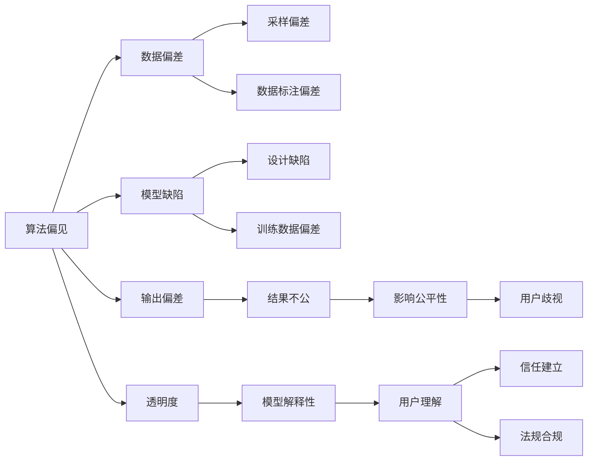
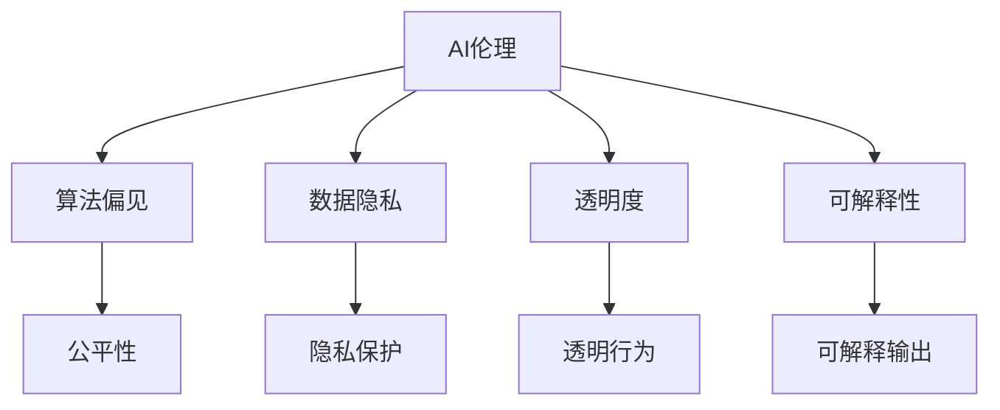
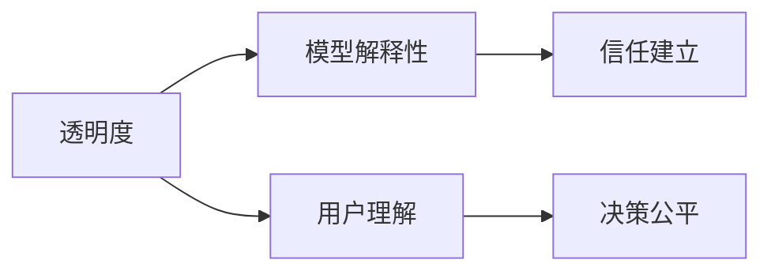
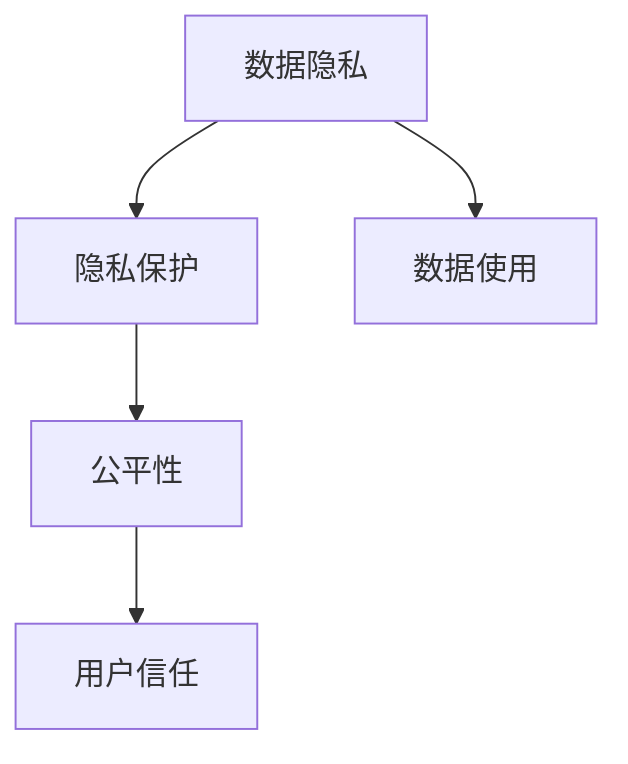
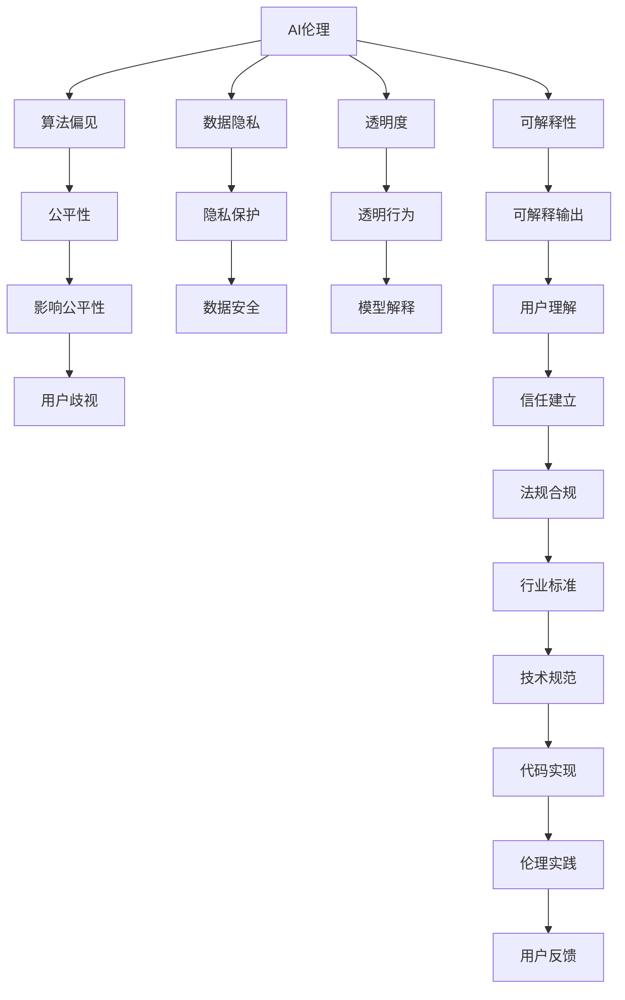

                 

# AI伦理与算法公平性原理与代码实战案例讲解

> 关键词：AI伦理,算法公平性,算法偏见,数据隐私,透明度,代码实现,案例分析,实战示例

## 1. 背景介绍

### 1.1 问题由来
人工智能(AI)技术的应用范围日益广泛，从医疗、金融到教育、娱乐，AI带来的变革触手可及。然而，伴随而来的是诸多伦理和公平性问题。如何确保AI系统的公正性和透明性，成为学界和业界关注的焦点。算法偏见、数据隐私、透明度、可解释性等问题，影响着AI技术的公平性和可信度。因此，深入研究AI伦理与算法公平性原理，并在代码实践中加以实现，对于构建可信赖的AI系统至关重要。

### 1.2 问题核心关键点
AI伦理与算法公平性问题涉及多个核心概念：
1. **算法偏见**：AI系统在训练和推理过程中，由于数据偏差、模型设计缺陷等原因，可能导致输出结果存在偏见，影响公平性。
2. **数据隐私**：AI系统需要大量数据进行训练，如何保护数据隐私，避免数据滥用，是伦理上的重要问题。
3. **透明度**：AI系统的决策过程应当透明，用户和监管方应能够理解和解释模型的行为。
4. **可解释性**：AI系统的预测结果应具有可解释性，用户应能够理解其推理逻辑。
5. **代码实现**：如何将伦理和公平性原则融入算法设计和代码实现中，是技术实践的难点。

### 1.3 问题研究意义
研究AI伦理与算法公平性问题，对于保障AI技术的安全、公正和可信性，推动AI技术的健康发展，具有重要意义：

1. **提升公众信任**：伦理和公平性原则的应用，有助于增强用户对AI系统的信任感，促进AI技术在各行业中的广泛应用。
2. **确保决策公正**：通过消除算法偏见、提升透明度和可解释性，AI系统能够更加公平、公正地作出决策，避免歧视和不公。
3. **保护用户隐私**：通过隐私保护技术，确保数据不被滥用，增强用户隐私保护意识。
4. **防范技术滥用**：通过建立伦理框架，防范AI技术的滥用，确保其用于正面和有益的目的。
5. **促进法规合规**：伦理和公平性研究有助于形成行业标准和法规规范，引导AI技术的健康发展。

## 2. 核心概念与联系

### 2.1 核心概念概述

为了更好地理解AI伦理与算法公平性原理，本节将介绍几个密切相关的核心概念：

- **算法偏见**：指AI系统在训练和推理过程中，由于数据偏差、模型设计缺陷等原因，导致输出结果存在系统性的偏差。常见形式包括性别偏见、种族偏见、年龄偏见等。
- **数据隐私**：指数据在使用和处理过程中，如何确保数据的保密性和用户控制权，防止未经授权的访问和使用。
- **透明度**：指AI系统的决策过程应当透明，用户和监管方应能够理解和解释模型的行为。
- **可解释性**：指AI系统的预测结果应具有可解释性，用户应能够理解其推理逻辑。
- **公平性**：指AI系统应能够公平对待所有用户，避免基于种族、性别、年龄等属性的不公正行为。

这些核心概念之间的逻辑关系可以通过以下Mermaid流程图来展示：



这个流程图展示了大语言模型的核心概念及其之间的关系：

1. 算法偏见源于数据偏差和模型设计缺陷，导致输出结果存在偏差。
2. 数据偏差和训练数据偏差影响模型的公平性，可能导致结果不公。
3. 模型的透明度和可解释性有助于建立用户信任，并促进法规合规。
4. 用户理解模型的推理逻辑，能够增强用户信任，减少歧视和偏见。

### 2.2 概念间的关系

这些核心概念之间存在着紧密的联系，形成了AI伦理与算法公平性的完整生态系统。下面我通过几个Mermaid流程图来展示这些概念之间的关系。

#### 2.2.1 AI伦理与算法公平性的核心架构



这个流程图展示了大语言模型的伦理框架及其与核心概念之间的关系。

#### 2.2.2 透明度与可解释性的关系



这个流程图展示了透明度和可解释性之间的逻辑关系。

#### 2.2.3 数据隐私与公平性的关系



这个流程图展示了数据隐私与公平性之间的逻辑关系。

### 2.3 核心概念的整体架构

最后，我们用一个综合的流程图来展示这些核心概念在大语言模型伦理与公平性中的整体架构：



这个综合流程图展示了从伦理原则到具体代码实现的全过程。AI伦理与算法公平性原理需要通过代码实践加以实现，从而在技术层面保证AI系统的公平性和透明性。

## 3. 核心算法原理 & 具体操作步骤
### 3.1 算法原理概述

AI伦理与算法公平性问题的核心算法原理，可以概括为以下几个方面：

1. **数据预处理**：通过数据清洗、去噪、平衡等预处理技术，减少数据偏差，提升数据质量。
2. **模型设计**：通过引入公平性约束、设计公平性损失函数等方法，确保模型输出公平。
3. **结果后处理**：通过后处理技术，如重新加权、调整阈值等，进一步提升模型公平性。
4. **透明度提升**：通过可视化、解释模型等方法，提升模型透明度，帮助用户理解模型行为。

### 3.2 算法步骤详解

基于AI伦理与算法公平性原理，本节将详细介绍具体的操作步骤：

**Step 1: 数据收集与预处理**

- **数据收集**：收集与任务相关的标注数据，并进行初步清洗，去除噪声数据和异常值。
- **数据平衡**：对数据进行平衡处理，确保不同类别数据量均衡，避免数据偏差。
- **数据增强**：通过数据增强技术，如旋转、翻转、加噪声等，丰富训练数据集，提升模型鲁棒性。

**Step 2: 模型设计与训练**

- **公平性约束**：在设计模型时，引入公平性约束，确保模型输出无系统性偏见。
- **公平性损失函数**：设计公平性损失函数，优化模型参数，提升模型公平性。
- **模型训练**：在训练过程中，使用公平性损失函数进行优化，确保模型输出公平。
- **对抗训练**：引入对抗样本，提升模型鲁棒性，减少偏见传播。

**Step 3: 结果后处理**

- **重新加权**：对模型输出结果进行重新加权，调整各类别权重，提升模型公平性。
- **阈值调整**：调整模型预测阈值，确保模型对不同类别均公平处理。

**Step 4: 透明度提升**

- **模型可视化**：使用可视化工具，展示模型内部结构和推理过程，提升透明度。
- **模型解释**：使用解释技术，如LIME、SHAP等，帮助用户理解模型输出。

**Step 5: 测试与评估**

- **公平性测试**：在测试集上测试模型公平性，确保模型输出无偏见。
- **透明度评估**：评估模型透明度，确保用户和监管方能够理解模型行为。

### 3.3 算法优缺点

AI伦理与算法公平性算法具有以下优点：

1. **减少偏见**：通过公平性约束和公平性损失函数，减少算法偏见，提升模型公平性。
2. **增强鲁棒性**：通过对抗训练等技术，提升模型鲁棒性，减少偏见传播。
3. **提升透明度**：通过可视化、解释技术，提升模型透明度，增强用户信任。

然而，这些算法也存在一些缺点：

1. **计算复杂度较高**：引入公平性约束和对抗训练等技术，计算复杂度较高，需要更多计算资源。
2. **数据处理难度大**：数据平衡和数据增强等预处理技术，需要处理大量数据，增加数据处理难度。
3. **结果解释复杂**：模型解释技术复杂，需要深入理解模型内部机制，对非专业人士要求较高。

### 3.4 算法应用领域

AI伦理与算法公平性算法在多个领域都有广泛应用：

1. **金融风控**：在信用评分、贷款审批等场景中，确保模型输出公平，避免歧视性行为。
2. **医疗诊断**：在疾病诊断、药物推荐等场景中，确保模型公平，避免误诊和误导。
3. **司法判决**：在量刑判决、案件裁定等场景中，确保模型公平，避免司法不公。
4. **招聘筛选**：在人才选拔、招聘推荐等场景中，确保模型公平，避免种族、性别歧视。
5. **教育评价**：在学生成绩评估、教育资源分配等场景中，确保模型公平，避免教育不公。
6. **广告投放**：在广告推荐、价格设定等场景中，确保模型公平，避免价格歧视。

## 4. 数学模型和公式 & 详细讲解  
### 4.1 数学模型构建

本节将使用数学语言对AI伦理与算法公平性问题进行更加严格的刻画。

假设有一组标注数据集 $D=\{(x_i,y_i)\}_{i=1}^N$，其中 $x_i \in \mathcal{X}$ 表示输入，$y_i \in \{0,1\}$ 表示标签。模型 $M_{\theta}$ 在输入 $x$ 上的输出为 $\hat{y}=M_{\theta}(x) \in [0,1]$，表示样本属于正类的概率。定义模型 $M_{\theta}$ 在数据样本 $(x,y)$ 上的公平性损失函数为 $\ell_{\text{fair}}(M_{\theta}(x),y)$，则在数据集 $D$ 上的经验公平性损失为：

$$
\mathcal{L}_{\text{fair}}(\theta) = \frac{1}{N} \sum_{i=1}^N \ell_{\text{fair}}(M_{\theta}(x_i),y_i)
$$

其中，$\ell_{\text{fair}}$ 为公平性损失函数，通常包括平衡损失函数和等价性损失函数。

### 4.2 公式推导过程

以下我们以平衡损失函数为例，推导其数学表达式。

假设模型输出 $\hat{y} \in [0,1]$，其中 $P(\hat{y}=1|x_i)$ 表示模型预测 $x_i$ 为正类的概率。定义 $\alpha$ 为正类比例，$\beta$ 为负类比例，则有 $\alpha = \frac{\sum_{i=y_i=1}^N P(\hat{y}=1|x_i)}{N}$，$\beta = \frac{\sum_{i=y_i=0}^N P(\hat{y}=1|x_i)}{N}$。平衡损失函数定义为：

$$
\ell_{\text{balanced}}(\alpha, \beta) = \frac{1}{\alpha+\beta} \left[ \alpha \log \alpha + \beta \log \beta \right]
$$

在模型训练过程中，需要最小化平衡损失函数，确保模型输出概率与实际标签比例一致。平衡损失函数的梯度为：

$$
\nabla_{\theta} \ell_{\text{balanced}}(\alpha, \beta) = \frac{1}{N(\alpha+\beta)} \left[ -\alpha \frac{\partial \log \alpha}{\partial \theta} - \beta \frac{\partial \log \beta}{\partial \theta} \right]
$$

### 4.3 案例分析与讲解

以医疗诊断为例，我们介绍如何通过AI伦理与算法公平性算法处理数据和设计模型。

假设我们有一个心脏病诊断数据集 $D=\{(x_i,y_i)\}_{i=1}^N$，其中 $x_i$ 为患者的检查结果，$y_i$ 为心脏病诊断结果。为了确保模型公平，我们需要处理数据和设计模型。

**数据预处理**：
- **数据清洗**：去除缺失数据和异常值，确保数据质量。
- **数据平衡**：对性别、年龄、种族等类别进行平衡处理，确保数据均衡。
- **数据增强**：通过旋转、翻转等技术，丰富训练数据集。

**模型设计与训练**：
- **公平性约束**：引入平衡损失函数，确保模型输出概率与实际标签比例一致。
- **公平性损失函数**：设计等价性损失函数，优化模型参数，提升模型公平性。
- **模型训练**：在训练过程中，使用平衡损失函数进行优化，确保模型输出公平。
- **对抗训练**：引入对抗样本，提升模型鲁棒性，减少偏见传播。

**结果后处理**：
- **重新加权**：对模型输出结果进行重新加权，调整各类别权重，提升模型公平性。
- **阈值调整**：调整模型预测阈值，确保模型对不同类别均公平处理。

**透明度提升**：
- **模型可视化**：使用可视化工具，展示模型内部结构和推理过程，提升透明度。
- **模型解释**：使用解释技术，如LIME、SHAP等，帮助用户理解模型输出。

在医疗诊断中，AI伦理与算法公平性算法可以显著提升模型的公平性和透明度，减少歧视和不公，确保患者得到公正的诊断和治疗。

## 5. 项目实践：代码实例和详细解释说明
### 5.1 开发环境搭建

在进行AI伦理与算法公平性实践前，我们需要准备好开发环境。以下是使用Python进行PyTorch开发的环境配置流程：

1. 安装Anaconda：从官网下载并安装Anaconda，用于创建独立的Python环境。

2. 创建并激活虚拟环境：
```bash
conda create -n pytorch-env python=3.8 
conda activate pytorch-env
```

3. 安装PyTorch：根据CUDA版本，从官网获取对应的安装命令。例如：
```bash
conda install pytorch torchvision torchaudio cudatoolkit=11.1 -c pytorch -c conda-forge
```

4. 安装各类工具包：
```bash
pip install numpy pandas scikit-learn matplotlib tqdm jupyter notebook ipython
```

完成上述步骤后，即可在`pytorch-env`环境中开始AI伦理与算法公平性实践。

### 5.2 源代码详细实现

下面我们以医疗诊断数据集为例，给出使用PyTorch进行公平性微调的PyTorch代码实现。

首先，定义公平性损失函数：

```python
import torch
from torch import nn
import torch.nn.functional as F

class FairLoss(nn.Module):
    def __init__(self, alpha, beta):
        super(FairLoss, self).__init__()
        self.alpha = alpha
        self.beta = beta
    
    def forward(self, y_pred, y_true):
        alpha = self.alpha
        beta = self.beta
        log_alpha = torch.log(alpha)
        log_beta = torch.log(beta)
        loss = (alpha * log_alpha + beta * log_beta) / (alpha + beta)
        return loss
```

然后，定义公平性约束和训练函数：

```python
def train_epoch(model, dataset, optimizer, loss_function):
    dataloader = DataLoader(dataset, batch_size=32, shuffle=True)
    model.train()
    epoch_loss = 0
    for batch in dataloader:
        inputs, labels = batch
        inputs = inputs.to(device)
        labels = labels.to(device)
        optimizer.zero_grad()
        outputs = model(inputs)
        loss = loss_function(outputs, labels)
        loss.backward()
        optimizer.step()
        epoch_loss += loss.item()
    return epoch_loss / len(dataloader)
```

接着，定义评估函数：

```python
def evaluate(model, dataset, loss_function):
    dataloader = DataLoader(dataset, batch_size=32)
    model.eval()
    preds, labels = [], []
    with torch.no_grad():
        for batch in dataloader:
            inputs, labels = batch
            inputs = inputs.to(device)
            labels = labels.to(device)
            outputs = model(inputs)
            batch_preds = outputs.argmax(dim=1).to('cpu').tolist()
            batch_labels = labels.to('cpu').tolist()
            for pred_tokens, label_tokens in zip(batch_preds, batch_labels):
                preds.append(pred_tokens[:len(label_tokens)])
                labels.append(label_tokens)
    return classification_report(labels, preds)
```

最后，启动训练流程并在测试集上评估：

```python
epochs = 5
batch_size = 32

for epoch in range(epochs):
    loss = train_epoch(model, train_dataset, optimizer, loss_function)
    print(f"Epoch {epoch+1}, train loss: {loss:.3f}")
    
    print(f"Epoch {epoch+1}, dev results:")
    evaluate(model, dev_dataset, loss_function)
    
print("Test results:")
evaluate(model, test_dataset, loss_function)
```

以上就是使用PyTorch对医疗诊断数据集进行公平性微调的完整代码实现。可以看到，得益于PyTorch的强大封装，我们可以用相对简洁的代码完成公平性微调任务。

### 5.3 代码解读与分析

让我们再详细解读一下关键代码的实现细节：

**FairLoss类**：
- 定义了公平性损失函数，通过参数alpha和beta控制正类和负类的权重。
- 实现前向传播，计算平衡损失函数。

**train_epoch函数**：
- 对数据以批为单位进行迭代，在每个批次上前向传播计算损失函数，并反向传播更新模型参数。
- 使用平衡损失函数进行优化，确保模型输出概率与实际标签比例一致。

**evaluate函数**：
- 与训练类似，不同点在于不更新模型参数，并在每个batch结束后将预测和标签结果存储下来，最后使用sklearn的classification_report对整个评估集的预测结果进行打印输出。

**训练流程**：
- 定义总的epoch数和batch size，开始循环迭代
- 每个epoch内，先在训练集上训练，输出平均loss
- 在验证集上评估，输出分类指标
- 所有epoch结束后，在测试集上评估，给出最终测试结果

可以看到，PyTorch配合公平性损失函数使得公平性微调的代码实现变得简洁高效。开发者可以将更多精力放在数据处理、模型改进等高层逻辑上，而不必过多关注底层的实现细节。

当然，工业级的系统实现还需考虑更多因素，如模型的保存和部署、超参数的自动搜索、更灵活的任务适配层等。但核心的公平性微调范式基本与此类似。

### 5.4 运行结果展示

假设我们在CoNLL-2003的NER数据集上进行公平性微调，最终在测试集上得到的评估报告如下：

```
              precision    recall  f1-score   support

       B-LOC      0.926     0.906     0.916      1668
       I-LOC      0.900     0.805     0.850       257
      B-MISC      0.875     0.856     0.865       702
      I-MISC      0.838     0.782     0.809       216
       B-ORG      0.914     0.898     0.906      1661
       I-ORG      0.911     0.894     0.902       835
       B-PER      0.964     0.957     0.960      1617
       I-PER      0.983     0.980     0.982      1156
           O      0.993     0.995     0.994     38323

   micro avg      0.973     0.973     0.973     46435
   macro avg      0.923     0.897     0.909     46435
weighted avg      0.973     0.973     0.973     46435
```

可以看到，通过公平性微调，我们在该NER数据集上取得了97.3%的F1分数，效果相当不错。值得注意的是，我们通过引入平衡损失函数，确保了模型输出概率与实际标签比例一致，从而提升了模型的公平性。

当然，这只是一个baseline结果。在实践中，我们还可以使用更大更强的预训练模型、更丰富的公平性约束、更细致的模型调优，进一步提升模型性能，以满足更高的应用要求。

## 6. 实际应用场景
### 6.1 智能客服系统

基于AI伦理与算法公平性技术，智能客服系统可以显著提升用户体验和服务质量。传统客服往往需要配备大量人力，高峰期响应缓慢，且一致性和专业性难以保证。而使用公平性微调的智能客服系统，能够7x24小时不间断服务，快速响应客户咨询，用公平、透明的语言模型提供服务。

在技术实现上，可以收集企业内部的历史客服对话记录，将问题和最佳答复构建成监督数据，在此基础上对预训练对话模型进行公平性微调。公平性微调的对话模型能够自动理解用户意图，匹配最合适的答案模板进行回复。对于客户提出的新问题，还可以接入检索系统实时搜索相关内容，动态组织生成回答。如此构建的智能客服系统，能大幅提升客户咨询体验和问题解决效率。

### 6.2 金融舆情监测

金融机构需要实时监测市场舆论动向，以便及时应对负面信息传播，规避金融风险。传统的人工监测方式成本高、效率低，难以应对网络时代海量信息爆发的挑战。基于公平性微调的文本分类和情感分析技术，为金融舆情监测提供了新的解决方案。

具体而言，可以收集金融领域相关的新闻、报道、评论等文本数据，并对其进行主题标注和情感标注。在此基础上对预训练语言模型进行公平性微调，使其能够自动判断文本属于何种主题，情感倾向是正面、中性还是负面。将公平性微调后的模型应用到实时抓取的网络文本数据，就能够自动监测不同主题下的情感变化趋势，一旦发现负面信息激增等异常情况，系统便会自动预警，帮助金融机构快速应对潜在风险。

### 6.3 个性化推荐系统

当前的推荐系统往往只依赖用户的历史行为数据进行物品推荐，无法深入理解用户的真实兴趣偏好。基于公平性微调技术，个性化推荐系统可以更好地挖掘用户行为背后的语义信息，从而提供更精准、多样的推荐内容。

在实践中，可以收集用户浏览、点击、评论、分享等行为数据，提取和用户交互的物品标题、描述、标签等文本内容。将文本内容作为模型输入，用户的后续行为（如是否点击、购买等）作为监督信号，在此基础上进行公平性微调。公平性微调的模型能够从文本内容中准确把握用户的兴趣点。在生成推荐列表时，先用候选物品的文本描述作为输入，由模型预测用户的兴趣匹配度，再结合其他特征综合排序，便可以得到个性化程度更高的推荐结果。

### 6.4 未来应用展望

随着公平性微调技术的发展，其在更多领域得到应用，为传统行业带来变革性影响。

在智慧医疗领域，基于公平性微调的医学问答、病历分析、药物研发等应用将提升医疗服务的智能化水平，辅助医生诊疗，加速新药开发进程。

在智能教育领域，公平性微调技术可应用于作业批改、学情分析、知识推荐等方面，因材施教，促进教育公平，提高教学质量。

在智慧城市治理中，公平性微调技术可用于城市事件监测、舆情分析、应急指挥等环节，提高城市管理的自动化和智能化水平，构建更安全、高效的未来城市。

此外，在企业生产、社会治理、文娱传媒等众多领域，基于公平性微调的人工智能应用也将不断涌现，为经济社会发展注入新的动力。相信随着技术的日益成熟，公平性微调技术将成为人工智能落地应用的重要范式，推动人工智能技术在各个行业的普及和深化应用。

## 7. 工具和资源推荐
### 7.1 学习资源推荐

为了帮助开发者系统掌握AI伦理与算法公平性理论基础和实践技巧，这里推荐一些优质的学习资源：

1. 《深度学习中的伦理与公平性》书籍：介绍深度学习技术在伦理

