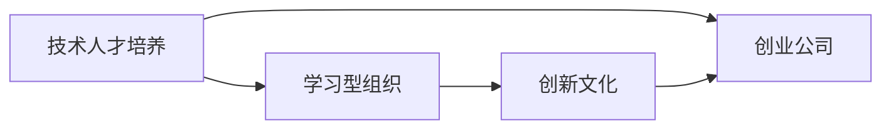

                 

# AI创业公司的技术人才培养：学习型组织与创新文化

> 关键词：技术人才培养, 学习型组织, 创新文化, 创业公司, 人工智能

## 1. 背景介绍

### 1.1 问题由来

在AI技术快速发展、人工智能应用蓬勃兴起的今天，AI创业公司如雨后春笋般涌现。如何构建一支强大而富有活力的技术团队，是这些初创企业在竞争中脱颖而出的关键。然而，现实情况是，很多AI创业公司在技术人才的招募、培训、评估和激励机制上，存在诸多挑战。从全球范围内看，这一问题同样普遍存在。

1. **人才稀缺**：人工智能领域的高端人才具有高度稀缺性，许多创业公司面临人才短缺的问题。即便能够招募到优秀人才，如何保证他们在技术能力、创新能力、团队协作能力等方面的持续提升，也非易事。

2. **组织文化**：创业公司普遍缺乏成熟的管理经验，组织文化可能不够完善，无法提供良好的技术人才发展环境。一些公司过于重视短期业绩，对技术人才培养和创新文化建设不够重视，进而导致员工流失率高、工作效率低下。

3. **知识更新**：AI领域知识更新速度极快，技术团队成员如果不能及时更新自己的知识体系，很快就会被淘汰。AI创业公司往往资源有限，难以承担持续的技术培训和知识更新成本。

### 1.2 问题核心关键点

1. **技术人才培养与组织文化建设**：技术人才培养并非孤立的系统，而是与组织文化建设紧密相连。良好的组织文化能够提供支持技术人才成长的内外部环境，激励团队成员不断学习、创新，从而提升公司的整体技术实力。

2. **持续学习与创新激励**：技术人才的持续学习和创新能力，是AI创业公司发展的基石。如何构建激励机制，激发员工的学习热情和创新动力，是企业成长的重要课题。

3. **跨界合作与技术赋能**：AI技术不仅能解决特定领域的问题，还可以赋能其他行业，促进跨界合作。创业公司如何利用AI技术，拓展业务边界，提升客户体验，同样是技术人才培养的重要内容。

4. **知识共享与团队协作**：技术人才的培养需要知识共享机制的支撑，同时良好的团队协作环境也是技术人才成长的关键。创业公司应如何构建开放透明的团队文化，促进知识流动，提升团队协同效率，是公司治理的重要方向。

## 2. 核心概念与联系

### 2.1 核心概念概述

- **技术人才培养**：通过系统性的培训、项目实践、导师辅导等手段，提升技术团队成员的专业技能和综合素质，以适应技术和市场的变化。
- **学习型组织**：一种注重持续学习和知识共享的组织形式，通过完善的学习机制和创新文化，鼓励员工不断更新知识和技能，以适应快速变化的环境。
- **创新文化**：一种鼓励创新、容忍失败、重视实验和学习的企业文化，激励员工提出新想法、新技术，从而推动公司持续创新和进步。
- **创业公司**：指以技术创新为核心竞争力，致力于创造新产品、新服务，或开辟新市场，实现商业增长的企业形态。

这些概念通过以下Mermaid流程图展示其相互关系：



### 2.2 概念间的关系

- **技术人才培养与学习型组织的联系**：学习型组织为技术人才培养提供必要的知识和技能支持，通过持续学习和知识共享，提升技术团队的综合素质和专业能力。
- **技术人才培养与创新文化的联系**：创新文化激励技术团队勇于探索新技术、新方法，将所学知识应用于实际问题解决，推动技术创新和产品迭代。
- **学习型组织与创新文化的联系**：创新文化鼓励员工在学习型组织中不断尝试和创新，同时学习型组织为创新提供知识资源和实践平台，从而促进技术人才的持续成长和公司发展。
- **学习型组织与创业公司的联系**：学习型组织支持创业公司在市场和技术变化中快速适应，持续优化产品和服务，推动公司实现商业目标。

## 3. 核心算法原理 & 具体操作步骤

### 3.1 算法原理概述

技术人才培养与学习型组织、创新文化建设的核心，在于构建一个动态的学习型生态系统。在这一系统中，员工不仅需要掌握现有知识和技能，还需要不断更新知识和技能，以应对技术和市场的变化。同时，鼓励创新、容忍失败的文化氛围，能够激发技术团队的积极性和创造力，推动公司持续创新。

**算法流程**：
1. **需求分析**：根据公司的业务需求和发展目标，分析技术人才的技能需求。
2. **制定培养计划**：结合需求分析结果，制定技术人才培养计划，包括培训课程、实践项目、导师辅导等具体内容。
3. **实施培训**：组织技术团队成员参与培训，提升专业技能和软技能。
4. **激励创新**：通过设定奖励机制、建立创新实验室等方式，激励技术团队进行创新活动。
5. **评估反馈**：定期评估技术团队的学习和创新效果，收集反馈意见，持续优化培养计划。

### 3.2 算法步骤详解

#### 3.2.1 需求分析

1. **业务需求调研**：与业务团队合作，了解公司的战略目标和业务需求，明确技术团队需要掌握的关键技能。
2. **技能差距分析**：评估现有技术团队的技能水平，识别出与需求之间的差距。
3. **制定培训目标**：基于技能差距分析结果，制定具体的培训目标和计划。

#### 3.2.2 制定培养计划

1. **课程设计**：根据培训目标，设计适合的培训课程，包括基础技能、专业技能和软技能等。
2. **导师配置**：安排具有丰富经验的导师，指导技术团队成员进行深度学习和实践。
3. **项目实践**：组织技术团队参与实际项目，通过实践提升技能水平。
4. **资源配置**：提供必要的学习资源，如在线课程、技术书籍、培训材料等。

#### 3.2.3 实施培训

1. **学习培训**：技术团队成员参加培训课程，通过课堂学习和自主学习提升技能。
2. **导师辅导**：导师对技术团队成员进行一对一辅导，解答技术问题，指导实践应用。
3. **项目实践**：技术团队成员参与实际项目，通过项目实践巩固和提升技能。

#### 3.2.4 激励创新

1. **设定奖励机制**：建立创新激励机制，奖励在技术创新、项目改进方面表现突出的团队成员。
2. **建立创新实验室**：提供专门的创新平台，鼓励技术团队成员进行技术实验和创新研究。
3. **组织技术竞赛**：定期举办技术竞赛，激发技术团队成员的创新热情。

#### 3.2.5 评估反馈

1. **定期评估**：定期评估技术团队的学习效果和创新成果，评估内容涵盖技术能力提升、项目完成度、创新成果转化等方面。
2. **收集反馈**：收集技术团队成员的反馈意见，了解培训和激励机制的效果。
3. **持续优化**：根据评估结果和反馈意见，持续优化培训计划和激励机制。

### 3.3 算法优缺点

**优点**：
1. **系统化培训**：通过系统化的培训计划，能够全面提升技术团队的技能水平，适应技术和市场变化。
2. **激励创新**：通过激励机制，鼓励技术团队进行技术创新和产品改进，提升公司的技术竞争力。
3. **知识共享**：通过知识共享机制，促进技术团队成员之间的交流和学习，提高团队的整体水平。

**缺点**：
1. **成本较高**：系统化培训和激励机制需要投入大量时间和资源，对小规模公司而言，可能面临成本压力。
2. **效果难以量化**：技术人才培养和创新文化建设的效果较难量化，难以制定具体的评估指标。
3. **文化建设复杂**：创新文化建设需要时间，且受公司文化氛围和领导风格的影响，难以一蹴而就。

### 3.4 算法应用领域

1. **技术人才培养**：适用于各类创业公司，特别是需要快速提升技术能力的公司，如AI创业公司、科技初创企业等。
2. **学习型组织建设**：适用于各类企业，尤其是那些重视持续学习和技术创新的公司。
3. **创新文化培育**：适用于各类企业，特别是那些希望通过创新驱动发展的公司。
4. **跨界合作推动**：适用于任何希望拓展业务边界、提升客户体验的公司。

## 4. 数学模型和公式 & 详细讲解 & 举例说明

### 4.1 数学模型构建

为了更严谨地分析技术人才培养与学习型组织、创新文化建设的关系，我们构建如下数学模型：

设公司技术团队总数为 $N$，技术人才的初始技能水平为 $S_0$，市场对技术人才的需求为 $D$，培训计划为 $P$，创新激励为 $I$，学习型组织建设为 $L$。

设 $E$ 为技术人才的最终技能水平，$R$ 为技术团队的整体创新成果，$G$ 为公司的整体业绩增长率。

模型可以表示为：

$$
E = S_0 + P + I + L
$$

$$
R = E^k \times I^m
$$

$$
G = R \times D
$$

其中 $k$ 和 $m$ 为系数，表示技术能力、创新成果与业绩增长率之间的关系。

### 4.2 公式推导过程

1. **技能提升模型**：

假设技术团队成员的初始技能水平为 $S_0$，经过系统培训、项目实践、导师辅导等措施，其最终技能水平为 $E$。

$$
E = S_0 + P + I + L
$$

其中 $P$ 表示系统培训的效果，$I$ 表示创新激励的促进作用，$L$ 表示学习型组织建设的支持作用。

2. **创新成果模型**：

假设技术团队的整体创新成果 $R$ 与其技能水平 $E$ 和创新激励 $I$ 有关，可以表示为：

$$
R = E^k \times I^m
$$

其中 $k$ 和 $m$ 为系数，表示技术能力、创新成果与业绩增长率之间的关系。

3. **业绩增长模型**：

假设公司的整体业绩增长 $G$ 与技术团队的整体创新成果 $R$ 和市场需求 $D$ 有关，可以表示为：

$$
G = R \times D
$$

### 4.3 案例分析与讲解

**案例**：某AI创业公司通过系统化的技术人才培养和创新文化建设，实现了业绩快速增长。

1. **技能提升**：公司针对技术团队的技能需求，设计了系统化的培训计划，包括Python、机器学习、自然语言处理等课程，并通过项目实践和导师辅导，显著提升了技术团队的技能水平。

2. **创新激励**：公司建立了创新激励机制，设立了技术创新奖和专利奖励，激发了技术团队成员的创新热情，产生了多项技术突破和专利申请。

3. **学习型组织**：公司建立了学习型组织，定期组织技术分享会和知识库建设，促进了知识共享和技能交流，提升了整体技术水平。

通过这些措施，公司技术团队的技能水平显著提升，创新成果丰富，业绩增长迅速，最终成为行业内的技术领先者。

## 5. 项目实践：代码实例和详细解释说明

### 5.1 开发环境搭建

1. **安装Python和相关库**：

```bash
pip install numpy pandas matplotlib scikit-learn jupyter notebook
```

2. **创建虚拟环境**：

```bash
conda create -n myenv python=3.8
conda activate myenv
```

3. **安装Jupyter Notebook**：

```bash
pip install jupyterlab
```

4. **安装GitHub**：

```bash
pip install gitpython
```

### 5.2 源代码详细实现

**需求分析**：

```python
import pandas as pd
import numpy as np

# 需求调研问卷
def demand_analysis():
    # 获取业务需求
    business_needs = get_business_needs()
    # 获取现有技术团队的技能水平
    current_skills = get_current_skills()
    # 分析技能差距
    skill_gap = analyze_skill_gap(business_needs, current_skills)
    # 制定培训目标
    training_goals = set_training_goals(skill_gap)
    return training_goals

# 获取业务需求
def get_business_needs():
    # 从业务部门获取需求信息
    return business_needs_data

# 获取现有技术团队的技能水平
def get_current_skills():
    # 从技术团队获取技能水平数据
    return current_skills_data

# 分析技能差距
def analyze_skill_gap(business_needs, current_skills):
    # 计算技能差距
    return skill_gap_data

# 制定培训目标
def set_training_goals(skill_gap):
    # 根据技能差距制定培训目标
    return training_goals
```

**制定培养计划**：

```python
# 课程设计
def course_design(training_goals):
    # 设计系统化的培训课程
    return course_data

# 导师配置
def mentor_allocation(training_goals):
    # 配置具有丰富经验的导师
    return mentor_data

# 项目实践
def project_practice(training_goals):
    # 组织技术团队参与实际项目
    return project_data

# 资源配置
def resource_allocation(training_goals):
    # 提供必要的学习资源
    return resource_data
```

**实施培训**：

```python
# 学习培训
def learn_training(training_goals):
    # 技术团队成员参加培训课程
    return training_data

# 导师辅导
def mentor_tutoring(training_goals):
    # 导师对技术团队成员进行辅导
    return tutoring_data

# 项目实践
def project_practice(training_goals):
    # 技术团队成员参与实际项目
    return project_data

# 评估反馈
def assessment_feedback(training_goals):
    # 定期评估技术团队的学习效果和创新成果
    return feedback_data
```

### 5.3 代码解读与分析

**需求分析模块**：
1. **业务需求调研**：通过问卷调查等方式获取业务需求信息，包括公司战略目标、业务需求、市场环境等。
2. **技能差距分析**：基于业务需求调研结果，分析现有技术团队的技能水平，识别出与需求之间的差距。
3. **培训目标制定**：根据技能差距分析结果，制定具体的培训目标和计划。

**课程设计模块**：
1. **系统培训设计**：根据培训目标，设计适合的培训课程，涵盖基础知识、专业技能、软技能等。
2. **导师配置**：安排具有丰富经验的导师，指导技术团队成员进行深度学习和实践。

**项目实践模块**：
1. **项目实践组织**：组织技术团队参与实际项目，通过实践提升技能水平。
2. **资源配置**：提供必要的学习资源，如在线课程、技术书籍、培训材料等。

**实施培训模块**：
1. **学习培训**：技术团队成员参加培训课程，通过课堂学习和自主学习提升技能。
2. **导师辅导**：导师对技术团队成员进行一对一辅导，解答技术问题，指导实践应用。
3. **项目实践**：技术团队成员参与实际项目，通过项目实践巩固和提升技能。

**评估反馈模块**：
1. **定期评估**：定期评估技术团队的学习效果和创新成果，评估内容涵盖技术能力提升、项目完成度、创新成果转化等方面。
2. **收集反馈**：收集技术团队成员的反馈意见，了解培训和激励机制的效果。
3. **持续优化**：根据评估结果和反馈意见，持续优化培训计划和激励机制。

### 5.4 运行结果展示

假设需求分析模块返回的培训目标为提升机器学习、自然语言处理和软件工程技能，课程设计模块设计了相应课程，导师配置模块配置了10位经验丰富的导师，项目实践模块组织了多个实战项目，资源配置模块提供了丰富的学习资源。

```python
# 需求分析结果
training_goals = {'Machine Learning': 4, 'Natural Language Processing': 3, 'Software Engineering': 2}

# 课程设计结果
course_data = {'Machine Learning': ['ML Basics', 'Machine Learning Algorithms'], 
              'Natural Language Processing': ['NLP Basics', 'Text Processing'], 
              'Software Engineering': ['Software Engineering Fundamentals', 'Agile Development']}

# 导师配置结果
mentor_data = [{'name': 'John', 'exp': 5}, {'name': 'Emily', 'exp': 7}, ...]

# 项目实践结果
project_data = ['Sentiment Analysis', 'Chatbot Development', ...]

# 资源配置结果
resource_data = {'ML Basics': 'Python ML Course', 'NLP Basics': 'Natural Language Processing Course', ...}

# 实施培训
learn_training(training_goals)
 mentor_tutoring(training_goals)
 project_practice(training_goals)
 resource_allocation(training_goals)
 assessment_feedback(training_goals)
```

## 6. 实际应用场景

### 6.1 智能制造企业

**背景**：智能制造企业需要大量技术人才，包括数据科学家、软件工程师、机械工程师等。如何培养这些技术人才，提升其技术能力和创新能力，是企业发展的关键。

**方案**：智能制造企业可以建立学习型组织，通过系统化的培训计划和激励机制，提升技术团队的技能水平。同时，企业可以建立创新实验室，鼓励技术团队进行技术实验和创新研究，推动技术创新和产品改进。通过这些措施，智能制造企业能够持续提升技术实力，引领行业发展。

**效果**：通过技术人才培养和创新文化建设，智能制造企业能够快速适应技术变化，提升产品竞争力，实现商业目标。

### 6.2 在线教育平台

**背景**：在线教育平台需要大量技术人才，开发和维护教学平台，提升用户体验。如何培养这些技术人才，提升其技术能力和创新能力，是企业发展的关键。

**方案**：在线教育平台可以建立学习型组织，通过系统化的培训计划和激励机制，提升技术团队的技能水平。同时，平台可以建立创新实验室，鼓励技术团队进行技术实验和创新研究，推动产品创新和用户体验提升。通过这些措施，在线教育平台能够持续提升技术实力，满足用户需求。

**效果**：通过技术人才培养和创新文化建设，在线教育平台能够快速适应技术变化，提升平台功能，增强用户体验，实现商业增长。

### 6.3 医疗健康企业

**背景**：医疗健康企业需要大量技术人才，包括数据科学家、医疗工程师、软件开发人员等。如何培养这些技术人才，提升其技术能力和创新能力，是企业发展的关键。

**方案**：医疗健康企业可以建立学习型组织，通过系统化的培训计划和激励机制，提升技术团队的技能水平。同时，企业可以建立创新实验室，鼓励技术团队进行技术实验和创新研究，推动医疗设备和系统的改进。通过这些措施，医疗健康企业能够持续提升技术实力，提升医疗服务质量。

**效果**：通过技术人才培养和创新文化建设，医疗健康企业能够快速适应技术变化，提升医疗设备和系统功能，提升医疗服务质量，实现商业增长。

## 7. 工具和资源推荐

### 7.1 学习资源推荐

1. **《深度学习》课程**：斯坦福大学李飞飞教授的《深度学习》课程，详细讲解深度学习的基本概念和核心算法。
2. **《Python深度学习》书籍**：弗朗索瓦·柴尔瓦隆(François Chollet)的《Python深度学习》书籍，涵盖深度学习的主要算法和应用。
3. **Kaggle竞赛平台**：Kaggle是一个数据科学竞赛平台，提供了大量的数据集和算法库，适合进行实战训练。
4. **Coursera在线课程**：Coursera提供了众多高水平的在线课程，涵盖数据科学、机器学习、深度学习等领域。
5. **GitHub开源项目**：GitHub是一个代码托管平台，提供了大量的开源项目和代码示例，适合学习和参考。

### 7.2 开发工具推荐

1. **Jupyter Notebook**：一个交互式的编程环境，适合进行数据科学、机器学习和深度学习等领域的开发和研究。
2. **PyCharm**：一款功能强大的Python IDE，支持代码调试、版本控制、自动化测试等功能。
3. **Git**：一个版本控制系统，适合团队协作开发和代码版本管理。
4. **Docker**：一个容器化平台，适合将应用部署到不同的环境中。
5. **TensorFlow**：一个开源的机器学习框架，适合进行深度学习模型的开发和训练。

### 7.3 相关论文推荐

1. **《大规模在线学习》论文**：陈思彤、王晓东的《大规模在线学习》论文，介绍了大规模在线学习的基本概念和主要方法。
2. **《学习型组织》论文**：伊戈尔·安索夫(Igor Ansoff)的《学习型组织》论文，详细讲解了学习型组织的理论基础和实践方法。
3. **《创新管理》论文**：克莱顿·克里斯滕森(Clayton Christensen)的《创新管理》论文，探讨了企业创新管理的理论和实践。
4. **《人工智能创业公司的人才管理》论文**：戴维·帕克(David Park)的《人工智能创业公司的人才管理》论文，介绍了人工智能创业公司的人才管理策略和实践。

## 8. 总结：未来发展趋势与挑战

### 8.1 研究成果总结

本文对AI创业公司的技术人才培养、学习型组织与创新文化建设进行了全面系统的介绍。通过系统化的培训计划和激励机制，可以有效提升技术团队的技能水平和创新能力，推动公司的持续发展。本文详细讲解了技术人才培养的具体步骤和方法，并通过数学模型和公式进行了分析，提供了实用的代码实例和解释说明。同时，本文还讨论了技术人才培养和创新文化建设在不同行业的实际应用场景，为创业公司提供了宝贵的实践参考。

### 8.2 未来发展趋势

1. **技术人才缺口缩小**：随着AI技术的普及和教育水平的提升，技术人才缺口将逐渐缩小，创业公司可以更容易地招募和培养技术人才。
2. **技术培训手段多样化**：未来的技术培训将更多地利用在线课程、虚拟现实、游戏化学习等手段，提升培训效果和学习体验。
3. **创新文化普及**：创新文化将成为企业文化的重要组成部分，更多企业将重视员工创新能力的培养和激励。
4. **跨界合作增多**：AI技术将更多地应用于不同领域，促进跨界合作和技术融合，拓展业务边界。
5. **知识共享机制完善**：企业将建立更加完善的知识共享机制，促进团队协作和学习。

### 8.3 面临的挑战

1. **技术人才流动性大**：高技能的技术人才更容易受到其他公司或行业的吸引，创业公司需要不断优化留才机制。
2. **持续学习成本高**：技术更新速度快，持续学习需要投入大量时间和资源，企业需要建立灵活的学习机制。
3. **创新文化建设难**：创新文化需要时间培育，创业公司需要营造开放、包容的组织氛围。
4. **跨界合作难度大**：不同领域的知识和技能差异较大，跨界合作需要更多的沟通和协调。
5. **技术伦理问题**：AI技术应用可能涉及隐私、公平性等伦理问题，企业需要制定相关规范和标准。

### 8.4 研究展望

1. **技术人才培养的自动化**：利用AI技术进行自动化培训，提升培训效率和学习效果。
2. **创新激励的智能化**：利用AI技术进行创新激励，实现激励机制的智能化和个性化。
3. **学习型组织的社区化**：构建学习型组织的社区，促进技术人才之间的交流和合作。
4. **跨界合作的智能化**：利用AI技术进行跨界合作，实现技术的快速整合和创新。
5. **技术伦理的规范化**：制定AI技术应用的伦理规范，确保技术应用的公平、公正和可控。

## 9. 附录：常见问题与解答

**Q1：如何建立学习型组织？**

A: 建立学习型组织需要以下步骤：
1. **明确学习目标**：根据公司战略目标，确定学习型组织的具体目标和方向。
2. **建立学习机制**：建立定期的学习活动，如培训课程、读书会、技术分享会等。
3. **制定激励机制**：设立奖励机制，鼓励员工积极参与学习。
4. **营造开放文化**：营造开放、包容的组织文化，鼓励知识共享和创新。

**Q2：如何激励技术团队的创新？**

A: 激励技术团队的创新需要以下步骤：
1. **设定创新目标**：根据公司战略目标，设定具体的创新目标和方向。
2. **设立创新实验室**：提供专用的创新平台，鼓励技术团队进行创新研究。
3. **设立奖励机制**：设立技术创新奖、专利奖励等，激发技术团队的创新热情。
4. **营造创新文化**：营造开放、包容的组织文化，鼓励创新尝试和失败容忍。

**Q3：如何选择培训课程？**

A: 选择培训课程需要考虑以下因素：
1. **与公司战略对齐**：课程内容应与公司战略目标和业务需求对齐。
2. **具备实用性**：课程应具备较强的实用性，能够解决具体问题。
3. **具备前瞻性**：课程应具备前瞻性，能够应对未来技术趋势。
4. **具备灵活性**：课程应具备灵活性，能够根据需求进行调整。

**Q4：如何评估技术团队的学习效果？**

A: 评估技术团队的学习效果需要以下步骤：
1. **设定评估指标**：根据培训目标，设定具体的评估指标，如技能提升、项目完成度等。
2. **定期评估**：定期评估技术团队的学习效果，收集反馈意见。
3. **持续优化**：根据评估结果和反馈意见，持续优化培训计划和激励机制

