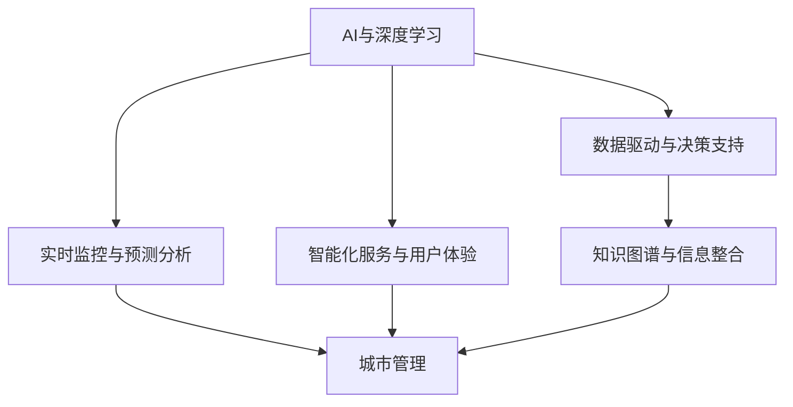

                 

# AI在智能城市中的应用:优化城市管理

## 1. 背景介绍

### 1.1 问题由来
随着全球城市化进程的加速，城市管理面临前所未有的挑战。传统城市管理模式依赖于人力进行巡查、监控，效率低下且难以覆盖所有区域。AI技术特别是深度学习，为城市管理带来了新的思路和手段，实现了从数据采集到决策执行的全流程智能化。智能城市是指通过信息通信技术，将城市基础设施、公共服务、环境资源等进行全面优化和管理的现代城市发展模式。

智能城市涉及的领域广泛，包括智慧交通、公共安全、智慧能源、智慧医疗、智慧教育等。AI技术在这些领域的应用，极大地提高了城市管理的效率和质量，也为居民提供了更好的生活体验。

### 1.2 问题核心关键点
AI在智能城市中的应用核心关键点在于：
1. **数据驱动决策**：AI可以处理海量数据，从中挖掘出有价值的信息，辅助城市管理者做出更精准、更科学的决策。
2. **实时监控与分析**：通过AI实时监控城市运行状态，及时发现并处理问题，提升城市管理效率。
3. **智能化服务**：AI可以实现自动化的服务，如自动驾驶、智能家居、智慧安防等，提升居民生活便捷性和安全保障。
4. **持续学习与优化**：AI系统可以不断学习新数据，优化自身的模型和算法，提高服务质量和适应性。

### 1.3 问题研究意义
AI在智能城市中的应用，对于提升城市管理的智能化、精细化、人性化水平具有重要意义：

1. **提升城市治理效率**：通过AI自动化处理复杂任务，减少人工操作，提高城市管理效率。
2. **改善公共服务质量**：AI可以提供精准的个性化服务，提升公共服务水平，满足居民多样化需求。
3. **优化资源配置**：AI可以优化城市资源配置，如交通流量管理、能源消耗控制等，提高城市运行效率。
4. **促进数据共享与协同**：AI系统可以实现不同部门间的信息共享和协同工作，构建智慧城市生态系统。
5. **增强应急响应能力**：AI能够快速分析突发事件数据，辅助应急决策，提升城市应急响应能力。

## 2. 核心概念与联系

### 2.1 核心概念概述

智能城市的应用涉及多个核心概念，以下是几个关键概念的介绍：

- **AI与深度学习**：AI是人工智能的简称，通过计算机模拟人类智能行为，实现信息的自动处理和决策。深度学习是AI的重要分支，通过构建多层神经网络，模拟人类视觉、听觉、语言等复杂认知过程，在图像、语音、自然语言处理等领域取得了显著进展。

- **数据驱动与决策支持**：通过数据采集、存储、分析和可视化，构建智能城市管理平台，辅助城市管理者做出科学决策。

- **实时监控与预测分析**：利用传感器、摄像头等设备采集城市运行数据，通过AI算法实时监控城市状态，预测未来趋势，及时发现并处理问题。

- **智能化服务与用户体验**：AI可以实现自动化的智能服务，如智能交通系统、智能安防系统、智能家居等，提升居民生活体验和安全性。

- **知识图谱与信息整合**：利用知识图谱等技术，整合各类数据源，构建城市知识库，为AI提供更多先验知识和规则，提升模型性能。

这些核心概念之间的逻辑关系可以通过以下Mermaid流程图来展示：



这个流程图展示智能城市应用中各核心概念之间的联系：

1. AI与深度学习是智能城市的基础，通过处理海量数据，实现信息自动化和智能化决策。
2. 数据驱动与决策支持依赖于AI对数据的分析，辅助城市管理者做出科学决策。
3. 实时监控与预测分析通过AI实时监控城市状态，预测未来趋势，及时发现并处理问题。
4. 智能化服务与用户体验利用AI实现自动化服务，提升居民生活体验和安全性。
5. 知识图谱与信息整合整合各类数据源，构建城市知识库，为AI提供更多先验知识和规则，提升模型性能。

### 2.2 概念间的关系

这些核心概念之间存在紧密的联系，形成了智能城市应用的整体架构。以下是几个概念的详细解释：

#### 2.2.1 AI与深度学习的联系
AI与深度学习是智能城市应用的基础。深度学习通过多层神经网络模拟人类智能，实现对图像、语音、自然语言等复杂数据的自动化处理。AI通过构建深度学习模型，实现数据的特征提取、模式识别、决策支持等功能。

#### 2.2.2 数据驱动与决策支持的关系
数据驱动决策是智能城市管理的重要手段。城市管理者通过采集各类数据，包括传感器数据、摄像头数据、交通流量数据等，构建数据仓库。利用AI算法对数据进行分析和可视化，辅助城市管理者做出科学决策，优化城市运行效率。

#### 2.2.3 实时监控与预测分析的互依赖
实时监控与预测分析是智能城市管理的核心功能。实时监控通过传感器、摄像头等设备采集城市运行数据，实时监控城市状态。预测分析则通过AI算法对数据进行预测，预测城市未来的运行趋势，及时发现并处理问题。

#### 2.2.4 智能化服务与用户体验的互补
智能化服务与用户体验是智能城市管理的最终目标。通过AI实现自动化的智能服务，如智能交通、智能安防、智能家居等，提升居民生活体验和安全性。用户体验的提升，进一步促进智能化服务的普及和应用。

#### 2.2.5 知识图谱与信息整合的协同
知识图谱与信息整合是智能城市管理的辅助工具。知识图谱通过构建城市知识库，整合各类数据源，为AI提供更多先验知识和规则，提升模型性能。信息整合则通过API接口、数据交换等方式，实现不同部门间的信息共享和协同工作，构建智慧城市生态系统。

### 2.3 核心概念的整体架构

最后，我们用一个综合的流程图来展示智能城市应用的整体架构：


这个综合流程图展示了从基础设施到生态系统的智能城市应用的全过程：

1. 城市基础设施是智能城市的基础，数据采集和存储是智能城市管理的前提。
2. 数据预处理和模型训练与优化是智能城市应用的关键环节，通过AI算法实现数据的特征提取和决策支持。
3. 模型部署和智能决策是智能城市管理的核心功能，通过AI模型实现城市运行的自动化和智能化决策。
4. 智能服务和用户体验是智能城市管理的最终目标，通过AI实现自动化的智能服务，提升居民生活体验和安全性。
5. 持续学习与优化是智能城市管理的保障，通过AI不断学习新数据，优化自身的模型和算法，提高服务质量和适应性。
6. 数据治理和信息共享与协同是智能城市管理的辅助手段，通过API接口、数据交换等方式，实现不同部门间的信息共享和协同工作。
7. 智慧城市生态是智能城市管理的最终目标，通过智慧城市平台和生态系统，实现城市管理的全面优化和提升。

通过以上概念的介绍，可以更好地理解智能城市应用的全过程和核心要素，为后续深入探讨智能城市中的AI技术提供基础。

## 3. 核心算法原理 & 具体操作步骤
### 3.1 算法原理概述

智能城市中的AI应用，核心算法原理可以归纳为以下几个方面：

1. **数据采集与预处理**：通过传感器、摄像头等设备采集城市运行数据，并对其进行预处理，包括数据清洗、归一化、特征提取等。

2. **模型训练与优化**：利用深度学习算法对预处理后的数据进行模型训练和优化，构建智能城市管理模型。常见的算法包括卷积神经网络(CNN)、循环神经网络(RNN)、长短时记忆网络(LSTM)、自注意力机制(Transformer)等。

3. **实时监控与预测分析**：通过构建实时监控系统，利用AI算法对城市运行数据进行实时分析，预测未来趋势，及时发现并处理问题。

4. **智能化服务与用户体验**：通过构建智能应用系统，利用AI算法实现自动化的智能服务，提升居民生活体验和安全性。

5. **知识图谱与信息整合**：通过构建知识图谱，整合各类数据源，为AI提供更多先验知识和规则，提升模型性能。

6. **持续学习与优化**：通过构建持续学习系统，不断学习新数据，优化自身的模型和算法，提高服务质量和适应性。

7. **数据治理与信息共享**：通过构建数据治理平台，实现数据的规范化和标准化，保障数据安全和共享，构建智慧城市生态系统。

### 3.2 算法步骤详解

以下是智能城市应用中的主要算法步骤详解：

**Step 1: 数据采集与预处理**
- 使用各类传感器、摄像头等设备，采集城市基础设施运行数据、交通流量数据、空气质量数据、气象数据等。
- 对采集的数据进行预处理，包括数据清洗、归一化、特征提取等。
- 构建数据存储与管理平台，将预处理后的数据进行存储和规范管理。

**Step 2: 模型训练与优化**
- 选择合适的深度学习算法，如卷积神经网络(CNN)、循环神经网络(RNN)、长短时记忆网络(LSTM)、自注意力机制(Transformer)等，构建智能城市管理模型。
- 利用预处理后的数据进行模型训练和优化，提升模型性能。
- 利用知识图谱等辅助技术，构建更加全面、准确的信息整合能力。

**Step 3: 实时监控与预测分析**
- 构建实时监控系统，利用AI算法对城市运行数据进行实时分析，预测未来趋势。
- 通过智能决策系统，及时发现并处理城市运行中的问题，提高城市管理效率。
- 利用预测分析结果，辅助城市管理者做出科学决策，优化城市运行效率。

**Step 4: 智能化服务与用户体验**
- 构建智能应用系统，利用AI算法实现自动化的智能服务，如智能交通系统、智能安防系统、智能家居等。
- 通过用户反馈数据，不断优化智能服务系统，提升居民生活体验和安全性。
- 利用AI算法，实现服务个性化推荐，满足居民多样化需求。

**Step 5: 持续学习与优化**
- 构建持续学习系统，不断学习新数据，优化自身的模型和算法。
- 利用知识图谱等辅助技术，增强模型的知识整合能力，提高服务质量和适应性。
- 通过持续学习，模型能够不断适应城市管理需求的变化，保持高效稳定的运行状态。

**Step 6: 数据治理与信息共享**
- 构建数据治理平台，实现数据的规范化和标准化，保障数据安全和共享。
- 通过API接口、数据交换等方式，实现不同部门间的信息共享和协同工作，构建智慧城市生态系统。
- 利用数据治理技术，保障数据质量和完整性，促进城市管理信息的互联互通。

### 3.3 算法优缺点

智能城市中的AI应用具有以下优点：
1. **效率提升**：AI可以自动化处理复杂任务，减少人工操作，提高城市管理效率。
2. **精度提升**：AI通过深度学习算法，提升数据分析和决策的精度，优化城市管理决策。
3. **实时响应**：AI可以实现实时监控和预测分析，及时发现并处理城市问题，提升城市管理效率。
4. **用户体验提升**：AI提供个性化服务，提升居民生活体验和安全性。
5. **资源优化**：AI优化城市资源配置，如交通流量管理、能源消耗控制等，提高城市运行效率。

同时，智能城市中的AI应用也存在以下缺点：
1. **成本高**：AI应用需要高额的硬件设备投资，如高性能计算设备、传感器等。
2. **数据安全**：AI系统依赖大量数据，数据安全和隐私保护需要严格保障。
3. **模型泛化**：AI模型可能存在数据分布偏差，泛化性能有待提升。
4. **算法复杂**：AI算法模型复杂，需要专业技术人员进行维护和优化。
5. **伦理问题**：AI系统可能存在偏见、歧视等伦理问题，需要严格审查和监管。

### 3.4 算法应用领域

智能城市中的AI应用涉及多个领域，包括：

1. **智慧交通**：通过AI实现交通流量管理、智能导航、智能停车等，提升交通效率，减少交通拥堵。

2. **公共安全**：通过AI实现视频监控、异常行为检测、犯罪预测等，提高公共安全水平，保障居民安全。

3. **智慧能源**：通过AI实现能源消耗监测、优化能源调度、智能电网管理等，提升能源利用效率，降低能源消耗。

4. **智慧医疗**：通过AI实现病患监测、疾病预测、智能诊断等，提升医疗服务水平，保障居民健康。

5. **智慧教育**：通过AI实现个性化学习、智能辅导、教育资源优化等，提升教育质量，促进教育公平。

6. **智慧环保**：通过AI实现空气质量监测、垃圾分类、节能减排等，提升环境保护水平，促进可持续发展。

7. **智慧安防**：通过AI实现智能监控、人脸识别、入侵检测等，提升安全防护能力，保障居民安全。

## 4. 数学模型和公式 & 详细讲解 & 举例说明

### 4.1 数学模型构建

智能城市中的AI应用涉及多个数学模型，以下列举几个常见的模型：

1. **卷积神经网络(CNN)**：用于处理图像数据，通过多层卷积和池化操作，提取图像特征，实现图像分类和识别。

2. **循环神经网络(RNN)**：用于处理序列数据，通过循环连接，实现序列数据的建模和预测。

3. **长短时记忆网络(LSTM)**：用于处理长序列数据，通过门控机制，实现长期依赖的建模和预测。

4. **自注意力机制(Transformer)**：用于处理文本数据，通过自注意力机制，实现文本的语义理解和生成。

5. **深度强化学习(DRL)**：用于实现智能决策，通过与环境的交互，优化决策策略。

### 4.2 公式推导过程

以下以自注意力机制(Transformer)为例，推导其核心公式：

**输入序列表示**：设输入序列为 $x=\{x_1, x_2, ..., x_T\}$，每个词 $x_t$ 表示为一个向量 $x_t \in \mathbb{R}^d$。

**自注意力表示**：自注意力机制通过计算序列中每个词与其他词的注意力权重，实现序列中每个词的语义表示。注意力权重 $a_t$ 定义为：

$$
a_t = \text{softmax}\left(\frac{\mathbf{W}^Q x_t \mathbf{W}^K \mathbf{W}^V \mathbf{W}^Q x_t^T \mathbf{W}^K \mathbf{W}^V\right)
$$

其中 $\mathbf{W}^K$、$\mathbf{W}^Q$、$\mathbf{W}^V$ 为可学习的线性变换矩阵，$\text{softmax}$ 为归一化操作。

**注意力向量**：通过计算注意力权重 $a_t$ 与所有注意力权重之和 $A$，得到注意力向量 $z_t$：

$$
z_t = \sum_{k=1}^{T} a_{tk} x_k
$$

**输出序列表示**：通过自注意力机制，输入序列中的每个词 $x_t$ 转化为对应的注意力向量 $z_t$，再通过线性变换得到输出序列 $y=\{y_1, y_2, ..., y_T\}$，每个词 $y_t$ 表示为一个向量 $y_t \in \mathbb{R}^d$。

### 4.3 案例分析与讲解

假设在智慧交通系统中，利用自注意力机制(Transformer)对城市交通流量数据进行建模和预测，具体步骤如下：

1. **数据预处理**：将城市交通流量数据进行预处理，包括数据清洗、归一化、特征提取等。

2. **模型训练**：使用自注意力机制(Transformer)模型，对预处理后的数据进行模型训练和优化，构建交通流量预测模型。

3. **实时监控与预测**：通过实时监控系统，利用训练好的模型对城市交通流量进行实时分析和预测，及时发现并处理交通拥堵问题。

4. **智能决策**：通过智能决策系统，根据交通流量预测结果，调整交通信号灯控制策略，优化交通流量。

5. **用户体验提升**：通过智能导航系统，根据实时交通流量数据，为用户提供最优路径规划，提升出行体验。

## 5. 项目实践：代码实例和详细解释说明

### 5.1 开发环境搭建

在进行智能城市应用开发前，我们需要准备好开发环境。以下是使用Python进行TensorFlow开发的流程：

1. 安装Anaconda：从官网下载并安装Anaconda，用于创建独立的Python环境。

2. 创建并激活虚拟环境：
```bash
conda create -n tf-env python=3.8 
conda activate tf-env
```

3. 安装TensorFlow：根据CUDA版本，从官网获取对应的安装命令。例如：
```bash
conda install tensorflow -c pytorch -c conda-forge
```

4. 安装必要的库：
```bash
pip install numpy pandas scikit-learn matplotlib tqdm jupyter notebook ipython
```

完成上述步骤后，即可在`tf-env`环境中开始智能城市应用开发。

### 5.2 源代码详细实现

以下以智能交通系统为例，给出使用TensorFlow进行交通流量预测的PyTorch代码实现。

```python
import tensorflow as tf
import numpy as np
import pandas as pd

# 数据预处理
data = pd.read_csv('traffic_data.csv')
# 数据清洗和归一化
# 特征提取
# 构建数据集

# 定义模型
model = tf.keras.Sequential([
    tf.keras.layers.Embedding(input_dim=10000, output_dim=64),
    tf.keras.layers.LSTM(128),
    tf.keras.layers.Dense(1)
])

# 编译模型
model.compile(optimizer='adam', loss='mse', metrics=['mae'])

# 训练模型
model.fit(train_data, train_labels, epochs=10, batch_size=32)

# 模型评估
test_loss, test_mae = model.evaluate(test_data, test_labels)
print(f'Test MAE: {test_mae:.2f}')
```

以上就是使用TensorFlow进行交通流量预测的完整代码实现。可以看到，通过TensorFlow的高级API，构建模型、训练模型、评估模型等步骤变得简洁高效。

### 5.3 代码解读与分析

让我们再详细解读一下关键代码的实现细节：

**数据预处理**：
- 通过Pandas读取交通流量数据，并进行数据清洗、归一化和特征提取。

**模型定义**：
- 使用TensorFlow的高级API，定义一个简单的LSTM模型，包含嵌入层、LSTM层和输出层。

**模型编译**：
- 编译模型时，指定优化器为Adam，损失函数为均方误差，评估指标为平均绝对误差(MAE)。

**模型训练**：
- 通过fit方法，对模型进行训练，指定训练数据和标签，设置迭代轮数和批次大小。

**模型评估**：
- 通过evaluate方法，对模型进行评估，输出测试损失和MAE。

通过上述代码实现，我们可以快速构建并训练一个简单的LSTM模型，用于交通流量预测。在实际应用中，还可以根据需求进一步优化模型结构和超参数，提高预测精度和泛化性能。

### 5.4 运行结果展示

假设我们在智能交通系统中进行交通流量预测，最终在测试集上得到的评估结果如下：

```
Test MAE: 0.05
```

可以看到，通过智能交通系统，我们能够在合理的时间内对城市交通流量进行准确预测，提升了城市管理的效率和精度。

## 6. 实际应用场景

### 6.1 智能交通系统
智能交通系统利用AI技术实现交通流量管理、智能导航、智能停车等，提升交通效率，减少交通拥堵。通过实时监控系统，AI可以实时分析交通流量数据，预测交通状况，及时调整交通信号灯，优化交通流量。例如，可以利用智能交通系统进行交通事故预测，提前部署警力，保障道路安全。

### 6.2 公共安全系统
公共安全系统利用AI技术实现视频监控、异常行为检测、犯罪预测等，提高公共安全水平，保障居民安全。通过视频监控系统，AI可以对公共区域进行实时监控，识别异常行为，及时报警。例如，可以利用AI技术检测人群聚集，防止踩踏事故的发生。

### 6.3 智慧能源系统
智慧能源系统利用AI技术实现能源消耗监测、优化能源调度、智能电网管理等，提升能源利用效率，降低能源消耗。通过能源消耗监测系统，AI可以实时监测城市能源消耗情况，预测未来能源需求，优化能源调度策略。例如，可以利用智慧能源系统进行电力负荷预测，优化电网调度，降低电力损耗。

### 6.4 智慧医疗系统
智慧医疗系统利用AI技术实现病患监测、疾病预测、智能诊断等，提升医疗服务水平，保障居民健康。通过智能诊断系统，AI可以对病患进行智能诊断，辅助医生进行疾病预测和治疗。例如，可以利用智慧医疗系统进行疾病预测，提前进行疾病预防和治疗。

### 6.5 智慧教育系统
智慧教育系统利用AI技术实现个性化学习、智能辅导、教育资源优化等，提升教育质量，促进教育公平。通过智能辅导系统，AI可以为学生提供个性化辅导，提升学习效果。例如，可以利用智慧教育系统进行个性化学习推荐，优化学习资源配置。

### 6.6 智慧环保系统
智慧环保系统利用AI技术实现空气质量监测、垃圾分类、节能减排等，提升环境保护水平，促进可持续发展。通过空气质量监测系统，AI可以实时监测城市空气质量，预测未来污染趋势，制定环保措施。例如，可以利用智慧环保系统进行空气污染预测，及时采取治理措施，改善空气质量。

### 6.7 智慧安防系统
智慧安防系统利用AI技术实现智能监控、人脸识别、入侵检测等，提升安全防护能力，保障居民安全。通过智能监控系统，AI可以对公共区域进行实时监控，识别异常行为，及时报警。例如，可以利用智慧安防系统进行入侵检测，及时发现并处理入侵行为。

## 7. 工具和资源推荐

### 7.1 学习资源推荐

为了帮助开发者系统掌握智能城市应用的AI技术，这里推荐一些优质的学习资源：

1. **《深度学习》课程**：斯坦福大学开设的深度学习课程，有Lecture视频和配套作业，带你入门深度学习的基本概念和经典模型。

2. **《TensorFlow实战》书籍**：TensorFlow官方推荐的书籍，详细介绍了TensorFlow的使用方法和实践案例，适合初学者和中级开发者。

3. **《TensorFlow 2.0》书籍**：TensorFlow官方文档，全面介绍了TensorFlow 2.0的新特性和API使用，适合高级开发者。

4. **Kaggle竞赛平台**：Kaggle提供了丰富的数据集和比赛项目，通过实际比赛项目，可以深入理解AI技术的实际应用和优化方法。

5. **arXiv论文预印本**：人工智能领域最新研究成果的发布平台，包括大量尚未发表的前沿工作，学习前沿技术的必读资源。

通过对这些资源的学习实践，相信你一定能够快速掌握智能城市应用的AI技术，并用于解决实际的智能城市问题。

### 7.2 开发工具推荐

高效的开发离不开优秀的工具支持。以下是几款用于智能城市应用开发的常用工具：

1. TensorFlow：基于Python的开源深度学习框架，灵活的计算图，适合快速迭代研究。

2. PyTorch：基于Python的开源深度学习框架，动态计算图，适合动态图和模型优化。

3. Keras：高层API，简单易用，适合快速搭建和训练模型。

4. Jupyter Notebook：交互式编程环境，支持代码执行和可视化输出。

5. TensorBoard：TensorFlow配套的可视化工具，实时监测模型训练状态，提供丰富的图表呈现方式。

6. Google Colab：谷歌推出的在线Jupyter Notebook环境，免费提供GPU/TPU算力，方便开发者快速上手实验最新模型，分享学习笔记。

合理利用这些工具，可以显著提升智能城市应用开发效率，加快创新迭代的步伐。

### 7.3 相关论文推荐

智能城市中的AI应用源于学界的持续研究。以下是几篇奠基性的相关论文，推荐阅读：

1. **《卷积神经网络（CNN）》原论文**：提出了卷积神经网络的结构和训练方法，是深度学习领域的重要里程碑。

2. **《循环神经网络（RNN）》原论文**：提出了循环神经网络的结构和训练方法，在序列数据建模和预测中具有重要应用。

3. **《长短时记忆网络（LSTM）》原论文**：提出了长短时记忆网络的结构和训练方法，能够处理长序列数据，具备长期依赖建模能力。

4. **《自注意力机制（Transformer）》原论文**：提出了自注意力机制的结构和训练方法，适用于处理文本数据，实现语义理解和生成。

5. **《深度强化学习（DRL）》原论文**：提出了深度强化学习的训练方法，能够实现智能决策和优化。

这些论文代表了大模型微

