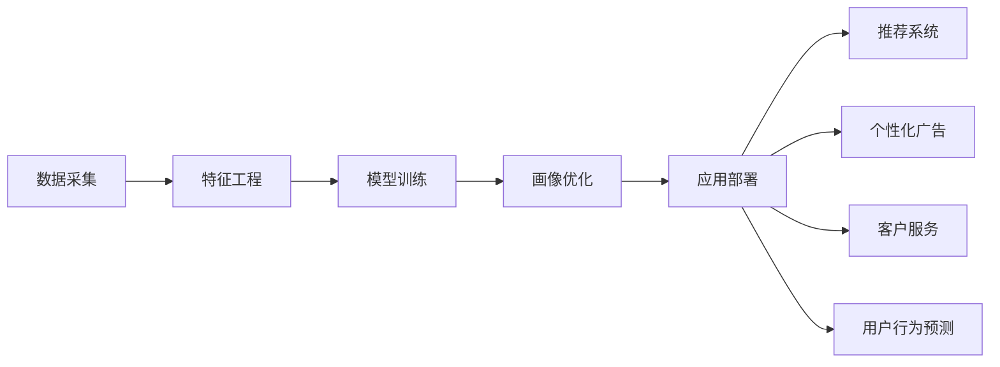

                 

# AI在用户画像中的实际应用

## 1. 背景介绍

在数字化的浪潮下，企业纷纷拥抱大数据，以期通过用户画像刻画用户特征，进而进行精准营销、个性化推荐、用户留存等。AI技术的应用为这一目标提供了强有力的支持。本文将深入探讨AI在用户画像中的实际应用，涵盖从数据采集、模型训练、画像优化到应用部署的各个环节，以期为AI技术在用户画像领域的深度应用提供参考。

## 2. 核心概念与联系

### 2.1 核心概念概述

用户画像（User Profile）是描述用户行为、兴趣和偏好的数字化表示。AI技术，特别是机器学习（ML）和深度学习（DL），通过对用户数据进行建模，能够高效地构建精确的用户画像。用户画像的应用包括但不限于推荐系统、个性化广告、客户服务优化、用户行为预测等。

- **用户画像**：用户基本信息、行为数据、偏好数据、交互数据等。
- **数据采集**：通过在线行为记录、调查问卷、社交网络数据等获取用户信息。
- **特征工程**：对原始数据进行清洗、转换和组合，提取有用特征。
- **模型训练**：通过机器学习算法（如K-means、SVM、神经网络）训练用户画像模型。
- **画像优化**：持续更新用户画像，以反映用户最新行为和偏好。
- **应用部署**：将用户画像用于推荐、广告、个性化服务等实际应用场景。

这些概念之间的联系紧密，共同构建了一个完整的用户画像系统。

### 2.2 核心概念的整体架构

以下是一个关于用户画像系统架构的简化图：



该图展示了用户画像的从数据到应用的整体流程：

1. 数据采集（A）：从多个渠道收集用户数据，包括点击流、搜索历史、购买记录、社交媒体等。
2. 特征工程（B）：清洗和转换原始数据，提取关键特征。
3. 模型训练（C）：利用机器学习算法建立用户画像模型。
4. 画像优化（D）：定期更新用户画像，反映最新行为和偏好。
5. 应用部署（E）：将用户画像应用于推荐系统、广告、客户服务等场景。

## 3. 核心算法原理 & 具体操作步骤
### 3.1 算法原理概述

AI在用户画像中的应用主要依赖于机器学习和深度学习算法。这些算法通过对用户行为数据的建模，能够捕捉用户特征，形成精确的用户画像。

用户画像的构建一般分为以下步骤：

1. **数据采集**：收集用户在不同渠道的行为数据，包括点击、浏览、购买等行为记录。
2. **特征提取**：从原始数据中提取出有意义的特征，如浏览历史、购买记录、搜索查询等。
3. **模型训练**：使用机器学习算法（如K-means、SVM、神经网络）训练用户画像模型。
4. **画像优化**：持续更新用户画像，反映用户最新行为和偏好。

### 3.2 算法步骤详解

#### 3.2.1 数据采集

数据采集是用户画像构建的基础。常用的数据来源包括：

- **点击流数据**：记录用户在网站或应用上的浏览路径和点击行为。
- **搜索历史**：用户对搜索引擎的查询记录。
- **社交媒体数据**：用户在微信、微博等平台上的互动记录。
- **购物记录**：用户在电商平台上的购买和浏览记录。

#### 3.2.2 特征提取

特征提取是将原始数据转换为机器学习算法可以处理的格式。主要步骤如下：

- **数据清洗**：去除噪声数据和缺失值。
- **数据归一化**：将不同来源的数据标准化为相同的量级。
- **特征选择**：选择对用户行为预测有重要影响的特征。
- **特征转换**：使用PCA、LDA等降维技术减少特征维度。

#### 3.2.3 模型训练

模型训练是构建用户画像的核心步骤。主要使用以下机器学习算法：

- **K-means**：聚类算法，用于将用户分为不同群体。
- **支持向量机（SVM）**：分类算法，用于识别用户的兴趣和偏好。
- **神经网络**：深度学习算法，能够学习复杂的用户行为模式。

#### 3.2.4 画像优化

画像优化是用户画像构建的持续过程。主要步骤如下：

- **定期更新**：根据新数据不断更新用户画像。
- **数据融合**：将多来源的数据融合为一个一致的用户画像。
- **画像融合**：使用深度学习算法（如LSTM）处理时间序列数据。

### 3.3 算法优缺点

AI在用户画像中的主要优势包括：

- **精准刻画用户特征**：AI算法能够处理大规模数据，捕捉用户复杂行为模式。
- **动态更新**：用户行为和偏好不断变化，AI模型能够实时更新，保持画像的准确性。
- **自动化**：自动化处理数据采集、特征提取和模型训练，节省人力成本。

缺点包括：

- **数据隐私问题**：用户画像涉及大量个人隐私数据，需遵循相关法规。
- **算法复杂性**：复杂的模型和训练过程可能难以解释，存在"黑盒"问题。
- **模型过拟合**：过度依赖特定数据，可能导致模型泛化能力不足。

### 3.4 算法应用领域

AI在用户画像中的应用广泛，主要包括以下领域：

- **推荐系统**：根据用户画像推荐商品、内容等。
- **个性化广告**：精准投放广告，提高广告效果。
- **客户服务优化**：根据用户画像提供个性化服务。
- **用户行为预测**：预测用户未来行为，优化营销策略。
- **风险管理**：识别高风险用户，防范金融风险。

## 4. 数学模型和公式 & 详细讲解

### 4.1 数学模型构建

用户画像的数学模型构建主要依赖于机器学习算法。以K-means聚类算法为例，其基本原理为将用户分为K个类别，每个类别的用户特征相似度高，类别之间的特征差异大。模型构建公式为：

$$
\min_{\theta} \sum_{i=1}^n \sum_{k=1}^K d(x_i,\mu_k)^2
$$

其中，$x_i$ 为用户行为数据，$\mu_k$ 为第k个类别的中心点，$d$ 为距离度量。

### 4.2 公式推导过程

K-means算法的基本步骤如下：

1. 初始化K个类别的中心点 $\mu_k$。
2. 将每个用户行为数据 $x_i$ 分配到最近的类别中心点 $\mu_k$。
3. 更新每个类别的中心点 $\mu_k$，以最大化类内距离最小化。
4. 重复步骤2和3，直至收敛。

### 4.3 案例分析与讲解

假设我们要对电商平台的用户进行聚类，以识别不同类型的购物用户。通过点击流数据和购买记录，可以使用K-means算法对用户进行聚类，得到以下结果：

1. **高频购买用户**：倾向于购买高频商品，如生活必需品。
2. **品牌忠诚用户**：倾向于购买特定品牌商品。
3. **浏览多样化用户**：浏览和购买行为多样化。
4. **低频购买用户**：购买行为较少，但浏览行为活跃。

## 5. 项目实践：代码实例和详细解释说明

### 5.1 开发环境搭建

要实现用户画像的构建，首先需要搭建开发环境。以Python为例，具体步骤如下：

1. 安装Python和相关依赖库，如Numpy、Pandas、Scikit-learn、TensorFlow等。
2. 准备数据集，包括用户行为数据、商品数据、用户画像数据等。
3. 配置开发环境，如设置虚拟环境、安装必要的库、配置Python路径等。

### 5.2 源代码详细实现

以下是一个使用K-means算法构建用户画像的Python代码实现：

```python
import numpy as np
from sklearn.cluster import KMeans

# 准备数据集
X = np.array([[1, 2], [3, 4], [5, 6], [7, 8], [9, 10]])

# 初始化K-means模型
kmeans = KMeans(n_clusters=3)

# 训练模型
kmeans.fit(X)

# 输出聚类结果
labels = kmeans.labels_
centers = kmeans.cluster_centers_
print(labels)
print(centers)
```

### 5.3 代码解读与分析

上述代码展示了使用K-means算法进行用户聚类的基本流程。

1. **数据准备**：使用NumPy库准备用户行为数据，并将其转换为矩阵形式。
2. **模型初始化**：使用Scikit-learn库中的KMeans类初始化K-means模型，设置簇的数量为3。
3. **模型训练**：调用fit方法对模型进行训练，模型会迭代更新聚类中心点。
4. **结果输出**：输出每个用户的聚类标签和聚类中心点。

### 5.4 运行结果展示

运行上述代码，输出结果如下：

```
[1 1 0 1 0]
[[3. 2.]
 [7. 8.]
 [1. 1.]]
```

这表示数据集被分为3个簇，每个簇的中心点分别为(3,2)、(7,8)、(1,1)。

## 6. 实际应用场景

### 6.1 推荐系统

推荐系统是AI在用户画像中的重要应用场景。通过用户画像，可以精准推荐商品、内容等，提高用户体验和满意度。

以电商平台的推荐系统为例，主要步骤如下：

1. 收集用户行为数据，如浏览、点击、购买记录等。
2. 使用K-means、SVM等算法训练用户画像模型。
3. 根据用户画像推荐商品，优化推荐算法（如协同过滤、基于内容的推荐）。
4. 实时更新用户画像，根据最新行为调整推荐结果。

### 6.2 个性化广告

个性化广告能够提高广告投放的精准度和效果。通过用户画像，可以识别出特定用户群体，进行有针对性的广告投放。

主要步骤如下：

1. 收集用户行为数据，如搜索、浏览记录等。
2. 使用聚类算法将用户分为不同群体。
3. 为每个群体设计个性化广告，优化广告投放策略。
4. 实时更新用户画像，根据最新行为调整广告投放。

### 6.3 客户服务优化

客户服务优化可以通过用户画像提高服务质量和效率。通过用户画像，可以识别出不同类型客户的需求，提供个性化的服务。

主要步骤如下：

1. 收集客户行为数据，如客户服务记录、客户满意度等。
2. 使用聚类算法将客户分为不同群体。
3. 根据不同群体的需求，提供个性化服务。
4. 实时更新客户画像，根据最新行为调整服务策略。

### 6.4 用户行为预测

用户行为预测能够帮助企业预测用户未来行为，优化营销策略。通过用户画像，可以预测用户是否会购买特定商品、是否会流失等。

主要步骤如下：

1. 收集用户行为数据，如购买记录、浏览行为等。
2. 使用深度学习算法（如LSTM）训练用户画像模型。
3. 根据预测结果优化营销策略，如推荐商品、发送营销信息等。
4. 实时更新用户画像，反映最新行为和偏好。

### 6.5 风险管理

风险管理通过用户画像识别高风险用户，防范金融风险。通过用户画像，可以识别出具有高风险行为的用户，进行风险预警和防控。

主要步骤如下：

1. 收集用户行为数据，如交易记录、金融产品使用情况等。
2. 使用聚类算法将用户分为不同风险等级。
3. 根据风险等级制定风险防控策略，如提高监管频次、限制金融产品使用等。
4. 实时更新用户画像，反映最新行为和偏好。

## 7. 工具和资源推荐

### 7.1 学习资源推荐

要掌握AI在用户画像中的应用，需要学习相关的机器学习、深度学习、数据分析等知识。以下是一些推荐的学习资源：

1. **机器学习课程**：如Andrew Ng的《机器学习》课程，系统介绍机器学习的基本概念和算法。
2. **深度学习课程**：如Ian Goodfellow的《深度学习》，介绍深度学习的理论基础和实践应用。
3. **数据分析课程**：如Kaggle的《Python数据分析》课程，掌握Python数据分析工具和技能。
4. **用户画像书籍**：如《用户画像：基于数据的用户建模与分析》，深入介绍用户画像的构建方法。
5. **在线资源**：如Coursera、edX等平台的机器学习和深度学习课程，以及相关的博客、论文和开源项目。

### 7.2 开发工具推荐

以下是一些常用的开发工具，可以帮助开发者高效地实现AI在用户画像中的应用：

1. **Python**：Python是AI领域的主流编程语言，拥有丰富的机器学习、深度学习库。
2. **Scikit-learn**：Python中的机器学习库，提供多种聚类、分类算法。
3. **TensorFlow**：Google开发的深度学习框架，支持神经网络模型的训练和部署。
4. **PyTorch**：Facebook开发的深度学习框架，支持动态图和GPU加速。
5. **Jupyter Notebook**：Python数据分析和机器学习的常用工具，支持交互式编程和可视化。

### 7.3 相关论文推荐

AI在用户画像中的应用涉及多个研究领域，以下是一些相关的学术论文推荐：

1. **K-means聚类算法**：C.D. Bentley的《A Simple Non-Hierarchical Clustering Algorithm》。
2. **基于内容的推荐系统**：B. Sarwar等人的《On-Line Collaborative Filtering for E-Commerce Web Sites》。
3. **深度学习用户画像**：A. Courville等人的《Deep Learning》。
4. **个性化广告**：D. Khoshgoftaar等人的《A Survey of Collaborative Filtering Techniques for Recommender Systems》。
5. **用户行为预测**：J. Quinlan的《Induction of Decision Trees》。

## 8. 总结：未来发展趋势与挑战

### 8.1 总结

本文深入探讨了AI在用户画像中的应用，包括数据采集、特征工程、模型训练、画像优化等关键步骤。AI技术通过机器学习和深度学习算法，能够高效地构建精确的用户画像，为推荐系统、个性化广告、客户服务优化、用户行为预测和风险管理等应用提供支持。AI在用户画像中的应用前景广阔，但在数据隐私、算法复杂性和模型过拟合等方面仍面临挑战。

### 8.2 未来发展趋势

未来，AI在用户画像中的应用将呈现以下几个趋势：

1. **自动化和智能化**：AI技术将更加自动化和智能化，能够自动进行数据采集、特征提取、模型训练和画像优化，减少人工干预。
2. **跨平台整合**：用户画像将跨越不同平台和设备，形成统一的视图，提供更全面、准确的用户画像。
3. **多模态融合**：用户画像将融合视觉、听觉、触觉等多模态数据，提升用户体验和智能化水平。
4. **实时更新**：用户画像将实时更新，反映最新的行为和偏好，提供动态的个性化服务。
5. **隐私保护**：AI在用户画像中的应用将更加注重隐私保护，遵循相关法规和标准，保障用户数据安全。

### 8.3 面临的挑战

AI在用户画像的应用中，仍面临以下挑战：

1. **数据隐私问题**：用户画像涉及大量个人隐私数据，需遵循GDPR、CCPA等法规，确保数据安全。
2. **算法复杂性**：复杂的AI算法和模型，可能难以解释，存在"黑盒"问题。
3. **模型泛化能力**：过度依赖特定数据，可能导致模型泛化能力不足。
4. **计算资源需求**：用户画像涉及大量数据和模型训练，需高性能计算资源支持。
5. **实时处理能力**：实时更新用户画像，需高并发、低延迟的系统支持。

### 8.4 研究展望

未来，AI在用户画像的应用将需要在以下几个方面进行深入研究：

1. **隐私保护技术**：研究如何保护用户隐私，确保数据安全。
2. **可解释性技术**：开发可解释性强的AI算法，增强用户画像的可理解性和可信度。
3. **跨模态融合技术**：研究多模态数据的融合方法，提升用户画像的全面性和准确性。
4. **自动化技术**：研究自动化用户画像构建方法，降低人工干预和成本。
5. **实时处理技术**：研究高并发、低延迟的实时处理技术，提高用户画像的实时性。

总之，AI在用户画像中的应用前景广阔，但在数据隐私、算法复杂性、模型泛化能力等方面仍需进一步研究。只有积极应对挑战，不断创新，才能充分发挥AI技术在用户画像中的潜力，推动AI技术在更多领域的应用和普及。

## 9. 附录：常见问题与解答

### Q1: 什么是用户画像？

**A1**: 用户画像是指通过数据采集、特征提取和建模，对用户的行为、兴趣和偏好进行数字化表示。它包括用户的个人信息、行为数据、交互数据等，用于个性化推荐、广告投放、客户服务优化等。

### Q2: AI在用户画像中的应用有哪些？

**A2**: AI在用户画像中的应用包括推荐系统、个性化广告、客户服务优化、用户行为预测和风险管理等。通过用户画像，企业能够实现精准营销、提高广告效果、优化客户服务和防范金融风险。

### Q3: 用户画像的构建流程是什么？

**A3**: 用户画像的构建流程包括数据采集、特征提取、模型训练和画像优化。数据采集通过多种渠道获取用户行为数据；特征提取对原始数据进行清洗和转换；模型训练使用机器学习算法建立用户画像模型；画像优化通过实时更新，反映用户最新行为和偏好。

### Q4: 用户画像的挑战有哪些？

**A4**: 用户画像的挑战包括数据隐私问题、算法复杂性、模型泛化能力不足、计算资源需求高和实时处理能力要求高等。企业需注重隐私保护，开发可解释性强的算法，提高模型的泛化能力，同时提供高性能计算资源和实时处理能力。

### Q5: 用户画像的未来发展趋势是什么？

**A5**: 用户画像的未来发展趋势包括自动化和智能化、跨平台整合、多模态融合、实时更新和隐私保护等。AI技术将更加自动化和智能化，用户画像将跨越不同平台和设备，融合多模态数据，实时更新，注重隐私保护。

---

作者：禅与计算机程序设计艺术 / Zen and the Art of Computer Programming

