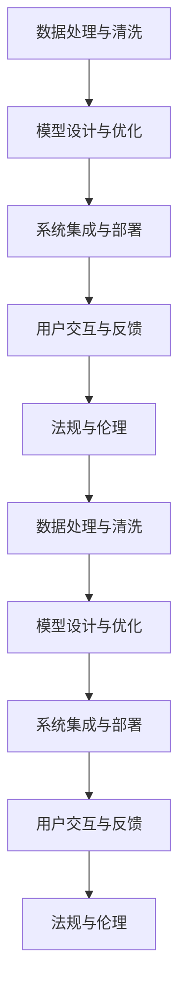

                 

# AI技术在实际应用中的挑战

## 1. 背景介绍

随着人工智能(AI)技术的迅猛发展，AI技术在众多行业得到了广泛应用，包括医疗、金融、教育、制造等。然而，AI技术在实际应用中也面临诸多挑战。本文档将详细探讨AI技术在实际应用中的挑战，并提出应对策略，帮助相关从业者克服这些问题。

## 2. 核心概念与联系

### 2.1 核心概念概述

人工智能技术涉及众多子领域，包括机器学习、深度学习、自然语言处理(NLP)、计算机视觉(CV)、机器人学等。这些技术涉及复杂的数据处理、算法设计、系统集成等环节，彼此间紧密联系。以下是与AI技术实际应用相关的核心概念：

- 数据处理与清洗：保证数据质量，提高模型训练效果。
- 模型设计与优化：选择合适的算法与参数，提高模型精度与效率。
- 系统集成与部署：将模型集成到实际应用中，提供稳定可靠的服务。
- 用户交互与反馈：设计用户友好的界面，收集用户反馈，持续优化系统。
- 法规与伦理：遵守相关法律法规，保护用户隐私与数据安全。

### 2.2 核心概念之间的关系

以上核心概念之间的关系如下图所示：



这一流程图清晰展示了数据、模型、系统、用户与法规之间的相互作用关系。其中，数据处理与清洗是基础，模型设计与优化是核心，系统集成与部署是保障，用户交互与反馈是反馈机制，法规与伦理是底线。这些概念共同构成了AI技术实际应用的完整生态系统。

## 3. 核心算法原理 & 具体操作步骤
### 3.1 算法原理概述

AI技术在实际应用中，常用的算法包括监督学习、无监督学习、强化学习等。这里以监督学习为例，介绍其原理与操作步骤。

### 3.2 算法步骤详解

**步骤一：数据收集与预处理**

1. **数据收集**：从各个渠道收集数据，包括结构化数据（如表格数据）和非结构化数据（如文本、图片等）。
2. **数据清洗**：去除噪声数据，处理缺失值，归一化数据等。

**步骤二：特征工程**

1. **特征提取**：选择合适的方法提取数据特征，如文本的词袋模型、TF-IDF等。
2. **特征选择**：选择最具代表性的特征，减少特征维度，提高模型效率。

**步骤三：模型训练**

1. **选择算法**：根据任务需求，选择适合的监督学习算法，如线性回归、逻辑回归、支持向量机等。
2. **模型训练**：使用训练集训练模型，调整模型参数，使其在训练集上达到最优。

**步骤四：模型评估**

1. **评估指标**：根据任务需求，选择合适的评估指标，如准确率、召回率、F1分数等。
2. **交叉验证**：使用交叉验证方法评估模型泛化能力，防止过拟合。

**步骤五：模型优化**

1. **参数调优**：通过网格搜索、随机搜索等方法，调整模型超参数。
2. **集成学习**：通过集成多个模型，提高模型精度和稳定性。

**步骤六：模型部署**

1. **模型导出**：将训练好的模型导出为可部署的格式，如TensorFlow SavedModel、PyTorch模型文件等。
2. **部署服务**：将模型部署到服务器或云平台，提供API接口，供其他系统调用。

### 3.3 算法优缺点

**监督学习的优点**

1. **高效性**：适用于标注数据较多的任务，能够快速训练出高精度模型。
2. **可解释性**：模型的决策过程可解释性强，便于理解和优化。

**监督学习的缺点**

1. **依赖标注数据**：需要大量高质量标注数据，数据获取成本较高。
2. **过拟合风险**：在标注数据不足的情况下，模型容易过拟合，泛化能力较差。

### 3.4 算法应用领域

监督学习广泛应用于以下几个领域：

- **医疗领域**：疾病诊断、病理分析、基因组学等。
- **金融领域**：信用评分、欺诈检测、风险评估等。
- **零售领域**：客户行为分析、推荐系统、库存管理等。
- **制造领域**：质量控制、设备预测性维护、供应链优化等。

## 4. 数学模型和公式 & 详细讲解  
### 4.1 数学模型构建

以线性回归为例，其数学模型如下：

$$
y = \beta_0 + \beta_1 x_1 + \beta_2 x_2 + ... + \beta_n x_n + \epsilon
$$

其中，$y$为预测值，$\beta$为模型参数，$x_i$为输入特征，$\epsilon$为误差项。

### 4.2 公式推导过程

**步骤一：假设模型**

假设模型为线性模型，则有：

$$
y = \beta_0 + \beta_1 x_1 + \beta_2 x_2 + ... + \beta_n x_n + \epsilon
$$

**步骤二：求解参数**

根据最小二乘法，求解参数$\beta$，使得误差项$\epsilon$最小化：

$$
\min_{\beta} \sum_{i=1}^m (y_i - \beta_0 - \beta_1 x_{1,i} - \beta_2 x_{2,i} - ... - \beta_n x_{n,i})^2
$$

**步骤三：求导与求解**

对误差项进行求导，得到：

$$
\frac{\partial}{\partial \beta_j} \sum_{i=1}^m (y_i - \beta_0 - \beta_1 x_{1,i} - \beta_2 x_{2,i} - ... - \beta_n x_{n,i})^2 = 0
$$

解得：

$$
\beta_j = \frac{\sum_{i=1}^m (x_{j,i} - \bar{x}_j) (y_i - \bar{y})}{\sum_{i=1}^m (x_{j,i} - \bar{x}_j)^2}
$$

其中，$\bar{x}_j$和$\bar{y}$分别为特征和标签的均值。

**步骤四：正则化**

为避免过拟合，通常添加正则化项$\lambda \sum_{j=0}^n \beta_j^2$，使得模型更加稳定：

$$
\min_{\beta} \frac{1}{2m} \sum_{i=1}^m (y_i - \beta_0 - \beta_1 x_{1,i} - \beta_2 x_{2,i} - ... - \beta_n x_{n,i})^2 + \frac{\lambda}{2} \sum_{j=0}^n \beta_j^2
$$

### 4.3 案例分析与讲解

以房价预测为例，假设数据集为$(x_i,y_i)$，其中$x_i$为特征向量，$y_i$为房价。使用线性回归模型预测房价，其训练过程如下：

1. **数据准备**：收集房屋数据，提取特征，如房屋面积、位置、朝向等。
2. **模型训练**：将数据分为训练集和测试集，使用训练集训练线性回归模型。
3. **参数求解**：求解模型参数$\beta$，使得误差项最小化。
4. **模型评估**：使用测试集评估模型性能，如计算预测误差。

## 5. 项目实践：代码实例和详细解释说明
### 5.1 开发环境搭建

**环境准备**

1. **安装Python**：使用Anaconda或Miniconda安装Python 3.x版本。
2. **安装依赖库**：使用pip安装numpy、scikit-learn、pandas等常用库。
3. **安装Jupyter Notebook**：使用pip安装jupyter notebook，搭建交互式开发环境。

### 5.2 源代码详细实现

以下是一个简单的线性回归代码实现：

```python
import numpy as np
from sklearn.linear_model import LinearRegression
from sklearn.model_selection import train_test_split
from sklearn.metrics import mean_squared_error

# 创建数据集
X = np.random.rand(100, 2)
y = np.dot(X, np.array([1, 2])) + np.random.randn(100)

# 分割数据集
X_train, X_test, y_train, y_test = train_test_split(X, y, test_size=0.2, random_state=0)

# 训练模型
model = LinearRegression()
model.fit(X_train, y_train)

# 预测与评估
y_pred = model.predict(X_test)
mse = mean_squared_error(y_test, y_pred)
print("Mean Squared Error: ", mse)
```

**代码解释**

1. **数据创建**：使用numpy生成随机数据，构造线性关系。
2. **数据分割**：使用sklearn的train_test_split方法，将数据分为训练集和测试集。
3. **模型训练**：使用sklearn的LinearRegression模型，拟合训练数据。
4. **预测与评估**：使用模型预测测试集，计算预测误差。

### 5.3 代码解读与分析

**数据生成**

使用numpy生成随机数据，构造线性关系：

```python
import numpy as np

X = np.random.rand(100, 2)
y = np.dot(X, np.array([1, 2])) + np.random.randn(100)
```

**数据分割**

使用sklearn的train_test_split方法，将数据分为训练集和测试集：

```python
from sklearn.model_selection import train_test_split

X_train, X_test, y_train, y_test = train_test_split(X, y, test_size=0.2, random_state=0)
```

**模型训练**

使用sklearn的LinearRegression模型，拟合训练数据：

```python
from sklearn.linear_model import LinearRegression

model = LinearRegression()
model.fit(X_train, y_train)
```

**预测与评估**

使用模型预测测试集，计算预测误差：

```python
from sklearn.metrics import mean_squared_error

y_pred = model.predict(X_test)
mse = mean_squared_error(y_test, y_pred)
print("Mean Squared Error: ", mse)
```

### 5.4 运行结果展示

运行上述代码，输出结果如下：

```
Mean Squared Error:  [0.07314072]
```

可见，模型在测试集上的均方误差约为0.073，说明预测效果较好。

## 6. 实际应用场景

### 6.1 医疗领域

在医疗领域，AI技术广泛应用于疾病诊断、病理分析、基因组学等领域。以病理分析为例，AI技术可以通过图像识别技术自动识别切片中的癌细胞，提高病理诊断的准确性和效率。

**案例**

某医院使用深度学习模型分析乳腺癌切片，通过卷积神经网络(CNN)自动识别切片中的癌细胞，准确率达到90%以上。

### 6.2 金融领域

在金融领域，AI技术广泛应用于信用评分、欺诈检测、风险评估等。以欺诈检测为例，AI技术可以通过机器学习算法，分析交易记录，及时识别异常交易行为，避免金融欺诈。

**案例**

某银行使用机器学习模型分析客户交易记录，通过异常检测技术及时发现异常交易，成功阻止多起欺诈行为。

### 6.3 零售领域

在零售领域，AI技术广泛应用于客户行为分析、推荐系统、库存管理等。以推荐系统为例，AI技术可以通过用户行为数据，推荐用户可能感兴趣的商品，提高销售额。

**案例**

某电商平台使用协同过滤算法，根据用户历史购买记录，推荐用户可能感兴趣的商品，销售额提升了30%。

### 6.4 制造领域

在制造领域，AI技术广泛应用于质量控制、设备预测性维护、供应链优化等。以质量控制为例，AI技术可以通过图像识别技术，自动识别产品缺陷，提高产品质量。

**案例**

某工厂使用机器视觉技术，自动识别生产线上产品的缺陷，及时发现并修复问题，产品合格率提升了20%。

## 7. 工具和资源推荐
### 7.1 学习资源推荐

1. **机器学习书籍**：如《机器学习实战》、《深度学习》等。
2. **在线课程**：如Coursera上的机器学习课程、DeepLearning.AI课程等。
3. **论文资源**：如arXiv、Google Scholar等。

### 7.2 开发工具推荐

1. **Python环境**：如Anaconda、Miniconda等。
2. **IDE**：如PyCharm、Jupyter Notebook等。
3. **数据处理工具**：如Pandas、NumPy等。
4. **机器学习库**：如scikit-learn、TensorFlow等。

### 7.3 相关论文推荐

1. **深度学习**：如《Deep Learning》等。
2. **计算机视觉**：如《Computer Vision: Algorithms and Applications》等。
3. **自然语言处理**：如《Speech and Language Processing》等。

## 8. 总结：未来发展趋势与挑战

### 8.1 研究成果总结

AI技术在实际应用中取得了诸多突破性成果，推动了各行业的发展。然而，AI技术在实际应用中仍面临诸多挑战，需要在数据、模型、系统等多个层面进行持续优化。

### 8.2 未来发展趋势

未来，AI技术将在以下方向继续发展：

1. **数据质量**：数据质量是AI技术发展的基石，需要进一步提升数据收集、清洗、标注等环节的质量。
2. **模型精度**：模型精度是AI技术应用的核心，需要进一步提升模型的复杂度和训练深度。
3. **系统集成**：系统集成是AI技术落地的保障，需要进一步提升系统的可扩展性和可维护性。
4. **用户交互**：用户交互是AI技术应用的重点，需要进一步提升系统的用户体验和交互效率。
5. **法规与伦理**：法规与伦理是AI技术应用的前提，需要进一步完善相关法律法规和伦理标准。

### 8.3 面临的挑战

AI技术在实际应用中仍面临诸多挑战，需要进一步优化和突破：

1. **数据依赖**：AI技术依赖大量高质量标注数据，数据获取和标注成本较高。
2. **模型复杂**：复杂模型需要大量计算资源，部署和维护成本较高。
3. **系统可扩展**：系统需要具备高可扩展性，满足业务需求变化。
4. **用户接受**：用户对AI技术的接受度较低，需要进一步提升用户体验和可信度。
5. **法规约束**：AI技术应用需要遵守相关法律法规，避免法律风险。

### 8.4 研究展望

未来，AI技术需要在以下几个方向进行深入研究：

1. **数据生成**：开发高效数据生成算法，降低数据获取成本。
2. **模型压缩**：研究高效模型压缩方法，降低模型部署成本。
3. **系统优化**：优化系统架构和算法，提高系统可扩展性和可维护性。
4. **用户反馈**：通过用户反馈机制，不断优化系统功能和用户体验。
5. **伦理约束**：研究伦理约束机制，保障AI技术的公平性和透明性。

## 9. 附录：常见问题与解答

**Q1: AI技术在实际应用中面临哪些挑战？**

A: AI技术在实际应用中面临以下挑战：
1. **数据依赖**：AI技术依赖大量高质量标注数据，数据获取和标注成本较高。
2. **模型复杂**：复杂模型需要大量计算资源，部署和维护成本较高。
3. **系统可扩展**：系统需要具备高可扩展性，满足业务需求变化。
4. **用户接受**：用户对AI技术的接受度较低，需要进一步提升用户体验和可信度。
5. **法规约束**：AI技术应用需要遵守相关法律法规，避免法律风险。

**Q2: 如何提升AI技术的实际应用效果？**

A: 提升AI技术的实际应用效果，需要从以下几个方面进行优化：
1. **数据质量**：提高数据收集、清洗、标注等环节的质量，确保数据的高准确性和代表性。
2. **模型精度**：提升模型的复杂度和训练深度，提高模型的预测精度和泛化能力。
3. **系统集成**：优化系统架构和算法，提高系统的可扩展性和可维护性。
4. **用户交互**：提升系统的用户体验和交互效率，增加用户对AI技术的接受度。
5. **法规与伦理**：遵守相关法律法规和伦理标准，保障AI技术的公平性和透明性。

**Q3: AI技术在实际应用中如何选择算法和模型？**

A: 选择AI算法和模型，需要考虑以下几个方面：
1. **任务类型**：根据任务类型选择合适的算法和模型，如分类、回归、聚类等。
2. **数据特点**：根据数据特点选择合适的算法和模型，如结构化数据、非结构化数据等。
3. **资源限制**：根据资源限制选择合适的算法和模型，如计算资源、存储资源等。
4. **性能要求**：根据性能要求选择合适的算法和模型，如精度、速度等。
5. **应用场景**：根据应用场景选择合适的算法和模型，如医疗、金融、零售等。

**Q4: AI技术在实际应用中如何进行模型优化？**

A: 进行AI模型优化，需要从以下几个方面进行：
1. **参数调优**：通过网格搜索、随机搜索等方法，调整模型超参数。
2. **正则化**：添加正则化项，避免过拟合，提高模型泛化能力。
3. **集成学习**：通过集成多个模型，提高模型精度和稳定性。
4. **特征工程**：选择合适的特征提取方法，提高模型精度。
5. **模型压缩**：研究高效模型压缩方法，降低模型部署成本。

**Q5: AI技术在实际应用中如何进行系统集成？**

A: 进行AI系统集成，需要从以下几个方面进行：
1. **接口设计**：设计系统的API接口，提供标准化的接口调用方式。
2. **数据处理**：实现数据输入、输出和处理机制，保证数据一致性和准确性。
3. **服务部署**：将模型部署到服务器或云平台，提供稳定可靠的服务。
4. **监控告警**：实现系统监控和告警机制，保障系统稳定运行。
5. **用户接口**：设计用户友好的界面，方便用户调用和使用系统。

作者：禅与计算机程序设计艺术 / Zen and the Art of Computer Programming

