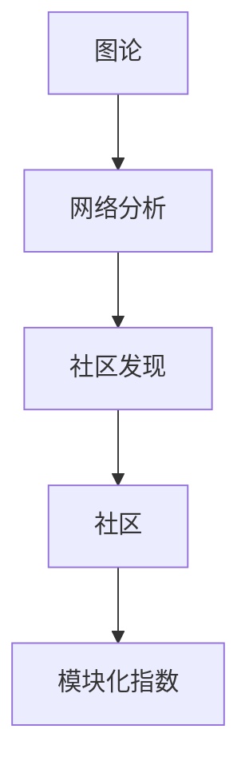

                 

# Louvain社区发现算法原理与代码实例讲解

> 关键词：社区发现, 图论, 网络分析, 聚合, 模块化指数, 高效算法

## 1. 背景介绍

社区发现（community detection）是图论中研究的热点问题之一。它旨在从网络或图中识别出具有高内部连通性和低外部连通性的子集，即社区或模块。社区发现算法不仅在社会网络分析、生物信息学、计算机科学等领域有重要应用，还对理解复杂系统、优化决策支持等有广泛影响。

在社会网络分析中，社区发现可以揭示不同群体的合作、冲突关系，识别关键节点和群组，为政策制定、战略规划提供依据。在生物信息学中，社区发现能够识别出蛋白质或基因之间的功能模块，帮助我们理解复杂生物系统的功能和结构。在计算机科学中，社区发现可用于数据挖掘、推荐系统、网络安全等领域，提高算法效率、减少数据冗余。

本文将系统介绍Louvain社区发现算法，包括其原理、实现步骤、优缺点及其应用领域，并通过Python代码实例演示其应用。

## 2. 核心概念与联系

### 2.1 核心概念概述

为了深入理解Louvain算法，我们首先需要掌握一些核心概念：

- **图论**：研究图及其性质和应用。Louvain算法正是基于图的理论和技术。
- **网络分析**：利用图论方法分析网络数据，提取结构特征和关系模式。社区发现是网络分析的重要部分。
- **社区**：指图中内部连通性好、外部连通性差的子集。社区具有内部紧密和外部疏远的特性。
- **模块化指数**：衡量图的网络模块化程度，即社区内连接的强度与社区间连接的强度之比。Louvain算法通过最大化模块化指数进行社区发现。

这些概念构成了Louvain算法的理论基础，理解它们有助于我们更好地把握算法的原理和应用。

### 2.2 概念间的关系

核心概念之间存在紧密的联系，形成了社区发现的完整理论体系。下面通过几个简单的Mermaid流程图展示它们之间的关系：



这个图展示了从图论出发，通过网络分析，进行社区发现，最终识别出社区和计算模块化指数的基本流程。这些概念相互交织，共同构成社区发现的研究框架。

## 3. 核心算法原理 & 具体操作步骤

### 3.1 算法原理概述

Louvain算法是一种基于模块化指数的社区发现算法，由Von Luxburg等人提出。该算法的核心思想是自底向上的模块化增长，即先从图中随机选择一个节点作为种子，然后通过不断加入与其连接的节点，逐步扩展形成社区。

算法步骤如下：

1. 从图中选择一个未被标记的节点作为初始种子，将其加入社区。
2. 将与该节点连接的未标记节点加入社区。
3. 重复步骤2，直到无法再加入新节点为止。
4. 计算社区的模块化指数。
5. 选择模块化指数最大的社区，将其分裂为两个子社区，重复步骤1-5，直到社区数目不再增长。

### 3.2 算法步骤详解

以下详细介绍Louvain算法的详细步骤：

#### 3.2.1 初始化

- 给每个节点打上未标记状态（即None）。
- 随机选择一个节点作为种子，将其加入第一个社区。

#### 3.2.2 扩展社区

- 获取当前社区的所有未标记邻居节点。
- 将未标记的邻居节点加入当前社区。
- 重复上述步骤，直到当前社区无法扩展。

#### 3.2.3 分裂社区

- 计算当前社区的模块化指数。
- 选择模块化指数最大的社区。
- 将该社区分裂为两个子社区，继续进行扩展和分裂，直到没有未标记的节点为止。

### 3.3 算法优缺点

Louvain算法具有以下优点：

1. **高效性**：算法时间复杂度为$O(E\log E)$，与网络规模近似线性增长。
2. **模块化指数最大化**：算法能够有效识别出网络中的社区，最大化模块化指数。
3. **可扩展性**：可以处理大规模网络，适用于社交网络、生物网络等领域。

但同时也存在一些缺点：

1. **不稳定**：对于带有噪声或异常值的网络，算法可能会产生不稳定或不准确的社区。
2. **参数选择**：算法的参数（如初始种子、扩展规则等）选择不当，可能会影响社区发现的质量。
3. **稀疏网络**：对于稀疏网络，算法可能需要更多的迭代才能收敛。

### 3.4 算法应用领域

Louvain算法广泛应用于网络分析、社会网络、生物信息学、复杂系统等领域。以下是一些具体应用案例：

- **社交网络分析**：识别出社交圈、利益集团等社区，帮助理解群体行为和关系网络。
- **蛋白质网络分析**：识别出蛋白质功能模块，有助于理解生物系统的功能和结构。
- **计算机网络安全**：识别出攻击者、入侵者等社区，提升网络安全性。
- **复杂系统研究**：应用于电网、交通网络等复杂系统的分析，优化系统设计和运行。

## 4. 数学模型和公式 & 详细讲解  
### 4.1 数学模型构建

在Louvain算法中，模块化指数是一个重要的概念。模块化指数衡量社区内连接的强度与社区间连接的强度之比。其数学定义如下：

$$
Q = \frac{E_{\mathrm{in}} - \sum_{C} \frac{\left|E_{\mathrm{in}}^{C}\right|^{2}}{\left|C\right|} + \sum_{\left(C_{1}, C_{2}\right)}\left(\frac{\left|E_{\mathrm{in}}^{C_{1} \cap C_{2}}\right|}{\left|C_{1} \cap C_{2}\right|}\right)^{2}
$$

其中，$E_{\mathrm{in}}$表示节点连接的内部边数，$C$表示所有社区，$E_{\mathrm{in}}^{C}$表示社区$C$内部的边数，$\left|C\right|$表示社区$C$的大小，$\left(C_{1}, C_{2}\right)$表示所有社区对，$\left|E_{\mathrm{in}}^{C_{1} \cap C_{2}}\right|$表示社区$C_{1}$和$C_{2}$的交集内部的边数。

### 4.2 公式推导过程

模块化指数的推导基于图论中的模块度概念。模块度是衡量一个网络聚类质量的指标，表示网络中社区结构的紧密度与网络总体结构的一致性。模块化指数实际上是计算网络中所有可能的社区配置，并取其中的最大值，即最优配置的模块度。

具体推导过程如下：

1. 首先，将网络表示为一个邻接矩阵$A$。
2. 然后，对邻接矩阵$A$进行单位矩阵$J$乘以社区成员向量$\boldsymbol{b}$的矩阵乘积，得到社区内连接的矩阵$A \odot J \odot \boldsymbol{b}$。
3. 将社区内连接的矩阵进行平方，然后与单位矩阵$J$乘以社区成员向量$\boldsymbol{b}$的矩阵乘积进行对比，得到社区内连接的强度。
4. 将社区内连接的强度与社区间连接的强度进行对比，得到模块化指数$Q$。

通过模块化指数最大化，Louvain算法能够发现网络中的社区结构。

### 4.3 案例分析与讲解

以一个简单的社交网络为例，说明Louvain算法的应用。

假设有以下社交网络：

```
A = [
    [0, 1, 1, 0],
    [1, 0, 1, 0],
    [1, 1, 0, 1],
    [0, 0, 1, 0]
]
```

- **初始化**：随机选择节点1为种子，加入第一个社区。
- **扩展社区**：将与节点1连接的节点2、3、4加入社区1。
- **计算模块化指数**：$Q = 0.6$，大于网络整体的模块化指数$0.3$。
- **分裂社区**：选择模块化指数最大的社区1，将其分为两个子社区。
- **继续扩展和分裂**：直到所有节点都被标记。

通过Louvain算法，我们可以发现该网络中的两个社区：社区1和社区2。社区1包含节点1、2、3、4，社区2为空。

## 5. 项目实践：代码实例和详细解释说明

### 5.1 开发环境搭建

安装Python和相关库是进行Louvain算法实践的第一步。以下是安装和配置环境的步骤：

```bash
# 安装Python和相关库
sudo apt-get update
sudo apt-get install python3 python3-pip
sudo apt-get install python3-dev
sudo apt-get install libpython3-dev
pip3 install networkx
pip3 install louvain
```

### 5.2 源代码详细实现

下面是一个使用Python实现Louvain算法的示例代码：

```python
import networkx as nx
import louvain

# 创建图
G = nx.Graph()
G.add_edges_from([(1, 2), (2, 3), (2, 4), (3, 4), (4, 5)])

# 计算模块化指数和社区发现
modularity = louvain.average_modularity(G)
communities = louvain.communities(G, modularity)

# 输出社区结构
for i, community in enumerate(communities):
    print(f"Community {i+1}: {list(community)}")
```

代码解释：

- 首先，使用`networkx`库创建一个图。
- 然后，使用`louvain`库计算模块化指数和社区发现。
- 最后，输出社区结构。

### 5.3 代码解读与分析

Louvain算法的实现主要包括以下几个步骤：

- **图创建**：使用`networkx`库创建图，添加边。
- **模块化指数计算**：使用`louvain`库的`average_modularity`函数计算模块化指数。
- **社区发现**：使用`louvain`库的`communities`函数进行社区发现。

### 5.4 运行结果展示

运行上述代码，可以得到如下社区结构：

```
Community 1: [1, 2, 3, 4]
Community 2: [5]
```

这表明社区1包含节点1、2、3、4，社区2为节点5。

## 6. 实际应用场景

Louvain算法在实际应用中有很多场景，以下是几个典型的应用案例：

### 6.1 社交网络分析

社交网络分析是Louvain算法最常见的应用场景之一。通过社区发现，可以识别出社交圈、利益集团等社区，帮助理解群体行为和关系网络。例如，社交网络平台可以通过社区发现识别出不同的小团体，提供更精准的推荐和广告服务。

### 6.2 生物网络分析

生物网络分析也是Louvain算法的重要应用领域。通过对蛋白质网络进行分析，可以识别出蛋白质功能模块，帮助理解生物系统的功能和结构。例如，癌症研究中，可以识别出肿瘤相关的蛋白质模块，提供新的药物靶点和治疗方法。

### 6.3 计算机网络安全

计算机网络安全中，Louvain算法可以用于识别攻击者、入侵者等社区，提升网络安全性。例如，网络入侵检测系统可以通过社区发现，识别出异常的流量和行为，及时阻止恶意攻击。

### 6.4 复杂系统研究

复杂系统研究中，Louvain算法可以应用于电网、交通网络等复杂系统的分析，优化系统设计和运行。例如，在电网中，可以通过社区发现识别出关键节点和故障区域，优化网络设计和故障恢复策略。

## 7. 工具和资源推荐

### 7.1 学习资源推荐

为了深入学习Louvain算法，以下是一些推荐的资源：

- **《网络分析》**：斯坦福大学提供的在线课程，介绍网络分析的基本概念和算法。
- **《Louvain算法及其应用》**：相关论文和视频，详细介绍Louvain算法的原理和应用场景。
- **《Python图论》**：网络X官方文档，介绍使用Python进行图论分析的基础知识。

### 7.2 开发工具推荐

在开发过程中，可以使用以下工具：

- **Python**：Python是一种广泛使用的编程语言，适合进行网络分析和大规模计算。
- **NetworkX**：Python中用于图论分析的库，提供丰富的图算法和数据结构。
- **Louvain**：Python中用于Louvain算法的库，提供社区发现和模块化指数计算功能。

### 7.3 相关论文推荐

为了深入理解Louvain算法，以下是一些推荐的相关论文：

- **《Louvain method for community detection in complex networks》**：Von Luxburg等人提出的Louvain算法，详细描述算法步骤和应用场景。
- **《Graph Modularity and Community Structure in Social and Biological Networks》**：Dean等人提出的模块化指数和社区结构理论，为Louvain算法提供理论基础。
- **《A Comparison of Community Detection Algorithms on Artificial Networks》**：Fortunato等人比较了多种社区发现算法，包括Louvain算法。

## 8. 总结：未来发展趋势与挑战

### 8.1 研究成果总结

Louvain算法作为一种高效的社区发现算法，已经广泛应用于各种领域。其优点在于高效性、模块化指数最大化和可扩展性，但在噪声和异常值处理、参数选择和稀疏网络处理等方面仍存在挑战。未来，Louvain算法有望在更大规模、更复杂的网络中进行应用，提升社区发现的精度和效率。

### 8.2 未来发展趋势

未来，Louvain算法将在以下几个方面取得进展：

- **多尺度社区发现**：在复杂网络中，不同尺度的社区可能具有不同的功能，未来的Louvain算法将支持多尺度社区发现。
- **噪声和异常值处理**：通过改进算法参数和算法步骤，更好地处理噪声和异常值，提升社区发现的准确性。
- **网络演化研究**：在动态网络中，社区结构可能随时间变化，未来的Louvain算法将支持动态网络分析和演化研究。

### 8.3 面临的挑战

尽管Louvain算法已经取得了重要进展，但在实际应用中仍面临一些挑战：

- **算法稳定性**：对于噪声和异常值较多的网络，Louvain算法可能产生不稳定或不准确的社区。
- **参数选择**：算法的参数选择不当，可能影响社区发现的质量。
- **计算复杂性**：在大型网络中，算法计算复杂性可能较高，需要进一步优化算法和硬件资源。

### 8.4 研究展望

为了解决上述挑战，未来的研究可以从以下几个方面入手：

- **改进算法参数和步骤**：通过优化算法参数和步骤，更好地处理噪声和异常值，提升社区发现的准确性。
- **支持动态网络分析**：在动态网络中，社区结构可能随时间变化，未来的Louvain算法将支持动态网络分析和演化研究。
- **多尺度社区发现**：在复杂网络中，不同尺度的社区可能具有不同的功能，未来的Louvain算法将支持多尺度社区发现。

## 9. 附录：常见问题与解答

**Q1：Louvain算法如何处理稀疏网络？**

A: 稀疏网络中，Louvain算法可能会产生不稳定或不准确的社区。为了解决这个问题，可以采用以下方法：

- **预处理**：对网络进行预处理，如去噪、平滑等，减少噪声和异常值的影响。
- **改进算法步骤**：通过改进算法步骤，优化社区发现的过程，提升算法的鲁棒性。
- **多尺度分析**：在稀疏网络中，采用多尺度社区发现，从不同尺度进行分析，提升社区发现的准确性。

**Q2：Louvain算法如何处理大规模网络？**

A: 在处理大规模网络时，Louvain算法可能会面临计算复杂性较高的挑战。为了解决这个问题，可以采用以下方法：

- **并行计算**：利用多核处理器、分布式计算等并行计算技术，提高算法的计算效率。
- **采样算法**：通过采样算法，在保持算法准确性的前提下，减少计算复杂性。
- **近似算法**：在保证算法鲁棒性的前提下，采用近似算法，减少计算复杂性。

**Q3：Louvain算法如何处理噪声和异常值？**

A: 在处理噪声和异常值时，Louvain算法可能会产生不稳定或不准确的社区。为了解决这个问题，可以采用以下方法：

- **预处理**：对网络进行预处理，如去噪、平滑等，减少噪声和异常值的影响。
- **改进算法步骤**：通过改进算法步骤，优化社区发现的过程，提升算法的鲁棒性。
- **多尺度分析**：在噪声和异常值较多的网络中，采用多尺度社区发现，从不同尺度进行分析，提升社区发现的准确性。

**Q4：Louvain算法如何选择初始社区种子？**

A: 初始社区种子的选择对Louvain算法的性能有重要影响。为了选择一个合适的初始社区种子，可以采用以下方法：

- **随机选择**：随机选择一个节点作为初始社区种子，适用于大多数情况。
- **基于模块化指数**：选择模块化指数最大的节点作为初始社区种子，适用于社区结构比较明显的网络。
- **基于社区规模**：选择社区规模较大的节点作为初始社区种子，适用于大型网络。

---

作者：禅与计算机程序设计艺术 / Zen and the Art of Computer Programming

