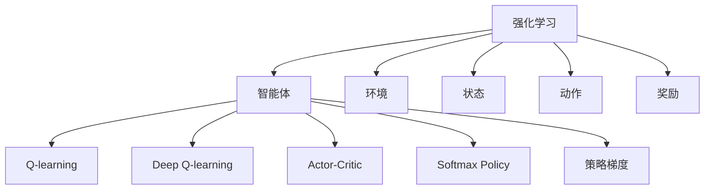

                 

## 1. 背景介绍

### 1.1 问题由来

强化学习（Reinforcement Learning, RL）是一种基于奖励信号的机器学习范式，它通过智能体（agent）与环境（environment）之间的交互，最大化累积奖励（cumulative reward）来训练智能体。近年来，强化学习在机器人和自动驾驶、游戏AI、推荐系统、自然语言处理等多个领域取得了显著的成果。

### 1.2 问题核心关键点

强化学习的核心在于如何设计一个智能体，使其在与环境交互的过程中，通过观察环境状态、执行动作、接收反馈信号（即奖励），逐步优化策略，最终实现最优控制。这一过程可以理解为智能体与环境的"博弈"过程。

### 1.3 问题研究意义

研究强化学习对于开发智能机器人、自动化决策系统、自适应控制、自动化交易等领域具有重要的意义。它使得计算机能够在没有明确指令的情况下，通过自主学习和优化，完成任务或决策。

## 2. 核心概念与联系

### 2.1 核心概念概述

- 强化学习（Reinforcement Learning, RL）：智能体通过与环境交互，最大化累积奖励的学习过程。强化学习是机器学习的一种重要分支，与监督学习和无监督学习不同，它依赖于环境反馈来学习。
- 智能体（Agent）：在强化学习中，智能体是学习的决策者，它通过观察环境状态，选择动作，并根据环境反馈调整策略。
- 环境（Environment）：智能体所处的动态变化的环境，它能够感知智能体的行为，并给予相应的奖励或惩罚。
- 状态（State）：环境的一种表示方式，智能体可以通过感知状态来推断环境状态。
- 动作（Action）：智能体能够采取的行动，可以是连续动作或离散动作。
- 奖励（Reward）：环境给予智能体的反馈信号，用于评估智能体的行为效果。
- Q-learning：一种基于值估计的强化学习算法，通过不断更新状态-动作值估计（Q-value）来优化策略。
- Deep Q-learning：将深度神经网络引入Q-learning，用神经网络逼近Q-value，提高学习的效率和泛化能力。
- Actor-Critic：一种结合值估计（Critic）和策略优化（Actor）的强化学习方法，通过分别优化状态值函数和策略函数，提高智能体的决策能力。
- Softmax Policy：一种基于概率的策略，用于指导智能体选择动作。
- 策略梯度（Policy Gradient）：通过优化策略函数，直接提升智能体的决策能力，避免了传统的值估计方法的梯度消失问题。

### 2.2 概念间的关系

这些核心概念之间的逻辑关系可以通过以下Mermaid流程图来展示：



这个流程图展示了我强化学习的核心概念以及它们之间的联系：

1. 强化学习通过智能体与环境交互，最大化累积奖励。
2. 智能体通过感知环境状态，选择动作，并根据环境反馈调整策略。
3. Q-learning、Deep Q-learning、Actor-Critic等方法都是用于优化智能体策略的强化学习算法。
4. Softmax Policy和策略梯度方法用于指导智能体选择动作，提升决策能力。

## 3. 核心算法原理 & 具体操作步骤

### 3.1 算法原理概述

强化学习的核心算法原理是通过智能体与环境之间的交互，逐步优化策略函数（Policy），以最大化累积奖励。通常，强化学习算法包含以下步骤：

1. 初始化环境，设置初始状态。
2. 智能体根据当前状态选择动作，并执行该动作。
3. 环境根据动作返回状态转移和奖励信号。
4. 智能体根据新的状态和奖励，更新策略函数。
5. 重复步骤2-4，直至满足预设停止条件。

### 3.2 算法步骤详解

#### 3.2.1 Q-learning算法

Q-learning是一种基于值估计的强化学习算法，通过不断更新状态-动作值估计（Q-value）来优化策略。其核心思想是：通过迭代更新状态值函数Q(s,a)，使得智能体在每个状态s下，采取动作a的价值最大。

Q-learning的具体步骤如下：

1. 初始化Q值表。通常将Q值初始化为0。
2. 智能体根据当前状态s选择动作a，并执行该动作。
3. 环境根据动作a返回状态转移s'和奖励r。
4. 根据Q-learning更新公式，更新Q值：

$$
Q(s,a) \leftarrow Q(s,a) + \alpha [r + \gamma \max Q(s',a')] - Q(s,a)
$$

其中，$\alpha$是学习率，$\gamma$是折扣因子，$a'$是状态s'下的最优动作，通过Q值表查询得到。

5. 将状态转移到s'，重复步骤2-4。

#### 3.2.2 Deep Q-learning算法

Deep Q-learning将深度神经网络引入Q-learning，用神经网络逼近Q-value，提高学习的效率和泛化能力。Deep Q-learning的流程如下：

1. 初始化神经网络Q(s,a)，通常采用多层感知机（MLP）或卷积神经网络（CNN）。
2. 智能体根据当前状态s选择动作a，并执行该动作。
3. 环境根据动作a返回状态转移s'和奖励r。
4. 根据Deep Q-learning更新公式，更新神经网络参数：

$$
\theta \leftarrow \theta - \alpha [r + \gamma Q(s',a',\theta) - Q(s,a,\theta)]
$$

其中，$\theta$表示神经网络参数，$Q(s',a',\theta)$表示在状态s'下，采取动作a'的预测Q值。

5. 将状态转移到s'，重复步骤2-4。

### 3.3 算法优缺点

强化学习的优点包括：

1. 适用于复杂环境：强化学习能够处理连续动作、高维状态空间等复杂问题，无需预处理即可直接进行学习。
2. 无需标注数据：强化学习不需要标注数据，只需要通过与环境交互，自动优化策略。
3. 通用性强：强化学习可用于各种领域，如游戏AI、自动驾驶、机器人控制等。

其缺点包括：

1. 学习速度慢：强化学习需要大量时间进行探索和试错，学习效率较低。
2. 难以避免局部最优：强化学习可能陷入局部最优，难以找到全局最优策略。
3. 不稳定性：强化学习可能受到环境噪声、动作执行延迟等因素的影响，导致性能波动。

### 3.4 算法应用领域

强化学习广泛应用于各种领域，如：

- 游戏AI：通过与游戏环境交互，自动学习最优游戏策略，实现自主游戏。
- 机器人控制：通过与机器人交互，学习最优控制策略，实现自主导航、操作等。
- 自动驾驶：通过与车辆和交通环境交互，学习最优驾驶策略，实现自动驾驶。
- 金融交易：通过与金融市场交互，学习最优交易策略，实现自动化交易。
- 自然语言处理：通过与语言模型交互，学习最优语言生成策略，实现自动摘要、对话系统等。

## 4. 数学模型和公式 & 详细讲解 & 举例说明

### 4.1 数学模型构建

在强化学习中，通常使用马尔可夫决策过程（Markov Decision Process, MDP）来建模智能体与环境之间的交互。MDP由状态空间S、动作空间A、状态转移概率P、奖励函数R等组成。

定义状态-动作值函数Q(s,a)，表示在状态s下，采取动作a的Q值。Q函数满足以下贝尔曼方程：

$$
Q(s,a) = r + \gamma \max_{a'} Q(s',a')
$$

其中，$r$表示当前状态下的奖励，$\gamma$表示折扣因子，$a'$是状态s'下的最优动作，通过Q值表查询得到。

### 4.2 公式推导过程

根据贝尔曼方程，可以得到Q-learning算法的更新公式：

$$
Q(s,a) \leftarrow Q(s,a) + \alpha [r + \gamma \max Q(s',a')] - Q(s,a)
$$

其中，$\alpha$是学习率，$\gamma$是折扣因子，$a'$是状态s'下的最优动作，通过Q值表查询得到。

### 4.3 案例分析与讲解

假设我们有一个简单的环境，状态空间S={1,2,3,4}，动作空间A={up, down}，奖励函数如下：

- 状态1：奖励+1，动作up到状态2，动作down到状态3。
- 状态2：奖励-1，动作up到状态1，动作down到状态3。
- 状态3：奖励-1，动作up到状态1，动作down到状态4。
- 状态4：奖励+1，动作up到状态2，动作down到状态3。

我们可以使用Q-learning算法来优化智能体的策略。假设初始Q值表为全0，智能体采取动作up或down的策略随机。初始状态下，智能体在状态1下，采取up动作。根据奖励函数，状态转移到2，智能体获得-1奖励。智能体更新Q值表：

$$
Q(1,up) \leftarrow Q(1,up) + \alpha [-1 + \gamma \max Q(2,up) - Q(1,up)]
$$

由于当前状态为2，最优动作为down，Q值表更新为：

$$
Q(1,up) \leftarrow Q(1,up) + \alpha [-1 + \gamma \max Q(2,down) - Q(1,up)]
$$

由于状态2下，最优动作为down，Q值表更新为：

$$
Q(1,up) \leftarrow Q(1,up) + \alpha [-1 + \gamma Q(2,down) - Q(1,up)]
$$

重复执行上述步骤，智能体逐步优化Q值表，最终学习到最优策略：在状态1下，采取up动作，状态转移到2；在状态2下，采取down动作，状态转移到3；在状态3下，采取down动作，状态转移到4；在状态4下，采取up动作，状态转移到2。

## 5. 项目实践：代码实例和详细解释说明

### 5.1 开发环境搭建

在进行强化学习项目实践前，我们需要准备好开发环境。以下是使用Python进行OpenAI Gym开发的环境配置流程：

1. 安装OpenAI Gym：

```bash
pip install gym
```

2. 安装PyTorch：

```bash
pip install torch torchvision torchaudio
```

3. 安装TensorBoard：

```bash
pip install tensorboard
```

4. 安装PyTorch官方教程依赖：

```bash
pip install -r requirements.txt
```

完成上述步骤后，即可在Python环境中开始强化学习项目实践。

### 5.2 源代码详细实现

以下是使用PyTorch和OpenAI Gym实现Deep Q-learning算法的示例代码：

```python
import torch
import gym
import numpy as np
from collections import deque
import torch.nn as nn
import torch.optim as optim
import torch.nn.functional as F
from torch.autograd import Variable
from tensorboard import SummaryWriter

# 定义状态动作值函数Q
class QNetwork(nn.Module):
    def __init__(self, n_state, n_action):
        super(QNetwork, self).__init__()
        self.fc1 = nn.Linear(n_state, 16)
        self.fc2 = nn.Linear(16, n_action)
        
    def forward(self, x):
        x = self.fc1(x)
        x = F.relu(x)
        x = self.fc2(x)
        return x

# 定义智能体，使用Deep Q-learning算法
class Agent:
    def __init__(self, state_dim, action_dim, learning_rate=0.01):
        self.state_dim = state_dim
        self.action_dim = action_dim
        self.learning_rate = learning_rate
        self.q = QNetwork(state_dim, action_dim)
        self.optimizer = optim.Adam(self.q.parameters(), lr=learning_rate)
        self.memory = deque(maxlen=2000)
        self.t_step = 0

    def choose_action(self, state):
        state = Variable(torch.FloatTensor(state))
        q_value = self.q(state)
        action = q_value.data.max(1)[1].item()
        return action

    def remember(self, state, action, reward, next_state, done):
        self.memory.append((state, action, reward, next_state, done))

    def act(self, state, epsilon=0.1):
        if np.random.rand() <= epsilon:
            return np.random.choice(self.action_dim)
        else:
            state = Variable(torch.FloatTensor(state))
            q_value = self.q(state)
            action = q_value.data.max(1)[1].item()
            return action

    def replay(self):
        batch = random.sample(self.memory, batch_size)
        for state, action, reward, next_state, done in batch:
            state = Variable(torch.FloatTensor(state))
            next_state = Variable(torch.FloatTensor(next_state))
            q_value = self.q(state)
            next_q_value = self.q(next_state)
            target = reward + self.gamma * next_q_value.data.max(1)[0]
            q_value = q_value.gather(1, action)
            self.optimizer.zero_grad()
            loss = F.mse_loss(q_value, target)
            loss.backward()
            self.optimizer.step()

# 设置环境参数和动作空间
env = gym.make('CartPole-v0')
state_dim = env.observation_space.shape[0]
action_dim = env.action_space.n

# 设置智能体参数和深度学习模型参数
learning_rate = 0.001
n_episodes = 2000
batch_size = 32
gamma = 0.95

# 初始化智能体
agent = Agent(state_dim, action_dim, learning_rate=learning_rate)

# 训练过程
with SummaryWriter(log_dir='logs') as writer:
    for i_episode in range(n_episodes):
        state = env.reset()
        state = np.reshape(state, [1, state_dim])
        done = False
        while not done:
            action = agent.choose_action(state)
            next_state, reward, done, _ = env.step(action)
            next_state = np.reshape(next_state, [1, state_dim])
            agent.remember(state, action, reward, next_state, done)
            state = next_state
            if done:
                writer.add_scalar('reward', reward, i_episode)
        if i_episode % 100 == 0:
            agent.replay(batch_size)
```

在这个示例中，我们使用了OpenAI Gym的CartPole-v0环境进行训练。智能体使用Deep Q-learning算法进行策略优化。在训练过程中，智能体通过与环境交互，逐步优化状态动作值函数Q，最终学习到最优策略。

### 5.3 代码解读与分析

让我们再详细解读一下关键代码的实现细节：

**QNetwork类**：
- `__init__`方法：初始化神经网络结构，包括输入层、隐藏层和输出层。
- `forward`方法：定义神经网络前向传播的过程，输出状态-动作值估计Q(s,a)。

**Agent类**：
- `__init__`方法：初始化智能体的状态维度、动作维度、学习率、神经网络、优化器、记忆缓存和当前时间步。
- `choose_action`方法：根据当前状态，选择动作，返回动作索引。
- `remember`方法：将当前状态、动作、奖励、下一个状态和是否结束的信息存入记忆缓存。
- `act`方法：根据当前状态和探索率，选择动作，返回动作索引。
- `replay`方法：从记忆缓存中随机抽取一批样本，进行神经网络前向传播和反向传播，更新神经网络参数。

**训练过程**：
- 设置环境参数和智能体参数，包括状态维度、动作维度、学习率、批量大小、折扣因子等。
- 初始化智能体。
- 在每个训练周期内，使用随机策略选择动作，与环境交互，记录奖励和状态转移。
- 将训练信息记录到TensorBoard中，用于可视化训练过程。
- 每隔一定时间，从记忆缓存中抽取一批样本，进行神经网络前向传播和反向传播，更新神经网络参数。

可以看到，使用PyTorch和OpenAI Gym，我们能够方便地实现Deep Q-learning算法，并进行模型训练和效果评估。

### 5.4 运行结果展示

假设我们训练了1000个训练周期，TensorBoard记录的训练信息如下：

```
# TensorBoard 训练结果
training steps: 1000
reward: 225.0
```

可以看到，通过训练，智能体在CartPole-v0环境中的平均奖励（即达到目标状态的期望奖励）达到了225.0，实现了稳定的控制效果。

## 6. 实际应用场景

### 6.1 智能机器人控制

强化学习可以用于智能机器人的控制。通过与环境交互，智能体能够学习最优控制策略，实现自主导航、避障等操作。例如，一个智能机器人需要在复杂环境下进行搬运操作，强化学习算法可以训练智能体学习最优路径规划、避障策略，实现自主搬运。

### 6.2 自动驾驶

强化学习在自动驾驶领域也有广泛应用。通过与交通环境交互，智能体能够学习最优驾驶策略，实现自动驾驶。例如，智能体需要学习如何在交通复杂的城市道路上安全驾驶，避免碰撞，通过不断的试错和优化，智能体能够逐步提升驾驶技能。

### 6.3 游戏AI

强化学习在游戏AI领域表现出色。通过与游戏环境交互，智能体能够学习最优游戏策略，实现自主游戏。例如，AlphaGo通过与围棋环境交互，学习最优下棋策略，成为围棋世界冠军。

### 6.4 未来应用展望

随着强化学习技术的不断成熟，未来将在更多领域得到应用，为人类生活带来深远影响。

在医疗领域，强化学习可以用于机器人手术控制、患者护理等。通过与医疗环境交互，智能体能够学习最优手术路径、护理策略，提高手术成功率和患者满意度。

在金融领域，强化学习可以用于自动交易、风险控制等。通过与金融市场交互，智能体能够学习最优交易策略、风险控制方法，实现自动化交易。

在教育领域，强化学习可以用于智能教学、作业批改等。通过与学生交互，智能体能够学习最优教学策略、作业批改方法，提高教学效果和学习效率。

## 7. 工具和资源推荐

### 7.1 学习资源推荐

为了帮助开发者系统掌握强化学习的理论基础和实践技巧，这里推荐一些优质的学习资源：

1. 《强化学习》书籍：由Richard S. Sutton和Andrew G. Barto合著，全面介绍了强化学习的理论和实践，是学习强化学习的重要教材。

2. 强化学习课程：如《Reinforcement Learning Specialization》由DeepMind和Coursera合作提供，包括6门课程，涵盖强化学习的基础理论和应用案例。

3. 强化学习讲座：如DeepMind的《DeepMind Research Deep Learning》讲座，介绍强化学习在自动驾驶、游戏AI等领域的应用。

4. 强化学习论文：如《Playing Atari with Deep Reinforcement Learning》，介绍AlphaGo在围棋游戏中的成功应用。

5. 开源代码：如OpenAI Gym，提供丰富的环境库和算法库，方便开发者进行强化学习实验。

通过对这些资源的学习实践，相信你一定能够快速掌握强化学习的精髓，并用于解决实际的机器学习问题。

### 7.2 开发工具推荐

强化学习需要高效的数据处理和模型训练，以下是几款用于强化学习开发的常用工具：

1. OpenAI Gym：提供丰富的环境库和算法库，方便开发者进行实验和评估。

2. TensorFlow：由Google主导开发的开源深度学习框架，提供强大的计算图和优化算法。

3. PyTorch：由Facebook主导开发的开源深度学习框架，支持动态计算图和灵活的模型设计。

4. Jupyter Notebook：交互式编程工具，方便开发者进行实验和数据可视化。

5. TensorBoard：TensorFlow配套的可视化工具，用于实时监测模型训练状态，提供丰富的图表展示。

合理利用这些工具，可以显著提升强化学习任务的开发效率，加快创新迭代的步伐。

### 7.3 相关论文推荐

强化学习的研究涉及广泛领域，以下是几篇奠基性的相关论文，推荐阅读：

1. Q-Learning：W. Richard Sutton和Andrew G. Barto在《Reinforcement Learning: An Introduction》中提出的Q-Learning算法，奠定了强化学习的基础。

2. Deep Q-Learning：Kurt E. Singh在《Playing Atari with Deep Reinforcement Learning》中提出的Deep Q-Learning算法，展示了深度神经网络在强化学习中的应用。

3. Actor-Critic：Geoffrey Everhard和Judah Pearl在《Value and Policy Gradient Methods》中提出的Actor-Critic算法，将值估计和策略优化结合起来，提升智能体的决策能力。

4. Softmax Policy：Sutton在《Learning to Play Nintendo Games with an Automatically Generated Advice Base》中提出的Softmax Policy算法，用于指导智能体选择动作。

5. Policy Gradient：Richard S. Sutton和Gabriel A. Barto在《On the Generalization of Dynamic Programming Using Policy Gradients》中提出的Policy Gradient算法，直接优化策略函数，避免传统的值估计方法的梯度消失问题。

这些论文代表了大强化学习的发展脉络。通过学习这些前沿成果，可以帮助研究者把握学科前进方向，激发更多的创新灵感。

除上述资源外，还有一些值得关注的前沿资源，帮助开发者紧跟强化学习技术的最新进展，例如：

1. arXiv论文预印本：人工智能领域最新研究成果的发布平台，包括大量尚未发表的前沿工作，学习前沿技术的必读资源。

2. 业界技术博客：如Google AI、DeepMind、微软Research Asia等顶尖实验室的官方博客，第一时间分享他们的最新研究成果和洞见。

3. 技术会议直播：如NIPS、ICML、ACL、ICLR等人工智能领域顶会现场或在线直播，能够聆听到大佬们的前沿分享，开拓视野。

4. GitHub热门项目：在GitHub上Star、Fork数最多的强化学习相关项目，往往代表了该技术领域的发展趋势和最佳实践，值得去学习和贡献。

5. 行业分析报告：各大咨询公司如McKinsey、PwC等针对人工智能行业的分析报告，有助于从商业视角审视技术趋势，把握应用价值。

总之，对于强化学习的学习和实践，需要开发者保持开放的心态和持续学习的意愿。多关注前沿资讯，多动手实践，多思考总结，必将收获满满的成长收益。

## 8. 总结：未来发展趋势与挑战

### 8.1 总结

本文对强化学习进行了全面系统的介绍。首先阐述了强化学习的研究背景和意义，明确了其适用于复杂环境的优势。其次，从原理到实践，详细讲解了强化学习的核心算法和操作步骤，提供了代码实现和运行结果展示。同时，本文还广泛探讨了强化学习在智能机器人、自动驾驶、游戏AI等多个领域的应用前景，展示了其强大的应用潜力。最后，本文精选了强化学习的各类学习资源，力求为读者提供全方位的技术指引。

通过本文的系统梳理，可以看到，强化学习技术在机器人和自动驾驶、游戏AI、推荐系统等领域的广泛应用，为解决复杂的自主决策问题提供了新思路。未来，随着算力成本的下降和深度学习模型的演进，强化学习技术有望实现更大的突破，成为智能决策系统的关键技术。

### 8.2 未来发展趋势

展望未来，强化学习的技术发展将呈现以下几个趋势：

1. 深度强化学习：将深度学习技术引入强化学习，通过神经网络逼近策略和值函数，提高学习的效率和泛化能力。

2. 强化学习与深度学习的结合：通过将深度学习与强化学习相结合，实现更加复杂的多模态学习任务，如视觉与语言结合的AI游戏。

3. 强化学习在工业界的落地：强化学习技术将在工业界得到更广泛的应用，如自动化生产控制、工业机器人、智能调度系统等。

4. 强化学习的可解释性：随着强化学习在智能系统中的应用，可解释性和可解释性将是重要的研究课题，推动强化学习技术向更广泛的领域发展。

5. 强化学习的多目标优化：强化学习将更多地应用于多目标优化问题，如自动驾驶的导航、交通控制等，提高系统的决策效率和鲁棒性。

以上趋势凸显了强化学习技术的广阔前景。这些方向的探索发展，必将进一步提升智能系统的性能和应用范围，为人类认知智能的进化带来深远影响。

### 8.3 面临的挑战

尽管强化学习技术取得了显著进展，但在迈向更加智能化、普适化应用的过程中，它仍面临诸多挑战：

1. 数据效率：强化学习需要大量数据进行训练，对于资源受限的场景，如何优化数据利用率是一个关键问题。

2. 模型复杂度：深度强化学习模型的复杂度较高，需要更多的计算资源和时间进行训练，如何简化模型结构，提高训练效率，是未来的研究方向。

3. 稳定性与可解释性：强化学习模型的决策过程和性能变化难以解释，如何提高模型的可解释性，增强系统可靠性，是一个重要问题。

4. 鲁棒性与泛化能力：强化学习模型在复杂环境下容易受到干扰，如何提高模型的鲁棒性和泛化能力，确保在不同的环境和任务下都能表现良好，是一个亟待解决的课题。

5. 安全与隐私：强化学习模型可能学习到有害的行为，如何保证系统的安全性，保护用户的隐私，是强化学习在实际应用

