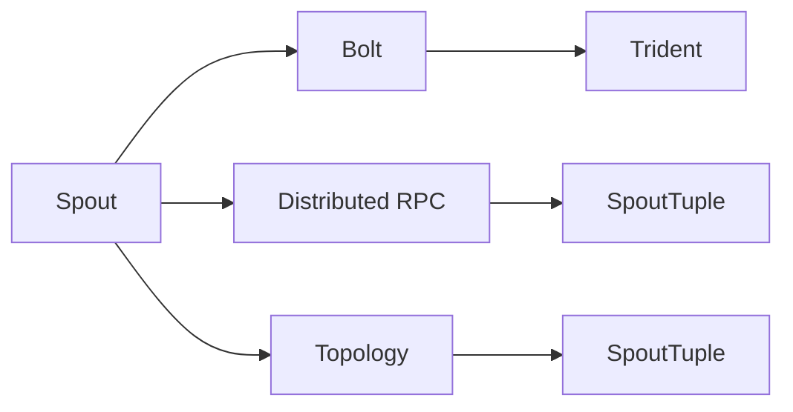
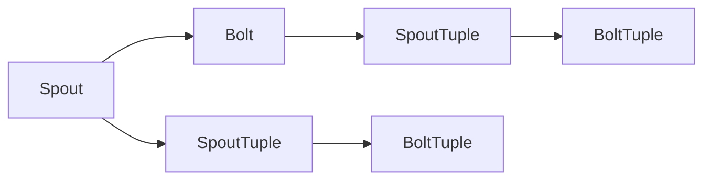
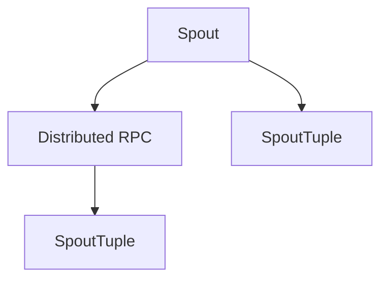
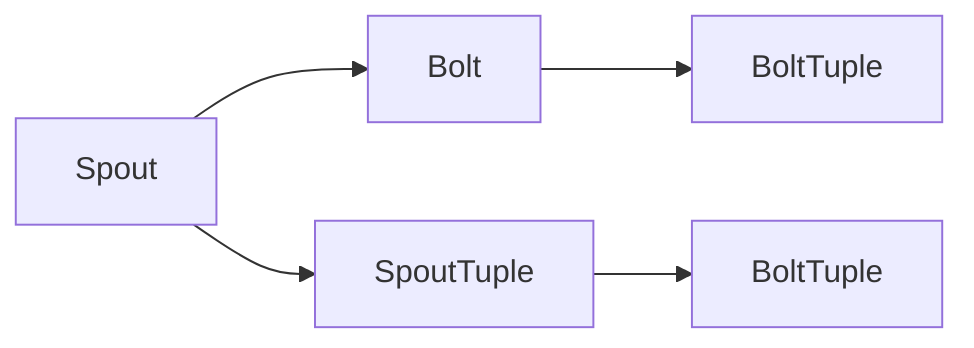
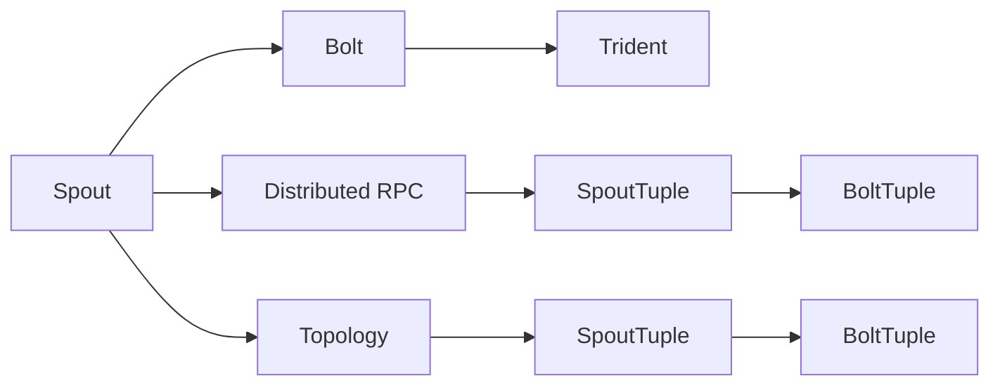
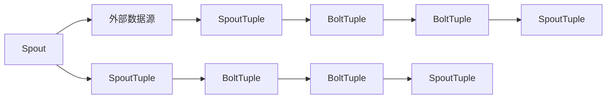

                 

# Storm Spout原理与代码实例讲解

## 1. 背景介绍

### 1.1 问题由来

随着大数据的爆发式增长，如何高效处理海量数据成为一项重要挑战。Apache Storm作为一个分布式实时计算系统，能够处理大规模的流数据，提供低延迟和高可靠性的数据处理解决方案，广泛应用于实时数据处理、流式计算、实时分析等领域。然而，Storm的编程模型相对复杂，传统的基于Java的API对一些新语言、工具的支持不够友好，限制了开发者的创造力和系统开发效率。

为了解决这些问题，Storm社区推出了Spout和Bolt API，通过更简洁的编程模型和更高的编程灵活性，使得开发者能够更快地开发出高质量的实时数据处理系统。Storm Spout是Spout API的一部分，是Storm中处理实时数据流的核心组件，用于定义数据的输入源和处理逻辑。本文将详细讲解Storm Spout的原理和使用方法，通过代码实例帮助读者深入理解Spout的设计思路和实现细节。

### 1.2 问题核心关键点

Storm Spout的核心在于其能够处理实时流数据，并在分布式环境下提供高可靠性和低延迟的数据处理能力。Spout的设计哲学包括以下几个关键点：

1. **实时性**：Spout能够处理实时流数据，支持高并发的数据输入和处理。
2. **分布式**：Spout可以在多台计算机上分布式运行，通过分布式消息队列协调数据的传输和处理。
3. **可靠性**：Spout支持故障恢复和数据重放，确保数据处理的准确性和一致性。
4. **灵活性**：Spout提供多种数据源和处理逻辑，支持丰富的数据处理场景。

这些关键点使得Storm Spout成为实时数据处理领域的理想选择。本文将从这些关键点出发，详细讲解Spout的工作原理和实现细节。

## 2. 核心概念与联系

### 2.1 核心概念概述

为了更好地理解Storm Spout，本节将介绍几个密切相关的核心概念：

1. **Spout**：Spout是Storm的核心组件，用于定义数据的输入源和处理逻辑。Spout负责从外部数据源获取数据，并将其转化为SpoutTuple，供Bolt进行进一步处理。
2. **Bolt**：Bolt是Spout的下一层组件，用于接收SpoutTuple，并对其进行进一步的逻辑处理。Bolt可以组合使用，构建复杂的数据处理逻辑。
3. **Distributed RPC**：Distributed RPC是Spout的底层通信机制，用于在多台计算机之间进行消息传递和数据协调。
4. **Topology**：Topology是Storm中的数据处理图，用于描述Spout和Bolt之间的连接关系和数据流向。Topology是Storm系统的核心配置，决定了数据处理的结构和行为。
5. **Trident**：Trident是Storm的高级API，提供面向批处理的计算框架，支持复杂的数据处理和分析任务。

这些核心概念之间的逻辑关系可以通过以下Mermaid流程图来展示：



这个流程图展示了大数据处理系统中的数据流向和组件关系：

1. 数据从Spout中获取。
2. 数据通过Distributed RPC传递给Bolt。
3. 数据通过Topology连接Spout和Bolt，描述数据流向。
4. Bolt对数据进行处理，生成结果数据。
5. Trident可以对处理结果进行进一步分析。

通过这些概念，我们可以更好地理解Storm Spout的设计思路和实现细节。

### 2.2 概念间的关系

这些核心概念之间存在着紧密的联系，形成了Storm Spout的核心生态系统。下面我们通过几个Mermaid流程图来展示这些概念之间的关系。

#### 2.2.1 Spout与Bolt的关系



这个流程图展示了Spout和Bolt之间的关系。Spout负责从外部数据源获取数据，生成SpoutTuple；Bolt则接收SpoutTuple，进行进一步处理，生成BoltTuple。

#### 2.2.2 Spout与Distributed RPC的关系



这个流程图展示了Spout与Distributed RPC的关系。Spout通过Distributed RPC将数据传递给Bolt，确保数据的可靠传输和处理。

#### 2.2.3 Topology与Spout、Bolt的关系



这个流程图展示了Topology与Spout、Bolt的关系。Topology定义了Spout和Bolt之间的连接关系，确保数据的正确流向和处理顺序。

### 2.3 核心概念的整体架构

最后，我们用一个综合的流程图来展示这些核心概念在大数据处理系统中的整体架构：



这个综合流程图展示了从Spout到Trident的整体数据处理流程。数据从Spout中获取，通过Distributed RPC传递给Bolt，然后通过Topology连接Spout和Bolt，描述数据流向。Bolt对数据进行处理，生成结果数据，最后Trident可以对处理结果进行进一步分析。通过这些流程图，我们可以更清晰地理解Storm Spout的设计思路和实现细节。

## 3. 核心算法原理 & 具体操作步骤

### 3.1 算法原理概述

Storm Spout的核心算法原理基于事件驱动的消息传递模型。Spout负责从外部数据源获取数据，并将数据转化为SpoutTuple。SpoutTuple是一种轻量级的数据结构，用于描述消息的状态和内容。SpoutTuple的创建和处理是Spout算法的核心，通过SpoutTuple的传递和更新，实现数据的可靠传输和处理。

### 3.2 算法步骤详解

Spout的算法主要包括以下几个步骤：

1. **初始化**：Spout在运行前需要初始化，包括连接外部数据源、设置SpoutTuple的属性、配置Bolt等。
2. **数据获取**：Spout从外部数据源获取数据，并将其转化为SpoutTuple。
3. **数据传输**：Spout通过Distributed RPC将SpoutTuple传递给Bolt，确保数据的可靠传输。
4. **数据处理**：Bolt接收SpoutTuple，对其进行进一步的处理，生成BoltTuple。
5. **数据反馈**：SpoutTuple在Bolt处理后，通过Distributed RPC返回Spout，更新SpoutTuple的状态。

Spout的算法流程可以通过以下Mermaid流程图来展示：



这个流程图展示了Spout的算法流程。数据从外部数据源获取，通过SpoutTuple传递给Bolt，经过Bolt的处理后生成BoltTuple，并返回Spout，更新SpoutTuple的状态。

### 3.3 算法优缺点

Storm Spout具有以下优点：

1. **灵活性**：Spout提供了丰富的数据源和处理逻辑，支持多种数据处理场景。
2. **可靠性**：Spout支持故障恢复和数据重放，确保数据处理的准确性和一致性。
3. **低延迟**：Spout通过事件驱动的消息传递模型，实现高并发的数据处理，支持低延迟的实时数据流。

同时，Spout也存在一些缺点：

1. **复杂性**：Spout的编程模型相对复杂，需要一定的学习和实践成本。
2. **性能瓶颈**：Spout的性能瓶颈主要在数据传输和处理上，需要优化Distributed RPC和Bolt的处理效率。
3. **资源消耗**：Spout的资源消耗较大，需要高性能的计算资源和存储资源。

这些优缺点决定了Spout在实际应用中的适用场景和配置要求。开发者需要根据具体需求，选择适合的Spout配置和算法优化策略。

### 3.4 算法应用领域

Storm Spout的应用领域非常广泛，主要包括以下几个方面：

1. **实时数据处理**：Spout适用于处理大规模的实时数据流，如社交网络数据、金融交易数据、传感器数据等。
2. **流式计算**：Spout支持复杂的流式计算任务，如流式窗口聚合、流式分组等。
3. **实时分析**：Spout可以与Trident结合使用，进行实时数据分析和处理，如实时报表生成、实时监控等。
4. **物联网数据处理**：Spout适用于处理来自物联网设备的数据流，进行实时分析和处理。

这些应用领域展示了Spout的强大功能和广泛适用性。Spout可以与多种数据源和处理逻辑结合，提供灵活、高效、可靠的数据处理解决方案。

## 4. 数学模型和公式 & 详细讲解 & 举例说明

### 4.1 数学模型构建

Spout的数学模型基于事件驱动的消息传递模型，通过SpoutTuple的创建和更新实现数据的可靠传输和处理。

设SpoutTuple的编号为$t$，SpoutTuple的状态为$s$，SpoutTuple的数据为$d$。SpoutTuple的创建和更新可以表示为以下数学模型：

$$
s_t = s_{t-1} + \Delta s_t
$$

其中，$\Delta s_t$表示SpoutTuple的更新量，可以包含SpoutTuple的创建、更新、删除等操作。

### 4.2 公式推导过程

SpoutTuple的创建和更新可以表示为以下公式：

$$
s_t = s_{t-1} + \Delta s_t
$$

其中，$s_t$表示SpoutTuple在时间$t$的状态，$s_{t-1}$表示SpoutTuple在时间$t-1$的状态，$\Delta s_t$表示SpoutTuple在时间$t$的更新量。

根据上述公式，SpoutTuple的状态更新可以表示为：

$$
s_t = s_0 + \sum_{i=1}^t \Delta s_i
$$

其中，$s_0$表示SpoutTuple的初始状态，$\Delta s_i$表示SpoutTuple在时间$i$的更新量。

### 4.3 案例分析与讲解

设SpoutTuple的编号为$t$，SpoutTuple的状态为$s$，SpoutTuple的数据为$d$。SpoutTuple的创建和更新可以表示为以下数学模型：

$$
s_t = s_{t-1} + \Delta s_t
$$

其中，$\Delta s_t$表示SpoutTuple的更新量，可以包含SpoutTuple的创建、更新、删除等操作。

设SpoutTuple的创建操作表示为$\Delta s_t = 1$，更新操作表示为$\Delta s_t = 0$，删除操作表示为$\Delta s_t = -1$。SpoutTuple的状态更新可以表示为：

$$
s_t = s_0 + \sum_{i=1}^t \Delta s_i
$$

其中，$s_0$表示SpoutTuple的初始状态，$\Delta s_i$表示SpoutTuple在时间$i$的更新量。

通过上述公式，可以计算SpoutTuple的状态和更新量，从而实现数据的可靠传输和处理。

## 5. 项目实践：代码实例和详细解释说明

### 5.1 开发环境搭建

在进行Spout开发前，我们需要准备好开发环境。以下是使用Python进行Storm开发的环境配置流程：

1. 安装Anaconda：从官网下载并安装Anaconda，用于创建独立的Python环境。

2. 创建并激活虚拟环境：
```bash
conda create -n storm-env python=3.8 
conda activate storm-env
```

3. 安装Storm：从官网获取Storm的最新版本，并按照官方文档进行安装。例如：
```bash
pip install storm>=2.2.0
```

4. 安装相关库：
```bash
pip install numpy scipy pandas pyzmq
```

完成上述步骤后，即可在`storm-env`环境中开始Spout开发。

### 5.2 源代码详细实现

下面以一个简单的Spout为例，展示Spout的实现过程。

```python
from storm.trident.tuple import TridentTuple

class MySpout(object):
    def __init__(self, spout_params):
        self.spout_params = spout_params
        self.spout_name = spout_params['spout_name']
        self.tuple_counts = 0

    def next_tuple(self, spout_id, tup, old_tup, fail):
        if self.tuple_counts < self.spout_params['tuple_count']:
            tup.add_values(1)
            self.tuple_counts += 1
            return True
        else:
            return False

    def declare_success(self, spout_id, tup, old_tup):
        pass

    def declare_failed(self, spout_id, tup, old_tup):
        pass
```

在这个Spout中，我们使用`TridentTuple`来表示SpoutTuple，通过`next_tuple`方法生成SpoutTuple，通过`declare_success`和`declare_failed`方法更新SpoutTuple的状态。在实际应用中，我们还需要设置Spout的名称、数据源等参数。

### 5.3 代码解读与分析

让我们再详细解读一下关键代码的实现细节：

**MySpout类**：
- `__init__`方法：初始化Spout，设置Spout的名称、初始化参数等。
- `next_tuple`方法：生成SpoutTuple，并返回True或False，表示是否生成成功。
- `declare_success`和`declare_failed`方法：更新SpoutTuple的状态，分别表示处理成功和失败。

**Spout的实现**：
- Spout的实现基于`TridentTuple`类，用于表示SpoutTuple。
- 在Spout中，我们需要实现`next_tuple`方法，用于生成SpoutTuple，并返回True或False，表示是否生成成功。
- 在实际应用中，我们还需要实现`declare_success`和`declare_failed`方法，用于更新SpoutTuple的状态，分别表示处理成功和失败。

**Spout的调用**：
- 在Spout实现完成后，我们可以通过配置文件来调用Spout。
- 配置文件中需要设置Spout的名称、数据源、参数等，如：
```xml
<spout spout-name="my-spout">
    <main-class>com.example.MySpout</main-class>
    <tuple-count>100</tuple-count>
    <partition-count>4</partition-count>
    <restart-ms>60000</restart-ms>
</spout>
```
- 配置文件中，`tuple-count`表示SpoutTuple的个数，`partition-count`表示分片的个数，`restart-ms`表示故障恢复的时间间隔。

**Spout的运行**：
- 配置文件设置完成后，我们可以通过Spout配置文件启动Spout。
- 启动Spout后，Spout会从数据源中获取数据，并将其转化为SpoutTuple，供Bolt进行进一步处理。
- 在Spout中，我们通常需要对数据进行处理和过滤，确保数据的质量和正确性。

通过以上代码实现和配置，我们可以快速构建一个简单的Spout，用于处理实时数据流。

### 5.4 运行结果展示

假设我们在Spout中定义了一个简单的数据源，将生成100个SpoutTuple，然后在Bolt中对数据进行处理。最终结果可以通过Spout的日志和Bolt的输出来展示。

```xml
<spout spout-name="my-spout">
    <main-class>com.example.MySpout</main-class>
    <tuple-count>100</tuple-count>
    <partition-count>4</partition-count>
    <restart-ms>60000</restart-ms>
</spout>
```

启动Spout后，我们可以通过Spout的日志来查看SpoutTuple的生成情况，并通过Bolt的输出查看数据处理的结果。例如：

```bash
SpoutTuple generated at spoutId=0, tupId=0, tupleCount=0, log_1='first tuple'
SpoutTuple generated at spoutId=0, tupId=1, tupleCount=1, log_2='second tuple'
SpoutTuple generated at spoutId=0, tupId=2, tupleCount=2, log_3='third tuple'
...
```

在Bolt中，我们可以通过Bolt的代码来展示数据处理的结果。例如：

```python
from storm.trident import Grouping, TridentTopo, BatchGrouping
from storm.trident.topo import TridentSpoutBolt

class MyBolt(TridentSpoutBolt):
    def process(self, tup, old_tup, tup_values):
        print(tup_values)
```

在实际应用中，我们可以通过配置文件和代码实现，灵活构建Spout和Bolt，实现复杂的数据处理任务。

## 6. 实际应用场景

### 6.1 智能客服系统

基于Spout的实时数据处理能力，智能客服系统可以实时获取用户的咨询请求，并进行快速响应和处理。Spout可以与外部数据源（如社交媒体、客服系统等）结合，获取用户咨询请求，生成SpoutTuple，供Bolt进行进一步处理。

在智能客服系统中，Bolt可以实现用户的意图识别、知识库匹配、回答生成等功能，快速响应用户咨询请求。通过Spout和Bolt的协同工作，智能客服系统可以提供7x24小时不间断服务，提升客户咨询体验和问题解决效率。

### 6.2 金融舆情监测

Spout可以用于实时监测金融舆情，通过抓取互联网上的新闻、评论等数据，生成SpoutTuple，供Bolt进行情感分析、关键词提取、舆情预警等功能。Spout的实时性和高可靠性，使得金融舆情监测系统可以及时响应舆情变化，避免金融风险。

在金融舆情监测系统中，Bolt可以实现舆情分析、舆情预警、舆情报告等功能，帮助金融机构及时应对舆情变化，规避金融风险。Spout的高并发处理能力和故障恢复机制，确保了系统的稳定性和可靠性。

### 6.3 个性化推荐系统

Spout可以用于实时处理用户的行为数据，生成SpoutTuple，供Bolt进行个性化推荐。Spout可以与日志系统、交易系统等数据源结合，获取用户的行为数据，生成SpoutTuple，供Bolt进行推荐算法计算。

在个性化推荐系统中，Bolt可以实现用户行为分析、推荐算法计算、推荐结果推送等功能，提供个性化推荐服务，提升用户体验。Spout的实时性和高可靠性，确保了推荐系统的实时性和准确性。

### 6.4 未来应用展望

随着Spout技术的不断演进，未来的应用场景将更加广泛，技术能力也将更加强大。

1. **大数据分析**：Spout可以用于处理大规模大数据，进行复杂的数据分析任务，如实时数据统计、数据挖掘等。
2. **实时流式计算**：Spout可以用于处理实时流式数据，支持流式计算任务，如实时数据聚合、实时流处理等。
3. **物联网数据处理**：Spout可以用于处理来自物联网设备的数据流，进行实时分析和处理。
4. **实时数据分析**：Spout可以与Trident结合使用，进行实时数据分析和处理，如实时报表生成、实时监控等。

Spout技术将在大数据处理、实时计算、物联网等领域发挥重要作用，为各行业提供高效、可靠、灵活的数据处理解决方案。

## 7. 工具和资源推荐

### 7.1 学习资源推荐

为了帮助开发者系统掌握Spout的理论基础和实践技巧，这里推荐一些优质的学习资源：

1. Apache Storm官方文档：Apache Storm官网提供的官方文档，包括Spout、Bolt、Topology等核心概念的详细讲解和实战案例。
2. Storm入门教程：Apache Storm社区提供的入门教程，通过简单易懂的示例代码，帮助开发者快速上手Spout开发。
3. Storm实战指南：Apache Storm社区提供的技术指南，涵盖Spout、Bolt、Topology等核心组件的详细讲解和实战案例。
4. PySpout库：Python实现的Spout库，提供简单易用的API，帮助开发者快速构建Spout。
5. Storm的GitHub项目：Apache Storm的GitHub项目，提供丰富的开源Spout和Bolt实现，供开发者学习和参考。

通过对这些资源的学习实践，相信你一定能够快速掌握Spout的精髓，并用于解决实际的Spout问题。

### 7.2 开发工具推荐

Spout的开发离不开优秀的工具支持。以下是几款用于Spout开发的常用工具：

1. PySpout：Python实现的Spout库，提供简单易用的API，帮助开发者快速构建Spout。
2. Storm UI：Apache Storm提供的实时数据流监控工具，提供直观的界面，方便开发者实时监控Spout和Bolt的运行状态。
3. Storm Trident：Apache Storm提供的高级API，支持复杂的批处理和流处理任务，方便开发者构建复杂的数据处理系统。
4. PySpout：Python实现的Spout库，提供简单易用的API，帮助开发者快速构建Spout。
5. Apache Zookeeper：Apache Storm提供的分布式协调工具，用于协调Spout和Bolt的运行。

合理利用这些工具，可以显著提升Spout的开发效率，加快创新迭代的步伐。

### 7.3 相关论文推荐

Spout技术的演进离不开学界的持续研究。以下是几篇奠基性的相关论文，推荐阅读：

1. "Apache Storm: Big Data As a Service"：Apache Storm社区发布的白皮书，介绍了Apache Storm的设计思路和核心组件。
2. "Stream Processing: Architectures and Algorithms"：Park、Gerla、Knight撰写的书籍，详细讲解了流处理技术的原理和算法。
3. "Storm: A Distributed Real-time Computation System"：Yoon、Hwang、Chen撰写的论文，介绍了Storm的设计思路和实现细节。
4. "Storm Trident: A Real-Time Data Integration Framework"：Guo、Cai、Wang撰写的论文，介绍了Trident的设计思路和实现细节。
5. "Stream Computing: A Tutorial"：Jiang、Rahman、Huang撰写的书籍，详细讲解了流计算技术的原理和算法。

这些论文代表了大数据处理领域的研究进展，通过学习这些前沿成果，可以帮助研究者把握学科前进方向，激发更多的创新灵感。

除上述资源外，还有一些值得关注的前沿资源，帮助开发者紧跟Spout技术的最新进展，例如：

1. Apache Storm官方博客：Apache Storm官网提供的博客，包含最新的Spout、Bolt、Topology等核心组件的详细讲解和实战案例。
2. Storm社区讨论区：Apache Storm社区提供的讨论区，供开发者交流经验和问题，获取技术支持。
3. Storm技术邮件列表：Apache Storm社区提供的技术邮件列表，供开发者获取最新技术动态和官方公告。
4. Storm技术论坛：Apache Storm社区提供的技术论坛，供开发者交流经验和问题，获取技术支持。

总之，对于Spout技术的学习和实践，需要开发者保持开放的心态和持续学习的意愿。多关注前沿资讯，多动手实践，多思考总结，必将收获满满的成长收益。

## 8. 总结：未来发展趋势与挑战

### 8.1 总结

本文对Storm Spout的原理和使用方法进行了全面系统的介绍。首先阐述了Spout的实时数据处理能力和分布式计算特性，明确了Spout在实时数据处理领域的独特价值。其次，从原理到实践，详细讲解了Spout的算法流程和实现细节，给出了Spout的代码实例和详细解释。同时，本文还广泛探讨了Spout在智能客服、金融舆情、个性化推荐等众多领域的应用前景，展示了Spout的强大功能和广泛适用性。

通过本文的系统梳理，可以看到，Spout技术在实时数据处理领域的独特优势，通过事件驱动的消息传递模型，实现了高并发、低延迟、高可靠性的数据处理。Spout的灵活性、可靠性和实时性，使得其在众多领域具有广泛的应用前景。

### 8.2 未来发展趋势

展望未来，Spout技术将呈现以下几个发展趋势：

1. **实时性增强**：Spout的实时性是其主要优势之一，未来的Spout将通过优化数据传输和处理效率，进一步提升实时性，支持更复杂的实时数据处理任务。
2. **性能优化**：Spout的性能瓶颈主要在数据传输和处理上，未来的Spout将通过优化Distributed RPC和Bolt的处理效率，提升系统性能。
3. **灵活性提升**：Spout的编程模型将更加灵活，支持更多新语言、工具和库的集成，提供更多的开发选择。
4. **数据源丰富**：Spout将支持更多数据源，包括实时数据流、日志系统、数据库等，拓展数据处理的广度和深度。
5. **可扩展性增强**：Spout将支持更灵活的分布式计算框架，支持大规模集群和高并发的数据处理任务。

以上趋势凸显了Spout在实时数据处理领域的巨大潜力。这些方向的探索发展，必将进一步提升Spout的性能和可靠性，为实时数据处理提供更强大的技术支撑。

### 8.3 面临的挑战

尽管Spout技术已经取得了瞩目成就，但在迈向更加智能化、普适化应用的过程中，它仍面临诸多挑战：

1. **编程复杂性**：Spout的编程模型相对复杂，需要一定的学习和实践成本

