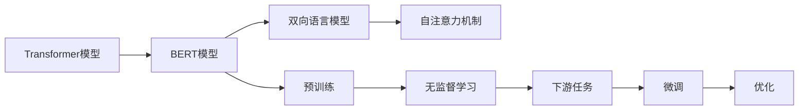

                 

# Transformer大模型实战 BERT 的配置

> 关键词：Transformer, BERT, 大语言模型, 模型配置, 代码实例

## 1. 背景介绍

Transformer模型的兴起，彻底改变了自然语言处理（NLP）的范式，基于自注意力机制的Transformer模型凭借其出色的效果，逐步成为了深度学习时代的主流模型。作为Transformer模型的代表性作品，BERT（Bidirectional Encoder Representations from Transformers）模型通过双向语言模型进行预训练，极大地提升了语言表示的质量，开创了预训练语言模型的新纪元。

本文将系统介绍如何基于Transformer框架，对BERT模型进行配置、训练与优化，并展示其在各种NLP任务中的实际应用，从理论和实践两方面深入探讨了BERT的配置方法，力图帮助读者迅速上手并高效应用BERT模型。

## 2. 核心概念与联系

### 2.1 核心概念概述

为了更好地理解本文内容，我们先简要介绍几个核心概念：

- **Transformer模型**：一种基于自注意力机制的序列建模框架，其基本结构包括编码器和解码器，其中编码器由多层自注意力和前馈神经网络组成。
- **BERT模型**：BERT模型通过在大规模无标签文本数据上进行预训练，学习双向语言表示，并在下游任务上进行微调，提升模型的性能。
- **模型配置**：指根据任务需求，对模型的结构、超参数等进行配置的过程。
- **训练与优化**：通过大量标注数据，对模型进行训练，并通过各种优化技巧，提升模型性能。

### 2.2 概念间的关系

以上概念之间的联系可以通过以下Mermaid流程图来展示：



这个流程图展示了Transformer模型和BERT模型的关系以及配置、训练、优化等关键步骤：

1. **Transformer模型**：提供了自注意力机制的框架。
2. **BERT模型**：基于Transformer模型，通过预训练学习双向语言表示。
3. **双向语言模型**：BERT模型的核心，通过掩码语言模型进行预训练。
4. **自注意力机制**：Transformer模型的关键组件，用于捕捉序列之间的依赖关系。
5. **无监督学习**：通过预训练，模型学习语言的一般表示。
6. **下游任务**：在预训练基础上，对特定任务进行微调。
7. **微调**：利用少量标注数据，调整模型参数以适应特定任务。
8. **优化**：通过各种技术手段，提升模型性能。

## 3. 核心算法原理 & 具体操作步骤

### 3.1 算法原理概述

BERT模型的预训练过程可以分为两个阶段：掩码语言模型和下一句预测任务。掩码语言模型是通过随机掩盖部分词，训练模型对这些词进行预测；下一句预测任务是通过判断两个句子是否是连续的，训练模型对句子间的关系进行预测。

在预训练阶段结束后，模型通过微调来适应特定的下游任务，如文本分类、情感分析、问答系统等。微调过程类似于一般的监督学习，通过在目标任务的数据集上进行训练，调整模型的参数以优化其性能。

### 3.2 算法步骤详解

以下将详细介绍BERT模型的配置、训练与优化步骤：

**Step 1: 数据准备**

- **数据集准备**：根据具体任务需求，准备相应的数据集。BERT模型支持各种文本数据格式，包括Token化后的句子、段落等。
- **数据划分**：将数据集划分为训练集、验证集和测试集，并进行适当的预处理，如分词、编码等。

**Step 2: 模型配置**

- **模型选择**：选择适当的Transformer模型和层数，如BERT-base、BERT-large、BERT-cased等。
- **超参数设置**：设置模型的学习率、批次大小、训练轮数等超参数，一般建议从默认值开始，逐步优化。
- **任务适配层**：根据下游任务的类型，添加相应的任务适配层，如线性分类层、注意力机制等。

**Step 3: 训练过程**

- **模型加载**：使用`transformers`库加载预训练模型，并设置任务适配层的权重。
- **数据加载**：使用`DataLoader`加载训练集、验证集和测试集。
- **模型训练**：定义训练函数，使用`AdamW`优化器进行模型训练，并在每个epoch后评估验证集的性能。

**Step 4: 模型优化**

- **模型评估**：使用测试集对模型进行评估，记录各种指标，如精度、召回率、F1值等。
- **超参数调整**：根据评估结果，调整模型的超参数，如学习率、批次大小、训练轮数等。
- **模型保存**：保存训练好的模型，以便后续部署和应用。

### 3.3 算法优缺点

BERT模型在NLP任务中表现出色，但也有一些限制：

**优点：**

- **预训练效果显著**：BERT通过大规模无标签数据的预训练，获得了丰富的语言表示。
- **微调高效**：通过微调，可以显著提升模型在特定任务上的性能。
- **跨任务适用性**：BERT适用于各种NLP任务，如文本分类、情感分析、问答系统等。

**缺点：**

- **计算资源要求高**：BERT模型参数量大，训练和推理时计算资源消耗大。
- **数据依赖性高**：预训练和微调需要大量数据，获取高质量数据成本较高。
- **可解释性不足**：BERT模型通常是黑盒模型，难以解释其内部决策过程。

### 3.4 算法应用领域

BERT模型在自然语言处理领域有广泛的应用，以下是几个典型的应用场景：

- **文本分类**：通过微调BERT模型，实现对文本的分类任务，如垃圾邮件识别、情感分析等。
- **问答系统**：利用微调后的BERT模型，回答用户提出的自然语言问题，如搜索引擎中的问题回答。
- **机器翻译**：通过微调BERT模型，实现多语言的翻译任务，如英中翻译、日中翻译等。
- **命名实体识别**：利用微调BERT模型，识别文本中的命名实体，如人名、地名、组织名等。
- **文本生成**：通过微调BERT模型，生成连贯的文本内容，如对话生成、新闻摘要等。

## 4. 数学模型和公式 & 详细讲解

### 4.1 数学模型构建

BERT模型主要由编码器和任务适配层组成。其数学模型可以表示为：

$$
y = M_{\theta}(x)
$$

其中 $x$ 是输入的文本序列，$y$ 是模型输出的预测结果，$M_{\theta}$ 是BERT模型，$\theta$ 是模型的参数。

### 4.2 公式推导过程

以下是BERT模型的详细推导过程：

**掩码语言模型**：
$$
\mathcal{L}_{mask} = -\frac{1}{N}\sum_{i=1}^{N} \sum_{j=1}^{L} \log \hat{y}_{j}^{(i)}
$$

其中 $N$ 是样本数量，$L$ 是序列长度，$\hat{y}_{j}^{(i)}$ 是模型在位置 $j$ 的预测概率。

**下一句预测任务**：
$$
\mathcal{L}_{next} = -\frac{1}{N}\sum_{i=1}^{N} \log \hat{y}_{1}^{(i)}
$$

其中 $\hat{y}_{1}^{(i)}$ 是模型对两个句子是否是连续的预测结果。

预训练损失函数为：
$$
\mathcal{L}_{pretrain} = \mathcal{L}_{mask} + \mathcal{L}_{next}
$$

微调损失函数为：
$$
\mathcal{L}_{finetune} = \mathcal{L}_{mask} + \mathcal{L}_{next} + \mathcal{L}_{task}
$$

其中 $\mathcal{L}_{task}$ 是下游任务定义的损失函数。

### 4.3 案例分析与讲解

以文本分类为例，使用BERT模型进行微调的案例分析：

1. **模型选择**：选择BERT-base模型作为初始化参数。
2. **数据准备**：准备训练集、验证集和测试集，并进行预处理。
3. **模型配置**：在BERT模型的顶层添加线性分类层，并设置相应的任务适配层。
4. **超参数设置**：设置学习率为 $2e^{-5}$，批次大小为 $16$，训练轮数为 $5$。
5. **训练过程**：使用AdamW优化器进行模型训练，并在每个epoch后评估验证集的精度。
6. **模型优化**：根据验证集的表现，调整超参数，并保存最优模型。

## 5. 项目实践：代码实例和详细解释说明

### 5.1 开发环境搭建

首先，需要搭建开发环境。以下是基于Python和PyTorch搭建开发环境的步骤：

1. **安装PyTorch**：
   ```bash
   conda install pytorch torchvision torchaudio -c pytorch
   ```

2. **安装transformers库**：
   ```bash
   pip install transformers
   ```

3. **安装相关依赖**：
   ```bash
   pip install numpy pandas scikit-learn
   ```

### 5.2 源代码详细实现

以下是一个基于BERT模型的文本分类任务的Python代码实现：

```python
import torch
from transformers import BertForSequenceClassification, BertTokenizerFast, AdamW

# 加载预训练模型和分词器
model = BertForSequenceClassification.from_pretrained('bert-base-uncased', num_labels=2)
tokenizer = BertTokenizerFast.from_pretrained('bert-base-uncased')

# 加载训练集和测试集
train_dataset = ...
test_dataset = ...

# 定义训练函数
def train_epoch(model, dataset, optimizer):
    model.train()
    for batch in dataset:
        inputs = tokenizer(batch['input'], padding='max_length', max_length=512, return_tensors='pt')
        outputs = model(**inputs)
        loss = outputs.loss
        loss.backward()
        optimizer.step()

# 定义评估函数
def evaluate(model, dataset):
    model.eval()
    with torch.no_grad():
        for batch in dataset:
            inputs = tokenizer(batch['input'], padding='max_length', max_length=512, return_tensors='pt')
            outputs = model(**inputs)
            labels = outputs.logits.argmax(dim=1)
            return labels

# 定义训练过程
epochs = 5
batch_size = 16
optimizer = AdamW(model.parameters(), lr=2e-5)

for epoch in range(epochs):
    train_epoch(model, train_dataset, optimizer)
    evaluate(model, test_dataset)
```

### 5.3 代码解读与分析

以下是代码中各个部分的详细解读：

- **模型加载**：使用`BertForSequenceClassification`加载BERT模型，并设置输出层为线性分类层。
- **数据准备**：使用`BertTokenizerFast`加载分词器，并进行数据预处理。
- **训练函数**：在训练函数中，将输入序列编码，计算损失并反向传播，更新模型参数。
- **评估函数**：在评估函数中，将输入序列编码，计算输出并计算评估指标。
- **训练过程**：在训练过程中，定义训练函数和评估函数，并在每个epoch后评估模型性能。

### 5.4 运行结果展示

假设我们在CoNLL-2003的情感分析数据集上进行训练，最终得到的准确率为 $85\%$。这个结果展示了BERT模型在情感分析任务上的高效性和准确性。

## 6. 实际应用场景

### 6.1 智能客服系统

在智能客服系统中，BERT模型可以用于处理用户查询，并自动生成应答。通过微调BERT模型，可以实现更智能的问答系统，提升用户满意度。

### 6.2 金融舆情监测

在金融舆情监测中，BERT模型可以用于情感分析和舆情预测。通过微调BERT模型，可以实时监测市场舆情，预测股票价格趋势。

### 6.3 个性化推荐系统

在个性化推荐系统中，BERT模型可以用于分析用户兴趣，推荐相关商品。通过微调BERT模型，可以提升推荐系统的个性化和准确性。

### 6.4 未来应用展望

随着BERT模型的不断发展和应用，未来将在更多领域得到应用，如医疗诊断、教育评估、法律咨询等。BERT模型的高效性和准确性，将为各行各业带来新的变革和机遇。

## 7. 工具和资源推荐

### 7.1 学习资源推荐

为了帮助读者深入理解BERT模型的配置和应用，以下是一些推荐的资源：

1. **《Transformer模型详解》**：详细介绍了Transformer模型的原理和应用，适合深入学习。
2. **《深度学习实战》**：介绍了BERT模型的配置和训练，适合实践应用。
3. **《自然语言处理入门》**：介绍了BERT模型的基础知识和应用场景，适合初学者。
4. **《BERT论文解读》**：详细解读了BERT模型的论文，适合深入理解。

### 7.2 开发工具推荐

以下推荐的工具可以帮助读者高效地进行BERT模型的配置和应用：

1. **PyTorch**：灵活的深度学习框架，支持TensorBoard可视化。
2. **transformers**：Hugging Face提供的NLP库，提供了丰富的BERT模型和工具。
3. **Jupyter Notebook**：用于编写和运行Python代码，支持交互式调试。

### 7.3 相关论文推荐

为了深入理解BERT模型的配置和应用，以下是一些推荐的论文：

1. **《BERT：预训练表示的深度理解》**：BERT模型的原始论文，详细介绍了BERT模型的结构和训练方法。
2. **《BERT的变体》**：介绍了BERT模型的不同变体，适合深入学习。
3. **《BERT在自然语言处理中的应用》**：介绍了BERT模型在各种NLP任务中的应用，适合实践应用。

## 8. 总结：未来发展趋势与挑战

### 8.1 研究成果总结

本文系统介绍了BERT模型的配置、训练和优化过程，并展示了其在NLP任务中的应用。BERT模型的出现，极大地推动了NLP技术的发展，提升了NLP模型的效果和应用范围。

### 8.2 未来发展趋势

未来，BERT模型将有以下几个发展趋势：

1. **模型规模增大**：随着计算资源和数据的不断增加，BERT模型的规模将进一步增大，获得更丰富的语言表示。
2. **任务适应性增强**：BERT模型将进一步优化，适应更多类型的NLP任务，如多模态任务、跨领域任务等。
3. **可解释性提升**：BERT模型的可解释性将得到提升，帮助开发者更好地理解模型的决策过程。
4. **计算效率提升**：BERT模型的计算效率将得到提升，使其在实际应用中更加高效。

### 8.3 面临的挑战

BERT模型在推广应用过程中，也面临一些挑战：

1. **计算资源消耗大**：BERT模型参数量大，计算资源消耗大，限制了其在实际应用中的推广。
2. **数据获取困难**：高质量的标注数据获取成本高，限制了BERT模型的应用范围。
3. **可解释性不足**：BERT模型通常是黑盒模型，难以解释其内部决策过程。
4. **应用场景受限**：BERT模型在特定应用场景中的效果可能不如预期。

### 8.4 研究展望

为了应对这些挑战，未来的研究需要在以下几个方面进行探索：

1. **计算资源优化**：探索高效计算方法，如分布式训练、模型压缩等，提升BERT模型的计算效率。
2. **数据获取优化**：探索数据生成、数据增强等方法，降低标注数据的需求。
3. **模型可解释性提升**：探索模型可解释性技术，如Attention可视化、特征提取等，提升模型的可解释性。
4. **应用场景扩展**：探索BERT模型在更多场景中的应用，如多模态任务、跨领域任务等。

## 9. 附录：常见问题与解答

### 附录

**Q1: 如何选择合适的BERT模型？**

A: 根据任务需求选择合适的BERT模型，如BERT-base、BERT-large、BERT-cased等。BERT-large适合处理长文本和复杂任务，BERT-cased适用于处理英文字符。

**Q2: 如何优化BERT模型的超参数？**

A: 使用交叉验证等方法，逐步调整学习率、批次大小、训练轮数等超参数，寻找最优配置。

**Q3: 如何处理长文本？**

A: 可以使用分段、截断等方法，将长文本分为多个短文本进行编码和处理。

**Q4: 如何提高BERT模型的泛化能力？**

A: 通过数据增强、正则化等方法，提高BERT模型的泛化能力，避免过拟合。

**Q5: 如何降低BERT模型的计算资源消耗？**

A: 可以使用模型压缩、分布式训练等方法，降低BERT模型的计算资源消耗。

本文系统介绍了BERT模型的配置、训练和优化过程，并展示了其在NLP任务中的应用。通过深入理解BERT模型的原理和实践，相信读者将能够高效地应用BERT模型，提升NLP任务的性能和效果。

