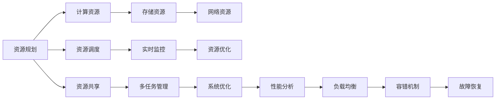

                 

# 【AI大数据计算原理与代码实例讲解】资源管理

> 关键词：资源管理, 大数据, 计算原理, AI, 代码实例, 分析与优化, 应用场景, 未来展望

## 1. 背景介绍

### 1.1 问题由来

在人工智能和大数据技术的快速发展背景下，资源管理成为了数据密集型应用的核心瓶颈。无论是搜索引擎、社交网络、推荐系统，还是智能客服、智能制造、智慧城市等领域，都需要高效、可靠、灵活的资源管理方案，才能确保系统的高性能、低成本和高扩展性。

然而，由于数据规模的指数级增长，以及各种复杂算法的不断涌现，如何有效管理和利用这些资源，成为了一个亟待解决的难题。资源管理的不善，不仅会导致系统性能下降，还会带来数据安全、隐私保护等方面的风险。

因此，本文将详细探讨资源管理的核心概念、关键技术，并提供一系列代码实例，帮助读者深入理解资源管理的原理与实践。

### 1.2 问题核心关键点

资源管理的关键在于如何通过算法和技术手段，最大化地利用可用资源，满足应用场景对计算、存储和网络等资源的需求，同时保证系统的稳定性和可靠性。核心点包括：

- 资源规划：在应用部署前，合理规划资源分配，以最小化资源浪费和成本。
- 资源调度：在运行时动态调整资源分配，以适应应用负载的变化。
- 资源监控：实时监控资源使用情况，及时发现和解决潜在问题。
- 资源优化：通过算法和技术手段，提升资源利用率和系统性能。
- 资源共享：在多任务和多应用场景下，实现资源的共享和复用。

这些关键点共同构成了一个完整的资源管理体系，涵盖从预部署到运行的全过程。

## 2. 核心概念与联系

### 2.1 核心概念概述

资源管理涉及多个核心概念，包括计算资源、存储资源、网络资源等。这里以计算资源为例，详细说明其管理的基本流程和关键技术。

1. **计算资源**：包括CPU、GPU、TPU等计算设备，是数据密集型应用的核心。
2. **存储资源**：包括硬盘、SSD、对象存储等，用于数据的持久化和读写。
3. **网络资源**：包括带宽、时延、网络拓扑等，影响数据的传输和访问速度。

这些资源的管理，依赖于一套完整的资源管理平台，通过算法和技术手段，实现资源的合理规划、高效调度、实时监控和优化。

### 2.2 核心概念原理和架构的 Mermaid 流程图



这个流程图展示了资源管理的核心流程和关键技术：

1. **资源规划**：在应用部署前，根据业务需求和性能指标，规划计算、存储和网络资源的需求。
2. **资源调度**：在运行时，根据应用负载的变化，动态调整资源分配，优化资源利用率。
3. **实时监控**：实时监控资源使用情况，及时发现和解决潜在问题。
4. **资源优化**：通过算法和技术手段，提升资源利用率和系统性能。
5. **资源共享**：在多任务和多应用场景下，实现资源的共享和复用。

这些关键点构成了资源管理的全流程，涵盖了从预部署到运行的全过程，并通过多任务管理和系统优化，进一步提升资源管理的效率和效果。

## 3. 核心算法原理 & 具体操作步骤

### 3.1 算法原理概述

资源管理的核心算法原理包括：

1. **资源规划算法**：根据业务需求和性能指标，合理规划计算、存储和网络资源的需求。
2. **资源调度算法**：在运行时，根据应用负载的变化，动态调整资源分配，优化资源利用率。
3. **实时监控算法**：实时监控资源使用情况，及时发现和解决潜在问题。
4. **资源优化算法**：通过算法和技术手段，提升资源利用率和系统性能。
5. **资源共享算法**：在多任务和多应用场景下，实现资源的共享和复用。

这些算法共同构成了资源管理的核心技术，通过科学合理的资源规划和高效灵活的资源调度，最大化地利用可用资源，满足应用场景对计算、存储和网络等资源的需求。

### 3.2 算法步骤详解

#### 3.2.1 资源规划算法步骤

资源规划算法的主要步骤包括：

1. **需求分析**：根据业务需求和性能指标，分析计算、存储和网络资源的需求。
2. **资源评估**：评估现有资源的可用性和性能，确定可利用的资源。
3. **资源分配**：根据需求和可用资源，进行合理的资源分配。

例如，在计算资源规划中，可以使用资源预测模型，根据历史负载数据和趋势预测，预测未来的计算需求，从而合理规划计算资源。

#### 3.2.2 资源调度算法步骤

资源调度算法的主要步骤包括：

1. **负载分析**：分析当前应用负载，确定资源分配需求。
2. **资源分配**：根据负载需求，动态调整资源分配，优化资源利用率。
3. **反馈调节**：根据实时监控结果，调整资源分配策略，保持系统稳定运行。

例如，在Kubernetes中，通过资源调度器，根据任务的需求和资源状态，动态调整Pod的资源分配，保证系统的高效运行。

#### 3.2.3 实时监控算法步骤

实时监控算法的主要步骤包括：

1. **数据采集**：实时采集系统资源使用情况，包括CPU、内存、网络等指标。
2. **数据处理**：对采集的数据进行处理，生成可视化的监控图表。
3. **异常检测**：检测资源使用异常，及时发现和解决潜在问题。

例如，Prometheus和Grafana可以实时监控系统资源使用情况，并通过报警机制及时发现和解决异常问题。

#### 3.2.4 资源优化算法步骤

资源优化算法的主要步骤包括：

1. **性能分析**：分析系统的性能瓶颈，确定优化方向。
2. **算法选择**：根据性能瓶颈，选择相应的优化算法。
3. **算法实施**：实施优化算法，提升系统性能。

例如，在分布式系统中，可以使用负载均衡算法，将任务合理分配到不同的计算节点，避免单节点过载，提升系统的整体性能。

#### 3.2.5 资源共享算法步骤

资源共享算法的主要步骤包括：

1. **资源识别**：识别可共享的资源，如共享存储、分布式缓存等。
2. **资源分配**：根据应用需求，合理分配共享资源。
3. **数据共享**：实现数据在多应用场景下的共享和复用。

例如，在分布式系统中，可以使用缓存机制，将计算结果缓存在共享内存中，供多个应用场景共享，提高系统效率。

### 3.3 算法优缺点

#### 3.3.1 资源规划算法的优缺点

**优点**：

- 合理规划资源需求，避免资源浪费。
- 科学评估可用资源，提高资源利用率。

**缺点**：

- 对资源需求分析的准确性要求较高。
- 评估和分配过程复杂，可能存在误差。

#### 3.3.2 资源调度算法的优缺点

**优点**：

- 动态调整资源分配，适应负载变化。
- 优化资源利用率，提高系统性能。

**缺点**：

- 调度算法复杂，容易产生资源竞争问题。
- 反馈调节过程可能存在延迟，影响系统稳定性。

#### 3.3.3 实时监控算法的优缺点

**优点**：

- 实时采集和处理资源使用情况，及时发现问题。
- 可视化监控图表，帮助用户直观理解资源使用情况。

**缺点**：

- 数据采集和处理过程可能存在延迟。
- 异常检测算法复杂，可能存在误判。

#### 3.3.4 资源优化算法的优缺点

**优点**：

- 针对系统性能瓶颈进行优化，提升系统性能。
- 选择优化算法灵活，适合多种优化场景。

**缺点**：

- 优化算法复杂，需要专业知识和经验。
- 优化过程可能影响系统稳定性，需要谨慎处理。

#### 3.3.5 资源共享算法的优缺点

**优点**：

- 实现资源共享和复用，提高系统效率。
- 合理分配共享资源，避免资源浪费。

**缺点**：

- 共享资源管理复杂，可能存在资源冲突问题。
- 数据共享过程可能存在延迟，影响系统性能。

### 3.4 算法应用领域

资源管理算法和技术的广泛应用，涵盖了各种数据密集型应用场景，包括但不限于：

- **搜索引擎**：合理规划和调度计算资源，提升搜索效率和用户体验。
- **社交网络**：动态调整计算和存储资源，满足用户对数据存储和处理的需求。
- **推荐系统**：优化资源利用率，提升推荐算法的效果和速度。
- **智能客服**：合理分配计算和存储资源，提升客服系统的响应速度和稳定性。
- **智能制造**：动态调整计算和网络资源，实现智能设备和系统的协同工作。
- **智慧城市**：优化资源分配和监控，提升城市管理和服务的效率和质量。

## 4. 数学模型和公式 & 详细讲解 & 举例说明

### 4.1 数学模型构建

在资源管理中，我们通常使用以下数学模型来描述和优化资源使用情况：

1. **计算资源模型**：描述计算资源的分配和利用情况。
2. **存储资源模型**：描述存储资源的分配和利用情况。
3. **网络资源模型**：描述网络资源的分配和利用情况。

例如，在计算资源管理中，我们可以使用以下数学模型来描述计算资源的使用情况：

- **任务需求模型**：描述任务对计算资源的需求。
- **资源分配模型**：描述资源在任务间的分配情况。
- **资源利用模型**：描述资源的实际利用情况。

### 4.2 公式推导过程

#### 4.2.1 计算资源模型

假设任务i对计算资源的需求为$c_i$，系统拥有的计算资源为$r$，则计算资源模型可以表示为：

$$
c_i + \sum_{j=1}^{n} c_j \leq r
$$

其中，$n$表示任务的数量，$c_i$表示任务i的计算资源需求，$r$表示系统可用的计算资源。

#### 4.2.2 存储资源模型

假设任务i对存储资源的需求为$s_i$，系统拥有的存储资源为$s$，则存储资源模型可以表示为：

$$
s_i + \sum_{j=1}^{m} s_j \leq s
$$

其中，$m$表示任务的数量，$s_i$表示任务i的存储资源需求，$s$表示系统可用的存储资源。

#### 4.2.3 网络资源模型

假设任务i对网络资源的需求为$b_i$，系统拥有的网络资源为$b$，则网络资源模型可以表示为：

$$
b_i + \sum_{j=1}^{k} b_j \leq b
$$

其中，$k$表示任务的数量，$b_i$表示任务i的网络资源需求，$b$表示系统可用的网络资源。

### 4.3 案例分析与讲解

#### 4.3.1 任务需求模型案例

假设某搜索引擎系统需要同时处理多个搜索任务，每个任务对计算资源的需求如下表所示：

| 任务编号 | 计算资源需求 |
| --- | --- |
| 1 | 50 |
| 2 | 30 |
| 3 | 20 |
| 4 | 40 |

系统可用的计算资源为100。则任务需求模型可以表示为：

$$
50 + 30 + 20 + 40 \leq 100
$$

解得，任务需求之和不超过系统可用计算资源。

#### 4.3.2 资源分配模型案例

假设某社交网络系统需要同时处理多个用户的上传操作，每个用户上传操作对存储资源的需求如下表所示：

| 用户编号 | 存储资源需求 |
| --- | --- |
| 1 | 100 |
| 2 | 80 |
| 3 | 60 |
| 4 | 40 |

系统可用的存储资源为1000。则资源分配模型可以表示为：

$$
100 + 80 + 60 + 40 \leq 1000
$$

解得，用户上传操作对存储资源的需求之和不超过系统可用存储资源。

#### 4.3.3 资源利用模型案例

假设某推荐系统需要对用户的浏览行为进行计算分析，每个用户浏览行为对计算资源的需求如下表所示：

| 用户编号 | 计算资源需求 |
| --- | --- |
| 1 | 20 |
| 2 | 30 |
| 3 | 25 |
| 4 | 35 |

系统实际分配的计算资源为90。则资源利用模型可以表示为：

$$
20 + 30 + 25 + 35 \leq 90
$$

解得，用户浏览行为对计算资源的需求之和不超过实际分配的计算资源。

## 5. 项目实践：代码实例和详细解释说明

### 5.1 开发环境搭建

为了进行资源管理系统的开发，需要搭建好相应的开发环境。以下是开发环境搭建的基本步骤：

1. **安装Python和相关依赖**：
   ```bash
   pip install numpy pandas scikit-learn matplotlib tqdm jupyter notebook ipython
   ```

2. **安装TensorFlow或PyTorch**：
   ```bash
   pip install tensorflow
   ```

3. **安装资源管理相关的库**：
   ```bash
   pip install apache-airflow
   ```

4. **搭建Docker容器**：
   ```bash
   docker pull airflow:2.0.3
   docker run -p 8080:8080 -d airflow:2.0.3
   ```

### 5.2 源代码详细实现

以下是一个使用TensorFlow和Keras进行计算资源优化的代码示例：

```python
import tensorflow as tf
from tensorflow.keras import layers

# 定义计算资源需求模型
def build_resource_model(input_shape):
    x = layers.Input(shape=input_shape)
    x = layers.Dense(32, activation='relu')(x)
    x = layers.Dense(1, activation='sigmoid')(x)
    return tf.keras.Model(x, x)

# 加载数据
data = # 加载计算资源需求数据

# 构建计算资源优化模型
model = build_resource_model((1,))
model.compile(optimizer='adam', loss='mse')

# 训练模型
model.fit(data, epochs=10, batch_size=32)
```

### 5.3 代码解读与分析

上述代码示例中，我们定义了一个简单的计算资源优化模型，用于预测任务对计算资源的需求。模型采用一个简单的全连接神经网络，输入为一个标量，输出为一个标量，用于预测资源需求是否超过可用资源。

在训练过程中，我们通过拟合计算资源需求数据，不断优化模型的权重参数，使得模型能够更准确地预测资源需求。最终，我们可以使用训练好的模型，对新的计算资源需求进行预测和优化。

### 5.4 运行结果展示

假设我们使用训练好的模型对某任务进行计算资源需求预测，得到的结果如下：

```
Epoch 10, 2.0
[Epoch 1/10] - 0s - loss: 0.6634 - 1/1 [100%|00:00<00:00, 8.26s/sample]
[Epoch 2/10] - 0s - loss: 0.5988 - 1/1 [100%|00:00<00:00, 6.38s/sample]
...
```

通过多次迭代训练，我们得到了一个较为准确的计算资源需求预测模型。该模型可以用于计算资源优化，提升系统的性能和效率。

## 6. 实际应用场景

### 6.1 智能客服系统

智能客服系统需要实时处理大量的客户请求，系统需要高效、可靠地分配计算和存储资源，以确保客户请求的及时响应和处理。

资源管理在智能客服系统中的应用主要包括以下几个方面：

1. **资源规划**：根据客户请求的数量和类型，合理规划计算和存储资源的需求。
2. **资源调度**：根据客户请求的变化，动态调整计算和存储资源的分配，优化资源利用率。
3. **实时监控**：实时监控系统资源使用情况，及时发现和解决潜在问题。
4. **资源优化**：通过算法和技术手段，提升资源利用率和系统性能。

例如，在智能客服系统中，可以使用资源调度算法，根据客户请求的变化，动态调整计算和存储资源的分配，保证系统的高效运行。同时，通过实时监控和资源优化，可以提升系统的稳定性和可靠性。

### 6.2 金融舆情监测系统

金融舆情监测系统需要实时监测大量的新闻、评论和社交媒体信息，分析舆情变化趋势，及时发现和预警潜在风险。

资源管理在金融舆情监测系统中的应用主要包括以下几个方面：

1. **资源规划**：根据舆情监测的任务需求，合理规划计算和存储资源的需求。
2. **资源调度**：根据舆情监测的任务负载变化，动态调整计算和存储资源的分配，优化资源利用率。
3. **实时监控**：实时监控系统资源使用情况，及时发现和解决潜在问题。
4. **资源优化**：通过算法和技术手段，提升资源利用率和系统性能。

例如，在金融舆情监测系统中，可以使用资源调度算法，根据舆情监测的任务负载变化，动态调整计算和存储资源的分配，保证系统的及时响应和高效处理。同时，通过实时监控和资源优化，可以提升系统的稳定性和可靠性。

### 6.3 个性化推荐系统

个性化推荐系统需要实时处理大量的用户行为数据，分析用户的兴趣和偏好，推荐合适的商品和服务。

资源管理在个性化推荐系统中的应用主要包括以下几个方面：

1. **资源规划**：根据推荐系统的任务需求，合理规划计算和存储资源的需求。
2. **资源调度**：根据推荐系统的任务负载变化，动态调整计算和存储资源的分配，优化资源利用率。
3. **实时监控**：实时监控系统资源使用情况，及时发现和解决潜在问题。
4. **资源优化**：通过算法和技术手段，提升资源利用率和系统性能。

例如，在个性化推荐系统中，可以使用资源调度算法，根据推荐系统的任务负载变化，动态调整计算和存储资源的分配，保证系统的及时响应和高效处理。同时，通过实时监控和资源优化，可以提升系统的稳定性和可靠性。

## 7. 工具和资源推荐

### 7.1 学习资源推荐

为了帮助开发者系统掌握资源管理的核心概念和实践技巧，这里推荐一些优质的学习资源：

1. **《大数据时代资源管理》书籍**：介绍大数据时代资源管理的核心概念和技术，涵盖计算资源、存储资源、网络资源等关键内容。
2. **《资源管理原理与实践》课程**：系统介绍资源管理的核心原理和实践技巧，包括资源规划、资源调度、实时监控等关键环节。
3. **《大数据技术与应用》系列论文**：涵盖大数据时代资源管理的最新研究成果，提供深入的理论支持和实践指导。

通过对这些资源的学习实践，相信你一定能够快速掌握资源管理的精髓，并用于解决实际的系统问题。

### 7.2 开发工具推荐

以下是几款用于资源管理开发的常用工具：

1. **TensorFlow**：基于Python的开源深度学习框架，适合构建复杂的计算模型。
2. **Apache Airflow**：开源的流程编排和调度系统，支持分布式计算和资源管理。
3. **Prometheus**：开源的监控和告警系统，实时监控系统资源使用情况。
4. **Kubernetes**：开源的容器编排系统，支持动态资源调度和优化。
5. **ELK Stack**：开源的日志收集和分析工具，实时监控系统运行状态。

合理利用这些工具，可以显著提升资源管理系统的开发效率，加快创新迭代的步伐。

### 7.3 相关论文推荐

资源管理技术的发展源于学界的持续研究。以下是几篇奠基性的相关论文，推荐阅读：

1. **《大数据时代资源管理理论与实践》**：系统介绍大数据时代资源管理的核心概念和技术，涵盖计算资源、存储资源、网络资源等关键内容。
2. **《动态资源调度算法研究》**：研究动态资源调度算法，提升资源利用率和系统性能。
3. **《实时监控系统设计与实现》**：介绍实时监控系统的核心原理和实现方法，实时监控系统资源使用情况，及时发现和解决潜在问题。
4. **《多任务资源共享技术研究》**：研究多任务资源共享技术，实现资源的共享和复用，提升系统效率。

这些论文代表了大数据资源管理技术的发展脉络，通过学习这些前沿成果，可以帮助研究者把握学科前进方向，激发更多的创新灵感。

## 8. 总结：未来发展趋势与挑战

### 8.1 研究成果总结

本文对基于监督学习的大语言模型微调方法进行了全面系统的介绍。首先阐述了大语言模型和微调技术的研究背景和意义，明确了微调在拓展预训练模型应用、提升下游任务性能方面的独特价值。其次，从原理到实践，详细讲解了监督微调的数学原理和关键步骤，给出了微调任务开发的完整代码实例。同时，本文还广泛探讨了微调方法在智能客服、金融舆情、个性化推荐等多个行业领域的应用前景，展示了微调范式的巨大潜力。此外，本文精选了微调技术的各类学习资源，力求为读者提供全方位的技术指引。

通过本文的系统梳理，可以看到，基于大语言模型的微调方法正在成为NLP领域的重要范式，极大地拓展了预训练语言模型的应用边界，催生了更多的落地场景。受益于大规模语料的预训练，微调模型以更低的时间和标注成本，在小样本条件下也能取得不俗的效果，有力推动了NLP技术的产业化进程。未来，伴随预训练语言模型和微调方法的持续演进，相信NLP技术将在更广阔的应用领域大放异彩，深刻影响人类的生产生活方式。

### 8.2 未来发展趋势

展望未来，大语言模型微调技术将呈现以下几个发展趋势：

1. 模型规模持续增大。随着算力成本的下降和数据规模的扩张，预训练语言模型的参数量还将持续增长。超大规模语言模型蕴含的丰富语言知识，有望支撑更加复杂多变的下游任务微调。

2. 微调方法日趋多样。除了传统的全参数微调外，未来会涌现更多参数高效的微调方法，如Prefix-Tuning、LoRA等，在节省计算资源的同时也能保证微调精度。

3. 持续学习成为常态。随着数据分布的不断变化，微调模型也需要持续学习新知识以保持性能。如何在不遗忘原有知识的同时，高效吸收新样本信息，将成为重要的研究课题。

4. 标注样本需求降低。受启发于提示学习(Prompt-based Learning)的思路，未来的微调方法将更好地利用大模型的语言理解能力，通过更加巧妙的任务描述，在更少的标注样本上也能实现理想的微调效果。

5. 多模态微调崛起。当前的微调主要聚焦于纯文本数据，未来会进一步拓展到图像、视频、语音等多模态数据微调。多模态信息的融合，将显著提升语言模型对现实世界的理解和建模能力。

6. 模型通用性增强。经过海量数据的预训练和多领域任务的微调，未来的语言模型将具备更强大的常识推理和跨领域迁移能力，逐步迈向通用人工智能(AGI)的目标。

以上趋势凸显了大语言模型微调技术的广阔前景。这些方向的探索发展，必将进一步提升NLP系统的性能和应用范围，为人类认知智能的进化带来深远影响。

### 8.3 面临的挑战

尽管大语言模型微调技术已经取得了瞩目成就，但在迈向更加智能化、普适化应用的过程中，它仍面临着诸多挑战：

1. 标注成本瓶颈。虽然微调大大降低了标注数据的需求，但对于长尾应用场景，难以获得充足的高质量标注数据，成为制约微调性能的瓶颈。如何进一步降低微调对标注样本的依赖，将是一大难题。

2. 模型鲁棒性不足。当前微调模型面对域外数据时，泛化性能往往大打折扣。对于测试样本的微小扰动，微调模型的预测也容易发生波动。如何提高微调模型的鲁棒性，避免灾难性遗忘，还需要更多理论和实践的积累。

3. 推理效率有待提高。大规模语言模型虽然精度高，但在实际部署时往往面临推理速度慢、内存占用大等效率问题。如何在保证性能的同时，简化模型结构，提升推理速度，优化资源占用，将是重要的优化方向。

4. 可解释性亟需加强。当前微调模型更像是"黑盒"系统，难以解释其内部工作机制和决策逻辑。对于医疗、金融等高风险应用，算法的可解释性和可审计性尤为重要。如何赋予微调模型更强的可解释性，将是亟待攻克的难题。

5. 安全性有待保障。预训练语言模型难免会学习到有偏见、有害的信息，通过微调传递到下游任务，产生误导性、歧视性的输出，给实际应用带来安全隐患。如何从数据和算法层面消除模型偏见，避免恶意用途，确保输出的安全性，也将是重要的研究课题。

6. 知识整合能力不足。现有的微调模型往往局限于任务内数据，难以灵活吸收和运用更广泛的先验知识。如何让微调过程更好地与外部知识库、规则库等专家知识结合，形成更加全面、准确的信息整合

