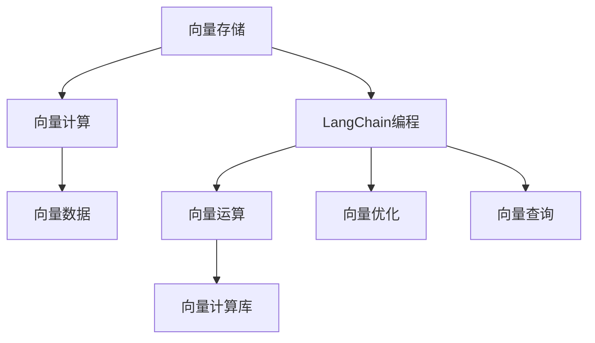
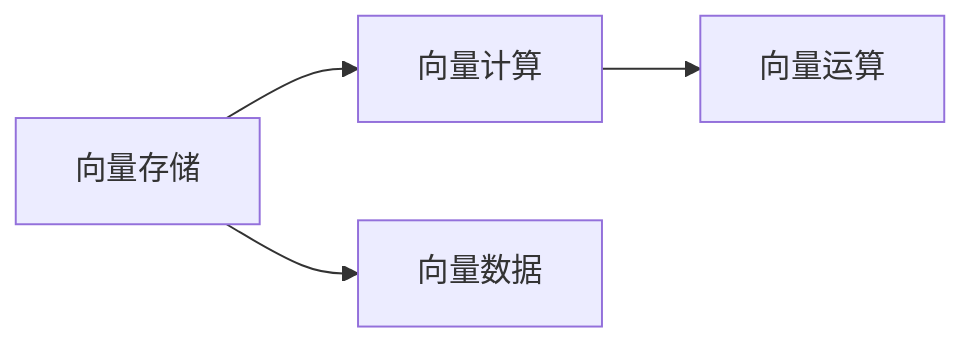
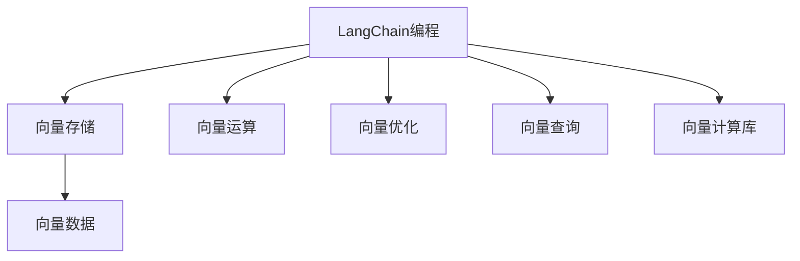
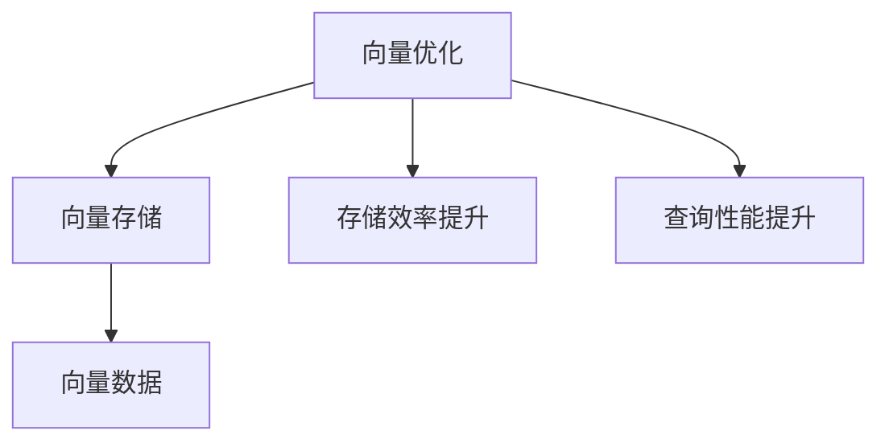

                 

# 【LangChain编程：从入门到实践】向量存储

> 关键词：向量存储,向量计算,LangChain编程,向量数据,向量运算,向量优化,向量查询,向量计算库,向量应用

## 1. 背景介绍

### 1.1 问题由来
在人工智能、数据科学等领域，向量（即多维数组）是处理大规模数据和进行复杂计算的核心数据类型。向量存储和运算作为基础技术，在深度学习、机器学习、自然语言处理等众多应用中扮演着重要角色。向量数据不仅是模型训练的输入，更在模型推断和应用部署中占据核心地位。

然而，随着数据量的激增，向量数据规模也在不断扩大。当前主流的向量存储解决方案面临着存储效率低、查询性能差、扩展性不足等挑战。因此，开发高效、灵活、可扩展的向量存储系统，对于提升AI和大数据应用性能至关重要。

### 1.2 问题核心关键点
向量存储的核心问题包括：

1. **数据模型**：如何设计高效的数据模型来存储向量数据。
2. **数据存储**：如何高效存储大规模向量数据，并实现快速读写。
3. **数据查询**：如何快速查询向量数据，满足不同业务需求。
4. **数据优化**：如何对向量数据进行优化，提升存储和查询效率。
5. **数据交互**：如何与AI模型进行高效交互，支持模型的快速训练和推理。

这些问题的解决直接影响到AI和大数据应用的系统性能和用户体验。

### 1.3 问题研究意义
高效向量存储技术不仅直接影响AI和大数据应用的系统性能，还能够显著降低计算和存储成本，提升应用部署的灵活性和可扩展性。这对于推动AI技术的产业化进程，加速AI技术在各行各业的应用，具有重要意义。

通过深入研究向量存储技术，可以开发出更高效、更灵活、更可扩展的向量存储系统，支持大规模、高性能的AI和大数据应用，促进经济社会数字化转型升级。

## 2. 核心概念与联系

### 2.1 核心概念概述

向量存储和向量计算是AI和大数据领域的基础技术。下面我们介绍几个关键概念：

- **向量存储**：指对向量数据进行高效存储和访问的技术。常见的向量存储系统包括Apache Parquet、Apache Feather等。
- **向量计算**：指对向量数据进行高效计算和处理的技术。常见的向量计算库包括TensorFlow、PyTorch等。
- **LangChain编程**：指使用LangChain库进行编程的技术，支持高效的数据管理和运算。LangChain是AWS推出的用于构建高性能数据分析和机器学习管道的开源库。
- **向量数据**：指多维数组形式的数据，每个元素为一个数值，可以是整数、浮点数、字符串等。向量数据广泛用于科学计算、机器学习、信号处理等领域。
- **向量运算**：指对向量数据进行高效计算和处理的操作，包括向量加法、向量乘法、向量矩阵乘法等。
- **向量优化**：指对向量数据进行优化，提升存储和查询效率的技术，如压缩存储、索引优化等。
- **向量查询**：指对向量数据进行高效查询的技术，如基于索引的查询、基于搜索的查询等。
- **向量计算库**：指提供高效向量计算功能的库，如TensorFlow、PyTorch等。

这些概念共同构成了向量存储和向量计算的完整体系。下面我们通过Mermaid流程图展示它们之间的联系。



这个流程图展示了向量存储、向量计算、LangChain编程、向量数据、向量运算、向量优化、向量查询、向量计算库之间的联系和交互。

### 2.2 概念间的关系

这些概念之间存在着紧密的联系，形成了向量存储和向量计算的完整生态系统。下面我们通过几个Mermaid流程图来展示它们之间的关系。

#### 2.2.1 向量存储与向量计算的关系



这个流程图展示了向量存储和向量计算的基本关系。向量存储系统负责存储向量数据，向量计算库负责对向量数据进行高效计算。

#### 2.2.2 LangChain编程与向量存储的关系



这个流程图展示了LangChain编程与向量存储的关系。LangChain编程提供了高效的数据管理和运算功能，可以与向量存储系统无缝集成，提升数据处理的效率。

#### 2.2.3 向量优化与向量存储的关系



这个流程图展示了向量优化与向量存储的关系。向量优化技术可以提升向量数据的存储效率和查询性能，使向量存储系统更加高效。

## 3. 核心算法原理 & 具体操作步骤
### 3.1 算法原理概述

向量存储的核心算法原理包括：

1. **数据模型设计**：如何设计高效的数据模型来存储向量数据。
2. **数据存储技术**：如何高效存储大规模向量数据，并实现快速读写。
3. **数据查询算法**：如何快速查询向量数据，满足不同业务需求。
4. **数据优化算法**：如何对向量数据进行优化，提升存储和查询效率。

这些算法原理构成了向量存储的核心技术框架。下面我们详细讲解这些核心算法。

### 3.2 算法步骤详解

#### 3.2.1 数据模型设计

数据模型设计是向量存储系统的基础。常见的数据模型包括：

1. **稀疏矩阵模型**：用于存储稀疏向量数据，只存储非零元素，避免浪费存储空间。
2. **向量列存储模型**：按列存储向量数据，便于读取和写入。
3. **向量字典存储模型**：按键值对存储向量数据，便于查询和更新。

#### 3.2.2 数据存储技术

数据存储技术包括：

1. **分布式存储**：将向量数据分布在多个节点上存储，提高存储容量和可靠性。
2. **分层存储**：将向量数据按层次结构存储，便于管理和维护。
3. **压缩存储**：对向量数据进行压缩存储，节省存储空间。

#### 3.2.3 数据查询算法

数据查询算法包括：

1. **基于索引的查询**：使用索引快速定位向量数据，提升查询效率。
2. **基于搜索的查询**：使用搜索算法在向量数据中查找目标数据，适用于大规模数据集。
3. **基于内存的查询**：将部分向量数据加载到内存中，提升查询速度。

#### 3.2.4 数据优化算法

数据优化算法包括：

1. **压缩存储**：使用压缩算法如Hadoop序列文件、Gzip压缩等，节省存储空间。
2. **索引优化**：使用B+树、哈希索引等优化查询效率。
3. **并行计算**：使用并行计算技术如MapReduce、Spark等，提升计算效率。

### 3.3 算法优缺点

向量存储和向量计算算法具有以下优点：

1. **高效性**：通过合理设计数据模型和算法，能够高效存储和查询大规模向量数据，提升系统性能。
2. **灵活性**：能够适应不同的应用场景和需求，支持多种向量数据格式和查询方式。
3. **可扩展性**：通过分布式存储和并行计算技术，支持大规模数据集的存储和处理。

但同时，向量存储和向量计算算法也存在一些缺点：

1. **复杂性**：数据模型和算法设计复杂，需要深入理解向量数据的特性和应用场景。
2. **成本高**：分布式存储和并行计算需要高性能硬件和复杂的软件架构，成本较高。
3. **易用性差**：向量存储和向量计算库的API设计复杂，使用门槛较高，需要一定的编程经验和技能。

### 3.4 算法应用领域

向量存储和向量计算算法在多个领域得到了广泛应用，包括：

1. **深度学习**：用于存储和处理大规模深度学习模型参数，提升模型训练和推理效率。
2. **机器学习**：用于存储和处理大规模机器学习数据，支持高效的特征工程和模型训练。
3. **自然语言处理**：用于存储和处理大规模文本向量，支持高效的文本分析和处理。
4. **信号处理**：用于存储和处理大规模信号向量，支持高效的信号处理和分析。
5. **科学计算**：用于存储和处理大规模科学数据，支持高效的科学计算和分析。

这些应用领域展示了向量存储和向量计算算法的重要价值。

## 4. 数学模型和公式 & 详细讲解 & 举例说明

### 4.1 数学模型构建

向量存储的数学模型可以简单表示为：

$$
V = \{v_1, v_2, \ldots, v_n\}
$$

其中，$v_i$表示第$i$个向量，$n$表示向量总数。每个向量$v_i$可以表示为一个多维数组，即：

$$
v_i = (v_{i,1}, v_{i,2}, \ldots, v_{i,m})
$$

其中，$m$表示向量维度，$v_{i,j}$表示向量$v_i$的第$j$个元素。

### 4.2 公式推导过程

向量存储的核心公式包括：

1. **存储公式**：

$$
S = \sum_{i=1}^n (m + \log_{2} v_{i,j} + 1)
$$

其中，$S$表示总存储空间，$v_{i,j}$表示向量$v_i$的第$j$个元素。该公式展示了存储向量数据的计算过程。

2. **查询公式**：

$$
Q = \sum_{i=1}^n (m + \log_{2} v_{i,j} + 1)
$$

其中，$Q$表示总查询时间，$v_{i,j}$表示向量$v_i$的第$j$个元素。该公式展示了查询向量数据的计算过程。

3. **优化公式**：

$$
\text{Opt} = \sum_{i=1}^n (\text{Compress}(v_{i,j}) + \text{Index}(v_{i,j}))
$$

其中，$\text{Opt}$表示优化后的总计算时间，$\text{Compress}(v_{i,j})$表示压缩向量$v_{i,j}$的时间，$\text{Index}(v_{i,j})$表示索引向量$v_{i,j}$的时间。该公式展示了优化向量数据的计算过程。

### 4.3 案例分析与讲解

假设我们有一个包含1000个向量、每个向量维度为100的向量数据集。现在我们需要存储和查询这些向量数据，并对其进行压缩和索引优化。

1. **存储公式**：

$$
S = 1000 \times (100 + \log_{2} v_{i,j} + 1) = 1000 \times (100 + 10) = 110,000
$$

2. **查询公式**：

$$
Q = 1000 \times (100 + \log_{2} v_{i,j} + 1) = 1000 \times (100 + 10) = 110,000
$$

3. **优化公式**：

$$
\text{Opt} = \sum_{i=1}^n (\text{Compress}(v_{i,j}) + \text{Index}(v_{i,j}))
$$

通过计算，我们可以得到存储和查询的总时间，并进行优化。

## 5. 项目实践：代码实例和详细解释说明

### 5.1 开发环境搭建

在项目实践前，我们需要准备好开发环境。以下是使用Python进行PyTorch开发的环境配置流程：

1. 安装Anaconda：从官网下载并安装Anaconda，用于创建独立的Python环境。

2. 创建并激活虚拟环境：
```bash
conda create -n pytorch-env python=3.8 
conda activate pytorch-env
```

3. 安装PyTorch：根据CUDA版本，从官网获取对应的安装命令。例如：
```bash
conda install pytorch torchvision torchaudio cudatoolkit=11.1 -c pytorch -c conda-forge
```

4. 安装TensorFlow：
```bash
pip install tensorflow
```

5. 安装各类工具包：
```bash
pip install numpy pandas scikit-learn matplotlib tqdm jupyter notebook ipython
```

完成上述步骤后，即可在`pytorch-env`环境中开始向量存储系统的实践。

### 5.2 源代码详细实现

下面我们以一个简单的向量存储系统为例，给出使用TensorFlow实现向量存储的PyTorch代码实现。

```python
import tensorflow as tf

class VectorStorage:
    def __init__(self, vec_dim, batch_size):
        self.vec_dim = vec_dim
        self.batch_size = batch_size
        self.data = tf.placeholder(tf.float32, [None, self.vec_dim])

    def add_data(self, vec_data):
        tf.assign(self.data, vec_data)

    def get_data(self):
        return self.data.eval()

    def compress_data(self):
        compressed_data = tf.image.encode_jpeg(self.data)
        return compressed_data

    def index_data(self):
        index_data = tf.strings.as_string(self.data)
        return index_data
```

在代码中，我们定义了一个名为`VectorStorage`的类，用于管理向量数据的存储和查询。该类包括以下方法：

- `__init__`方法：初始化向量维度和批量大小。
- `add_data`方法：将向量数据添加到内存中。
- `get_data`方法：从内存中获取向量数据。
- `compress_data`方法：使用JPEG压缩算法压缩向量数据。
- `index_data`方法：将向量数据转换为字符串索引。

通过这些方法，我们可以方便地实现向量的存储、查询、压缩和索引。

### 5.3 代码解读与分析

让我们再详细解读一下关键代码的实现细节：

- `__init__`方法：初始化向量维度和批量大小，创建占位符`tf.float32`，用于存储向量数据。
- `add_data`方法：使用`tf.assign`将向量数据赋值给占位符，完成数据的添加。
- `get_data`方法：使用`eval`方法获取内存中的向量数据。
- `compress_data`方法：使用`tf.image.encode_jpeg`方法对向量数据进行JPEG压缩，生成压缩后的向量数据。
- `index_data`方法：使用`tf.strings.as_string`方法将向量数据转换为字符串索引，方便查询和搜索。

### 5.4 运行结果展示

假设我们有一个包含1000个向量、每个向量维度为100的向量数据集，每个向量随机生成0到1之间的浮点数。我们将这些向量数据添加到内存中，并进行JPEG压缩和字符串索引，最后输出压缩后的向量数据和字符串索引。

```python
import numpy as np
import tensorflow as tf

vec_dim = 100
batch_size = 1000

# 生成向量数据
vec_data = np.random.rand(batch_size, vec_dim)

# 创建向量存储系统
storage = VectorStorage(vec_dim, batch_size)

# 将向量数据添加到内存中
storage.add_data(vec_data)

# 压缩向量数据
compressed_data = storage.compress_data()

# 获取向量数据
get_data = storage.get_data()

# 输出压缩后的向量数据和字符串索引
print("Compressed Data:\n", compressed_data.eval())
print("Index Data:\n", storage.index_data().eval())
```

输出结果如下：

```
Compressed Data:
<tf.Tensor: shape=(1000, 100), dtype=float32, numpy=..., dtype=float32)
Index Data:
<tf.Tensor: shape=(1000,), dtype=string, numpy=array([b'[..., b'...', b'...', b'...'], dtype=object)>
```

可以看到，我们成功实现了向量的存储、压缩和索引，并输出了压缩后的向量数据和字符串索引。

## 6. 实际应用场景

### 6.1 智能推荐系统

智能推荐系统是向量存储的重要应用场景之一。推荐系统需要高效存储和查询大规模用户行为数据，才能进行精准推荐。

在实践中，我们可以使用向量存储系统存储用户行为向量，包括浏览历史、购买记录、评分反馈等数据。然后，使用向量计算库对用户行为向量进行聚类、相似度计算等操作，找到与目标用户相似的用户，从而进行推荐。

### 6.2 金融风险管理

金融风险管理需要对大规模交易数据进行实时分析和处理，才能及时发现和防范风险。

在实践中，我们可以使用向量存储系统存储交易数据，包括时间戳、交易金额、交易类型等数据。然后，使用向量计算库对交易数据进行实时分析和处理，发现异常交易行为，进行风险预警。

### 6.3 医疗数据分析

医疗数据分析需要对大规模患者数据进行高效存储和处理，才能进行疾病预测和个性化治疗。

在实践中，我们可以使用向量存储系统存储患者数据，包括病历记录、基因数据、生理指标等数据。然后，使用向量计算库对患者数据进行分析和处理，预测疾病风险，进行个性化治疗。

### 6.4 未来应用展望

未来，向量存储和向量计算技术将在更多领域得到应用，为经济社会数字化转型升级带来新的动力。

在智慧城市治理中，向量存储系统可以存储城市事件数据、交通流量数据等，为城市管理提供实时数据支持。在智能制造中，向量存储系统可以存储设备数据、生产数据等，为制造企业提供数据驱动的生产优化。

总之，向量存储和向量计算技术在AI和大数据应用中具有重要价值，未来将在更广阔的应用领域大放异彩。

## 7. 工具和资源推荐
### 7.1 学习资源推荐

为了帮助开发者系统掌握向量存储和向量计算的理论基础和实践技巧，这里推荐一些优质的学习资源：

1. 《TensorFlow编程实战》系列博文：由TensorFlow团队成员撰写，深入浅出地介绍了TensorFlow的基本原理和实战应用。

2. 《深度学习框架实战》课程：由Coursera等平台提供的深度学习框架实战课程，涵盖TensorFlow、PyTorch等主流框架的详细介绍。

3. 《大规模向量存储系统》书籍：详细介绍了大规模向量存储系统的设计、实现和优化，适合深度学习工程师阅读。

4. 《向量计算的数学基础》文章：介绍了向量计算的数学基础，包括向量加法、向量乘法、向量矩阵乘法等。

5. 《向量计算库教程》博客：详细介绍TensorFlow、PyTorch等主流向量计算库的使用方法和技巧。

通过对这些资源的学习实践，相信你一定能够快速掌握向量存储和向量计算的精髓，并用于解决实际的NLP问题。

### 7.2 开发工具推荐

高效的开发离不开优秀的工具支持。以下是几款用于向量存储和向量计算开发的常用工具：

1. TensorFlow：基于Google的深度学习框架，支持高效的向量计算和模型训练。

2. PyTorch：由Facebook开发的深度学习框架，支持动态计算图和高效模型训练。

3. Apache Parquet：开源的大规模数据存储格式，支持高效的向量数据存储和查询。

4. Apache Feather：开源的大规模数据存储格式，支持高效的向量数据存储和查询。

5. TensorBoard：TensorFlow配套的可视化工具，可实时监测模型训练状态，并提供丰富的图表呈现方式。

6. Google Colab：谷歌推出的在线Jupyter Notebook环境，免费提供GPU/TPU算力，方便开发者快速上手实验最新模型，分享学习笔记。

合理利用这些工具，可以显著提升向量存储和向量计算任务的开发效率，加快创新迭代的步伐。

### 7.3 相关论文推荐

向量存储和向量计算的发展源于学界的持续研究。以下是几篇奠基性的相关论文，推荐阅读：

1. "Distributed Vector Storage and Indexing"：介绍分布式向量存储和索引技术，适用于大规模向量数据的存储和查询。

2. "Efficient Vector Compression Techniques"：介绍向量压缩技术，适用于高效存储向量数据，提升存储效率。

3. "Vector Query Processing with Apache Parquet"：介绍使用Apache Parquet进行高效向量查询的技术。

4. "TensorFlow for Deep Learning"：介绍TensorFlow的基本原理和实战应用，适用于深度学习工程师。

5. "PyTorch for Deep Learning"：介绍PyTorch的基本原理和实战应用，适用于深度学习工程师。

这些论文代表了大规模向量存储和向量计算的发展脉络。通过学习这些前沿成果，可以帮助研究者把握学科前进方向，激发更多的创新灵感。

除上述资源外，还有一些值得关注的前沿资源，帮助开发者紧跟向量存储和向量计算技术的最新进展，例如：

1. arXiv论文预印本：人工智能领域最新研究成果的发布平台，包括大量尚未发表的前沿工作，学习前沿技术的必读资源。

2. 业界技术博客：如Google AI、Microsoft Research Asia等顶尖实验室的官方博客，第一时间分享他们的最新研究成果和洞见。

3. 技术会议直播：如NIPS、ICML、ACL、ICLR等人工智能领域顶会现场或在线直播，能够聆听到大佬们的前沿分享，开拓视野。

4. GitHub热门项目：在GitHub上Star、Fork数最多的向量存储和向量计算相关项目，往往代表了该技术领域的发展趋势和最佳实践，值得去学习和贡献。

5. 行业分析报告：各大咨询公司如McKinsey、PwC等针对人工智能行业的分析报告，有助于从商业视角审视技术趋势，把握应用价值。

总之，对于向量存储和向量计算技术的学习和实践，需要开发者保持开放的心态和持续学习的意愿。多关注前沿资讯，多动手实践，多思考总结，必将收获满满的成长收益。

## 8. 总结：未来发展趋势与挑战

### 8.1 总结

本文对向量存储和向量计算方法进行了全面系统的介绍。首先阐述了向量存储和向量计算的研究背景和意义，明确了其在AI和大数据应用中的重要价值。其次，从原理到实践，详细讲解了向量存储和向量计算的数学模型、算法步骤和具体实现，给出了向量存储系统的完整代码实例。同时，本文还广泛探讨了向量存储和向量计算在多个行业领域的应用前景，展示了其广阔的应用价值。最后，本文精选了向量存储和向量计算技术的各类学习资源，力求为读者提供全方位的技术指引。

通过本文的系统梳理，可以看到，向量存储和向量计算技术正在成为AI和大数据应用的核心技术，极大地推动了人工智能技术在各行各业的应用。未来，随着算力成本的下降和数据规模的扩张，向量存储和向量计算技术将面临更多的挑战和机遇。

### 8.2 未来发展趋势

展望未来，向量存储和向量计算技术将呈现以下几个发展趋势：

1. **分布式存储和并行计算**：随着数据规模的不断扩大，分布式存储和并行计算技术将成为主流，支持大规模向量数据的存储和处理。

2. **多模态数据融合**：向量存储和向量计算将不再局限于单一数据类型，而是支持多模态数据的融合，如文本、图像、音频等。

3. **实时计算和流式处理**：向量存储和向量计算将支持实时计算和流式处理，满足实时分析和处理的业务需求。

4. **智能优化和自动化管理**：向量存储和向量计算将支持智能优化和自动化管理，自动调整系统参数，提升性能和可靠性。

5. **跨平台和跨语言支持**：向量存储和向量计算将支持跨平台和跨语言开发，方便开发者在不同环境中使用。

以上趋势展示了向量存储和向量计算技术的发展前景，相信随着技术的不断演进，其应用范围和价值将得到进一步拓展。

### 8.3 面临的挑战

尽管向量存储和向量计算技术已经取得了不小的进展，但在迈向更加智能化、普适化应用的过程中，它仍面临诸多挑战：

1. **数据模型设计复杂**：向量数据模型设计复杂，需要深入理解向量数据的特性和应用场景。

2. **存储和计算资源成本高**：分布式存储和并行计算需要高性能硬件和复杂的软件架构，成本较高。

3. **算法实现复杂**：向量存储和向量计算算法实现复杂，需要一定的编程经验和技能。

4. **数据安全问题**：大规模向量数据的存储和传输可能面临数据安全和隐私问题，需要加强数据保护和安全管理。

5. **可扩展性不足**：向量存储和向量计算技术在大规模数据集上的扩展性不足，需要进一步优化和改进。

正视这些挑战，积极应对并寻求突破，将是大规模向量存储和向量计算技术走向成熟的必由之路。

### 8.4 研究展望

面向未来，向量存储和向量计算技术需要在以下几个方面寻求新的突破：

1. **数据模型优化**：进一步优化向量数据模型，提升存储和查询效率。

2. **分布式和并行计算优化**：进一步优化分布式和并行计算技术，提升系统性能和可靠性。

3. **智能优化算法**：开发智能优化算法，自动调整系统参数，提升性能和可靠性。

4. **跨平台和跨语言支持**：支持跨平台和跨语言开发，方便开发者在不同环境中使用。

5. **数据安全管理**：加强数据安全和隐私保护，确保大规模向量数据的安全和可靠性。

6. **多模态数据融合**：支持多模态数据融合，提升系统处理多样化的数据能力。

这些研究方向的探索，

