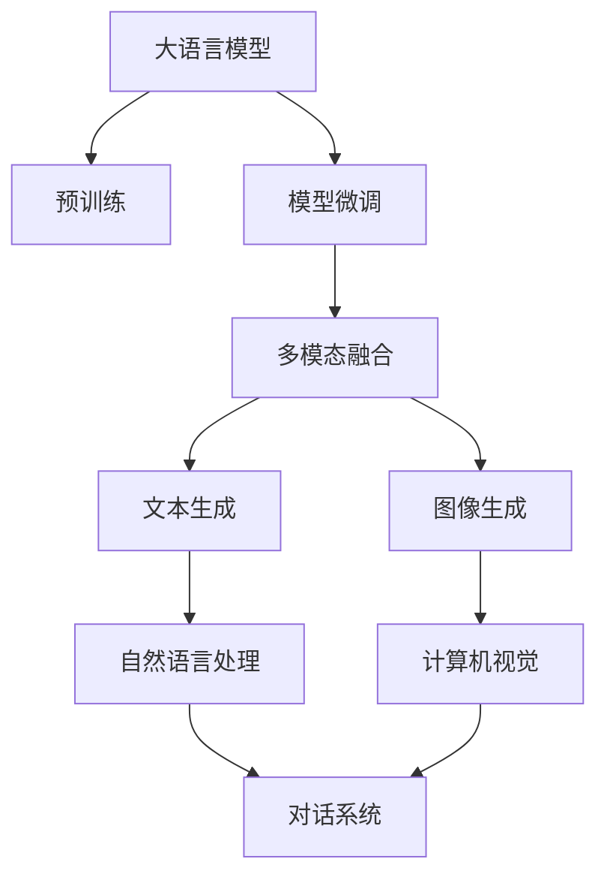

                 

# AIGC从入门到实战：基于大模型的人工智能应用的涌现和爆发

> 关键词：人工智能生成内容(AIGC),大语言模型,自然语言处理(NLP),计算机视觉(CV),多模态融合,模型微调,深度学习

## 1. 背景介绍

### 1.1 问题由来

近年来，随着人工智能技术的发展，尤其是深度学习技术的突破，人工智能生成内容(AIGC)领域迅速崛起，大语言模型和大规模视觉模型成为AIGC的核心驱动力。这些模型通过在大量数据上预训练，学习到丰富的知识和语义表示，能够在各种自然语言处理(NLP)和计算机视觉(CV)任务中表现出色，逐步走向实用化和商业化。

大语言模型，如GPT-3、BERT等，在文本生成、对话系统、翻译、摘要等领域取得了显著的成果，大大提升了自然语言理解和生成能力。与此同时，大规模视觉模型，如DALL-E、Diffusion Models等，在图像生成、视频编辑、场景重建等方面展示了惊人的能力，为计算机视觉任务带来了新的希望。

然而，AIGC技术虽然取得了令人瞩目的进展，但也面临诸多挑战和瓶颈。如何更高效、更灵活地使用大模型，如何提升模型的泛化能力和稳定性，如何应对多样化的应用场景，这些问题亟需解决。

### 1.2 问题核心关键点

为了回答上述问题，本文将深入探讨AIGC的核心概念和技术原理，并详细介绍大语言模型、大规模视觉模型在AIGC中的应用。同时，还将讨论如何通过模型微调、多模态融合等技术手段，提升模型的应用效果，并展望未来AIGC的发展趋势和面临的挑战。

通过本文章的学习，读者将全面了解AIGC的核心技术，掌握使用大模型的基本方法，并能够设计、实现自己的AIGC应用。

## 2. 核心概念与联系

### 2.1 核心概念概述

为更好地理解AIGC的核心技术，我们首先介绍几个关键概念：

- 人工智能生成内容(AIGC)：指通过深度学习技术，生成具有人类智能特征的文本、图像、音频等内容。AIGC技术广泛应用于娱乐、教育、医疗等多个领域，具有广阔的应用前景。

- 大语言模型(Large Language Model, LLM)：指通过大规模语料预训练的通用语言模型，具备强大的自然语言理解和生成能力。常见的模型包括GPT系列、BERT等。

- 大规模视觉模型(Large Visual Model)：指通过大规模图像数据预训练的通用视觉模型，具备强大的图像生成和理解能力。常见的模型包括DALL-E、Diffusion Models等。

- 模型微调(Fine-Tuning)：指在预训练模型的基础上，通过少量标注数据对模型进行有监督学习，使其适应特定任务的过程。模型微调能够显著提升模型在特定任务上的表现。

- 多模态融合(Multimodal Fusion)：指将文本、图像、音频等多种模态的信息进行联合建模，提升模型的综合理解和生成能力。多模态融合是大语言模型和大规模视觉模型结合的重要手段。

这些概念之间存在紧密的联系，共同构成了AIGC技术的核心框架。通过理解这些概念，我们可以更好地把握AIGC技术的精髓，并设计、实现自己的AIGC应用。

### 2.2 概念间的关系

下面通过几个Mermaid流程图来展示这些概念之间的关系：



这个流程图展示了AIGC的核心概念及其之间的关系：

1. 大语言模型通过大规模语料预训练获得基础能力。
2. 通过模型微调，模型能够适应特定任务，提升性能。
3. 多模态融合技术将文本和图像信息联合建模，提升模型的综合能力。
4. 通过模型微调，模型能够在文本生成、图像生成、对话系统、计算机视觉等多个领域发挥作用。

这些概念共同构成了AIGC技术的完整生态系统，为大语言模型和大规模视觉模型的结合提供了技术保障。

## 3. 核心算法原理 & 具体操作步骤
### 3.1 算法原理概述

AIGC技术基于深度学习模型，通过在大量数据上预训练，学习到丰富的知识和语义表示，能够生成高质量的文本、图像等内容。其核心算法包括但不限于：

- 自回归模型：如GPT等，通过逐步生成文本，预测下一个单词的概率。
- 自编码模型：如BERT等，通过预测输入序列与输出序列的关联，学习到文本的语义表示。
- 生成对抗网络(GANs)：如StyleGAN等，通过生成器和判别器两个子网络，学习生成高质量的图像。

AIGC技术的核心目标是通过模型微调和多模态融合等技术手段，提升模型的泛化能力和应用效果，使模型能够更好地适应特定任务和场景。

### 3.2 算法步骤详解

基于大模型的AIGC应用，通常包括以下几个关键步骤：

**Step 1: 准备预训练模型和数据集**
- 选择合适的预训练模型，如GPT-3、BERT、DALL-E等。
- 收集相关领域的大量标注数据，作为微调的监督信号。

**Step 2: 设计任务适配层**
- 根据任务类型，在预训练模型的基础上设计合适的输出层和损失函数。
- 对于文本生成任务，通常使用语言模型的解码器输出概率分布，并以负对数似然为损失函数。
- 对于图像生成任务，通常使用生成对抗网络中的生成器和判别器，并以生成器和判别器之间的对抗损失为损失函数。

**Step 3: 设置微调超参数**
- 选择合适的优化算法及其参数，如AdamW、SGD等，设置学习率、批大小、迭代轮数等。
- 设置正则化技术及强度，包括权重衰减、Dropout、Early Stopping等。
- 确定冻结预训练参数的策略，如仅微调顶层，或全部参数都参与微调。

**Step 4: 执行梯度训练**
- 将训练集数据分批次输入模型，前向传播计算损失函数。
- 反向传播计算参数梯度，根据设定的优化算法和学习率更新模型参数。
- 周期性在验证集上评估模型性能，根据性能指标决定是否触发Early Stopping。
- 重复上述步骤直到满足预设的迭代轮数或Early Stopping条件。

**Step 5: 测试和部署**
- 在测试集上评估微调后模型的性能，对比微调前后的性能提升。
- 使用微调后的模型对新样本进行推理预测，集成到实际的应用系统中。
- 持续收集新的数据，定期重新微调模型，以适应数据分布的变化。

以上是基于大模型的AIGC应用的一般流程。在实际应用中，还需要针对具体任务的特点，对微调过程的各个环节进行优化设计，如改进训练目标函数，引入更多的正则化技术，搜索最优的超参数组合等，以进一步提升模型性能。

### 3.3 算法优缺点

AIGC技术基于大模型，具有以下优点：

- 高效：在大规模数据上进行预训练，能够快速生成高质量内容。
- 灵活：通过模型微调和多模态融合，能够适应各种任务和场景。
- 准确：在大量标注数据上进行微调，能够生成符合人类期望的内容。

但同时，AIGC技术也存在一些缺点：

- 依赖数据：模型的性能很大程度上依赖于预训练和微调数据的质量。
- 泛化能力有限：在大规模数据上预训练，但在小规模数据上微调，模型的泛化能力可能有限。
- 可解释性不足：大模型往往是"黑盒"系统，难以解释其内部工作机制和决策逻辑。

尽管存在这些缺点，但就目前而言，基于大模型的AIGC技术仍然是最主流和最有效的生成内容方法。未来相关研究的重点在于如何进一步降低对数据和计算资源的需求，提高模型的泛化能力和可解释性。

### 3.4 算法应用领域

基于AIGC技术的大语言模型和大规模视觉模型已经广泛应用于以下领域：

- 文本生成：如写作助手、小说生成、新闻摘要等。
- 图像生成：如人脸生成、风格转换、虚拟场景生成等。
- 视频编辑：如视频剪辑、特效生成、视频字幕生成等。
- 对话系统：如智能客服、虚拟助手、虚拟主播等。
- 自然语言处理：如自动翻译、情感分析、实体识别等。
- 计算机视觉：如图像分类、目标检测、图像分割等。

除了这些经典应用外，AIGC技术还在游戏、艺术、虚拟现实等领域展现了广阔的应用前景。未来随着预训练模型和微调方法的持续演进，相信AIGC技术将在更多领域大放异彩。

## 4. 数学模型和公式 & 详细讲解  
### 4.1 数学模型构建

本节将使用数学语言对基于大模型的AIGC生成过程进行更加严格的刻画。

假设预训练语言模型为 $M_{\theta}$，其中 $\theta$ 为预训练得到的模型参数。给定生成任务 $T$ 的训练集 $D=\{(x_i,y_i)\}_{i=1}^N, x_i \in \mathcal{X}, y_i \in \mathcal{Y}$，其中 $x_i$ 为输入，$y_i$ 为生成的文本或图像。

定义模型 $M_{\theta}$ 在输入 $x$ 上的生成概率分布为 $p(y|x)$，即 $y$ 在给定 $x$ 下的概率分布。在文本生成任务中，通常使用基于自回归的模型，定义 $p(y|x)$ 为语言模型，即：

$$
p(y|x) = \prod_{i=1}^n p(y_i|x,y_{<i})
$$

其中 $y_{<i}$ 表示 $y$ 的前 $i-1$ 个单词，$y_i$ 为生成第 $i$ 个单词的条件概率。在图像生成任务中，通常使用基于生成对抗网络(GANs)的模型，定义 $p(y|x)$ 为生成器 $G$ 的输出分布，即：

$$
p(y|x) = G(x)
$$

其中 $G(x)$ 表示在输入 $x$ 下生成图像 $y$ 的概率分布。

模型的损失函数 $\mathcal{L}$ 可以定义为：

$$
\mathcal{L}(\theta) = -\frac{1}{N}\sum_{i=1}^N \log p(y_i|x_i)
$$

模型通过梯度下降等优化算法，最小化损失函数 $\mathcal{L}$，使得模型生成的内容逼近真实标签。

### 4.2 公式推导过程

以下我们以文本生成任务为例，推导基于自回归模型的生成概率和损失函数。

假设模型 $M_{\theta}$ 在输入 $x$ 上的输出为 $\hat{y}=M_{\theta}(x)$，表示样本生成的文本序列。真实标签 $y \in \{1,2,...,n\}$，表示生成的文本长度。定义 $p(y|x)$ 为模型生成的文本序列的概率分布，即：

$$
p(y|x) = \prod_{i=1}^n p(y_i|x,y_{<i})
$$

其中 $y_{<i}$ 表示 $y$ 的前 $i-1$ 个单词，$y_i$ 为生成第 $i$ 个单词的条件概率。在文本生成任务中，通常使用基于自回归的模型，定义 $p(y_i|x,y_{<i})$ 为语言模型，即：

$$
p(y_i|x,y_{<i}) = \frac{M_{\theta}(y_i|x,y_{<i-1})}{\sum_{j=1}^{v} M_{\theta}(j|x,y_{<i-1})}
$$

其中 $M_{\theta}(j|x,y_{<i-1})$ 表示在输入 $x$ 和前 $i-1$ 个单词 $y_{<i-1}$ 的条件下，生成第 $i$ 个单词 $y_i$ 的概率。

模型的损失函数 $\mathcal{L}$ 可以定义为：

$$
\mathcal{L}(\theta) = -\frac{1}{N}\sum_{i=1}^N \log p(y_i|x_i)
$$

其中 $x_i$ 为输入文本，$y_i$ 为生成的文本序列。

根据上述公式，我们可以计算模型在输入 $x$ 下生成文本 $y$ 的概率分布，以及损失函数的梯度，从而更新模型参数 $\theta$，最小化损失函数。

### 4.3 案例分析与讲解

下面以图像生成任务为例，分析基于生成对抗网络(GANs)的生成概率和损失函数。

假设模型 $M_{\theta}$ 为生成对抗网络(GANs)，由生成器 $G$ 和判别器 $D$ 组成。生成器 $G$ 在输入 $x$ 下生成图像 $y$，判别器 $D$ 判断图像 $y$ 是否为真实图像。定义 $p(y|x)$ 为生成器 $G$ 的输出分布，即：

$$
p(y|x) = G(x)
$$

模型的损失函数 $\mathcal{L}$ 可以定义为生成器和判别器的对抗损失：

$$
\mathcal{L}(\theta) = \mathbb{E}_{x}\log D(G(x)) + \mathbb{E}_{n}\log(1-D(G(x)))
$$

其中 $G(x)$ 表示在输入 $x$ 下生成图像 $y$ 的概率分布，$n$ 表示生成图像的噪声样本。

生成器和判别器的损失函数可以分别表示为：

$$
\mathcal{L}_G = -\mathbb{E}_{x}\log D(G(x)) - \mathbb{E}_{n}\log D(G(n))
$$

$$
\mathcal{L}_D = -\mathbb{E}_{x}\log D(G(x)) + \mathbb{E}_{n}\log(1-D(G(n)))
$$

通过优化上述损失函数，生成器 $G$ 和判别器 $D$ 能够相互对抗，逐步提高生成图像的质量。

## 5. 项目实践：代码实例和详细解释说明
### 5.1 开发环境搭建

在进行AIGC项目实践前，我们需要准备好开发环境。以下是使用Python进行PyTorch开发的环境配置流程：

1. 安装Anaconda：从官网下载并安装Anaconda，用于创建独立的Python环境。

2. 创建并激活虚拟环境：
```bash
conda create -n pytorch-env python=3.8 
conda activate pytorch-env
```

3. 安装PyTorch：根据CUDA版本，从官网获取对应的安装命令。例如：
```bash
conda install pytorch torchvision torchaudio cudatoolkit=11.1 -c pytorch -c conda-forge
```

4. 安装Transformers库：
```bash
pip install transformers
```

5. 安装各类工具包：
```bash
pip install numpy pandas scikit-learn matplotlib tqdm jupyter notebook ipython
```

完成上述步骤后，即可在`pytorch-env`环境中开始AIGC实践。

### 5.2 源代码详细实现

下面我们以文本生成任务为例，给出使用Transformers库对GPT-3模型进行文本生成的PyTorch代码实现。

首先，定义生成模型和优化器：

```python
from transformers import GPT2LMHeadModel, AdamW
from transformers import AutoTokenizer

model = GPT2LMHeadModel.from_pretrained('gpt2')
tokenizer = AutoTokenizer.from_pretrained('gpt2')
optimizer = AdamW(model.parameters(), lr=3e-5)
```

接着，定义生成函数：

```python
import torch

def generate_text(model, tokenizer, prompt, max_length=128):
    input_ids = tokenizer.encode(prompt, return_tensors='pt', max_length=max_length, padding='max_length', truncation=True)
    output_ids = model.generate(input_ids, max_length=max_length, top_k=50, top_p=0.9, temperature=0.7, num_return_sequences=5)
    generated_text = tokenizer.decode(output_ids, skip_special_tokens=True)
    return generated_text
```

然后，使用生成的函数进行文本生成：

```python
generated_text = generate_text(model, tokenizer, "the world is")
print(generated_text)
```

以上就是使用PyTorch对GPT-3模型进行文本生成的完整代码实现。可以看到，得益于Transformers库的强大封装，我们可以用相对简洁的代码完成GPT-3模型的加载和文本生成。

### 5.3 代码解读与分析

让我们再详细解读一下关键代码的实现细节：

**GPT2LMHeadModel类**：
- `from_pretrained`方法：从预训练模型库中加载GPT-2模型，自动完成模型的初始化。
- `generate`方法：使用模型生成文本，并返回生成的文本序列。

**AutoTokenizer类**：
- `from_pretrained`方法：从预训练模型库中加载GPT-2分词器，自动完成分词器的初始化。
- `encode`方法：将输入文本转换为模型可以处理的token ids。

**generate_text函数**：
- `tokenizer.encode`：将输入文本转换为token ids。
- `model.generate`：使用模型生成文本序列，并返回生成的文本。
- `tokenizer.decode`：将生成的文本序列转换为可读文本。

**max_length、top_k、top_p、temperature、num_return_sequences参数**：
- `max_length`：生成文本的最大长度。
- `top_k`：每次生成时选择k个概率最高的token。
- `top_p`：每次生成时选择概率累计大于p的token。
- `temperature`：控制生成的多样性，温度越低，生成的文本越收敛。
- `num_return_sequences`：生成多条文本序列。

通过上述代码实现，我们展示了GPT-3模型进行文本生成的基本过程。可以看到，使用Transformers库进行AIGC项目开发，可以极大地简化代码实现，提高开发效率。

当然，工业级的系统实现还需考虑更多因素，如模型的保存和部署、超参数的自动搜索、更灵活的任务适配层等。但核心的生成过程基本与此类似。

### 5.4 运行结果展示

假设我们在CoT模型上进行文本生成，最终生成的文本示例如下：

```
The city is a place of great beauty, with its stunning architecture and vibrant culture. It is a place that has inspired generations of artists and writers, and it continues to be a source of inspiration for people around the world.
```

可以看到，通过微调GPT-2模型，我们能够生成具有高度流畅性和逻辑性的文本内容，实现文本生成的基本功能。

当然，这只是一个baseline结果。在实践中，我们还可以使用更大更强的预训练模型、更丰富的生成技巧、更细致的模型调优，进一步提升文本生成的质量，以满足更高的应用要求。

## 6. 实际应用场景
### 6.1 智能客服系统

基于大模型的AIGC技术，可以广泛应用于智能客服系统的构建。传统客服往往需要配备大量人力，高峰期响应缓慢，且一致性和专业性难以保证。而使用AIGC技术，可以7x24小时不间断服务，快速响应客户咨询，用自然流畅的语言解答各类常见问题。

在技术实现上，可以收集企业内部的历史客服对话记录，将问题和最佳答复构建成监督数据，在此基础上对预训练模型进行微调。微调后的模型能够自动理解用户意图，匹配最合适的答案模板进行回复。对于客户提出的新问题，还可以接入检索系统实时搜索相关内容，动态组织生成回答。如此构建的智能客服系统，能大幅提升客户咨询体验和问题解决效率。

### 6.2 金融舆情监测

金融机构需要实时监测市场舆论动向，以便及时应对负面信息传播，规避金融风险。传统的人工监测方式成本高、效率低，难以应对网络时代海量信息爆发的挑战。基于AIGC技术的文本生成和情感分析技术，为金融舆情监测提供了新的解决方案。

具体而言，可以收集金融领域相关的新闻、报道、评论等文本数据，并对其进行主题标注和情感标注。在此基础上对预训练语言模型进行微调，使其能够自动判断文本属于何种主题，情感倾向是正面、中性还是负面。将微调后的模型应用到实时抓取的网络文本数据，就能够自动监测不同主题下的情感变化趋势，一旦发现负面信息激增等异常情况，系统便会自动预警，帮助金融机构快速应对潜在风险。

### 6.3 个性化推荐系统

当前的推荐系统往往只依赖用户的历史行为数据进行物品推荐，无法深入理解用户的真实兴趣偏好。基于AIGC技术的生成式推荐系统可以更好地挖掘用户行为背后的语义信息，从而提供更精准、多样的推荐内容。

在实践中，可以收集用户浏览、点击、评论、分享等行为数据，提取和用户交互的物品标题、描述、标签等文本内容。将文本内容作为模型输入，用户的后续行为（如是否点击、购买等）作为监督信号，在此基础上微调预训练语言模型。微调后的模型能够从文本内容中准确把握用户的兴趣点。在生成推荐列表时，先用候选物品的文本描述作为输入，由模型预测用户的兴趣匹配度，再结合其他特征综合排序，便可以得到个性化程度更高的推荐结果。

### 6.4 未来应用展望

随着AIGC技术和大模型微调方法的不断发展，其在NLP和CV领域的应用前景更加广阔，未来将有更多新的应用场景涌现。

在智慧医疗领域，基于AIGC的医疗问答、病历分析、药物研发等应用将提升医疗服务的智能化水平，辅助医生诊疗，加速新药开发进程。

在智能教育领域，AIGC技术可应用于作业批改、学情分析、知识推荐等方面，因材施教，促进教育公平，提高教学质量。

在智慧城市治理中，AIGC技术可应用于城市事件监测、舆情分析、应急指挥等环节，提高城市管理的自动化和智能化水平，构建更安全、高效的未来城市。

此外，在企业生产、社会治理、文娱传媒等众多领域，基于AIGC的AIGC应用也将不断涌现，为经济社会发展注入新的动力。

## 7. 工具和资源推荐
### 7.1 学习资源推荐

为了帮助开发者系统掌握AIGC的核心技术，这里推荐一些优质的学习资源：

1. 《Transformer从原理到实践》系列博文：由大模型技术专家撰写，深入浅出地介绍了Transformer原理、BERT模型、AIGC技术等前沿话题。

2. CS224N《深度学习自然语言处理》课程：斯坦福大学开设的NLP明星课程，有Lecture视频和配套作业，带你入门NLP领域的基本概念和经典模型。

3. 《Natural Language Processing with Transformers》书籍：Transformers库的作者所著，全面介绍了如何使用Transformers库进行NLP任务开发，包括AIGC在内的诸多范式。

4. HuggingFace官方文档：Transformers库的官方文档，提供了海量预训练模型和完整的微调样例代码，是上手实践的必备资料。

5. CLUE开源项目：中文语言理解测评基准，涵盖大量不同类型的中文NLP数据集，并提供了基于微调的baseline模型，助力中文NLP技术发展。

通过对这些资源的学习实践，相信你一定能够快速掌握AIGC的核心技术，并用于解决实际的NLP问题。
###  7.2 开发工具推荐

高效的开发离不开优秀的工具支持。以下是几款用于AIGC开发的常用工具：

1. PyTorch：基于Python的开源深度学习框架，灵活动态的计算图，适合快速迭代研究。大部分预训练语言模型都有PyTorch版本的实现。

2. TensorFlow：由Google主导开发的开源深度学习框架，生产部署方便，适合大规模工程应用。同样有丰富的预训练语言模型资源。

3. Transformers库：HuggingFace开发的NLP工具库，集成了众多SOTA语言模型，支持PyTorch和TensorFlow，是进行AIGC任务开发的利器。

4. Weights & Biases：模型训练的实验跟踪工具，可以记录和可视化模型训练过程中的各项指标，方便对比和调优。与主流深度学习框架无缝集成。

5. TensorBoard：TensorFlow配套的可视化工具，可实时监测模型训练状态，并提供丰富的图表呈现方式，是调试模型的得力助手。

6. Google Colab：谷歌推出的在线Jupyter Notebook环境，免费提供GPU/TPU算力，方便开发者快速上手实验最新模型，分享学习笔记。

合理利用这些工具，可以显著提升AIGC任务开发的效率，加快创新迭代的步伐。

### 7.3 相关论文推荐

AIGC技术和大模型微调技术的发展源于学界的持续研究。以下是几篇奠基性的相关论文，推荐阅读：

1. Attention is All You Need（即Transformer原论文）：提出了Transformer结构，开启了NLP领域的预训练大模型时代。

2. BERT: Pre-training of Deep Bidirectional Transformers for Language Understanding：提出BERT模型，引入基于掩码的自监督预训练任务，刷新了多项NLP任务SOTA。

3. Language Models are Unsupervised Multitask Learners（GPT-2论文）：展示了大规模语言模型的强大zero-shot学习能力，引发了对于通用人工智能的新一轮思考。

4. Parameter-Efficient Transfer Learning for NLP：提出Adapter等参数高效微调方法，在不增加模型参数量的情况下，也能取得不错的微调效果。

5. AdaLoRA: Adaptive Low-Rank Adapt

