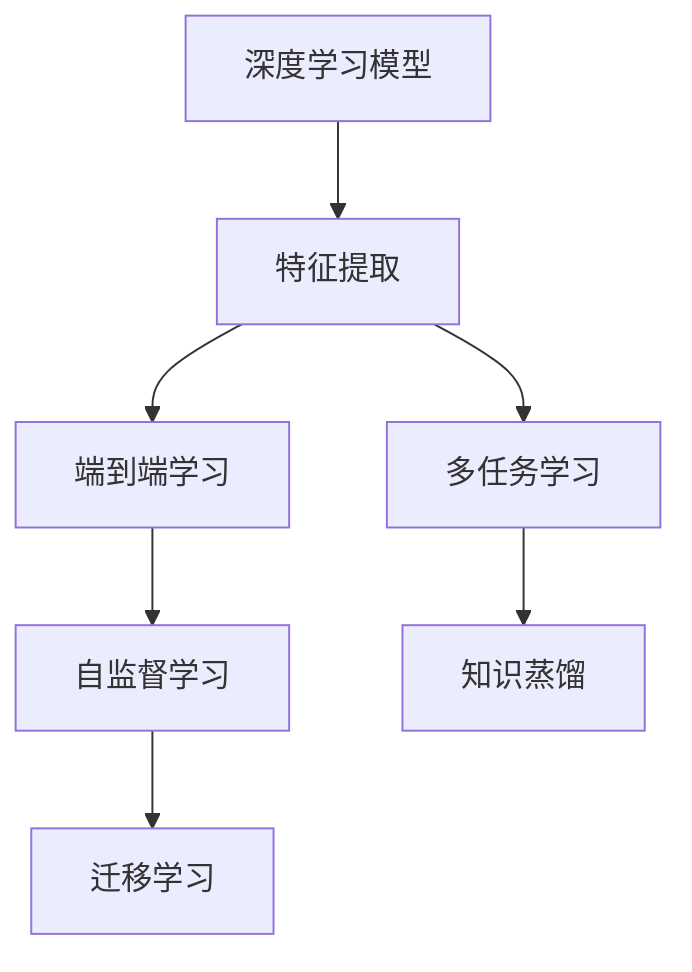
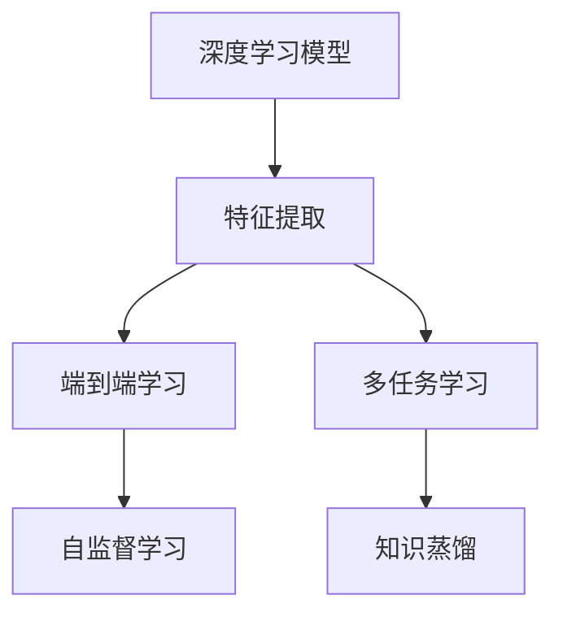
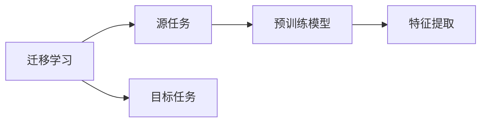
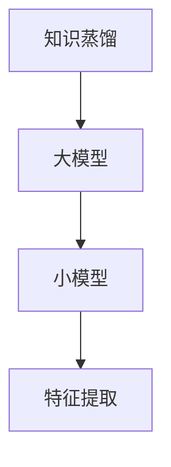

                 

## 1. 背景介绍

### 1.1 问题由来
在人工智能(AI)领域，特别是在计算机视觉和自然语言处理(NLP)等领域，特征提取一直是重要的一环。传统的特征提取方法往往依赖于手工设计的特征工程，需要大量的人工干预和调试，且无法保证在不同场景下的普适性和鲁棒性。

近年来，随着深度学习技术的兴起，尤其是卷积神经网络(CNN)和递归神经网络(RNN)等模型在图像识别和语言理解任务上的成功应用，特征提取逐渐向端到端学习演进。利用深度神经网络自动学习特征，减少了手工设计的复杂性，提高了模型的泛化能力和性能。

### 1.2 问题核心关键点
深度学习模型通过多层非线性变换，可以从原始数据中学习到高层次的特征表示。这些特征通常被称为"隐表示"(latent representations)，是模型进行分类、识别、生成等任务的基础。在实际应用中，如何高效、准确地提取特征，是深度学习模型的关键问题之一。

### 1.3 问题研究意义
特征提取是深度学习应用的核心技术之一。良好的特征提取能力能够提升模型的泛化性和稳定性，减少过拟合风险，提高模型的性能和效率。随着深度学习技术的不断演进，特征提取方法也在不断迭代，从手工设计到端到端学习，再到知识蒸馏、多任务学习等前沿方法，特征提取技术正在向智能化、自动化迈进。

## 2. 核心概念与联系

### 2.1 核心概念概述

为了更好地理解利用深度学习进行特征提取，本节将介绍几个密切相关的核心概念：

- 深度学习模型(Deep Learning Model)：以神经网络为代表，通过多层非线性变换学习高层次特征的模型。
- 特征提取(Feature Extraction)：从原始数据中学习到高层次的特征表示的过程。
- 端到端学习(End-to-End Learning)：在模型训练过程中，从原始数据直接到输出结果，无需中间人工干预的特征提取方法。
- 多任务学习(Multi-Task Learning, MTL)：模型同时学习多个相关任务，通过共享特征提升整体性能。
- 知识蒸馏(Knowledge Distillation)：通过迁移学习，将大模型的知识传递给小型模型，提升小型模型的性能。
- 自监督学习(Self-Supervised Learning)：利用数据自身的结构信息进行特征学习，无需标注数据。
- 迁移学习(Transfer Learning)：在特定任务上利用预训练模型的特征提取能力，提高模型性能。

这些核心概念之间的逻辑关系可以通过以下Mermaid流程图来展示：



这个流程图展示了大模型特征提取的相关概念及其之间的关系：

1. 深度学习模型通过多层非线性变换学习特征。
2. 端到端学习将特征提取和任务输出结合，避免了中间人工干预。
3. 多任务学习通过共享特征提升模型性能。
4. 知识蒸馏通过迁移学习，将大模型的知识传递给小型模型。
5. 自监督学习利用数据自身结构信息进行特征学习。
6. 迁移学习在特定任务上利用预训练模型的特征提取能力。

### 2.2 概念间的关系

这些核心概念之间存在着紧密的联系，形成了深度学习特征提取的完整生态系统。下面我通过几个Mermaid流程图来展示这些概念之间的关系。

#### 2.2.1 深度学习模型的学习范式



这个流程图展示了深度学习模型的特征提取过程，以及与之相关的端到端学习和多任务学习。

#### 2.2.2 迁移学习与特征提取的关系



这个流程图展示了迁移学习的基本原理，以及它与特征提取的关系。迁移学习涉及源任务和目标任务，预训练模型在源任务上学习，然后通过特征提取适配各种目标任务。

#### 2.2.3 知识蒸馏与特征提取的关系



这个流程图展示了知识蒸馏的基本原理，以及它与特征提取的关系。知识蒸馏通过迁移学习，将大模型的知识传递给小型模型，小型模型在特征提取层上得到提升。

## 3. 核心算法原理 & 具体操作步骤

### 3.1 算法原理概述

利用深度学习进行特征提取，通常是指通过多层神经网络自动学习输入数据的特征表示。这些特征通常被视为模型内部的隐表示(latent representations)，是模型进行分类、识别、生成等任务的基础。

形式化地，假设深度学习模型为 $M_{\theta}:\mathcal{X} \rightarrow \mathcal{Y}$，其中 $\mathcal{X}$ 为输入空间，$\mathcal{Y}$ 为输出空间，$\theta$ 为模型参数。特征提取的目标是最大化模型在输出空间 $\mathcal{Y}$ 上的表现。

一般而言，深度学习模型通过反向传播算法训练，利用梯度下降等优化算法最小化损失函数。对于分类任务，常用的损失函数包括交叉熵损失、均方误差损失等。对于回归任务，通常使用均方误差损失。对于生成任务，可以采用对数似然损失。

### 3.2 算法步骤详解

利用深度学习进行特征提取的主要步骤如下：

**Step 1: 准备数据集和预训练模型**
- 收集原始数据集，并进行数据预处理，如数据增强、数据清洗等。
- 选择合适的预训练模型，如CNN、RNN等，作为特征提取的基础。

**Step 2: 设计模型结构**
- 设计多层神经网络结构，包括卷积层、池化层、全连接层等。
- 选择合适的损失函数，如交叉熵损失、均方误差损失等。

**Step 3: 设置超参数**
- 选择合适的优化算法及其参数，如SGD、Adam等，设置学习率、批大小、迭代轮数等。
- 设置正则化技术及强度，包括权重衰减、Dropout、Early Stopping等。
- 确定冻结预训练参数的策略，如仅微调顶层，或全部参数都参与微调。

**Step 4: 执行梯度训练**
- 将训练集数据分批次输入模型，前向传播计算损失函数。
- 反向传播计算参数梯度，根据设定的优化算法和学习率更新模型参数。
- 周期性在验证集上评估模型性能，根据性能指标决定是否触发 Early Stopping。
- 重复上述步骤直到满足预设的迭代轮数或 Early Stopping 条件。

**Step 5: 测试和部署**
- 在测试集上评估特征提取后的模型输出。
- 使用特征提取后的模型进行实际应用，如图像分类、文本分类、目标检测等。
- 持续收集新数据，定期重新训练模型，以适应数据分布的变化。

以上是利用深度学习进行特征提取的一般流程。在实际应用中，还需要针对具体任务的特点，对特征提取过程的各个环节进行优化设计，如改进训练目标函数，引入更多的正则化技术，搜索最优的超参数组合等，以进一步提升模型性能。

### 3.3 算法优缺点

利用深度学习进行特征提取具有以下优点：
1. 自动学习特征。深度学习模型能够自动学习输入数据的隐表示，无需手工设计特征，减少了人工干预。
2. 泛化能力强。深度学习模型通过多层非线性变换，能够学习到更高层次的特征表示，提升了模型的泛化能力。
3. 可解释性高。深度学习模型内部结构清晰，可以可视化特征表示，便于理解和调试。
4. 适应性强。深度学习模型能够适应不同领域的特征提取需求，具有较好的泛化性。

同时，该方法也存在一定的局限性：
1. 数据需求高。深度学习模型需要大量标注数据进行训练，获取高质量标注数据的成本较高。
2. 计算资源消耗大。深度学习模型需要高性能计算资源进行训练和推理，对硬件要求较高。
3. 可解释性不足。深度学习模型的内部机制难以解释，模型的决策过程缺乏透明性。
4. 易过拟合。深度学习模型参数众多，容易在训练过程中出现过拟合现象。

尽管存在这些局限性，但就目前而言，利用深度学习进行特征提取仍是特征提取领域的先进方法，广泛应用于图像识别、自然语言处理、语音识别等领域。

### 3.4 算法应用领域

利用深度学习进行特征提取的方法，已在多个领域得到了广泛应用，例如：

- 计算机视觉：用于图像分类、目标检测、人脸识别、图像生成等任务。
- 自然语言处理：用于文本分类、情感分析、机器翻译、自动摘要等任务。
- 语音识别：用于语音识别、语音情感分析、说话人识别等任务。
- 生物信息学：用于基因序列分析、蛋白质结构预测、医学影像分析等任务。
- 遥感图像处理：用于遥感图像分类、目标检测、图像分割等任务。
- 智能交通：用于交通监控、车辆识别、交通预测等任务。

除了上述这些经典应用领域外，利用深度学习进行特征提取的方法还在不断拓展，应用于更多新兴领域，如智能制造、智能家居、智能医疗等。

## 4. 数学模型和公式 & 详细讲解 & 举例说明

### 4.1 数学模型构建

本节将使用数学语言对利用深度学习进行特征提取的过程进行更加严格的刻画。

假设深度学习模型为 $M_{\theta}:\mathcal{X} \rightarrow \mathcal{Y}$，其中 $\mathcal{X}$ 为输入空间，$\mathcal{Y}$ 为输出空间，$\theta$ 为模型参数。特征提取的目标是最大化模型在输出空间 $\mathcal{Y}$ 上的表现。

定义模型 $M_{\theta}$ 在输入 $x$ 上的输出为 $\hat{y}=M_{\theta}(x) \in [0,1]$，表示样本属于正类的概率。真实标签 $y \in \{0,1\}$。则二分类交叉熵损失函数定义为：

$$
\ell(M_{\theta}(x),y) = -[y\log \hat{y} + (1-y)\log (1-\hat{y})]
$$

将其代入经验风险公式，得：

$$
\mathcal{L}(\theta) = -\frac{1}{N}\sum_{i=1}^N [y_i\log M_{\theta}(x_i)+(1-y_i)\log(1-M_{\theta}(x_i))]
$$

在实践中，我们通常使用基于梯度的优化算法（如SGD、Adam等）来近似求解上述最优化问题。设 $\eta$ 为学习率，$\lambda$ 为正则化系数，则参数的更新公式为：

$$
\theta \leftarrow \theta - \eta \nabla_{\theta}\mathcal{L}(\theta) - \eta\lambda\theta
$$

其中 $\nabla_{\theta}\mathcal{L}(\theta)$ 为损失函数对参数 $\theta$ 的梯度，可通过反向传播算法高效计算。

### 4.2 公式推导过程

以下我们以二分类任务为例，推导交叉熵损失函数及其梯度的计算公式。

假设模型 $M_{\theta}$ 在输入 $x$ 上的输出为 $\hat{y}=M_{\theta}(x) \in [0,1]$，表示样本属于正类的概率。真实标签 $y \in \{0,1\}$。则二分类交叉熵损失函数定义为：

$$
\ell(M_{\theta}(x),y) = -[y\log \hat{y} + (1-y)\log (1-\hat{y})]
$$

将其代入经验风险公式，得：

$$
\mathcal{L}(\theta) = -\frac{1}{N}\sum_{i=1}^N [y_i\log M_{\theta}(x_i)+(1-y_i)\log(1-M_{\theta}(x_i))]
$$

根据链式法则，损失函数对参数 $\theta_k$ 的梯度为：

$$
\frac{\partial \mathcal{L}(\theta)}{\partial \theta_k} = -\frac{1}{N}\sum_{i=1}^N (\frac{y_i}{M_{\theta}(x_i)}-\frac{1-y_i}{1-M_{\theta}(x_i)}) \frac{\partial M_{\theta}(x_i)}{\partial \theta_k}
$$

其中 $\frac{\partial M_{\theta}(x_i)}{\partial \theta_k}$ 可进一步递归展开，利用自动微分技术完成计算。

在得到损失函数的梯度后，即可带入参数更新公式，完成模型的迭代优化。重复上述过程直至收敛，最终得到适应下游任务的最优模型参数 $\theta^*$。

### 4.3 案例分析与讲解

下面我们以图像分类任务为例，给出利用深度学习进行特征提取的PyTorch代码实现。

首先，定义图像分类任务的数据处理函数：

```python
from torchvision import datasets, transforms
from torch.utils.data import DataLoader
from torchvision.models import resnet50

# 数据预处理
transform_train = transforms.Compose([
    transforms.RandomResizedCrop(224),
    transforms.RandomHorizontalFlip(),
    transforms.ToTensor(),
    transforms.Normalize(mean=[0.485, 0.456, 0.406], std=[0.229, 0.224, 0.225])
])

transform_test = transforms.Compose([
    transforms.Resize(256),
    transforms.CenterCrop(224),
    transforms.ToTensor(),
    transforms.Normalize(mean=[0.485, 0.456, 0.406], std=[0.229, 0.224, 0.225])
])

train_dataset = datasets.CIFAR10(root='./data', train=True, download=True, transform=transform_train)
test_dataset = datasets.CIFAR10(root='./data', train=False, download=True, transform=transform_test)

# 加载模型
model = resnet50(pretrained=True)

# 优化器
optimizer = torch.optim.SGD(model.parameters(), lr=0.01, momentum=0.9, weight_decay=0.0005)

# 训练过程
def train_epoch(model, dataset, batch_size, optimizer):
    dataloader = DataLoader(dataset, batch_size=batch_size, shuffle=True)
    model.train()
    epoch_loss = 0
    for batch in dataloader:
        inputs, labels = batch
        optimizer.zero_grad()
        outputs = model(inputs)
        loss = torch.nn.CrossEntropyLoss()(outputs, labels)
        epoch_loss += loss.item()
        loss.backward()
        optimizer.step()
    return epoch_loss / len(dataloader)

# 评估过程
def evaluate(model, dataset, batch_size):
    dataloader = DataLoader(dataset, batch_size=batch_size, shuffle=False)
    model.eval()
    preds, labels = [], []
    with torch.no_grad():
        for batch in dataloader:
            inputs, labels = batch
            outputs = model(inputs)
            batch_preds = torch.argmax(outputs, dim=1).to('cpu').tolist()
            batch_labels = labels.to('cpu').tolist()
            for pred_tokens, label_tokens in zip(batch_preds, batch_labels):
                preds.append(pred_tokens[:len(label_tokens)])
                labels.append(label_tokens)
    return torch.mean(torch.tensor(preds) == torch.tensor(labels))
```

然后，定义训练和评估函数：

```python
epochs = 10
batch_size = 64

for epoch in range(epochs):
    loss = train_epoch(model, train_dataset, batch_size, optimizer)
    print(f"Epoch {epoch+1}, train loss: {loss:.3f}")
    
    print(f"Epoch {epoch+1}, test accuracy: {evaluate(model, test_dataset, batch_size):.3f}")
```

最后，启动训练流程并在测试集上评估：

```python
epochs = 10
batch_size = 64

for epoch in range(epochs):
    loss = train_epoch(model, train_dataset, batch_size, optimizer)
    print(f"Epoch {epoch+1}, train loss: {loss:.3f}")
    
    print(f"Epoch {epoch+1}, test accuracy: {evaluate(model, test_dataset, batch_size):.3f}")
```

以上就是利用深度学习进行图像分类任务的特征提取的完整代码实现。可以看到，得益于PyTorch的强大封装，我们可以用相对简洁的代码完成特征提取过程。

## 5. 项目实践：代码实例和详细解释说明

### 5.1 开发环境搭建

在进行特征提取实践前，我们需要准备好开发环境。以下是使用Python进行PyTorch开发的环境配置流程：

1. 安装Anaconda：从官网下载并安装Anaconda，用于创建独立的Python环境。

2. 创建并激活虚拟环境：
```bash
conda create -n pytorch-env python=3.8 
conda activate pytorch-env
```

3. 安装PyTorch：根据CUDA版本，从官网获取对应的安装命令。例如：
```bash
conda install pytorch torchvision torchaudio cudatoolkit=11.1 -c pytorch -c conda-forge
```

4. 安装各类工具包：
```bash
pip install numpy pandas scikit-learn matplotlib tqdm jupyter notebook ipython
```

完成上述步骤后，即可在`pytorch-env`环境中开始特征提取实践。

### 5.2 源代码详细实现

下面我们以自然语言处理(NLP)任务为例，给出利用深度学习进行特征提取的PyTorch代码实现。

首先，定义NLP任务的数据处理函数：

```python
from torchtext import data, datasets
from torchtext.legacy.transforms import stack

# 定义字段
TEXT = data.Field(tokenize='spacy', lower=True)
LABEL = data.LabelField(dtype=torch.int64)

# 分割训练集和测试集
train_data, test_data = datasets.IMDB.splits(TEXT, LABEL)

# 构建词汇表
TEXT.build_vocab(train_data, max_size=10000)
LABEL.build_vocab(train_data)

# 构建样本
def collate(examples):
    return {'input': stack([example.text for example in examples]), 'label': torch.tensor([example.label for example in examples])}

train_iterator, test_iterator = data.BucketIterator(train_data, test_data, batch_size=64, collate_fn=collate)
```

然后，定义模型结构：

```python
from torch.nn import Linear, ReLU

class TextClassifier(nn.Module):
    def __init__(self, vocab_size, embedding_dim, num_class):
        super(TextClassifier, self).__init__()
        self.embedding = nn.Embedding(vocab_size, embedding_dim)
        self.fc = nn.Linear(embedding_dim, num_class)
        self.relu = ReLU()
    
    def forward(self, text):
        embedding = self.embedding(text)
        return self.fc(self.relu(embedding))
```

接着，定义训练和评估函数：

```python
from torch.nn import CrossEntropyLoss

model = TextClassifier(len(TEXT.vocab), 256, num_class=2)
optimizer = torch.optim.Adam(model.parameters(), lr=0.001)

def train_epoch(model, iterator, optimizer, criterion):
    epoch_loss = 0
    epoch_acc = 0
    model.train()
    for batch in iterator:
        optimizer.zero_grad()
        predictions = model(batch.input).squeeze(1)
        loss = criterion(predictions, batch.label)
        epoch_loss += loss.item()
        acc = (predictions == batch.label).float().mean()
        epoch_acc += acc.item()
        loss.backward()
        optimizer.step()
    return epoch_loss / len(iterator), epoch_acc / len(iterator)

def evaluate(model, iterator, criterion):
    model.eval()
    epoch_loss = 0
    epoch_acc = 0
    with torch.no_grad():
        for batch in iterator:
            predictions = model(batch.input).squeeze(1)
            loss = criterion(predictions, batch.label)
            epoch_loss += loss.item()
            acc = (predictions == batch.label).float().mean()
            epoch_acc += acc.item()
    return epoch_loss / len(iterator), epoch_acc / len(iterator)
```

最后，启动训练流程并在测试集上评估：

```python
epochs = 10
batch_size = 64

for epoch in range(epochs):
    train_loss, train_acc = train_epoch(model, train_iterator, optimizer, criterion)
    print(f"Epoch {epoch+1}, train loss: {train_loss:.3f}, train acc: {train_acc:.3f}")
    
    test_loss, test_acc = evaluate(model, test_iterator, criterion)
    print(f"Epoch {epoch+1}, test loss: {test_loss:.3f}, test acc: {test_acc:.3f}")
```

以上就是利用深度学习进行文本分类任务的特征提取的完整代码实现。可以看到，得益于PyTorch的强大封装，我们可以用相对简洁的代码完成特征提取过程。

## 6. 实际应用场景

### 6.1 图像分类

图像分类是深度学习特征提取的经典应用之一。在实际应用中，可以利用深度学习模型自动提取图像特征，并进行分类。例如，利用ResNet、Inception等深度网络，可以在CIFAR-10、ImageNet等数据集上进行图像分类任务。这些模型通过多层非线性变换，学习到高层次的特征表示，能够有效识别出图像中的不同对象。

在技术实现上，可以利用数据增强、数据清洗等预处理手段，提升模型泛化能力。同时，可以通过正则化、Dropout等方法，避免过拟合现象。最后，通过在大规模数据集上进行训练，可以获得高精度的图像分类模型。

### 6.2 文本分类

文本分类是自然语言处理(NLP)领域的重要任务之一。在实际应用中，可以利用深度学习模型自动提取文本特征，并进行分类。例如，利用CNN、RNN等深度网络，可以在IMDB、Yelp等数据集上进行文本分类任务。这些模型通过多层非线性变换，学习到高层次的特征表示，能够有效识别出文本中的不同类别。

在技术实现上，可以利用数据增强、分词、词向量等预处理手段，提升模型泛化能力。同时，可以通过正则化、Dropout等方法，避免过拟合现象。最后，通过在大规模数据集上进行训练，可以获得高精度的文本分类模型。

### 6.3 目标检测

目标检测是计算机视觉领域的重要任务之一。在实际应用中，可以利用深度学习模型自动提取图像中的目标特征，并进行检测。例如，利用Faster R-CNN、YOLO等深度网络，可以在COCO等数据集上进行目标检测任务。这些模型通过多层非线性变换，学习到高层次的特征表示，能够有效检测出图像中的不同对象。

在技术实现上，可以利用数据增强、数据清洗等预处理手段，提升模型泛化能力。同时，可以通过正则化、Dropout等方法，避免过拟合现象。最后，通过在大规模数据集上进行训练，可以获得高精度的目标检测模型。

### 6.4 未来应用展望

随着深度学习技术的不断演进，特征提取方法也在不断迭代，从手工设计到端到端学习，再到知识蒸馏、多任务学习等前沿方法，特征提取技术正在向智能化、自动化迈进。未来，基于深度学习的特征提取方法将在更多领域得到应用，为传统行业带来变革性影响。

在智慧医疗领域，基于深度学习的特征提取技术可以用于医学影像分析、基因序列分析等任务，提升医疗服务的智能化水平，辅助医生诊疗，加速新药开发进程。

在智能教育领域，深度学习的特征提取技术可以用于学生行为分析、学情分析、知识推荐等任务，因材施教，促进教育公平，提高教学质量。

在智慧城市治理中，深度学习的特征提取技术可以用于城市事件监测、舆情分析、应急指挥等环节，提高城市管理的自动化和智能化水平，构建更安全、高效的未来城市。

此外，在企业生产、社会治理、文娱传媒等众多领域，基于深度学习的特征提取技术也将不断涌现，为传统行业带来变革性影响。相信随着技术的日益成熟，深度学习特征提取技术将成为人工智能落地应用的重要范式，推动人工智能向更广阔的领域加速渗透。

## 7. 工具和资源推荐

### 7.1 学习资源推荐

为了帮助开发者系统掌握深度学习特征提取的理论基础和实践技巧，这里推荐一些优质的学习资源：

1. 《深度学习》系列书籍：由多位深度学习领域的顶尖学者合著，系统介绍了深度学习的基本概念、算法和应用。

2. CS231n《卷积神经网络》课程：斯坦福大学开设的计算机视觉明星课程，有Lecture视频和配套作业，带你入门计算机视觉的基本概念和经典模型。

3. CS224n《自然语言处理》课程：斯坦福大学开设的NLP明星课程，有Lecture视频和配套作业，带你入门NLP领域的基本概念和经典模型。

4. 《Deep Learning with PyTorch》书籍：由PyTorch核心开发者撰写，全面介绍了如何使用PyTorch进行深度学习开发，包括特征提取等诸多范式。

5. PyTorch官方文档：PyTorch的官方文档，提供了海量预训练模型和完整的特征提取样例代码，是上手实践的必备资料。

6. Weights & Biases：模型训练的实验跟踪工具，可以记录和可视化模型训练过程中的各项

