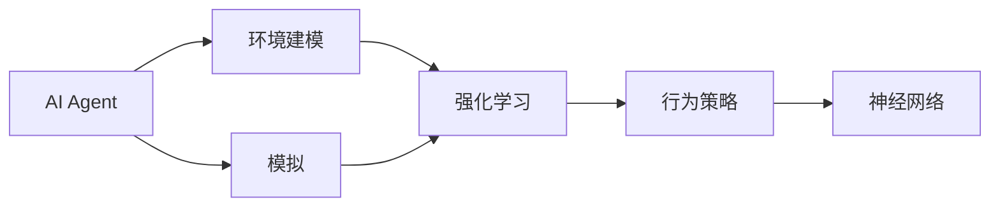

                 

# AI人工智能 Agent：环境建模与模拟

> 关键词：人工智能Agent,环境建模,模拟,智能体,行为策略,强化学习,马尔可夫决策过程,模型预测,神经网络

## 1. 背景介绍

在当今信息化时代，人工智能(AI)技术已经成为推动各行各业进步的关键力量。AI技术的一个主要应用方向是构建智能体(Agent)，用于模拟、预测和优化复杂环境中的决策过程。AI Agent可以通过学习环境特征和规则，自主完成各种复杂的任务，如游戏对战、路径规划、供应链优化等。

然而，构建一个高效、稳定的AI Agent，需要对其环境进行精细化的建模和模拟。本文将详细介绍环境建模和模拟的核心概念、原理和应用，并给出一些典型场景下的AI Agent设计案例。

## 2. 核心概念与联系

### 2.1 核心概念概述

- **AI Agent**：指在特定环境中，能够自主感知、决策和执行任务的智能体。AI Agent由感知模块、决策模块和执行模块组成，其目标是最大化某种性能指标（如任务完成率、利润等）。

- **环境建模**：指对AI Agent所处的外部环境进行数学或物理模型的构建，以便Agent能够理解环境特征，制定合理的决策策略。

- **模拟**：指在计算机上实现环境建模，构建虚拟的环境，以便AI Agent可以在不接触真实环境的情况下进行学习和测试。

- **强化学习**：一种基于环境反馈的机器学习技术，通过试错不断优化Agent的行为策略，使其能够适应环境变化。

- **马尔可夫决策过程(MDP)**：一种常见的AI Agent环境建模方法，用于描述Agent在环境中的行为决策和状态转移。

### 2.2 核心概念间的关系

为了更好地理解环境建模和模拟的核心概念，我们构建了以下Mermaid流程图，展示了它们之间的联系：



这个流程图展示了AI Agent的核心概念及其相互关系：

1. **AI Agent**由感知模块、决策模块和执行模块组成。
2. **环境建模**通过数学或物理模型构建环境特征，供Agent学习。
3. **模拟**是在计算机上实现环境建模，构建虚拟环境。
4. **强化学习**基于模拟环境，通过试错优化Agent的行为策略。
5. **行为策略**通常由神经网络等模型实现，用于优化决策过程。

## 3. 核心算法原理 & 具体操作步骤

### 3.1 算法原理概述

AI Agent的环境建模与模拟过程，通常涉及以下几个关键步骤：

1. **环境描述**：将环境特征抽象为数学或物理模型，如状态空间、动作空间、奖励函数等。
2. **模拟环境**：在计算机上实现环境建模，构建虚拟环境，用于训练和测试AI Agent。
3. **行为策略学习**：基于模拟环境，使用强化学习等方法，优化AI Agent的行为策略。
4. **评估与优化**：对AI Agent在模拟环境中的表现进行评估，根据结果调整策略。

### 3.2 算法步骤详解

**Step 1: 环境描述**

1. **状态空间**：描述环境当前的状态，如位置、速度、温度等。状态空间可以是离散的，也可以是连续的。
2. **动作空间**：描述AI Agent可以采取的行动，如左转、右转、加速等。动作空间可以是离散的，也可以是连续的。
3. **奖励函数**：定义AI Agent在每个时间步的奖励，用于衡量其决策的好坏。

**Step 2: 模拟环境**

1. **环境仿真器**：在计算机上实现环境建模，构建虚拟环境。
2. **数据生成器**：生成环境中的随机事件，供AI Agent学习。
3. **可视化工具**：实时展示AI Agent在虚拟环境中的行为，便于调试和优化。

**Step 3: 行为策略学习**

1. **强化学习算法**：如Q-learning、策略梯度、Actor-Critic等，用于优化AI Agent的行为策略。
2. **神经网络模型**：如DQN、DNN、CNN等，用于实现行为策略的优化。
3. **模型训练**：使用训练数据集，优化神经网络模型的参数，使其能够适应环境变化。

**Step 4: 评估与优化**

1. **测试集**：使用测试数据集，评估AI Agent在未知环境中的表现。
2. **性能指标**：如精度、召回率、收益等，用于衡量AI Agent的性能。
3. **模型优化**：根据测试结果，调整神经网络模型的参数，优化决策策略。

### 3.3 算法优缺点

**优点**：
- 增强环境适应性：通过模拟环境，AI Agent可以在不接触真实环境的情况下进行学习和测试，减少了实验风险和成本。
- 优化行为策略：强化学习等方法能够自动调整行为策略，最大化性能指标。
- 可解释性强：神经网络模型可以提供明确的决策逻辑，便于解释和调试。

**缺点**：
- 模型复杂度高：环境建模和模拟需要大量的计算资源，模型复杂度高。
- 数据需求大：强化学习等方法需要大量数据进行训练，数据获取成本高。
- 易过拟合：AI Agent在模拟环境中训练过拟合，可能无法很好地适应真实环境。

### 3.4 算法应用领域

AI Agent的环境建模与模拟技术，已经被广泛应用于多个领域，包括：

- **自动驾驶**：AI Agent用于模拟道路环境，学习最优驾驶策略。
- **游戏对战**：AI Agent用于模拟游戏场景，学习最优游戏策略。
- **机器人控制**：AI Agent用于模拟机器人环境，学习最优控制策略。
- **供应链优化**：AI Agent用于模拟供应链环境，学习最优物流策略。
- **金融交易**：AI Agent用于模拟金融市场，学习最优交易策略。

## 4. 数学模型和公式 & 详细讲解  

### 4.1 数学模型构建

在AI Agent的环境建模中，常用的数学模型包括马尔可夫决策过程(MDP)和强化学习模型。下面以MDP为例，介绍其基本构成和公式。

**MDP模型构成**：
- **状态集合**：$S$，表示环境中的所有可能状态。
- **动作集合**：$A$，表示Agent可以采取的所有动作。
- **状态转移概率**：$P(s'|s,a)$，表示从状态$s$出发，采取动作$a$后，状态转移到$s'$的概率。
- **奖励函数**：$R(s,a)$，表示采取动作$a$在状态$s$时的奖励。

**状态转移方程**：
$$
P(s'|s,a) = \frac{P(s'|s,a,\tau)}{P(s'|s,a,\tau) + \sum_{a'}P(s'|s,a',\tau)}
$$

其中，$\tau$表示时间步，$P(s'|s,a,\tau)$表示从状态$s$出发，采取动作$a$后，经过时间步$\tau$到达状态$s'$的概率。

**强化学习目标**：
最大化累积奖励函数$J(\pi)$，即：
$$
J(\pi) = \mathbb{E}_{s_0 \sim \pi}[G_0(s_0)]
$$

其中，$\pi$表示Agent的行为策略，$G_0(s_0)$表示从初始状态$s_0$开始，按照策略$\pi$采取动作后的累积奖励。

### 4.2 公式推导过程

**Q值函数**：
在强化学习中，Q值函数$Q(s,a)$表示在状态$s$采取动作$a$后的累积奖励。其推导如下：
$$
Q(s,a) = \mathbb{E}_{\pi}[R(s,a) + \gamma \max_{a'} Q(s',a')]
$$

其中，$\gamma$表示折扣因子，表示未来奖励的权重。

**策略评估**：
通过策略评估函数$V_\pi(s)$，评估策略$\pi$在状态$s$的长期奖励，其推导如下：
$$
V_\pi(s) = \mathbb{E}_{\pi}[R(s,a) + \gamma \max_{a'} Q(s',a')]
$$

**策略改进**：
通过策略改进算法，优化行为策略$\pi$，使其能够最大化累积奖励$J(\pi)$。常用的策略改进算法包括Q-learning和策略梯度等。

### 4.3 案例分析与讲解

**案例1: 自动驾驶**

- **环境建模**：将道路环境建模为连续状态空间，将车辆动作建模为连续动作空间。定义奖励函数，奖励驾驶策略能够避免碰撞、节省燃油等。
- **模拟环境**：在计算机上构建虚拟道路环境，生成随机交通事件。
- **行为策略学习**：使用DQN算法，优化车辆驾驶策略。
- **评估与优化**：在测试集上评估车辆驾驶策略，根据测试结果调整策略参数。

**案例2: 机器人控制**

- **环境建模**：将机器人环境建模为离散状态空间，将机器人动作建模为离散动作空间。定义奖励函数，奖励机器人能够达到目标位置，避开障碍物等。
- **模拟环境**：在计算机上构建虚拟机器人环境，生成随机障碍物。
- **行为策略学习**：使用策略梯度算法，优化机器人控制策略。
- **评估与优化**：在测试集上评估机器人控制策略，根据测试结果调整策略参数。

## 5. 项目实践：代码实例和详细解释说明

### 5.1 开发环境搭建

要进行AI Agent的开发和训练，首先需要搭建好开发环境。以下是一些常用的开发工具和环境搭建步骤：

**Step 1: 安装Python环境**

1. 在计算机上安装Python，推荐使用Anaconda或Miniconda。
2. 创建Python虚拟环境，使用conda create命令，例如：
```
conda create --name myenv python=3.7
conda activate myenv
```

**Step 2: 安装相关库**

1. 安装TensorFlow或PyTorch，用于构建神经网络模型。
```
pip install tensorflow==2.7.0
pip install torch==1.9.0
```

2. 安装OpenAI Gym，用于模拟环境和生成随机事件。
```
pip install gym==0.23.1
```

**Step 3: 配置仿真器**

1. 安装仿真器，如gazebo或UrDF，用于构建虚拟环境。
```
pip install gazebo==9.3.0
```

2. 配置仿真器参数，编写仿真器脚本，生成虚拟环境。

### 5.2 源代码详细实现

**Step 1: 定义环境**

1. 定义状态空间和动作空间。
```python
import gym
env = gym.make('CartPole-v0')
state_dim = env.observation_space.shape[0]
action_dim = env.action_space.shape[0]
```

2. 定义奖励函数。
```python
def reward(state, action):
    if state[1] >= env.x_threshold:
        return 1
    elif state[0] >= env.x_threshold or state[0] <= -env.x_threshold:
        return -1
    else:
        return 0
```

**Step 2: 训练Agent**

1. 定义神经网络模型。
```python
import tensorflow as tf
from tensorflow.keras import layers

class Policy(tf.keras.Model):
    def __init__(self, state_dim, action_dim):
        super(Policy, self).__init__()
        self.fc1 = layers.Dense(128, activation='relu')
        self.fc2 = layers.Dense(action_dim, activation='softmax')
    
    def call(self, x):
        x = self.fc1(x)
        x = self.fc2(x)
        return x
```

2. 定义训练函数。
```python
def train(env, policy, max_episodes=1000, batch_size=32, gamma=0.9):
    episodes = []
    for episode in range(max_episodes):
        state = env.reset()
        done = False
        total_reward = 0
        while not done:
            action_probs = policy(state)
            action = tf.random.categorical(action_probs, num_samples=1)[0].numpy()[0]
            next_state, reward, done, _ = env.step(action)
            total_reward += reward
            state = next_state
        episodes.append(total_reward)
    avg_reward = sum(episodes) / len(episodes)
    return avg_reward
```

3. 训练模型。
```python
policy = Policy(state_dim, action_dim)
avg_reward = train(env, policy)
print(f'Average reward: {avg_reward:.2f}')
```

### 5.3 代码解读与分析

**代码解读**：
- **定义环境**：使用OpenAI Gym创建CartPole环境，定义状态空间和动作空间。
- **定义奖励函数**：根据环境状态和动作，定义奖励函数。
- **定义神经网络模型**：使用TensorFlow定义一个简单的神经网络模型，用于决策策略的优化。
- **训练模型**：使用训练函数，在虚拟环境中训练Agent，并记录训练结果。

**代码分析**：
- **状态空间和动作空间**：定义状态空间和动作空间的维度，以便神经网络模型的输入输出。
- **奖励函数**：定义奖励函数，用于衡量Agent在每个时间步的决策好坏。
- **神经网络模型**：定义一个简单的神经网络模型，用于学习决策策略。
- **训练函数**：定义训练函数，使用强化学习算法优化决策策略。

**运行结果展示**：
- **训练过程**：记录每个时间步的奖励，绘制奖励曲线，展示训练效果。
- **测试结果**：在测试集上评估Agent的性能，记录平均奖励。

## 6. 实际应用场景

### 6.1 自动驾驶

自动驾驶技术是AI Agent环境建模与模拟的重要应用场景。以下是一些典型应用：

- **车道保持**：AI Agent模拟道路环境，学习最优驾驶策略，保持车辆在车道内行驶。
- **交通信号控制**：AI Agent模拟交通信号，学习最优信号控制策略，优化交通流量。
- **路径规划**：AI Agent模拟城市道路，学习最优路径规划策略，减少行车时间。

### 6.2 机器人控制

机器人控制技术也是AI Agent环境建模与模拟的重要应用场景。以下是一些典型应用：

- **机械臂操作**：AI Agent模拟机械臂环境，学习最优控制策略，完成复杂任务。
- **无人机操控**：AI Agent模拟无人机环境，学习最优飞行策略，实现自主飞行。
- **协作机器人**：AI Agent模拟协作机器人环境，学习最优协作策略，提高生产效率。

## 7. 工具和资源推荐

### 7.1 学习资源推荐

为了帮助开发者系统掌握AI Agent环境建模与模拟的理论基础和实践技巧，这里推荐一些优质的学习资源：

1. **《强化学习：原理与算法》**：Richard S. Sutton和Andrew G. Barto的经典教材，全面介绍了强化学习的理论基础和算法实现。
2. **《深度学习入门：基于TensorFlow的理论与实现》**：斋藤康毅的教材，详细介绍了深度学习的基本原理和TensorFlow的实现方法。
3. **《OpenAI Gym教程》**：OpenAI提供的Gym教程，介绍了Gym的用法和环境建模方法。
4. **《PyTorch官方文档》**：PyTorch的官方文档，提供了丰富的深度学习模型和算法实现。
5. **《ROS教程》**：Robot Operating System的教程，介绍了ROS的用法和机器人环境建模方法。

通过对这些资源的学习实践，相信你一定能够快速掌握AI Agent环境建模与模拟的精髓，并用于解决实际的NLP问题。

### 7.2 开发工具推荐

高效的开发离不开优秀的工具支持。以下是几款用于AI Agent环境建模与模拟开发的常用工具：

1. **Python**：作为AI开发的主流语言，Python具有强大的数据处理和科学计算能力，是AI Agent开发的首选语言。
2. **TensorFlow**：由Google主导开发的深度学习框架，生产部署方便，适合大规模工程应用。
3. **PyTorch**：Facebook开发的深度学习框架，灵活动态的计算图，适合快速迭代研究。
4. **ROS**：Robot Operating System，用于机器人系统仿真和开发。
5. **Unity3D**：流行的游戏引擎，支持虚拟环境构建和可视化。

合理利用这些工具，可以显著提升AI Agent的开发效率，加快创新迭代的步伐。

### 7.3 相关论文推荐

AI Agent环境建模与模拟的发展源于学界的持续研究。以下是几篇奠基性的相关论文，推荐阅读：

1. **Q-learning**：Watkins和Powell提出的Q-learning算法，是强化学习领域的经典方法。
2. **DQN**：DeepMind提出的深度Q网络算法，通过深度神经网络优化Q值函数。
3. **Policy Gradient**：Sutton和Barto提出的策略梯度算法，通过反向传播优化策略函数。
4. **Actor-Critic**：Sutton和Barto提出的Actor-Critic算法，将策略梯度与价值函数相结合。
5. **MARL**：多智能体强化学习，研究多个智能体之间的交互与协作，广泛应用于复杂系统优化。

这些论文代表了大规模智能系统环境建模与模拟的发展脉络。通过学习这些前沿成果，可以帮助研究者把握学科前进方向，激发更多的创新灵感。

## 8. 总结：未来发展趋势与挑战

### 8.1 研究成果总结

本文对AI Agent环境建模与模拟技术进行了全面系统的介绍。首先阐述了AI Agent和环境建模的基本概念，以及它们之间的联系。其次，从原理到实践，详细讲解了环境建模和模拟的数学模型和算法步骤，给出了典型场景下的AI Agent设计案例。通过这些内容，读者可以全面了解AI Agent环境建模与模拟的核心思想和实现方法。

### 8.2 未来发展趋势

展望未来，AI Agent环境建模与模拟技术将呈现以下几个发展趋势：

1. **深度强化学习**：深度神经网络与强化学习的结合，能够更好地学习复杂环境和行为策略，提升AI Agent的性能。
2. **多智能体系统**：研究多个AI Agent之间的交互与协作，优化复杂系统中的决策过程。
3. **分布式训练**：使用分布式计算资源，加速AI Agent的训练过程，优化模型参数。
4. **跨领域应用**：将AI Agent应用到更多领域，如金融、医疗、交通等，提升这些领域的信息化水平。
5. **人机协同**：研究人机交互的智能系统，实现更高效、更安全的任务执行。

这些趋势展示了AI Agent环境建模与模拟技术的广阔前景，为未来AI技术的发展提供了新的方向。

### 8.3 面临的挑战

尽管AI Agent环境建模与模拟技术已经取得了瞩目成就，但在迈向更加智能化、普适化应用的过程中，它仍面临着诸多挑战：

1. **环境复杂性**：现实环境中的复杂性和动态性，使得AI Agent的环境建模和模拟面临巨大挑战。
2. **数据需求高**：强化学习等方法需要大量数据进行训练，数据获取成本高，难以满足需求。
3. **模型可解释性**：AI Agent的决策过程往往缺乏可解释性，难以理解和调试。
4. **计算资源消耗大**：大规模神经网络模型的训练和推理，消耗大量的计算资源，难以在实际应用中推广。
5. **伦理道德问题**：AI Agent可能学习到有害的行为策略，带来伦理道德问题。

### 8.4 研究展望

为了克服这些挑战，未来的研究需要在以下几个方面寻求新的突破：

1. **环境简化**：通过数学建模和仿真技术，简化复杂环境，降低模型复杂性。
2. **数据生成**：利用生成对抗网络等技术，生成更多高质量的训练数据。
3. **模型压缩**：通过模型压缩技术，优化神经网络模型，降低计算资源消耗。
4. **知识图谱**：将知识图谱与神经网络结合，增强AI Agent的知识整合能力。
5. **伦理安全**：研究AI Agent的伦理和安全问题，确保其决策符合人类价值观和伦理道德。

这些研究方向的探索，必将引领AI Agent环境建模与模拟技术迈向更高的台阶，为构建安全、可靠、可解释、可控的智能系统铺平道路。面向未来，AI Agent环境建模与模拟技术还需要与其他人工智能技术进行更深入的融合，如知识表示、因果推理、强化学习等，多路径协同发力，共同推动自然语言理解和智能交互系统的进步。只有勇于创新、敢于突破，才能不断拓展AI Agent的边界，让智能技术更好地造福人类社会。

## 9. 附录：常见问题与解答

**Q1: 如何选择合适的强化学习算法？**

A: 选择合适的强化学习算法需要考虑环境特征和问题规模。如果环境是离散的，可以选择Q-learning或策略梯度等传统算法。如果环境是连续的，可以选择DQN或Actor-Critic等深度学习算法。此外，还需要考虑算法的可解释性和计算复杂度。

**Q2: 如何优化神经网络模型？**

A: 优化神经网络模型需要考虑网络结构、参数初始化、训练策略等因素。常用的优化方法包括权重衰减、Dropout、L2正则等。此外，还可以使用模型压缩技术，如权重剪枝、低秩分解等，优化模型参数。

**Q3: 如何构建虚拟环境？**

A: 构建虚拟环境需要使用Unity3D、ROS等工具。需要定义环境状态、动作空间、奖励函数等，并编写仿真器脚本。可以参考相关教程和示例，逐步构建虚拟环境。

**Q4: 如何提高AI Agent的可解释性？**

A: 提高AI Agent的可解释性需要研究其决策过程，并提供透明的输出结果。可以通过可视化技术，展示AI Agent的决策路径和行为策略。还可以使用符号化表示和规则库，增强模型的可解释性。

**Q5: 如何处理复杂环境的动态性？**

A: 处理复杂环境的动态性需要采用动态建模技术，如自适应控制策略、在线学习等。可以通过模型预测和仿真技术，预测环境变化，优化决策策略。

---

作者：禅与计算机程序设计艺术 / Zen and the Art of Computer Programming

