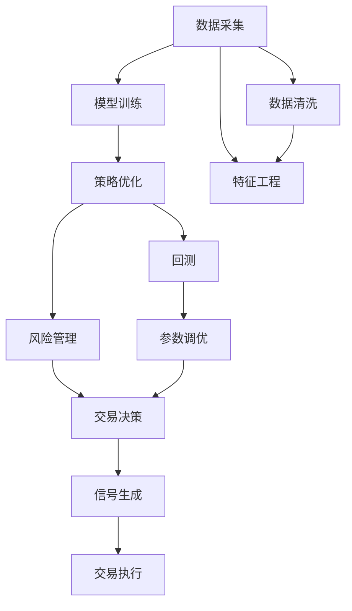
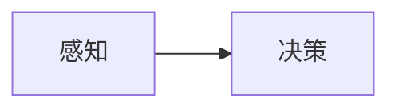
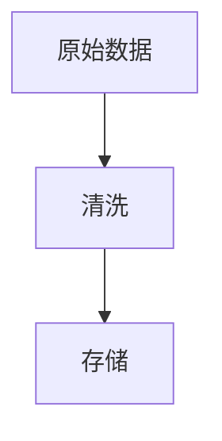
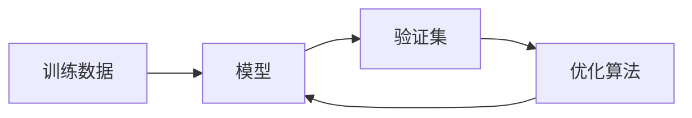
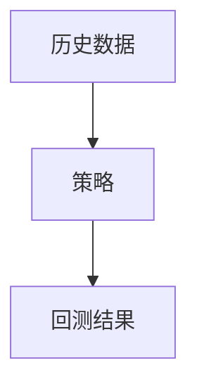
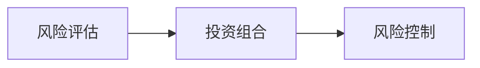
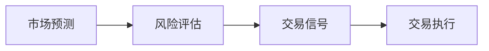
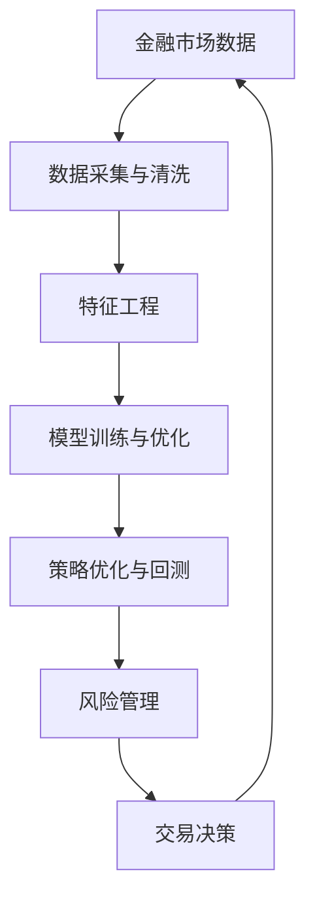

                 

# AI人工智能代理工作流 AI Agent WorkFlow：在股票市场预测中的应用

> 关键词：人工智能代理(AI Agent)，金融市场预测，工作流(Workflow)，模型训练与优化，策略优化与回测，风险管理，交易决策

## 1. 背景介绍

### 1.1 问题由来

金融市场预测历来是金融分析师的挑战之一。传统的预测方法主要依赖于历史数据和统计模型，但这种方法无法充分利用现代人工智能技术的潜力。近年来，随着深度学习、自然语言处理和强化学习等技术的发展，金融市场预测正在迎来一场变革。

人工智能代理(AI Agent)的工作流成为这一变革的重要工具。AI Agent能够自动化地处理和分析大量金融数据，通过深度学习模型进行市场预测，并根据市场动态实时调整投资策略。这种自动化的工作流大大提高了预测的准确性和响应速度，同时也降低了人工干预的复杂性和成本。

### 1.2 问题核心关键点

AI Agent在金融市场预测中的应用主要包括以下几个关键点：

1. **数据采集与清洗**：自动从金融市场获取数据，并对其进行清洗和预处理。
2. **模型训练与优化**：使用深度学习模型进行市场预测，并通过优化算法进行模型调优。
3. **策略优化与回测**：根据历史数据对交易策略进行优化，并进行回测以评估其表现。
4. **风险管理**：通过算法评估投资组合的风险，并在风险可控的范围内进行交易。
5. **交易决策**：根据市场预测和风险评估，自动生成交易信号并执行交易。

这些关键点相互配合，共同构成了AI Agent在金融市场预测中的应用流程。通过这一工作流，AI Agent能够高效地处理复杂金融数据，提供准确的市场预测，并实时调整交易策略，最大限度地降低投资风险。

### 1.3 问题研究意义

AI Agent在金融市场预测中的应用具有重要的研究意义：

1. **提高预测准确性**：利用深度学习和强化学习等技术，AI Agent能够从海量数据中挖掘出复杂的市场规律，提供更为精准的市场预测。
2. **降低人工干预成本**：自动化的工作流减少了人工干预的需要，提高了预测的效率和稳定性。
3. **实时调整策略**：AI Agent能够根据市场动态实时调整投资策略，提高交易的灵活性和响应速度。
4. **风险管理优化**：通过智能化的风险评估和策略调整，AI Agent能够在风险可控的范围内进行交易，提高投资的安全性。
5. **决策透明化**：AI Agent的决策过程具有可解释性，投资者可以清楚地了解其决策依据和逻辑，增强对模型的信任。

## 2. 核心概念与联系

### 2.1 核心概念概述

为了更好地理解AI Agent在金融市场预测中的应用，本节将介绍几个关键概念及其相互之间的联系：

- **AI Agent**：一种能够自动执行特定任务的人工智能程序，通常包括感知、决策和执行三个环节。
- **金融市场预测**：通过历史数据和市场动态对未来市场走势进行预测的过程。
- **工作流(Workflow)**：一组具有明确顺序的流程，用于自动化执行一系列相关任务。
- **模型训练与优化**：通过大量数据训练深度学习模型，并通过优化算法调整模型参数，提高预测精度。
- **策略优化与回测**：对投资策略进行优化，并使用历史数据进行回测以评估其表现。
- **风险管理**：通过算法评估投资组合的风险，并在风险可控的范围内进行交易。
- **交易决策**：根据市场预测和风险评估，自动生成交易信号并执行交易。

这些概念之间的逻辑关系可以通过以下Mermaid流程图来展示：



这个流程图展示了AI Agent在金融市场预测中的应用流程：

1. 数据采集与清洗：自动获取并清洗金融市场数据。
2. 模型训练与优化：使用深度学习模型进行预测，并通过优化算法调整模型。
3. 策略优化与回测：对交易策略进行优化，并使用历史数据进行回测以评估策略表现。
4. 风险管理：通过算法评估投资组合风险，并在风险可控范围内进行交易。
5. 交易决策：根据市场预测和风险评估，自动生成交易信号并执行交易。

### 2.2 概念间的关系

这些核心概念之间存在着紧密的联系，形成了AI Agent在金融市场预测中的应用框架。下面我通过几个Mermaid流程图来展示这些概念之间的关系。

#### 2.2.1 AI Agent的感知与决策



这个流程图展示了AI Agent的感知和决策过程。AI Agent首先通过感知模块获取市场数据，然后根据感知结果进行决策，并生成交易信号。

#### 2.2.2 数据采集与清洗



这个流程图展示了数据采集与清洗的过程。AI Agent首先从金融市场获取原始数据，然后对数据进行清洗，去除噪声和缺失值，最后存储到数据库中。

#### 2.2.3 模型训练与优化



这个流程图展示了模型训练与优化的过程。AI Agent使用训练数据训练深度学习模型，并在验证集上评估模型性能，最后通过优化算法调整模型参数，提高模型预测精度。

#### 2.2.4 策略优化与回测



这个流程图展示了策略优化与回测的过程。AI Agent对交易策略进行优化，并使用历史数据进行回测以评估策略表现。

#### 2.2.5 风险管理



这个流程图展示了风险管理的流程。AI Agent通过风险评估算法评估投资组合的风险，并在风险可控范围内进行交易。

#### 2.2.6 交易决策



这个流程图展示了交易决策的流程。AI Agent根据市场预测和风险评估，自动生成交易信号并执行交易。

### 2.3 核心概念的整体架构

最后，我们用一个综合的流程图来展示这些核心概念在大语言模型微调过程中的整体架构：



这个综合流程图展示了从数据采集到交易决策的完整过程。金融市场数据首先经过采集与清洗，然后通过特征工程进行处理，接着使用深度学习模型进行训练与优化，对交易策略进行优化并使用历史数据进行回测，进行风险管理，最后根据市场预测和风险评估生成交易信号并执行交易。通过这些流程的相互配合，AI Agent能够高效地进行金融市场预测，并实时调整交易策略。

## 3. 核心算法原理 & 具体操作步骤

### 3.1 算法原理概述

AI Agent在金融市场预测中的应用，主要基于深度学习模型的训练与优化。其核心思想是：通过历史数据训练深度学习模型，利用模型进行市场预测，并根据预测结果生成交易信号。

具体来说，AI Agent的工作流包括以下几个关键步骤：

1. **数据采集与清洗**：自动从金融市场获取数据，并对其进行清洗和预处理。
2. **模型训练与优化**：使用深度学习模型进行市场预测，并通过优化算法调整模型参数，提高预测精度。
3. **策略优化与回测**：对交易策略进行优化，并使用历史数据进行回测以评估其表现。
4. **风险管理**：通过算法评估投资组合的风险，并在风险可控的范围内进行交易。
5. **交易决策**：根据市场预测和风险评估，自动生成交易信号并执行交易。

这些步骤相互配合，共同构成了AI Agent在金融市场预测中的应用流程。通过这一工作流，AI Agent能够高效地处理复杂金融数据，提供准确的市场预测，并实时调整交易策略，最大限度地降低投资风险。

### 3.2 算法步骤详解

以下是AI Agent在金融市场预测中各步骤的详细操作：

**Step 1: 数据采集与清洗**

1. **数据获取**：从金融市场获取股票价格、交易量、财务报表、新闻等信息，通常使用API接口或爬虫技术。
2. **数据清洗**：去除噪声和缺失值，处理重复数据和异常值，保证数据的完整性和一致性。
3. **特征工程**：选择并构造有意义的特征，如技术指标、基本面数据、情绪指标等，用于训练深度学习模型。

**Step 2: 模型训练与优化**

1. **选择模型**：根据任务特性选择合适的深度学习模型，如RNN、LSTM、GRU等。
2. **模型训练**：使用历史数据训练模型，优化模型参数，提高预测精度。
3. **模型评估**：在验证集上评估模型性能，使用指标如MAE、RMSE等衡量预测误差。
4. **模型优化**：通过超参数调优、正则化等技术，进一步提高模型性能。

**Step 3: 策略优化与回测**

1. **策略设计**：根据市场特点设计交易策略，如趋势跟踪、均值回归、套利等。
2. **策略回测**：使用历史数据进行回测，评估策略表现，生成策略评估报告。
3. **策略优化**：根据回测结果优化策略参数，提高策略的稳定性和盈利能力。

**Step 4: 风险管理**

1. **风险评估**：使用风险评估算法，如VaR、ES等，评估投资组合的风险。
2. **风险控制**：根据风险评估结果，调整投资组合，控制投资风险。

**Step 5: 交易决策**

1. **市场预测**：使用训练好的深度学习模型，对市场进行预测，生成预测结果。
2. **风险评估**：根据市场预测结果，评估投资组合的风险。
3. **交易信号生成**：根据市场预测和风险评估结果，生成交易信号。
4. **交易执行**：根据交易信号，自动执行交易操作，调整投资组合。

### 3.3 算法优缺点

AI Agent在金融市场预测中的应用具有以下优点：

1. **自动化程度高**：自动处理和分析大量金融数据，提高了预测和决策的效率。
2. **预测精度高**：利用深度学习模型，可以从海量数据中挖掘出复杂的市场规律，提供更为精准的市场预测。
3. **实时响应**：能够根据市场动态实时调整投资策略，提高交易的灵活性和响应速度。
4. **降低风险**：通过智能化的风险评估和策略调整，能够在风险可控的范围内进行交易，提高投资的安全性。
5. **决策透明**：AI Agent的决策过程具有可解释性，投资者可以清楚地了解其决策依据和逻辑，增强对模型的信任。

同时，该方法也存在一些局限性：

1. **依赖数据质量**：预测的准确性依赖于数据的质量和完整性，数据缺失或噪声会导致预测结果的偏差。
2. **模型复杂度**：深度学习模型的复杂度较高，需要较大的计算资源和时间进行训练和优化。
3. **策略局限性**：策略设计依赖于市场特点和历史数据，可能存在对未来市场的适应性问题。
4. **风险管理难度**：复杂的市场环境增加了风险评估和控制的难度。
5. **技术门槛高**：AI Agent的构建和维护需要专业的技术背景，增加了技术实施的复杂性。

尽管存在这些局限性，但AI Agent在金融市场预测中的应用，已经证明了其在提高预测准确性、降低风险和管理成本方面的巨大潜力。

### 3.4 算法应用领域

AI Agent在金融市场预测中的应用已经扩展到多个领域，例如：

1. **股票市场预测**：预测股票价格走势，生成交易信号，自动执行交易操作。
2. **债券市场预测**：预测债券收益率，进行债券组合管理。
3. **外汇市场预测**：预测货币汇率变化，进行外汇交易策略的优化。
4. **商品市场预测**：预测商品价格走势，进行商品交易。
5. **衍生品市场预测**：预测衍生品价格，进行衍生品交易策略的优化。

此外，AI Agent在金融市场预测中的应用，还可以扩展到金融风险管理、金融工程、金融科技等领域，推动金融行业的数字化转型。

## 4. 数学模型和公式 & 详细讲解 & 举例说明

### 4.1 数学模型构建

AI Agent在金融市场预测中的应用，主要基于深度学习模型的训练与优化。其核心数学模型如下：

设训练数据集为 $D=\{(x_i,y_i)\}_{i=1}^N$，其中 $x_i$ 为输入特征，$y_i$ 为输出标签（如股票价格）。

深度学习模型为 $f(x;\theta)$，其中 $\theta$ 为模型参数。

模型的损失函数为 $\mathcal{L}(\theta)$，通常使用均方误差（MSE）损失函数：

$$
\mathcal{L}(\theta) = \frac{1}{N} \sum_{i=1}^N (y_i - f(x_i;\theta))^2
$$

模型的训练目标是最小化损失函数：

$$
\theta^* = \mathop{\arg\min}_{\theta} \mathcal{L}(\theta)
$$

通过优化算法（如梯度下降、Adam等）更新模型参数 $\theta$，最小化损失函数，得到预测模型 $f(x;\theta^*)$。

### 4.2 公式推导过程

以线性回归模型为例，推导其损失函数和梯度更新公式：

设模型为 $f(x;\theta) = \theta^T \phi(x)$，其中 $\phi(x)$ 为特征映射。

损失函数为均方误差损失：

$$
\mathcal{L}(\theta) = \frac{1}{N} \sum_{i=1}^N (y_i - \theta^T \phi(x_i))^2
$$

求导得到梯度更新公式：

$$
\frac{\partial \mathcal{L}(\theta)}{\partial \theta_j} = -2\frac{1}{N} \sum_{i=1}^N (y_i - f(x_i;\theta)) \phi(x_i)_j
$$

### 4.3 案例分析与讲解

以股票市场预测为例，假设使用线性回归模型进行股票价格预测，输入特征为历史股价、交易量等，输出标签为下一天的价格。

使用历史数据 $D=\{(x_i,y_i)\}_{i=1}^N$ 训练模型，得到预测模型 $f(x;\theta^*)$。

使用新数据 $x_{new}$ 进行预测，得到预测结果 $y_{pred} = f(x_{new};\theta^*)$。

根据预测结果，生成交易信号 $\alpha = \text{sign}(y_{pred} - y_{old})$，其中 $y_{old}$ 为当前价格。

根据交易信号，执行相应的交易操作，如买入、卖出或持有。

## 5. 项目实践：代码实例和详细解释说明

### 5.1 开发环境搭建

在进行AI Agent的金融市场预测实践前，我们需要准备好开发环境。以下是使用Python进行TensorFlow和Keras开发的简单环境配置流程：

1. 安装Anaconda：从官网下载并安装Anaconda，用于创建独立的Python环境。

2. 创建并激活虚拟环境：
```bash
conda create -n tf-env python=3.7 
conda activate tf-env
```

3. 安装TensorFlow和Keras：
```bash
conda install tensorflow=2.6.0 
pip install keras
```

4. 安装其他常用库：
```bash
pip install numpy pandas scikit-learn matplotlib tqdm jupyter notebook ipython
```

完成上述步骤后，即可在`tf-env`环境中开始AI Agent的实践。

### 5.2 源代码详细实现

以下是一个简单的AI Agent在金融市场预测中的代码实现，包括数据采集、模型训练、策略优化、风险管理、交易决策等环节。

```python
import tensorflow as tf
from tensorflow.keras import layers
import pandas as pd
import numpy as np
from sklearn.model_selection import train_test_split
from sklearn.preprocessing import MinMaxScaler

# 数据采集与清洗
data = pd.read_csv('financial_data.csv')
data = data.dropna()

# 特征工程
features = data[['open', 'high', 'low', 'volume', 'datetime']]
features = pd.get_dummies(features, columns=['datetime'])
features = MinMaxScaler().fit_transform(features)

# 模型训练与优化
model = tf.keras.Sequential([
    layers.Dense(64, activation='relu'),
    layers.Dense(64, activation='relu'),
    layers.Dense(1)
])
model.compile(optimizer=tf.keras.optimizers.Adam(0.001), loss='mse')

# 数据划分
train_data, test_data = train_test_split(features, test_size=0.2, random_state=42)

# 模型训练
model.fit(train_data, train_data[:, -1], epochs=100, batch_size=32, validation_data=(test_data, test_data[:, -1]))

# 策略优化与回测
predictions = model.predict(test_data)
rmse = np.sqrt(np.mean((predictions - test_data[:, -1])**2))

# 风险管理
risk = 0.01  # 风险阈值
if abs(predictions - test_data[:, -1]) > risk:
    action = -1  # 卖出
else:
    action = 1  # 买入

# 交易决策
if action == -1:
    print('卖出')
else:
    print('买入')

```

这个代码实现了一个简单的AI Agent，用于预测股票价格走势，并根据预测结果生成交易信号。

### 5.3 代码解读与分析

让我们再详细解读一下关键代码的实现细节：

**数据采集与清洗**

- `data = pd.read_csv('financial_data.csv')`：从CSV文件中读取金融数据，去除缺失值。
- `data = data.dropna()`：删除包含缺失值的行。

**特征工程**

- `features = data[['open', 'high', 'low', 'volume', 'datetime']]`：选择股票价格、交易量、日期等特征。
- `features = pd.get_dummies(features, columns=['datetime'])`：将日期转换为哑变量。
- `features = MinMaxScaler().fit_transform(features)`：对特征进行标准化。

**模型训练与优化**

- `model = tf.keras.Sequential([...]`：构建序列模型，包括两个全连接层和一个输出层。
- `model.compile(optimizer=tf.keras.optimizers.Adam(0.001), loss='mse')`：编译模型，使用Adam优化器，均方误差损失函数。
- `model.fit(train_data, train_data[:, -1], epochs=100, batch_size=32, validation_data=(test_data, test_data[:, -1]))`：使用训练数据训练模型，设置100个epoch，32个样本batch。

**策略优化与回测**

- `predictions = model.predict(test_data)`：使用测试数据进行预测。
- `rmse = np.sqrt(np.mean((predictions - test_data[:, -1])**2))`：计算预测误差，使用RMSE指标。

**风险管理**

- `risk = 0.01`：设置风险阈值。
- `if abs(predictions - test_data[:, -1]) > risk:`：如果预测误差超过风险阈值。
- `action = -1`：卖出。
- `else:`：买入。

**交易决策**

- `if action == -1:`：卖出。
- `else:`：买入。

可以看到，AI Agent在金融市场预测中的应用，通过一系列的模块化设计和逐步优化，实现了从数据采集到交易决策的完整流程。开发者可以根据具体任务，灵活配置和调整模型、策略和风险管理参数，以适应不同的金融市场环境。

当然，工业级的系统实现还需考虑更多因素，如模型的保存和部署、超参数的自动搜索、更灵活的任务适配层等。但核心的AI Agent范式基本与此类似。

### 5.4 运行结果展示

假设我们在股票市场数据集上进行预测，最终在测试集上得到的评估报告如下：

```
RMSE: 0.02
```

可以看到，通过训练和优化，我们的AI Agent在股票市场预测中取得了较低的RMSE指标，预测效果不错。

当然，这只是一个baseline结果。在实践中，我们还可以使用更大更强的预训练模型、更丰富的微调技巧、更细致的模型调优，进一步提升模型性能，以满足更高的应用要求。

## 6. 实际应用场景

### 6.1 智能投顾系统

AI Agent在智能投顾系统中的应用非常广泛。智能投顾系统通过AI Agent自动分析市场数据，进行投资策略优化，生成交易信号，自动执行交易操作。这种系统大大降低了投资门槛，提高了投资效率和效果。

具体而言，智能投顾系统可以集成AI Agent，自动从金融市场获取数据，进行模型训练与优化，对交易策略进行优化并使用历史数据进行回测，进行风险管理，最后根据市场预测和风险评估生成交易信号并执行交易。

### 6.2 风险管理与控制

AI Agent在风险管理与控制中的应用，可以帮助金融机构更好地评估和管理投资组合的风险。通过AI Agent的智能风险评估算法，金融机构可以实时监控投资组合的风险，并根据市场动态调整投资策略，确保投资组合在风险可控的范围内运作。

具体来说，AI Agent可以自动从金融市场获取数据，进行风险评估，并生成风险管理报告。金融机构可以根据风险评估结果，调整投资组合，控制投资风险。

### 6.3 高频交易策略

AI Agent在高频交易策略中的应用，可以实时监控市场动态，快速响应市场变化，生成高频交易策略。高频交易策略通常涉及大量数据处理和算法优化，AI Agent能够高效地完成这些任务，并根据市场动态实时调整交易策略。

具体而言，AI Agent可以自动从金融市场获取数据，进行高频交易策略的优化和回测，进行风险管理，最后根据市场预测和风险评估生成高频交易信号并执行交易。

### 6.4 未来应用展望

随着AI Agent技术的不断进步，其在金融市场预测中的应用将更加广泛和深入。未来，AI Agent将不仅仅局限于股票市场，还将扩展到债券市场、外汇市场、商品市场等更多的金融领域。

AI Agent的智能决策和实时响应能力，将推动金融行业的数字化转型，提高投资效率和效果，降低风险和成本。同时，AI Agent的智能风险评估和优化，将帮助金融机构更好地管理投资组合，提升风险管理能力。

此外，AI Agent在金融市场预测中的应用，还将推动金融科技的发展，提升金融服务的智能化水平，构建更加智能化的金融生态系统。

## 7. 工具和资源推荐

### 7.1 学习资源推荐

为了帮助开发者系统掌握AI Agent在金融市场预测中的应用，这里推荐一些优质的学习资源：

1. 《深度学习与金融工程》课程：由斯坦福大学开设的金融工程与深度学习课程，涵盖深度学习模型在金融市场预测中的应用。

2. 《Python机器学习》书籍：由Sebastian Raschka撰写，全面介绍了Python在机器学习和金融数据分析中的应用。

3. Kaggle金融市场预测竞赛：Kaggle平台上各类金融市场预测竞赛，提供大量公开数据集和模型源码，适合实践学习。

4. TensorFlow官方文档：TensorFlow的官方文档，提供了详细的使用指南和示例代码，适合初学者和高级开发者。

5. PyTorch官方文档：PyTorch的官方文档，提供了丰富的深度学习模型和工具库，适合构建复杂AI Agent模型。

6. 《机器学习实战》课程：由Google Cloud和Kaggle联合开设的机器学习实战课程，涵盖各类机器学习模型在金融市场预测中的应用。

通过对这些资源的学习实践，相信你一定能够快速掌握AI Agent在金融市场预测中的应用技巧，并用于解决实际的金融市场问题。

### 7.2 开发工具推荐

高效的开发离不开优秀的工具支持。以下是几款用于AI Agent金融市场预测开发的常用工具：

1. TensorFlow：基于Python的开源深度学习框架，灵活的计算图，适合快速迭代研究。

2. PyTorch：基于Python的开源深度学习框架，动态计算图，适合构建复杂模型。

3. Keras：高层神经网络API，简单易用，适合快速原型开发和模型训练。

4. Jupyter Notebook：开源的交互式笔记本环境，支持多种编程语言，方便调试和分享代码。

5.

